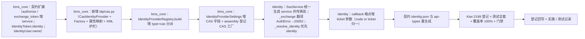

# 03 实施 · CAS 兼容适配

> 认证与安全 · 02 SSO 与身份联邦 · 子任务 03（需求 02-3）· 实施记录

[文档首页](../../../../../../文档首页.md) › [02 SSO 与身份联邦](../../02_SSO与身份联邦.md) › 实施记录　|　[← 任务](../02_SSO与身份联邦_03_CAS兼容适配.md)　[测试记录 →](../测试/03_测试_03_CAS兼容适配.md)

## 1. 实施信息 

| 项 | 值 |
| --- | --- |
| 任务 | [03 CAS 兼容适配](../02_SSO与身份联邦_03_CAS兼容适配.md) |
| 对应需求 | [02-3](../../../../需求/02_需求_SSO与身份联邦.md#r02-3) |
| 详细设计 | [03 详细设计](../设计/03_详细设计_03_CAS兼容适配.md) |
| 实施日期 | 2026-09-27 |
| 实施人 | minjian |
| 实施环境 | 本地开发机（Python 3.14.4 / uv；ASGI 内存客户端；SQLite 租户库 / 平台库 + `httpx.MockTransport` 模拟 CAS `serviceValidate`） |
| 提交 | bms：`docs(02_03)`（详细设计）/ `feat(02_03)`（代码）/ `docs(02_03)`（记录与回写）；test：`docs(kiwi)`（用例登记） |
| 结论 | 完成（12 项设计决策全按确认执行；新增 / 变更代码覆盖率 100%；全量 1541 passed / 37 skipped；契约 / 基座 / 预检全绿） |

## 2. 实施概览 

## 3. 实施过程 

1. **契约扩展（`bms_core/idp/base.py`）**：`BaseIdentityProvider.authorize` / `exchange_token` 各增可选 `service`（默认实现忽略，向后兼容）；`IdentityToken` 增可选 `identity`（协议可直接回填身份，CAS 用）；`IdentityUser` 增可选 `name`（显示名）；模块加 `from __future__ import annotations` 支持前向引用。`OidcIdentityProvider` / `NullIdentityProvider` 同步签名（`del service` 保持行为不变）。
2. **CAS 客户端（`bms_core/idp/cas.py`）**：新增 `CasIdentityProvider`（`plugin_name = "cas"`）——`authorize` 拼装 `{server_url}{login_path}?service=…`；`exchange_token` 调 `serviceValidate`（默认 CAS 3.0 `p3/serviceValidate`）解析 `authenticationSuccess` / `authenticationFailure`；属性映射 principal→subject + username/name/email（内置默认候选，行配置覆盖，多值取首）；XML 解析前置拒 `<!DOCTYPE` / `<!ENTITY` 并限制响应体积（256 KiB）；`userinfo` 抛 `ConfigError`。新增 `CasIdentityProviderFactory`（读 `[identity_provider]` CAS 字段）与 `normalize_attribute_map`。
3. **行配置分派（`bms_core/idp/registry.py`）**：`build` 增 `type="cas"` → `_build_cas`（`cas_server_url` / `redirect_uri` 必填，路径与 `attribute_map` 可配、非法即 `ConfigError`）。
4. **配置与装配（`bms_core/core/config.py` / `assembly.py` / `config.toml`）**：`IdentityProviderSettings` 增 CAS 字段；assembly 增 `register_plugin("identity_provider", "cas", CasIdentityProviderFactory(settings))`；`[identity_provider]` 增 CAS 注释键（缺省不启用）。
5. **SSO 链路（`bms_identity/services/sso.py`）**：`authorize` 统一构造 `service = {redirect_uri}?state={state}` 并传入 provider；`callback` 增 `state`（默认空串，兼容既有直调用例），`_exchange` 增 `service` 且翻译 CAS `AuthError` → `SsoCallbackError`（20052）；`_resolve_identity` 优先消费 `token.identity`（CAS），否则走既有 ID Token / userinfo（OIDC）；新增 helper `_build_service_url`。
6. **回调端点（`bms_identity/api/sso.py`）**：`callback` 增 `ticket` 查询参数，`code or ticket` 归一、`state` 传入服务层；OIDC 仍走 `code`。
7. **契约与生成件**：`ops.contract_snapshot export` 重生成 `deploy/contracts/identity.json`（callback 增 `ticket`，非破坏新增）；`pnpm run api-types:gen` 重生成 `frontend/packages/api-types/src/identity.ts`；gateway / event / api-types check 零漂移。
8. **测试（Kiwi 2199 先登记后编码）**：新增 `libs/bms_core/tests/idp/test_cas.py`（客户端 / 映射 / 安全护栏 / 工厂）；扩展 `libs/bms_core/tests/idp/test_registry.py`（cas 分派 / 缺参 / 非法映射）；新增 `services/identity/tests/sso/test_cas.py`（端到端 JIT + 失败分支）；`sso/helpers.py` 增 `CasMock`，`sso/conftest.py` 增按路径分派传输与 `seed_provider(type=…)`；`services/identity/tests/idp/test_idp.py` 的 `_PlainProvider` 随契约扩展对齐；`sso/test_units.py` 补 `_build_service_url` 边界。
9. **验证**：全量 `pytest` **1541 passed / 37 skipped**；新增 / 变更模块覆盖率 **100%**（`bms_core.idp.base` 73 / `cas` 153 / `registry` 92 / `bms_identity.services.sso` 181 / `api.sso` 103，0 缺失）；`ruff check` / `ruff format --check` / `pyright` 全绿；契约 / 网关 / 事件契约 / api-types 零漂移；`check-backend-base` / `check-base` / `check-service-boundaries` / `check-status` / `preflight --fast` 全绿。
10. **登记回写**：《后端基类清单》身份源条目（CAS 真实实现 + `service` / `identity` / `name` 契约扩展 + 继承链 + 模块表行）；架构 14 §4 CAS 适配口径；概要 26 §2.2 CAS 适配落地注记；契约与 api-types 生成件；任务 / 父任务 / 计划状态与工时；消费方契约标注（`02_04` / `02_06` / 域五 / 阶段八）；Kiwi cases / exports 与台账。

## 4. 问题与处置 

| # | 问题 / 现象 | 原因 | 处置与落点 |
| --- | --- | --- | --- |
| 1 | CAS 登录 URL 的 `service` 携带 `state`，通用 `start_flow`（解析顶层 `state`）取不到 | CAS 将 `state` 编进 `service` 查询串，回跳顶层只有 `ticket` | 测试新增 `_start_cas_flow` 从 `service` 内层查询串解析 `state`；链路侧不变（设计 §3.5） |
| 2 | `login_path` / `cas_login_path` 相对 `cas_server_url`（含上下文路径）拼接 | 端点路径语义相对服务基址 | 测试断言改为完整路径 `/cas/sso/login`；实现不变 |
| 3 | `check-backend-base` 继承链对账曾报 `CasIdentityProviderFactory` 链条不符 | `BasePluginFactory` 实际继承 `BaseFactory[None, ProductT]`，非 `BaseObject` | 移除该行（CAS 客户端已列入身份源继承链；工厂类不入 §10 链条） |
| 4 | 单元测试 `start_flow`（OIDC）与 CAS 混用同一 `idp` / `cas` MockTransport | 需按协议路径分派出站请求 | `conftest` 的 `ProviderRegistry` 传输按 `/p3/serviceValidate` 分派 `CasMock`，其余走 `IdpMock` |

## 5. 验证结果 

| 项 | 方法 | 结果 |
| --- | --- | --- |
| 单元 / 集成全量 | `cd backend && uv run pytest -q` | **1541 passed，37 skipped** |
| 定向（idp / SSO） | `uv run pytest libs/bms_core/tests/idp services/identity/tests/sso services/identity/tests/idp -q` | 83 passed，1 skipped |
| 新增 / 变更模块覆盖率 | `--cov=bms_core.idp.{base,cas,registry}` + `bms_identity.{services.sso,api.sso}` | **100%**（73 / 153 / 92 / 181 / 103，0 缺失） |
| 静态检查 | `uv run ruff check .` / `ruff format --check .` | All checks passed / 全部已格式化 |
| 类型检查 | `uv run pyright` | 0 errors / 0 warnings |
| 契约与生成件 | `ops.contract_snapshot check` / `ops.gateway_config check` / `ops.event_contracts check` / api-types `gen:check` | 全绿零漂移 |
| 基座与边界 | `check-backend-base.py` / `check-base.py` / `check-service-boundaries.py` / `check-status.py` | 全绿 |
| 预检 | `preflight --fast` | **全部通过** |

## 6. 偏差与遗留 

- **偏差（设计回写见设计 §9）**：
  1. `IdentityToken.identity` 落地时同步为 `IdentityUser` 增 `name` 字段（属性映射姓名所需；设计 §3.2 已含）。
  2. `BaseIdentityProvider.authorize` / `exchange_token` 的 `service` 参数对 OIDC / 占位实现以 `del` 显式忽略（保持行为不变，pyright 归零）。
  3. 测试 `start_flow` 不适用于 CAS，新增 CAS 专用流程启动 helper（测试侧适配，非产品行为变更）。
- **遗留（均已登记归口）**：
  1. 真实 CAS IdP 联调（本期以 mock CAS 夹具联调）——**归口：凭据就绪时（与域 02_04 同口径）**。
  2. CAS 单点登出（SLO）/ proxy 代理票 / SAML——**归口：后续阶段**（见设计 §7）。
  3. CAS 行配置键的管理面校验与连通性测试——**归口：02_06**（已在消费方契约标注）。
  4. 登录页 CAS 入口与失败提示——**归口：域五（前端）**。
  5. CAS 登录失败结构化日志 / `sys_login_log`——**归口：阶段八**。

> 本文档依《[文档生成规范](../../../../../../规范/文档生成规范.md)》编写
