# 04 实施 · 企业微信 / 钉钉免登适配

> 认证与安全 · 02 SSO 与身份联邦 · 子任务 04（需求 02-4）· 实施记录

[文档首页](../../../../../../文档首页.md) › [02 SSO 与身份联邦](../../02_SSO与身份联邦.md) › 实施记录　|　[← 任务](../02_SSO与身份联邦_04_企业微信钉钉免登适配.md)　[测试记录 →](../测试/04_测试_04_企业微信钉钉免登适配.md)

## 1. 实施信息 

| 项 | 值 |
| --- | --- |
| 任务 | [04 企业微信 / 钉钉免登适配](../02_SSO与身份联邦_04_企业微信钉钉免登适配.md) |
| 对应需求 | [02-4](../../../../需求/02_需求_SSO与身份联邦.md#r02-4) |
| 详细设计 | [04 详细设计](../设计/04_详细设计_04_企业微信钉钉免登适配.md) |
| 实施日期 | 2026-09-27 |
| 实施人 | minjian |
| 实施环境 | 本地开发机（Python 3.14.4 / uv；ASGI 内存客户端；SQLite 租户库 / 平台库 + `httpx.MockTransport` 模拟企微 / 钉钉接口） |
| 提交 | bms：`docs(02_04)`（详细设计）/ `feat(02_04)`（代码）/ `docs(02_04)`（记录与回写）；test：`docs(kiwi)`（用例登记） |
| 结论 | 完成（11 项设计决策全按确认执行；新增 / 变更代码覆盖率 100%；全量 1563 passed / 37 skipped；契约 / 基座 / 预检全绿） |

```mermaid
flowchart LR
    A["bms_core：error_codes 增 20057~20062 + exceptions 增 EnterpriseIdpError 子段"] --> B["bms_core：新增 idp/wecom.py（WecomIdentityProvider + Factory + 令牌缓存）"]
    B --> C["bms_core：新增 idp/dingtalk.py（DingtalkIdentityProvider + Factory + 新版 OAuth2）"]
    C --> D["bms_core：IdentityProviderRegistry.build 增 wecom / dingtalk 分派"]
    D --> E["bms_core：IdentityProviderSettings 增字段 + assembly 登记两工厂 + config.toml"]
    E --> F["identity：SsoService 抽 authorize_info；_exchange 优先放行 EnterpriseIdpError"]
    F --> G["identity：新增 authorize-url 端点 + SsoAuthorizeInfo"]
    G --> H["契约 identity.json 与 api-types 重生成"]
    H --> I["Kiwi 2200 / 2201 登记 + 测试全套 + 覆盖率 100% + 门禁"]
    I --> J["登记回写 + 实施 / 测试记录"]
```

## 2. 实施概览 

## 3. 实施过程 

1. **错误码与异常（`bms_core/core/`）**：`error_codes.py` 增 `WECOM_CONFIG=20057` ~ `DINGTALK_UNAVAILABLE=20062`；`exceptions.py` 增 `EnterpriseIdpError(SsoError)` 子段基与六个子类（配置 503 / 授权 400 / 不可达 503，各自预置码位）。
2. **企业微信客户端（`bms_core/idp/wecom.py`）**：新增 `WecomIdentityProvider`（`plugin_name = "wecom"`）——`authorize` 按 `mode` 分支（`qr` 新版扫码登录链接 `login.work.weixin.qq.com/wwlogin/sso/login`；`oauth` 内嵌 H5 网页授权 `open.weixin.qq.com/connect/oauth2/authorize` + `#wechat_redirect`）；`exchange_token` 以应用 `access_token`（`gettoken`，进程内缓存 + 提前过期余量）调 `cgi-bin/auth/getuserinfo`，企业成员取 `userid`、非成员回落 `openid`，经 `IdentityToken.identity` 一次回填；`gettoken` 凭据类 `errcode` → `WecomConfigError`，`getuserinfo` `errcode` / 无主体 → `WecomAuthError`，网络 / 非 2xx / 非 JSON → `WecomUnavailableError`；`userinfo` 抛 `ConfigError`（无独立时序）。新增 `WecomIdentityProviderFactory`（读 `[identity_provider]`，缺 `corp_id` / `agent_id` / `secret` `PluginError`）与模块 helper。
3. **钉钉客户端（`bms_core/idp/dingtalk.py`）**：新增 `DingtalkIdentityProvider`（`plugin_name = "dingtalk"`）——`authorize` 构造新版 OAuth2 入口（`client_id` / `scope` / `prompt` / `state` / `redirect_uri`）；`exchange_token` 调 `v1.0/oauth2/userAccessToken` 换用户级令牌（透出 `accessToken` / `expireIn` / `refreshToken`）；`userinfo` 携带 `x-acs-dingtalk-access-token` 调 `v1.0/contact/users/me`，`unionId` 优先、回落 `openId`；出站按状态码区分（4xx → `DingtalkAuthError`；5xx / 网络 / 非 JSON → `DingtalkUnavailableError`）。新增 `DingtalkIdentityProviderFactory` 与 helper。
4. **行配置分派（`bms_core/idp/registry.py`）**：`build` 增 `type="wecom"` / `"dingtalk"` → `_build_wecom` / `_build_dingtalk`（必填校验捕获 `ConfigError` 转抛 `WecomConfigError` / `DingtalkConfigError`；`mode` 仅 `qr` / `oauth`，非法转抛 `WecomConfigError`；密钥引用经解析器转内存明文）。
5. **配置与装配（`bms_core/core/config.py` / `assembly.py` / `config.toml`）**：`IdentityProviderSettings` 增企微 / 钉钉字段；assembly 增 `register_plugin("identity_provider", "wecom"/"dingtalk", …Factory(settings))`；`[identity_provider]` 增企微 / 钉钉注释键（缺省不启用，密钥经环境变量注入）。
6. **SSO 链路（`bms_identity/services/sso.py`）**：抽 `authorize_info(...) -> SsoAuthorizeResult`（授权 URL / `state` / `expires_in`），`authorize` 变薄封装（302 行为不变）；`_exchange` 增 `except EnterpriseIdpError: raise`（在 `ServiceUnavailableError` / `AuthError` / `ConfigError` 之前），保证企微 / 钉钉专用码不被既有翻译覆盖；新增结果契约 `SsoAuthorizeResult`。
7. **授权 URL 端点（`bms_identity/api/sso.py` + `schemas/sso.py`）**：新增 `GET /api/v1/auth/sso/{idp_key}/authorize-url`（公开，租户解析与限流同 `authorize`），返回 `SsoAuthorizeInfo`（`authorize_url` / `state` / `expires_in`）供前端渲染二维码 / 初始化平台内嵌登录组件。
8. **契约与生成件**：`ops.contract_snapshot export` 重生成 `deploy/contracts/identity.json`（新增 `authorize-url` 端点，非破坏新增；9 份快照仅 identity 变更）；`pnpm run api-types:gen` 重生成 `frontend/packages/api-types/src/identity.ts`；网关 / 事件 / api-types check 零漂移。
9. **测试（Kiwi 2200 / 2201 先登记后编码）**：新增 `libs/bms_core/tests/idp/test_wecom.py`（授权双形态 / 令牌缓存 / 成员与非成员 / 凭据与授权失败 / 不可达 / 工厂）、`test_dingtalk.py`（授权 URL / 换令牌 / 用户信息 unionId 优先与回落 / 4xx 与 5xx / 工厂）；扩展 `test_registry.py`（wecom / dingtalk 分派与必填 / `mode` 非法）；新增 `services/identity/tests/sso/test_wecom.py` / `test_dingtalk.py`（authorize-url 契约 + 302 回归 + mock 端到端 JIT + 20057~20062 / 20054 分支）；`sso/helpers.py` 增 `WecomMock` / `DingtalkMock`，`sso/conftest.py` 增按路径分派与 `seed_provider(type=…)`。
10. **验证**：全量 `pytest` **1563 passed / 37 skipped**；新增 / 变更模块覆盖率 **100%**（`bms_core.idp.wecom` 107 / `dingtalk` 85 / `registry` 120 / `bms_identity.services.sso` 195 / `api.sso` 112 / `schemas.sso` 37，0 缺失）；`ruff check` / `ruff format --check` / `pyright` 全绿；契约 / 网关 / 事件契约 / api-types 零漂移；`check-backend-base` / `check-base` / `check-links` / `check-service-boundaries` / `check-status` / `preflight --fast` 全绿。
11. **登记回写**：《后端基类清单》身份源条目（企微 / 钉钉真实实现 + 继承链 + 模块表行 + 错误子段）；架构 09「错误码分段」已发布码位补 `20057`~`20062`；架构 14 §4 企微 / 钉钉适配口径；概要 26 §2.2 / §5.1 / §7.1；任务 / 父任务 / 计划状态与工作量；消费方契约标注（`02_06` / 域五 / 阶段八 / 前端 i18n）；Kiwi cases / exports。

## 4. 问题与处置 

| # | 问题 / 现象 | 原因 | 处置与落点 |
| --- | --- | --- | --- |
| 1 | 企微应用令牌被 `gettoken` 频率拦截的风险 | 企微文档明确 `gettoken` 不能频繁调用 | 适配器内置进程内缓存（按 `expires_in - 120s` 提前过期）；用例断言二次换取复用缓存（`gettoken` 只调一次）。跨实例共享缓存登记为开放项（设计 §7） |
| 2 | `check-backend-base` 报 `SsoAuthorizeResult` 未登记 / 继承链未覆盖两实现 | 新增 `BaseObject` 数据契约与身份源实现未同步《后端基类清单》 | 清单补登 `SsoAuthorizeResult`、`WecomIdentityProvider` / `DingtalkIdentityProvider` 及 `EnterpriseIdpError` 子段；复跑通过 |
| 3 | `EnterpriseIdpError` 若继承 `AuthError`，在 `_exchange` 会被 `except AuthError` 覆盖为 20052 | 异常 MRO 命中既有翻译分支 | `_exchange` 增 `except EnterpriseIdpError: raise` 前置分支，专用码原样放行；对 OIDC / CAS 零影响（其抛的是 `AuthError` 等基础类型） |
| 4 | 钉钉 `nick` 为中文时 JIT 派生用户名为空 | `clean_username` 仅保留 `[a-z0-9._-]` | 复用 JIT 既有回落（清洗为空则取 `subject`），无需改动；用例以 `unionId` 作外部主体、用户名回落主体 |
| 5 | 契约快照新增端点 | 公开契约变更 | 重生成 `identity.json` 与 api-types，非破坏新增；`contract_snapshot check` / `api-types gen:check` 零漂移 |

## 5. 验证结果 

| 项 | 方法 | 结果 |
| --- | --- | --- |
| 单元 / 集成全量 | `cd backend && uv run pytest -q` | **1563 passed，37 skipped** |
| 定向（idp / SSO） | `uv run pytest libs/bms_core/tests/idp services/identity/tests/sso -q` | 全绿 |
| 新增 / 变更模块覆盖率 | `--cov=bms_core.idp.{wecom,dingtalk,registry}` + `bms_identity.{services.sso,api.sso,schemas.sso}` | **100%**（107 / 85 / 120 / 195 / 112 / 37，0 缺失） |
| 静态检查 | `uv run ruff check .` / `ruff format --check .` | All checks passed / 全部已格式化 |
| 类型检查 | `uv run pyright` | 0 errors / 0 warnings |
| 契约与生成件 | `ops.contract_snapshot check` / `ops.gateway_config check` / `ops.event_contracts check` / api-types `gen:check` | 全绿零漂移 |
| 基座与边界 | `check-backend-base.py` / `check-base.py` / `check-links.py` / `check-service-boundaries.py` / `check-status.py` | 全绿 |
| 预检 | `preflight --fast` | **全部通过** |

## 6. 偏差与遗留 

- **偏差（设计回写见设计 §9 与本表）**：
  1. 授权 URL 结果契约命名落为 `SsoAuthorizeResult`（服务层）与 `SsoAuthorizeInfo`（API DTO），与设计一致；《后端基类清单》按契约补登（非设计偏差，登记补齐）。
  2. `_exchange` 前置放行 `EnterpriseIdpError`（设计 §3.6 已述），落实为单条 `except EnterpriseIdpError: raise`。
  3. 钉钉 `exchange_token` 只换用户令牌、身份经 `userinfo` 回填（复用 OIDC 回退路径），企微身份经 `token.identity` 回填；两路均不改 `BaseIdentityProvider`（设计 §3.3 已定）。
- **遗留（均已登记归口）**：
  1. 企业微信 / 钉钉**真实企业凭据联调**与**移动端内嵌 H5 免登**——**归口：阶段十七**（凭据就绪可提前真跑）。
  2. 企微 / 钉钉行配置键的管理面写入校验与**连通性测试**——**归口：02_06**。
  3. 登录页企微 / 钉钉入口渲染与失败提示、**扫码前端轮询状态机与换取会话**——**归口：域五 `05_01` / `05_04`**（后端已冻结 `providers` / `authorize-url` / `callback` 契约）。
  4. 前端 i18n 补 `error.20057`~`error.20062` 文案——**归口：域五 / 域六（契约与 i18n）**。
  5. 企微敏感信息（手机 / 邮箱，需 `mode=oauth` + `snsapi_privateinfo` + `getuserdetail`）、钉钉旧版兼容、企微令牌跨实例缓存——**归口：后续任务（计划 §7 第 16 项）**。
  6. 登录失败结构化日志 / `sys_login_log`——**归口：阶段八**。

> 本文档依《[文档生成规范](../../../../../../规范/文档生成规范.md)》编写
