# 05 实施 · BMS 兼作 IdP 与客户端注册

> 认证与安全 · 02 SSO 与身份联邦 · 子任务 05（需求 02-5）· 实施记录

[文档首页](../../../../../../文档首页.md) › [02 SSO 与身份联邦](../../02_SSO与身份联邦.md) › 实施记录　|　[← 任务](../02_SSO与身份联邦_05_BMS兼作IdP与客户端注册.md)　[测试记录 →](../测试/05_测试_05_BMS兼作IdP与客户端注册.md)

## 1. 实施信息 

| 项 | 值 |
| --- | --- |
| 任务 | [05 BMS 兼作 IdP 与客户端注册](../02_SSO与身份联邦_05_BMS兼作IdP与客户端注册.md) |
| 对应需求 | [02-5](../../../../需求/02_需求_SSO与身份联邦.md#r02-5) |
| 详细设计 | [05 详细设计](../设计/05_详细设计_05_BMS兼作IdP与客户端注册.md) |
| 实施日期 | 2026-09-27 |
| 实施人 | minjian |
| 实施环境 | 本地开发机（Python 3.14.4 / uv；ASGI 内存客户端；SQLite 租户库 / 平台库 + joserfc 真实签验） |
| 提交 | bms：`docs(02_05)`（详细设计）/ `feat(02_05)`（代码）/ `docs(02_05)`（记录与回写）；test：`docs(kiwi)`（用例登记） |
| 结论 | 完成（18 项设计决策全按确认执行；新增 / 变更代码覆盖率 100%；契约 / 基座 / 预检全绿） |

```mermaid
flowchart LR
    A["数据表：sys_client 表文件 + 总览登记 + table_registry 启用"] --> B["bms_core：idp_state_store 增 namespace（一次性授权码复用）"]
    B --> C["bms_core：oauth/oidc_provider 契约 + oidc_jwt 真实实现 + Null + 工厂"]
    C --> D["bms_core：错误码 801xx / OidcError·ClientError 子段 / [oidc_provider] 配置 / 装配"]
    D --> E["identity：SysClient 模型 + 0003 迁移 + 仓储 + schemas"]
    E --> F["identity：OidcProviderService + ClientService + oidc / clients 端点 + 路由"]
    F --> G["ops 种子 + 契约 identity.json 与 api-types 重生成"]
    G --> H["Kiwi 2202 登记 + 测试全套 + 覆盖率 100% + 门禁"]
    H --> I["登记回写 + 实施 / 测试记录"]
```

## 2. 实施概览 

## 3. 实施过程 

1. **数据表（《数据库设计》）**：新增 `sys_client` 表文件（identity 租户库；`client_id` 租户内唯一、`client_secret_hash` 可空、`redirect_uris` / `grant_types` / `scopes` / `ip_whitelist` 用 `TEXT` 存 JSON）；总览 §7.3 登记；`table_registry` 中 `sys_client` 由 `PLANNED` 转 `ENABLED`（进 `identity:tenant` 链）。
2. **流程状态命名空间（`bms_core/idp/state/*`）**：`save` / `consume` / `delete` 与 `build_idp_state_key` 增可选 `namespace`（键 `bms:{租户}:{命名空间}:{state}`，默认 `idpstate`）；`MemoryIdpStateStore` 键形对齐 Redis（含租户与命名空间）；SSO `state` 与 OIDC 授权码（`oidccode`）互不覆盖，向后兼容。
3. **OIDC Provider 能力域（`bms_core/oauth/`）**：新增 `oidc_provider.py`（常量 / `IdTokenSpec` / `AccessTokenSpec` / `OidcAccessClaims` / `BaseOidcProvider` / `build_discovery_document` / `get_oidc_provider`）+ `oidc_jwt.py`（`JwtOidcProvider` 复用 `[security]` `usr-` 密钥，ID Token `aud=client_id` / access token `aud=userinfo`，`verify_access_token` 全校验 `typ`；`JwtOidcProviderFactory`）+ `null.py` 增 `NullOidcProvider`（fail-closed）。
4. **错误码与配置（`bms_core/core/`）**：`error_codes.py` 增 `80101`~`80106`（OIDC）/ `80111`~`80113`（客户端）；`exceptions.py` 增 `OidcError`（携标准 `error` 串）与 `ClientError` 子段；`config.py` 增 `OidcProviderSettings`（`issuer` 可含 `{tenant}` 占位 / 授权码与两类令牌 TTL / `login_url`）与 `Settings.oidc_provider`；`gateway.public_paths` 增 `/api/identity/v1/oidc`。
5. **装配（`bms_core/core/assembly.py` / `api/deps.py`）**：`PLUGIN_WIRINGS` 增 `oidc_provider`；`register_plugin("oidc_provider", "jwt", …Factory)`；`deps.py` 导出 `get_oidc_provider`。
6. **identity 模型与迁移**：新增 `models/client.py::SysClient` + `MODEL_MODULES` 登记；新增 `alembic/versions/identity/tenant/0003_sys_client.py`（`down_revision=0002_sys_identity_provider`）。
7. **identity 仓储 / 服务 / 端点**：新增 `repositories/client.py`（`get_by_client_id` / 筛选分页）、`schemas/oidc.py`；`services/oidc_provider.py::OidcProviderService`（Discovery / authorize（授权码落 `idp_state_store` `oidccode`）/ token（basic+post 客户端认证 + PKCE）/ userinfo）；`services/clients.py::ClientService`（创建 / 列表 / 详情 / 启停 / 重置密钥，`client_secret` 只存 PBKDF2 哈希、明文仅回显一次）；`api/oidc.py` 五端点（标准 OAuth2 错误 JSON）+ `api/clients.py`（`/api/v1/open/clients`，`require_auth` + `open:manage` 占位）；`api/router.py` 挂载两路由。
8. **种子与生成件**：新增 `ops/seed_oidc_client.py`（幂等、显式执行、打印明文密钥）；`ops.contract_snapshot export` 重生成 `deploy/contracts/identity.json`（9 份快照仅 identity 变更）；`api-types:gen` 重生成 `frontend/packages/api-types/src/identity.ts`；网关 `apisix.yaml` 经 `gateway_config check` 确认零漂移（路由按服务目录生成，无变更）。
9. **测试（Kiwi 2202 先登记后编码）**：新增 `libs/bms_core/tests/oauth/test_oidc_provider.py`（Discovery / 双令牌签验 / 四向隔离 / 密钥分支 / Null）；扩展 `libs/bms_core/tests/idp/test_state_store.py`（namespace 键形与隔离）；新增 `services/identity/tests/oidc/`（`conftest.py` 替身与播种、`helpers.py` org 替身与 PKCE、`test_discovery` / `test_authorize` / `test_token` / `test_userinfo` / `test_clients` / `test_e2e` 全套）。
10. **验证**：全量 `pytest`（见 §5）；新增 / 变更模块覆盖率 **100%**；`ruff check` / `ruff format --check` / `pyright` 全绿；契约 / 网关 / 事件 / api-types 零漂移；`check-backend-base` / `check-base` / `check-links` / `check-service-boundaries` / `check-status` / `preflight --fast` 全绿。
11. **登记回写**：《后端基类清单》（`oidc_provider` 能力域条目 + 认证链路模块行 + `idp_state_store` namespace）；架构 09「错误码分段」补 `801xx`；架构 14 §4 BMS 兼作 IdP 口径；概要 26 §5.1 / §5.2；概要 20 §5.1 前置契约注记；数据库总览 §7.3；任务 / 父任务 / 计划状态；Kiwi cases / exports。
12. **真机冒烟（mjbk，2026-09-27）**：CI 构建 `bms-identity:baa0e0de` 后 `release.py deploy --service identity --tag 19a620b9`（迁移先行 + 起容器 + 健康门禁通过）；经网关验证 Discovery / JWKS `200`；`ops.seed_oidc_client` 在容器内播种 `bms-demo-client` 客户端；在 identity 容器内以真实密钥签发用户 access token + Redis 会话标记，完成授权 → 换码 → userinfo 全链路（302 带 code/state → `200 {access_token, id_token, expires_in, scope}` → `200 {sub, preferred_username, name}`）。

## 4. 问题与处置 

| # | 问题 / 现象 | 原因 | 处置与落点 |
| --- | --- | --- | --- |
| 1 | 内存流程状态实现原以 `state` 为键，命名空间无法隔离 | 历史实现忽略租户维度 | `MemoryIdpStateStore` 键形改为与 Redis 一致（`build_idp_state_key(state, tenant, namespace)`）；同步更新 SSO 测试 `peek` 取键方式；SSO 主链回归通过 |
| 2 | `/authorize` 校验失败被全局处理器转成平台统一响应（无 `error` 串） | `OidcError` 属 `BizError` 子类，端点未捕获 | 端点边界捕获 `OidcError` 转标准 OAuth2 错误 JSON（`{error, error_description}`）；`/token` 同口径 |
| 3 | `reset_secret` 事务内 `repo.get` 触发 autobegin，`uow.begin` 报「transaction already begun」 | 读操作已开启隐式事务 | 把存在性检查移入 `async with uow.begin()` 内，冲突自然回滚 |
| 4 | 客户端列表响应构造 `BasePageResponse(items=…)` 报字段缺失 | 分页契约字段为 `list` | 按契约改用 `list=`；测试断言同步 |
| 5 | `check-backend-base` 报新增 `BaseObject` 数据契约 / 服务未登记 | 未同步《后端基类清单》 | 清单补登 02_05 模块行（含 `OidcProviderService` / `ClientService` / 结果契约等）与能力域条目；复跑通过 |
| 6 | `ClientService._record` 的 `audit is None` 分支不可达 | 应用装配恒注入审计占位 | `audit` 改为必填参数、删除空分支；写操作审计占位恒经 `AuditCapturer.capture` |
| 7 | pyright 报测试直接 import 私有 helper / `as_pem` 返回 bytes | 严格模式私有用法与类型 | 服务层 helper 提升为公开（`clean_scope` 等）；测试 PEM 补 `.decode()`；`_key_pems` 用量加 `pyright: ignore[reportPrivateUsage]` |
| 8 | 契约与前端类型生成件需重生成 | 新增公开端点 / 类型 | 重生成 `identity.json` 与 api-types；check 零漂移 |
| 9 | 真机建表报 MySQL `1101`：`TEXT … can't have a default value` | `sys_client.ip_whitelist` 原设 `TEXT NOT NULL DEFAULT '[]'`，MySQL 不支持 TEXT 列级默认值 | 移除 DB 默认值（迁移 / 模型 / 表文件同步），默认值改由应用侧写入；方言结论回写《数据库设计 · 方言特性（MySQL）》「DDL 与对象差异」节（标实测） |
| 10 | `ops.seed_oidc_client --redirect-uri` 报 argparse `'str' object has no attribute 'append'` | `action="append"` 与字符串默认值冲突 | `--redirect-uri` 默认改 `None`，缺省回落单条默认回调；真机重跑播种成功 |

## 5. 验证结果 

| 项 | 方法 | 结果 |
| --- | --- | --- |
| 单元 / 集成全量 | `cd backend && uv run pytest -q` | **1623 passed，37 skipped**（见测试记录 §3） |
| 定向（OIDC / 状态存储） | `uv run pytest libs/bms_core/tests/oauth libs/bms_core/tests/idp/test_state_store.py services/identity/tests/oidc -q` | 66 passed |
| 新增 / 变更模块覆盖率 | `--cov=bms_core.oauth.{oidc_provider,oidc_jwt}` + `bms_identity.{services.oidc_provider,services.clients,api.oidc,api.clients,repositories.client,models.client}` | **100%**（0 缺失） |
| 静态检查 | `uv run ruff check .` / `ruff format --check .` | All checks passed / 全部已格式化 |
| 类型检查 | `uv run pyright` | 0 errors / 0 warnings |
| 契约与生成件 | `ops.contract_snapshot check` / `ops.gateway_config check` / `ops.event_contracts check` / api-types `gen:check` | 全绿零漂移 |
| 基座与边界 | `check-backend-base.py` / `check-base.py` / `check-links.py` / `check-service-boundaries.py` / `check-status.py` | 全绿 |
| 预检 | `preflight --fast` | **全部通过** |
| 真机冒烟（mjbk） | `release.py deploy --service identity` + 容器内 httpx 全链路 | 迁移先行 + 门禁通过；Discovery / JWKS 经网关 `200`；授权码流程 E2E `302 → 200 → 200`（见 §3 第 12 条） |

## 6. 偏差与遗留 

- **偏差（设计回写见设计 §9 与本表）**：
  1. `OidcProviderService.jwks()` 设计初稿列为服务方法，实施改由端点直接取 Provider 能力域 `jwks()`（避免无谓透传），服务层不再重复暴露。
  2. `MemoryIdpStateStore` 键形由「仅 state」改为与 Redis 一致（含租户 + 命名空间），属实现修正（设计 §3.3 未限定内存实现的内部键形）。
  3. 服务层 helper 命名去掉前导下划线（`clean_scope` / `code_from_payload` / `verify_pkce` / `load_list` / `redirect_error` / `with_query`），以适配测试引用与严格类型检查。
  4. `ClientService.audit` 由「可选」改「必填」（应用恒注入审计占位，无空分支）。
- **遗留（均已登记归口）**：
  1. 客户端管理页面、Client Credentials（`/api/open/token`）、`ip_whitelist` 生效、`sys_open_log` 调用审计、refresh token 与独立撤销——**归口：阶段十（系统集成与消息）**。
  2. 浏览器 SSO 会话 cookie 联动与 `return_to` 登录页落点——**归口：域五（登录前端）**。
  3. ID Token / userinfo 的 `email` 声明（`sys_user` 暂无该字段）——**归口：用户管理阶段**。
 4. 生产 issuer 域与租户子域规划、密钥轮换演练、第三方 OIDC 一致性测试——**归口：运维 / 阶段验收**。
  5. ~~真机冒烟~~ **已闭环（2026-09-27）**：mjbk 部署 `bms-identity:19a620b9` + 迁移 + 门禁通过；容器内完成授权码流程 E2E（Discovery / JWKS 经网关可达）。
  6. 浏览器场景下 `/authorize` 经网关的会话 cookie 联动（本次冒烟以容器内 Bearer + Redis 会话标记验证；网关公开路径对浏览器导航不携带 Bearer，登录页与 cookie 联动归域五）——**归口：域五**。

> 本文档依《[文档生成规范](../../../../../../规范/文档生成规范.md)》编写
