# 06 实施 · 外部 IdP 配置管理

> 认证与安全 · 02 SSO 与身份联邦 · 子任务 06（需求 02-6）· 实施记录

[文档首页](../../../../../../文档首页.md) › [02 SSO 与身份联邦](../../02_SSO与身份联邦.md) › 实施记录　|　[← 任务](../02_SSO与身份联邦_06_外部IdP配置管理.md)　[测试记录 →](../测试/06_测试_06_外部IdP配置管理.md)

## 1. 实施信息 

| 项 | 值 |
| --- | --- |
| 任务 | [06 外部 IdP 配置管理](../02_SSO与身份联邦_06_外部IdP配置管理.md) |
| 对应需求 | [02-6](../../../../需求/02_需求_SSO与身份联邦.md#r02-6) |
| 详细设计 | [06 详细设计](../设计/06_详细设计_06_外部IdP配置管理.md) |
| 实施日期 | 2026-09-27 |
| 实施人 | minjian |
| 实施环境 | 本地开发机（Python 3.14.4 / uv；ASGI 内存客户端；SQLite 租户库；`httpx.MockTransport` 探测替身） |
| 提交 | bms：`docs(02_06)`（详细设计）/ `feat(02_06)`（代码）/ `docs(02_06)`（记录与回写）；test：`docs(kiwi)`（用例登记） |
| 结论 | 完成（15 项设计决策全按确认执行；新增 / 变更模块覆盖率 100%；契约 / 基座 / 预检全绿） |

```mermaid
flowchart LR
    A["bms_core：错误码 20063~20066 + IdpManageError 子段 + [idp_manage] 配置"] --> B["bms_core：IdpProbeResult + BaseIdentityProvider.probe() 默认方法"]
    B --> C["bms_core：四协议与 Null 实现 probe()"]
    C --> D["bms_core：idp/schema.py（声明式校验 + 脱敏）+ idp/ssrf.py（出站 URL 校验）"]
    D --> E["identity：仓储筛选分页 + ProviderRegistry 草稿构造"]
    E --> F["identity：管理面 DTO + IdentityProviderService + api + router"]
    F --> G["config.toml / config.dev.toml 增 [idp_manage]"]
    G --> H["Kiwi 2203 登记 + 测试全套 + 覆盖率 100% + 门禁"]
    H --> I["契约 identity.json 与 api-types 重生成"]
    I --> J["登记回写 + 实施 / 测试记录"]
```

## 2. 实施概览 

## 3. 实施过程 

1. **错误码与异常（`bms_core/core/`）**：`error_codes.py` 增 `20063`（`IDP_NOT_FOUND`）/ `20064`（`IDP_CONFIG_INVALID`）/ `20065`（`IDP_KEY_CONFLICT`）/ `20066`（`IDP_TEST_FAILED`）；`exceptions.py` 增 `IdpManageError(SsoError)` 子段基 + 四子类（HTTP 404 / 400 / 409 / 502）。
2. **配置分区（`bms_core/core/config.py`）**：新增 `IdpManageSettings`（`[idp_manage]`：`test_rate_limit` 缺省 10 / `allow_private_hosts` 缺省 false）与 `Settings.idp_manage`；`config.toml` 加分区（生产默认关闭内网放行），`config.dev.toml` 覆盖 `allow_private_hosts = true`。
3. **探测能力（`bms_core/idp/base.py`）**：新增数据契约 `IdpProbeResult`（`reachable` / `protocol` / `status` / `detail`）+ `BaseIdentityProvider.probe()` **非抽象默认方法**（返回不可达，与 `verify_token` 同范式、向后兼容）。
4. **四协议探测实现**：`oidc.py`（Discovery 拉取并校验关键字段）、`cas.py`（`serviceValidate` 无票据可达性）、`wecom.py`（`gettoken` 凭据 + 可达性，`errcode≠0` 记不可达）、`dingtalk.py`（`userAccessToken` 占位 code 探活，4xx 可达 / 5xx·网络不可达）、`null.py`（fail-closed）。
5. **行配置校验与脱敏（`bms_core/idp/schema.py`）**：`validate_provider_config`（协议键白名单 + 必填 / 类型 / 枚举 + **未知键拒绝** + 密钥引用只 `env:` + 出站 URL SSRF）、`mask_provider_config`（敏感键 `env:***`；未知协议返回空；脏键疑似密钥兜底掩码）、`has_secret`；`_KeyRule` 继承 `BaseObject`。
6. **SSRF 校验（`bms_core/idp/ssrf.py`）**：`validate_outbound_url`（协议白名单 + `localhost` / 字面内网 / 回环 / 链路本地 / 保留地址静态校验 + `allow_private_hosts` 放行）、`validate_browser_url`（跳转地址仅协议 + 主机）。
7. **identity 仓储与桥接**：`repositories/identity_provider.py` 增 `list_filtered` / `count_filtered`（status / type / name 筛选）；`services/provider_registry.py` 增 `spec_for_config`（草稿配置 → 规格，含 `redirect_uri` 派生）与 `instance_for_spec`。
8. **管理面服务与端点**：新增 `schemas/identity_provider.py`（`IdpProviderItem` / 创建 / 修改 / 启停 / 草稿测试请求 / 测试结果）、`services/identity_providers.py::IdentityProviderService`（列表 / 详情 / 新建 / 修改 / 独立启停 / 软删除 / 草稿与已存行测试 / 限流 / 写操作审计占位）、`api/identity_providers.py`（`/api/v1/idp/providers` 八端点，`require_auth` + `require_permission("idp:manage")`）；`api/router.py` 挂载。
9. **测试（Kiwi 2203 先登记后编码）**：新增 `libs/bms_core/tests/idp/test_schema.py`（校验 / 脱敏 / SSRF 集成）、`test_ssrf.py`（协议 / 主机静态校验）、`test_probe.py`（四协议探测 + 默认 / 占位 fail-closed）；新增 `services/identity/tests/idp/conftest.py`（探测替身 + 内存限流 + 表结构兜底）与 `test_manage.py`（CRUD / 启停 / 两形态连通性 / 脱敏 / 限流 / 鉴权 / 登录页入口不泄凭据）。
10. **生成件**：`ops.contract_snapshot export` 重生成 `deploy/contracts/identity.json`（9 份快照仅 identity 变更）；`api-types:gen` 重生成 `frontend/packages/api-types/src/identity.ts`；`gateway_config check` 零漂移（管理路径非公开，路由按服务目录生成，无变更）。
11. **验证**：全量 `pytest`（见 §5）；新增 / 变更模块覆盖率 **100%**；`ruff check` / `ruff format --check` / `pyright` 全绿；契约 / 网关 / 事件 / api-types 零漂移；`check-backend-base` / `check-base` / `check-service-boundaries` / `check-status` / `preflight --fast` 全绿。
12. **登记回写**：《后端基类清单》（身份源 `probe` 能力 + `IdpProbeResult` / `IdentityProviderService` + 02_06 模块行）；架构 09「错误码分段」补 `20063`~`20066`；架构 14 §4 管理面口径；概要 26 §5.1 / §5.2 / §7.1；任务 / 父任务 / 计划状态；Kiwi cases / exports。

## 4. 问题与处置 

| # | 问题 / 现象 | 原因 | 处置与落点 |
| --- | --- | --- | --- |
| 1 | 写操作 `async with uow.begin()` 抛「A transaction is already begun on this Session」 | 冲突预检 / 取行 SELECT 在 `uow.begin()` 之前已触发会话 autobegin | 把存在性检查与取行移入事务块内（冲突 / 非法自然回滚），与 02_05 `reset_secret` 同口径 |
| 2 | 列表接口遇存量脏配置（非法 JSON）整体 400 | `item()` 严格解析 `_row_config` | 读取侧容错：非法 JSON 落空对象（不阻断列表 / 详情）；已存行测试仍严格校验（`20064`） |
| 3 | `check-backend-base` 报新增 `IdentityProviderService` / `IdpProbeResult` 未登记 | 未同步《后端基类清单》 | 清单补登 02_06 模块行与 `probe` 能力条目；复跑通过 |
| 4 | 基类约束用例报 `_KeyRule` 无基类 | 声明式键规格 dataclass 未继承基类 | `_KeyRule` 继承 `BaseObject` |
| 5 | 服务层 SSRF 用例在测试环境不生效 | dev 配置覆盖 `allow_private_hosts=true` | SSRF 断言改由 `bms_core` 层 `test_ssrf` / `test_schema` 覆盖（服务层复用同一函数）；管理面用例不依赖内网开关 |
| 6 | ruff `RUF022`（`__all__` 未排序）/ Python 3.14 `except` 无括号格式 / pyright `Mapping` 冗余判断 | 静态门禁与 3.14 语法 | 按 `ruff format` 与 pyright 提示修正；`__all__` 排序、测试 `dict` 注解（不变性） |
| 7 | `_probe` / 更新兜底等防御分支覆盖不到 | 并发 / 依赖兜底分支 | 并发冲突、更新后取行、`_require_tenant`、未知键规格等防御性分支加 `# pragma: no cover` 并注明；真实可达分支补用例（PUT 不存在 / 草稿实例化失败 / 非对象配置） |

## 5. 验证结果 

| 项 | 方法 | 结果 |
| --- | --- | --- |
| 新增定向 | `uv run pytest libs/bms_core/tests/idp services/identity/tests/idp -q` | **97 passed, 1 skipped** |
| 服务回归 | `uv run pytest services/identity/tests libs/bms_core/tests/idp -q` | 310 passed, 1 skipped |
| 共享库 + 平台回归 | `uv run pytest libs/bms_core/tests services/platform/tests -q` | 1263 passed, 35 skipped（首轮；修 `_KeyRule` 后 `test_base_inheritance` 通过） |
| 新增 / 变更模块覆盖率 | `--cov=bms_core.idp.{schema,ssrf,base}... + bms_identity.{services,api,schemas,repositories}.identity_providers...` | **100%**（`schema` / `api` / `services` 0 缺失） |
| 静态检查 | `uv run ruff check .` / `ruff format --check .` | All checks passed / 全部已格式化 |
| 类型检查 | `uv run pyright` | 0 errors / 0 warnings |
| 契约与生成件 | `ops.contract_snapshot check` / `ops.gateway_config check` / `ops.event_contracts check` / api-types `gen:check` | 全绿零漂移 |
| 基座与边界 | `check-backend-base.py` / `check-base.py` / `check-service-boundaries.py` / `check-status.py` | 全绿 |
| 预检 | `preflight --fast` | **全部通过** |

## 6. 偏差与遗留 

- **偏差（设计回写见设计 §9 与本表）**：
  1. 企微探测「凭据异常」语义由「仍算可达」改为 `reachable=False`（凭据无效即测试失败），更贴合「错误配置明确提示」。
  2. `mask_provider_config` 未知协议返回空对象；脏键疑似密钥（`*_ref` / 含 `secret`）兜底掩码。
  3. 读取侧 `item()` 对存量非法 JSON 配置容错为空对象。
  4. `_KeyRule` 继承 `BaseObject`。
  5. 草稿测试 `POST /idp/providers/test` 声明在 `/{id}` 路由之前。
- **遗留（均已登记归口）**：
  1. `secret:标识` 加密存取（密钥管理）——**归口：域 04_03（基础防护与密钥管理落地）**；落地后接入本管理面并评估统一脱敏口径。
  2. `idp:manage` 真实权限判定、IdP 配置页面与菜单——**归口：阶段七（RBAC / 用户管理）**。
  3. IdP 配置变更事件广播、操作日志真实落库（本任务仅 `AuditCapturer` 占位）——**归口：阶段八**。
  4. SSRF 域名解析后私网校验 / 出站白名单 / egress 代理——**归口：后续安全强化（另立任务）**；`allow_private_hosts` 为分区级全局开关，细粒度白名单后续扩展。
  5. 启用前连通性预检、批量拖拽排序接口、钉钉凭据真伪验证——**归口：后续按需 / 阶段十七真实联调**。
  6. 真机冒烟（mjbk 部署 identity 后经网关验证管理端点 CRUD / 探活）——**归口：M6 收口 / 部署窗口**（本任务无迁移，部署面与 02_05 同构）。

> 本文档依《[文档生成规范](../../../../../../规范/文档生成规范.md)》编写
