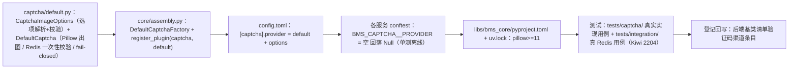

# 01 实施 · 图形验证码真实实现

> 认证与安全 · 03 验证码与账号治理 · 子任务 01（需求 03-1）· 实施记录

[文档首页](../../../../../../文档首页.md) › [01 图形验证码真实实现](../03_验证码与账号治理_01_图形验证码真实实现.md) › 实施记录　|　[← 任务](../03_验证码与账号治理_01_图形验证码真实实现.md)　[测试记录 →](../测试/01_测试_01_图形验证码真实实现.md)

## 1. 实施信息 

| 项 | 值 |
| --- | --- |
| 任务 | [01 图形验证码真实实现](../03_验证码与账号治理_01_图形验证码真实实现.md) |
| 对应需求 | [03-1](../../../../需求/03_需求_验证码与账号治理.md#r03-1) |
| 详细设计 | [01 详细设计](../设计/01_详细设计_01_图形验证码真实实现.md) |
| 实施日期 | 2026-09-27 |
| 实施人 | minjian |
| 实施环境 | 本地开发机（Python 3.14.4 / uv；依赖外置 `DEPS_DIR`）；Pillow 12.3.0 / fakeredis 2.38；真 Redis 集成连开发机（`BMS_TEST_REDIS_URL`） |
| 提交 | 详细设计 `36559c4a`；实施 / 测试 / 登记回写 / 记录随本次提交 |
| 结论 | 完成（设计一处微调已回写；无阻塞遗留） |

## 2. 实施概览 

## 3. 实施过程 

1. **依赖**：`libs/bms_core/pyproject.toml` 主依赖新增 `pillow>=11`（经清华 TUNA 源安装，Pillow 12.3.0；`uv.lock` 重生成）。
2. **`captcha/default.py` 新增**：
   - `CaptchaImageOptions`（frozen dataclass → `BaseObject`）：出图参数（宽高 / 字符数 / 字号 / 干扰线 / 噪点 / 旋转），`from_options` 从 `[captcha].options` 解析并做类型 + 范围校验（非法 `PluginError` 拒启）。
   - `DefaultCaptcha`（`plugin_name = "default"`，构造 `url` 必填防自动收集）：`generate(kind=image)` 经 `asyncio.to_thread` 用 Pillow 出 PNG（随机底色 + 逐字符轻微旋转 + 干扰线 / 噪点，字符集去易混字符），写 `bms:global:captcha:{uuid}` JSON（TTL 300）；`verify_credential` 先 `PTTL` 再 `GETDEL`（原子单次失效）后 `hmac.compare_digest` 常量时间比对（大小写不敏感），失败按剩余 TTL 回写并 `fails+1`；覆写 `require_credential` 区分不存在 / 过期（20102）与码不符（20101）；Redis 不可用出题抛 `ServiceUnavailableError`（10007/503）、校验返回 False（fail-closed）；滑块 / 短信未启用抛 `ServiceUnavailableError`；`policy` 取平台默认。
3. **装配**：`core/assembly.py` 增 `DefaultCaptchaFactory`（注入 `settings.redis.url` 与出图选项）并 `register_plugin("captcha", "default", ...)`。
4. **配置**：`config.toml` 新增 `[captcha]` 节（`provider = "default"` + `options = {}`）。
5. **测试隔离**：10 个服务 / 基座 `conftest.py` 增 `BMS_CAPTCHA__PROVIDER=""`，既有单测回落 `NullCaptcha`（离线，行为不变）；`captcha/__init__.py` 包口径更新。
6. **测试**：`libs/bms_core/tests/captcha/test_captcha_default.py`（Kiwi 2204，11 用例）与 `libs/bms_core/tests/integration/test_captcha_integration.py`（integration 标记真 Redis）。
7. **验证**：全量 `pytest` **1662 passed / 38 skipped**；`ruff check` / `ruff format --check` / `pyright` 全绿；新模块 `captcha/default.py` 覆盖率 **100%**（172 语句 / 0 未覆盖）；真 Redis 集成用例实跑通过。
8. **登记回写**：《[后端基类清单](../../../../../../后端基类清单.md)》验证码渠道条目（分层总览状态 / 跨阶段基座实现与状态 / 继承链）。

## 4. 问题与处置 

| # | 问题 / 现象 | 原因 | 处置与落点 |
| --- | --- | --- | --- |
| 1 | 失败回写后挑战 TTL 丢失（`ttl == -1`） | `GETDEL` 已删除键，`SET ... KEEPTTL` 无 TTL 可保留 | 改为「`GETDEL` 前取 `PTTL` → 失败按剩余 TTL `SET ... PX` 回写」；设计 §3.3 / 对齐记录 #5 回写（`_take` 返回 `(record, ttl_ms)`） |
| 2 | 基座继承约定用例失败：`CaptchaImageOptions` 无基类 | 新出图选项为裸 dataclass | 改继承 `BaseObject`（与既有数据契约一致）；继承链登记同步回写 |
| 3 | `uv run pytest` 报 `No module named 'PIL'` | 本地依赖外置后的控制台脚本 shebang 仍指向旧 `backend/.venv`（无 Pillow） | `uv sync --reinstall` 重生成脚本（指向外置 venv）修复；属本地环境维护，非交付物 |
| 4 | pyright 报错（`json.loads` 入参 `str \| None`、混合字面量元组部分未知） | 测试替身返回类型宽 / 字面量类型混杂 | 补 `assert raw is not None`、显式标注 `tuple[dict[str, object], ...]` |
| 5 | 初版实现用 `hmac.compare_digest` 前未统一大小写 | 比对口径遗漏 | 生成只用大写码，比对前统一 `strip().upper()` |

## 5. 验证结果 

| 项 | 方法 | 结果 |
| --- | --- | --- |
| 定向用例 | `uv run pytest libs/bms_core/tests/captcha -q` | 11 passed |
| 全量后端用例 | `uv run pytest -q` | 1662 passed / 38 skipped |
| 新增模块覆盖率 | `--cov=bms_core.captcha.default --cov-report=term-missing` | 172 语句 / 0 未覆盖 = **100%** |
| 真 Redis 集成 | `BMS_TEST_REDIS_URL=redis://<开发机>:6379/0 uv run pytest …integration/test_captcha_integration.py -q` | 1 passed |
| 静态检查 | `uv run ruff check .` / `uv run ruff format --check .` | 全绿 |
| 类型检查 | `uv run pyright` | 0 errors / 0 warnings |
| 装配一致性 | 平台契约套件（既有 Kiwi 531 / 567） | 全绿（无新增插件键，实现类有必填参数不自动登记） |

## 6. 偏差与遗留 

- **偏差（已回写设计）**：失败重试的 TTL 保留方式由「`KEEPTTL`」改为「先 `PTTL` 再 `GETDEL`、按剩余 TTL `SET ... PX`」（见 §4 问题 1）。
- **遗留**：
  1. 滑块出图与轨迹判定（**归口：03_02**）、短信下发与冷却频次（**归口：03_03**）、场景策略按租户读取与「连续失败 N 次强制」（**归口：03_04**）——本任务对未启用形态 fail-closed 不放行。
  2. 手机号脱敏改经脱敏基座（**归口：03_03 / 04_01**）。
  3. 「出图可人工识别」由本记录附样例图人工确认（见测试记录 §6）。
  4. 登录前接口防滥用限流（**归口：03_04**）。

> 本文档依《[文档生成规范](../../../../../../规范/文档生成规范.md)》编写
