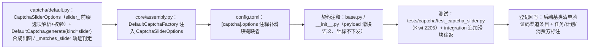

# 02 实施 · 滑块挑战真实实现

> 认证与安全 · 03 验证码与账号治理 · 子任务 02（需求 03-2）· 实施记录

[文档首页](../../../../../../文档首页.md) › [02 滑块挑战真实实现](../03_验证码与账号治理_02_滑块挑战真实实现.md) › 实施记录　|　[← 任务](../03_验证码与账号治理_02_滑块挑战真实实现.md)　[测试记录 →](../测试/01_测试_02_滑块挑战真实实现.md)

## 1. 实施信息 

| 项 | 值 |
| --- | --- |
| 任务 | [02 滑块挑战真实实现](../03_验证码与账号治理_02_滑块挑战真实实现.md) |
| 对应需求 | [03-2](../../../../需求/03_需求_验证码与账号治理.md#r03-2) |
| 详细设计 | [01 详细设计](../设计/01_详细设计_02_滑块挑战真实实现.md) |
| 实施日期 | 2026-09-27 |
| 实施人 | minjian |
| 实施环境 | 本地开发机（Python 3.14.4 / uv；依赖外置 `DEPS_DIR`）；Pillow 12.3.0 / fakeredis 2.38；真 Redis 集成连开发机（`BMS_TEST_REDIS_URL`） |
| 提交 | 详细设计 `d1f3ce30`；实施 / 测试 / 登记回写 / 记录随本次提交 |
| 结论 | 完成（设计三处口径已随定稿回写；无阻塞遗留） |

## 2. 实施概览 

## 3. 实施过程 

1. **滑块选项 `CaptchaSliderOptions`（`captcha/default.py` 新增）**：宽 / 高 / 块图边长 / 落点容差 / 时长下限 / 最少点数，`from_options` 从 `[captcha].options` 的 `slider_` 前缀扁平键解析并做类型 + 范围校验（非法 `PluginError` 拒启）；小画布时块图缺省按 `min(width, height) // 2` 钳制。
2. **合成出图**：`generate(kind=slider)` → `_generate_slider` 经 `asyncio.to_thread` 调 `_render_slider`：随机对角渐变底 + `Image.effect_noise` 噪点（`Image.blend` 混合），随机坐标挖出 `piece_size` 方形缺口并绘制深色矩形标记，块图 = 缺口区域裁剪（与背景同源）；背景 / 块图各自 PNG + 原始 base64 填入 `payload`（`background` / `slider` / `width` / `height`），顶层 `image` 空字节；缺口位置（`gap_x` / `gap_y`）只写入 Redis 记录，**不下发**。
3. **轨迹判定**：`_matches` 按记录 `kind` 分派——滑块走 `_matches_slider`（点数 ≥ `min_points`、时间非递减、总时长 ≥ `min_duration_ms`、末点 `|x - gap_x| ≤ tolerance`；`y` 不校验）；`gap_x` 缺失 / 非整数（含布尔）判不通过。
4. **失败与单次失效**：复用 03_01 口径——`PTTL` + `GETDEL` 原子取出（成功即失效），失败走 `_register_failure`（`fails+1`、按剩余 TTL `SET ... PX` 回写、可重试）。
5. **装配与配置**：`DefaultCaptchaFactory` 注入 `CaptchaSliderOptions.from_options(...)`；`config.toml` 的 `[captcha].options` 注释补滑块键缺省；`base.py` / `__init__.py` 契约注释更新（`payload` 滑块语义、坐标不下发、短信随 03_03）。
6. **测试**：新增 `libs/bms_core/tests/captcha/test_captcha_slider.py`（Kiwi 2205，10 用例）与 `tests/integration/test_captcha_integration.py` 滑块往返用例；适配 `test_captcha_default.py` 未启用形态用例（滑块启用后仅短信 fail-closed）。
7. **验证**：全量 `pytest` **1672 passed / 39 skipped**；`ruff check` / `ruff format --check` / `pyright` 全绿；新模块 `captcha/default.py` 覆盖率 **100%**（254 语句 / 0 未覆盖）；真 Redis 集成用例实跑通过；`check-preflight.py --fast` 全绿。
8. **登记回写**：《[后端基类清单](../../../../../../后端基类清单.md)》验证码渠道条目（分层总览状态 / 跨阶段基座实现与状态 / 继承链）、父任务清单、计划；契约变更消费方标注（[06_04](../../../../../04_前端组件库/任务/06_字段类/06_字段类_04_验证码字段/06_字段类_04_验证码字段.md) / [03_04](../../03_验证码与账号治理_04_场景策略与失败计数联调/03_验证码与账号治理_04_场景策略与失败计数联调.md)）。

## 4. 问题与处置 

| # | 问题 / 现象 | 原因 | 处置与落点 |
| --- | --- | --- | --- |
| 1 | 任务 / 需求文档写滑块失败返回 `20102`，与错误码语义（`20102` = 不存在 / 过期）及 03_01 图形码口径不一致 | 文档早于错误码细分口径 | 拍板按语义定为 `20101` 且可重试；任务文档 §2.3 / §3 回写（设计 §8 对齐记录 #5） |
| 2 | 任务文档要求本任务改前端 `06_04` 渲染并联调，父任务端范围又写归 `03_04` | 任务文档早于父任务端范围定稿 | 拍板后端为主 + 消费方标注，前端归 03_04；任务文档 §2.4 / §3 回写（设计 §8 对齐记录 #1） |
| 3 | 滑块启用后，03_01 既有用例 `test_unsupported_kinds_fail_closed` 对滑块的 fail-closed 断言失效 | 用例断言「滑块未启用」，属能力演进必要适配 | 改为仅短信 fail-closed（仍归 Kiwi 2204）；设计 §4 / 对齐记录 #11 登记 |
| 4 | mjw 识图服务（LM Studio）不可达，无法对出图做机器 / 目视复核 | 工具环境（与 03_01 同现象） | 以自动化断言（PNG / 尺寸 / 缺口区域像素为深色矩形 / 块图与缺口同尺寸）+ 样例图留痕（见测试记录 §6） |

## 5. 验证结果 

| 项 | 方法 | 结果 |
| --- | --- | --- |
| 定向用例 | `uv run pytest libs/bms_core/tests/captcha -q` | 21 passed |
| 全量后端用例 | `uv run pytest -q` | 1672 passed / 39 skipped |
| 新增模块覆盖率 | `--cov=bms_core.captcha.default --cov-report=term-missing` | 254 语句 / 0 未覆盖 = **100%** |
| 真 Redis 集成 | `BMS_TEST_REDIS_URL=redis://<开发机>:6379/0 uv run pytest …integration/test_captcha_integration.py -q` | 2 passed（图形码 + 滑块） |
| 静态检查 | `uv run ruff check .` / `uv run ruff format --check .` | 全绿 |
| 类型检查 | `uv run pyright` | 0 errors / 0 warnings |
| 装配一致性 | 平台契约套件（既有 Kiwi 531 / 567） | 全绿（无新增插件键，构造参数带缺省不自动登记） |
| 基座 / 链路预检 | `python3 scripts/tools/preflight/check-preflight.py --fast` | 全部通过 |

## 6. 偏差与遗留 

- **偏差（已回写设计）**：
  1. 滑块判定失败错误码由文档字面 `20102` 改为 `20101`（可重试），`20102` 仅用于不存在 / 过期（见 §4 问题 1）。
  2. 前端件调整归属由本任务改为 03_04（见 §4 问题 2）。
- **遗留**：
  1. 前端 `06_04` 按新 `payload` 渲染与四端点端到端联调（**归口：03_04**）。
  2. 短信下发与冷却频次（**归口：03_03**）、场景策略按租户读取与「连续失败 N 次强制」（**归口：03_04**）。
  3. 真实图片底 / 拼图凸凹形状演进、轨迹阈值真机取样收紧（**归口：后续 / 生产前调参**）。
  4. 轨迹坐标换算（前端轨道位移 → 图片像素）随前端联调（**归口：03_04**）。

> 本文档依《[文档生成规范](../../../../../../规范/文档生成规范.md)》编写
