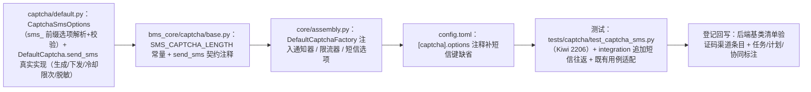

# 03 实施 · 短信验证码真实实现

> 认证与安全 · 03 验证码与账号治理 · 子任务 03（需求 03-3）· 实施记录

[文档首页](../../../../../../文档首页.md) › [03 短信验证码真实实现](../03_验证码与账号治理_03_短信验证码真实实现.md) › 实施记录　|　[← 任务](../03_验证码与账号治理_03_短信验证码真实实现.md)　[测试记录 →](../测试/01_测试_03_短信验证码真实实现.md)

## 1. 实施信息 

| 项 | 值 |
| --- | --- |
| 任务 | [03 短信验证码真实实现](../03_验证码与账号治理_03_短信验证码真实实现.md) |
| 对应需求 | [03-3](../../../../需求/03_需求_验证码与账号治理.md#r03-3) |
| 详细设计 | [01 详细设计](../设计/01_详细设计_03_短信验证码真实实现.md) |
| 实施日期 | 2026-09-27 |
| 实施人 | minjian |
| 实施环境 | 本地开发机（Python 3.14.4 / uv；依赖外置 `DEPS_DIR`）；fakeredis 2.38；真 Redis 集成连开发机（`BMS_TEST_REDIS_URL`） |
| 提交 | 详细设计 `87afbf91`；实施 / 测试 / 登记回写 / 记录随本次提交 |
| 结论 | 完成（设计口径全部落地；无阻塞遗留） |

## 2. 实施概览 

## 3. 实施过程 

1. **短信选项 `CaptchaSmsOptions`（`captcha/default.py` 新增）**：位数 / 账号上限 / IP 上限 / 窗口，`from_options` 从 `[captcha].options` 的 `sms_` 前缀扁平键解析并做类型 + 范围校验（非法 `PluginError` 拒启）；复用 03_01 的 `_int_option`。
2. **短信发送 `send_sms`**：取场景策略（`policy.cooldown` / `policy.ttl`）→ 经限流基座校验**冷却**（维度 `sms-cooldown`，目标 `{手机号}:{场景}`，`limit=1, window=cooldown`）、**账号**（`sms-account`，手机号）、**IP**（`ip`，`current_client_ip`；缺失跳过）三维，超限抛 `CaptchaTooFrequentError`（20103 / 429，`data.reset_after`）且不重置倒计时 → 生成 **6 位纯数字**码写 Redis（`bms:global:captcha:{uuid}`，记录 `kind=sms` / `scene` / `code` / `fails`，TTL 取策略）→ 经 `BaseNotifier` 下发（`NotifyChannel.SMS`、收件为原手机号、内容经基座内置中文模板含验证码与有效期、`biz_type=captcha`）→ 返回挑战（`image` 空、`payload` 空、`target=mask_phone(phone)`、`cooldown` / `expires_in` 取策略）；**验证码明文不出现在响应**。
3. **失败处置**：Redis 写入失败 → `ServiceUnavailableError`（10007 / 503）fail-closed；通知器 `delivered=False` 或抛异常 → **删除已写入挑战**（`_discard`，删除失败仅日志）后抛 `ServiceUnavailableError`（不静默放行）；限流计数不回收。
4. **形态分派调整**：`generate(kind=sms)` 改抛 `ParamError`（10001，短信请经 `/captcha/sms` 端点），枚举外取值同判参数错误；图形 / 滑块路径零改动。
5. **依赖注入与配置**：`DefaultCaptchaFactory` 经 `resolve_plugin` 解析 `BaseNotifier` / `BaseRateLimiter` 注入（构造参数带缺省，缺省 `NullNotifier` / `NullRateLimiter`）；`config.toml` 的 `[captcha].options` 注释补短信键缺省；`base.py` / `__init__.py` 契约注释更新（`SMS_CAPTCHA_LENGTH`、`send_sms` 真实语义）。
6. **测试**：新增 `libs/bms_core/tests/captcha/test_captcha_sms.py`（Kiwi 2206，13 用例）与 `tests/integration/test_captcha_integration.py` 短信往返（真 Redis + 真限流）；适配 `test_captcha_default.py` / `test_captcha_slider.py` 未启用形态用例（短信启用后改判 `generate(kind=sms)` 参数错误）。
7. **验证**：全量 `pytest` **1685 passed / 40 skipped**；`ruff check` / `ruff format --check` / `pyright` 全绿；`captcha/default.py` 覆盖率 **100%**（326 语句 / 0 未覆盖）；真 Redis 集成用例实跑通过（3 passed）；`check-preflight.py --fast` 全绿（含契约快照零漂移，`send_sms` 签名不变）。
8. **登记回写**：《[后端基类清单](../../../../../../后端基类清单.md)》验证码渠道条目（分层总览状态 / 跨阶段基座实现与状态 / 继承链），父任务清单、计划；协同标注（脱敏回接归 `04_02`、前端短信件联调归 `03_04`）。

## 4. 问题与处置 

| # | 问题 / 现象 | 原因 | 处置与落点 |
| --- | --- | --- | --- |
| 1 | 任务文档写「短信目标脱敏改经域 04 脱敏基座」，但 `BaseMasker` 真实实现（04_01）未交付、当前 `NullMasker` 原样返回 | 文档早于依赖交付顺序 | 拍板沿用基座唯一入口 `mask_phone`（不引入漏脱敏风险），改经 `BaseMasker` 归 04_02（需求 04-2 §5 明确归口）；任务文档 §2 / §3 回写（设计 §8 对齐记录 #1） |
| 2 | 短信启用后，03_01 / 03_02 既有用例对 `generate(kind=sms)` / `send_sms` 的 fail-closed 断言失效 | 用例断言「短信未启用」，属能力演进必要适配 | 改为断言 `generate(kind=sms)` → `ParamError`（10001），仍归 Kiwi 2204 / 2205（设计 §4 / 对齐记录 #12） |
| 3 | `generate` 末段「未支持形态」防御分支在枚举收口后不可达 | 三形态已各有出口 | 补枚举外取值用例覆盖该分支（保新增代码 100% 覆盖） |

## 5. 验证结果 

| 项 | 方法 | 结果 |
| --- | --- | --- |
| 定向用例 | `uv run pytest libs/bms_core/tests/captcha -q` | 34 passed |
| identity 验证码契约 | `uv run pytest services/identity/tests/captcha -q` | 16 passed |
| 全量后端用例 | `uv run pytest -q` | 1685 passed / 40 skipped |
| 新增模块覆盖率 | `--cov=bms_core.captcha.default --cov-report=term-missing` | 326 语句 / 0 未覆盖 = **100%** |
| 真 Redis 集成 | `BMS_TEST_REDIS_URL=redis://<开发机>:6379/0 uv run pytest …integration/test_captcha_integration.py -q` | 3 passed（图形码 + 滑块 + 短信） |
| 静态检查 | `uv run ruff check .` / `uv run ruff format --check .` | 全绿 |
| 类型检查 | `uv run pyright` | 0 errors / 0 warnings |
| 装配一致性 | 平台契约套件（既有 Kiwi 531 / 567） | 全绿（无新增插件键，构造参数带缺省不自动登记） |
| 基座 / 链路预检 | `python3 scripts/tools/preflight/check-preflight.py --fast` | 全部通过（契约快照零漂移） |

## 6. 偏差与遗留 

- **偏差（已回写设计）**：
  1. 短信脱敏本任务沿用 `mask_phone`，改经 `BaseMasker` 归 04_02（见 §4 问题 1）。
  2. 既有「短信未启用」用例改为 `generate(kind=sms)` 参数错误断言（见 §4 问题 2）。
- **遗留**：
  1. 脱敏回接 `BaseMasker`（**归口：04_02**）。
  2. 前端 `06_04` 短信件真实数据通路与四端点端到端联调（**归口：03_04**）。
  3. 场景策略按租户 `sys_config` 读取与「连续失败 N 次强制」（**归口：03_04**）。
  4. 短信模板 / i18n 渲染与真实渠道（阿里云 / 腾讯云、`sys_sms_template` / `sys_sms_log`）（**归口：阶段八 · 通知公告**）。
  5. 手机号后端严格格式校验（如需）与发送记录落库（**归口：另立需求 / 阶段八**）。

> 本文档依《[文档生成规范](../../../../../../规范/文档生成规范.md)》编写
