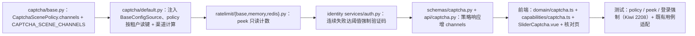

# 04 实施 · 场景策略与失败计数联调

> 认证与安全 · 03 验证码与账号治理 · 子任务 04（需求 03-4）· 实施记录

[文档首页](../../../../../../文档首页.md) › [04 场景策略与失败计数联调](../03_验证码与账号治理_04_场景策略与失败计数联调.md) › 实施记录　|　[← 任务](../03_验证码与账号治理_04_场景策略与失败计数联调.md)　[测试记录 →](../测试/01_测试_04_场景策略与失败计数联调.md)

## 1. 实施信息 

| 项 | 值 |
| --- | --- |
| 任务 | [04 场景策略与失败计数联调](../03_验证码与账号治理_04_场景策略与失败计数联调.md) |
| 对应需求 | [03-4](../../../../需求/03_需求_验证码与账号治理.md#r03-4) |
| 详细设计 | [01 详细设计](../设计/01_详细设计_04_场景策略与失败计数联调.md) |
| 实施日期 | 2026-09-27 |
| 实施人 | minjian |
| 实施环境 | 本地开发机（Python 3.14.4 / uv、Node 24 / pnpm 11；依赖外置 `DEPS_DIR`） |
| 提交 | 详细设计 `b7468694`；实施 / 测试 / 登记回写 / 记录随本次提交 |
| 结论 | 完成（设计口径全部落地；前端宿主登录页接线归 05_01） |

## 2. 实施概览 

## 3. 实施过程 

1. **场景策略数据契约**（`captcha/base.py`）：`CaptchaScenePolicy` 尾部新增 `channels: tuple[CaptchaKind, ...]`（带默认）；新增 `CAPTCHA_DEFAULT_CHANNELS` / `CAPTCHA_SCENE_CHANNELS`（登录 `slider→image`，其余 `sms→slider→image`）；`default_scene_policy` 回填场景渠道。
2. **按租户读取**（`captcha/default.py`）：`DefaultCaptcha.__init__` 增 `config: BaseConfigSource | None`（缺省 `NullConfigSource`）；`policy(scene)` 读键 `captcha.scene.{scene}.{required|fail_threshold|ttl|cooldown}` 与 `captcha.channel.{image|slider|sms}`，经 `_parse_bool` / `_parse_int` 容错解析、`_resolve_channels` 按可用性过滤（图形码恒兜底），缺省回落平台默认表。装配工厂注入解析后的 `config_source`。
3. **只读计数**（`ratelimit/*`）：`BaseRateLimiter.peek`（缺省 0）派生方法；`MemoryRateLimiter.peek` 返回当前窗口计数（过期归 0）；`RedisRateLimiter.peek` `GET` + 异常降级 memory。
4. **连续失败强制**（`identity/services/auth.py`）：`_enforce_captcha(captcha, *, tenant, account)` 读 `policy` 与 `peek(_fail_key)`，`required = policy.required or fails >= policy.fail_threshold`；未携带且强制 → 20101。**验证码校验失败只在挑战记录内累计 `fails`，不计入登录失败计数**；成功登录既有清零不改。
5. **契约扩展**：`CaptchaPolicyResponse` 增 `channels`（`list[CaptchaKind]`），路由映射 `list(policy.channels)`；响应只增不删。
6. **阈值口径收敛**（`core/config.py` + `config.toml`）：移除 `[login].captcha_lock_threshold`（从未驱动判定），连续失败强制阈值统一取场景策略 `fail_threshold`。
7. **前端**（`core` / `ui-ep` / `apps/desktop`）：
   - `domain/captcha.ts`：`CaptchaSliderParams` 增 `slider`、`parseCaptchaSliderParams` 解析 `slider`（别名 `piece`）；`CaptchaPolicy` 增 `channels`、新增 `CAPTCHA_DEFAULT_CHANNELS` / `normalizeCaptchaChannels`、`defaultCaptchaPolicy` / `normalizeCaptchaPolicy` 处理渠道。
   - `capabilities/captcha.ts`：新增 `channels` 访问器（策略归一结果，缺省平台默认）。
   - `SliderCaptcha.vue`：删除自绘缺口元素与 `gapPercent`；渲染服务端 `slider` 块图并按拖动位移定位；舞台按背景宽高比自适应；提交轨迹 `x` 映射背景图像素（`imageWidth`）；`data-test="captcha-slider-piece"`。
   - `apps/desktop/src/dev/CaptchaCheck.vue`：桩滑块挑战返回新 `payload`（含 `background` / `slider` / `width` / `height`）；`probeHttp` 校验策略 `channels` 含 `image`；说明文案更新。
8. **测试**：新增 `libs/bms_core/tests/captcha/test_captcha_policy.py`（策略覆盖 / 回落 / 渠道降级）、`libs/bms_core/tests/ratelimit/test_peek.py`（只读计数）、`services/identity/tests/auth/test_login.py` 两用例（连续失败强制 / 验证码失败不计入）；前端 `domain-captcha.spec.ts` / `field-captcha.spec.ts` 适配并新增滑块新 `payload` 用例；既有 `test_captcha_channel.py` 策略响应断言补 `channels`、`default_scene_policy` 恒等改等值。
9. **验证**：后端全量 `pytest` **1722 passed / 40 skipped**；`captcha.default` / `ratelimit/*` / `bms_identity.services.auth` 覆盖率 **100%**；`ruff` / `ruff format` / `pyright` 全绿；前端 `pnpm run check`（core / api-types / vue / ui-ep）+ desktop `vue-tsc` / `lint` / `test` 全绿；`check-preflight.py` 全绿。详见 §5。
10. **登记回写**：契约快照 `identity.json` 无字段级变化（响应走泛型 `ApiResponse`，无需重生成）；《后端基类清单》验证码渠道 / 限流条目；`06_04` / `05_01` 协同契约；父任务 / 计划。

## 4. 问题与处置 

| # | 问题 / 现象 | 原因 | 处置与落点 |
| --- | --- | --- | --- |
| 1 | 既有 `test_login_failure_lock_threshold`（Kiwi 2194）断言连续 4 次密码失败返回 20002，第 5 次 20003；阈值强制接入后第 4 次转 20101 | 该用例未隔离验证码强制，属能力演进必要适配 | 该用例注入 `FakeCaptcha(fail_threshold=99)` 隔离锁定分支；`FakeCaptcha` 增 `fail_threshold` 参数 |
| 2 | `default_scene_policy` 恒等断言（Kiwi 879）失效 | 现返回带 `channels` 的 `replace` 副本 | 断言改等值（`==`）；策略响应断言补 `channels` |
| 3 | 03_01 / 03_02 工厂用例 `DefaultCaptchaFactory.create()` 报 `config_source` 未注册 | 工厂新增解析 `config_source`，而用例构造的 `Settings` 从 `config.dev.toml` 取到 `sql` | 用例 `Settings` 显式传 `config_source=PluginSelection(provider="")`（回落 Null） |
| 4 | 滑块件原为 40px 定高条 + 自绘缺口，与新 `payload`（300×150 背景 + 块图）不匹配 | 服务端合成出图契约（03_02） | 舞台改按背景宽高比自适应，块图随位移定位，轨迹 x 映射图像像素 |
| 5 | 设计写「策略端点响应新增 `channels`」但 identity 契约快照未见字段 | 响应走泛型 `ApiResponse`，契约快照不展开 data | 无需重生成；行为由服务端用例与前端归一保证 |

## 5. 验证结果 

| 项 | 方法 | 结果 |
| --- | --- | --- |
| 定向用例 | `uv run pytest libs/bms_core/tests/captcha libs/bms_core/tests/ratelimit services/identity/tests/{captcha,auth} -q` | 全通过 |
| 全量后端用例 | `uv run pytest -q` | 1722 passed / 40 skipped |
| 新增 / 变更模块覆盖率 | `--cov=bms_core.captcha.default --cov=bms_core.ratelimit --cov=bms_identity.services.auth` | 均 **100%** |
| 静态检查 | `uv run ruff check .` / `uv run ruff format --check .` | 全绿 |
| 类型检查 | `uv run pyright` | 0 errors / 0 warnings |
| 前端门禁 | `pnpm run check`；desktop `vue-tsc -b` / `lint` / `test` | 全绿（core 1193、ui-ep 902、desktop 121 用例） |
| 契约零漂移 | `python3 scripts/tools/preflight/check-preflight.py --fast` | 全部通过 |
| 全链路预检 | `python3 scripts/tools/preflight/check-preflight.py` | 全部通过 |

## 6. 偏差与遗留 

- **偏差（已回写设计）**：见 §4（既有用例适配、`channels` 契约走泛型响应、Kiwi 分类「平台骨架」）。
- **遗留**：
  1. 宿主业务登录页接线与按 `channels` 渲染形态（**归口：05_01**，其依赖本任务）。
  2. 渠道真实可用性探测（短信通道连通性）（**归口：阶段八 · 通知公告**）。
  3. 验证码校验失败是否纳入风控评分（**归口：后续安全强化**）。

> 本文档依《[文档生成规范](../../../../../../规范/文档生成规范.md)》编写
