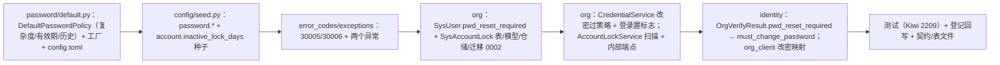

# 05 实施 · 密码策略真实实现

> 认证与安全 · 03 验证码与账号治理 · 子任务 05（需求 03-5）· 实施记录

[文档首页](../../../../../../文档首页.md) › [05 密码策略真实实现](../03_验证码与账号治理_05_密码策略真实实现.md) › 实施记录　|　[← 任务](../03_验证码与账号治理_05_密码策略真实实现.md)　[测试记录 →](../测试/01_测试_05_密码策略真实实现.md)

## 1. 实施信息 

| 项 | 值 |
| --- | --- |
| 任务 | [05 密码策略真实实现](../03_验证码与账号治理_05_密码策略真实实现.md) |
| 对应需求 | [03-5](../../../../需求/03_需求_验证码与账号治理.md#r03-5) |
| 详细设计 | [01 详细设计](../设计/01_详细设计_05_密码策略真实实现.md) |
| 实施日期 | 2026-09-27 |
| 实施人 | minjian |
| 实施环境 | 本地开发机（Python 3.14.4 / uv，依赖外置 `DEPS_DIR`）；临时 SQLite 验证 `org:tenant 0002` 迁移与扫描；fakeredis / 注入替身；Kiwi TCMS 登记 **2209** |
| 提交 | 详细设计 `—`（随本次 docs 提交）；实施 / 测试 / 登记回写 / 记录随本次 feat 提交（提交后回填） |
| 结论 | 完成（设计口径全部落地；两型锁定 / 解锁与调度、前端页面按设计归后续任务） |

## 2. 实施概览 

## 3. 实施过程 

1. **密码策略真实实现**（`libs/bms_core/src/bms_core/password/default.py`）：新增 `DefaultPasswordPolicy`（`plugin_name="default"`，`config` / `hasher` 无缺省值以免被注册表自动收集）——`validate`（`password.min_length` / `max_length` / `require_upper|lower|digit|symbol` / `forbid_username`，返回 `PASSWORD_VIOLATIONS` 子集）、`expired`（`password.max_age_days`，缺省 90）、`reused`（历史哈希经 `BasePasswordHasher.verify`）、`history_count`（`password.history_count`，缺省 5）；`resolve_inactive_lock_days(config)` 供 org 扫描；容错解析 `_parse_bool` / `_parse_int`（非法回落默认）。常量默认与平台种子对齐（`min=8` / `max=128` / 90 天 / 5 次）。
2. **契约小幅扩展**（`password/base.py`）：新增非抽象 `history_count()`（缺省 `PASSWORD_HISTORY_COUNT=5`），三抽象方法签名不变，向后兼容（参照 03_04 给 `BaseRateLimiter` 增 `peek` 先例）。
3. **装配**（`core/assembly.py`）：新增 `DefaultPasswordPolicyFactory`（解析 `config_source` + `password_hasher`），`register_plugin("password_policy", "default", …)`；`config.toml` 新增 `[password_policy] provider="default"`。
4. **平台默认种子**（`config/seed.py`）：追加 `password.*` 九键 + `account.inactive_lock_days`（幂等写入）。
5. **错误码与异常**（`core/error_codes.py` / `core/exceptions.py`）：新增 `30005` `PASSWORD_POLICY_VIOLATION` / `30006` `PASSWORD_REUSED` 与 `PasswordPolicyViolationError`（data 带 `violations`）/ `PasswordReusedError`。
6. **org 模型与迁移**：`SysUser` 增 `pwd_reset_required`；新增 `SysAccountLock`（`sys_account_lock`）与 `MODEL_MODULES` 登记；迁移 `org:tenant 0002_password_policy_and_account_lock`（加列 + 建表 + 索引）；`table_registry` 的 `sys_account_lock` 由 `identity` / `PLANNED` 改 `org` / `enabled`。
7. **org 服务**：
   - `CredentialService.update_password` 写库前过策略（复杂度 → 历史，比对 `[当前哈希, *历史]`），返回 `UpdatePasswordResult{updated, reason, violations}`，改密成功清 `pwd_reset_required`；`keep_history=None` 时取策略 `history_count`。
   - `CredentialService.verify` 口令命中且 `pwd_changed_at` 超期时置 `pwd_reset_required`（不自动清），随 `CredentialVerifyResult.pwd_reset_required` 返回。
   - 新增 `AccountLockService.scan_inactive`（按 `account.inactive_lock_days` 扫描含从未登录账号，写 `inactive` 锁 + `locked_until` 远期哨兵 `9999-12-31`，幂等）；`UserRepository.list_inactive`、`AccountLockRepository.get_active_by_user`。
   - 内部端点：`POST /api/v1/org/internal/account-locks/scan-inactive`（`require_service("identity","platform")`）；凭据端点注入 `get_password_policy`。
8. **identity 映射**：`OrgVerifyResult.pwd_reset_required` / `OrgUpdatePasswordResult`；`LoginService` 填 `UserSummary.must_change_password`；`OrgCredentialClient.update_password` 依 `reason` 抛 `PasswordPolicyViolationError`（30005）/ `PasswordReusedError`（30006）或返回 `False`（`not_found`）/ `True`。
9. **登记与生成物**：数据表文件（`sys_user` v2 / `sys_account_lock` 新）、总览、后端基类清单、概要 10 §6.3 键位定稿、`03_06` / `03_07` 前置契约、父任务 / 计划；`deploy/contracts/org.json` 与前端 `api-types/src/org.ts` 重生成（零漂移）。
10. **测试**：Kiwi **2209** 先登记；新增 `libs/bms_core/tests/password/test_password_policy.py`、`services/org/tests/account_lock/{test_scan,test_endpoint}.py`；扩展 org 凭据 / identity 登录与 org 客户端用例；既有关联用例适配（见 §4）。
11. **验证**：全量 `pytest`、`ruff` / `pyright`、`check-preflight.py --fast`（含基座 / 边界 / 契约 / api-types 零漂移）全绿；覆盖率见 §5。

## 4. 问题与处置 

| # | 问题 / 现象 | 原因 | 处置与落点 |
| --- | --- | --- | --- |
| 1 | 装配报 `(password_policy, default)` 重名 | `DefaultPasswordPolicy` 构造参数全带缺省 → 零参可实例化被注册表自动收集，与显式工厂重复 | `config` / `hasher` 改**无缺省值**（同 `DefaultCaptcha.url` 口径），仅经工厂显式登记 |
| 2 | `expired(pwd_changed_at: datetime)` 类型报错（调用方 `datetime \| None`） | 基类签名为非可选；NULL 语义应由调用方处理 | org `verify` 先判 `pwd_changed_at is not None` 再调 `expired`，基类签名不变 |
| 3 | 既有 org 凭据端点用例以弱口令 `"new"` 调 `update-password` 失败 | 策略接入后 `"new"` 触发 30005 | 用例改强口令 `NewSecret1!`，并新增弱口令 `policy_violation` 断言 |
| 4 | identity `test_password.py` 断言装配 `NullPasswordPolicy` 失败 | `config.toml` 默认 provider 由空改 `default` | 断言改 `DefaultPasswordPolicy`（Placeholder 契约用例保留在 bms_core） |
| 5 | `test_alembic_chains` / `test_table_registry` 服务表集断言失败 | 新增 `sys_account_lock` 进 `org:tenant` 链 | 断言补 `sys_account_lock` |
| 6 | `check-backend-base` 报 `AccountLockService` 未登记 | 直接继承 `BaseObject` 的服务类须在《后端基类清单》登记 | 新增「密码策略真实实现与账号治理（03_05）」条目 + §10 继承链补登 |
| 7 | 契约 / 前端类型漂移 | 新增 org 内部端点与改密请求字段 | 重生成 `deploy/contracts/org.json` 与 `frontend/packages/api-types/src/org.ts` |

## 5. 验证结果 

| 项 | 方法 | 结果 |
| --- | --- | --- |
| 定向用例 | `uv run pytest libs/bms_core/tests/password services/org/tests/{credentials,account_lock} services/identity/tests/{auth,password} -q` | 全通过 |
| 全量后端用例 | `uv run pytest -q` | **1742 passed / 40 skipped** |
| 覆盖率（新增 / 变更） | `--cov=bms_core.password[.*] --cov=bms_org.{services.account_lock,services.credentials,repositories.*,api.internal_account_locks,models.account_lock,schemas.account_lock}` | `password.default` / `base` / `null`、`account_lock` 服务 / 仓储 / 模型、`credentials`、`internal_account_locks` 均 **100%** |
| 静态检查 | `uv run ruff check .` / `uv run ruff format --check .` | 全绿 |
| 类型检查 | `uv run pyright` | 0 errors / 0 warnings |
| 基座校验 | `python3 scripts/tools/preflight/check-preflight.py --fast` | 全部通过（基座 / 边界 / 契约快照 / api-types 零漂移） |
| 迁移链 | `uv run pytest libs/bms_core/tests/alembic -q` | 通过（`org:tenant` head `0002_password_policy_and_account_lock`） |
| Kiwi 用例 | 平台登记 | 2209（平台骨架 / P2 / CONFIRMED / 自动化） |

## 6. 偏差与遗留 

- **偏差（已回写设计）**：见 §4（`DefaultPasswordPolicy` 构造口径 / `expired` NULL 由调用方判定 / 既有用例适配 / 清单与断言补登 / 生成物重生成）；设计 §3.3 / §8 已同步。
- **遗留**：
  1. `sys_account_lock` 的 `fail_limit` / `manual` 两型写锁、解锁接口、锁定列表 / 详情、`user:unlock` 权限与页面（**归口：03_07**）。
  2. 180 天扫描的 Celery 定时调度与真实调度入库（**归口：阶段八 · 任务调度**）。
  3. `sys_config` 密码 / 账号键的管理面（CRUD / 页面 / 审计 / 平台默认下发）（**归口：阶段八 · 系统参数**）。
  4. 改密 / 找回密码 / 密码强度提示前端页面与个人中心（**归口：阶段十五**；`05_01` 登录页仅消费 `must_change_password`）。
  5. 历史密码保留条数改小的存量历史不追溯清理（比对按现值，**归后续按需评估**）。

> 本文档依《[文档生成规范](../../../../../../规范/文档生成规范.md)》编写
