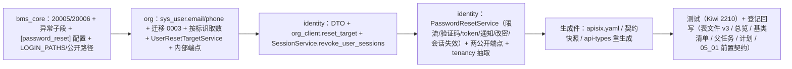

# 06 实施 · 找回密码流程

> 认证与安全 · 03 验证码与账号治理 · 子任务 06（需求 03-6）· 实施记录

[文档首页](../../../../../../文档首页.md) › [06 找回密码流程](../03_验证码与账号治理_06_找回密码流程.md) › 实施记录　|　[← 任务](../03_验证码与账号治理_06_找回密码流程.md)　[测试记录 →](../测试/01_测试_06_找回密码流程.md)

## 1. 实施信息 

| 项 | 值 |
| --- | --- |
| 任务 | [06 找回密码流程](../03_验证码与账号治理_06_找回密码流程.md) |
| 对应需求 | [03-6](../../../../需求/03_需求_验证码与账号治理.md#r03-6) |
| 详细设计 | [01 详细设计](../设计/01_详细设计_06_找回密码流程.md) |
| 实施日期 | 2026-09-28 |
| 实施人 | minjian |
| 实施环境 | 本地开发机（Python 3.14.4 / uv，依赖外置 `DEPS_DIR`）；临时 SQLite 验证 `org:tenant 0003` 迁移；内存替身（`MemoryIdpStateStore` / `MemoryRateLimiter` / `MemorySessionStore`）+ 记录型通知器；Kiwi TCMS 登记 **2210** |
| 提交 | 详细设计 `c30ade7d`（docs）；实施 / 测试 / 登记回写 / 记录随本次 feat / docs 提交（提交后回填） |
| 结论 | 完成（设计口径全部落地；真实通知渠道、前端页面、联系方式维护入口按设计归后续） |

## 2. 实施概览 

## 3. 实施过程 

1. **错误码与异常**（`core/error_codes.py` / `core/exceptions.py`）：新增 `20005` `PASSWORD_RESET_TOKEN_INVALID` / `20006` `PASSWORD_RESET_TOO_FREQUENT`；异常子段 `PasswordResetError(AuthError)` + `PasswordResetTokenError`（20005 / 400）+ `PasswordResetTooFrequentError`（20006 / 429）。
2. **配置**（`core/config.py` / `backend/config.toml`）：新增 `PasswordResetSettings`（`token_ttl_seconds=900` / `account_rate_limit=1` / `account_rate_window=300` / `ip_rate_limit=5` / `ip_rate_window=3600` / `reset_url=""`）与 `[password_reset]` 节；`[gateway].public_paths` 增两条找回路径。
3. **网关目录**（`core/services/gateway_catalog.py`）：`LOGIN_PATHS` 增 `/auth/forgot-password` / `/auth/reset-password`（登录档 10 次 / 60 秒独立限流路由），`uv run python -m ops.gateway_config render` 重生成 `deploy/gateway/apisix.yaml`。
4. **org 数据侧**：
   - `SysUser` 增可空 `email`（VARCHAR(255)）/ `phone`（VARCHAR(32)）+ 迁移 `org:tenant 0003_sys_user_reset_contact`（`down_revision=0002`）；
   - `UserRepository.get_by_email`（`lower(email)` 小写不敏感、`id` 升序取最早）/ `get_by_phone`（精确）；
   - `UserResetTargetService.resolve`：标识分类（含 `@` → 邮箱；`^\+?\d{6,20}$` → 手机；否则账号）→ 通道（邮箱优先 / 手机兜底）→ `deliverable`（启用且有通道；停用 / 软删 / 无联系方式不可送达；锁定不影响）；
   - 内部端点 `POST /api/v1/org/internal/users/reset-target`（`require_service("identity")`）+ 契约 `UserResetTargetRequest` / `UserResetTargetResult`。
5. **identity 找回服务**（`services/password_reset.py`）：`PasswordResetService.request_reset`（IP → 场景验证码 → 标识 → 命中后用户三维限流 → org 解析 → token 落 `idp_state_store` 命名空间 `pwdreset`（TTL 900s）→ `BaseNotifier` 发送；非送达不发送、恒 `{sent:true}`）与 `reset_password`（**先 `consume` 后改密** → org `update-password` 策略闸门 → `revoke_user_sessions`）；存储写入 / 通知异常与未送达一律 `10007`（fail-closed）。
6. **会话批量撤销**（`services/session.py`）：新增 `REASON_PASSWORD_RESET` 与 `revoke_user_sessions`（单事务撤销该用户全部在线会话 + 提交后逐会话黑名单 / 标记 / 广播；单会话运行时清理异常记 warning 继续，返回会话 id 清单）。
7. **端点与租户解析**：新增 `api/password_reset.py`（`BaseRouter(key="identity_password_reset", prefix="/auth")`，两端点免登录）并挂载 `api/router.py`；`api/auth.py` 私有租户解析抽取为 `api/tenancy.py::resolve_request_tenant`（登录 / 找回共用，行为等价）。
8. **identity 契约**：`schemas/password_reset.py`（请求 / 响应 / `OrgResetTargetResult`）；`OrgCredentialClient.reset_target`（复用 `user_profile` scope，fail-closed 10007）。
9. **生成物与登记**：`deploy/gateway/apisix.yaml`、`deploy/contracts/{identity,org}.json`、`frontend/packages/api-types/src/{identity,org}.ts` 重生成（零漂移）；`sys_user` 表文件 v3 + 总览、后端基类清单（新增条目 + 继承链 + `pwdreset` 命名空间补注）、父任务 / 计划 / `05_01` 前置契约回写。
10. **测试**：Kiwi **2210** 先登记；新增 `services/org/tests/users/test_reset_target.py`、`services/identity/tests/auth/test_password_reset.py`（端点）与 `test_password_reset_service.py`（服务分支）；测试替身扩展（`FakeOrgClient` 支持 `reset-target` 与弱口令 / 历史分支、新增 `RecordingNotifier`、`wire_password_reset`；`FakeCaptcha` 增 `required_scene`）；`test_login.py` 租户解析导入随抽取调整。
11. **验证**：受变更影响定向用例（identity / org / bms_core）**1286 passed / 38 skipped**；`ruff check` / `ruff format --check` / `pyright` 全绿；`check-preflight.py --fast` 全部通过（含网关 / 契约快照 / api-types 零漂移）；覆盖率见测试记录。

## 4. 问题与处置 

| # | 问题 / 现象 | 原因 | 处置与落点 |
| --- | --- | --- | --- |
| 1 | 登录用例在找回端点测试装配下返回 `20101`（需要验证码） | `wire_password_reset` 覆盖 `get_captcha` 为强制替身，登录场景同样被强制 | `FakeCaptcha` 增 `required_scene`（仅 `reset_password` 强制），既有用例零改动（`tests/auth/helpers.py`） |
| 2 | `test_login.py` 导入 `_resolve_login_tenant` 失败 | 租户解析抽取为 `api/tenancy.py::resolve_request_tenant` | 用例改导入新落点，断言不变（行为等价重构，设计 §3.1 已注明） |
| 3 | 发起成功用例「同用户第二次不同标识」请求返回 `20006` | 用户维度限流（防多标识绕过）为设计既定行为——同用户 5 分钟内仅可发起一次 | 用例改单请求证明邮箱形态识别；用户维度限流由重置 E2E 与设计口径承载（非缺陷） |
| 4 | `sys_user` 注释行 / schema docstring 超长触发 E501 | 中文注释占宽 | 换行与精简（`models/user.py` / `schemas/users.py`） |
| 5 | 会话运行时清理失败预期不阻断重置 | `revoke` 的清理在事务提交后执行，异常会中断循环 | `revoke_user_sessions` 逐会话捕获清理异常记 warning 继续（`services/session.py`），用例 `_ExplodingStore` 覆盖 |
| 6 | 重置令牌在 Redis 不可用时消费降级为「未命中」 | `RedisIdpStateStore.consume` 既有降级口径（异常按未命中） | 语义即 fail-closed → `20005`（设计 §3.3 已定），不另改基座 |

## 5. 验证结果 

| 项 | 方法 | 结果 |
| --- | --- | --- |
| 定向用例 | `uv run pytest services/identity/tests services/org/tests libs/bms_core/tests -q` | **1286 passed / 38 skipped** |
| 覆盖率（新增 / 变更） | `--cov=bms_identity.services.password_reset --cov=bms_identity.api.password_reset --cov=bms_identity.api.tenancy --cov=bms_identity.schemas.password_reset --cov=bms_org.{services.users,repositories.user,api.internal_users,models.user} --cov=bms_identity.services.{session,org_client}` | 新模块均 **100%**（`org_client` / `repositories.user` 未覆盖行为既有 SSO / 扫描方法，由各自套件覆盖） |
| 静态检查 | `uv run ruff check .` / `uv run ruff format --check .` | 全绿（902 文件） |
| 类型检查 | `uv run pyright` | 0 errors / 0 warnings |
| 基座校验 | `python3 scripts/tools/preflight/check-preflight.py --fast` | 全部通过（基座 / 边界 / 网关 / 契约快照 / api-types 零漂移） |
| 迁移链 | 定向用例 + `libs/bms_core/tests/alembic` | 通过（`org:tenant` head `0003_sys_user_reset_contact` 单链） |
| Kiwi 用例 | 平台登记 | 2210（平台骨架 / P2 / CONFIRMED / 自动化） |

## 6. 偏差与遗留 

- **偏差（已回写设计）**：见 §4（`FakeCaptcha.required_scene` 测试替身口径、租户解析抽取落点、用户维度限流用例口径、清理异常继续语义）；设计 §3.4 / §3.5 / §8 已同步。
- **遗留**：
  1. 真实邮件 / 企微 / 钉钉 / 短信发送渠道与通知模板体系（含找回密码重置通知）（**归口：阶段八 · 通知公告**）。
  2. 找回 / 重置前端页面、「忘记密码」入口与 `error.20005` / `error.20006` i18n 文案（**归口：阶段十五**；`05_01` 仅入口链接）。
  3. `sys_user.email` / `phone` 维护入口、唯一性与格式校验、验证码绑定（含 SSO 邮箱落库）（**归口：阶段七 · 用户管理**）。
  4. 重置 token 主动撤销与找回 / 重置审计落表（**归口：阶段八**）。
  5. 防枚举时序侧信道等时化（**归口：后续安全强化**）。
  6. `[password_reset]` 阈值按租户 `sys_config` 覆盖（**归后续**）。

> 本文档依《[文档生成规范](../../../../../../规范/文档生成规范.md)》编写