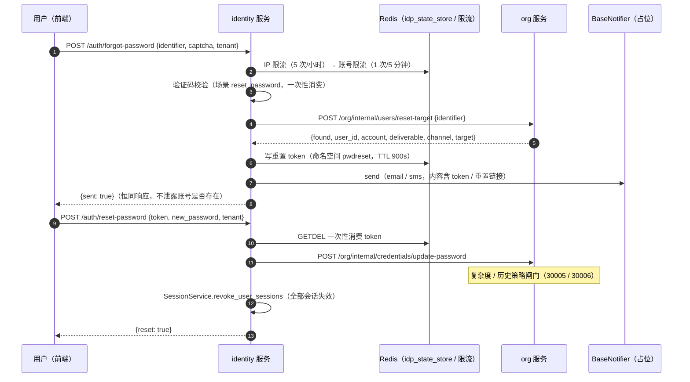

# 06 详细设计 · 找回密码流程

> 认证与安全 · 03 验证码与账号治理 · 子任务 06（需求 03-6）· 详细设计

[文档首页](../../../../../../文档首页.md) › [06 找回密码流程](../03_验证码与账号治理_06_找回密码流程.md) › 详细设计　|　[← 任务](../03_验证码与账号治理_06_找回密码流程.md)　[父任务 →](../../03_验证码与账号治理.md)

## 1. 设计目标与范围 <a id="goal"></a>

把《架构设计 · 认证与会话》§5「找回密码」从占位落为**全链路可用流程**：发起找回（账号 / 手机 / 邮箱取通道）→ 验证码校验（场景策略 `reset_password`）→ 重置 token 存 Redis（15 分钟、单次有效）→ 重置密码（强制过密码策略，消费 `03_05` 已交付语义）→ **该账号全部会话失效**（复用 `01_04` 统一撤销原语）；叠加限流防滥用（每账号 1 次 / 5 分钟、每 IP 5 次 / 小时）；发送经 `BaseNotifier` 占位（邮件 / 短信通道，真实渠道归阶段八）；响应不泄露账号是否存在。

- **本任务范围**：`sys_user` 增可空 `email` / `phone`（表文件 v3 + `org:tenant` 迁移 `0003` + 模型 / 仓储按标识取数）；org 内部「重置目标」解析端点；identity 两端点（`/auth/forgot-password` / `/auth/reset-password`）+ 找回服务（限流 / 验证码 / token 存取 / 通知占位 / 改密 / 会话批量失效）；`SessionService.revoke_user_sessions`；配置 `[password_reset]`；错误码 `20005` / `20006`；网关公开路径与生成件重生成；测试与登记回写。
- **不在本任务**：真实邮件 / 企微 / 钉钉 / 短信渠道与模板体系（**阶段八 · 通知公告**；本任务只经 `BaseNotifier` 占位 + 内容渲染）；找回 / 重置前端页面（**阶段十五**；`05_01` 登录页仅放找回入口链接）；`email` / `phone` 的维护入口、唯一性与格式校验、验证码绑定（**阶段七 · 用户管理**）；管理员重置密码 `user:reset_pwd`（**阶段七**）；token 主动撤销与审计落表（**阶段八**）；限流阈值按租户 `sys_config` 覆盖（后续）。
- **接口兼容**：新增端点与 DTO（**只增不删**）；`sys_user` 仅新增可空列；`SessionService` 仅新增方法（非抽象 / 无接口签名变更）；既有公开契约与前端类型零破坏。
- **安全影响（SDL）**：找回密码是账号接管高危入口——专项验收点：响应不泄露账号是否存在（恒 `{sent:true}`）；token 单次有效（`GETDEL` 原子消费）+ 15 分钟过期；重置路径强制过密码策略（复杂度 `30005` / 历史 `30006`）；重置成功全部会话即时失效（refresh 黑名单 + Redis 标记清理 + `session.revoked` 广播）；限流命中不泄露存在性；日志与响应**不落 token / 密码明文 / 明文联系方式**。

### 1.1 现状与缺口 <a id="gap"></a>

```text
backend/services/identity/src/bms_identity/
├── api/auth.py            # login / refresh / logout / introspect（无找回端点；租户解析 _resolve_login_tenant 私有）
├── services/auth.py       # LoginService（失败计数 / 验证码策略先例）
├── services/session.py    # SessionService（revoke 统一原语；无按用户批量撤销）
├── services/org_client.py # 无 reset-target 调用
└── schemas/auth.py        # 无找回 / 重置 DTO
backend/services/org/src/bms_org/
├── models/user.py         # SysUser（无 email / phone）
├── repositories/user.py   # 按 username / 主键取数；无按 email / phone
├── services/users.py      # profile / create（无按标识定位重置目标）
└── api/internal_users.py  # profile / create（无 reset-target）
backend/libs/bms_core/src/bms_core/
├── core/config.py         # 无 [password_reset] 配置节
├── core/error_codes.py    # 无 20005 / 20006
├── core/exceptions.py     # 无找回密码异常子段
├── idp/state/base.py      # 支持命名空间复用（现仅 idpstate / oidccode）
└── services/gateway_catalog.py  # LOGIN_PATHS 仅 login / refresh
backend/config.toml        # 无 [password_reset]；public_paths 无找回路径
deploy/contracts/*.json、frontend/packages/api-types/src/*.ts  # 无新端点
```

缺口：① 无找回 / 重置端点与编排；② `sys_user` 无联系方式，无法按标识定位账号与确定投递通道；③ 无按用户批量撤销会话的复用入口（01_04 协同契约预留）；④ 无 token 代数（命名空间 / TTL）、限流阈值、错误码与配置。**消费方**：阶段十五（找回 / 重置页面消费两公开端点与 `20005` / `20006` 文案）；`05_01`（登录页找回入口）；阶段八（真实通知渠道消费本任务 `NotificationMessage` 内容契约）。

## 2. 交付物清单 <a id="deliver"></a>

| # | 交付物 | 落点 |
| --- | --- | --- |
| 1 | `sys_user` 新增可空 `email` / `phone` | `services/org/src/bms_org/models/user.py`（修改） |
| 2 | 仓储按标识取数（邮箱小写不敏感 / 手机精确） | `services/org/src/bms_org/repositories/user.py`（修改：`get_by_email` / `get_by_phone`） |
| 3 | 重置目标解析服务（标识分类 → 通道 / 目标 / 可送达） | `services/org/src/bms_org/services/users.py`（修改：`UserResetTargetService`） |
| 4 | 重置目标请求 / 响应契约 | `services/org/src/bms_org/schemas/users.py`（修改） |
| 5 | org 内部端点 `POST /org/internal/users/reset-target` | `services/org/src/bms_org/api/internal_users.py`（修改） |
| 6 | org 迁移（新增两列） | `alembic/versions/org/tenant/0003_sys_user_reset_contact.py`（新增；`down_revision=0002_password_policy_and_account_lock`） |
| 7 | 数据表文件 `sys_user` v3 与总览状态 | `bms文档/设计/数据库设计/数据表设计/sys_user.md`（修改）、总览「核心表清单」状态 |
| 8 | 错误码 `20005` / `20006` | `libs/bms_core/src/bms_core/core/error_codes.py`（修改） |
| 9 | 异常 `PasswordResetError` / `PasswordResetTokenError` / `PasswordResetTooFrequentError` | `libs/bms_core/src/bms_core/core/exceptions.py`（修改） |
| 10 | 配置契约：[password_reset] provider-less 配置节 | `libs/bms_core/src/bms_core/core/config.py`（修改：`PasswordResetSettings`）、`backend/config.toml`（修改） |
| 11 | 找回密码服务（发起 / 重置编排） | `services/identity/src/bms_identity/services/password_reset.py`（新增：`PasswordResetService`） |
| 12 | 公开端点（两枚） | `services/identity/src/bms_identity/api/password_reset.py`（新增） |
| 13 | 租户解析共享（登录 / 找回共用） | `services/identity/src/bms_identity/api/tenancy.py`（新增：`resolve_request_tenant`；`api/auth.py` 改用） |
| 14 | 公开契约 DTO（请求 / 响应 / org 映射） | `services/identity/src/bms_identity/schemas/password_reset.py`（新增） |
| 15 | org 客户端重置目标调用 | `services/identity/src/bms_identity/services/org_client.py`（修改：`reset_target`） |
| 16 | 会话按用户批量撤销 + 撤销原因 | `services/identity/src/bms_identity/services/session.py`（修改：`revoke_user_sessions`、`REASON_PASSWORD_RESET`） |
| 17 | 路由挂载 | `services/identity/src/bms_identity/api/router.py`（修改） |
| 18 | 网关公开路径（introspect 放行） | `backend/config.toml`（`[gateway].public_paths` 增两条） |
| 19 | 网关敏感路径独立限流路由 | `libs/bms_core/src/bms_core/services/gateway_catalog.py`（`LOGIN_PATHS` 增两条）、`deploy/gateway/apisix.yaml`（重生成） |
| 20 | 公开契约快照与前端类型生成件 | `deploy/contracts/{identity,org}.json`、`frontend/packages/api-types/src/{identity,org}.ts`（重生成） |
| 21 | 基类清单登记 | 《[后端基类清单](../../../../../../后端基类清单.md)》新增 03_06 条目 + §10 继承链；流程状态存储条目补 `pwdreset` 命名空间 |
| 22 | 测试（org 解析 / identity 服务与端点 / 会话批量撤销 / 生成件） | `services/org/tests/users/`、`services/identity/tests/password_reset/`（新增 / 修改） |
| 23 | 需求 / 父任务 / 计划状态与工作量 | 需求 03 域（03-6 注块）、[父任务](../../03_验证码与账号治理.md)、[计划](../../../../计划/01_计划_认证与安全.md) |
| 24 | 实施 / 测试记录 | 本目录 `实施/`、`测试/` |

## 3. 接口 / 契约与边界 <a id="contract"></a>

### 3.1 公开端点契约（identity） <a id="endpoints"></a>

两枚端点**免登录**（登录前场景；与 `/auth/login`、`/captcha/*` 同口径），经网关按公开路径转发。



**`POST /api/v1/auth/forgot-password`**（发起找回）：

| 字段 | 类型 | 必填 | 约束 | 说明 |
| --- | --- | --- | --- | --- |
| `identifier` | str | 是 | 1 ~ 255 | 账号 / 手机号 / 邮箱（按形态取通道；格式不合法不报错，视同不存在） |
| `captcha` | `CaptchaInput` \| null | 按策略 | 同登录 | 验证码凭证（场景 `reset_password`，策略强制时必带） |
| `tenant` | str \| null | 是 | ≤ 64 | 租户编码（可选；携带则以之为准，与登录同口径） |

响应 `data`：`{"sent": true}`（`PasswordForgotResult`）——**无论账号是否存在 / 是否停用 / 有无可用通道，成功路径恒同响应**。

**`POST /api/v1/auth/reset-password`**（提交重置）：

| 字段 | 类型 | 必填 | 约束 | 说明 |
| --- | --- | --- | --- | --- |
| `token` | str | 是 | 1 ~ 512 | 找回令牌（通知下发；单次有效） |
| `new_password` | str | 是 | 1 ~ 512 | 新口令明文（策略判定在 org 侧，违规 `30005` / `30006`） |
| `tenant` | str \| null | 是 | ≤ 64 | 租户编码（定位 token 键与 org 租户库） |

响应 `data`：`{"reset": true}`（`PasswordResetResult`）。

- 路由落点：`BaseRouter(key="identity_password_reset", prefix="/auth", tags=["auth"])`；请求体与响应契约落 `schemas/password_reset.py`。
- 场景渠道默认：`reset_password` 为 `(SMS, SLIDER, IMAGE)`，短信渠道默认关闭 → 实际 `(SLIDER, IMAGE)`（`03_04` 已定）；前端按策略端点 `channels` 渲染。
- **验证码修正输入形态**：`captcha.kind` 非三形态 → `ParamError`（10001，同登录）；策略强制且未携带 → `CaptchaVerifyError`（20101）。

### 3.2 找回标识与通道解析（org 数据权威侧） <a id="org-target"></a>

**数据模型**（`sys_user` 新增两列，口径以[表文件](../../../../../../设计/数据库设计/数据表设计/sys_user.md)为唯一事实源）：

- `email VARCHAR(255)` 可空：邮箱（找回密码通道；本轮无维护入口，写入归阶段七）。
- `phone VARCHAR(32)` 可空：手机号（找回密码通道；同上）。

**内部端点**：

| 方法 | 路径 | 鉴权 | 请求 | 响应 data |
| --- | --- | --- | --- | --- |
| POST | `/api/v1/org/internal/users/reset-target` | `require_service("identity")` | `{identifier}` | `{found, user_id, account, deliverable, channel, target}` |

**解析口径**（`UserResetTargetService.resolve`，单事务只读）：

1. **标识分类**：含 `@` → 邮箱；匹配 `^\+?\d{6,20}$` → 手机；否则 → 账号。
2. **取数**：邮箱按 `lower(email) = lower(:identifier)`（跨库确定性；大小写规范化归阶段七）；手机 / 账号精确匹配；多命中取最早（`id` 升序）一条。
3. **通道**：登记邮箱存在 → `email` + 邮箱目标；否则登记手机存在 → `sms` + 手机目标；皆无 → 空通道。
4. **可送达**：`found=true ∧ status="enabled" ∧ channel≠""`；停用 / 软删**不落发送**（响应仍恒同，见 §3.4）。
5. **锁定不影响**：锁定中账号允许找回与重置（锁状态不变；解锁归 `03_07` / 到期自动）。

- **契约只增**：`UserResetTargetRequest` / `UserResetTargetResult` 新增；`target` 为内部契约字段（**不对外回显**），identity 仅用于通知投递。
- **无唯一约束 / 无检索索引**：邮箱 / 手机的唯一性、格式校验与索引归阶段七用户管理；本轮取「最早一条」确定性语义（表文件「索引与约束」节同步该口径）。

### 3.3 重置 token 存取（复用流程状态存储） <a id="token"></a>

- **通道**：复用 `BaseIdpStateStore`（key `idp_state_store`），新增命名空间 `PASSWORD_RESET_NAMESPACE = "pwdreset"`（定义在 identity 找回服务模块；键 `bms:{租户}:pwdreset:{token}`）；**零新契约**（契约文档明示「不同用途用独立命名空间隔离」）。
- **token 生成**：`secrets.token_urlsafe(32)`（高熵随机串；不落日志、不回显响应）。
- **载荷**：`{"user_id": <int>, "account": <str>, "tenant": <str>, "created_at": <ISO8601>}`。
- **TTL**：`[password_reset].token_ttl_seconds`（默认 900 秒）。
- **单次有效**：重置时 `consume(token, tenant=tenant, namespace="pwdreset")` 原子取出即删除；**先消费后改密**——命中即失效（并发仅一处成功）；改密失败（策略违例）不退还 token，用户需重新发起（严格单次语义，防重放）。
- **降级（fail-closed）**：`save` 失败 → `ServiceUnavailableError`（10007 / 503，不假报已发送）；`consume` 未命中（含 Redis 故障降级）→ `PasswordResetTokenError`（20005）。

### 3.4 限流与防枚举 <a id="rate-limit"></a>

**限流**（经 `BaseRateLimiter`；命中抛 `PasswordResetTooFrequentError` 20006 / 429）：

| 序 | 维度 | key | 规则（默认） |
| --- | --- | --- | --- |
| 1 | IP | `build_rate_limit_key(dimension="password-reset-ip", target=ip, tenant=tenant)` | 5 次 / 3600 秒 |
| 2 | 标识 | `build_rate_limit_key(dimension="password-reset", target=<归一化 identifier>, tenant=tenant)` | 1 次 / 300 秒 |
| 3 | 用户 | `build_rate_limit_key(dimension="password-reset-user", target=<user_id>, tenant=tenant)`（仅命中账号时） | 1 次 / 300 秒 |

- **顺序**：IP → 验证码 → 标识 →（命中后）用户 → token 与发送；**验证码不通过不消耗标识 / 用户配额**（防用错误验证码烧掉他人找回额度）；IP 维度先计数（粗粒度，5 次/小时余量充足）。
- **键不与其他业务混用**：独立维度名（`password-reset*`），不与登录 `ip` / `account` / `login-fail` 键冲突。
- **归一化**：`identifier.strip()`；含 `@` 时小写（与 org 邮箱匹配口径一致）。
- **防枚举**：成功路径恒 `{sent: true}`；**不存在 / 停用 / 无通道 / 无联系方式**均同响应、同 HTTP 状态、不发送（记 info 日志，不落明文联系方式）；参数缺失（如 `identifier` 为空）与租户缺失仍按通用错误（10001 / 80001）返回，不涉账号存在性。

### 3.5 重置改密与会话失效 <a id="reset"></a>

- **改密**：`OrgCredentialClient.update_password(tenant, account, new_password)`（`03_05` 契约）——复杂度违规抛 `30005`（data 带 `violations`）、命中历史抛 `30006`、账号不存在返回 `False`（转 `20005`）；**重置成功由 org 自动清 `pwd_reset_required`**（`03_05` 既有语义）。
- **会话全失效**：`SessionService.revoke_user_sessions(user_id, tenant, reason="password_reset")`——
  - 新增 `REASON_PASSWORD_RESET = "password_reset"`；
  - 单事务内 `list_active_by_user` 取全部在线会话 → 逐个复用 `_repo.revoke(revoked_at)`；
  - 提交后逐会话 `_after_revoke`（refresh 入黑名单 + 删 Redis 会话标记 + `session.revoked` 广播）；单会话运行时清理异常记 warning 并继续（DB 已撤销，标记 TTL 自然失效兜底），不阻断其余会话与重置结果；
  - 返回被撤销的会话 id 清单（供测试与结构化日志）。
- **即时生效**：黑名单 + 标记删除后，原 refresh 下次使用被拒、原 access 下一请求因标记缺失被 `require_auth` 拦截（`20012` / 401）。
- **不清锁定 / 失败计数**：重置成功不解除 `fail_limit` 锁定、不清零失败计数（归 `03_07` 与窗口自然过期）。

### 3.6 配置契约 <a id="config"></a>

`config.toml` 新增一节（`Settings.password_reset`，缺省值兜底；`.env` 不新增键）：

```toml
[password_reset]
# 找回密码（token TTL 与限流阈值；重置链接基址空串 = 通知内容给纯令牌文案）
token_ttl_seconds = 900
account_rate_limit = 1
account_rate_window = 300
ip_rate_limit = 5
ip_rate_window = 3600
reset_url = ""
```

- `reset_url` 非空时通知内容拼 `{reset_url}?token={token}&tenant={tenant}`（阶段十五前端重置页消费）；为空回退「重置令牌：{token}（15 分钟内有效，单次使用）」文案。
- 按租户 `sys_config` 覆盖归后续（本轮需求未要求差异化）。

### 3.7 内部数据契约 <a id="dto"></a>

**org 侧**（`schemas/users.py`）：

| 契约 | 字段 | 说明 |
| --- | --- | --- |
| `UserResetTargetRequest`（新） | `identifier: str`（1~255） | 账号 / 手机 / 邮箱 |
| `UserResetTargetResult`（新） | `found: bool` / `user_id: int \| None` / `account: str` / `deliverable: bool` / `channel: str`（`email`/`sms`/`""`）/ `target: str` | 重置目标解析结果 |

**identity 侧**（`schemas/password_reset.py`）：

| 契约 | 字段 | 说明 |
| --- | --- | --- |
| `PasswordForgotRequest`（新） | `identifier` / `captcha` / `tenant` | 发起找回 |
| `PasswordForgotResult`（新） | `sent: bool = True` | 恒 true |
| `PasswordResetRequest`（新） | `token` / `new_password` / `tenant` | 提交重置 |
| `PasswordResetResult`（新） | `reset: bool = True` | 成功恒 true |
| `OrgResetTargetResult`（新） | 同 org 结果字段 | org 内部契约映射 |

- `OrgCredentialClient.reset_target(tenant, identifier)` 经 `_post_path("/api/v1/org/internal/users/reset-target", _PROFILE_SCOPES, …)`（复用 `user_profile` scope）；下游不可达 / 契约非法 → `ServiceUnavailableError`（10007，fail-closed）。

### 3.8 错误码 <a id="errors"></a>

`error_codes.py` 顺延新增（2xxxx 认证段，登录类 `20002`~`20004` 之后、会话段 `20011` 之前）：

| 错误码 | 名称 | HTTP | 说明 |
| --- | --- | --- | --- |
| 20005 | `PASSWORD_RESET_TOKEN_INVALID` | 400 | 重置令牌无效 / 过期 / 已使用（三态合一，防枚举） |
| 20006 | `PASSWORD_RESET_TOO_FREQUENT` | 429 | 找回请求过于频繁（账号 / IP / 用户维度限流命中） |

- 新增异常子段基 `PasswordResetError(AuthError)` + `PasswordResetTokenError`（20005/400）+ `PasswordResetTooFrequentError`（20006/429）。
- 文案由前端按 i18n 映射（`error.20005` / `error.20006`），后端不拼文案；限流不再走通用 `10005`（可比登录给出更精确提示）。

### 3.9 失败分支与错误语义 <a id="failures"></a>

| 场景 | 行为 |
| --- | --- |
| 账号不存在 / 停用 / 软删 / 无邮箱手机 | 不发送，恒 `{sent: true}`（防枚举；info 日志） |
| 标识为空 / 超长 | `ParamError`（10001） |
| 租户缺失 / 未知 | `TenantNotFoundError`（80001 / 404） |
| 验证码策略强制且未携带 / 校验不通过 | `CaptchaVerifyError`（20101；不消耗标识配额） |
| 验证码 kind 非法 | `ParamError`（10001） |
| 每账号 5 分钟内重复发起 / 每 IP 超 5 次每小时 | `PasswordResetTooFrequentError`（20006 / 429） |
| org 解析接口不可达 / 响应非法 | `ServiceUnavailableError`（10007 / 503，fail-closed） |
| token 写入失败（Redis 不可用） | `ServiceUnavailableError`（10007 / 503，不假报已发送） |
| 通知发送失败（`delivered=false`）/ 渠道异常 | `ServiceUnavailableError`（10007 / 503，不静默） |
| 重置 token 无效 / 过期 / 已用 | `PasswordResetTokenError`（20005 / 400） |
| 重置时账号已不存在 | `20005`（org `not_found` 归并；不泄露细节） |
| 新密码不合规 / 命中历史 | `30005`（data 带 violations）/ `30006` |
| org 改密接口不可达 | `ServiceUnavailableError`（10007 / 503） |
| 会话运行时清理失败 | 记 warning 并继续（DB 已撤销，标记 TTL 兜底），重置仍成功 |
| `sys_config` / 场景策略读取失败 | 验证码策略缺省回落平台默认（`03_04` 既有降级） |

### 3.10 网关与生成件 <a id="gateway"></a>

- **公开路径**（introspect 放行）：`backend/config.toml` 的 `[gateway].public_paths` 增 `/api/identity/v1/auth/forgot-password`、`/api/identity/v1/auth/reset-password`（外部路径形态，与既有 `/auth/login` 同口径）。
- **独立限流路由**：`gateway_catalog.py` 的 `LOGIN_PATHS` 增同两条（登录档 10 次 / 60 秒，精确路由 priority 10）→ 重生成 `deploy/gateway/apisix.yaml`（`uv run python -m ops.gateway_config render`）。
- **契约与类型**：重生成 `deploy/contracts/{identity,org}.json`（`uv run python -m ops.contract_snapshot export`）与 `frontend/packages/api-types/src/{identity,org}.ts`（`pnpm --filter @bms/api-types gen`），零漂移。
- **无前端组件改动**（页面归阶段十五）；公开契约只增端点与 DTO。

## 4. 兼容性与消费方影响 <a id="compat"></a>

- **契约只增不删**：identity / org 各新增端点与 DTO；既有字段零变更；`session.json`（会话契约）不变（仅服务方法新增）。
- **`sys_user` 只增可空列**：迁移 `org:tenant 0003` 向后兼容，旧数据 `NULL`；无回填、无索引变更。
- **`SessionService` 只增方法**：`revoke_user_sessions` 为新增，既有 `revoke` / `kick` / `enforce_max_active` 零改动。
- **`api/auth.py` 小重构**：租户解析抽到 `api/tenancy.py`（行为等价，登录既有用例不改断言）；`LoginService` 零改动。
- **配置新增节**：`PasswordResetSettings` 缺省值兜底，未配置也可启动；`config.dev.toml` 无须改动。
- **测试设施**：identity 单测默认 `idp_state_store` / `rate_limiter` / `notifier` 为空 provider（Null），找回用例按既有 `wire_auth` 口径经依赖覆盖注入 `MemoryIdpStateStore` / `MemoryRateLimiter` / 记录型通知器替身。
- **既有用例影响**：`test_gateway_catalog` 的 `route["uris"] == list(gc.LOGIN_PATHS)` 等值断言自动跟随常量扩展（仍通过）；`org:tenant` 表集断言不变（仅列增加）；`sys_user` 表文件 / 总览 / 基类清单 / 生成件按登记回写。
- **消费方**：阶段十五（找回 / 重置页面：消费两端点 + `20005` / `20006` 文案 + `reset_url` 链接形态）；`05_01`（登录页找回入口）；阶段八（通知渠道消费 `NotificationMessage` 内容契约与 `email` / `sms` 通道语义）。

## 5. 测试设计与验收映射 <a id="test"></a>

用例**先登记 Kiwi TCMS 再编码**（本任务新登记 1 条：**Kiwi 2210**，分类「平台骨架」/ P2 / CONFIRMED / 自动化）。测试落点 `services/org/tests/users/` + `services/identity/tests/password_reset/`。

| # | 用例 | 断言要点 | 对应完成标准 |
| --- | --- | --- | --- |
| 1 | 标识解析与通道（org） | 邮箱 / 手机 / 账号三形态命中；邮箱大小写不敏感；通道 email 优先、sms 兜底、皆无空串；停用 / 软删不可送达；未命中 `found=false` | 账号 / 手机 / 邮箱取通道 |
| 2 | 发起成功链路 | 验证码通过 → org 解析 → token 落 `pwdreset` 命名空间（载荷含 user_id）→ 通知消息（channel / target / content 含 token）→ `{sent:true}` | 找回链路可用 |
| 3 | 防枚举 | 不存在 / 停用 / 无通道三态均 `{sent:true}` 且通知器零调用；响应体与成功路径一致 | 不泄露账号是否存在 |
| 4 | 验证码强制 | 策略 required 未携带 → 20101；凭证不通过 → 20101；kind 非法 → 10001；不消耗标识限流配额 | 验证码校验（场景策略） |
| 5 | 限流阈值 | 同标识 5 分钟内第二次 → 20006；同 IP 第 6 次（换标识）→ 20006；命中提示语义 | 限流防滥用 |
| 6 | 重置成功链路 | token 一次性消费 → 改密调用 → 全部在线会话 `revoked_at` 落库 + 标记删除 + `session.revoked` 广播 → `{reset:true}` | 重置与会话全失效 |
| 7 | token 单次 / 过期 / 无效 | 二次使用 → 20005；TTL 过期（memory 到期）→ 20005；伪造 token → 20005 | token 单次 / 过期 |
| 8 | 重置过策略 | 假 org 返回 `policy_violation` → 30005（data 带 violations）；`history_reused` → 30006；`not_found` → 20005 | 重置强制过密码策略 |
| 9 | 原会话下一请求即 401 | 登录建会话 → 重置 → 原 access 走 `require_auth` → 20012 / 401（会话标记已删） | 重置后原会话即 401 |
| 10 | org 客户端与降级 | `reset_target` 解析成功；非 2xx / 契约非法 → 10007；通知 `delivered=false` → 10007 | 契约映射 / fail-closed |
| 11 | 公开路径与生成件 | introspect 对两路径放行；`LOGIN_PATHS` 含两条且 apisix.yaml 重生成零漂移；`identity.json` / `org.json` 与 api-types 零漂移 | 网关与契约 |
| 12 | 迁移与门禁 | `org:tenant` head=`0003` 单链、`sys_user` 含 `email` / `phone`；`pytest` / `ruff` / `pyright` / `check-preflight.py --fast` / 契约快照零漂移全绿 | 完成标准 |

**验收映射**：需求 03-6「完成标准」逐条落用例 1~12（全链路可用 / token 单次与过期 / 限流阈值 / 重置后原会话 401 / `pytest` + `pyright` + `ruff` 通过）；新增 / 变更代码覆盖率 100%。

## 6. 登记落点 <a id="registry"></a>

| 内容 | 落点 |
| --- | --- |
| `sys_user` v3（`email` / `phone`）与迁移登记 | `设计/数据库设计/数据表设计/sys_user.md`（变更记录 v3）、总览「核心表清单」状态 |
| 找回密码流程 / 会话批量撤销 / 通知占位消费 | 《[后端基类清单](../../../../../../后端基类清单.md)》新增「找回密码流程（认证链路，03_06）」条目 + §10 继承链 |
| 流程状态存储 `pwdreset` 命名空间复用 | 《后端基类清单》「流程状态存储」条目补注 |
| 错误码 `20005` / `20006` 与异常子段 | `bms_core/core/error_codes.py`（统一登记点）、`exceptions.py` |
| 网关生成件 | `deploy/gateway/apisix.yaml`、`bms_core/services/gateway_catalog.py` |
| 公开契约快照与前端类型 | `deploy/contracts/{identity,org}.json`、`frontend/packages/api-types/src/{identity,org}.ts` |

| 消费方协同契约 | `05_01`（登录页找回入口）、阶段十五（找回 / 重置页面）、阶段八（真实通知渠道）任务文档或计划 §7 归口 |
| 实施 / 测试记录 | 本目录 `实施/`、`测试/` |

> 《架构设计 · 认证与会话》§5 已登记「token 存 Redis（TTL 15 分钟、单次有效）、限流防滥用、重置后强制失效全部会话」语义，本任务按已定语义实现，**无需改架构节点**；《概要设计 · 邮件通知》§3 已登记找回密码复用邮件通道（阶段八）。

## 7. 边界与开放项 <a id="boundary"></a>

- **真实通知渠道**：邮件 / 企微 / 钉钉 / 短信渠道与模板体系、`NotifyChannel` 扩展（企微 / 钉钉）→ **阶段八 · 通知公告**；本任务通知内容为占位文案（`reset_url` 可配）。
- **前端页面**：找回 / 重置页面、验证码交互与倒计时 → **阶段十五**；`05_01` 登录页仅放「忘记密码」入口链接（协同契约标注）。
- **联系方式维护**：`email` / `phone` 的录入 / 修改 / 唯一性 / 格式校验 / 验证码绑定（含 SSO 邮箱落库）→ **阶段七 · 用户管理**；本轮字段无可写入口（测试与运维经仓储 / SQL 置入），取「最早一条」确定性语义。
- **管理员重置**：`user:reset_pwd`（强制首登改密 + 通知）→ **阶段七**；与本任务自助找回互不复用（同消费 org 改密与批量撤销能力）。
- **token 撤销与审计**：主动撤销未使用 token、找回 / 重置审计落表（`sys_login_log` 类）→ **阶段八**。
- **限流租户化**：`[password_reset]` 阈值按租户 `sys_config` 覆盖 → **后续**（本轮平台默认）。
- **防枚举时序侧信道**：不存在账号路径更短（少一次通知调用），未做等时处理 → **后续安全强化**按需评估。
- **多命中数据**：同邮箱 / 手机对应多账号时取最早一条；唯一约束落地后该分支自然消失（阶段七）。
- Kiwi 用例编号 → 已登记 **2210**（2026-09-28）。

## 8. 对齐记录 <a id="align"></a>

| # | 事项 | 结论（2026-09-28 拍板） |
| --- | --- | --- |
| 1 | 找回标识与通道 | `sys_user` 扩展可空 `email` / `phone`；邮箱输入→邮件、手机输入→短信、账号输入→登记邮箱优先、手机兜底 |
| 2 | 接口路径 | `POST /api/v1/auth/forgot-password` + `POST /api/v1/auth/reset-password`（动词短语，与 `/auth/login` 先例一致） |
| 3 | token 存储 | 复用 `idp_state_store`，命名空间 `pwdreset`、键 `bms:{租户}:pwdreset:{token}`；零新契约 |
| 4 | TTL / 限流配置 | 新增 `[password_reset]` 配置节（900s / 1 次 300s / 5 次 3600s）；租户化归后续 |
| 5 | 防枚举响应 | 成功路径恒 `{sent: true}`（存在 / 停用 / 无通道一律同响应） |
| 6 | 通道失败语义 | 显式 `ServiceUnavailableError`（10007 / 503），不静默放行 |
| 7 | 会话失效落点 | `SessionService.revoke_user_sessions`（循环 `list_active_by_user` + 统一撤销原语 + 广播 `session.revoked`），后续管理侧复用 |
| 8 | 错误码 | `20005` 令牌无效 / 过期 / 已用（三态合一）+ `20006` 找回请求过于频繁（专用限流码） |
| 9 | 锁定 / 停用账号 | 仅启用账号可送达；锁定中允许重置、锁状态不变（解锁归 `03_07` / 到期自动） |
| 10 | 重置后锁定 | 不清登录失败计数 / 不解除 `fail_limit` 锁定（归 `03_07` 与窗口自然过期） |
| 11 | token 消费时机 | **先消费后改密**（严格单次；改密失败不退还，需重新发起） |
| 12 | 限量维度 | 独立维度键 `password-reset-ip` / `password-reset` / `password-reset-user`，不与登录键混用；验证码失败不消耗标识配额 |
| 13 | 网关口径 | 两路径入 `public_paths`（公开）+ `LOGIN_PATHS`（登录档独立限流路由） |
| 14 | Kiwi 用例 | 本任务新登记 1 条（Kiwi 2210，分类「平台骨架」/ P2 / CONFIRMED / 自动化） |

> 详细设计定稿后按《[AI开发规范](../../../../../../规范/AI开发规范.md)》「单任务交付一条龙」自动续行：实施 → 测试（Kiwi 先登记）→ 验证 → 登记回写 → 记录 → 提交。
