# 07 实施 · 账号锁定与解锁管理

> 认证与安全 · 03 验证码与账号治理 · 子任务 07（需求 03-7）· 实施记录

[文档首页](../../../../../../文档首页.md) › [07 账号锁定与解锁管理](../03_验证码与账号治理_07_账号锁定与解锁管理.md) › 实施记录　|　[← 任务](../03_验证码与账号治理_07_账号锁定与解锁管理.md)　[测试记录 →](../测试/01_测试_07_账号锁定与解锁管理.md)

## 1. 实施信息 

| 项 | 值 |
| --- | --- |
| 任务 | [07 账号锁定与解锁管理](../03_验证码与账号治理_07_账号锁定与解锁管理.md) |
| 对应需求 | [03-7](../../../../需求/03_需求_验证码与账号治理.md#r03-7) |
| 详细设计 | [01 详细设计](../设计/01_详细设计_07_账号锁定与解锁管理.md) |
| 实施日期 | 2026-09-28 |
| 实施人 | minjian |
| 实施环境 | 本地开发机（Python 3.14.4 / uv，依赖外置 `DEPS_DIR`）；临时 SQLite（内存 / 文件）验证迁移与并发乐观锁；Kiwi TCMS 登记 **2211** |
| 提交 | 详细设计随 docs 提交；实施 / 测试 / 登记回写 / 记录随 feat 提交（提交后回填） |
| 结论 | 完成（设计口径全部落地；锁管理页面归阶段七、Celery 定时与操作日志真实落库归阶段八） |

```mermaid
flowchart LR
    A["表文件 sys_account_lock v2 + 迁移 0004：expire_at / unlock_mode"] --> B["模型常量 + 仓储：生效判定 / list_filtered / get_open_by_user"]
    B --> C["错误码 30007 + 异常子段 AccountLockNotFoundError"]
    C --> D["AccountLockService：lock_manual / unlock / list_locks / detail"]
    D --> E["CredentialService：fail_limit 同事务写锁 + 到期自动闭锁"]
    E --> F["org 管理端点 /org/locks + 路由挂载 + 内部端点注入锁定仓储 + 审计占位"]
    F --> G["登记回写（概要 / 架构 / 简称规范 / 基类清单）+ 契约与前端类型重生成"]
    G --> H["测试（Kiwi 2211）+ 验证 + 记录"]
```

## 2. 实施概览 

## 3. 实施过程 

1. **表结构与迁移**（先表文件）：`sys_account_lock.md` 补 `expire_at` / `unlock_mode` 两列与变更记录 v2；`SysAccountLock` 模型补两列与 `LOCK_TYPE_*` / `UNLOCK_MODE_*` 常量；新增迁移 `alembic/versions/org/tenant/0004_sys_account_lock_expire.py`（`down_revision=0003_sys_user_reset_contact`）。
2. **仓储**（`repositories/account_lock.py`）：`get_active_by_user` 改为**生效判定**（`unlock_at IS NULL` 且未到期），新增 `get_open_by_user`（未解锁，含已到期未闭锁）、`list_filtered` / `count_filtered`（`user_id` / `lock_type` / `active` 三态 / 锁定时间区间 + 分页排序白名单）。
3. **错误码与异常**：`error_codes.py` 增 `ACCOUNT_LOCK_NOT_FOUND=30007`；`exceptions.py` 增子段基 `AccountLockError(UserOrgError)` + `AccountLockNotFoundError`（业务失败 HTTP 200）。
4. **账号锁定服务**（`services/account_lock.py`）：扩展 `lock_manual`（manual 型 + 远期哨兵 + `expire_at=NULL`，已生效锁幂等返回既有，目标不存在 `NotFoundError` 10002）、`unlock`（清 `locked_until` / `failed_count`，回填 `unlock_at` / `unlock_by` / `unlock_mode=manual`）、`list_locks` / `detail`；`scan_inactive` 改用生效判定（避免已到期 `fail_limit` 记录阻塞）。
5. **凭据服务**（`services/credentials.py`）：构造增可选 `AccountLockRepository`；`apply_login_state` 失败达阈值（`lock_seconds>0`）同事务写 `fail_limit` 锁（`expire_at=now+窗口`，已有生效锁幂等跳过）；成功写回时关闭已到期 `fail_limit` 锁（`unlock_mode=auto` / `unlock_by=NULL`）。
6. **端点与路由**：新增 `api/account_locks.py`（`BaseRouter(key="org_account_locks", prefix="/org/locks")`，`require_auth` + 端点级 `require_permission("user:query" / "user:lock" / "user:unlock")`，`AuditCapturer` 占位 + 结构化日志）；`api/router.py` 挂载；`api/internal.py` 的 `_service` 注入锁定仓储。
7. **登记回写**：《概要设计 03》§2.1 / §2.2 / §4.1 / §5 / §6.1 / §6.4 补手动锁定与 org 命名空间路径、`user:lock` 动作码与 `expire_at` / `unlock_mode`；《架构设计 14》§5、《架构设计 15》动作清单、《英文简称规范》动作码表补 `lock`；《后端基类清单》新增 03_07 条目 + §10 继承链；数据表文件 v2；需求 03-7 / 任务 07 / 父任务 / 计划状态与工时。
8. **生成物**：`deploy/contracts/org.json` 与 `frontend/packages/api-types/src/org.ts` 重生成（零漂移）。
9. **测试**：Kiwi **2211** 先登记；新增 `services/org/tests/account_lock/{test_fail_limit,test_manual_lock,test_unlock,test_list,test_endpoints}.py`，适配 `test_scan.py`。
10. **验证**：定向 `pytest`、`ruff` / `ruff format --check`、`pyright`、`check-preflight.py --fast` 全绿；覆盖率见 §5。

## 4. 问题与处置 

| # | 问题 / 现象 | 原因 | 处置与落点 |
| --- | --- | --- | --- |
| 1 | `scan_inactive` 可能被已到期未闭锁的 `fail_limit` 记录阻塞 | `get_active_by_user` 原仅判 `unlock_at IS NULL`，忽略 `expire_at` | 改为生效判定（含 `expire_at > now`）；新增 `get_open_by_user` 供自动闭锁查找 |
| 2 | 测试中同一会话「读 → 写」交替触发 `InvalidRequestError: a transaction is already begun` | 服务方法内用显式 `uow.begin()`，而仓储只读查询会 autobegin 留下事务 | 服务层用例调整读写顺序或读后 `rollback()`；端点用例改文件库 + 每请求新会话（贴近生产） |
| 3 | `apply_login_state` 增写锁所需仓储可能导致既有构造用例失败 | 构造参数为必填会破坏既有调用 | `locks` 设为**可选**（缺省 None 跳过写锁），向后兼容 |
| 4 | 解锁并发分支难在单会话内复现 | 需真实版本冲突 | 文件级 SQLite + 会话 A 预载旧版本 + 会话 B 提交新版本 → 触发 `StaleDataError` 转 `ConcurrentConflictError`（10004） |
| 5 | 契约 / 前端类型漂移 | 新增 org 公开端点与 DTO | 重生成 `deploy/contracts/org.json`、`frontend/packages/api-types/src/org.ts` |

## 5. 验证结果 

| 项 | 方法 | 结果 |
| --- | --- | --- |
| 定向用例（组织 + 基座） | `uv run pytest services/org/tests libs/bms_core/tests/{core,alembic,password,permission,audit} -q` | **238 passed** |
| 锁定 / 凭据专项 | `uv run pytest services/org/tests/{account_lock,credentials} -q` | **25 passed** |
| 覆盖率（新增 / 变更） | `--cov=bms_org.{api.account_locks,models.account_lock,repositories.account_lock,schemas.account_lock,services.account_lock,services.credentials}` | 六模块均 **100%** |
| 静态检查 | `uv run ruff check .` / `uv run ruff format --check .` | 全绿 |
| 类型检查 | `uv run pyright` | 0 errors / 0 warnings |
| 基座校验 | `python3 scripts/tools/preflight/check-preflight.py --fast` | 全部通过（基座 / 边界 / 网关 / 契约快照 / api-types 零漂移） |
| 迁移链 | `uv run pytest libs/bms_core/tests/alembic -q` | 通过（`org:tenant` head `0004_sys_account_lock_expire`） |
| Kiwi 用例 | 平台登记 | **2211**（平台骨架 / P2 / CONFIRMED / 自动化） |

## 6. 偏差与遗留 

- **偏差（已回写设计）**：见 §4（生效判定口径 / 构造可选仓储 / 测试事务处理 / 生成物重生成）；设计 §3 与 §8 已同步。管理接口取 org 命名空间与 `user:lock` 动作码、补两列等属**设计阶段决策确认**，非实施偏差。
- **遗留**：
  1. 锁定列表 / 详情 / 手动锁定 / 解锁**页面**（**归口：阶段七 · 用户管理**）。
  2. `inactive` 扫描 Celery 定时调度（**归口：阶段八 · 任务调度**）。
  3. 操作日志真实落库（本任务 `AuditCapturer` 占位 + 结构化日志，**归口：阶段八**）。
  4. 解锁不回调清 identity Redis 失败计数（窗口自然过期；**归后续评估**）。
  5. 锁记录 90 天归档（**归后续审计归档策略**）。
  6. 概要 03 §7 的 `30001 用户不存在` 与平台 `PERMISSION=30001` 冲突（**既有问题，未在本任务修改**）。

> 本文档依《[文档生成规范](../../../../../../规范/文档生成规范.md)》编写
