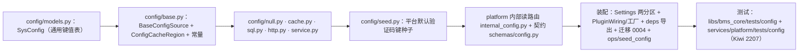

# 08 实施 · 系统参数（sys_config）读取基座

> 认证与安全 · 03 验证码与账号治理 · 子任务 08（需求 03-8）· 实施记录

[文档首页](../../../../../../文档首页.md) › [08 系统参数读取基座](../03_验证码与账号治理_08_系统参数读取基座.md) › 实施记录　|　[← 任务](../03_验证码与账号治理_08_系统参数读取基座.md)　[测试记录 →](../测试/01_测试_08_系统参数读取基座.md)

## 1. 实施信息 

| 项 | 值 |
| --- | --- |
| 任务 | [08 系统参数（sys_config）读取基座](../03_验证码与账号治理_08_系统参数读取基座.md) |
| 对应需求 | [03-8](../../../../需求/03_需求_验证码与账号治理.md#r03-8)（补充需求） |
| 详细设计 | [01 详细设计](../设计/01_详细设计_08_系统参数读取基座.md) |
| 实施日期 | 2026-09-27 |
| 实施人 | minjian |
| 实施环境 | 本地开发机（Python 3.14.4 / uv；依赖外置 `DEPS_DIR`）；临时 SQLite 跑 `platform:tenant` 链迁移；fakeredis 注入 Redis 缓存域 |
| 提交 | 详细设计 `b7468694`；实施 / 测试 / 登记回写 / 记录随本次提交 |
| 结论 | 完成（设计口径全部落地；管理面按设计归阶段八） |

## 2. 实施概览 

## 3. 实施过程 

1. **表与模型**：新增 `bms_core/config/models.py::SysConfig`（`config_key` 唯一（与 `deleted_at` 复合）/ `value` TEXT / `remark`）；`db/migration.py::COMMON_MODEL_MODULES` 增 `bms_core.config.models`（各服务租户库自动建表）；`services/table_registry.py` 登记 `sys_config`（owner `platform` / `TENANT` / `enabled`）；数据表文件与总览登记同步（状态「已落库」）。
2. **迁移**：`alembic/versions/platform/tenant/0004_sys_config.py`（`down_revision=0003_sys_outbox_event_version`；`branch_labels=None`，分支标签只在链首 0001）。
3. **能力域契约**：`config/base.py` 定义 `BaseConfigSource.get_many`（只返存在键，缺失略去）/ `get`（默认委托）/ `ConfigCacheRegion`（`config_key` / `version_key` / 异步值读写与版本）/ 提供者（经 `resolve_plugin`）。
4. **实现**：`NullConfigSource` / `NullConfigCacheRegion`；`MemoryConfigCacheRegion`（值 + 按租户版本）、`RedisConfigCacheRegion`（Redis 共享层 + L1、`INCR` 版本）；`SqlConfigSource`（租户库 `IN` 查询 + 缓存优先，DB 异常降级空结果）；`HttpConfigSource`（经 `service_client` 调 platform 内部端点，不可达 / 非 2xx / 非法体降级空结果）；`ConfigService.set` / `drop`（先写库后删缓存 + 递增版本，无路由）。
5. **平台内部读端点**：`POST /api/v1/platform/internal/configs/resolve`（`require_service("identity", "org")`），契约 `ConfigResolveRequest` / `ConfigResolveResponse`；挂载 platform 路由并重生成 `deploy/contracts/platform.json` 与前端 `api-types/src/platform.ts`。
6. **装配与配置**：`Settings` 增 `config_source` / `config_cache_region`；`assembly.py` 增 `PluginWiring`、`_NULL_MODULES`（`bms_core.config.null`）、四个工厂（memory / redis / sql / http）；`api/deps.py` 导出 `get_config_source` / `get_config_cache_region` / `get_config_service`；`config.dev.toml` 置 `config_source=sql` / `config_cache_region=memory`（与 dict 同构）。
7. **种子与运维**：`config/seed.py`（`PLATFORM_CONFIG_DEFAULTS`：五场景 × 4 键 + 3 渠道开关）与 `ops/seed_config.py`；`ops/init_tenant.py` 在字典种子后追加配置种子（`seeded` 合计）。
8. **验证**：定向用例、全量 `pytest`、`ruff` / `pyright`、`check-preflight.py`（含契约快照与 api-types 零漂移）全绿；详见 §5。
9. **登记回写**：《[后端基类清单](../../../../../../后端基类清单.md)》config 能力域条目、《[概要设计 · 系统参数](../../../../../../设计/概要设计/10_概要设计_系统参数.md)》§6.3 键位定稿、数据表文件与总览、父任务 / 计划；消费方前置契约标注（`03_04`）。

## 4. 问题与处置 

| # | 问题 / 现象 | 原因 | 处置与落点 |
| --- | --- | --- | --- |
| 1 | 迁移分支报「Branch name 'platform:tenant' already used」/「Multiple head」（拟用 `0002_sys_config`） | `platform:tenant` 链已有 `0002_sys_outbox`（infra），同号分叉且重复声明分支标签 | 迁移改 `0004_sys_config`（接 `0003_sys_outbox_event_version`，`branch_labels=None`）；`test_alembic_chains` head 断言与 `test_migration_ops` revision 断言同步适配（设计 §8 回写） |
| 2 | 装配报插件重名（`config_cache_region` memory / redis） | 零参可实例化的缓存实现类声明了 `plugin_name` → 被注册表自动收集，与显式工厂重复 | 缓存实现类**不声明** `plugin_name`（经工厂显式登记，与 dict 同口径）；工厂 `MemoryConfigCacheRegionFactory` 亦不声明 `plugin_name`（零参工厂避免自动收集） |
| 3 | provider 基线选型（设计原写「基线 http」） | platform 自调自身会递归、dev 单服务无 platform | 与 dict 同构：dev `config_source=sql`（各服务本租户库副本）、生产非 platform 覆盖 `http`（设计 §3.7 回写） |
| 4 | `check-backend-base` 报 `ConfigService` / `SeedConfig` 未登记 | 二者直接继承 `BaseObject`，须在《后端基类清单》登记 | 清单新增 config 能力域条目（继承链含 `ConfigService` / `SeedConfig`） |
| 5 | 测试内联 `_MappingSource` 等替身类被注册表自动收集导致重名 | 替身类声明了 `plugin_name` 且零参 | 去掉替身类 `plugin_name`（非 Null 子类未声明即不登记） |
| 6 | `integration-mysql` 真库迁移失败：`BLOB, TEXT, GEOMETRY or JSON column 'value' can't have a default value` | 迁移给 `TEXT` 列设了 `server_default=""`（SQLite/PG 允许，MySQL 不允许） | 迁移去掉 `value` 的 `server_default`（空值由应用侧承载）；表文件同步；属三库兼容红线（验证见 §5 真库用例） |

## 5. 验证结果 

| 项 | 方法 | 结果 |
| --- | --- | --- |
| 定向用例 | `uv run pytest libs/bms_core/tests/config services/platform/tests/config -q` | 全通过 |
| 迁移链 | `uv run pytest libs/bms_core/tests/alembic -q` | 25 passed（head `0004_sys_config`） |
| 种子 / 迁移运维 | `uv run pytest libs/bms_core/tests/ops -q` | 全通过（init_tenant 种子合计） |
| 静态检查 | `uv run ruff check .` / `uv run ruff format --check .` | 全绿 |
| 类型检查 | `uv run pyright` | 0 errors / 0 warnings |
| 新增模块覆盖率 | `--cov=bms_core.config --cov-report=term-missing` | 337 语句 / 0 未覆盖 = **100%** |
| 全量后端用例 | `uv run pytest -q` | 1722 passed / 40 skipped |
| 契约零漂移 | `python3 scripts/tools/preflight/check-preflight.py --fast` | 全部通过（platform.json / api-types 重生成后零漂移） |
| 全链路预检 | `python3 scripts/tools/preflight/check-preflight.py` | 全部通过 |

## 6. 偏差与遗留 

- **偏差（已回写设计）**：见 §4（迁移编号 `0004_sys_config`；provider 口径与 dict 同构；Kiwi 分类用既有「平台骨架」）。
- **遗留**：
  1. `sys_config` 管理面（CRUD 接口 / 页面 / `config:manage` 权限 / 字段级审计 / 平台默认向租户种子下发流程）（**归口：阶段八 · 系统参数模块**）。
  2. 配置变更跨服务事件广播（本轮靠短 TTL + 版本键）（**归口：后续**）。
  3. 密钥类参数加密存取（如 AI `api_key`，另走 `secret:` 机制）（**归口：域 04_03**）。

> 本文档依《[文档生成规范](../../../../../../规范/文档生成规范.md)》编写
