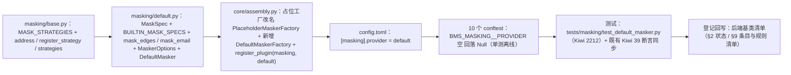

# 01 实施 · 脱敏基座真实实现

> 认证与安全 · 04 数据脱敏与安全加固 · 子任务 01（需求 04-1）· 实施记录

[文档首页](../../../../../../文档首页.md) › [01 脱敏基座真实实现](../04_数据脱敏与安全加固_01_脱敏基座真实实现.md) › 实施记录　|　[← 任务](../04_数据脱敏与安全加固_01_脱敏基座真实实现.md)　[测试记录 →](../测试/01_测试_01_脱敏基座真实实现.md)

## 1. 实施信息 

| 项 | 值 |
| --- | --- |
| 任务 | [01 脱敏基座真实实现](../04_数据脱敏与安全加固_01_脱敏基座真实实现.md) |
| 对应需求 | [04-1](../../../../需求/04_需求_数据脱敏与安全加固.md#r04-1) |
| 详细设计 | [01 详细设计](../设计/01_详细设计_01_脱敏基座真实实现.md) |
| 实施日期 | 2026-09-28 |
| 实施人 | minjian |
| 实施环境 | 本地开发机（Python 3.14.4 / uv；依赖外置 `DEPS_DIR`） |
| 提交 | 详细设计 `b8a7f6fd`；实施 / 测试 / 登记回写 / 记录随本次提交 |
| 结论 | 完成（执行中 1 项新增待决项已确认并回写设计；无阻塞遗留） |

## 2. 实施概览 

## 3. 实施过程 

1. **契约层（`masking/base.py`）**：`MASK_STRATEGIES` 由 6 项扩为 7 项（`address` 插在 `name` 之后、`custom` 之前，`custom` 恒居末位）；新增 `MaskStrategy` 类型别名（`(字段值, 掩码字符) -> 掩码串`）与 `STRATEGY_NAME_PATTERN`；`BaseMasker.__init__` 增自定义策略表 `_strategies`；新增 `register_strategy(name, strategy)`（与内置同名 / 名称格式非法抛 `PluginError` 40002）与 `strategies()`（排序快照）。既有成员（`register` / `masked_fields` / `rules` / `check_plain` / `mask` / `reveal`）签名与语义零改动。
2. **真实实现（`masking/default.py` 新增）**：
   - `MaskSpec`（frozen dataclass → `BaseObject`：`head` / `tail` / `stars`）+ `BUILTIN_MASK_SPECS`（6 项内置规格，`email` 走特殊分支）；
   - 掩码纯函数 `mask_edges`（保留首尾，长度不足按 `min(head, len - 1)` 退化，不原样回显、不抛错）/ `mask_email`（首字符 + 域名；无 `@` 退化）；
   - `MaskerOptions`（frozen dataclass → `BaseObject`）：`from_options` 解析 `[masking].options` 的 `mask_char`（须单字符，空串视为未设置回落 `*`）/ `rules`（字段名 → 策略，键值须为非空字符串），非法一律 `PluginError`（装配拒启）；
   - `DefaultMasker`（`plugin_name = "default"`，`checker` 必填防自动收集）：`mask` 未注册字段与 `None` 原样返回、持 `data:plain` 返原值、否则按策略掩码（非字符串先 `str()`）；`reveal` 与 `mask` 对称（本期无加密字段）；`_apply` 策略解析顺序＝自定义策略 → 内置策略（`email` 特例）→ 兜底 `custom` 全掩码（未知策略名不抛错）；**覆写 `check_plain`**：注入检查器为占位实现（`BasePlaceholder`）一律 `False`（fail-closed，本期不放行明文）。
3. **装配（`core/assembly.py`）**：原 `DefaultMaskerFactory`（造 `NullMasker`）改名 `PlaceholderMaskerFactory`（见 §4 问题 1）；新增 `DefaultMaskerFactory`（`plugin_name = "default"`，注入权限检查器 + `MaskerOptions`）；抽 `_resolve_permission_checker` 供两工厂共用；登记 `register_plugin("masking", "default", ...)`。
4. **配置（`config.toml`）**：新增 `[masking]` 节（`provider = "default"` + `options = {}`，附内置策略清单注释）；`deploy/.env.example` 无需新增键（通用嵌套规则自动可用）。
5. **测试隔离**：`libs/bms_core` 与 9 个服务 `tests/conftest.py` 的 `isolate_settings` 增 `BMS_MASKING__PROVIDER=""` 回落 `NullMasker`（口径同 `captcha` / `rate_limiter` / `session_store`），既有用例离线、行为不变；`masking/__init__.py` 包口径更新。
6. **测试**：`libs/bms_core/tests/masking/test_default_masker.py` 新增（Kiwi **2212**，先登记取得编号再编码）；既有 `test_masking.py`（Kiwi 39）仅同步 `MASK_STRATEGIES` 断言，其余保持不变。
7. **验证**：脱敏定向用例 32 passed；受变更影响定向回归（基座交叉件 / 序列化 / 平台装配与插件登记）111 passed；identity 服务抽查（auth + captcha）90 passed；`ruff check` / `ruff format --check` / `pyright` 全绿；`check-backend-base` / `check-base` 通过；新增模块覆盖率 **100%**（161 语句 / 0 未覆盖）。
8. **登记回写**：《[后端基类清单](../../../../../../后端基类清单.md)》§2「数据脱敏 / 权限校验」条目状态分述（数据脱敏已交付真实实现、权限校验占位）+ §9「数据脱敏（横切扩展）」条目（补 `masking/default.py`、真实实现与新增成员）+ §9 表格后新增**脱敏规则清单**小表。

## 4. 问题与处置 

| # | 问题 / 现象 | 原因 | 处置与落点 |
| --- | --- | --- | --- |
| 1 | 基座护栏用例失败：`test_no_null_class_outside_null_modules`（Kiwi 532）报 `core/assembly.py` 定义 `NullMaskerFactory` | 护栏要求 `null.py` 之外模块不得定义 `Null*` 类，原定改名撞上 | 经确认改 `PlaceholderMaskerFactory`（与 `BasePlaceholder` / `placeholder` 术语一致，工厂仍留 `assembly.py`）；设计 §2 / §8 第 14、20 项已回写 |
| 2 | 错误码段位检查与清单对账失败：`MaskSpec` / `MaskerOptions` 未登记 | 二者直接继承 `BaseObject`（`check-backend-base` 硬门槛） | §9「数据脱敏（横切扩展）」条目补登两名；`check-backend-base` 复跑通过 |
| 3 | ruff `UP043`：`cast("AsyncGenerator[BaseMasker, None]", ...)` 默认类型参数冗余 | 用例里为绕开 `AsyncIterator` 缺 `aclose` 而 cast | 按提示改为 `cast("AsyncGenerator[BaseMasker]", ...)` |
| 4 | pyright 报 `rules` / `raw_rules` 类型部分未知、`isinstance(mask_char, str)` 冗余 | dataclass 默认工厂与配置取值（`object`）类型推断不足；构造参数注解已收敛为 `str` | `field(default_factory=dict[str, str])`；`raw_rules: object` 显式标注；去掉构造期冗余 `isinstance`（`MaskerOptions.from_options` 侧保留） |

## 5. 验证结果 

| 项 | 命令 | 结果 |
| --- | --- | --- |
| 脱敏定向用例 | `uv run pytest -q libs/bms_core/tests/masking` | 32 passed |
| 受影响定向回归 | `uv run pytest -q libs/bms_core/tests/crosscut libs/bms_core/tests/schemas services/platform/tests/crosscut` | 111 passed |
| 服务抽查 | `uv run pytest -q services/identity/tests/auth services/identity/tests/captcha` | 90 passed |
| 新增模块覆盖率 | `--cov=bms_core.masking --cov-report=term-missing` | 161 语句 / 0 未覆盖 = **100%** |
| 静态检查 | `uv run ruff check libs/bms_core` / `ruff format --check libs/bms_core` | 全绿（508 文件已格式化） |
| 类型检查 | `uv run pyright` | 0 errors / 0 warnings |
| 基座校验 | `scripts/tools/base-check/check-backend-base.py` / `check-base.py` | 通过（继承链 / 错误码段位 / 迁移链 / 清单一致） |
| 文档链接 | `scripts/tools/base-check/check-links.py` | 新增与改动文档无断链（既有 2 处断链见 §6 遗留 3） |

## 6. 偏差与遗留 

- **偏差（已回写设计）**：占位掩码器工厂命名由「`NullMaskerFactory`」改为「`PlaceholderMaskerFactory`」——撞基座硬护栏 Kiwi 532（`null.py` 之外不得定义 `Null*` 类），经用户确认后调整（设计 §8 第 20 项）。
- **遗留**：
  1. 序列化（`BaseSchema.masked_fields`，含嵌套 / 列表）、日志与导出接入、`mask_phone` 回接基座（**归口：04-2**）。
  2. `data:plain` 真实权限判定（RBAC 权限码）与「持码查看明文」（**归口：阶段七**）；本期 fail-closed 已封口，无需回改脱敏侧。
  3. 既有 2 处文档断链（`03_08` 设计 → backend 路径层级、`03_03` 设计 → 04 域路径层级）为本次范围外的既有缺陷，未擅自修改；建议随下次文档校验批次或对应任务修订时闭环。
  4. 加密字段的真实解密与密钥管理（**归口：04-3**）。

> 本文档依《[文档生成规范](../../../../../../规范/文档生成规范.md)》编写
