# 01 实施 · 脱敏接入与明文权限口径

> 认证与安全 · 04 数据脱敏与安全加固 · 子任务 02（需求 04-2）· 实施记录

[文档首页](../../../../../../文档首页.md) › [02 脱敏接入与明文权限口径](../04_数据脱敏与安全加固_02_脱敏接入与明文权限口径.md) › 实施记录　|　[← 任务](../04_数据脱敏与安全加固_02_脱敏接入与明文权限口径.md)　[测试记录 →](../测试/01_测试_02_脱敏接入与明文权限口径.md)

## 1. 实施信息 

| 项 | 值 |
| --- | --- |
| 任务 | [02 脱敏接入与明文权限口径](../04_数据脱敏与安全加固_02_脱敏接入与明文权限口径.md) |
| 对应需求 | [04-2](../../../../需求/04_需求_数据脱敏与安全加固.md#r04-2) |
| 详细设计 | [01 详细设计](../设计/01_详细设计_02_脱敏接入与明文权限口径.md) |
| 实施日期 | 2026-10-02 |
| 实施人 | minjian |
| 实施环境 | 本地开发机（Python 3.14.4 / uv；依赖外置 `DEPS_DIR`） |
| 提交 | 详细设计 `7e23697b`；实施 / 文档 / 记录随本次提交 |
| 结论 | 完成（11 项复用决策 + 9 项本轮决策全部落地；无阻塞遗留） |

```mermaid
flowchart LR
    A["masking/text.py 新增：MaskSpec / BUILTIN_MASK_SPECS / mask_edges / mask_email / apply_builtin_strategy / mask_text"] --> B["masking/default.py：规格与纯函数改再导出；mask / reveal 增可选 strategy；_resolve_strategy 解析链"]
    B --> C["masking/base.py + null.py：抽象与占位签名同步"]
    C --> D["schemas/base.py：masked_fields 放宽为映射或集合 + 归一化 + 递归掩码 + _MaskerProtocol"]
    D --> E["application.py：FastAPI 全局标注依赖 Depends(get_masker)"]
    E --> F["core/config.py + logging.py + config.toml：日志脱敏配置化（redact_keys / redact_suffixes，只可追加）"]
    F --> G["transfer/masking.py 新增 mask_rows；captcha/base.py 的 mask_phone 委托同口径纯函数"]
    G --> H["测试：test_masking_wiring.py（Kiwi 2225）+ 日志 / 导出 / captcha 用例 + 既有 39 与 2212 断言同步"]
    H --> I["登记回写：后端基类清单（§2 / §9 / §10 类条目）+ 阶段计划（已完成表 / 剩余表 / 进度图 / 后续待办）"]
```

## 2. 实施概览 

## 3. 实施过程 

1. **掩码纯函数与文本辅助下沉（`masking/text.py` 新增）**：`MaskSpec` / `BUILTIN_MASK_SPECS` / `DEFAULT_MASK_CHAR` / `EMAIL_MASK_STARS` / `mask_edges` / `mask_email` 由 `default.py` 迁入；新增 `apply_builtin_strategy`（内置策略分派，未知策略兜底 `custom`）与 `mask_text`（单段文本掩码入口，消费方显式给策略、不做值探测）；`masking/default.py` 改为再导出（既有导入路径 `bms_core.masking.default` 不变）。
2. **掩码器契约扩展**：`BaseMasker.mask` / `reveal` 增**可选** `strategy: str | None = None`（`NullMasker` 同步）；`DefaultMasker` 新增 `_resolve_strategy`（`[masking].options.rules` / 显式注册 > 声明策略 > 字段名同名内置策略 > 未命中原样），`_apply` 的自定义策略查询保留、内置分支委托 `apply_builtin_strategy`。
3. **敏感字段声明与递归掩码（`schemas/base.py`）**：`MaskedFields = ConcurrentStableDict[str, str] | ConcurrentStableSet[str]`（默认保留空集，既有断言零改动）；`_normalize_masked_fields` 归一化为「字段 → 策略」（集合写法把字段名同时作为策略名，同名内置与 `custom` 兜底由掩码器解析链单点实现）；`_apply_masking` 改为递归：映射逐键下钻、序列逐元素（声明字段为列表时按同一字段上下文掩码）、标量按声明掩码，深度上限 `_MAX_MASK_DEPTH = 5`（超深原样、不抛错），容器类型保持（内置字典仍为内置字典、契约集合类仍为集合类）。
4. **掩码器全域注入（`application.py`）**：`BaseServiceApplicationFactory.create()` 建 `FastAPI` 时挂 `dependencies=[Depends(get_masker)]`——一处生效覆盖全部服务全部路由；`services/org` 路由级既有挂载由 FastAPI 依赖缓存去重。
5. **日志脱敏配置化**：`LogSettings` 增 `redact_keys` / `redact_suffixes`（契约集合，缺省空）；`configure_logging` 以「内置名单 ∪ 配置追加」组装处理器链（并集语义使配置只可追加不可移除），`_is_sensitive_key` / `_redact_value` 参数化名单、脱敏逻辑闭包进处理器（不引入全局可变状态）；`config.toml` 的 `[log]` 增两键空数组占位。
6. **导出脱敏公共工具（`transfer/masking.py` 新增）**：`mask_rows(rows, fields, masker)` 按「列名 → 策略」逐行逐列掩码、未声明列原样、空映射原样返回入参；`BaseExporter` 契约不变（调用方在传入 `export` 前消费）。
7. **既有场景回接**：`captcha/base.py::mask_phone` 委托 `mask_edges(text, BUILTIN_MASK_SPECS["phone"])`（前 3 后 4 与长度退化逐字节一致，签名与调用面不变）；`OrgUser` 保留集合写法，经「字段名同名内置策略」自动取 `phone` / `email` 策略（配合全局注入后输出掩码）。
8. **测试**：新增 `libs/bms_core/tests/masking/test_masking_wiring.py`（Kiwi **2225**，先登记取得编号再编码）；`tests/transfer/test_masking.py`、`tests/captcha/test_mask_phone.py` 新增；`tests/core/test_logging.py` 增配置化用例；既有 Kiwi 39 / 2212 仅同步替身签名与私有函数调用（`FixedMasker.mask` 增 `strategy`、`_redact_value` / `_build_processors` 传参、值对象台账路径改 `masking/text.py`）。
9. **验证**：全量 `uv run pytest -q` = **1896 passed / 40 skipped**；`ruff check` / `ruff format --check` 全绿；改动文件 pyright **0 errors**；`check-backend-base` / `check-base` / `check-links`（0 断链）/ `check-bare-collections`（基线 0 无新增）/ `preflight --fast` 全绿；新增模块覆盖率 100%。
10. **登记回写**：《[后端基类清单](../../../../../../后端基类清单.md)》§2 `BaseSchema` / 数据脱敏 / 导入导出 / 日志基座条目、§10 服务应用装配基座条目、§9「数据脱敏（横切扩展）」条目（补 `masking/text.py`、`mask_text`、`mask_rows`、全局依赖与递归掩码）；阶段计划已完成表 / 剩余表 / 进度图 / §7 后续阶段待办（新增 `ai_chat_log` 落库前掩码、导出大文件审计）。

## 4. 问题与处置 

| # | 问题 / 现象 | 原因 | 处置与落点 |
| --- | --- | --- | --- |
| 1 | `check-bare-collections` 报 11 处（`schemas/base.py` 6 / `logging.py` 4 / `transfer/masking.py` 1） | 新代码在签名注解中使用 `Mapping` / `Set` / `frozenset` 等只读抽象与裸容器（08_02 已取消全部豁免） | 签名统一改用基座集合类（`ConcurrentStableDict` / `ConcurrentStableSet`），仅**运行时表达式**保留 `isinstance(x, Mapping)` 判定与内置容器构造 |
| 2 | pyright 报 `reportUnnecessaryIsInstance`（`isinstance(data, ConcurrentStableDict)`）与 `reportUnknownArgumentType`（序列值） | `_mask_mapping` 形参曾声明为集合类（虚假承诺），收窄判定被视为恒真；序列分支收窄出带 `Unknown` 的容器类型 | `_mask_mapping` 形参改 `object`（内部按映射判定 + `cast` 收窄迭代）；`_mask_sequence` 形参改 `Iterable[object]`、调用处 `cast` 传入；复核 0 errors |
| 3 | `schemas/base.py` 若直接导入 `BaseMasker` 会形成 `core.config → schemas.base → masking.base → core.config` 循环导入 | 契约层类型注解触达配置层 | 定义结构化 `_MaskerProtocol`（`Protocol`，仅声明 `mask` 面）替代，避免 schemas 层反向依赖 masking 域 |
| 4 | 既有用例失败 3 类：`FixedMasker.mask` 缺 `strategy`（TypeError）、`_redact_value` / `_build_processors` 参数变更、值对象台账含 `default.py::MaskSpec` | 新签名触达测试替身与私有函数断言；`MaskSpec` 迁 `masking/text.py` | 按「既有用例仅同步必要断言」口径逐项同步（替身签名 / 传参 / 台账路径），未改断言语义 |
| 5 | 新用例首跑 2 例失败：`phones` 列未掩码、深嵌套断言下钻层数错 | 用例把列表字段命名为 `phones` 却只声明 `phone`（字段名匹配语义）；`_nested(depth)` 计层与断言不一致 | 用例改声明映射写法 `{"phone": "phone", "phones": "phone"}`、深度用例改 `_nested(1)`，实现无改动（设计语义正确） |
| 6 | `mask_rows` 空映射分支是否应拷贝 | 无敏感列时构造新序列无收益 | 空映射原样返回入参（文档与用例均声明该语义） |

## 5. 验证结果 

| 项 | 命令 | 结果 |
| --- | --- | --- |
| 全量后端回归 | `uv run pytest -q` | **1896 passed / 40 skipped** |
| 基座 + org 定向 | `uv run pytest -q libs/bms_core/tests services/org/tests` | 1159 passed / 37 skipped |
| 新增用例 | `uv run pytest -q libs/bms_core/tests/masking libs/bms_core/tests/transfer libs/bms_core/tests/captcha libs/bms_core/tests/core/test_logging.py` | 105 + 47 passed |
| 新增模块覆盖率 | `--cov=bms_core.masking.text --cov=bms_core.transfer.masking` | 45 语句 / 0 未覆盖 = **100%** |
| 静态检查 | `uv run ruff check .` / `ruff format --check .` | 全绿 |
| 类型检查 | `.venv/bin/python -m pyright --pythonpath .venv/bin/python <改动文件>` | 0 errors / 0 warnings |
| 基座护栏 | `check-backend-base.py` / `check-base.py` / `check-bare-collections.py` | 通过（基线 0 无新增） |
| 文档链接 | `check-links.py` | 0 断链 / 0 失效锚点 |
| 本地预检 | `python3 scripts/tools/preflight/check-preflight.py --fast` | 全部通过 |
| 阶段状态 | `python3 scripts/tools/check-docs/check-status.py --stage 06_认证与安全 --strict` | 硬规则 3 项为 **08_02 既有问题**（见 §6 遗留 1）；04_02 记录类软提示随本记录消除 |

## 6. 偏差与遗留 

- **偏差（已回写设计）**：
  1. 掩码规格与纯函数落点由「`masking/default.py`」调整为「`masking/text.py`（`default.py` 再导出）」——`mask_text` 若要复用 `BUILTIN_MASK_SPECS` / `mask_edges`，两者同处 `default.py` 会成循环导入；调整后导入面不变（设计 §3.5 与 §2 已回写）。
  2. `masked_fields` 声明类型由设计时的「`Mapping[str, str] | Set[str]`」落地为「`ConcurrentStableDict[str, str] | ConcurrentStableSet[str]`」——08_02 已取消护栏全部豁免，只读抽象与裸容器不得作声明落点；对外语义不变（设计 §3.1 已回写）。
  3. 序列化递归的掩码器形参以结构化 `_MaskerProtocol` 声明（非直接 `BaseMasker`）——规避 `core.config → schemas.base → masking.base → core.config` 循环导入（设计 §3.1 已回写）。
  4. 归一化把集合写法映射为「字段名即策略名」，同名内置与 `custom` 兜底统一由掩码器解析链实现（设计 §3.1 的语义不变，实现单点化）。
- **遗留**：
  1. 范围外既有问题（未擅动）：`check-status` 报 08_02 的 3 项硬规则——任务目录多一份附属文档 `08_02_续行交接.md`（H5）、域总览与计划列出而任务文档缺失（H5 / H6）；及进度图仍含已完成节点 08_02（S2）。建议随 08 域文档整理或阶段收口批次闭环。
  2. `data:plain` 真实权限判定（RBAC 权限码）**归口阶段七**（阶段计划「后续阶段待办」第 4 项）；本期 fail-closed 已封口。
  3. `ai_chat_log` 真实落库前掩码消费 `mask_text`、导出大文件记录审计**归口阶段八 / AI 阶段**（阶段计划「后续阶段待办」新增第 28 / 29 项）。
  4. 加密字段真实解密（`reveal` 解密路径与密钥）**归口 04_03**。

> 本文档依《[文档生成规范](../../../../../../规范/文档生成规范.md)》编写
