# 01 实施 · 基础防护与密钥管理落地

> 认证与安全 · 04 数据脱敏与安全加固 · 子任务 03（需求 04-3）· 实施记录

[文档首页](../../../../../../文档首页.md) › [03 基础防护与密钥管理落地](../04_数据脱敏与安全加固_03_基础防护与密钥管理落地.md) › 实施记录　|　[← 任务](../04_数据脱敏与安全加固_03_基础防护与密钥管理落地.md)　[测试记录 →](../测试/01_测试_03_基础防护与密钥管理落地.md)

## 1. 实施信息 

| 项 | 值 |
| --- | --- |
| 任务 | [03 基础防护与密钥管理落地](../04_数据脱敏与安全加固_03_基础防护与密钥管理落地.md) |
| 对应需求 | [04-3](../../../../需求/04_需求_数据脱敏与安全加固.md#r04-3) |
| 详细设计 | [01 详细设计](../设计/01_详细设计_03_基础防护与密钥管理落地.md) |
| 实施日期 | 2026-10-02（早于计划窗口，偏差见 §6） |
| 实施人 | minjian |
| 实施环境 | 本地开发机（Python 3.14.4 / uv；依赖外置 `DEPS_DIR`）+ mjbk 开发服务器（真机响应头核验） |
| 提交 | 详细设计 `7d68c619`；实施 / 文档 / 记录随本次提交 |
| 结论 | 完成（5 项内容全部落地；无阻塞遗留） |

```mermaid
flowchart LR
    A["deploy/gateway/nginx.conf → nginx.conf.template：CSP 基线严格档 + GATEWAY_HSTS_HEADER 占位"] --> B["compose/gateway.yml：模板挂载 + NGINX_ENVSUBST_FILTER=^GATEWAY_ + GATEWAY_HSTS_HEADER 默认空；deploy/.env.example 增键位"]
    B --> C["[app].docs_enabled（config.toml 基线 true / config.prod.toml false）+ application.py 据此关闭 /docs /redoc /openapi.json"]
    C --> D["backend/.env.example 安全段修复（移除 ALGORITHM、补 refresh/keys/active_kid）+ 文档开关键"]
    D --> E["scripts/tools/base-check/check-env-example.py（纯函数 + --self-test）挂 preflight 与 CI base-integrity"]
    E --> F["CI：新增 dependency-scan（Trivy fs，CRITICAL/HIGH 阻断，覆盖 uv.lock / pnpm-lock）"]
    F --> G["deploy/ci/templates/backend-service.yml：service-release 增 SBOM（Trivy CycloneDX artifact）+ deploy/ci/verify/image 说明"]
    G --> H["测试：test_basic_protection.py（Kiwi 2226）+ test_ci_pipeline.py 同步 dependency-scan / SBOM 断言"]
    H --> I["真机核验：mjbk gateway-nginx 重建后 curl 响应头（dev 无 HSTS）；生产渲染 grep HSTS"]
    I --> J["登记回写：资料 nginx 说明、阶段计划（完成表 / 剩余表 / 后续待办）、04_01/04_02 边界与 idp 代码注释"]
```

## 2. 实施概览 

## 3. 实施过程 

1. **安全响应头模板化（`deploy/gateway/nginx.conf` → `nginx.conf.template`）**：补 `Content-Security-Policy`（基线严格档：`default-src 'self'; script-src 'self'; style-src 'self' 'unsafe-inline'; img-src 'self' data: blob:; font-src 'self' data:; connect-src 'self'; frame-ancestors 'self'; base-uri 'self'; object-src 'none'`）；HSTS 以整行占位 `${GATEWAY_HSTS_HEADER}` 表达环境差异（dev 空 / prod 注入完整指令）。
2. **编排同步（`deploy/compose/gateway.yml`）**：模板挂载为 `/etc/nginx/templates/default.conf.template`，设 `NGINX_ENVSUBST_FILTER=^GATEWAY_`（仅替换 `GATEWAY_*` 变量，保护模板内 nginx 变量）与 `GATEWAY_HSTS_HEADER: ${GATEWAY_HSTS_HEADER:-}`（默认空、恒有定义，避免 envsubst 残留占位致 nginx 报错）；`deploy/.env.example` 增 HSTS 键位说明。
3. **文档端点环境开关**：`AppSettings` 增 `docs_enabled`（基线 `true`）；`config.toml` 增 `docs_enabled = true`、`config.prod.toml` 增 `docs_enabled = false`；`application.py` 据 `settings.app.docs_enabled` 设置 `docs_url` / `redoc_url` / `openapi_url`（关闭时传 `None`）；`app.openapi()` 方法不受影响，CI 契约仍可生成。
4. **`.env.example` 修复**：`backend/.env.example` 安全段由陈旧口径（`BMS_SECURITY__ALGORITHM=HS256` / 60 分钟）改为 01_01 定稿口径（`SECRET_KEY` / 30 分钟 / 14 天 / `ACTIVE_KID` / `KEYS`），并增 `BMS_APP__DOCS_ENABLED`。
5. **键位静态门禁（`scripts/tools/base-check/check-env-example.py` 新增）**：纯函数 `check_env_example_texts` 校验两份模板——密钥键位齐备、无废弃键 `BMS_SECURITY__ALGORITHM`、含文档开关键、无真实私钥（含 `PRIVATE KEY` 的行必须带占位 `...`）；`--self-test` 覆盖 6 例（正常 + 5 反例）。接线 `scripts/tools/preflight/check-preflight.py`（`--fast` 即生效）与 `.gitlab-ci.yml` 的 `base-integrity` job。
6. **CI 依赖漏洞高危阻断（`.gitlab-ci.yml` 新增 `dependency-scan`）**：`docker run` 固定 tag `aquasec/trivy:0.74.0 fs --scanners vuln --severity CRITICAL,HIGH --exit-code 1`，扫仓库锁文件（覆盖 `backend/uv.lock` 与 `pnpm-lock.yaml`，补官方 gemnasium 的 Python 缺口）；漏洞库走国内镜像 + `trivy-cache` 持久卷；按锁文件 / 依赖路径触发（MR 全跑、main 按变更、其他分支 `compare_to` 兜底）。
7. **SBOM 挂点（`deploy/ci/templates/backend-service.yml`）**：`service-release` 在镜像扫描后追加 `trivy image --format cyclonedx --output /out/sbom-$SERVICE.cyclonedx.json`（挂载 `$CI_PROJECT_DIR:/out`），artifact 增 `sbom-*.cyclonedx.json`；`deploy/ci/verify/image` 档说明同步。
8. **测试**：新增 `libs/bms_core/tests/core/test_basic_protection.py`（Kiwi **2226**：文档端点开关 + 模板门禁，先登记取得编号再编码）；既有 `tests/ops/test_ci_pipeline.py` 增 `dependency-scan` 护栏断言并同步 SBOM artifact 断言（Kiwi 2184 / 2185）。
9. **真机核验**：将 `nginx.conf.template` 与 `compose/gateway.yml` 同步至 mjbk（旧 `nginx.conf` 备份为 `nginx.conf.bak-20261002`），重建 `bms-gateway-nginx`；`docker exec ... grep add_header` 与 `curl -sI http://127.0.0.1:8088/` 核验 dev 响应头（含 CSP，无 HSTS）；生产口径以隔离容器 `envsubst` 渲染 + `grep Strict-Transport-Security` 核验（HSTS 正确注入；`nginx -t` 仅因隔离容器无法解析 `apisix` 上游 DNS 失败，非配置错误）。
10. **密钥来源核验（证据见 §5）**：私钥 PEM 头、config 基线密钥键、模型 / 迁移密钥列、`.env` 忽略状态逐项核对。
11. **登记回写**：资料《[nginx 部署使用说明](../../../../../../资料/开发服务器/linux/nginx部署使用说明.md)》（模板挂载 / 响应头 / 同步步骤）；阶段计划（已完成表新增 04_03、剩余表与进度图移除、计数与合计、后续待办归口调整）；04_01 / 04_02 详细设计的 `reveal` 解密边界与 `idp` 代码注释的 `secret:` 归口同步。

## 4. 问题与处置 

| # | 问题 / 现象 | 原因 | 处置与落点 |
| --- | --- | --- | --- |
| 1 | HSTS 若用「空值变量 + `add_header`」表达环境差异，语义依赖 nginx 版本对空值的处理 | nginx 文档未明确「空值不发送」，envsubst 亦无条件分支 | 改「整行指令是否存在」表达（`GATEWAY_HSTS_HEADER` 为空则不注入该行），无版本依赖；设计 §3.1 已回写 |
| 2 | 隔离容器 `nginx -t` 报 `host not found in upstream "apisix"` | 脱离 compose 网络时 `proxy_pass http://apisix:9080` 的 DNS 不可解析 | 环境性失败，非配置错误；生产渲染改用「`envsubst` 渲染 + `grep` HSTS 行」核验，真机在 compose 网络内 `curl` 通过 |
| 3 | 静态门禁脚本首跑 ruff `RUF005` | 元组拼接写法 | 改星号展开 `(*_BACKEND_SECURITY_KEYS, _DOCS_KEY)` |
| 4 | `secret:` 与 `reveal` 解密原挂 04_03 | 任务文档与需求 04-3 不含该范围，且当前无可加密字段 | 经 2026-10-02 拍板不纳入，改归后续；设计 §1 / §7 记录，计划 §7 归口调整（第 17 项 + 新增第 34 项） |
| 5 | mjbk `~/deploy` 为手工拷贝（非 git 克隆） | 部署方式现状 | 采用 `scp` 同步 + 旧文件备份，资料说明补同步步骤 |

## 5. 验证结果 

| 项 | 命令 | 结果 |
| --- | --- | --- |
| 新增 / 受影响定向 | `uv run pytest -q libs/bms_core/tests/core libs/bms_core/tests/ops` | **363 passed** |
| 基础防护专项 | `uv run pytest -q libs/bms_core/tests/core/test_basic_protection.py` | 2 passed（Kiwi 2226） |
| 静态检查（后端） | `uv run ruff check .` / `ruff format --check .` | 全绿 |
| 静态检查（工具脚本） | `uv run ruff check ../scripts/tools` / `ruff format --check ../scripts/tools` | 全绿 |
| 类型检查 | `.venv/bin/python -m pyright <改动文件>` | 0 errors / 0 warnings |
| 键位门禁 | `python3 scripts/tools/base-check/check-env-example.py .` | 通过；`--self-test` 6 例全通过 |
| 本地预检 | `python3 scripts/tools/preflight/check-preflight.py --fast` | 全部通过（含新增门禁；`check-status` 0 硬 0 软） |
| 真机 dev 响应头（mjbk） | `curl -sI http://127.0.0.1:8088/` | `X-Content-Type-Options` / `X-Frame-Options` / `Referrer-Policy` / `Permissions-Policy` / `Content-Security-Policy` 均就位；**无 `Strict-Transport-Security`**（符合 dev 关） |
| 生产渲染核验 | 隔离容器 `envsubst`（`GATEWAY_HSTS_HEADER` 设值）+ `grep` | `add_header Strict-Transport-Security "max-age=31536000; includeSubDomains" always;` 正确注入 |
| 密钥来源核验（无硬编码） | `grep -rn "BEGIN .*PRIVATE KEY" backend/{libs,services,ops,alembic}` | 仅 `tests/ops/test_contract_smoke.py` 断言串命中（测试断言，非真实密钥） |
| 密钥来源核验（config 基线） | `grep -rnE "secret_key\|private_key\|active_kid" backend/config*.toml` | 仅空值与注释；无密钥值 |
| 密钥来源核验（不入库） | `grep -rniE "private_key\|secret_key" backend/alembic backend/.../models backend/services/*/src` | 无密钥列 |
| `.env` 忽略 | `git check-ignore -v deploy/.env backend/.env` | 两份均命中 `.gitignore:158` |

## 6. 偏差与遗留 

- **偏差（已回写设计）**：
  1. HSTS 环境差异实现由设计确认时的「`GATEWAY_ENV` 控制」调整为「整行变量 `GATEWAY_HSTS_HEADER`」——envsubst 无条件分支、空值 `add_header` 语义在版本间不稳；对外语义（dev 关 / prod 开）等价（设计 §3.1 已回写）。
  2. CSP 落基线严格档，未按前端产物放宽——产物未接入，放宽归部署阶段（设计 §7 已列）。
  3. `secret:` 密钥加密存取与加密字段 `reveal` 解密**不纳入**本任务、改归后续（拍板口径，设计 §1 / §7 已回写）。
- **遗留**：
  1. 生产 TLS / HSTS 真机验证、CSP 按前端产物放宽 → **部署阶段**。
  2. SBOM 上报 / 签名 / 随交付分发策略 → **部署阶段**（本期挂点与 artifact 就位）。
  3. `secret:` 密钥加密存取与 `reveal` 解密路径 → **后续安全强化**（阶段计划「后续阶段待办」第 17 / 34 项）。
  4. 依赖扫描阈值 / 忽略策略按实际告警后续调整（当前 `CRITICAL` / `HIGH` 阻断）。
  5. 全量与集成验证交 CI 按需触发（本地按「只跑受变更影响部分」口径）。

> 本文档依《[文档生成规范](../../../../../../规范/文档生成规范.md)》编写
