# 01 实施 · 安全专项用例与覆盖率门槛

> 认证与安全 · 04 数据脱敏与安全加固 · 子任务 04（需求 04-4）· 实施记录

[文档首页](../../../../../../文档首页.md) › [04 安全专项用例与覆盖率门槛](../04_数据脱敏与安全加固_04_安全专项用例与覆盖率门槛.md) › 实施记录　|　[← 任务](../04_数据脱敏与安全加固_04_安全专项用例与覆盖率门槛.md)　[测试记录 →](../测试/01_测试_04_安全专项用例与覆盖率门槛.md)

## 1. 实施信息 

| 项 | 值 |
| --- | --- |
| 任务 | [04 安全专项用例与覆盖率门槛](../04_数据脱敏与安全加固_04_安全专项用例与覆盖率门槛.md) |
| 对应需求 | [04-4](../../../../需求/04_需求_数据脱敏与安全加固.md#r04-4) |
| 详细设计 | [01 详细设计](../设计/01_详细设计_04_安全专项用例与覆盖率门槛.md) |
| 实施日期 | 2026-10-03（早于计划窗口，偏差见 §6） |
| 实施人 | minjian |
| 实施环境 | 本地开发机（Python 3.14.4 / uv；依赖外置 `DEPS_DIR`；根 `pnpm` 单一工作区） |
| 提交 | 详细设计 `3531ffa7`；实施 / 文档 / 记录随本次提交 |
| 结论 | 完成（七类专项均有用例且通过；认证模块路径级 ≥80% 门禁落地并实测通过；覆盖率快照归档就位） |

```mermaid
flowchart LR
    A["check-coverage-threshold.py（新增）：读 coverage.json，按路径组校验子阈值 + --self-test"] --> B["CI backend-test：--cov-report=json:coverage.json + 门禁步骤 + artifact"]
    B --> C["preflight：--self-test 恒跑 + 有覆盖率数据时真实校验"]
    C --> D["基座安全专项套件（test_security_controls.py）：脱敏泄露 / 注入 / 上传绕过 / 限流"]
    D --> E["认证链路安全专项套件（test_auth_security_special.py）：限流爆破 / 会话劫持 / 越权 / 注入"]
    E --> F["前端 XSS 护栏（guard-vhtml-sanitize.spec.ts）：v-html 逐处局部放行 + 禁全局关闭"]
    F --> G["盘点发现日志脱敏名单缺 PII 键名 → 拍板补齐 _SENSITIVE_KEYS 并断言（口径回写 04_02 设计与基类清单）"]
    G --> H["实测：全量 1943 passed / 总覆盖率 96.28%；认证两组 ≥99%；门禁通过"]
    H --> I["登记回写：阶段计划、台账、基类清单、04_02 设计"]
```

## 2. 实施概览 

## 3. 实施过程 

1. **路径级覆盖率门禁脚本（`scripts/tools/base-check/check-coverage-threshold.py` 新增）**：纯函数 `summarize` / `evaluate` / `check_coverage_thresholds` + CLI（`[仓库根] [--coverage-json <path>]` / `--self-test`）。路径组常量两条——`认证（identity 服务）`（`services/identity/src/bms_identity/`）与 `认证（bms_core 横切）`（`api/base.py` + `session/` / `security/` / `captcha/` / `ratelimit/` / `permission/` / `masking/` / `idp/` / `oauth/`），阈值均 80%，按后缀匹配归一 coverage.py 文件键；组覆盖率＝`covered_lines / num_statements`。口径异常判失败：**无匹配文件**（防键口径漂移静默通过）与**语句数为 0**（防除零静默通过）。退出码 0 / 1 / 2（数据缺失或不可解析）。
2. **CI 接线（`.gitlab-ci.yml` 的 `backend-test`）**：pytest 追加 `--cov-report=json:coverage.json`；其后新增门禁步骤 `uv run python ../scripts/tools/base-check/check-coverage-threshold.py ..`；artifacts 以 `when: always` 归档 `backend/coverage.json`（供域七引用）。既有 `--cov-fail-under=70` 与各 job 语义不变；失败自动缺陷单沿用既有 `defect-capture`（未改）。文件头注释同步：认证 ≥80% 子阈值「已接入」。
3. **本地预检接线（`scripts/tools/preflight/check-preflight.py`）**：新增 `--self-test` 步骤（恒跑）；聚合全量 pytest 追加 `--cov-report=json:coverage.json`；非 `--fast`（或 `--fast` 且磁盘已有 `coverage.json`）时执行真实阈值校验，`--no-cov` 跳过并提示；模块 docstring 与步骤清单同步。
4. **基座安全专项套件（`backend/libs/bms_core/tests/security/test_security_controls.py` 新增）**：6 例——导出链路掩码（声明列掩码 / 未声明列不掩 / 不改入参）、导出空字段短路、响应序列化 + 日志「无敏感明文」综合断言、契约层注入边界与样本字面透传、存储非法 key（空 / 绝对路径 / `..`）拒绝 + 合法键原子读写、限流键租户位与窗口过期重置、占位限流恒放行与真实实现超限 10005 / 429。
5. **认证链路安全专项套件（`backend/services/identity/tests/auth/test_auth_security_special.py` 新增）**：7 例——登录 IP 与账号**双维度**限流（换账号 / 换 IP 均不绕过、限流键租户位为雪花 id）、IP 窗口内连续失败强制验证码与成功清零、会话伪造与过期记录 401、踢出后旧 refresh 重放 401、跨租户显式头不一致拒绝、**跨用户口径固化**（RBAC 前平台超管：可列表 / 踢出他人会话，归属校验登记阶段七）、登录契约边界（空 / 超长 → 10001）与注入样本 → 20002。
6. **前端 XSS 护栏（`frontend/packages/ui-ep/tests/guard-vhtml-sanitize.spec.ts` 新增）**：3 例——`src/components/**/*.vue` 内每个 `v-html` 必须有局部 `eslint-disable vue/no-v-html` 留痕；`eslint.config.js` 未全局关闭该规则 + `sanitizeHtml` / `sanitizeSvg` 单一入口就位；fixture 反例（未放行 / 放行数不足）被拦。
7. **日志脱敏 PII 键名补齐（盘点发现，经 2026-10-03 拍板就地补）**：`bms_core/core/logging.py::_SENSITIVE_KEYS` 新增 `phone` / `mobile` / `email` / `id_card` / `idcard` / `bank_card`（**不含 `name`**，避免误掩服务名等人名）——原名单仅覆盖密码 / token / 密钥 / 连接串密码，与需求 04-2「敏感键（密码 / token / 密钥 / 手机号等）掩码」不符；脱敏泄露用例补 PII 断言（PII 明文不得随事件残留）。口径回写 [04_02 详细设计 §3.4](../../04_数据脱敏与安全加固_02_脱敏接入与明文权限口径/设计/01_详细设计_02_脱敏接入与明文权限口径.md) 与《[后端基类清单](../../../../../../后端基类清单.md)》「数据脱敏（横切扩展）」/「cross 横切」条目。
8. **Kiwi 登记**：先登记取得编号 **2235**（1 条策展用例，七类清单与门槛写入 `text`），再落代码标注（后端 `@pytest.mark.kiwi_id(2235)`、前端 `// kiwi_id: 2235`）。
9. **顺带修正既有格式漂移**：`services/identity/tests/auth/test_refresh.py`（05_05 引入的 ruff 格式漂移）随本次 `ruff format` 归一（纯格式、无逻辑变更）。
10. **登记回写**：阶段计划（04_04 移入已完成表、剩余表与进度图移除、计数与合计、后续待办新增 41~43 项）；测试资产仓《Kiwi 用例台账》；《后端基类清单》；04_02 详细设计。

## 4. 问题与处置 

| # | 问题 / 现象 | 原因 | 处置与落点 |
| --- | --- | --- | --- |
| 1 | 专项套件原设计落 `tests/security/` 不可行 | `tests/` 无 `__init__.py`（避免十个服务 `tests` 包同名冲突），跨包相对导入（`from ..auth.helpers import …`）失败 | 认证链路套件改落 `tests/auth/`（与既有认证用例同包，复用 `helpers` / `session_helpers` 替身与夹具）；设计 §3.1 已加「落点校准」注（§8.3） |
| 2 | 首跑 `test_ratelimit_...` 断言失败 | `BaseRateLimiter.require` 返回 `RateLimitDecision`（非 `None`） | 断言改为决策 `allowed`；补占位 `NullRateLimiter` 恒放行断言 |
| 3 | 实施盘点发现日志脱敏名单缺 PII 键名 | 04_02 实现仅按密钥类键名掩码，未含 `phone` / `email` 等 | 经拍板**就地补齐**（见 §3.7），用例补断言，口径回写 04_02 设计与基类清单 |
| 4 | `tests/auth/test_refresh.py` 既有 ruff 格式漂移 | 05_05 引入（CI `backend-lint` 只跑 `ruff check`，格式检查在 preflight 非 `--fast`） | 随本次 `ruff format` 归一（纯格式）；口径：日常推送前预检以 `--fast` 为主，格式漂移由 CI / 非 fast 预检兜底 |
| 5 | `coverage.json` 未在 `.gitignore` | 既有覆盖物忽略清单只含 `.coverage*` / `coverage.xml` 等 | `.gitignore` 增 `coverage.json`（防本地覆盖率快照误入库） |

## 5. 验证结果 

| 项 | 命令 | 结果 |
| --- | --- | --- |
| 新增与定向 | `uv run pytest -q libs/bms_core/tests/security services/identity/tests/auth` | **115 passed** |
| 受影响回归 | `uv run pytest -q libs/bms_core/tests services/identity/tests` | **1431 passed / 38 skipped** |
| 全量 + 覆盖率 | `uv run pytest -q --cov=... --cov-branch --cov-report=term --cov-report=json:coverage.json --cov-fail-under=70` | **1943 passed / 40 skipped**；`TOTAL 96.28%` |
| 路径级门禁（实测） | `uv run python ../scripts/tools/base-check/check-coverage-threshold.py ..` | 认证（identity 服务）**99.3%**（47 文件）、认证（bms_core 横切）**99.5%**（56 文件），均通过 |
| 门禁脚本自检 | `python3 scripts/tools/base-check/check-coverage-threshold.py --self-test` | 5 / 5 通过（正常 + 低于阈值 / 无匹配 / 空语句 / 部分组缺失） |
| 后端静态 | `uv run ruff check …` / `ruff format --check …` | 全绿（含 `scripts/tools`） |
| 前端护栏 | `pnpm --filter @bms/ui-ep exec vitest run tests/guard-vhtml-sanitize.spec.ts` | 3 passed |
| 前端静态 | `pnpm --filter @bms/ui-ep run lint` / `run typecheck` | 全绿 |
| 本地预检 | `python3 scripts/tools/preflight/check-preflight.py --fast` | 全部通过（含新增覆盖率达阈值校验） |

## 6. 偏差与遗留 

- **偏差（已回写设计）**：
  1. 认证链路专项套件落点由 `tests/security/` 校准至 `tests/auth/`（跨包相对导入不可用；见 §4 第 1 项与设计 §8.3）。
  2. 实施日期早于计划窗口（提前实施），完成日期随收尾在阶段计划表回写。
  3. **范围外新增（经拍板）**：日志脱敏内置名单补齐 PII 键名（`_SENSITIVE_KEYS`），回写 04_02 详细设计 §3.4 与《后端基类清单》；属需求 04-2 的实现缺口，由本任务安全专项盘点发现并就地收口。
- **遗留**：
  1. 后端 HTML 净化基座（`BaseRichText` 类）与后端 XSS 被测物 → **后续安全强化**（阶段计划 §7 第 41 项）。
  2. 上传安全控制真实实现（类型白名单 / 大小上限 / 魔数 / 随机存储名）→ **后续安全强化**（阶段计划 §7 第 42 项）。
  3. 跨用户越权归属校验（会话 `list/get/kick` 的 actor 归属判定）→ **阶段七 RBAC**（阶段计划 §7 第 43 项）。
  4. 服务子流水线的身份服务 80% 门槛：本任务不改服务模板（服务级统一 70%），认证 ≥80% 由父流水线路径级门禁承接；如需服务级 80% 后续单独评估。
  5. CI 远程实证（`backend-test` 门禁步骤 + artifact）交推送后按需手动触发流水线（本地已按同口径 `--fast` 预检）。

> 本文档依《[文档生成规范](../../../../../../规范/文档生成规范.md)》编写
