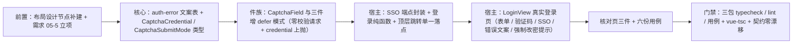

# 01 实施 · 登录页真实实现

> 认证与安全 · 05 登录前端 · 子任务 01（需求 05-1）· 实施记录

[文档首页](../../../../../../文档首页.md) › [05 登录前端](../../05_登录前端.md) › [01 登录页真实实现](../05_登录前端_01_登录页真实实现.md) › 实施记录　|　[详细设计](../设计/01_详细设计_01_登录页真实实现.md)

## 1. 实施信息 <a id="meta"></a>

| 项 | 值 |
| --- | --- |
| 任务 | [01 登录页真实实现](../05_登录前端_01_登录页真实实现.md) |
| 对应需求 | [05-1](../../../../需求/05_需求_登录前端.md#r05-1) |
| 详细设计 | [01 详细设计 · 登录页真实实现](../设计/01_详细设计_01_登录页真实实现.md) |
| 实施日期 | 2026-10-02 |
| 实施人 | minjian |
| 实施环境 | 开发机（Linux）· pnpm 工作区（`frontend/packages/{core,ui-ep}` + `frontend/apps/desktop`） |
| 提交 | bms `7cec77dd`（feat）+ `121404e5`（refactor · 表单件复用与 Element Plus 样式接入修正，见 §3.8）+ `d5a2300f`（feat · 基座：业务侧组件库件复用护栏与样式聚合入口，见 §3.9）+ `b13f9dc5`（chore · 基座：模块联调链路与 IDE 启动项，见 §3.10） |
| 结论 | 已完成 |

## 2. 实施概览 <a id="overview"></a>



结果小结：登录页由占位页替换为真实表单（租户可选识别 / 账号 / 密码明文切换 / 验证码延迟提交 / SSO 入口 / 错误码文案）；件族以**向后兼容**方式新增「延迟提交」模式；核心新增认证错误码文案表（PC / 移动端共用）。三包门禁全绿，设备本地用例合计新增 27 例（核心 5 / 件族 6 / 宿主 16）。

实施后经用户复核修正一处实现偏离：登录页表单**一律复用组件库件**（`TextInput` / `PasswordInput`）+ Element Plus `ElButton`，并补齐宿主 Element Plus 样式接入（详见 §3.8）。

## 3. 实施过程 <a id="process"></a>

### 3.1 前置：布局设计节点与需求立项 <a id="step-pre"></a>

| 动作 | 落点 |
| --- | --- |
| 补建《布局设计 · 登录页》节点（组件设计指向而此前缺失） | `设计/布局设计/17_布局设计_登录页.html`（新增）+ 《布局设计 · 总览》文档清单 / 依赖顺序 / PC 独立全屏页节 / 阅读指引 + 《文档首页》布局设计清单 |
| 立补充需求 05-5（记住我）与子任务 `05_05` | 需求域 05 文档新增需求章节 + 需求 05-1 偏差注块；任务 `05_登录前端_05_记住我`（新增）；父任务清单；《需求总览》计数 39 → 40；阶段计划（计数 / 执行序 / 任务表与进度图同步） |

### 3.2 核心：认证错误码文案表 <a id="step-core"></a>

- `packages/core/src/domain/auth-error.ts`（新增）：`AUTH_ERROR_TEXTS`（认证段 `20001`~`20006` / `20012` / `20051`~`20062`、`10005` 限流）、`DEFAULT_AUTH_ERROR_TEXT`、`isAuthErrorCode`、`resolveAuthErrorText`（本表 → 验证码子段 `CAPTCHA_ERROR_TEXTS` → 通用回落）。
- `packages/core/src/capabilities/captcha.ts`：新增 `CaptchaSubmitMode`（`verify` / `defer`）与 `CaptchaCredential`（件层上抛凭证）。
- `packages/core/src/index.ts`：具名导出新增 API 与类型。

### 3.3 件族：验证码「延迟提交」模式 <a id="step-ui"></a>

后端登录在 `POST /auth/login` 内经 `require_credential`（Redis `getdel`）**一次性消费**挑战；件层若先调 `/captcha/verify`，登录请求再带同一凭证必然 `20102`。

| 文件 | 改动（均向后兼容） |
| --- | --- |
| `CaptchaField.vue` | 新增 `submitMode`（缺省 `verify`）与 `credential` / `loaded` 事件；透传子件并 re-emit |
| `ImageCaptcha.vue` | 初始出题补 `loaded`；`defer` 时输入变更与回车只上抛 `credential`、不调 `verify` |
| `SmsCaptcha.vue` | 发送成功补 `loaded`；`defer` 时同上 |
| `SliderCaptcha.vue` | 初始出题补 `loaded`；`defer` 时松手 / 键盘提交**不调** `/captcha/verify`，改上抛带轨迹的 `credential` |

### 3.4 宿主：端点与纯函数 <a id="step-host"></a>

- `api/identity.ts`：新增 `fetchSsoProviders(tenant?)`、`ssoAuthorizeUrl(idpKey, tenant?)` 与生成类型别名 `SsoProviderItem` / `SsoProviderList`。
- `utils/login.ts`（新增）：`pickLoginCaptchaKind`（跳过无手机号来源的短信渠道）/ `normalizeLoginTenant` / `toLoginCaptcha`（滑块轨迹 `{x,y,t}[]` → `[x,y,t][]`）。
- `utils/navigation.ts`（新增）：`redirectTo`（顶层地址跳转单一落点，SSO 302 场景）。
- `utils/feedback.ts`：新增 `notifyMustChangePassword` 与文案常量。

### 3.5 宿主：登录页 <a id="step-view"></a>

`views/LoginView.vue` 重写为独立全屏页 + 居中单卡片：

- 表单：租户标识（回填已持久化值、可清空）、账号、密码（明文切换、`autocomplete="new-password"`）、提交（提交中态防重复）。
- 验证码：挂载取一次场景策略 → 取首个可渲染渠道；初始不显示（策略 `required=true` 时显示），首次失败或后端 `20101` 后显示并强制；件族 `submit-mode="defer"` + `:key` 重挂载取新挑战；凭证随登录请求一次性提交。
- SSO：按入口清单渲染（按 `sort` 升序），点击经 `redirectTo(ssoAuthorizeUrl(...))`；清单为空整块不渲染；回调失败按 `?error=` 文案 / `?message=` 回显。
- 错误与状态：核心文案表映射；登录成功写会话（`signIn`）并 `router.push(resolveSafeRedirect(route.query.redirect))`；`must_change_password` 提示。
- 未渲染：记住我开关、密码强度提示、扫码入口（口径见设计 §8.1）。

### 3.6 核对页与用例 <a id="step-check"></a>

- `login-check.html` + `src/dev/loginCheck.ts` + `src/dev/LoginCheck.vue`：三组 15 项自检（错误码文案与策略选形 / 归一与地址构造 / 页面结构，后者以真实挂载的登录页 DOM 核对）。
- 用例六份（Kiwi 2232）：`auth-error.spec.ts`、`captcha-defer.spec.ts`、`login-utils.spec.ts`、`api-identity-sso.spec.ts`、`login-view.spec.ts`、`login-check.spec.ts`。

### 3.7 关键命令 <a id="cmds"></a>

```bash
# 三包用例与门禁（bms 根）
pnpm --filter @bms/core run test && pnpm run core:typecheck && pnpm run core:lint
pnpm --filter @bms/ui-ep run test && pnpm run ui-ep:typecheck && pnpm run ui-ep:lint
pnpm --filter @bms/desktop run test && pnpm --filter @bms/desktop run lint
pnpm --filter @bms/desktop exec vue-tsc -b
pnpm run api-types:gen:check
```

### 3.8 修正：表单件复用与 Element Plus 样式接入（用户复核后） <a id="step-fix"></a>

用户复核提出「登录页应使用前端组件库的组件，而非另起一套」。核对实现后确认：首版**仅验证码**走组件库（`CaptchaField`），租户 / 账号 / 密码三件与全部按钮均为原生 `<input>` / `<button>` + 作用域样式自绘，属**实现偏离**；经用户拍板按「本任务内改造 + 宿主全量引入 Element Plus 样式」修正：

| 项 | 原实现 | 修正后 |
| --- | --- | --- |
| 租户标识 / 账号 | 原生 `<input>` + `.login-view__input` 自绘样式 | 组件库 `TextInput`（`clearable`；`autocomplete` / `placeholder` / `data-test` 透传至内部 input） |
| 密码 | 原生 `<input>` + 自绘「显示 / 隐藏」按钮 | 组件库 `PasswordInput`（`:strength="false"` 关强度条；明文切换复用 Element Plus `show-password`，仅在有值时出图标） |
| 提交 / SSO 入口按钮 | 原生 `<button>` + 自绘样式 | Element Plus `ElButton`（提交 `native-type="submit"` + `:loading`，整宽由作用域类补足） |
| 样式接入 | 宿主仅按需引入 message 样式 | `main.ts` 全量引入 `element-plus/dist/index.css`，**早于** `styles/tokens.scss`（令牌 `--el-*` 映射需「后声明覆盖」EP 默认值） |
| 自绘样式 | `.login-view__{input,password,toggle,submit,sso-item}` | 全部删除，仅保留布局 / 品牌区样式与提交按钮整宽一处 |

- **样式顺序实测**：构建产物 CSS 内 EP 默认值（`--el-color-primary:#409eff`）在前、令牌映射（`var(--bms-color-primary)`）在后；dev 模式下转换后的 `main.ts` 亦为「EP 样式 → 令牌」顺序。
- **选择器口径**：`TextInput` 根元素即 EP 输入框（非 class / style 属性透传至内部原生 `input`），`PasswordInput` 根为包装 div（须取内部 `input`）；用例与核对页按此调整。
- **用例同步**：`login-view.spec.ts` 改取内部 input、明文切换改点 EP 图标（先填值出图标再切换）、新增「表单件复用口径」用例（件类名齐备 + 裸原生 `input` / `button` 归零）；`login-check.spec.ts` 自检项 15 → 16。
- **体积预算**：首屏合计 259.6 KB（原上限 260 KB，余量仅 0.4 KB），经用户拍板 `budget.json` 上限 260 → 280 KB 并写明原因与回收路径（后续按需引入）。
- **提交**：`121404e5`（refactor）。

### 3.9 复核后的真实渲染核验与业务侧护栏（2026-10-03） <a id="step-verify"></a>

按用户要求「安装浏览器内核做真实核验 + 加护栏（必须用组件库件；缺件先补进组件库）」执行：

**内核（国内镜像 → 最终改用系统 Chrome）**：官方 CDN（`cdn.playwright.dev` → `playwright.download.prss.microsoft.com`）在本环境被网关拦截（HTTP 400，响应体 `GatewayExceptionResponse`），先用 **npmmirror 二进制镜像**（`PLAYWRIGHT_DOWNLOAD_HOST=https://registry.npmmirror.com/-/binary/playwright`）装 **Firefox 1553**（镜像 Chromium 仅到 **1243**、CLI 需 1247 且 headless-shell 停在 1155，故 Playwright 自带 Chromium 一直装不上；WebKit 亦可）。**最终定稿（2026-10-03）**：装系统 **Google Chrome 154**（官方 deb，`dl.google.com` 可达），此后统一用 Chrome —— Playwright 走 **`--browser=chrome`**（chrome 通道，实测 `Chrome/154` 驱动核对页 16/16 通过），IDE 浏览器断点用 `google-chrome`；**系统 Chromium（snap，`/snap/bin/chromium`）留作备用**（把启动项 `runtimeExecutable` 换成 `chromium` 即可），Playwright 的 Firefox 1553 亦保留作兜底。

**实测发现（真问题）**：核对页自检 16/16 通过、业务侧零裸原生件，但 **Element Plus 样式未生效**——`.el-input__wrapper` 计算样式 `padding: 0px`、主按钮为浏览器默认灰；根因是 **23 个开发态核对页入口只引了 `tokens.scss`、未引 EP 样式**（各有独立 HTML 入口，不经过 `main.ts`）。

| 项 | 落点 |
| --- | --- |
| 样式聚合入口（**唯一**引入落点） | `src/styles/index.ts`（Element Plus 全量样式 + 令牌，顺序受控）；`main.ts` 与 23 个 dev 入口统一引 |
| 业务侧组件库件复用护栏 | `tests/guard-library-components.spec.ts`：业务侧（各宿主应用与运行时模块 `src`）模板禁裸 `<input>` / `<button>` / `<select>` / `<textarea>`；并断言样式聚合入口唯一性与「EP 先于令牌」；含 fixture 自检。`frontend/packages`（组件库自身实现）豁免 |
| 业务侧改造 | 15 个 dev 核对页（13 处 `<button>` → `ElButton`、5 处 `<input>` → `TextInput`、1 处 `<select>` → `SelectInput`）+ 运行时模块 `modules/demo` 1 处 |
| 缺件情况 | **无缺件**——所需件（`TextInput` / `SelectInput` / `TextareaInput` / `CheckboxInput` / `RadioInput` / `NumberInput` / `FileUploadField` / Element Plus `ElButton`）组件库均已具备，故未新增组件 |

**实测证据（Firefox · dev 5173）**：

| 页面 | 结果 |
| --- | --- |
| `login-check.html` | 自检 **16/16 通过**（零失败项）；`.bms-text-input` ×2 / `.bms-password-input` ×1 / `el-button` ×2；裸原生件 0；`.el-input__wrapper` `padding: 1px 11px`（修复前 `0px`） |
| `wizard-preference-check.html` | 自检 **9/9 通过**；替换后的 `TextInput` ×3 与下拉件渲染正常 |
| `chart-check` / `org-check` / `file-check` | 「未通过」0 项（各 12 项通过）；替换后的 `ElButton` 正常 |
| `bulk-theme-tenant-check` | `TextInput` ×2 + `ElButton` ×1 渲染正常、点击事件可达 |
| 真实应用入口 | EP 样式与令牌经 `styles/index.ts` 装载正常（`--el-font-family` 已解析为 BMS 令牌字体、输入框内边距生效）。**`/login` 曾因运行时模块未托管被「模块加载失败」兜底页接管 → 已按阶段五口径补齐本地联调链路**：发布 demo / sample 归档（`release-module.mjs`）+ 由 `serve-module-releases.mjs` 在 5002 托管 `frontend/releases/**`（**带 CORS**；`python3 -m http.server` 等裸静态服务缺 CORS 头会致跨源 ESM 加载失败）。补齐后实测登录页正常渲染：`.login-view` 命中、标题「BMS 基础管理系统」、2 × `TextInput` + 1 × `PasswordInput`、模块错误消失；提交按钮背景 `#3a7bd5`（品牌令牌色 ≠ EP 默认 `#409eff`，端到端证明令牌映射覆盖生效） |

**发现先存缺陷（非本次引入，已用原版文件复现）**：`bulk-theme-tenant-check` 点击「运行自检」抛 `Maximum recursive updates exceeded in component <BrandProvider>`（自检无法出结果）。判定：`BrandProvider` 内 `watch(() => props.brand, { deep: true })` 的回调中 `setBrand` / `applyToElement` 就地改写被监听对象，与深监听互触发。归口组件库 `components/interaction/BrandProvider.vue`，本任务不改库内部实现，登记遗留。

**门禁**：宿主 **31 文件 / 198 passed**（新增护栏 3 例）、`lint`、`vue-tsc -b`、`build` + `budget`（首屏 259.6 KB / 上限 280 KB）全绿。

**提交**：`d5a2300f`（feat · 基座）。

### 3.10 本地联调链路与 IDE 启动项（2026-10-03 续） <a id="step-devlink"></a>

- **模块本地联调口径**：宿主按 `public/modules.json` 加载**发布归档**（入口 `http://localhost:5002/<模块名>/<版本>/remoteEntry.js`），故须先 `release-module.mjs publish`（**先构建**，脚本只校验产物不构建）再由 `serve-module-releases.mjs` 在 5002 托管 `frontend/releases/**`。**裸静态服务不可用**：`python3 -m http.server` 不发 `Access-Control-Allow-Origin` → 跨源 ESM 加载被拒（`RUNTIME-008 Failed to load script resources`）；模块自身的 `pnpm dev`（demo 5002 / sample 5003）只服务独立开发（入口在根路径），**与宿主联调无关**——先前把清单地址误读为「模块 dev 端口」的判断已在本次纠正。
- **IDE 启动项**（`.vscode/launch.json` + `tasks.json`，均已入库）：宿主 dev（Node·Vite）/ 宿主 + Chrome（浏览器断点）/ **宿主 + 模块 + Chrome**（前置任务确保 5002 在跑）/ 核对页 + Chrome（选页）/ 当前文件单测（Vitest）/ 模块独立开发（demo 5002 · sample 5003）/ 后端单服务（debugpy · 选服务）/ 后端当前文件单测（pytest）；配套任务：`dev:宿主（5173）`、`dev:宿主 + 模块产物（5002 + 5173）`、`服务:模块产物（5002 · CORS 静态）`、`发布:模块产物（demo + sample · 构建 + 发布）`、四项检查任务。浏览器启动项用 `google-chrome`（备用改 `chromium`）。`.gitignore` 放行 `launch.json` / `tasks.json`，并忽略 MF 消费端类型产物 `frontend/apps/desktop/@mf-types/`。
- **扩展补齐**：`ms-python.debugpy`（后端 debugpy 项依赖）+ ESLint / Prettier / markdown-mermaid（`extensions.json` 推荐项）。
- **实测**：5002 与 5173 同时在跑时宿主 `/login` 正常渲染（见 §5 验证表）；发布留痕见 `frontend/releases/release-log.{json,md}`。
- **提交**：`b13f9dc5`（chore · 基座）。

## 4. 问题与处置 <a id="issues"></a>

| # | 问题 | 原因 | 处置 |
| --- | --- | --- | --- |
| 1 | 滑块凭证无法取得（登录必然 `20102`） | 登录在请求内**一次性消费**挑战；件族在松手时自行调 `/captcha/verify` 先行消费 | 设计阶段发现并**经用户拍板**：件族增「延迟提交」模式（`submitMode`，缺省 `verify` 保持现状）；登录页用 `defer`，凭证随登录请求提交。已回写《组件设计 · 验证码》与《前端基类清单》 |
| 2 | 策略渠道含 `sms` 时登录无手机号来源 | 登录场景无「按手机号发登录验证码」语义 | 经用户拍板：按渠道顺序取**首个可渲染**形态（跳过 `sms`，图形码兜底）；已登记于设计与实施记录 |
| 3 | 阶段二骨架用例（Kiwi 2191）断言「登录占位页」失败 | `LoginView` 已由占位页替换为真实登录页 | 断言改为「登录页可达 + 真实表单要素」；登录页自身行为由 Kiwi 2232 覆盖 |
| 4 | 根目录 `npx prettier --write` 误用默认配置（加分号 / 双引号）致件族文件全量重排 | 包目录（`packages/*`）**无** Prettier 配置，根目录也无；仅 `apps/desktop` 与模块工程各有配置 | 显式按项目风格（`--no-semi --single-quote --print-width 120 --trailing-comma all`）重排，复校 diff 收敛为本次语义改动；后续对 `packages/*` 一律**显式传项目风格参数**（或用 `apps/desktop/.prettierrc.json` 作 `--config`） |
| 5 | 用例间互相污染：SSO 授权地址实际带 `?tenant=acme` | `api/tenant.ts` 为模块级内存态，前序用例 `signIn` 写入后残留 | 用例 `beforeEach` 显式 `setTenantCode(null)` 复位模块态与本地存储 |
| 6 | 挂载登录页报「no active Pinia」 | 早期版本直接 `mount(LoginView)` 未安装 pinia / router 插件 | 测试统一经 `global: { plugins: [pinia, router] }` 安装；核对页入口（浏览器侧）同口径 `createApp(...).use(createPinia()).use(router)` |
| 7 | 表单件未复用组件库（用户复核发现） | 首版仅验证码走组件库，租户 / 账号 / 密码与全部按钮为原生元素自绘，偏离「优先复用既有件族」口径；当时亦未核查宿主是否已接入 Element Plus 样式 | 经用户拍板：表单一律改用组件库件（`TextInput` / `PasswordInput`）+ `ElButton`，宿主全量引入 EP 样式（前置，实测原产物输入件 / 按钮件样式缺席），并用例与核对页锁「无裸原生件」（见 §3.8） |
| 8 | 核对页 Element Plus 样式未生效（浏览器实测发现） | 23 个 dev 核对页入口各自独立 HTML 入口，只引了 `tokens.scss` 未引 EP 样式，不经过 `main.ts` | 新增样式聚合入口 `styles/index.ts` 并统一 24 处入口引用（EP → 令牌顺序受控）；护栏断言「入口唯一 + 顺序正确」（见 §3.9） |
| 9 | `bulk-theme-tenant-check` 自检不可运行（**先存缺陷**，原版文件复现） | `BrandProvider` 内 `watch(() => props.brand, { deep: true })` 回调中 `setBrand` / `applyToElement` 就地改写被监听对象，与深监听互触发（`Maximum recursive updates exceeded`） | 归口组件库 `components/interaction/BrandProvider.vue`；本任务不改库内部实现，登记遗留（见 §3.9） |

## 5. 验证结果 <a id="verify"></a>

| 验证项 | 方法 | 结果 |
| --- | --- | --- |
| 核心包 | `pnpm --filter @bms/core run test` / `core:typecheck` / `core:lint` | 100 文件 / **1224 passed**；typecheck 与 lint 全绿 |
| 件族包 | `pnpm --filter @bms/ui-ep run test` / `ui-ep:typecheck` / `ui-ep:lint` | 62 文件 / **908 passed**；typecheck 与 lint 全绿 |
| 宿主包 | `pnpm --filter @bms/desktop run test` / `lint` / `vue-tsc -b` | 31 文件 / **198 passed**（含「表单件复用口径」1 例 + 业务侧护栏 3 例）；lint 与 `vue-tsc -b` 全绿 |
| 业务侧护栏 | `tests/guard-library-components.spec.ts` | 业务侧零裸原生交互元素；样式聚合入口唯一且 EP 先于令牌；fixture 拦截自检有效 |
| 真实渲染核验 | Playwright CLI + Firefox 1553（npmmirror 镜像内核）| 核对页 16/16、向导页 9/9、「未通过」0 项；EP 样式与令牌映射实测生效（详见 §3.9） |
| 体积预算 | `pnpm --filter @bms/desktop run build` + `run budget` | 通过：首屏合计 **259.6 KB**（上限 280 KB）/ 最大单文件 83.5 KB（上限 150 KB） |
| 契约零漂移 | `pnpm run api-types:gen:check` | 9 份服务契约类型一致 |
| 核对页 | `tests/login-check.spec.ts` 挂载实跑 | 三组 **16 项自检全部通过**（无失败项，含新增「表单件复用组件库」项） |
| 文档基座 | `check-links.py` / `check-docs-scope.py` / `check-status.py --stage 06_认证与安全 --strict` | 断链 0 / 越界 0 / 硬规则与软提示 0 |

## 6. 偏差与遗留 <a id="deviations"></a>

**偏差（已回写设计与相关登记）**：

1. **范围扩展**：本任务内补建《布局设计 · 登录页》节点、阶段四件族增「延迟提交」模式、核心新增认证错误码文案表——均经用户逐项拍板后执行；计划工作量按计划值收口（未重估），偏差与范围登记于阶段计划表。
2. **需求 05-1 两处口径调整**：第 4 条「记住我」改由补充需求 [05-5](../../../../需求/05_需求_登录前端.md#r05-5) 承接（本任务不渲染并登记前置契约待交付）；第 5 条「密码强度提示」登录场景不显示（口径成文）；已在需求文档注块回写。
3. **设计细化**：验证码初始显示条件为「策略 `required === true` **或** 首次失败」——缺省策略下与已确认的「初始不显示」一致（见设计 §8.1 第 16 项）。
4. **设计校准**：`resolveLoginTenant(input, stored)` 收敛为 `normalizeLoginTenant(input)`（「可清空即不携带」优先，回落持久化值会使清空失效）；设计 §3.6 已同步。
5. **实施后修正（用户复核）**：表单件一律复用组件库件并接入宿主 Element Plus 样式（原自绘原生输入 / 按钮为偏离），明细见 §3.8；`budget.json` 首屏上限同步 260 → 280 KB 并写明原因。
6. **复核后新增（基座级，超出本任务原始范围，经用户明确要求）**：浏览器内核实测发现「23 个 dev 核对页入口漏引 Element Plus 样式」缺口 → 新增样式聚合入口 `styles/index.ts` 与业务侧组件库件复用护栏 `guard-library-components.spec.ts`，并修 15 个 dev 核对页与 1 个运行时模块的裸原生元素；口径已回写《前端开发规范》§9 与《前端基类清单》，明细见 §3.9。

**遗留（归口）**：

| 事项 | 归口 |
| --- | --- |
| 找回 / 重置页面、「忘记密码」入口 | 阶段十五 |
| 改密页面与强制改密流转（本任务仅提示） | 阶段十五 |
| 租户品牌资源（Logo / 系统名 / 登录页背景按租户替换） | 品牌化阶段 |
| 扫码登录入口与二维码交互 | `05_04` |
| 记住我（后端登录契约扩展 + 前端勾选接入） | `05-5` |
| 宿主国际化（错误码文案取核心常量表，接入语言能力后转缺省语言包） | 国际化阶段 |

> 本文档依《[文档生成规范](../../../../../../规范/文档生成规范.md)》编写
