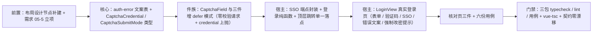

# 01 实施 · 登录页真实实现

> 认证与安全 · 05 登录前端 · 子任务 01（需求 05-1）· 实施记录

[文档首页](../../../../../../文档首页.md) › [05 登录前端](../../05_登录前端.md) › [01 登录页真实实现](../05_登录前端_01_登录页真实实现.md) › 实施记录　|　[详细设计](../设计/01_详细设计_01_登录页真实实现.md)

## 1. 实施信息 <a id="meta"></a>

| 项 | 值 |
| --- | --- |
| 任务 | [01 登录页真实实现](../05_登录前端_01_登录页真实实现.md) |
| 对应需求 | [05-1](../../../../需求/05_需求_登录前端.md#r05-1) |
| 详细设计 | [01 详细设计 · 登录页真实实现](../设计/01_详细设计_01_登录页真实实现.md) |
| 实施日期 | 2026-10-02 |
| 实施人 | minjian |
| 实施环境 | 开发机（Linux）· pnpm 工作区（`frontend/packages/{core,ui-ep}` + `frontend/apps/desktop`） |
| 提交 | bms `7cec77dd`（feat） |
| 结论 | 已完成 |

## 2. 实施概览 <a id="overview"></a>



结果小结：登录页由占位页替换为真实表单（租户可选识别 / 账号 / 密码明文切换 / 验证码延迟提交 / SSO 入口 / 错误码文案）；件族以**向后兼容**方式新增「延迟提交」模式；核心新增认证错误码文案表（PC / 移动端共用）。三包门禁全绿，设备本地用例合计新增 27 例（核心 5 / 件族 6 / 宿主 16）。

## 3. 实施过程 <a id="process"></a>

### 3.1 前置：布局设计节点与需求立项 <a id="step-pre"></a>

| 动作 | 落点 |
| --- | --- |
| 补建《布局设计 · 登录页》节点（组件设计指向而此前缺失） | `设计/布局设计/17_布局设计_登录页.html`（新增）+ 《布局设计 · 总览》文档清单 / 依赖顺序 / PC 独立全屏页节 / 阅读指引 + 《文档首页》布局设计清单 |
| 立补充需求 05-5（记住我）与子任务 `05_05` | 需求域 05 文档新增需求章节 + 需求 05-1 偏差注块；任务 `05_登录前端_05_记住我`（新增）；父任务清单；《需求总览》计数 39 → 40；阶段计划（计数 / 执行序 / 任务表与进度图同步） |

### 3.2 核心：认证错误码文案表 <a id="step-core"></a>

- `packages/core/src/domain/auth-error.ts`（新增）：`AUTH_ERROR_TEXTS`（认证段 `20001`~`20006` / `20012` / `20051`~`20062`、`10005` 限流）、`DEFAULT_AUTH_ERROR_TEXT`、`isAuthErrorCode`、`resolveAuthErrorText`（本表 → 验证码子段 `CAPTCHA_ERROR_TEXTS` → 通用回落）。
- `packages/core/src/capabilities/captcha.ts`：新增 `CaptchaSubmitMode`（`verify` / `defer`）与 `CaptchaCredential`（件层上抛凭证）。
- `packages/core/src/index.ts`：具名导出新增 API 与类型。

### 3.3 件族：验证码「延迟提交」模式 <a id="step-ui"></a>

后端登录在 `POST /auth/login` 内经 `require_credential`（Redis `getdel`）**一次性消费**挑战；件层若先调 `/captcha/verify`，登录请求再带同一凭证必然 `20102`。

| 文件 | 改动（均向后兼容） |
| --- | --- |
| `CaptchaField.vue` | 新增 `submitMode`（缺省 `verify`）与 `credential` / `loaded` 事件；透传子件并 re-emit |
| `ImageCaptcha.vue` | 初始出题补 `loaded`；`defer` 时输入变更与回车只上抛 `credential`、不调 `verify` |
| `SmsCaptcha.vue` | 发送成功补 `loaded`；`defer` 时同上 |
| `SliderCaptcha.vue` | 初始出题补 `loaded`；`defer` 时松手 / 键盘提交**不调** `/captcha/verify`，改上抛带轨迹的 `credential` |

### 3.4 宿主：端点与纯函数 <a id="step-host"></a>

- `api/identity.ts`：新增 `fetchSsoProviders(tenant?)`、`ssoAuthorizeUrl(idpKey, tenant?)` 与生成类型别名 `SsoProviderItem` / `SsoProviderList`。
- `utils/login.ts`（新增）：`pickLoginCaptchaKind`（跳过无手机号来源的短信渠道）/ `normalizeLoginTenant` / `toLoginCaptcha`（滑块轨迹 `{x,y,t}[]` → `[x,y,t][]`）。
- `utils/navigation.ts`（新增）：`redirectTo`（顶层地址跳转单一落点，SSO 302 场景）。
- `utils/feedback.ts`：新增 `notifyMustChangePassword` 与文案常量。

### 3.5 宿主：登录页 <a id="step-view"></a>

`views/LoginView.vue` 重写为独立全屏页 + 居中单卡片：

- 表单：租户标识（回填已持久化值、可清空）、账号、密码（明文切换、`autocomplete="new-password"`）、提交（提交中态防重复）。
- 验证码：挂载取一次场景策略 → 取首个可渲染渠道；初始不显示（策略 `required=true` 时显示），首次失败或后端 `20101` 后显示并强制；件族 `submit-mode="defer"` + `:key` 重挂载取新挑战；凭证随登录请求一次性提交。
- SSO：按入口清单渲染（按 `sort` 升序），点击经 `redirectTo(ssoAuthorizeUrl(...))`；清单为空整块不渲染；回调失败按 `?error=` 文案 / `?message=` 回显。
- 错误与状态：核心文案表映射；登录成功写会话（`signIn`）并 `router.push(resolveSafeRedirect(route.query.redirect))`；`must_change_password` 提示。
- 未渲染：记住我开关、密码强度提示、扫码入口（口径见设计 §8.1）。

### 3.6 核对页与用例 <a id="step-check"></a>

- `login-check.html` + `src/dev/loginCheck.ts` + `src/dev/LoginCheck.vue`：三组 15 项自检（错误码文案与策略选形 / 归一与地址构造 / 页面结构，后者以真实挂载的登录页 DOM 核对）。
- 用例六份（Kiwi 2232）：`auth-error.spec.ts`、`captcha-defer.spec.ts`、`login-utils.spec.ts`、`api-identity-sso.spec.ts`、`login-view.spec.ts`、`login-check.spec.ts`。

### 3.7 关键命令 <a id="cmds"></a>

```bash
# 三包用例与门禁（bms 根）
pnpm --filter @bms/core run test && pnpm run core:typecheck && pnpm run core:lint
pnpm --filter @bms/ui-ep run test && pnpm run ui-ep:typecheck && pnpm run ui-ep:lint
pnpm --filter @bms/desktop run test && pnpm --filter @bms/desktop run lint
pnpm --filter @bms/desktop exec vue-tsc -b
pnpm run api-types:gen:check
```

## 4. 问题与处置 <a id="issues"></a>

| # | 问题 | 原因 | 处置 |
| --- | --- | --- | --- |
| 1 | 滑块凭证无法取得（登录必然 `20102`） | 登录在请求内**一次性消费**挑战；件族在松手时自行调 `/captcha/verify` 先行消费 | 设计阶段发现并**经用户拍板**：件族增「延迟提交」模式（`submitMode`，缺省 `verify` 保持现状）；登录页用 `defer`，凭证随登录请求提交。已回写《组件设计 · 验证码》与《前端基类清单》 |
| 2 | 策略渠道含 `sms` 时登录无手机号来源 | 登录场景无「按手机号发登录验证码」语义 | 经用户拍板：按渠道顺序取**首个可渲染**形态（跳过 `sms`，图形码兜底）；已登记于设计与实施记录 |
| 3 | 阶段二骨架用例（Kiwi 2191）断言「登录占位页」失败 | `LoginView` 已由占位页替换为真实登录页 | 断言改为「登录页可达 + 真实表单要素」；登录页自身行为由 Kiwi 2232 覆盖 |
| 4 | 根目录 `npx prettier --write` 误用默认配置（加分号 / 双引号）致件族文件全量重排 | 包目录（`packages/*`）**无** Prettier 配置，根目录也无；仅 `apps/desktop` 与模块工程各有配置 | 显式按项目风格（`--no-semi --single-quote --print-width 120 --trailing-comma all`）重排，复校 diff 收敛为本次语义改动；后续对 `packages/*` 一律**显式传项目风格参数**（或用 `apps/desktop/.prettierrc.json` 作 `--config`） |
| 5 | 用例间互相污染：SSO 授权地址实际带 `?tenant=acme` | `api/tenant.ts` 为模块级内存态，前序用例 `signIn` 写入后残留 | 用例 `beforeEach` 显式 `setTenantCode(null)` 复位模块态与本地存储 |
| 6 | 挂载登录页报「no active Pinia」 | 早期版本直接 `mount(LoginView)` 未安装 pinia / router 插件 | 测试统一经 `global: { plugins: [pinia, router] }` 安装；核对页入口（浏览器侧）同口径 `createApp(...).use(createPinia()).use(router)` |

## 5. 验证结果 <a id="verify"></a>

| 验证项 | 方法 | 结果 |
| --- | --- | --- |
| 核心包 | `pnpm --filter @bms/core run test` / `core:typecheck` / `core:lint` | 100 文件 / **1224 passed**；typecheck 与 lint 全绿 |
| 件族包 | `pnpm --filter @bms/ui-ep run test` / `ui-ep:typecheck` / `ui-ep:lint` | 62 文件 / **908 passed**；typecheck 与 lint 全绿 |
| 宿主包 | `pnpm --filter @bms/desktop run test` / `lint` / `vue-tsc -b` | 30 文件 / **194 passed**；lint 与 `vue-tsc -b` 全绿 |
| 契约零漂移 | `pnpm run api-types:gen:check` | 9 份服务契约类型一致 |
| 核对页 | `tests/login-check.spec.ts` 挂载实跑 | 三组 **15 项自检全部通过**（无失败项） |
| 文档基座 | `check-links.py` / `check-docs-scope.py` / `check-status.py --stage 06_认证与安全 --strict` | 断链 0 / 越界 0 / 硬规则与软提示 0 |

## 6. 偏差与遗留 <a id="deviations"></a>

**偏差（已回写设计与相关登记）**：

1. **范围扩展**：本任务内补建《布局设计 · 登录页》节点、阶段四件族增「延迟提交」模式、核心新增认证错误码文案表——均经用户逐项拍板后执行；计划工作量按计划值收口（未重估），偏差与范围登记于阶段计划表。
2. **需求 05-1 两处口径调整**：第 4 条「记住我」改由补充需求 [05-5](../../../../需求/05_需求_登录前端.md#r05-5) 承接（本任务不渲染并登记前置契约待交付）；第 5 条「密码强度提示」登录场景不显示（口径成文）；已在需求文档注块回写。
3. **设计细化**：验证码初始显示条件为「策略 `required === true` **或** 首次失败」——缺省策略下与已确认的「初始不显示」一致（见设计 §8.1 第 16 项）。
4. **设计校准**：`resolveLoginTenant(input, stored)` 收敛为 `normalizeLoginTenant(input)`（「可清空即不携带」优先，回落持久化值会使清空失效）；设计 §3.6 已同步。

**遗留（归口）**：

| 事项 | 归口 |
| --- | --- |
| 找回 / 重置页面、「忘记密码」入口 | 阶段十五 |
| 改密页面与强制改密流转（本任务仅提示） | 阶段十五 |
| 租户品牌资源（Logo / 系统名 / 登录页背景按租户替换） | 品牌化阶段 |
| 扫码登录入口与二维码交互 | `05_04` |
| 记住我（后端登录契约扩展 + 前端勾选接入） | `05-5` |
| 宿主国际化（错误码文案取核心常量表，接入语言能力后转缺省语言包） | 国际化阶段 |

> 本文档依《[文档生成规范](../../../../../../规范/文档生成规范.md)》编写
