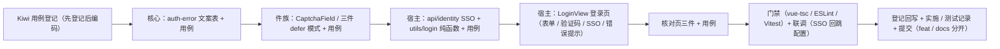

# 01 详细设计 · 登录页真实实现

> 认证与安全 · 05 登录前端 · 子任务 01（需求 05-1）· 详细设计

[文档首页](../../../../../../文档首页.md) › [05 登录前端](../../05_登录前端.md) › [01 登录页真实实现](../05_登录前端_01_登录页真实实现.md) › 详细设计　|　[需求 05-1](../../../../需求/05_需求_登录前端.md#r05-1)

## 1. 设计目标与范围 <a id="goal"></a>

把阶段二遗留的登录占位页（`LoginView.vue`，无表单）落成**真实登录页**，串起已交付的会话链路（`05_02`）、守卫与回跳（`05_03`）、验证码四端点（域三 `03_04`）、SSO 三端点（域二 `02_01` / `02_06`）与契约类型（域六 `06_01`）：

- **登录表单（需求 05-1 第 1 条）**：租户标识（可选）/ 账号 / 密码；提交经服务段寻址调 `api/identity.ts::login()`；成功后写入会话并按守卫口径回跳。
- **验证码接入（第 2 条）**：按场景策略 `channels` 取**首个可渲染形态**（跳过无手机号来源的 `sms`，图形码兜底），复用阶段四 `06_04` 件族；**初始不显示**，首次失败（或策略强制）后显示并强制；失败自动刷新与错误提示。
- **SSO 入口（第 3 条）**：按 `GET /auth/sso/providers` 渲染 IdP 入口（图标 + 名称，按排序值），点击经 302 跳外部授权端点；清单为空 / 不可用即隐藏；回调失败回登录页展示错误；**扫码登录入口归 `05_04`，本任务不渲染**。
- **错误与状态（第 4 条）**：错误码 → 文案映射（账号锁定 / 密码错误 / 验证码失败 / 限流命中 / IdP 故障）；登录中态防重复提交；强制改密标记提示；**「记住我」不渲染**（后端登录契约无该字段，改由补充需求 `05-5` 立项）。
- **安全口径（第 5 条）**：密码框不回填、明文切换仅内存态、不写控制台 / `localStorage` / `sessionStorage`、声明一次性密码自动填充语义；**不显示密码强度提示**（登录场景无强度语义）。
- **用例与核对（第 6 条）**：Vitest 组件与纯函数用例 + 宿主核对页；`vue-tsc`、ESLint 门禁。

**本任务附带交付（经 2026-10-02 拍板）**：

- 《[原型设计 · 登录页](../../../../../../设计/原型设计/03_通用骨架/02_登录页.html)》落点（**2026-10-04 修正**：界面呈现归原型设计，原「布局设计 · 登录页」节点已删除）；
- 阶段四 `06_04` 件族增**「延迟提交」模式**（登录请求内一次性校验验证码，件族自校验会先行消费挑战，详见 §3.2）；
- 核心 `domain/auth-error.ts` 错误码文案表（PC / 移动端共用）。

**不在本任务**：token / 401 刷新链（`05_02` 已交付）、守卫与回跳（`05_03` 已交付）、扫码登录（`05_04`）、记住我（`05-5`）、找回密码 / 重置页面与「忘记密码」入口（阶段十五）、改密页面（阶段十五）、模块请求能力 `api`（`06_02`）、真实短信通道与触达（阶段八）。

**安全影响（SDL）**：口令只经 `POST /auth/login` 提交，**不落任何持久化**（不进 `localStorage` / `sessionStorage` / 日志）；登录错误文案**不区分账号是否存在**（`20002` 同码）；验证码凭证只随对应业务请求一次性提交（不缓存、不落存储）；SSO 跳转目标由后端下发（前端不自拼外部地址，防开放重定向）；`redirect` 回跳沿用核心 `resolveSafeRedirect`（站内校验单一来源）。

## 2. 交付物清单 <a id="deliver"></a>

```text
frontend/packages/core/
├── src/domain/auth-error.ts                    # 新：认证错误码文案表 + 判定 / 解析（含验证码子段回落）
├── src/index.ts                                # 改：导出新增 API 与类型
└── tests/auth-error.spec.ts                    # 新：文案表命中 / 回落 / 边界用例

frontend/packages/ui-ep/
├── src/components/field/CaptchaField.vue        # 改：submitMode（verify / defer）+ credential 事件透传
├── src/components/field/ImageCaptcha.vue        # 改：初始出题 loaded + defer 模式 credential
├── src/components/field/SmsCaptcha.vue          # 改：初始 / 发送后 loaded + defer 模式 credential
├── src/components/field/SliderCaptcha.vue       # 改：defer 模式采集轨迹并上抛 credential（不自行校验）
├── src/index.ts                                # 改：导出 CaptchaFieldCredential 类型
└── tests/captcha-defer.spec.ts                  # 新：defer 模式零校验请求 + 凭证上抛 / 兼容 verify 模式

frontend/apps/desktop/
├── src/views/LoginView.vue                      # 改：占位页 → 真实登录页（品牌区 + 表单区 + SSO 入口）
├── src/api/identity.ts                          # 改：增 fetchSsoProviders / ssoAuthorizeUrl 与类型别名
├── src/utils/login.ts                           # 新：登录纯函数（选形态 / 组装凭证 / 归一登录体）
├── src/dev/LoginCheck.vue                       # 新：登录页核对页（自检上屏）
├── src/dev/loginCheck.ts                        # 新：核对页入口
├── login-check.html                             # 新：核对页多页入口（不进构建产物）
├── tests/login-view.spec.ts                     # 新：表单 / 验证码时机 / SSO 入口 / 错误文案 / 安全口径
├── tests/login-utils.spec.ts                    # 新：选形态跳过 sms、凭证归一（含滑块轨迹）
└── tests/api-identity-sso.spec.ts               # 新：SSO 清单端点 + authorize 地址构造
    tests/login-check.spec.ts                    # 新：核对页自检全通过

bms文档/
├── 设计/原型设计/03_通用骨架/02_登录页.html         # 改：登录页原型（2026-10-04 按实现口径重做）
├── 设计/布局设计/01_布局设计_总览.html + 文档首页.md  # 改：原 17 节点已删除，清单同步移除
├── 项目/06_认证与安全/需求/05_需求_登录前端.md      # 改：需求 05-1 偏差注 + 新增需求 05-5（已回写）
├── 项目/06_认证与安全/任务/05_登录前端/…            # 改：父任务清单 + 新增 05_05（已回写）
├── 项目/06_认证与安全/计划/01_计划_认证与安全.md     # 改：进度唯一落点（状态 / 完成日期 / 偏差与遗留）
├── 前端基类清单.md                              # 改：宿主横切底座节（登录页与错误码文案落点）
└── 设计/组件设计/06_字段类/10_组件设计_验证码/…      # 改：滑块「延迟提交」语义（组件设计语义层）
```

> 目录树为罗列型内容，按《[文档生成规范](../../../../../../规范/文档生成规范.md)》用目录清单（非 mermaid）。

## 3. 设计与边界 <a id="design"></a>

### 3.1 现状实测与缺口 <a id="gap"></a>

| # | 实测项 | 结论 |
| --- | --- | --- |
| 1 | `views/LoginView.vue` | 占位页（仅标题 + 提示文案），**无表单、无会话写入、无回跳** |
| 2 | `api/identity.ts` | 已有 `login` / `refreshAccessToken` / `logout` / `fetchCurrentUser`；**缺 SSO 清单与授权跳转地址** |
| 3 | `stores/session.ts` | `signIn({ token, user, tenant, codes? })` 与 `ensureReady` 已交付，登录页可直接消费 |
| 4 | `router/guard.ts` + 核心 `resolveSafeRedirect` | 已交付：守卫负责「已登录访问登录页回跳」与「未登录跳登录带 `redirect`」，登录页只需登录动作 + 回跳目标解析 |
| 5 | `ui-ep` 验证码件族 | `CaptchaField` / `ImageCaptcha` / `SliderCaptcha` / `SmsCaptcha` 齐备；**件层在提交时自行调 `/captcha/verify`** |
| 6 | 后端登录验证码校验 | `identity/auth.py::_enforce_captcha` 在**登录请求内**经 `require_credential` 校验（Redis `getdel` **一次性消费**挑战） |
| 7 | 错误码 | 认证段 `20001`~`20006` / `20012` / `20051`~`20062`、验证码子段 `20101`~`20103`（验证码文案已在核心 `CAPTCHA_ERROR_TEXTS`）；**其余认证错误码无前端文案表** |
| 8 | 宿主 i18n | 未引入国际化库（见 `module/i18n.ts` 说明）→ 文案取**常量口径**（`05_02` 已登记，本任务以核心文案表承接错误码） |
| 9 | `LoginResult.user.tenant` | 契约含租户编码 → 登录成功后的会话租户取响应值，前端输入值仅作请求参数 |

### 3.2 验证码「延迟提交」模式（件族兼容扩展） <a id="captcha-defer"></a>

**问题**：登录请求内校验并一次性消费挑战（第 6 项实测）；件层若先调 `/captcha/verify`，挑战已被消费 → 登录请求携带同一凭证必然 `20102`（图形 / 短信虽可由父页面以 `v-model` 取值，滑块轨迹则无从取得）。

**方案（2026-10-02 拍板：件族增「延迟提交」模式）**：

```text
CaptchaField（分发壳）
├── props.submitMode?: 'verify' | 'defer'        # 新（缺省 'verify'：现状行为，零改动）
├── emits.credential?: CaptchaFieldCredential     # 新（defer 时上抛：{ kind, captchaId, code?, trace? }）
└── 透传 submitMode 到子件；子件 credential → 壳层 re-emit

子件（三件同构）
├── ImageCaptcha：初始出题补 loaded；defer 时回车 / 变更不调 verify，改 emit credential
├── SmsCaptcha  ：初始 / 发送成功补 loaded；defer 时同上诉求
└── SliderCaptcha：defer 时松手**不调** /captcha/verify，改 emit credential（带轨迹）
```

- **向后兼容**：`submitMode` 缺省 `'verify'`，既有用法（`CaptchaCheck` 核对页与表单渲染协同）行为**逐字节不变**；`credential` 事件仅在 `defer` 模式触发。
- **防误用**：`defer` 模式下件层**不发任何校验请求**（`requestCount` 仅含出题），由父页面承担「随业务请求提交」责任——这正是登录 / 找回等「凭证随业务提交」场景的真实语义（二开同可用）。
- **凭证形态**：`CaptchaFieldCredential = { kind: CaptchaKind; captchaId: string; code?: string; trace?: readonly CaptchaTracePoint[] }`，由宿主纯函数归一为契约 `CaptchaInput`（`trace` 由 `{x,y,t}[]` 转 `[x,y,t][]`，见 §3.6）。

### 3.3 登录页落点与布局 <a id="page"></a>

- **落点**：宿主视图 `apps/desktop/src/views/LoginView.vue`（与宿主会话 / 路由 / 请求层强耦合；移动端登录页归移动端阶段）。
- **布局**：按《[原型设计 · 登录页](../../../../../../设计/原型设计/03_通用骨架/02_登录页.html)》——**独立全屏页 + 居中单卡片**（品牌区 + 表单区 + 第三方入口区），不嵌主框架；窄屏卡片宽度收敛，亮 / 暗主题走令牌。
- **品牌区**：平台默认 Logo + 系统名（租户品牌资源接入归品牌化阶段，本任务以令牌与常量占位，登记遗留）。
- **页面结构**：

```text
LoginView.vue
├── 品牌区（Logo + 系统名称）
├── 表单区
│   ├── 租户标识（可选输入；缺省回填 api/tenant 已持久化值，可清空）   # ui-ep TextInput
│   ├── 账号                                                        # ui-ep TextInput
│   ├── 密码（含明文切换；autocomplete="new-password" 语义）           # ui-ep PasswordInput（:strength="false" + show-toggle）
│   ├── 验证码块（v-if：策略 required ∨ 首次失败后；kind 由策略 channels 决定）   # ui-ep CaptchaField
│   ├── 表单级提示（错误 / 锁定 / 限流 / SSO 回调失败 / 强制改密）
│   └── 提交按钮（整宽；提交中 loading + 表单禁用）                     # Element Plus ElButton
└── 第三方入口区（IdP 入口按钮；清单为空整块不渲染）                     # Element Plus ElButton
```

- **表单件复用（强制）**：输入件一律复用组件库件（`TextInput` / `PasswordInput` / `CaptchaField`），按钮复用 Element Plus `ElButton`（组件库无通用按钮件，业务页直接用 Element Plus 为既有口径，见 `modules/sample`）；**本页只做接线与布局，不自绘输入件、不写裸原生 `<input>` / `<button>`**（由 `login-view.spec.ts`「表单件复用口径」与核对页第 11 项锁定）。
- **宿主样式接入**：样式引入**唯一落点**＝`styles/index.ts`（Element Plus 全量样式 + 设计令牌聚合；与 `modules/*/src/standalone.ts` 同源做法），`main.ts` 与全部开发态核对页入口统一引该文件。EP 样式**必须早于**令牌——`--el-*` 映射依赖「同优先级后声明覆盖」赢过 Element Plus 默认值，顺序颠倒会使主题色回退 EP 默认蓝（构建产物已核对：EP 默认值在前、令牌映射在后；dev 侧实测 `--el-font-family` 已解析为 BMS 令牌字体）。
- **`data-test` 落点差异**：`TextInput` 根元素即 Element Plus 输入框，非 class / style 属性透传到内部原生 `input`（`[data-test="login-account"]` 直接命中 input）；`PasswordInput` 根为包装 div，`data-test` 落在 div 上，须再取内部 `input`（用例与核对页按此口径取元素）。

### 3.4 登录动作与回跳 <a id="login-flow"></a>

```text
提交
├── 前置校验（账号 / 密码非空；验证码块可见时凭证完备，否则本地提示「请完成验证码校验」）
├── 置 submitting（按钮 loading + 表单禁用 → 防重复提交）
├── login({ account, password, tenant, captcha? })       # api/identity.ts，服务段寻址 + 契约类型
├── 成功：session.signIn({ token: access_token, user, tenant: user.tenant ?? 输入值 })
│         ├── user.must_change_password → 提示「请尽快修改初始密码」（改密页归阶段十五）
│         └── router.push(resolveSafeRedirect(route.query.redirect))   # 站内校验单一来源（05_03）
└── 失败：resolveAuthErrorText(code) → 表单级提示；failCount += 1
          └── 验证码块可见时刷新挑战（key 自增重挂载，取号 + 清输入）
```

- **不自行注册路由 / 不自行跳首页**：菜单动态路由随会话状态装载（`05_03`），回跳目标由核心 `resolveSafeRedirect` 解析（非法 / 缺失回首页）。
- **租户编码持久化**：由 `signIn` 统一写入（`setTenantCode`），登录页不重复处理；用户清空输入时提交 `tenant: null`（由子域名或后端上下文解析）。
- **幂等键**：登录为**会话动作**，沿用 `api/identity.ts::login` 的显式 `request`（不自动附幂等键，与 `05_02` 口径一致）。

### 3.5 验证码接入（策略 → 形态 → 凭证） <a id="captcha"></a>

| 环节 | 设计 |
| --- | --- |
| 策略获取 | 登录页挂载即经件族取一次场景策略（`scene='login'`，零业务副作用）；失败静默降级为「不显示验证码」（首次提交若被 `20101` 拒绝再显示） |
| 形态选取 | 按 `policy.channels` 顺序取**首个可渲染形态**：跳过 `sms`（登录场景无手机号来源），`image` 恒兜底；渠道解析走宿主纯函数 |
| 展示时机 | 初始 `policy.required === true` **或** 首次登录失败后（`failCount > 0`）显示并强制；后端返回 `20101`（需要验证码）亦触发显示 |
| 出题 | 件族自持出题（`submit-mode="defer"`，零校验请求）；失败或登录未通过后以 `:key` 自增**重挂载**取得新挑战（一次性失效口径） |
| 凭证 | `@credential` 事件缓存最新凭证；提交时归一为 `CaptchaInput`（图形 / 短信带 `code`，滑块带 `trace`） |
| 错误提示 | 验证码错误 / 已失效 / 发送过于频繁 → 核心文案表（`20101`~`20103`），与件族既有文案同源 |

### 3.6 宿主纯函数（`utils/login.ts`） <a id="pure"></a>

```text
utils/login.ts
├── pickLoginCaptchaKind(channels): CaptchaKind | null   # 跳过 sms；无可渲染渠道 → null（不显示验证码）
├── normalizeLoginTenant(input): string | null           # 去空白；空串 → null（可清空即不携带）
└── toLoginCaptcha(credential): LoginCaptchaInput        # 归一为契约体；滑块 trace 由 {x,y,t}[] 转 [x,y,t][]
```

- 纯函数、零请求、可单测；跨端复用路径（移动端登录页同口径）。
- `toLoginCaptcha` 只产出契约字段，**不做任何校验**（真伪由后端判定，符合「前端不做真伪判断」口径）。

### 3.7 SSO 入口 <a id="sso"></a>

```text
挂载
├── fetchSsoProviders()          # GET /auth/sso/providers（免登录；携带 tenant 查询参数，缺省用已持久化租户）
├── 清单为空 / 请求失败 → 整块不渲染（不出现点了没反应的按钮），失败静默（不阻断本地登录）
└── 渲染入口（图标 + 名称，按 sort 升序）
        点击 → window.location.assign(ssoAuthorizeUrl(idp_key, tenant))   # 302 跳外部 IdP

回调（后端 302）
├── 成功 → `{前端基址}/`      → 守卫 await 会话就绪 → refresh cookie 静默续期 → 进入系统
└── 失败 → `{前端基址}/login` → 读 `?error=&message=`，按错误码文案展示（无文案则用 message）
```

- **跳转方式**：顶层地址跳转（非 XHR）——`authorize` 端点返回 302 到外部 IdP，浏览器需跟随；前端只拼「站内服务段地址 + 查询参数」，**不拼外部地址**。
- **后端配置取值（本任务联调定稿）**：`[sso].success_redirect = {前端基址}/`、`[sso].failure_redirect = {前端基址}/login`；本地联调写入 `deploy/.env`（不入库）。
- **扫码入口**：本任务不渲染（占位位置留在第三方入口区，归 `05_04`）。
- **错误码**：`20051`（IdP 不存在 / 停用）、`20052`（回调校验失败）、`20053`（IdP 不可达）、`20054`（身份未匹配）、`20055`（映射冲突）、`20057`~`20062`（企微 / 钉钉）均由核心文案表覆盖（§3.8）。

### 3.8 错误码文案落点（核心 `domain/auth-error.ts`） <a id="errors"></a>

与既有 `CAPTCHA_ERROR_TEXTS`（`core/src/domain/captcha.ts`）**同构**，PC / 移动端共用、核心单测覆盖：

```text
domain/auth-error.ts
├── AUTH_ERROR_TEXTS: Readonly<Record<number, string>>
│   ├── 10005 请求过于频繁，请稍后重试
│   ├── 20001 / 20012 登录状态已失效，请重新登录
│   ├── 20002 账号或密码错误
│   ├── 20003 账号已锁定，请联系管理员或稍后重试
│   ├── 20004 账号已停用，请联系管理员
│   ├── 20005 重置链接无效或已过期
│   ├── 20006 操作过于频繁，请稍后再试
│   ├── 20051 登录方式不存在或已停用
│   ├── 20052 登录校验失败，请重试
│   ├── 20053 外部登录服务不可用，请改用账号密码登录
│   ├── 20054 外部身份未匹配到系统用户
│   ├── 20055 身份映射冲突，请联系管理员
│   ├── 20056 登录过于频繁，请稍后再试
│   ├── 20057 企业微信配置缺失或非法
│   ├── 20058 企业微信授权失败
│   ├── 20059 企业微信接口不可达
│   ├── 20060 钉钉配置缺失或非法
│   ├── 20061 钉钉授权失败
│   └── 20062 钉钉接口不可达
├── DEFAULT_AUTH_ERROR_TEXT = '操作失败，请稍后重试'
├── isAuthErrorCode(code): boolean                  # 命中本表或验证码子段
└── resolveAuthErrorText(code): string              # 本表 → 验证码子段（CAPTCHA_ERROR_TEXTS）→ 通用回落
```

- **命中链**：本表 → 验证码子段（复用 `CAPTCHA_ERROR_TEXTS`，避免两处维护）→ 通用回落文案。
- **i18n**：宿主未引入国际化库（归国际化阶段），故取常量表；接入语言能力后本表转为缺省语言包，签名不变。
- **不覆盖**：非认证段（`3xxxx` / `4xxxx` / `5xxxx`）与模块扩展段错误码，回落通用文案（或由请求层 `message` 兜底）。

### 3.9 密码安全口径落实 <a id="password-security"></a>

| 口径 | 落实 |
| --- | --- |
| 不回填 | 密码框 `v-model` 初值恒为 `''`，登录失败后**保留用户本次输入**（便于修正）但不来自任何存储 |
| 明文切换 | 复用件族 `PasswordInput` 的 `show-toggle`（Element Plus `show-password` 图标，仅在有值时出现），切换 `password` / `text` 仅组件内存态；切换不发请求、不落存储 |
| 自动填充 | `autocomplete="new-password"`（抑制浏览器保存 / 提示旧口令；与「一次性密码自动填充」语义区分） |
| 不写日志 / 存储 | 不 `console` 口令；不写 `localStorage` / `sessionStorage`（`localStorage` 仅存非敏感租户编码） |
| 强度提示 | **不显示**（登录场景输入为既有口令，强度归改密 / 注册场景） |

### 3.10 失败分支与边界 <a id="failures"></a>

| 场景 | 处理 |
| --- | --- |
| 账号 / 密码为空 | 本地提示，不发请求 |
| 验证码块可见但凭证不完备 | 本地提示「请完成验证码校验」，不发请求 |
| `20002` 账号或密码错误 | 表单级提示（不区分账号是否存在）；显示验证码块并刷新挑战 |
| `20003` 账号锁定 | 提示「账号已锁定，请联系管理员或稍后重试」；不刷新验证码（无凭证消耗） |
| `20004` 账号停用 | 提示「账号已停用，请联系管理员」 |
| `20101` 验证码错误 / 需要验证码 | 显示验证码块；刷新挑战；提示文案取核心表 |
| `20102` 验证码已失效 | 刷新挑战并提示重新获取 |
| `20103` 发送过于频繁 | 提示且不重置倒计时（件层既定口径） |
| `10005` 限流命中 | 提示稍后重试 |
| 策略 `channels` 为空 / 不含可渲染渠道 | 不显示验证码块（图形恒兜底，正常不会发生）；策略取用失败静默降级 |
| SSO 清单为空 / 请求失败 | 入口整块不渲染；不阻断本地登录 |
| SSO 回调失败（`?error=`） | 回登录页展示文案；无对应文案时用 `?message=` |
| 登录成功且 `must_change_password` | 提示「请尽快修改初始密码」（改密页归阶段十五） |
| 已登录访问 `/login` | 由守卫直接回跳（本页不渲染、无额外处理） |
| 首屏会话续期中 | 应用根骨架屏承载等待态，登录页不在续期完成前渲染（不闪登录页，`05_03` 口径） |

## 4. 兼容性与消费方影响 <a id="compat"></a>

- **件族向后兼容**：`submitMode` 缺省 `'verify'`；现有 `CaptchaCheck` 核对页、表单渲染协同与既有件族用例**零改动**通过；新增事件仅 `defer` 触发。
- **核心新增**：`domain/auth-error.ts` 为纯新增模块，`index.ts` 具名导出；不改既有导出语义。
- **宿主接口扩展**：`api/identity.ts` 新增两函数 + 两个生成类型别名（`SsoProviderItem` / `SsoProviderList`），不改既有四函数。
- **`05_04` 消费面**：扫码登录可复用 `fetchSsoProviders`（按 `type` 区分企微 / 钉钉）与 `CaptchaField` 的 `defer` 模式；本任务为其备好扩展面。
- **`05-5` 消费面**：记住我落地时登录页表单恢复勾选并随请求提交（`LoginRequest` 新增可选字段），本任务已把提交体构造收敛在 `utils/login.ts`，接入点单点可换。
- **设计层登记**：《[组件设计 · 验证码](../../../../../../设计/组件设计/06_字段类/10_组件设计_验证码/10_组件设计_验证码.md)》「滑块」节补「延迟提交」语义（§3.2）与「凭证随业务请求提交」边界。

## 5. 测试设计与验收映射 <a id="test"></a>

用例**先登记 Kiwi TCMS 再编码**（新登记 1 条策展用例，分类「平台骨架」/ P2 / `CONFIRMED` / 标签「自动化」；编号以平台回读为准并回填本记录与代码标注）。

| # | 用例 / 文件 | 类型 | 断言要点 |
| --- | --- | --- | --- |
| 1 | `packages/core/tests/auth-error.spec.ts` | 单元 | 文案表逐码命中；验证码子段回落（`20101`~`20103` 取 `CAPTCHA_ERROR_TEXTS`）；未登记码回落通用文案；非数字 / `undefined` 入参不抛错 |
| 2 | `packages/ui-ep/tests/captcha-defer.spec.ts` | 单元 | `defer` 模式：滑块松手 **零校验请求**（源 `verify` 未被调用）且上抛 `credential`（带 `captchaId` 与轨迹）；图形 / 短信变更上抛 `credential`（带 `code`）；初始出题触发 `loaded` |
| 3 | 同上 | 单元 | `verify` 模式（缺省）行为不变：滑块松手仍调 `verify` 并 emit `pass`（既有断言不改） |
| 4 | `apps/desktop/tests/login-utils.spec.ts` | 单元 | `pickLoginCaptchaKind`：`['slider','image']` → `slider`；`['sms','image']` → `image`（跳过 sms）；`[]` → `null`；`toCaptchaInput` 轨迹 `{x,y,t}[]` → `[x,y,t][]`；`resolveLoginTenant` 去空白 / 空串转 `null` |
| 5 | `apps/desktop/tests/api-identity-sso.spec.ts` | 单元 | `fetchSsoProviders` 经 `/api/identity/v1/auth/sso/providers`（带 `tenant` 查询参数）；`ssoAuthorizeUrl` 组装 `/api/identity/v1/auth/sso/{idp_key}/authorize?tenant=…` |
| 6 | `apps/desktop/tests/login-view.spec.ts` | 单元 | 提交成功：`login` 载荷正确（含 `captcha`），`session.signIn` 写入令牌 / 用户 / 租户，跳转 `resolveSafeRedirect(redirect)`；非法 `redirect` 回首页 |
| 7 | 同上 | 单元 | 提交中态：连续点击只发一次请求（按钮 `loading` + 表单禁用） |
| 8 | 同上 | 单元 | 验证码时机：初始不显示（策略 `required=false`）；首次失败后显示；策略 `required=true` 时初始显示；策略取用失败时静默不显示 |
| 9 | 同上 | 单元 | 错误文案：`20002` / `20003` / `20101` / `10005` 分别取核心文案；SSO 回调 `?error=20053` 取对应文案（无文案回落 `?message=`） |
| 10 | 同上 | 单元 | SSO 入口：清单为空不渲染；有清单按 `sort` 渲染且点击调用 `location.assign(ssoAuthorizeUrl(...))` |
| 11 | 同上 | 单元 | 安全口径：密码框 `type=password` 且初值为空、`autocomplete="new-password"`；明文切换只改 `type` 且不改请求与存储；无「记住我」开关、无强度提示 |
| 12 | 同上 | 单元 | 强制改密：`must_change_password=true` 时提示「请尽快修改初始密码」 |
| 13 | `apps/desktop/tests/login-check.spec.ts` | 单元 | 宿主核对页自检全部通过（无失败项） |
| 14 | `packages/core` + `ui-ep` + `apps/desktop` 既有全部用例 | 回归 | 核心 / 件族 / 宿主既有用例全绿（含 `vue-tsc` / ESLint） |

**验收映射**：需求 05-1「本地账号登录（含三类验证码强制分支）与 SSO 跳转入口均可用」→ 用例 2 / 4 / 6 / 8 / 10；「错误码文案与后端契约一致」→ 用例 1 / 9；「密码安全口径经用例 / 核对页验证」→ 用例 11 / 13；「`vue-tsc`、ESLint、Vitest 全通过」→ 用例 14 + 门禁命令（§9）。门禁：`vue-tsc`、ESLint、Vitest 全绿；受影响核心 / 件族 / 宿主用例回归全绿；核对页自检全部通过。

**执行范围**：只跑受变更影响的定向用例（`packages/core` 文案表用例 + `ui-ep` 件族用例 + `apps/desktop` 全部用例），不跑全量前端工作区（口径见《[AI开发规范](../../../../../../规范/AI开发规范.md)》）。

## 6. 登记落点 <a id="registry"></a>

| 内容 | 落点 |
| --- | --- |
| 登录页落点与横切接线（会话 / 回跳 / SSO / 错误文案 / 表单件复用） | 《[前端基类清单](../../../../../../前端基类清单.md)》「宿主横切底座」节 |
| 宿主 Element Plus 样式接入口径（全量引入 + 与令牌文件的顺序约定） | 《[前端开发规范](../../../../../../规范/前端开发规范.md)》§9 样式规范 + 《[前端基类清单](../../../../../../前端基类清单.md)》「宿主横切底座」节 |
| 认证错误码文案表（核心） | 核心 `domain/auth-error.ts` + 本设计（§3.8） |
| 验证码件族「延迟提交」语义 | 《[组件设计 · 验证码](../../../../../../设计/组件设计/06_字段类/10_组件设计_验证码/10_组件设计_验证码.md)》「滑块」节 + 本设计（§3.2） |
| 登录页界面呈现 | 《[原型设计 · 登录页](../../../../../../设计/原型设计/03_通用骨架/02_登录页.html)》（2026-10-04 按实现口径重做）+ 《布局设计 · 总览》+ 《文档首页》 |
| 「记住我」口径 | 需求 [05-5](../../../../需求/05_需求_登录前端.md#r05-5) + 任务 `05_05`（本任务登记，实现归其） |
| 阶段计划：`05_01` 条目与进度（状态 / 完成日期 / 偏差与遗留） | 阶段计划表（进度唯一落点） |
| Kiwi TCMS / 测试资产仓 | 登记本任务用例并回读编号 |
| 实施 / 测试记录 | 本目录 `实施/`、`测试/` |

## 7. 边界与开放项 <a id="boundary"></a>

- **租户品牌资源（Logo / 登录页背景按租户替换）**：品牌化阶段；本任务以平台默认资源与令牌占位，登记遗留（布局节点第 6 节已写目标形态）。
- **「忘记密码」入口**：归阶段十五（找回 / 重置页面同批）。
- **改密页面与强制改密流转**：归阶段十五；本任务仅提示。
- **扫码登录入口**：归 `05_04`。
- **记住我**：归 `05-5`（本任务不渲染）；**已由 `05_05` 交付**（后端 `LoginRequest.remember_me` + 登录页勾选项，见其详细设计）。
- **国际化文案**：宿主未引入 i18n；错误码文案取核心常量表，接入语言能力后转缺省语言包（签名不变）。
- **真实短信通道与触达**：归阶段八；本任务只消费既有短信件与策略渠道。
- **登录页表单元素级校验强度**：仅做「非空」本地校验，账号 / 口令格式与复杂度由后端与域三策略判定（不在前端复制规则）。
- **多标签页**：单标签口径（`05_02` 已登记），归阶段十五。
- **租户标识「多租户选择」真实落地**（2026-10-04 登记）：**已闭环（`05_06`）**——按定稿口径「租户标识默认隐藏、无法唯一解析租户时后端返回 `20007` 触发前端展开输入框并聚焦」，其详细设计见 [05_06 详细设计](../../05_登录前端_06_登录页多租户选择/设计/01_详细设计_06_登录页多租户选择.md)（判定机制见 §8.3）。

## 8. 对齐记录 <a id="align"></a>

### 8.1 本轮拍板（2026-10-02，逐项确认） <a id="align-new"></a>

| # | 事项 | 结论 |
| --- | --- | --- |
| 1 | 登录页落点 | 界面呈现落**原型设计**（《原型设计 · 登录页》）；**2026-10-04 修正**：原「补建《布局设计 · 登录页》节点」作废，该节点已删除并同步总览与首页 |
| 2 | 登录页落点 | **宿主视图** `apps/desktop/src/views/LoginView.vue` 重写（不新建 `ui-ep` 组件） |
| 3 | 布局形态 | **居中单卡片**（品牌区 + 表单区 + 第三方入口区） |
| 4 | 租户标识 | **可选输入框 + 回填已持久化值**（可清空），提交写 `LoginRequest.tenant` 并持久化 |
| 5 | 验证码渠道 | 取策略 `channels` **首个可用形态**（缺省 `slider`），不可用降级 `image`；**不提供用户切换** |
| 6 | 验证码时机 | **初始不显示**；首次失败后显示并强制（后端 `20101` 亦触发） |
| 7 | 扫码入口 | **不渲染**（归 `05_04`） |
| 8 | SSO 回跳 | **成功 → `/`，失败 → `/login`**（写入后端 `[sso]` 配置，本地 `deploy/.env`） |
| 9 | 「记住我」 | **另立补充需求 `05-5` + 任务 `05_05`**；本任务不渲染并登记前置契约待交付 |
| 10 | 错误码文案 | **核心 `domain/auth-error.ts` 文案表**（与 `CAPTCHA_ERROR_TEXTS` 同构，PC / 移动端共用） |
| 11 | 密码强度提示 | **不显示**（登录无强度语义，归改密 / 注册） |
| 12 | 明文切换 | **提供**（仅内存态、不回填、不落存储） |
| 13 | 强制改密标记 | **登录后提示**「请尽快修改初始密码」+ 登记遗留（改密页归阶段十五） |
| 14 | **实施期新出（设计阶段发现）· 滑块凭证** | **件族增「延迟提交」模式**（`submitMode`，缺省 `verify` 保持现状；`defer` 时件层只渲染与采集、以 `credential` 事件上抛凭证，由登录页随登录请求提交） |
| 15 | **实施期新出 · 短信渠道** | 跳过 `sms`（登录场景无手机号来源），取 channels 中首个可渲染渠道（图形兜底），并登记原因 |
| 16 | 设计细化 · 策略强制 | 初始显示条件为「策略 `required === true` **或** 首次失败」——缺省策略（`required=false`）下与「初始不显示」一致，避免策略强制时注定失败的首次提交 |
| 17 | Kiwi 用例 | 新登记 1 条策展用例（设计定稿后、编码前登记） |
| 18 | **实施后修正（用户复核提出）· 表单件复用** | 登录页表单一律复用组件库件（`TextInput` / `PasswordInput`）+ Element Plus `ElButton`；**下线自绘原生 `<input>` / `<button>` 及配套样式**，并由用例与核对页锁定「无裸原生件」（原实现仅验证码走组件库，属实现偏离） |
| 19 | **实施后修正 · 宿主样式接入** | 宿主 `main.ts` 全量引入 `element-plus/dist/index.css`（早于令牌文件）；实测改造前产物 CSS 内**输入件 / 按钮件样式缺席**（`el-input` / `el-button` 选择器零命中），故此接入为复用组件库件的**前置条件** |

### 8.2 复用既有口径 <a id="align-reuse"></a>

| # | 事项 | 结论 |
| --- | --- | --- |
| 1 | 服务段寻址与契约类型 | `apiUrl` / `serviceUrl` + `@bms/api-types` 的 `identity` 命名空间（`05_02` 已交付），**不手写重复类型** |
| 2 | 会话链路 | `stores/session.ts::signIn` / `ensureReady`（`05_02` / `05_03` 已交付），登录页不改其语义 |
| 3 | 回跳 | 核心 `resolveSafeRedirect`（`05_03` 已交付），登录页不自写路径校验 |
| 4 | 守卫 | 「已登录访问登录页回跳」「未登录跳登录带 `redirect`」由守卫承担，登录页只做登录动作 |
| 5 | 验证码件族 | `CaptchaField` / 三件与 `useBaseCaptcha`（阶段四 `06_04` 已交付），本任务只做**兼容式**扩展 |
| 6 | 验证码数据源 | `createHttpCaptchaSource` + `captchaSourceOptions()`（阶段四 / `05_02` 既有落点），登录页不自拼端点 |
| 7 | 提示通道 | 宿主 `utils/feedback.ts`（`05_02` 交付）；请求层不依赖 UI 库 |
| 8 | 命名与文档 | 遵《[命名规范](../../../../../../规范/命名规范.md)》《[前端开发规范](../../../../../../规范/前端开发规范.md)》，文档遵《[文档生成规范](../../../../../../规范/文档生成规范.md)》 |

### 8.3 落点修正（2026-10-04） <a id="align-locfix"></a>

| # | 事项 | 结论 |
| --- | --- | --- |
| 1 | 登录页界面呈现落点 | 由《布局设计 · 登录页》改为**《[原型设计 · 登录页](../../../../../../设计/原型设计/03_通用骨架/02_登录页.html)》**（布局设计管统一规范、原型设计管界面呈现与验收基准）；`设计/布局设计/17_布局设计_登录页.html` **已删除**，`文档首页` / `布局设计-总览` / `组件设计 · 验证码` / `05_04` / `05_05` / `前端基类清单` 引用同步改指 |
| 2 | 登录页原型口径 | 按定稿口径重做：租户标识**默认隐藏**，本机已记住编码静默携带（不显示该项）；后端无法唯一解析租户时返回 `20007` 才展开输入框并聚焦；验证码初始不显示 / 失败后出现（策略渠道首形态）；记住我默认不勾选；SSO 按清单渲染 + 扫码入口；锁定 / 停用 / 强制改密提示 |
| 3 | 租户标识判定机制 | **免登录链路按「本机记忆 → 域名 / 请求头 → 唯一启用租户」解析**：无法唯一解析（多启用租户）→ 后端返回认证段 `20007`（不带租户清单）触发展开；登录前**不按账号反查**（安全规范 §3 禁止项）。真实实现见 [05_06 详细设计](../../05_登录前端_06_登录页多租户选择/设计/01_详细设计_06_登录页多租户选择.md)（**已闭环**） |

## 9. 实施步骤与关键命令 <a id="steps"></a>



1. 读《[KiwiTCMS部署使用说明](../../../../../../资料/开发服务器/linux/KiwiTCMS部署使用说明.md)》「用例约定」节，登记本任务用例并**回读编号**。
2. 核心：`domain/auth-error.ts` 新增 + `index.ts` 导出 + `auth-error.spec.ts`。
3. 件族：`CaptchaField.vue`（`submitMode` / `credential`）、`ImageCaptcha.vue` / `SmsCaptcha.vue`（初始 `loaded` + defer `credential`）、`SliderCaptcha.vue`（defer 采集轨迹）+ `index.ts` 类型导出 + `captcha-defer.spec.ts`。
4. 宿主：`api/identity.ts`（`fetchSsoProviders` / `ssoAuthorizeUrl`）、`utils/login.ts` 纯函数、对应用例。
5. 宿主：`LoginView.vue` 真实登录页 + `login-view.spec.ts`。
6. 核对页三件（`login-check.html` / `src/dev/loginCheck.ts` / `src/dev/LoginCheck.vue`）+ `login-check.spec.ts`。
7. 联调：本地写入 `[sso].success_redirect` / `failure_redirect` 并验证 SSO 回跳链路（成功落首页、失败落登录页带错误）。
8. 门禁与回归（§5 用例 14 + 下列命令）→ 登记回写（《前端基类清单》、《组件设计 · 验证码》、阶段计划）+ 实施 / 测试记录 + 代码与文档分开提交（`feat` / `docs`）。

关键命令：

```bash
# 前端（bms 根）
pnpm --filter @bms/core run test
pnpm --filter @bms/core run lint
pnpm --filter @bms/ui-ep run test
pnpm --filter @bms/ui-ep run lint
pnpm --filter @bms/desktop run test
pnpm --filter @bms/desktop run lint
pnpm --filter @bms/desktop exec vue-tsc -b
# 仓库根（bms）
python3 scripts/tools/base-check/check-links.py
python3 scripts/tools/check-docs/check-status.py --stage 06_认证与安全 --strict
python3 scripts/tools/preflight/check-preflight.py --fast
```

## 10. 参考文档 <a id="ref"></a>

- [需求 05-1](../../../../需求/05_需求_登录前端.md#r05-1)、[需求 05-5](../../../../需求/05_需求_登录前端.md#r05-5)（记住我，本任务登记）
- [05_02 token 与 401 静默刷新接线](../../05_登录前端_02_token与401静默刷新接线/05_登录前端_02_token与401静默刷新接线.md) 及其[详细设计](../../05_登录前端_02_token与401静默刷新接线/设计/01_详细设计_02_token与401静默刷新接线.md)
- [05_03 路由守卫默认开启与登录回跳](../../05_登录前端_03_路由守卫默认开启与登录回跳/05_登录前端_03_路由守卫默认开启与登录回跳.md) 及其[详细设计](../../05_登录前端_03_路由守卫默认开启与登录回跳/设计/01_详细设计_03_路由守卫默认开启与登录回跳.md)
- 阶段四 [06_04 验证码字段](../../../../../04_前端组件库/任务/06_字段类/06_字段类_04_验证码字段/06_字段类_04_验证码字段.md)
- 阶段六 [03_04 场景策略与失败计数联调](../../../03_验证码与账号治理/03_验证码与账号治理_04_场景策略与失败计数联调/03_验证码与账号治理_04_场景策略与失败计数联调.md)、[02_01 SSO 登录完整链路](../../../02_SSO与身份联邦/02_SSO与身份联邦_01_SSO登录完整链路/02_SSO与身份联邦_01_SSO登录完整链路.md)
- 《[原型设计 · 登录页](../../../../../../设计/原型设计/03_通用骨架/02_登录页.html)》、《[组件设计 · 验证码](../../../../../../设计/组件设计/06_字段类/10_组件设计_验证码/10_组件设计_验证码.md)》
- 《[架构设计 · 前端架构](../../../../../../设计/架构设计/08_架构设计_前端架构.md)》、《[架构设计 · 认证与会话](../../../../../../设计/架构设计/14_架构设计_子系统_认证与会话.md)》、《[概要设计 · 身份认证SSO](../../../../../../设计/概要设计/26_概要设计_身份认证SSO.md)》
- 《[前端基类清单](../../../../../../前端基类清单.md)》「宿主横切底座」节、《[安全开发规范](../../../../../../规范/安全开发规范.md)》「前端密码口径」节
- 《[KiwiTCMS部署使用说明](../../../../../../资料/开发服务器/linux/KiwiTCMS部署使用说明.md)》「用例约定」节

> 本文档依《[文档生成规范](../../../../../../规范/文档生成规范.md)》编写 · 关键决策逐项确认（2026-10-02）
