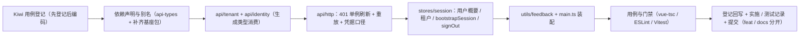

# 02 详细设计 · token 与 401 静默刷新接线

> 认证与安全 · 05 登录前端 · 子任务 02（需求 05-2）· 详细设计

[文档首页](../../../../../../文档首页.md) › [05 登录前端](../../05_登录前端.md) › [02 token 与 401 静默刷新接线](../05_登录前端_02_token与401静默刷新接线.md) › 详细设计　|　[需求 05-2](../../../../需求/05_需求_登录前端.md#r05-2)

## 1. 设计目标与范围 <a id="goal"></a>

把阶段二 `04-1-1` 预留的「token 注入位 + 401 钩子位」接成**完整的 access 生命周期**：

- **token 注入与首屏续期（需求 05-2 第 1 条）**：access 仅存内存（Pinia + 内存模块），请求拦截器统一注入 `Authorization`；刷新页面后首屏静默续期（先 `/auth/refresh`，再经 `/auth/me` 恢复用户上下文，最后放行受保护请求）。
- **401 静默刷新（第 2 条）**：单例刷新（并发 401 共享同一次刷新）、成功后**重放原请求**（复用原请求头含 `Idempotency-Key`）、刷新失败清会话并跳登录（带 `redirect`）、**不产生刷新循环**。
- **登出（第 3 条）**：调 `/auth/logout` 清 refresh cookie 与会话、清内存 token / 用户概要 / 租户编码、跳登录；多标签页口径按计划归口阶段十五（本任务登记成文）。
- **失效提示（第 4 条）**：会话被踢出 / 过期时统一提示并跳登录。
- **契约对齐（第 5 条）**：refresh / logout 经 `api/identity` 寻址、**仅认证端点**携带 httpOnly cookie（`withCredentials`）、并按生成类型消费响应。

**不在本任务**：登录页表单与三类验证码（`05_01`）、路由守卫默认开启与回跳（`05_03`）、扫码登录（`05_04`）；模块请求能力 `api`（`06_02`）；多标签页同步（阶段十五）；宿主国际化（国际化阶段）；后端端点实现（域一 / 域六已交付）。

**安全影响（SDL）**：access 仅内存、**不落任何持久化**（刷新页面靠 refresh cookie 静默续期）；refresh cookie 为 httpOnly 且 `Path` 收敛在 `/api/v1/auth`，前端只经 `withCredentials` 携带、**不读取其值**；凭据只对认证端点开启（其余请求不带 cookie），收敛 CSRF 与跨域凭据暴露面；会话被踢出 / 过期统一走 401 → 清会话 + 跳登录。

### 1.1 现状实测与缺口 <a id="gap"></a>

| # | 实测项 | 结论 |
| --- | --- | --- |
| 1 | `api/http.ts` 401 处理 | 仅 `onUnauthorized()` + 抛 `SessionExpiredError`——**无刷新、无重放**；`HttpHooks` 只有 `onUnauthorized` / `onError` |
| 2 | `api/token.ts` | access 仅内存（`let accessToken`），符合口径；**无租户编码承载** |
| 3 | `stores/session.ts` | 仅 `token` + `codes`；`signIn(token, codes)` 无用户概要 |
| 4 | 刷新所需租户上下文 | 后端 refresh / logout **需租户上下文**（子域名 或 `X-Tenant-ID`，皆无则 `20001`/401）；前端当前无租户编码落点 |
| 5 | 首屏用户概要来源 | `RefreshResult` 不含概要；`01_06` 已交付 `GET /auth/me`（**前置契约已就绪**） |
| 6 | 契约类型 | `06_03` 已修复响应契约 schema 塌空，`@bms/api-types` 的 `identity` 命名空间响应类型具字段可用 |
| 7 | 桌面宿主依赖声明 | `apps/desktop` 是仓库唯一**未声明**基座包（`@bms/core` / `@bms/vue` / `@bms/ui-ep`）而靠三处 alias 的宿主 |

## 2. 交付物清单 <a id="deliver"></a>

| # | 交付物 | 落点 | 类型 |
| --- | --- | --- | --- |
| 1 | 租户编码内存 + 持久化（非敏感） | `apps/desktop/src/api/tenant.ts` | 新增 |
| 2 | 认证端点封装（login / refresh / logout / me，按生成类型） | `apps/desktop/src/api/identity.ts` | 新增 |
| 3 | 401 单例刷新 + 重放 + 凭据口径 | `apps/desktop/src/api/http.ts` | 修改 |
| 4 | 会话 store 扩展（用户概要 / 租户编码 / 首屏续期 / 登出） | `apps/desktop/src/stores/session.ts` | 修改 |
| 5 | 宿主统一提示（会话失效） | `apps/desktop/src/utils/feedback.ts` | 新增 |
| 6 | 宿主装配（刷新处理器 + 失效提示 + 跳登录带 `redirect`） | `apps/desktop/src/main.ts` | 修改 |
| 7 | 路径别名（`@bms/api-types`）与依赖声明补齐 | `apps/desktop/tsconfig.app.json` / `vite.config.ts` / `vitest.config.ts` / `package.json` + `pnpm-lock.yaml` | 修改 |
| 8 | 用例（刷新 / 重放 / 单例 / 登出 / 首屏续期 / 凭据） | `apps/desktop/tests/` | 新增 / 修改 |
| 9 | 实施 / 测试记录 | 本目录 `实施/`、`测试/` | 新增 |

## 3. 设计与边界 <a id="design"></a>

### 3.1 承载与持久化口径 <a id="storage"></a>

| 数据 | 落点 | 持久化 | 说明 |
| --- | --- | --- | --- |
| access token | `api/token.ts`（内存）+ `stores/session.token` | **否** | 刷新页面即丢，靠 refresh cookie 静默续期 |
| refresh token | 后端 httpOnly cookie | 浏览器托管 | 前端**不读取、不存储**；仅经 `withCredentials` 携带 |
| 租户编码 | `api/tenant.ts`（内存）+ `localStorage['bms.tenant']` | **是**（非敏感） | 供 refresh / logout 注入 `X-Tenant-ID`；子域名部署时后端本就优先 |
| 用户概要 | `stores/session.user` | 否 | 首屏经 `GET /auth/me` 恢复（**不落持久化**，避免 PII 与陈旧） |

- **多标签页口径（登记成文）**：本期以**单标签**为准——登出 / 刷新只影响当前标签页的内存态与 cookie；跨标签同步（`storage` 事件 + `BroadcastChannel`）归阶段十五（计划 §7 第 8 项）。
- **租户编码清理时机**：`signOut()` 一并清除；下次登录由 `05_01` 重新写入（登录表单含租户字段 / 子域名识别）。

### 3.2 认证端点封装（`api/identity.ts`） <a id="identity-api"></a>

```text
api/identity.ts（新增）
├── type LoginRequest / LoginResult / RefreshResult / UserSummary   # 取 @bms/api-types 的 identity 命名空间（不手写）
├── login(body) -> Promise<LoginResult>            # POST /auth/login（凭据端点；05_01 消费）
├── refreshAccessToken() -> Promise<RefreshResult> # POST /auth/refresh（无请求体、凭据端点）
├── logout() -> Promise<void>                      # POST /auth/logout（幂等、凭据端点）
└── fetchCurrentUser() -> Promise<UserSummary>     # GET /auth/me（受保护；首屏恢复用户上下文）
```

- 一律经 `apiUrl('identity', …)` 服务段寻址（**不自拼前缀**）与核心 `request()`；统一响应解包由适配器完成，故返回类型为契约中的 `data` 类型。
- refresh / logout 用 `request()` 显式发起（`POST` + 无请求体），**不**自动附幂等键（它们是会话动作、非业务写）。
- 响应类型**全部来自生成类型**（`identity.components['schemas'][…]`），零手写（口径见需求 06-1 / 06-3 / 06-4）。

### 3.3 凭据口径与租户注入（`api/http.ts`） <a id="credentials"></a>

- **仅认证端点开启凭据**：`CREDENTIAL_PATHS = ['/auth/refresh', '/auth/logout']`，URL 与 `serviceUrl('identity', path)` 精确相等时置 `withCredentials: true` 并注入 `X-Tenant-ID`（值取 `getTenantCode()`，无则不注入）；**其余请求一律不带 cookie**。
- **不扩展核心契约**：`@bms/core` 的 `RequestConfig` 不变（避免双宿主与既有核心用例联动）；凭据判定落在**宿主适配器**内（请求拦截器统一处理，单点）。

### 3.4 401 单例刷新与重放（`api/http.ts`） <a id="refresh"></a>

```text
HttpHooks（扩展）
└── onRefresh?: () => Promise<string | null>   # 宿主注入的刷新处理器：返回新 access；无会话返回 null

适配器 request(config, retried = false)
└── 请求拦截器：注入 Authorization（+ 凭据端点 withCredentials / X-Tenant-ID）
└── 响应 401 分支
    ├── 请求属「不重试端点」（/auth/login、/auth/refresh、/auth/logout）→ 直接按会话失效处理
    ├── 已重放过一次（retried）→ 直接按会话失效处理（**防刷新循环**）
    ├── 未注入 onRefresh（阶段二占位口径）→ 直接按会话失效处理
    ├── refreshOnce() 成功 → **重放原请求**（原 config 原样，含 Idempotency-Key）
    └── 刷新失败 → onUnauthorized()（宿主：提示 + 清会话 + 跳登录带 redirect）+ 抛 SessionExpiredError
```

- **单例刷新**：模块级 `refreshPromise`，并发 401 共享同一次刷新（完成后清空，供后续再次刷新）；刷新失败一律返回 `false`（不抛给调用方，统一走会话失效路径）。
- **重放语义**：重放**复用原请求配置**（方法 / URL / 参数 / 请求体 / 请求头，含 `Idempotency-Key`）——后端幂等键去重保证写请求不重复执行。
- **防循环三重**：刷新请求本身属不重试端点 + 每请求最多重放一次 + 单例刷新。
- **刷新失败后不再提示两次**：`onUnauthorized` 由宿主实现为「提示 + 清会话 + 跳登录」，多次并发失败只提示一次（宿主侧按「已跳转」短路）。

### 3.5 会话 store 与首屏静默续期（`stores/session.ts`） <a id="store"></a>

```text
SessionState = { token: string | null; user: UserSummary | null; tenant: string | null; codes: string[] }

actions
├── signIn({ token, user, tenant, codes? })          # 登录成功（05_01 消费）：内存访问令牌 + 用户概要 + 租户编码 + 权限码
├── bootstrapSession() -> Promise<boolean>           # 首屏静默续期：refresh → 写 access → /auth/me → 写用户概要
├── applyToken(token)                                # 仅更新访问令牌（401 重放前由宿主刷新处理器调用链使用）
└── signOut() -> Promise<void>                       # 尽力而为调 /auth/logout，无论成败清空内存态
```

- **`bootstrapSession()` 失败语义**：刷新失败（无 cookie / 401）→ **静默返回 `false`**（不提示、不跳转），由 `05_03` 守卫按「未登录」处理（访问受保护路由再跳登录并带 `redirect`）——避免未登录用户首次访问被误提示「会话已失效」。
- **已持有令牌时短路**：`token !== null` 直接返回 `true`（不重复刷新）。
- **`signOut()` 失败语义**：`/auth/logout` **尽力而为**（失败仅经错误钩子记录），**无论成败**清空内存 token / 用户概要 / 租户编码 / 权限码并复原内存模块——登出可用性优先，与接口「幂等」口径一致。
- **权限码**：登录响应不含权限码（RBAC 归阶段七），`signIn` 的 `codes` 默认空集，保持既有 `setPermissionCodes` 接线不变。

### 3.6 宿主装配（`main.ts`） <a id="assembly"></a>

```text
installHttpAdapter({
  onRefresh: async () => { const r = await refreshAccessToken(); session.applyToken(r.access_token); return r.access_token },
  onUnauthorized: () => { notifySessionExpired(); void session.signOut(); void router.push({ path: '/login', query: { redirect: 当前路径 } }) },
  onError: 既有上报,
})
```

- **提示通道**：宿主注入（请求层只判定会话失效并回请宿主），符合《前端开发规范》§11「提示 / 登录与 403 跳转 / 刷新处理器经各端入口注入」；实现落 `utils/feedback.ts`（ElMessage + 显式样式导入）。
- **跳转带 `redirect`**：取当前路由 `fullPath`（登录页 / 403 等白名单路径不回带），登录成功后由 `05_03` 回跳。
- **失效提示时机（2026-10-02 由 `05_03` 修正）**：仅当**本次失效前存在会话**（失效处理时 `session.token` 非空）才提示 + 清会话 + 跳登录；**冷启动静默续期失败**（本无会话）不提示、不跳转——路由交由守卫按「未登录」处理（跳登录带 `redirect`），避免未登录用户首次访问被误提示「会话已失效」、并与守卫导航竞争。跳登录目标改用核心 `buildLoginLocation`（单一来源）。
- **文案**：宿主暂未引入国际化库（见 `module/i18n.ts` 说明，归国际化阶段），故失效提示用**宿主文案常量**；错误码 → 文案映射归 `05_01` / 国际化阶段（偏差已登记 §8.1）。

### 3.7 依赖声明与别名（`@bms/api-types`） <a id="deps"></a>

- `apps/desktop/package.json` 增 `"@bms/api-types": "workspace:*"`，并**顺带补齐**既有未声明的 `@bms/core` / `@bms/vue` / `@bms/ui-ep`（消除宿主幽灵依赖，与 `packages/*` / `modules/*` 及《pnpm部署使用说明》「依赖必须逐项声明」口径一致）。
- **保留** `tsconfig.app.json` / `vite.config.ts` / `vitest.config.ts` 的路径别名（构建加速与源码直出），新增 `@bms/api-types` 别名。
- 锁文件变更经 `还原依赖` → `pnpm install`（更新 `pnpm-lock.yaml`）→ `pnpm install --frozen-lockfile`（校验）→ `外置依赖` 复位；CI 仍走 `--frozen-lockfile`。

### 3.8 失败分支与边界 <a id="failures"></a>

| 场景 | 处理 |
| --- | --- |
| 401 并发（多请求同时过期） | 单例刷新：共享同一次 `/auth/refresh`，成功后各自重放；刷新失败统一按会话失效 |
| 刷新请求本身 401 | 属不重试端点 → 直接会话失效（**不递归**） |
| 重放后仍 401 | 已达重放上限 → 会话失效（**不二次刷新**） |
| 未注入 `onRefresh`（阶段二占位口径） | 直接按会话失效处理（清会话 + 跳登录、不发刷新请求） |
| 首屏无 refresh cookie（未登录） | `bootstrapSession()` 静默返回 `false`，不提示不跳转 |
| 首屏 `/auth/me` 失败但 refresh 成功 | 保留 access（内存态可用），用户概要留空并登记（登录态不完整时降级） |
| `/auth/logout` 失败 | 仍清空内存态并跳登录（尽力而为） |
| 无租户编码且非子域名部署 | refresh / logout 不注入 `X-Tenant-ID` → 后端 `20001` / 401 → 按会话失效处理（提示 + 跳登录，用户重新登录） |
| 模块（远程）401 | 模块请求经宿主 `api` 能力（`06_02`），届时自动享受本刷新链；本任务不涉及 |

## 4. 兼容性与消费方影响 <a id="compat"></a>

- **请求层向后兼容**：`HttpHooks.onRefresh` 为可选；未注入时 401 行为与阶段二占位口径**完全一致**（既有 `api-http` 用例零改动通过）。
- **核心契约零变更**：`@bms/core` 不改（`RequestConfig` / `RequestAdapter` 原样）。
- **store 变更**：`signIn` 由位置参数改对象载荷（更清晰且承载用户概要 / 租户）；同步更新既有 `session` 用例。
- **登录页消费**：`05_01` 直接用 `login()` 与 `signIn(...)`；`05_03` 守卫调 `bootstrapSession()`。
- **依赖形态**：`apps/desktop` 首次显式声明基座包（此前靠 alias）；对构建产物无影响（仍走 alias 源码直出）。

## 5. 测试设计与验收映射 <a id="test"></a>

用例**先登记 Kiwi TCMS 再编码**（新登记 1 条策展用例；编号以平台回读为准并回填实施 / 测试记录与代码标注）。

| # | 用例 / 文件 | 类型 | 断言要点 |
| --- | --- | --- | --- |
| 1 | `tests/api-http.spec.ts`（扩展） | 单元 | 401 → 触发 `onRefresh` 并**重放原请求**（原方法 / URL / 请求头含 `Idempotency-Key` 原样）；重放成功返回结果 |
| 2 | 同上 | 单元 | 并发两个 401 → **`onRefresh` 只调用一次**，两请求各自重放成功 |
| 3 | 同上 | 单元 | 刷新失败（返回 null / 抛错）→ `onUnauthorized` 调用且抛 `SessionExpiredError`；**不递归刷新** |
| 4 | 同上 | 单元 | `/auth/refresh`、`/auth/logout`、`/auth/login` 自身 401 → **不触发刷新**（防循环） |
| 5 | 同上 | 单元 | **未注入 `onRefresh`** → 401 行为与占位口径一致（既有断言不改） |
| 6 | 同上 | 单元 | 凭据口径：refresh / logout URL 置 `withCredentials` 并注入 `X-Tenant-ID`；其他 URL 不带 |
| 7 | `tests/session.spec.ts`（扩展） | 单元 | `signIn` 写入 token / 用户概要 / 租户编码；`signOut` 调 `/auth/logout` 且失败仍清空 + 清持久化租户编码 |
| 8 | `tests/session-bootstrap.spec.ts`（新增） | 单元 | `bootstrapSession()` 成功：refresh → 写 access、再 `/auth/me` → 写用户概要；失败：静默 `false`（不提示不跳转）；已持令牌短路 |
| 9 | `tests/api-identity.spec.ts`（新增） | 单元 | 四个端点寻址正确（`/api/identity/v1/auth/...`）、方法与载荷正确、类型取生成命名空间 |
| 10 | `tests/feedback.spec.ts`（新增） | 单元 | 会话失效提示调用（ElMessage 桩） |
| 11 | `apps/desktop` 既有全部用例 | 回归 | 请求层 / 端点 / 守卫 / 会话用例全绿（含 `vue-tsc` / ESLint） |

**验收映射**：需求 05-2「access 过期自动刷新并重放」→ 用例 1 / 8；「并发 401 仅一次刷新」→ 用例 2；「刷新失败跳登录且无循环」→ 用例 3 / 4；「登出后不再携带旧 token」→ 用例 7（`signOut` 清内存令牌）；「字段与后端契约一致」→ 用例 9 + `api-types:gen:check`。门禁：`vue-tsc`、ESLint、Vitest 全绿；受影响宿主用例回归全绿。

**执行范围**：只跑受变更影响的定向用例（`apps/desktop` 全部用例 + `@bms/api-types` 零漂移校验），不跑全量前端工作区（口径见《[AI开发规范](../../../../../../规范/AI开发规范.md)》）。

## 6. 登记落点 <a id="registry"></a>

| 内容 | 落点 |
| --- | --- |
| 请求层 hooks 契约（`onRefresh`）与凭据口径 | 《[前端基类清单](../../../../../../前端基类清单.md)》「宿主横切底座」节 |
| 首屏续期与用户概要恢复口径 | 本设计 + 域一 `01_06` 任务文档（**前置契约已交付**） |
| 租户编码持久化口径（唯一非敏感持久化项） | 本设计 §3.1 + 《[前端开发规范](../../../../../../规范/前端开发规范.md)》§11 相关表述核对 |
| 阶段计划：05_02 条目与工作量 | 阶段计划表（进度唯一落点） |
| Kiwi TCMS / 测试资产仓 | 登记本任务用例并回读编号 |
| 实施 / 测试记录 | 本目录 `实施/`、`测试/` |

## 7. 边界与开放项 <a id="boundary"></a>

- **多标签页同步**：归阶段十五（计划 §7 第 8 项）；本期单标签口径已登记。
- **国际化文案**：宿主未引入 i18n（归国际化阶段）；本任务失效提示用宿主文案常量，错误码映射归 `05_01`。
- **`redirect` 安全性**：仅回带**站内路径**（`fullPath`），登录页回跳时须再校验为站内相对路径（`05_03` 落地）。
- **访问令牌续期精度**：不做「过期前主动刷新」（按 401 被动刷新）；如出现首屏抖动再评估（归后续）。
- **`/auth/me` 失败降级**：refresh 成功但概要拉取失败时保留内存令牌、概要留空（登录态不完整）；是否强制重登由 `05_03` / `05_01` 决定。
- **模块请求链路**：模块经宿主 `api`（`06_02`）自动继承本刷新链，本任务不涉及。

## 8. 对齐记录 <a id="align"></a>

### 8.1 本轮拍板（2026-10-02，逐项确认） <a id="align-new"></a>

| # | 事项 | 结论 |
| --- | --- | --- |
| 1 | 契约类型缺口 | 先立项补建基座修复（`06_03`，**已交付**），本任务按生成类型消费 |
| 2 | 租户来源 | **持久化租户编码**（非敏感）+ 认证端点注入 `X-Tenant-ID` |
| 3 | 首屏续期归属 | `05_02` 交付 `bootstrapSession()`，`05_03` 守卫调用并负责等待态 / 不闪登录页 |
| 4 | 首屏续期失败语义 | **静默失败**（不提示不跳转），由 `05_03` 按「未登录」处理 |
| 5 | 凭据口径 | **仅认证端点**开启 `withCredentials`，其余不带 cookie |
| 6 | 重放幂等键 | **复用原 `Idempotency-Key`**（透传原请求头） |
| 7 | 会话载体 | `stores/session.ts` 承载 access（内存）+ 用户概要 + 租户编码（持久化） |
| 8 | 登出失败语义 | **尽力而为、本地必清** |
| 9 | 失效提示通道 | **宿主注入提示钩子**（`main.ts` 装配：提示 + 清会话 + 跳登录带 `redirect`） |
| 10 | `@bms/api-types` 接入 | **声明 `workspace:*` 依赖**并补齐宿主既有未声明基座包；保留 alias 作构建加速 |
| 11 | 首屏用户概要恢复 | 补建后端 `01_06`（`GET /auth/me`，**已交付**） |
| 12 | 多标签页 | 本期单标签口径登记成文，同步实现归阶段十五 |
| 13 | **实施期偏差（文案）** | 宿主未引入国际化库（归国际化阶段）→ 失效提示用**宿主文案常量**；错误码 → 文案映射归 `05_01` / 国际化阶段 |
| 14 | Kiwi 用例 | 新登记 1 条策展用例（设计定稿后、编码前登记） |

### 8.2 复用既有口径 <a id="align-reuse"></a>

| # | 事项 | 结论 |
| --- | --- | --- |
| 1 | 服务段寻址 | `apiUrl` / `serviceUrl`（阶段二 `04-1-1` 已交付），不自拼前缀 |
| 2 | 请求层与钩子位 | `http.ts` / `request.ts` / `token.ts`（阶段二 `04-1-1` 已交付），只扩展不重构 |
| 3 | 契约类型 | `@bms/api-types` 生成类型（需求 06-1 / 06-3 / 06-4 已交付） |
| 4 | 会话失效错误 | 复用 `SessionExpiredError` 与统一 401 处理面（域一 `01_05` 口径） |
| 5 | 集合与命名 | 遵《命名规范》《前端开发规范》；文档遵《文档生成规范》 |

## 9. 实施步骤与关键命令 <a id="steps"></a>



1. 读《[KiwiTCMS部署使用说明](../../../../../../资料/开发服务器/linux/KiwiTCMS部署使用说明.md)》「用例约定」节，登记本任务用例并**回读编号**。
2. 依赖声明与别名：`还原依赖` → 改 `package.json` → `pnpm install`（更新锁文件）→ `pnpm install --frozen-lockfile` 校验 → `外置依赖` 复位。
3. `api/tenant.ts` / `api/identity.ts`（服务段寻址 + 生成类型）。
4. `api/http.ts`：`onRefresh` 钩子、单例刷新、重放、凭据与租户头、防循环。
5. `stores/session.ts`：状态扩展 + `bootstrapSession()` + `signOut()`。
6. `utils/feedback.ts` + `main.ts` 装配（刷新处理器 / 失效提示 / 跳转带 `redirect`）。
7. 用例（对齐 §5 表）与门禁：`pnpm --filter @bms/desktop run test` / `lint` + `vue-tsc`；`pnpm run api-types:gen:check`。
8. 登记回写（《前端基类清单》宿主横切底座节、阶段计划）+ 实施 / 测试记录 + 代码与文档分开提交（`feat` / `docs`）。

关键命令：

```bash
# 前端（bms 根）
pnpm run api-types:gen:check
pnpm --filter @bms/desktop run test
pnpm --filter @bms/desktop run lint
pnpm --filter @bms/desktop exec vue-tsc -b --noEmit    # 型检（构建脚本内含）
# 依赖（bms 根）
bash scripts/tools/deps/还原依赖.sh && pnpm install && pnpm install --frozen-lockfile && bash scripts/tools/deps/外置依赖.sh
# 仓库根
python3 scripts/tools/preflight/check-preflight.py --fast
```

## 10. 参考文档 <a id="ref"></a>

- [需求 05-2](../../../../需求/05_需求_登录前端.md#r05-2)
- 《[前端开发规范](../../../../../../规范/前端开发规范.md)》§11「请求封装」、§12「测试」
- 《[前端基类清单](../../../../../../前端基类清单.md)》「宿主横切底座」节
- 《[架构设计 · 前端架构](../../../../../../设计/架构设计/08_架构设计_前端架构.md)》§3「技术要点」、§4「动态菜单与权限渲染」
- 《[架构设计 · 认证与会话](../../../../../../设计/架构设计/14_架构设计_子系统_认证与会话.md)》§2「双 token 模型」
- 域一 [01_06 当前用户概要端点](../../../01_认证与会话/01_认证与会话_06_当前用户概要端点/01_认证与会话_06_当前用户概要端点.md)（**前置契约已交付**）
- 阶段二 `04-1-1` 前端网关接入改造（**请求层与钩子位骨架已交付**）

> 本文档依《[文档生成规范](../../../../../../规范/文档生成规范.md)》编写 · 关键决策逐项确认（2026-10-02）
