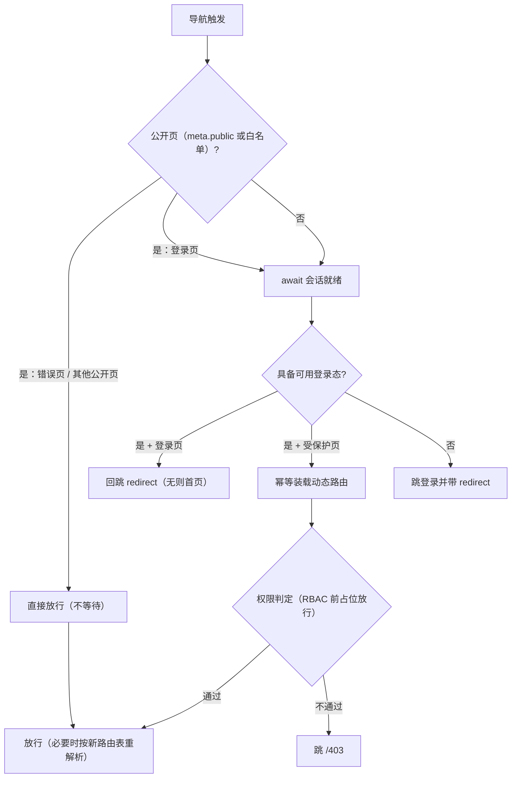

# 03 详细设计 · 路由守卫默认开启与登录回跳

> 认证与安全 · 05 登录前端 · 子任务 03（需求 05-3）· 详细设计

[文档首页](../../../../../../文档首页.md) › [05 登录前端](../../05_登录前端.md) › [03 路由守卫默认开启与登录回跳](../05_登录前端_03_路由守卫默认开启与登录回跳.md) › 详细设计　|　[需求 05-3](../../../../需求/05_需求_登录前端.md#r05-3)

## 1. 设计目标与范围 <a id="goal"></a>

把阶段二 `04-1-1` 交付的守卫骨架（`resolveAuthRedirect` + 白名单，默认关闭）**接成正式守卫链路**，并补齐 `05_02` 遗留的两项（`redirect` 站内校验、守卫等待态）：

- **默认开启（需求 05-3 第 1 条）**：开关语义改为「缺省开启，显式 `off` 关闭」；白名单收敛为「核心常量（登录页 / 错误页）+ 路由 `meta.public` 声明 + 开发态 DEV 专属路由」三源合一。
- **回跳（第 2 条）**：未登录访问受保护路由 → 跳登录并带 `redirect`（原 `fullPath`）；登录成功（或**已登录再进登录页**）→ 回跳原目标，无目标 / 目标非法一律回默认首页；`redirect` 经**站内相对路径校验**（拒绝开放重定向）。
- **与动态路由协同（第 3 条）**：会话就绪后**幂等装载**菜单动态路由（菜单源仍为占位菜单，阶段七换来源即可），会话清理时**卸载**；守卫在装载后按新路由表**重解析**当前导航（消除「刷新深链落兜底 404」）；`meta.perm` 权限判定机制就位、RBAC 就绪前**占位放行**，判定不通过跳 `/403`。
- **首屏体验（第 4 条）**：守卫在被守卫导航前 `await` **单例会话就绪**（首屏静默续期），续期期间**不跳登录、不闪登录页**；会话就绪前由应用根渲染骨架屏（等待态）；守卫决策（放行 / 跳登录 / 跳 403）经核心遥测新增 `guard` 记录并入既有观测面板。

**不在本任务**：登录页真实表单与验证码（`05_01`）、扫码登录（`05_04`）、真实菜单下发与 `meta.perm` 权限码装载（阶段七 RBAC）、多标签页同步（阶段十五）、后端端点实现（域一 / 域六已交付）。

**安全影响（SDL）**：`redirect` 一律经站内相对路径校验（仅接受单个前导 `/`，拒绝协议 / 协议相对地址 / 反斜杠 / 控制字符 / 公开白名单路径），杜绝开放重定向与回跳循环；未登录不得直达受保护路由（前端拦截 + 后端强制校验双保险）；守卫决策只记路径与原因，**不记令牌与查询串中的敏感值**（`redirect` 原文不入记录）。

### 1.1 现状实测与缺口 <a id="gap"></a>

| # | 实测项 | 结论 |
| --- | --- | --- |
| 1 | `apps/desktop/src/router/guard.ts` | `isAuthGuardEnabled()` 为 `VITE_AUTH_GUARD === 'on'`（**缺省关闭**）；`installAuthGuard` 同步读 `getAccessToken()` 判定，**不等待会话续期** → 刷新页面时令牌尚未恢复即判「未登录」，跳 `/login` 且**不带 `redirect`**（`05_02` 遗留的「闪登录页」「不回跳」根因） |
| 2 | `packages/core/src/domain/route-guard.ts` | 仅 `resolveAuthRedirect`（返回登录路径或 `null`）+ 白名单常量：无 `redirect` 构造、无站内校验、无权限判定、无 `meta.public` 支持 |
| 3 | `apps/desktop/src/main.ts` | `handleSessionInvalid` 内联「公开路径不回带 `redirect`」逻辑（与守卫判定重复）；`onUnauthorized` 在**无会话**（冷启动续期失败）时也会提示 + 跳登录——与 `05_02` 设计 §3.5「失败静默、由守卫按未登录处理」口径不符 |
| 4 | `apps/desktop/src/main.ts` | `installMenuRoutes(router, PLACEHOLDER_MENU)` 启动期无条件装载，**无卸载路径** → 会话清理后内部路由残留 |
| 5 | `apps/desktop/src/stores/session.ts` | `bootstrapSession()` 已交付，但无「就绪状态 / 单例 Promise」——守卫与首屏骨架无从消费 |
| 6 | `packages/core/src/module/telemetry.ts` | 记录联合仅 `load` / `error` / `vital`，**无守卫决策记录**；观测面板无守卫区块 |
| 7 | `apps/desktop/src/router/index.ts` | `installAuthGuard(router)` 在**模块加载期**调用（早于 `createPinia()`），无法注入会话依赖 |
| 8 | 开发核对页 | 仓内已有 20 个 dev 核对页（`src/dev/*Check.vue` + 同名 `*.html` 多页入口，`vite build` 只构建 `index.html`，核对页不进产物）；**无守卫核对页** |
| 9 | 权限 | 路由未使用 `meta.perm`；核心已有 `evaluatePermission`（`any` / `all` / `not`），宿主 `utils/perm.ts` 已包装 `hasPerm` / `canAccess` |

## 2. 交付物清单 <a id="deliver"></a>

```text
frontend/packages/core/
├── src/domain/route-guard.ts                    # 改：守卫决策 / 公开路径 / 回跳构造 / 站内校验 / 路径常量
├── src/module/telemetry.ts                      # 改：新增守卫决策记录种类（ModuleGuardRecord）
├── src/capabilities/module-telemetry.ts         # 改：快照平台组新增 guards 聚合
├── src/index.ts                                 # 改：导出新增核心 API 与类型
└── tests/route-guard.spec.ts                    # 改：决策矩阵 / 白名单 / 回跳与校验用例
└── tests/module-telemetry.spec.ts               # 改：guard 记录聚合用例
frontend/apps/desktop/
├── src/router/guard.ts                          # 改：默认开启 / 异步等待会话 / 回跳 / 权限占位 / 重解析 / 观测记录
├── src/router/dynamic.ts                        # 改：ensureMenuRoutes（幂等装载）/ uninstallMenuRoutesAll
├── src/router/index.ts                          # 改：移除模块加载期守卫接线（改由宿主入口装配）
├── src/stores/session.ts                        # 改：会话就绪状态 + ensureReady（单例）
├── src/main.ts                                  # 改：守卫装配 / 会话失效处理口径修正 / 动态路由联动
├── src/views/ModuleObservabilityView.vue        # 改：新增「守卫决策」区块
├── src/dev/AuthGuardCheck.vue                   # 新：守卫核对页（五组自检上屏）
├── src/dev/authGuardCheck.ts                    # 新：核对页入口
├── src/env.d.ts                                 # 改：守卫开关说明
├── src/router/route-meta.d.ts                   # 新：路由元信息声明（meta.public / meta.perm；须为模块文件）
├── auth-guard-check.html                        # 新：核对页多页入口（不进构建产物）
└── tests/auth-guard.spec.ts                     # 改：开关 / 白名单 / 拦截与回跳 / 403 / 等待态 / 重解析
    tests/dynamic-routes.spec.ts                 # 新：动态路由幂等装载与卸载
    tests/session-readiness.spec.ts              # 新：会话就绪（单例续期 / 失败静默 / 失效不误放行）
    tests/auth-guard-check.spec.ts               # 新：核对页五组自检渲染（20 项全通过）
bms文档/
├── 项目/06_认证与安全/任务/05_登录前端/05_登录前端_03_…/ 设计|实施|测试/   # 新：本任务三份记录
├── 前端基类清单.md                              # 改：§9「宿主横切底座」节（守卫接线 / 会话就绪 / 观测记录）
└── 项目/06_认证与安全/计划/01_计划_认证与安全.md # 改：进度唯一落点（状态 / 完成日期 / 偏差与遗留）
```

> 目录树为罗列型内容，按《[文档生成规范](../../../../../../规范/文档生成规范.md)》用目录清单（非 mermaid）。

## 3. 设计与边界 <a id="design"></a>

### 3.1 守卫决策 API（核心纯函数） <a id="core-api"></a>

核心 `domain/route-guard.ts` 由「单一登录跳转判定」扩为**决策 + 回跳 + 校验**三组纯函数（框架无关、可单测、跨端复用）：

```text
route-guard.ts
├── 常量
│   ├── DEFAULT_PUBLIC_PATHS      # ['/login', '/403', '/404', '/500']（登录页 + 错误页）
│   ├── DEFAULT_LOGIN_PATH        # '/login'
│   ├── DEFAULT_HOME_PATH         # '/'（登录后回跳兜底）
│   ├── DEFAULT_FORBIDDEN_PATH    # '/403'
│   └── REDIRECT_QUERY_KEY        # 'redirect'
├── type AuthGuardDecision = 'allow' | 'login' | 'forbidden'
├── resolveAuthGuard(input): AuthGuardDecision
│   # hasToken=false 且非公开 → 'login'；已持令牌：
│   #   未声明 meta.perm → 'allow'；声明且权限未装载 → 'allow'（占位，调用方登记）；
│   #   已装载且不满足 → 'forbidden'
├── isPublicPath(path, publicPaths?): boolean        # 精确或其子路径
├── buildLoginLocation(path, options?): { path; query? }
│   # 公开路径 / 登录页自身 → 不带 query；受保护路径 → query.redirect = path（原 fullPath）
├── resolveSafeRedirect(raw, options?): string
│   # 站内相对路径校验：合法则原样返回；非法 / 命中公开白名单 → options.fallback（缺省 DEFAULT_HOME_PATH）
└── resolveAuthRedirect(input): string | null        # 兼容保留：= resolveAuthGuard 为 'login' 时的登录路径
```

`resolveSafeRedirect` 的合法判定（**唯一安全口径**）：

| 条件 | 处理 |
| --- | --- |
| 非字符串 / 空串 / 去空白后为空 | 回落 `fallback` |
| 不以单个 `/` 开头（相对路径、`http(s)://`、`javascript:`、`mailto:` 等） | 回落 |
| 以 `//` 开头（协议相对地址） | 回落 |
| 含反斜杠 `\` 或控制字符（`\u0000`~`\u001f`、`\u007f`） | 回落 |
| 命中公开白名单（`/login`、错误页等） | 回落（防回跳循环） |
| 以上均不命中 | 原样返回（含查询串与片段，如 `/org/users?page=2#row-3`） |

**签名与用法**：`resolveAuthGuard` 只做判定、不改状态；`buildLoginLocation` 与 `resolveSafeRedirect` 负责「跳哪里」；宿主守卫与 `05_02` 的会话失效处理**共用**这两个函数（消除重复逻辑）。

### 3.2 白名单与公开页口径 <a id="public"></a>

公开路径 = **核心常量** ∪ **路由 `meta.public`** ∪ **开发态 DEV 专属路由**：

| 来源 | 内容 | 理由 |
| --- | --- | --- |
| 核心常量 `DEFAULT_PUBLIC_PATHS` | `/login`、`/403`、`/404`、`/500` | 登录页与错误页免登录可达（与后端公开路径口径一致：前端路由白名单只覆盖前端路由，后端公开路径（`/auth/login`、`/auth/refresh`、`/auth/sso/*`、`/oidc/*`、`/captcha/*`、`/healthz`）由网关与 identity 承载，前端白名单不重复列举） |
| 路由声明 `meta.public === true` | 各路由按需标注 | 后续新增公开页（如 SSO 回跳页）只改路由声明，不动核心常量 |
| DEV 专属路由（`import.meta.env.DEV`） | `/dev/module-observability` | 开发态观测面板免登录可用（与「观测面板 dev-only」口径一致），生产无此路由、零影响 |

- 判定顺序：**先** `meta.public` 与常量（同步、零请求）**后**会话就绪；公开页不因未登录被拦。
- `resolvePublicPaths(dev = import.meta.env.DEV)` 由宿主导出，供守卫与核对页共用（`dev` 参数可显式传入，便于用例锁定两分支）。

### 3.3 会话就绪与「不闪登录页」 <a id="readiness"></a>



- **单例会话就绪**：`stores/session.ts` 新增 `ready` 状态与 `ensureReady()`——模块级单例 Promise，首次调用执行 `bootstrapSession()`（首屏静默续期：`/auth/refresh` → 写内存 access → `/auth/me` 恢复用户概要），并发调用共享同一次；`ready` 置真后守卫不再等待。
- **不闪登录页**：守卫在判定前 `await ensureReady()`，续期期间**导航挂起**（不重定向到登录页）；续期失败（无 refresh cookie / 会话已失效）→ `ready` 置真、按未登录处理 → 跳登录并带 `redirect`（一次到位，无「先闪登录页再回跳」）。
- **骨架屏（等待态）**：应用根 `App.vue` 在 `!session.ready` 时渲染全屏骨架（纯令牌样式，不硬编码色值），就绪后切回主框架——等待期间不出现白屏，也不出现登录页闪烁。
- **公开错误页不等待**：`/403`、`/404`、`/500` 等公开页直接放行（不发起续期），避免错误页被会话链路拖慢。
- **登录页同样等待**：进入 `/login` 时先 `await ensureReady()`，会话可用则**直接回跳**（已登录用户的书签 / 历史记录不再停留在登录页）；未登录时该次续期失败**静默**（不提示，见 §4）。

### 3.4 回跳与安全校验 <a id="redirect"></a>

- **跳登录带 `redirect`**：`buildLoginLocation(path)` 在目标为受保护路径时写入 `query.redirect = path`（取 **`to.fullPath`**，保留查询串与片段）；目标为公开路径或登录页自身时不写（避免无意义参数与回跳循环）。
- **登录成功后回跳**：`resolveSafeRedirect(route.query.redirect)` 给出目标（非法 / 缺失 → `DEFAULT_HOME_PATH`）；`05_01` 登录成功后 `router.push(resolveSafeRedirect(...))` 即完成回跳（本任务交付该解析函数与守卫侧闭环）。
- **已登录回跳闭环**：已持令牌（`ready` 且 `getAccessToken() !== null`）访问 `/login` → 守卫直接返回 `resolveSafeRedirect(to.query.redirect)`——「未登录被拦 → 登录 → 回跳」整链在本任务即可验证，不等待登录页交付。
- **会话失效跳登录**：请求层 401 失效路径（`05_02`）改用同一 `buildLoginLocation` 构造目标，口径与守卫一致。

### 3.5 权限判定占位（`meta.perm` → 403） <a id="perm"></a>

- **机制就位**：路由可声明 `meta.perm`（单个权限码或权限码数组，语义「任一满足」）；守卫经核心 `resolveAuthGuard` 判定，不满足跳 `DEFAULT_FORBIDDEN_PATH`（`/403`）。
- **占位放行（RBAC 归阶段七）**：权限码装载来源阶段七才接线，故宿主以**显式命名的占位**表达「已装载」——`permissionsLoaded = session.codes.length > 0`（单点、注释标明归口阶段七）；未装载时守卫**放行并在观测中记录原因**（而非静默），便于阶段七核对遗漏。
- **未声明即放行**：绝大多数路由当前不声明 `meta.perm`，守卫零判定开销。
- **与按钮 / 字段权限一致**：判定语义复用核心 `evaluatePermission`（宿主 `utils/perm.ts::hasPerm` 同源），不另建判定。

### 3.6 动态路由装载与卸载 <a id="dynamic"></a>

```text
router/dynamic.ts（扩展）
├── installMenuRoutes(router, menu)          # 既有：按菜单树注册占位路由，返回本次路径清单
├── uninstallMenuRoutes(router, paths)       # 既有：按路径卸载
├── ensureMenuRoutes(router, menu)           # 新：幂等装载（已装载直接返回，不重复注册）
└── uninstallMenuRoutesAll(router)           # 新：卸载本模块装载的全部菜单路由并清空登记
```

- **装载时机**：会话就绪后（首屏续期成功 / 登录成功）幂等装载；宿主经 `session.$subscribe` 统一接线（`token` 非空 → 装载，`token` 为空 → 卸载），因此**登录、登出、会话失效、用户切换**共用一条路径，后续不再逐处补调用。
- **菜单源**：仍为占位菜单 `PLACEHOLDER_MENU`；阶段七接入后端菜单接口时**只替换菜单来源**，装载 / 卸载机制不变（本任务把「按用户上下文装载」的机制与调用点备好）。
- **刷新深链重解析**：刷新进入菜单路由（如 `/org/users`）时该路径尚未注册，`to` 会先命中兜底 404；守卫在装载后若「装载前未命中、装载后可解析」则返回当前地址（`replace`）触发**按新路由表重解析**，避免深链落 404 页。
- **模块路由不受影响**：产品模块路由（`registerModuleRoutes`）仍由模块装载期注册，随模块生命周期管理，不随会话清理卸载。

### 3.7 守卫判定观测 <a id="observability"></a>

- **核心记录种类**：`module/telemetry.ts` 记录联合新增 `ModuleGuardRecord`（`kind: 'guard'`：`decision`（`allow` / `login` / `forbidden`）/ `path` / `reason` / `at`）；`ModuleTelemetry.snapshot()` 将其归入**平台组**（新增 `platform.guards`），与平台错误 / Vitals 同处。
- **记录口径**：宿主守卫对每次判定记一条（含放行），`reason` 用枚举化短句——`public`（公开常量）/ `public-route`（`meta.public`）/ `login-page`（未登录进登录页）/ `signed-in-redirect`（已登录回跳）/ `no-session`（无会话跳登录）/ `routes-installed`（装载动态路由后重解析）/ `session-ready`（放行）/ `perm-granted`（权限已授予）/ `perm-not-loaded`（权限未装载占位放行）/ `perm-denied`（跳 403）；**只记路径与原因**，不记令牌、不记查询串（隐私与体积约束）。
- **面板展示**：开发态观测面板 `ModuleObservabilityView.vue` 新增「守卫决策」区块（决策 / 路径 / 原因 / 时刻，倒序），`resetModuleTelemetry()` 一并清空。
- **不新增上报通道**：仍复用 `ModuleTelemetry` + `configureBase` 注入的 sink（守卫记录直接写遥测器），符合「不得另起通路」口径。

### 3.8 宿主装配与顺序 <a id="assembly"></a>

```text
main.ts（装配顺序）
├── 创建 pinia → session store（既有）
├── installAuthGuard(router, { ensureSession, ensureRoutes, record })   # 新增：守卫接线（移出 router/index.ts）
├── installHttpAdapter({ onRefresh, onUnauthorized })                   # 既有；onUnauthorized 改经修正后的会话失效处理
├── session.$subscribe(...)                                             # 新增：token 变化 → 装载 / 卸载菜单路由
└── bootstrap(): installModules → installModuleRouteScope → app.use(router) → app.mount
```

- **守卫依赖注入**：`installAuthGuard(router, deps)` 收三件依赖——`ensureSession`（会话就绪）/ `ensureRoutes`（幂等装载菜单路由）/ `record`（观测记录）；守卫本身不依赖 pinia 与 store（可测、可换）。
- **移除启动期无条件装载**：`installMenuRoutes(router, PLACEHOLDER_MENU)` 从 `main.ts` 启动序列移除，改由会话就绪链路装载（`05_02` 的启动期装载口径随之退役）。
- **守卫安装位置**：`router/index.ts` 不再调用守卫（模块加载期早于 pinia），改由 `main.ts` 在 pinia 就绪后装配；安装仍在 `app.use(router)`（触发初始导航）之前，保证首屏导航已被守卫覆盖。
- **路由元信息类型**：`env.d.ts` 补 `RouteMeta` 声明（`title` / `keepAlive` / `public` / `perm`），避免 `meta` 以 `unknown` 读取。

### 3.9 开发核对页 <a id="check-page"></a>

新增 `auth-guard-check.html` + `src/dev/authGuardCheck.ts` + `src/dev/AuthGuardCheck.vue`，与既有核对页同构（`?` 无关、纯前端自检、不进构建产物），页内五组自检逐项上屏「通过 / 不通过」：

| 组 | 自检项 |
| --- | --- |
| 拦截与回跳 | 无令牌受保护路径 → 决策 `login`；`buildLoginLocation('/org/users?page=2')` → `/login` + `redirect=/org/users?page=2`；公开路径不带 `redirect` |
| 白名单放行 | 核心常量逐项放行；`/login/callback` 子路径放行；`/loginfo` 不误伤；`meta.public` 路由放行 |
| 回跳安全校验 | 站内相对路径原样；`https://evil.example.com`、`//evil.example.com`、`javascript:alert(1)`、`\\evil`、控制字符、`/login` → 均回落首页；合法带查询串 / 片段原样 |
| 权限占位 | 未声明 `meta.perm` → 放行；声明但权限未装载 → 放行（占位）；已装载且满足 → 放行；已装载且不满足 → `forbidden` |
| 开关与 DEV 白名单 | `isAuthGuardEnabled()`（缺省 `true`、`off` 为 `false`）；`resolvePublicPaths(true)` 含 DEV 观测面板路由、`resolvePublicPaths(false)` 不含；等待态说明（骨架屏 + 导航挂起） |

核对页展示纯函数结果与开关实况；「刷新不闪登录页」由宿主用例锁定（§5 用例 6 / 7）在核对页以说明条目呈现。

### 3.10 失败分支与边界 <a id="failures"></a>

| 场景 | 处理 |
| --- | --- |
| 未登录访问受保护路由 | `await 会话就绪`（失败静默）→ 跳登录并带 `redirect`（原 `fullPath`） |
| 已登录（内存令牌在）刷新受保护页面 | 续期成功 → 放行；续期期间导航挂起 + 骨架屏，**不跳登录**（不闪登录页） |
| 刷新进入菜单路由（未装载） | 会话就绪后幂等装载 → 按新路由表重解析当前地址（`replace`），不落兜底 404 |
| 未登录访问公开错误页 | 直接放行（不发起续期、不等待） |
| 已登录访问 `/login` | 回跳 `redirect`（经站内校验）；无 / 非法 → 回首页 |
| `redirect` 为外链 / 协议相对 / 反斜杠 / 控制字符 / 公开页 | 一律回落默认首页（开放重定向与回跳循环双防） |
| 冷启动无会话时请求层 401 | **不提示、不跳登录**（本次失效前无会话）——由守卫按未登录处理（§4） |
| 会话中途失效（曾持有令牌） | 提示会话已失效 + 清会话 + 跳登录带 `redirect`（并发只处理一次，`05_02` 口径不变） |
| `meta.perm` 已声明、权限未装载 | 放行并记录原因 `perm-not-loaded`（阶段七核对清单来源） |
| `meta.perm` 已声明、权限装载且不满足 | 跳 `/403`（不回带 `redirect`，避免与登录回跳语义混淆） |
| 守卫开关 `off` | 守卫不注册任何钩子（与阶段二关闭态行为一致）；登录链路的 401 处理不受影响 |
| 模块（远程）路由 | 不随会话清理卸载；模块加载期注册，随模块生命周期管理 |

## 4. 对 `05_02` 的修正与相邻边界 <a id="neighbor"></a>

| # | 项 | 现状 | 本任务修正 / 边界 |
| --- | --- | --- | --- |
| 1 | 会话失效提示时机 | `onUnauthorized` 无条件提示 + 跳登录：**冷启动续期失败**（本次失效前并无会话）也会弹「会话已失效」并 `router.push('/login')`，与守卫的导航竞争 | 失效处理前置判据「**本次失效前是否存在会话**」（`session.token === null` 即无会话 → 直接返回，提示与跳转交由守卫）；**回写** [05_02 详细设计](../../05_登录前端_02_token与401静默刷新接线/设计/01_详细设计_02_token与401静默刷新接线.md) §3.6 |
| 2 | `redirect` 跳登录构造 | `main.ts` 内联「公开路径不回带 `redirect`」 | 改用核心 `buildLoginLocation`（单一来源），行为等价 |
| 3 | 守卫等待态 | 归口 `05_03`（`05_02` 实施记录 §7 第 5 项） | 本任务 §3.3 交付（单例会话就绪 + 骨架屏） |
| 4 | `redirect` 站内校验 | 归口 `05_03`（同上） | 本任务 §3.4 交付（`resolveSafeRedirect`） |
| 5 | 首屏用户概要 / 刷新链 | `05_02` 已交付（`bootstrapSession` / `signIn` / `signOut` / `clearSession`） | 不改行为，仅新增 `ready` 状态与 `ensureReady()` 单例包装 |
| 6 | 登录页与登录成功回跳 | `05_01` 交付表单 | 本任务交付回跳解析与守卫侧闭环，`05_01` 直接消费 |
| 7 | `meta.perm` 权限码装载 | 归阶段七 RBAC | 本任务交付判定机制 + 占位放行，阶段七只换装载来源 |
| 8 | 菜单接口与真实动态路由 | 归阶段七 | 本任务交付装载 / 卸载机制与调用点，菜单源仍占位 |

## 5. 测试设计与验收映射 <a id="test"></a>

用例**先登记 Kiwi TCMS 再编码**（新登记 1 条策展用例，分类「平台骨架」/ P2 / `CONFIRMED` / 标签「自动化」；编号以平台回读为准并回填本记录与代码标注；阶段二骨架用例 2191 保留并在 `auth-guard` 内适配）。

| # | 用例 / 文件 | 类型 | 断言要点 |
| --- | --- | --- | --- |
| 1 | `packages/core/tests/route-guard.spec.ts` | 单元 | 决策矩阵：无令牌受保护 → `login`；公开 / `meta.public` → `allow`；已持令牌未声明 `meta.perm` → `allow`；声明且未装载 → `allow`；已装载且不满足 → `forbidden`；已装载且满足 → `allow` |
| 2 | 同上 | 单元 | `isPublicPath`：常量逐项、子路径、同段前缀不误伤（`/loginfo`） |
| 3 | 同上 | 单元 | `buildLoginLocation`：受保护路径带 `redirect`（原样含查询串）；公开 / 登录页自身不带 |
| 4 | 同上 | 单元 | `resolveSafeRedirect`：合法站内原样；外链 / 协议相对 / 反斜杠 / 控制字符 / 空值 / 非字符串 / 公开页 → 回落；自定义 `fallback` |
| 5 | 同上 | 单元 | `resolveAuthRedirect` 兼容语义不变（阶段二 2191 断言继续通过） |
| 6 | `apps/desktop/tests/auth-guard.spec.ts` | 单元 | 开关：缺省 `true`、`VITE_AUTH_GUARD=off` → `false`（关闭时不注册钩子）；`resolvePublicPaths(true/false)` 的 DEV 路由增减 |
| 7 | 同上 | 单元 | **不闪登录页**：未登录导航 → `ensureSession` 被等待，返回 `false` → 返回 `/login` + `redirect`；返回 `true` → 放行（**不产生登录跳转**） |
| 8 | 同上 | 单元 | 已登录进 `/login` → 返回安全回跳目标（`redirect` 合法原样 / 非法回首页）；公开错误页不触发 `ensureSession` |
| 9 | 同上 | 单元 | `meta.perm` 占位：已装载且不满足 → 跳 `/403`；未装载 → 放行并记录原因 |
| 10 | 同上 | 单元 | 动态路由协同：会话就绪后调用 `ensureRoutes`；装载前未命中、装载后可解析 → 返回当前地址重解析 |
| 11 | 同上 | 单元 | 观测：每次判定记一条（决策 / 路径 / 原因），放行也记 |
| 12 | `apps/desktop/tests/dynamic-routes.spec.ts` | 单元 | `ensureMenuRoutes` 幂等（重复调用不重复注册、返回同一清单）；`uninstallMenuRoutesAll` 卸载后路由不可解析 |
| 13 | `apps/desktop/tests/session-readiness.spec.ts` | 单元 | `ensureReady()` 单例（并发 / 重复调用只续期一次）、就绪后 `ready === true`、失败静默且 `ready === true`、会话被清空后不误判为已登录 |
| 14 | `packages/core/tests/module-telemetry.spec.ts` | 单元 | `guard` 记录归入平台组 `guards`（不污染模块组），快照顺序与 `reset` 语义 |
| 15 | `apps/desktop/tests/module-observability.spec.ts` | 单元 | 面板守卫区块数据源：记入后快照可见、`reset` 后清空 |
| 16 | `apps/desktop/tests/auth-guard-check.spec.ts` | 单元 | 宿主核对页五组自检全部通过（20 项）、渲染无失败项（核对页作为验证证据可复现） |
| 17 | `apps/desktop` 既有全部用例 | 回归 | 请求层 / 端点 / 会话 / 模块 / 守卫用例全绿（含 `vue-tsc` / ESLint） |

**验收映射**：需求 05-3「未登录直达受保护路由被拦截并回跳」→ 用例 3 / 7；「登录后回跳正确」→ 用例 3 / 4 / 8；「白名单路由不受拦」→ 用例 2 / 6 / 8；「刷新不闪登录页」→ 用例 7 / 13 + 核对页等待态条目；「守卫判定分支纳入既有观测口径」→ 用例 11 / 14 / 15；「无权限路由跳 403（机制就位）」→ 用例 1 / 9；「宿主核对页验证通过」→ 用例 16（核对页 20 项自检全通过）。门禁：`vue-tsc`、ESLint、Vitest 全绿；受影响宿主用例回归全绿；核对页五组自检全部通过。

**执行范围**：只跑受变更影响的定向用例（`packages/core` 守卫与遥测用例 + `apps/desktop` 全部用例），不跑全量前端工作区（口径见《[AI开发规范](../../../../../../规范/AI开发规范.md)》）。

## 6. 登记落点 <a id="registry"></a>

| 内容 | 落点 |
| --- | --- |
| 守卫接线（默认开启 / 会话就绪 / 回跳 / 权限占位 / 重解析）与观测记录 | 《[前端基类清单](../../../../../../前端基类清单.md)》「宿主横切底座」节 |
| 守卫判定纯函数与路径常量（`DEFAULT_HOME_PATH` / `DEFAULT_FORBIDDEN_PATH` / 回跳校验） | 核心 `domain/route-guard.ts`（清单 §9 目录登记内表述）+ 本设计 |
| 守卫决策遥测记录种类与面板区块 | 核心 `module/telemetry.ts` + 《[前端基类清单](../../../../../../前端基类清单.md)》「宿主横切底座」节（可观测）；**架构语义（观测面归属）不改**，无需回写架构节点 |
| 会话失效处理口径修正（提示时机） | 本设计 §4 + 回写 05_02 详细设计 §3.6 |
| 阶段计划：`05_03` 条目与工作量 | 阶段计划表（进度唯一落点） |
| Kiwi TCMS / 用例标注 | 登记本任务用例并回读编号，回填代码与测试记录 |
| 实施 / 测试记录 | 本目录 `实施/`、`测试/` |

## 7. 边界与开放项 <a id="boundary"></a>

- **`meta.perm` 真实判定**：权限装载来源归阶段七（RBAC）；本任务以「权限码非空即视为已装载」占位，占位点单点可换。
- **菜单接口**：真实菜单下发归阶段七；本任务菜单源仍为占位菜单，装载 / 卸载机制与调用点已就位。
- **`/403` 页体验**：403 页为既有静态页（无「申请权限」入口），增强归阶段七 / 阶段十五。
- **多标签页**：登出与 token 失效的跨标签同步归阶段十五（单标签口径由 `05_02` 登记，本任务不扩）。
- **访问令牌过期前主动刷新**：仍按 401 被动刷新（`05_02` 开放项）；守卫等待态已消除首屏抖动，是否提前刷新待观察。
- **守卫决策持久化**：仅内存环形记录（与模块遥测一致），真实上报通道归后端可观测阶段。
- **移动端复用**：核心纯函数跨端可用；移动端宿主接线归移动端阶段。

## 8. 对齐记录 <a id="align"></a>

### 8.1 本轮拍板（2026-10-02，逐项确认） <a id="align-new"></a>

| # | 事项 | 结论 |
| --- | --- | --- |
| 1 | 开关口径 | **缺省开启、显式 `off` 关闭**（`VITE_AUTH_GUARD !== 'off'`） |
| 2 | 判定落点 | **扩展核心 `domain/route-guard.ts` 纯函数**，宿主只做接线 |
| 3 | 公开页机制 | **引入路由 `meta.public`**（核心常量 + 路由声明双来源） |
| 4 | DEV 路由 | **DEV 态自动追加 DEV 专属路由到白名单**（生产零影响） |
| 5 | 首屏等待态 | **守卫 await 单例续期（导航挂起）+ 应用根骨架屏** |
| 6 | 回跳交付度 | **站内安全校验 + 「已登录访问登录页」回跳闭环**（本轮即可验证） |
| 7 | 403 口径 | **机制就位 + 权限未装载占位放行并登记**（阶段七只换装载来源） |
| 8 | 动态路由 | **会话就绪幂等装载，会话清理卸载**；菜单源仍占位 |
| 9 | 观测落点 | **核心遥测新增 `guard` 记录种类**，并入观测面板「守卫决策」区块 |
| 10 | 核对页 | **新增独立 dev 核对页**（`auth-guard-check.html` + `AuthGuardCheck.vue`） |
| 11 | Kiwi 登记 | **新登记 1 条策展用例**（P2 / `CONFIRMED` / 自动化 / 平台骨架） |
| 12 | 回跳默认页 | **回首页 `/`**（`DEFAULT_HOME_PATH` 单一来源） |

### 8.2 复用既有口径 <a id="align-reuse"></a>

| # | 事项 | 结论 |
| --- | --- | --- |
| 1 | 守卫骨架 | 阶段二 `04-1-1` 已交付 `resolveAuthRedirect` + 白名单 + 守卫接线位，本任务只扩展不重构（兼容保留旧函数） |
| 2 | 会话链路 | `05_02` 已交付 `bootstrapSession` / `signIn` / `signOut` / `clearSession` 与请求层 401 单例刷新，本任务不改其语义 |
| 3 | 动态路由能力 | 核心 `BaseDynamicRoutes` + 宿主 `installMenuRoutes` / `uninstallMenuRoutes`（阶段二 / 布局设计接线）已交付，本任务补幂等与全量卸载 |
| 4 | 权限判定 | 核心 `evaluatePermission` + 宿主 `hasPerm` / `canAccess` 为唯一判定口径 |
| 5 | 观测通道 | `ModuleTelemetry` + `configureBase({ reporter })` 注入 sink 为唯一上报通道（不另起通路） |
| 6 | 提示通道 | 会话失效提示走宿主 `utils/feedback.ts`（`05_02` 交付），本任务不改文案通道 |
| 7 | 命名与文档 | 遵《[命名规范](../../../../../../规范/命名规范.md)》《[前端开发规范](../../../../../../规范/前端开发规范.md)》，文档遵《[文档生成规范](../../../../../../规范/文档生成规范.md)》 |

## 9. 实施步骤与关键命令 <a id="steps"></a>


1. 读《[KiwiTCMS部署使用说明](../../../../../../资料/开发服务器/linux/KiwiTCMS部署使用说明.md)》「用例约定」节，登记本任务用例并**回读编号**。
2. 核心：`route-guard.ts` 扩展（决策 / 公开路径 / 回跳构造 / 站内校验 / 常量）+ `module/telemetry.ts` 与 `module-telemetry.ts` 增 `guard` 记录 + `index.ts` 导出。
3. 核心用例（`route-guard.spec.ts` / `module-telemetry.spec.ts`）与定向执行。
4. 宿主：`stores/session.ts`（`ready` + `ensureReady`）→ `router/dynamic.ts`（幂等装载 / 全量卸载）→ `router/guard.ts`（重写接线）→ `router/index.ts`（移除加载期接线）→ `env.d.ts`（路由元信息声明）→ `App.vue`（骨架屏）→ `main.ts`（装配与订阅）。
5. 观测面板守卫区块 + dev 核对页（html / ts / vue）。
6. 宿主用例（`auth-guard.spec.ts` 适配与扩展、`dynamic-routes.spec.ts` 新增、`session-bootstrap.spec.ts` 增补）与门禁。
7. 登记回写（《前端基类清单》宿主横切底座节、阶段计划表、05_02 设计 §3.6 修正）+ 实施 / 测试记录 + 代码与文档分开提交（`feat` / `docs`）。

关键命令：

```bash
# 核心（frontend/packages/core）
pnpm --filter @bms/core run test
pnpm --filter @bms/core run lint
# 宿主（frontend/apps/desktop）
pnpm --filter @bms/desktop run test
pnpm --filter @bms/desktop run lint
pnpm --filter @bms/desktop exec vue-tsc -b
# 仓库根（bms）
python3 scripts/tools/base-check/check-links.py
python3 scripts/tools/check-docs/check-status.py --stage 06_认证与安全 --strict
python3 scripts/tools/preflight/check-preflight.py --fast
```

## 10. 参考文档 <a id="ref"></a>

- [需求 05-3](../../../../需求/05_需求_登录前端.md#r05-3)
- 阶段二 [04-1-1 前端网关接入改造](../../../../../02_后端基座与服务化地基/任务/04_API网关与边缘/04_API网关与边缘_01_网关接入与声明式配置/04_API网关与边缘_01_网关接入与声明式配置_01_前端网关接入改造/04_API网关与边缘_01_网关接入与声明式配置_01_前端网关接入改造.md)（**守卫骨架已交付**）
- [05_02 token 与 401 静默刷新接线](../../05_登录前端_02_token与401静默刷新接线/05_登录前端_02_token与401静默刷新接线.md) 及其 [详细设计](../../05_登录前端_02_token与401静默刷新接线/设计/01_详细设计_02_token与401静默刷新接线.md)
- 《[前端开发规范](../../../../../../规范/前端开发规范.md)》「动态菜单与权限」节、「请求封装」节、「测试」节
- 《[前端基类清单](../../../../../../前端基类清单.md)》「宿主横切底座」节
- 《[架构设计 · 前端架构](../../../../../../设计/架构设计/08_架构设计_前端架构.md)》「动态菜单与权限渲染」节
- 《[架构设计 · 认证与会话](../../../../../../设计/架构设计/14_架构设计_子系统_认证与会话.md)》「双 token 模型」节
- 《[组件设计 · 权限指令](../../../../../../设计/组件设计/09_基础类/02_组件设计_权限指令/02_组件设计_权限指令.md)》「编程式判断与路由守卫」节
- 《[KiwiTCMS部署使用说明](../../../../../../资料/开发服务器/linux/KiwiTCMS部署使用说明.md)》「用例约定」节

> 本文档依《[文档生成规范](../../../../../../规范/文档生成规范.md)》编写 · 关键决策逐项确认（2026-10-02）
