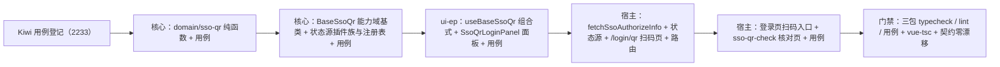

# 04 实施 · 扫码登录前端

> 认证与安全 · 05 登录前端 · 子任务 04（需求 05-4）· 实施记录

[文档首页](../../../../../../文档首页.md) › [05 登录前端](../../05_登录前端.md) › [04 扫码登录前端](../05_登录前端_04_扫码登录前端.md) › 实施记录　|　[详细设计](../设计/01_详细设计_04_扫码登录前端.md)

## 1. 实施信息 <a id="meta"></a>

| 项 | 值 |
| --- | --- |
| 任务 | [04 扫码登录前端](../05_登录前端_04_扫码登录前端.md) |
| 对应需求 | [05-4](../../../../需求/05_需求_登录前端.md#r05-4) |
| 详细设计 | [01 详细设计 · 扫码登录前端](../设计/01_详细设计_04_扫码登录前端.md) |
| 实施日期 | 2026-10-03 |
| 实施人 | minjian |
| 实施环境 | 开发机（Linux）· pnpm 工作区（`frontend/packages/{core,ui-ep}` + `frontend/apps/desktop`） |
| 提交 | 详见本次提交 |
| 结论 | 已完成 |

## 2. 实施概览 <a id="overview"></a>



结果小结：以**自渲染二维码 + 可插拔状态源**落地扫码登录——核心新增四态状态机（`BaseSsoQr` 能力域基类，沿 `BasePlaceholderState` 派生）与状态源插件族（`BaseSsoQrSource` + `SsoQrSourceRegistry`）；ui-ep 新增组合式 `useBaseSsoQr` 与展示件 `SsoQrLoginPanel`（四态渲染 + 多源切换 + 事件，经二维码件渲染二维码）；宿主新增 `/login/qr` 独立扫码页、宿主状态源（真实取授权 URL + 占位轮询）与登录页扫码入口。三包门禁全绿，设备本地用例合计新增 62 例（核心 37 + 件族 9 + 宿主 16）。

## 3. 实施过程 <a id="process"></a>

### 3.1 前置：Kiwi 用例登记 <a id="step-kiwi"></a>

按《[KiwiTCMS部署使用说明](../../../../../../资料/开发服务器/linux/KiwiTCMS部署使用说明.md)》「用例登记（脚本化批量）」节，经容器内 Django shell 登记 **1 条策展用例（编号 2233**，分类「平台骨架」/ P2 / `CONFIRMED` / 标签「自动化」），并在全部新增用例文件标注 `// kiwi_id: 2233`。

### 3.2 核心：领域纯函数 <a id="step-domain"></a>

- `packages/core/src/domain/sso-qr.ts`（新增）：四态与相位常量、可扫码类型（`wecom` / `dingtalk`）判定与过滤排序、指数退避 `nextSsoQrPollDelay`、终态判定 `isSsoQrTerminal`、相位文案 `resolveSsoQrStatusText`、契约归一 `normalizeSsoQrAuthorizeInfo` / `normalizeSsoQrPollResult`（未知状态回落 `pending`、非法 `redirect` 丢弃）。

### 3.3 核心：状态源插件族与能力域基类 <a id="step-capability"></a>

- `packages/core/src/capabilities/sso-qr-source.ts`（新增）：`SsoQrLoginSourceAdapter` 契约面 + `BaseSsoQrSource` 插件基类 + `SsoQrSourceProvider` / `SsoQrSourceRegistry`（与验证码数据源同构）。
- `packages/core/src/capabilities/sso-qr.ts`（新增）：`BaseSsoQr extends BasePlaceholderState`（能力键 `sso-qr`，依赖 `placeholder-state`）——四态状态机 / 授权 URL 取址 / 轮询与退避 / 连续失败转 `failed` / 到期自动重取一次 / 可见性暂停 / 相位订阅 / 释放；未注入状态源即占位零请求。
- `packages/core/src/capabilities/manifest.ts`：`CAPABILITY_MANIFEST` 增 `sso-qr: ['placeholder-state']`。
- `packages/core/src/index.ts`：具名导出新增 API 与类型。

### 3.4 ui-ep：组合式与面板 <a id="step-ui"></a>

- `packages/ui-ep/src/composables/useBaseSsoQr.ts`（新增）：把 `BaseSsoQr` 投影为 Vue 响应式面（同 `useBaseCaptcha` 口径，`onScopeDispose` 释放）。
- `packages/ui-ep/src/components/display/SsoQrLoginPanel.vue`（新增）：经二维码件渲染二维码 + 相位文案 + 多源切换 + 过期 / 失败 / 刷新 / 返回；`confirmed` 上抛（含可选 `redirect`）；可见性经 `utils/visibility` 单一落点接线；`data-test` 稳定落点。
- `packages/ui-ep/src/index.ts`：导出组件与组合式（含类型）。

### 3.5 宿主：端点 / 状态源 / 扫码页 / 入口 <a id="step-host"></a>

- `apps/desktop/src/api/identity.ts`：新增 `fetchSsoAuthorizeInfo(idpKey, tenant?)` 与 `SsoAuthorizeInfo` 类型别名（生成类型消费）。
- `apps/desktop/src/api/ssoQr.ts`（新增）：`createHttpSsoQrSource`——`init` 真实取授权 URL；`poll` 占位恒 `pending`（零请求、零副作用，后端无扫码状态端点）。
- `apps/desktop/src/router/index.ts`：新增 `/login/qr`（`name: 'QrLogin'`，`meta.public`）。
- `apps/desktop/src/views/QrLoginView.vue`（新增）：独立全屏页 + 品牌区 + 面板；可扫码入口过滤；确认带 `redirect` 顶层跳转、否则 `ensureReady()` + `resolveSafeRedirect` 安全回跳；返回保留回跳目标。
- `apps/desktop/src/views/LoginView.vue`：第三方入口区按需（存在可扫码 provider）新增「扫码登录」入口，跳 `/login/qr`（携带 `redirect`）。

### 3.6 核对页与用例 <a id="step-check"></a>

- `sso-qr-check.html` + `src/dev/ssoQrCheck.ts` + `src/dev/SsoQrCheck.vue`：四组 9 项自检（可扫码源过滤 / 退避与终态 / 契约归一 / 相位文案）。
- 用例：核心 `sso-qr-domain` / `sso-qr-capability` / `sso-qr-source`；件族 `sso-qr-panel`；宿主 `api-sso-authorize` / `sso-qr-source` / `sso-qr-view` / `sso-qr-check` 与 `login-view`（扩展扫码入口 2 例）。

### 3.7 关键命令 <a id="cmds"></a>

```bash
# 三包用例与门禁（bms 根）
pnpm --filter @bms/core run test && pnpm run core:typecheck && pnpm run core:lint
pnpm --filter @bms/ui-ep run test && pnpm run ui-ep:typecheck && pnpm run ui-ep:lint
pnpm --filter @bms/desktop run test && pnpm --filter @bms/desktop run lint
pnpm --filter @bms/desktop exec vue-tsc -b
pnpm run api-types:gen:check
```

## 4. 问题与处置 <a id="issues"></a>

| # | 问题 / 现象 | 原因 | 处置 |
| --- | --- | --- | --- |
| 1 | 「已扫待确认」态无真源 | 企微 / 钉钉均不对外暴露扫描态，且后端 `02_04` 冻结不做轮询状态机 | 状态机保留四态，`scanned` 由可注入状态源回报（夹具覆盖）；平台限制登记遗留（阶段十七） |
| 2 | 自渲染二维码无法让 PC 感知扫码结果 | 扫码后由手机端完成回调，PC 无状态可轮询 | 经三轮拍板落「自渲染二维码 + 可插拔状态源」：状态机 / 进离场全量真实，真实平台适配归阶段十七（换状态源实现即可） |
| 3 | `BaseSsoQr.init` 设置授权 URL 后界面不更新 | 初次 `init` 相位仍为 `pending`，`#setPhase` 因相位未变不广播 | `init` 赋值后显式 `#notifyUpdate()`（已修正，件族用例锁定） |
| 4 | 组件直用 `document` 触发「单一落点」护栏 | 组件内直触浏览器能力属违规 | 改经 `ui-ep/src/utils/visibility.ts` 的 `onVisibilityChange` 单一落点 |
| 5 | 面板切换控件取不到 provider 名称 | 组合式投影的 `providers` 为最小结构（无 `name`） | 面板内以 `selectScannableProviders(props.providers)` 自算带名称的切换清单 |
| 6 | `@mf-types/` 生成物致本地 `desktop lint` 失败 | 该目录已 gitignore 但未纳入 eslint ignore（**先存环境问题**，HEAD 上存在） | 本地删除生成物后 lint 通过；未改 eslint 配置（范围外），登记环境遗留 |

## 5. 验证结果 <a id="verify"></a>

| 验证项 | 方法 | 结果 |
| --- | --- | --- |
| 核心包 | `pnpm --filter @bms/core run test` / `core:typecheck` / `core:lint` | 103 文件 / **1261 passed**（新增 3 文件 37 例）；typecheck 与 lint 全绿 |
| 件族包 | `pnpm --filter @bms/ui-ep run test` / `ui-ep:typecheck` / `ui-ep:lint` | 63 文件 / **917 passed**（新增 1 文件 9 例）；typecheck 与 lint 全绿 |
| 宿主包 | `pnpm --filter @bms/desktop run test` / `lint` / `vue-tsc -b` | 35 文件 / **214 passed**（新增 4 文件 + 扩展登录页 2 例，共 16）；lint 与 `vue-tsc -b` 全绿 |
| 契约零漂移 | `pnpm run api-types:gen:check` | 9 份服务契约类型一致 |
| 核对页 | `sso-qr-check` 四组 9 项自检 | 全部通过（无失败项） |
| 预检 | `preflight --fast` | 本次改动相关项全绿；仅 `check-base` 4 项为 **HEAD 既有失败**（上一任务浏览器内核资料文档遗留，经 `git stash` 复核与本任务无关） |

## 6. 偏差与遗留 <a id="deviations"></a>

**偏差（已回写设计与相关登记）**：

1. **机制取舍**：平台不暴露「已扫」态 + 后端冻结轮询状态机 → 落「自渲染二维码 + 可插拔状态源」，四态 / 退避 / 过期重取 / 可见性全量真实、`scanned` 可注入（三轮逐项确认）。
2. **组件设计回写**：轮询编排由「随二维码件内聚」改「落扫码登录面板」，二维码件保持纯展示（《组件设计 · 二维码》§2 / §3.2 / §5 / §6）。
3. **布局设计补节**：登录页节点补「扫码登录独立页」（5.1）。
4. **宿主状态源 `poll` 占位**：恒 `pending`、零请求（后端无状态端点），真实联调归阶段十七。
5. **实施日期早于计划窗口**（提前实施），计划进度按计划值收口。

**遗留（归口）**：

| 事项 | 归口 |
| --- | --- |
| 真实平台适配（企微 `@wecom/jssdk` / 钉钉内嵌登录或后端状态端点）与真实企业凭据 E2E | 阶段十七 |
| 移动端内嵌 H5 免登 | 阶段十七 |
| 宿主国际化（提示 / 错误码文案取核心常量表） | 国际化阶段 |
| 多标签页会话协同 | 阶段十五 |
| `@mf-types` 生成物未纳入 eslint ignore（本地 lint 前需删除或补 ignore） | 环境遗留（登记） |

> 本文档依《[文档生成规范](../../../../../../规范/文档生成规范.md)》编写
