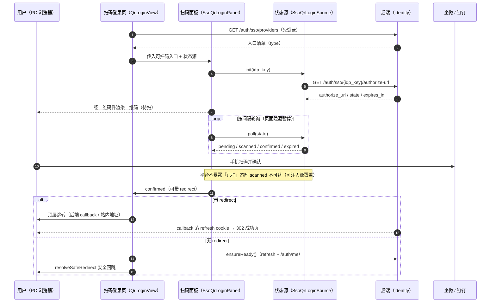
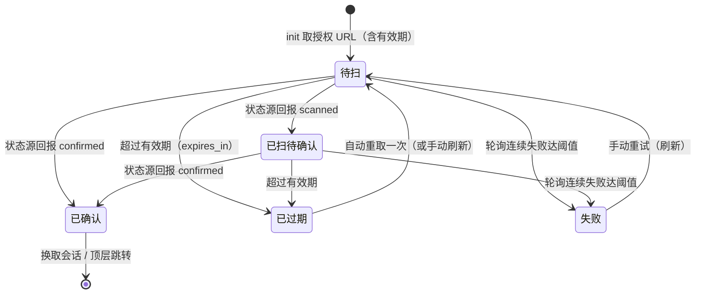
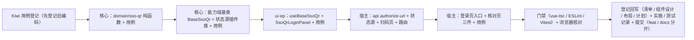

# 04 详细设计 · 扫码登录前端

> 认证与安全 · 05 登录前端 · 子任务 04（需求 05-4）· 详细设计

[文档首页](../../../../../../文档首页.md) › [05 登录前端](../../05_登录前端.md) › [04 扫码登录前端](../05_登录前端_04_扫码登录前端.md) › 详细设计　|　[需求 05-4](../../../../需求/05_需求_登录前端.md#r05-4)

## 1. 设计目标与范围 <a id="goal"></a>

把「扫码登录前端」落成**可插拔状态源驱动的四态状态机 + 独立扫码登录页**，接上已交付的 SSO 端点（域二 `02_04`）、契约类型（域六 `06_01`）、会话链路（`05_02`）与回跳口径（`05_03`）：

- **二维码与轮询（需求 05-4 第 1 条）**：经阶段四 `07_02` 二维码件渲染授权二维码（企微 / 钉钉），四态状态机（待扫 / 已扫待确认 / 已确认 / 过期）由**可插拔状态源** `SsoQrLoginSource` 驱动；过期自动重取一次、轮询指数退避、页面隐藏暂停。
- **换取会话（第 2 条）**：授权确认后按状态源给出的完成语义跳转 / 交还宿主——带 `redirect` 则顶层跳转，否则经 `stores/session.ensureReady()` 就绪后按核心 `resolveSafeRedirect` 安全回跳（复用 `05_02` / `05_03` 链路，不自行注册路由）。
- **状态机与体验（第 3 条）**：状态可视反馈（文案 + 二维码状态遮罩 + 刷新按钮）；页面不可见经可见性 API 暂停轮询。
- **联调口径（第 4 条）**：真实企业凭据未就绪，本期以**夹具 / 可注入源**覆盖状态机并登记遗留（同域 `02_04` 口径）；真实平台适配（内嵌组件 / 轮询真源）归**阶段十七**。
- **用例（第 5 条）**：四态状态机、过期重取、退避、确认换取会话、可扫码源过滤与多源切换。

**核心取舍（三轮逐项确认，见 §8.1）**：**自渲染二维码 + 可插拔状态源**。根因是平台契约限制——企微 / 钉钉**均不对外暴露「已扫待确认」态**，且自渲染二维码（仅把 `authorize_url` 画成二维码）扫码后由**手机端**完成回调，**PC 浏览器无状态可轮询**；后端 `02_04` 已明确**不做轮询状态机与会话旁路存储**（仅冻结 `authorize-url` / `callback` 契约）。故本期交付**可插拔、可测、可演进的扫码登录骨架**：状态机与体验全量真实，状态源接口预留，宿主默认实现「真实取授权 URL + 占位轮询（零请求）」；真实平台适配归阶段十七。

**不在本任务**：后端轮询状态机与会话旁路存储（`02_04` 已定不做）；真实平台内嵌登录组件接入与真实企业凭据联调（**阶段十七**）；移动端扫码登录（移动端工程，**阶段十七**）；宿主国际化（错误码 / 提示文案取核心常量表，**国际化阶段**）；多标签页协同（**阶段十五**）；本地账号密码登录（`05_01` 已交付）。

**安全影响（SDL）**：

- 二维码内容为后端下发的**授权 URL（含一次性 `state`）**，不含账号 / 口令 / token 明文；状态源占位实现**当场零请求**（不产生额外网络面）。
- `state` 一次性消费、短 TTL 由后端 `idp_state_store` 保证；前端**不缓存、不落任何持久化**（`localStorage` / `sessionStorage` / 日志均不写授权 URL 与 `state`）。
- 确认后的完成跳转**只经后端下发的 `redirect`（顶层跳转）或站内安全回跳**（核心 `resolveSafeRedirect`，拒绝开放重定向），前端不自拼外部地址。
- 页面隐藏暂停轮询，降低无谓请求与后台资源占用。

### 1.1 前置契约（已交付） <a id="contract-delivered"></a>

| 来源 | 契约 | 消费方式 |
| --- | --- | --- |
| 域二 `02_04`（2026-09-27） | `GET /auth/sso/providers` 按 `type`（`wecom` / `dingtalk`）区分入口；`GET /auth/sso/{idp_key}/authorize-url` 返回 `authorize_url` / `state` / `expires_in`；用户确认后回跳 `GET /auth/sso/{idp_key}/callback` 由后端完成换身份、JIT 与会话签发 | 扫码页取可扫码入口 → 取授权 URL 渲染二维码 → 确认后经 `callback` 落会话；**轮询状态机与换取会话由本任务按平台页面细化** |
| 域六 `06_01`（合并契约快照） | 认证端点全部进入 identity 公开契约快照 | 按 `@bms/api-types` 的 `identity` 命名空间生成类型消费（`SsoAuthorizeInfo` / `SsoProviderItem`），**不手写重复类型** |
| `05_02`（2026-10-02） | `stores/session.ensureReady()` 单例会话就绪；`api/identity.ts` 服务段寻址 | 确认后经 `ensureReady()` 就绪再放行 |
| `05_03`（2026-10-02） | 核心 `resolveSafeRedirect`（站内校验单一来源）；守卫默认开启、`/login` 子路径公开 | 回跳目标单一来源；扫码页无需改白名单即可公开 |

### 1.2 现状实测与缺口 <a id="gap"></a>

| # | 实测项 | 结论 |
| --- | --- | --- |
| 1 | `frontend/packages/ui-ep/src/components/display/QrCode.vue` | 已交付纯展示二维码件（`value` / `status` / `expiresIn` / 遮罩 + 刷新），**无轮询编排**（组件设计 §3.2 的 `pollable` 为预留语义，未实现） |
| 2 | 核心 `capabilities/` | **无扫码登录能力基类**；`CAPABILITY_MANIFEST` 无 `sso-qr` 键 |
| 3 | `api/identity.ts` | 已有 `fetchSsoProviders` / `ssoAuthorizeUrl`；**缺 `authorize-url` 端点封装**（现仅能构造 302 跳转地址，拿不到 JSON 授权 URL） |
| 4 | 宿主路由 | 仅 `/login`，**无扫码登录独立页**；`/login` 子路径经核心 `isPublicPath` 已放行（无需改白名单常量） |
| 5 | 后端 | 冻结 `authorize-url` / `callback`；**无任何「扫码状态」端点**，且平台不对外暴露「已扫」态（见 §1 核心取舍） |
| 6 | 组件设计 · 二维码（`设计/组件设计/07_展示类/13_组件设计_二维码/`） | §5 状态机（待扫 / 已扫待确认 / 已确认 / 过期 / 失败）与 §6 轮询语义存在，但「轮询随二维码件内聚」的口径与本设计（轮询编排落扫码面板）不一致，需回写 |
| 7 | 布局设计 · 登录页（`设计/布局设计/17_布局设计_登录页.html`） | §5 已预留「扫码登录」位置（「由扫码登录前端任务交付，本节点预留其位置」），**未描述独立扫码页**，需补节 |
| 8 | 错误码文案 | 企微 / 钉钉专用码 `20057`~`20062` 已在核心 `domain/auth-error.ts` 覆盖，扫码页可直接消费 |

## 2. 交付物清单 <a id="deliver"></a>

```text
frontend/packages/core/
├── src/domain/sso-qr.ts                         # 新：四态状态机 / 退避 / 文案 / 可扫码源过滤（纯函数）
├── src/capabilities/sso-qr-source.ts            # 新：BaseSsoQrSource 插件基类 + SsoQrSourceRegistry 注册表
├── src/capabilities/sso-qr.ts                   # 新：BaseSsoQr 能力域基类（状态机 / 轮询 / 退避 / 过期 / 可见性）
├── src/capabilities/manifest.ts                 # 改：CAPABILITY_MANIFEST 增 sso-qr（依赖 placeholder-state）
├── src/index.ts                                 # 改：导出新增能力 / 类型 / 常量
├── tests/sso-qr-domain.spec.ts                  # 新：纯函数用例
├── tests/sso-qr-capability.spec.ts              # 新：能力基类用例（占位零请求 / 四态 / 退避 / 过期重取 / 可见性）
└── tests/sso-qr-source.spec.ts                  # 新：插件族与注册表用例

frontend/packages/ui-ep/
├── src/composables/useBaseSsoQr.ts              # 新：BaseSsoQr 的 Vue 组合式投影（同 useBaseCaptcha 口径）
├── src/components/display/SsoQrLoginPanel.vue   # 新：扫码登录面板（二维码 + 四态展示 + 多源切换 + 事件）
├── src/index.ts                                 # 改：导出新增组合式与组件（含类型）
└── tests/sso-qr-panel.spec.ts                   # 新：面板用例（四态渲染 / 切换 / 事件 / 复用二维码件）

frontend/apps/desktop/
├── src/api/identity.ts                          # 改：增 fetchSsoAuthorizeInfo 与 SsoAuthorizeInfo 类型别名
├── src/api/ssoQr.ts                             # 新：宿主状态源实现（真实取授权 URL + 占位轮询零请求）
├── src/views/QrLoginView.vue                    # 新：扫码登录独立页（品牌区 + 面板 + 回跳 / 返回）
├── src/views/LoginView.vue                      # 改：第三方入口区按需加「扫码登录」入口
├── src/router/index.ts                          # 改：增 /login/qr 路由（meta.public）
├── src/dev/SsoQrCheck.vue                       # 新：扫码核对页（自检上屏）
├── src/dev/ssoQrCheck.ts                        # 新：核对页入口
├── sso-qr-check.html                            # 新：核对页多页入口（不进构建产物）
├── tests/api-sso-authorize.spec.ts              # 新：authorize-url 封装寻址与参数
├── tests/sso-qr-source.spec.ts                  # 新：宿主状态源（真实取角 / 占位轮询）
├── tests/sso-qr-view.spec.ts                    # 新：扫码页（过滤 / 完成 / 回跳 / 空态 / 返回）
└── tests/sso-qr-check.spec.ts                   # 新：核对页自检全通过

bms文档/
├── 前端基类清单.md                              # 改：§2 增 BaseSsoQr / BaseSsoQrSource / SsoQrSourceRegistry；§5 增 useBaseSsoQr / SsoQrLoginPanel；§9 宿主横切底座补扫码页与状态源
├── 设计/组件设计/07_展示类/13_组件设计_二维码/  # 改：轮询编排归属回写（二维码件保持纯展示，轮询落扫码面板）
├── 设计/布局设计/17_布局设计_登录页.html         # 改：补「扫码登录独立页」一节
├── 项目/06_认证与安全/任务/05_登录前端/…        # 改：父任务清单 + 本任务状态（设计 / 实施 / 测试记录随开工建立）
├── 项目/06_认证与安全/需求/05_需求_登录前端.md   # 改：如口径微调则注块（默认不改）
└── 项目/06_认证与安全/计划/01_计划_认证与安全.md # 改：进度唯一落点（状态 / 完成日期 / 偏差与遗留）

> 目录树为罗列型内容，按《[文档生成规范](../../../../../../规范/文档生成规范.md)》用目录清单（非 mermaid）。
```

## 3. 设计与边界 <a id="design"></a>

### 3.1 扫码登录整体流程 <a id="flow"></a>



- **两条完成路径**：带 `redirect`（后端 `callback` 地址或站内地址）由状态源给出、宿主顶层跳转；不带则宿主 `ensureReady()` 就绪后安全回跳——覆盖「平台内嵌组件回传 `code`（需拼 callback）」与「已落会话直接回跳」两种阶段十七形态（见 §3.4）。
- **可扫码入口**：仅 `type` 属 `wecom` / `dingtalk` 的入口进入扫码页；其余（`oidc` / `cas`）沿用 `05_01` 的 302 跳转入口。

### 3.2 状态机与领域纯函数 <a id="domain"></a>

核心 `domain/sso-qr.ts`（框架无关、纯数据、零依赖，跨端复用）：



```text
domain/sso-qr.ts
├── 常量
│   ├── SSO_QR_STATUSES = ['pending', 'scanned', 'confirmed', 'expired']
│   ├── SSO_QR_PHASES   = [...SSO_QR_STATUSES, 'failed']
│   ├── SSO_QR_IDP_TYPES = ['wecom', 'dingtalk']      # 可扫码身份源类型
│   ├── SSO_QR_POLL_BASE = 2000                        # 轮询基数（ms）
│   ├── SSO_QR_POLL_MAX = 30000                        # 退避上限（ms）
│   ├── SSO_QR_MAX_FAILURES = 5                        # 连续失败阈值（转 failed）
│   └── SSO_QR_* 文案常量（标题 / 待扫 / 已扫 / 已确认 / 过期 / 刷新 / 失败 / 空态 / 返回）
├── type SsoQrStatus = 'pending' | 'scanned' | 'confirmed' | 'expired'
├── type SsoQrPhase  = SsoQrStatus | 'failed'
├── interface SsoQrAuthorizeInfo { authorizeUrl: string; state: string; expiresIn: number }
├── interface SsoQrPollResult   { status: SsoQrStatus; redirect?: string }
├── isScannableIdpType(type): boolean
├── selectScannableProviders<T>(providers): T[]        # 过滤 type∈可扫码 + 按 sort 升序（结构泛型，不绑定契约类型）
├── nextSsoQrPollDelay(attempt, base?, max?): number    # 指数退避（Math.min(base*2^(attempt-1), max)）
├── isSsoQrTerminal(phase): boolean                     # confirmed / expired / failed
├── resolveSsoQrStatusText(phase): string               # 文案映射
└── normalizeSsoQrPollResult(raw): SsoQrPollResult      # 安全归一（非法值回落 pending，redirect 仅接受字符串）
```

- **`scanned` 可注入不可观测**：平台不对外暴露「已扫待确认」，故该态**只由可注入状态源回报**（本期夹具覆盖）；真实平台若不暴露，登记为平台限制遗留（§7）。
- **退避**：与 `BaseAsyncTask.nextPollDelay` 同口径（指数退避、封顶 30s）；成功回报后 `attempt` 复位。
- **归一防臆造**：`normalizeSsoQrPollResult` 对未知状态回落 `pending`、`redirect` 非字符串即丢弃，防止脏数据驱动错误跳转。

### 3.3 能力域基类 `BaseSsoQr` <a id="capability"></a>

核心 `capabilities/sso-qr.ts`，沿固定主干派生：

```text
BaseObject → BaseFrameworkObject → BaseCapability → BasePluggable → BaseComponent
  → BasePlaceholderState → BaseSsoQr（能力域基类 · 能力键 sso-qr）
```

同构参照：`BaseNotificationCenter` / `BaseGlobalSearch`（编排型能力域基类、注入式数据源、未注入即占位零请求）。

```text
BaseSsoQr（abstract, extends BasePlaceholderState）
├── identifier = 'sso-qr'
├── phase: SsoQrPhase = 'pending'
├── providers: SsoQrProviderRef[]                      # 可扫码入口（已过滤 / 排序）
├── activeIdpKey: string | null
├── source?: SsoQrLoginSourceAdapter                   # 未注入 → degraded（占位零请求）
├── authorizeUrl / state / expiresIn / remaining
├── failures / attempt / autoRefreshed
├── setProviders / setActiveProvider / setSource / setOptions({ pollBase, pollMax, maxFailures, pauseWhenHidden })
├── async init()                                        # 取授权 URL → phase pending → 起过期计时 + 起轮询
├── async pollOnce()                                    # 一次轮询 → 应用结果 / 累计失败 / 退避
├── refresh()                                           # 重置并重新 init（手动 / 自动各一次）
├── pause() / resume()                                  # 可见性暂停 / 恢复
├── onPhaseChange(listener): () => void                 # 相位变化订阅（组合式桥接）
└── dispose()                                           # 清定时器 / 停轮询（幂等）
```

- **占位语义**：未注入 `source` 时 `degraded === true`、**零请求**（`requestCount` 恒 0）；组件层按占位降级呈现（与验证码 / 通知中心同口径）。
- **过期与自动重取**：`expires_in` 倒计时到点置 `expired`、停轮询；**自动重取一次**（重置退避并重新 `init`），再次到期仅遮罩 + 手动刷新（防无限请求）。
- **终态停轮询**：`confirmed` / `expired` / `failed` 均停止轮询（`isSsoQrTerminal`）。
- **释放**：`dispose()` 清理过期计时器与轮询计时器，幂等；组件卸载时调用。
- **框架无关**：仅用环境级定时器（`setTimeout` / `clearTimeout`，与 `BaseAsyncTask` / `BaseCaptcha` 同口径），不触 Vue / DOM。

### 3.4 状态源插件族与注册表 <a id="source"></a>

核心 `capabilities/sso-qr-source.ts`（纵向可替换，与验证码数据源同构）：

```text
SsoQrLoginSourceAdapter（契约面；方法均为可选，未覆写即不请求）
├── init?(query: SsoQrInitQuery): Promise<unknown>     # → { authorize_url, state, expires_in }
└── poll?(query: SsoQrPollQuery): Promise<unknown>     # → { status, redirect? }

interface SsoQrInitQuery { idpKey: string; tenant?: string | null }
interface SsoQrPollQuery { idpKey: string; tenant?: string | null; state: string; attempt: number }

BaseSsoQrSource（插件基类, extends BasePluggable, identifier = 'sso-qr-source'）
SsoQrSourceRegistry（注册表, extends BaseProviderRegistry）   # 内建 / 定制实现登记接入
```

- **`confirmed` 完成语义（已定 `{ status, redirect? }`）**：状态源可在 `confirmed` 时给出 `redirect`（后端 `callback` 地址或站内地址），由宿主顶层跳转；未给出则宿主 `ensureReady()` + 安全回跳。这样状态源是**唯一知道平台细节**的地方，宿主与面板只消费统一结果——阶段十七接入平台内嵌组件时，只需换一个状态源实现（把组件回传的 `code` / `state` 拼成 `redirect` 或直接回报 `pending`），无需改面板与状态机。
- **未登记 / 未注入即占位**：无源时不发请求（能力层 `degraded`）。

### 3.5 ui-ep 组合式与面板组件契约 <a id="ui"></a>

**组合式** `ui-ep/src/composables/useBaseSsoQr.ts`（同 `useBaseCaptcha` 口径）：把 `BaseSsoQr` 投影为 Vue 响应式面——`ref`（`phase` / `authorizeUrl` / `statusText` / `remaining` / `degraded`）与 `computed`（`currentProvider` / `qrStatus`（相位 → `QrStatus` 映射））与动作（`init` / `refresh` / `pause` / `resume` / `setActiveProvider`），并在 `onScopeDispose` 调 `dispose()`。

**面板组件** `ui-ep/src/components/display/SsoQrLoginPanel.vue`（与二维码同族）：

| 项 | 契约 |
| --- | --- |
| props | `providers`（原始入口清单，面板内过滤可扫码并按 `sort` 排序）/ `activeIdpKey?` / `source?` / `pollInterval?`（2000）/ `backoffMax?`（30000）/ `maxFailures?`（5）/ `pauseWhenHidden?`（true）/ `ready?` / `title?` / `tips?` |
| emits | `confirmed: [{ redirect?: string }]` / `expired: []` / `failed: [{ reason: string; failures: number }]` / `switch: [idpKey: string]` / `refresh: []` / `back: []` |
| slots | `header`（标题区）/ `tip`（提示追加）/ `expired`（过期遮罩内容，透传二维码件）/ `empty`（无可扫码入口空态）/ `footer`（底部操作） |

- **渲染**：复用 `QrCode` 件（`value=authorizeUrl`、`status=qrStatus`、`:expires-in`、`refreshable`；`pending→active` / `scanned→scanning` / `confirmed→confirmed` / `expired→expired` / `failed→failed`），外加相位文案（`resolveSsoQrStatusText`）；**面板层编排轮询**（二维码件保持纯展示，§1.2 第 6 项回写）。
- **多源切换**：`selectScannableProviders` 后 >1 时渲染切换控件（标签 / 分段），切换 emit `switch` 并重 `init`；`=0` 渲染 `empty` 插槽（缺省「当前租户未配置可扫码登录方式」）；`=1` 直接展示。
- **可见性暂停**：组件在 `document.visibilitychange` 时调 `pause()` / `resume()`（`pauseWhenHidden=false` 时不接）。
- **终态**：`confirmed` emit 后由宿主处理；`expired` / `failed` 显示遮罩 + 刷新按钮（emit `refresh`，内部已自动重取一次）。
- **降级呈现**：`source` 未注入或 `ready=false` 时按占位降级（与件族同口径），不发请求。
- **命名与复用**：`data-test` 稳定落点（`sso-qr-panel` / `sso-qr-tip` / `sso-qr-switch` / `sso-qr-back` 等）；按钮复用 Element Plus（业务侧禁裸原生交互件护栏 `tests/guard-library-components.spec.ts` 适用）。

### 3.6 宿主扫码页与路由 <a id="view"></a>

`apps/desktop/src/views/QrLoginView.vue` + 路由（`router/index.ts` 增 `/login/qr`，`name: 'QrLogin'`，`meta: { title: '扫码登录', public: true }`）：

```text
QrLoginView（独立全屏页 + 居中卡片，按《布局设计 · 登录页》「扫码登录独立页」节）
├── 品牌区（Logo + 系统名称，与登录页同源）
├── 面板区：SsoQrLoginPanel（providers 取 fetchSsoProviders 过滤；source = 宿主状态源）
│   ├── 否则空态 + 「返回账号登录」
│   └── events
│       ├── confirmed → 有 redirect 则 redirectTo(redirect)；否则 ensureReady() → router.push(resolveSafeRedirect(route.query.redirect))
│       ├── back      → router.push({ path: '/login', query: route.query })（保留回跳目标）
│       ├── refresh / expired / failed → 面板内自处理（刷新 / 提示），可选记遥测
│       └── switch → 宿主记录当前 idpKey（用于重进保持）
└── 底部：返回账号登录入口（次要链接）
```

- **公开性**：`/login/qr` 为 `/login` 子路径，核心 `isPublicPath` 已放行；额外声明 `meta.public = true` 显式化（生产零成本）。
- **回跳继承**：从登录页进入时携带 `route.query.redirect`，扫码页在完成 / 返回时沿用，保证「未登录受保护路由 → 登录页 → 扫码页 → 确认」整链回跳正确。
- **不自行注册路由 / 不自行处理回跳**：菜单动态路由随会话状态装载（`05_03`），回跳经核心 `resolveSafeRedirect`（单一来源）。

### 3.7 登录页入口 <a id="entry"></a>

`LoginView.vue` 第三方入口区**按需新增**「扫码登录」入口：

- 仅当 `loadSsoProviders()` 结果含 `type ∈ {wecom, dingtalk}` 时渲染（`selectScannableProviders` 非空即显示）；无可扫码入口时整块不渲染（与 SSO 入口「不可用即隐藏」同口径）。
- 点击 `router.push({ path: '/login/qr', query: route.query })`（携带 `redirect`）。
- 不改变既有 SSO（`oidc` / `cas`）入口与本地登录行为。

### 3.8 宿主状态源实现（真实取角 + 占位轮询） <a id="host-source"></a>

`api/identity.ts` 增 `fetchSsoAuthorizeInfo(idpKey, tenant?)`（`GET /auth/sso/{idp_key}/authorize-url`，经服务段寻址 + `SsoAuthorizeInfo` 生成类型）；`api/ssoQr.ts` 新增宿主状态源：

```text
createHttpSsoQrSource(options): SsoQrLoginSourceAdapter
├── init({ idpKey, tenant }) → fetchSsoAuthorizeInfo → { authorize_url, state, expires_in }
└── poll({ idpKey, tenant, state }) → { status: 'pending' }      # 占位：后端无扫码状态端点，恒待扫、零副作用
```

- **占位语义成文**：`poll` 恒 `pending`（不请求、不臆造状态）；四态流转由**可注入状态源 / 测试夹具**覆盖。真实平台适配（企微 `@wecom/jssdk` 内嵌登录组件 / 钉钉内嵌登录，或后端补状态端点）归**阶段十七**，届时仅替换本实现。
- **可插拔登记**：宿主实现可经 `SsoQrSourceRegistry` 登记（默认实现 + 定制实现）；本期宿主直接注入实例，注册表作为二开 / 多实现通道就位。

### 3.9 失败分支与边界 <a id="failures"></a>

| 场景 | 处理 |
| --- | --- |
| 无可扫码入口（清单空 / 无 wecom·dingtalk） | 扫码页空态 + 返回账号登录；登录页不渲染扫码入口 |
| `authorize-url` 失败（20051 / 20057 / 20060 / 10005 等） | 状态转 `failed`，按核心文案表提示（`resolveAuthErrorText`），提供刷新重试 |
| 轮询单次失败 | `failures += 1`、按退避继续；**不立即失败** |
| 轮询连续失败达 5 次 | 转 `failed`、停轮询；提示 + 刷新按钮 |
| 二维码到期 | 转 `expired`、停轮询；**自动重取一次**（重置退避重新 `init`）；再次到期仅遮罩 + 手动刷新 |
| 页面不可见 | `pause()` 停轮询与过期计时；恢复可见时 `resume()`（剩余有效期折算） |
| `confirmed` 带 `redirect` | 宿主顶层跳转（`redirectTo`） |
| `confirmed` 无 `redirect` | `ensureReady()` 就绪 → `resolveSafeRedirect(route.query.redirect)` 安全回跳；无 / 非法目标回首页 |
| 已登录访问 `/login/qr` | 由守卫按公开页规则处理（已登录进公开页不拦，用户可自行返回；如需强制回跳由守卫统一口径，本页不自处理） |
| 组件卸载 / 离开页面 | `dispose()` 清理全部定时器与订阅（幂等） |
| `source` 未注入 / `ready=false` | 占位降级、零请求（不静默放行） |

## 4. 兼容性与消费方影响 <a id="compat"></a>

- **二维码件零改动**：`QrCode.vue` 保持纯展示契约（`value` / `status` / `expiresIn` / `refresh`）；轮询编排落新面板 —— **回写**《[组件设计 · 二维码](../../../../../../设计/组件设计/07_展示类/13_组件设计_二维码/13_组件设计_二维码.md)》§2 / §3.2 / §5 / §6 的相关表述（「轮询随二维码件内聚」→「轮询编排落扫码登录面板」），二维码件仍承载状态展示与过期遮罩。
- **核心新增**：`domain/sso-qr.ts` / `capabilities/sso-qr.ts` / `capabilities/sso-qr-source.ts` 为纯新增；`CAPABILITY_MANIFEST` 增 `sso-qr` 键；`index.ts` 具名导出，不改既有导出语义。
- **ui-ep 新增**：`useBaseSsoQr` / `SsoQrLoginPanel` 具名导出，不影响既有件。
- **宿主接口扩展**：`api/identity.ts` 新增一函数 + 一类型别名；`LoginView.vue` 第三方入口区按需增入口（不影响既有 SSO / 本地登录）；`router/index.ts` 新增一公开路由。
- **消费方**：`05_04` 为「扫码登录」的最终交付；后续（阶段十七）真实平台适配只需替换状态源实现，面板 / 状态机 / 宿主页零改动 —— 接口隔离已备好。

## 5. 测试设计与验收映射 <a id="test"></a>

用例**先登记 Kiwi TCMS 再编码**（新登记 1 条策展用例，分类「平台骨架」/ P2 / `CONFIRMED` / 标签「自动化」；编号以平台回读为准并回填本记录与代码标注）。

| # | 用例 / 文件 | 类型 | 断言要点 |
| --- | --- | --- | --- |
| 1 | `packages/core/tests/sso-qr-domain.spec.ts` | 单元 | `isScannableIdpType` / `selectScannableProviders`（过滤 + `sort` 升序）；`nextSsoQrPollDelay` 指数退避与封顶（2s→4s→…→30s）；`isSsoQrTerminal`；`resolveSsoQrStatusText` 逐相位；`normalizeSsoQrPollResult` 未知状态回落 `pending`、非法 `redirect` 丢弃 |
| 2 | `packages/core/tests/sso-qr-capability.spec.ts` | 单元 | 未注入 `source` → `degraded` 且 `requestCount === 0`（占位零请求）；`init` 取授权 URL 后 `phase=pending` |
| 3 | 同上 | 单元 | 四态流转：`poll` 回报 `scanned` / `confirmed` / `expired` 逐相位更新；`confirmed` 携 `redirect` 透出 |
| 4 | 同上 | 单元 | 退避：连续失败按 2s / 4s / … / 30s 递增（fake timers）；成功回报后 `attempt` 复位 |
| 5 | 同上 | 单元 | 连续失败 5 次 → `failed` 且停轮询；不再发轮询 |
| 6 | 同上 | 单元 | 到期 → `expired` 停轮询 → **自动重取一次**（重新 `init`）；再次到期无自动重取 |
| 7 | 同上 | 单元 | `pause()` / `resume()`：不可见期不发轮询、恢复后继续；`dispose()` 清定时器且幂等 |
| 8 | `packages/core/tests/sso-qr-source.spec.ts` | 单元 | `BaseSsoQrSource` 插件契约；`SsoQrSourceRegistry` 登记 / 解析 / 未登记回落占位（不请求） |
| 9 | `packages/ui-ep/tests/sso-qr-panel.spec.ts` | 单元 | 四态渲染：文案 + `QrCode` `status` 映射（`active` / `scanning` / `confirmed` / `expired` / `failed`）；复用二维码件（无自绘二维码） |
| 10 | 同上 | 单元 | 多源：>1 渲染切换控件且切换 emit `switch` 并重 `init`；`=0` 渲染空态插槽；`=1` 直接展示 |
| 11 | 同上 | 单元 | 事件：`confirmed`（含 `redirect`）/ `expired` / `failed` / `refresh` / `back` 上抛；`pauseWhenHidden` 控制可见性接线 |
| 12 | `apps/desktop/tests/api-sso-authorize.spec.ts` | 单元 | `fetchSsoAuthorizeInfo` 经 `/api/identity/v1/auth/sso/{idp_key}/authorize-url`（带 `tenant` 查询参数、`encodeURIComponent`） |
| 13 | `apps/desktop/tests/sso-qr-source.spec.ts` | 单元 | 宿主源 `init` 真实取角（映射 `authorize_url` / `state` / `expires_in`）；`poll` 恒 `pending` 且零副作用 |
| 14 | `apps/desktop/tests/sso-qr-view.spec.ts` | 单元 | 路由可达 + 过滤可扫码源；`confirmed` 带 `redirect` → 顶层跳转；无 `redirect` → `ensureReady` 后 `resolveSafeRedirect`；回跳继承 `route.query.redirect`；空态 + `back` 回登录页保留 `query` |
| 15 | `apps/desktop/tests/login-view.spec.ts`（扩展） | 单元 | 存在可扫码 provider 时渲染「扫码登录」入口并跳 `/login/qr`；无则不渲染（既有断言回归） |
| 16 | `apps/desktop/tests/sso-qr-check.spec.ts` | 单元 | 宿主核对页自检全部通过（无失败项） |
| 17 | `packages/core` + `ui-ep` + `apps/desktop` 既有全部用例 | 回归 | 核心 / 件族 / 宿主既有用例全绿（含 `vue-tsc` / ESLint） |

**验收映射**：需求 05-4「四态状态机均可用（含过期刷新与退避）」→ 用例 1 / 3 / 4 / 6 / 9；「授权确认后成功换取会话进入系统」→ 用例 3 / 14；「真实凭据未就绪时状态机用例全绿且遗留登记」→ 用例 2 / 7 / 13 + 遗留（§7）；「`vue-tsc`、ESLint、Vitest 全通过」→ 用例 17 + 门禁命令（§9）。

**执行范围**：只跑受变更影响的定向用例（`packages/core` 新增用例 + `packages/ui-ep` 新增用例 + `apps/desktop` 全部用例），不跑全量前端工作区（口径见《[AI开发规范](../../../../../../规范/AI开发规范.md)》）。

## 6. 登记落点 <a id="registry"></a>

| 内容 | 落点 |
| --- | --- |
| `BaseSsoQr` / `BaseSsoQrSource` / `SsoQrSourceRegistry` 身份、父基类、落点 | 《[前端基类清单](../../../../../../前端基类清单.md)》§2（能力域基类 / 插件基类） |
| `useBaseSsoQr` / `SsoQrLoginPanel` 落点 | 《[前端基类清单](../../../../../../前端基类清单.md)》§5（PC 插件 · 展示类） |
| 宿主扫码页 / 路由 / 状态源 / authorize-url 封装 | 《[前端基类清单](../../../../../../前端基类清单.md)》§9「宿主横切底座」 |
| 二维码轮询编排归属（二维码件纯展示、轮询落扫码面板） | 《[组件设计 · 二维码](../../../../../../设计/组件设计/07_展示类/13_组件设计_二维码/13_组件设计_二维码.md)》§2 / §3.2 / §5 / §6 |
| 扫码登录独立页布局 | 《[布局设计 · 登录页](../../../../../../设计/布局设计/17_布局设计_登录页.html)》「扫码登录独立页」节 |
| 阶段计划：`05_04` 条目与进度（状态 / 完成日期 / 偏差与遗留） | 阶段计划表（进度唯一落点） |
| Kiwi TCMS / 测试资产仓 | 登记本任务用例并回读编号 |
| 实施 / 测试记录 | 本目录 `实施/`、`测试/` |

## 7. 边界与开放项 <a id="boundary"></a>

- **真实平台适配（阶段十七）**：企微 `@wecom/jssdk` 内嵌登录组件 / 钉钉内嵌登录（或后端补扫码状态端点）——届时新增一个 `SsoQrLoginSource` 实现，面板 / 状态机 / 宿主页零改动；企业真实凭据联调同批（同域 `02_04` 口径）。**内网外网 CDN 受限**，届时 SDK 需自托管（口径已识别，见 `05_01` 实施记录 §3.9）。
- **「已扫待确认」平台不暴露**：该态**只由可注入状态源回报**；真实平台若不暴露，扫码页该态不可达（登记为平台限制），不影响其余三态。
- **扫码入口仅 PC**：移动端扫码登录（内嵌 H5 免登）归移动端工程（阶段十七）。
- **国际化**：提示 / 错误码文案取核心常量表（`05_02` / `05_01` 已登记），接入语言能力后转缺省语言包（签名不变）。
- **多标签页**：扫码会话的跨标签同步归阶段十五（`05_02` 单标签口径）。
- **扫码页遥测**：本期不新增上报通道（如需守卫 / 面板决策观测，后续按核心 `ModuleTelemetry` 口径并入，不另起通路）。
- **二维码件 `pollable` 预留语义**：本设计不实现（轮询落面板），组件设计节点同步回写；若后续判定需件内轮询，再评估。

## 8. 对齐记录 <a id="align"></a>

### 8.1 本轮拍板（2026-10-03，逐项确认） <a id="align-new"></a>

| # | 事项 | 结论 |
| --- | --- | --- |
| 1 | **扫码状态获取机制（核心）** | **自渲染二维码 + 可插拔状态源**：二维码件渲染 `authorize-url`，四态状态机由 `SsoQrLoginSource` 驱动（本期夹具 / 占位、零外部依赖、可测）；真实平台适配归阶段十七 |
| 2 | 前端落点 | **ui-ep 通用件**（`SsoQrLoginPanel`）+ 宿主扫码页 |
| 3 | 扫码入口形态 | **独立扫码登录路由页** `/login/qr` |
| 4 | 四态口径 | **保留四态，「已扫待确认」可注入**（平台不暴露时为平台限制遗留） |
| 5 | 平台 SDK / 联调 | **本期不引入平台 SDK**；真实联调归阶段十七 |
| 6 | 轮询参数 | **2s 起、指数退避至 30s、连续失败 5 次转 failed** |
| 7 | Kiwi 用例 | **1 条策展用例**（平台骨架 / P2 / CONFIRMED / 自动化） |
| 8 | 分层落点 | **全量能力域基类 `BaseSsoQr`**（含 `domain/sso-qr.ts` 纯函数 + `ui-ep` 组合式 + 组件） |
| 9 | 组件族 | `ui-ep/src/components/display/`（与二维码同族） |
| 10 | 路由路径 | `/login/qr`（复用 `/login` 子路径公开规则，`meta.public` 显式化） |
| 11 | 登录页入口 | 第三方入口区，**条件显示**（含可扫码 provider 才渲染） |
| 12 | 状态源形态 | **接口 + 真实取角 + 占位轮询**；**完整插件族 + 注册表**（`BaseSsoQrSource` / `SsoQrSourceRegistry`） |
| 13 | 轮询结果契约 | `{ status, redirect? }`（`confirmed` 带 `redirect` 则顶层跳转，否则 `ensureReady` + 安全回跳） |
| 14 | 面板契约 | **完整契约**（props / emits / slots，见 §3.5） |
| 15 | 过期重取 | **自动重取一次**（再次到期手动刷新） |
| 16 | 布局与回写 | **补《布局设计 · 登录页》「扫码登录独立页」节** + 回写《前端基类清单》《组件设计 · 二维码》+ 计划 |
| 17 | 二维码件 | **不扩展**（保持纯展示），轮询编排落扫码面板 |
| 18 | 开发核对页 | **新增** `sso-qr-check`（四态 / 退避 / 过期重取 / 可见性 / 多源） |
| 19 | 多 IdP | **过滤可扫码源 + 多源切换**；空清单空态 + 返回 |

### 8.2 复用既有口径 <a id="align-reuse"></a>

| # | 事项 | 结论 |
| --- | --- | --- |
| 1 | 服务段寻址与契约类型 | `apiUrl` + `@bms/api-types` 的 `identity` 命名空间（`05_02` / `06_01`），不手写类型 |
| 2 | 会话链路 | `stores/session.ensureReady()`（`05_02` / `05_03`），扫码页不改其语义、不自行注册路由 |
| 3 | 回跳 | 核心 `resolveSafeRedirect`（`05_03`），不自写路径校验 |
| 4 | 二维码件 | `ui-ep QrCode`（`07_02`），仅消费其展示契约 |
| 5 | 能力基类同构 | `BasePlaceholderState` 占位零请求语义 + `BaseAsyncTask` 退避口径 + `BaseNotificationCenter` 编排风格 |
| 6 | 数据源插件化 | 与 `BaseCaptchaSource` / `CaptchaSourceRegistry` 同构（`BasePluggable` + `BaseProviderRegistry`） |
| 7 | 提示 / 文案 | 核心 `domain/auth-error.ts` 文案表（`05_01`）；宿主 `utils/feedback.ts` 提示通道 |
| 8 | 命名与文档 | 遵《[命名规范](../../../../../../规范/命名规范.md)》《[前端开发规范](../../../../../../规范/前端开发规范.md)》，文档遵《[文档生成规范](../../../../../../规范/文档生成规范.md)》 |

## 9. 实施步骤与关键命令 <a id="steps"></a>



1. 读《[KiwiTCMS部署使用说明](../../../../../../资料/开发服务器/linux/KiwiTCMS部署使用说明.md)》「用例约定」节，登记本任务用例并**回读编号**。
2. 核心：`domain/sso-qr.ts` + `capabilities/sso-qr.ts` + `capabilities/sso-qr-source.ts` + `manifest.ts` + `index.ts` 导出 + 三份用例。
3. ui-ep：`composables/useBaseSsoQr.ts` + `components/display/SsoQrLoginPanel.vue` + `index.ts` 导出 + 面板用例。
4. 宿主：`api/identity.ts`（`fetchSsoAuthorizeInfo`）+ `api/ssoQr.ts`（宿主状态源）+ `views/QrLoginView.vue` + `router/index.ts`（`/login/qr`）+ 用例。
5. 宿主：`LoginView.vue` 扫码入口 + 核对页三件（`sso-qr-check.html` / `ssoQrCheck.ts` / `SsoQrCheck.vue`）+ 用例。
6. 门禁与回归（§5 用例 17 + 下列命令）→ 登记回写（《前端基类清单》《组件设计 · 二维码》《布局设计 · 登录页》、需求 / 任务 / 计划）+ 实施 / 测试记录 + 代码与文档分开提交（`feat` / `docs`）。
7. 浏览器核对（Playwright + Chrome，`05_01` §3.9 口径）：核对页自检通过 + 真实应用 `/login/qr` 渲染（无可用 provider 时空态；夹具源下四态可视）。

关键命令：

```bash
# 前端（bms 根）
pnpm --filter @bms/core run test && pnpm run core:typecheck && pnpm run core:lint
pnpm --filter @bms/ui-ep run test && pnpm run ui-ep:typecheck && pnpm run ui-ep:lint
pnpm --filter @bms/desktop run test && pnpm --filter @bms/desktop run lint
pnpm --filter @bms/desktop exec vue-tsc -b
pnpm run api-types:gen:check
# 仓库根（bms）
python3 scripts/tools/base-check/check-base.py
python3 scripts/tools/preflight/check-preflight.py --fast
```

## 10. 参考文档 <a id="ref"></a>

- [需求 05-4](../../../../需求/05_需求_登录前端.md#r05-4)
- [05_01 登录页真实实现](../../05_登录前端_01_登录页真实实现/05_登录前端_01_登录页真实实现.md)（SSO 入口 / 错误码文案 / UI 件复用与样式口径）
- [05_02 token 与 401 静默刷新接线](../../05_登录前端_02_token与401静默刷新接线/05_登录前端_02_token与401静默刷新接线.md)（`ensureReady` 会话就绪）
- [05_03 路由守卫默认开启与登录回跳](../../05_登录前端_03_路由守卫默认开启与登录回跳/05_登录前端_03_路由守卫默认开启与登录回跳.md)（公开页 / `resolveSafeRedirect`）
- 阶段四 [07_02 轻量展示件](../../../../../04_前端组件库/任务/07_展示类/07_展示类_02_轻量展示件/07_展示类_02_轻量展示件.md)（二维码件与遗留口径）
- 阶段六 [02_04 企业微信 / 钉钉免登适配](../../../02_SSO与身份联邦/02_SSO与身份联邦_04_企业微信钉钉免登适配/02_SSO与身份联邦_04_企业微信钉钉免登适配.md)（`authorize-url` / `callback` 契约）
- 《[概要设计 · 身份认证SSO](../../../../../../设计/概要设计/26_概要设计_身份认证SSO.md)》、《[组件设计 · 二维码](../../../../../../设计/组件设计/07_展示类/13_组件设计_二维码/13_组件设计_二维码.md)》、《[布局设计 · 登录页](../../../../../../设计/布局设计/17_布局设计_登录页.html)》
- 《[前端基类清单](../../../../../../前端基类清单.md)》「能力域基类」/「宿主横切底座」节、《[前端开发规范](../../../../../../规范/前端开发规范.md)》、《[安全开发规范](../../../../../../规范/安全开发规范.md)》
- 《[KiwiTCMS部署使用说明](../../../../../../资料/开发服务器/linux/KiwiTCMS部署使用说明.md)》「用例约定」节

> 本文档依《[文档生成规范](../../../../../../规范/文档生成规范.md)》编写 · 关键决策三轮逐项确认（2026-10-03）
