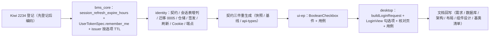

# 05 实施 · 记住我（登录保留时长选项）

> 认证与安全 · 05 登录前端 · 子任务 05（需求 05-5，补充需求）· 实施记录

[文档首页](../../../../../../文档首页.md) › [05 登录前端](../../05_登录前端.md) › [05 记住我](../05_登录前端_05_记住我.md) › 实施记录　|　[详细设计](../设计/01_详细设计_05_记住我.md)

## 1. 实施信息 <a id="meta"></a>

| 项 | 值 |
| --- | --- |
| 任务 | [05 记住我](../05_登录前端_05_记住我.md) |
| 对应需求 | [05-5](../../../../需求/05_需求_登录前端.md#r05-5) |
| 详细设计 | [01 详细设计 · 记住我](../设计/01_详细设计_05_记住我.md) |
| 实施日期 | 2026-10-03 |
| 实施人 | minjian |
| 实施环境 | 开发机（Linux）· uv（后端 `backend/`）+ pnpm 工作区（前端 `frontend/packages/{ui-ep}` + `frontend/apps/desktop`） |
| 提交 | bms `61f164e3`（feat）+ `d1f05137`（docs） |
| 结论 | 已完成 |

## 2. 实施概览 <a id="overview"></a>



结果小结：「记住我」由误导性装饰落成真实保留时长选项——后端 `LoginRequest.remember_me`（可选，缺省 `false` = 会话级）、refresh 保留时长按选项取 14 天 / 会话级（24 小时），Cookie、令牌、`sys_session.expires_at`、Redis TTL 四者对齐且轮换滚动续期；前端新增组件库单布尔复选件并在登录页恢复勾选项、随请求显式提交。后端定向用例 + 契约门禁 + 前端三包门禁全绿。

## 3. 实施过程 <a id="process"></a>

### 3.1 bms_core：配置与令牌签发 <a id="step-core"></a>

- `core/config.py`：`[security]` 增 `session_refresh_expire_hours`（默认 24，`ge=1`；环境变量 `BMS_SECURITY__SESSION_REFRESH_EXPIRE_HOURS`）。
- `oauth/user_token.py`：`UserTokenSpec` 增 `remember_me: bool = True`（缺省真 = 现有 14 天行为，向后兼容）。
- `oauth/user_jwt.py`：`JwtUserTokenIssuer` 增 `session_refresh_ttl: int | None = None`；`issue_pair` 经 `_effective_refresh_ttl(remember_me)` 选 refresh TTL（access 恒 `access_ttl` 不变）；工厂从 `[security].session_refresh_expire_hours` 注入 `session_refresh_ttl`。

### 3.2 identity：契约 / 会话 / 端点 <a id="step-identity"></a>

| 文件 | 改动 |
| --- | --- |
| `schemas/auth.py` | `LoginRequest` 增 `remember_me: bool = False`（可选，只增不删） |
| `models/session.py` | `SysSession` 增可空 `remember_me`（`Boolean`，NULL=历史行按 14 天） |
| `alembic/versions/identity/tenant/0005_sys_session_remember_me.py` | 新迁移（`down_revision=0004_sys_outbox`，`op.add_column` 可空 Boolean） |
| `repositories/session.py` | `create_session(remember_me)` 落列；新增 `rotate(session_id, hash, expires_at)`（轮换哈希 + 滚动 `expires_at`）；`update_refresh_hash` 保留 |
| `services/session_issuer.py` | `issue(remember_me=True)` 透传令牌 spec 与落库；`IssuedSession` 增 `remember_me` |
| `services/auth.py` | `login` 传 `req.remember_me`；`refresh` 读列 `remembered = record.remember_me is not False`、按选项 `issue_pair`、`rotate` 滚动哈希 + `expires_at`；两 Outcome 增 `remember_me` |
| `api/cookies.py` | `set_refresh_cookie(max_age: int | None)`——`None` 下发会话 Cookie（不传 `Max-Age`） |
| `api/auth.py` | 登录 / 刷新按 `outcome.remember_me` 取 Cookie 过期（真=持久秒值、假=`None`） |

### 3.3 契约三件重生成 <a id="step-contract"></a>

```bash
cd backend && uv run python -m ops.contract_snapshot export
uv run python -m ops.contract_gate baseline-update --service identity
cd .. && pnpm run api-types:gen
```

- 快照 `deploy/contracts/identity.json`：`LoginRequest` 增可选 `remember_me`（`+6` 行）。
- 基线 `deploy/contracts/baseline/identity.json`：同步（可选新增，属兼容变更，oasdiff 无破坏项）。
- 生成类型 `frontend/packages/api-types/src/identity.ts`：`remember_me: boolean`。

### 3.4 前端：单布尔复选件与登录页 <a id="step-frontend"></a>

- `packages/ui-ep/src/components/input/BooleanCheckbox.vue`（新）：`useBaseInput<boolean>` 投影；props `modelValue` / `label` / `disabled` / `indeterminate`，emits `update:modelValue` / `change`；根类 `bms-boolean-checkbox`；`index.ts` 具名导出。
- `apps/desktop/src/utils/login.ts`：新增 `buildLoginRequest(values)`——**恒显式携带** `remember_me`（缺省 `false`），`tenant` 缺省 `null`，`captcha` 仅在提供时携带。
- `apps/desktop/src/views/LoginView.vue`：增 `rememberMe = ref(false)`；表单在密码后插入 `<boolean-checkbox v-model="rememberMe" label="记住我" data-test="login-remember" />`；提交经 `login(buildLoginRequest({...}))`。
- `apps/desktop/src/dev/LoginCheck.vue`：核对项由「无记住我开关」改为「勾选项存在且缺省不勾选」+「无强度提示」；表单件复用项计数含 `BooleanCheckbox`（3 → 4）。

### 3.5 关键命令 <a id="cmds"></a>

```bash
# 后端定向用例（backend）
uv run pytest services/identity/tests/auth services/identity/tests/oauth/test_user_token.py libs/bms_core/tests/core/test_config.py -q
# 前端（bms 根）
pnpm --filter @bms/ui-ep run test && pnpm --filter @bms/desktop run test
pnpm --filter @bms/desktop run lint && pnpm --filter @bms/desktop exec vue-tsc -b
pnpm run ui-ep:typecheck && pnpm run ui-ep:lint
pnpm run api-types:gen:check
# 基座（bms 根）
python3 scripts/tools/preflight/check-preflight.py --fast
```

## 4. 问题与处置 <a id="issues"></a>

| # | 问题 | 原因 | 处置 |
| --- | --- | --- | --- |
| 1 | 需求 05-5 第 1 条内部冲突（「缺省 false」与「未携带行为与落地前一致」） | 落地前 refresh 恒 14 天持久，缺省 false（会话级）与「行为一致」不可兼得 | 经 2026-10-03 拍板取「**缺省 false = 会话级**」并回写需求正文（接口兼容由「字段可选」承接） |
| 2 | 测试库 `no such column: sys_session.remember_me` | `db/bootstrap.py` 启动期 `create_all` **只补不建**——已存在的 SQLite 测试库不补新列 | 删除陈旧库文件 `backend/bms_tenant_demo.db` 后重建（非代码缺陷；真库走迁移 `0005`） |
| 3 | 会话级「浏览器关闭即失效」与「令牌有效期不因 refresh 延长」两语义取舍 | 会话 Cookie 在浏览器长开时不失效；而 refresh 轮换是否延长令牌有效期存在分叉 | 经拍板：**两选项均滚动续期**（`expires_at` / Redis TTL 随选项 `now + TTL` 重置），使两者恒相等并与架构「滚动轮换」一致 |
| 4 | 前端组件库无单布尔复选框件 | `CheckboxInput` 为数组多选、`SwitchInput` 为开关形态 | 经拍板**新增库件 `BooleanCheckbox`** 并补《组件设计 · 单布尔复选》节点与《组件设计总览》路线图 |

## 5. 验证结果 <a id="verify"></a>

| 验证项 | 方法 | 结果 |
| --- | --- | --- |
| 后端定向 | `pytest services/identity/tests/auth` + `oauth/test_user_token.py` + `libs/bms_core/tests/core/test_config.py` | **106 passed** |
| 后端 identity 全量 | `pytest services/identity/tests` | **275 passed / 1 skipped** |
| bms_core（oauth / config / ops） | `pytest libs/bms_core/tests/oauth libs/bms_core/tests/core/test_config.py libs/bms_core/tests/ops` | 194 passed（快照漂移已随契约重生成修复，12 passed） |
| 契约零漂移 | `contract_snapshot check` / `api-types:gen:check` | 9 服务一致 / 零漂移 |
| 前端件族 | `pnpm --filter @bms/ui-ep run test` + `ui-ep:typecheck` + `ui-ep:lint` | 64 文件 / **920 passed**；typecheck 与 lint 全绿 |
| 前端宿主 | `pnpm --filter @bms/desktop run test` + `lint` + `vue-tsc -b` | 35 文件 / **217 passed**；lint 与 `vue-tsc -b` 全绿 |
| 基座预检 | `python3 scripts/tools/preflight/check-preflight.py --fast` | 全部通过（含文档 check-status / 契约 / 网关） |
| 文档基座 | `check-links.py` / `check-docs-scope.py` | 断链 0 / 失效锚点 0；文档落点护栏 0 |

## 6. 偏差与遗留 <a id="deviations"></a>

**偏差（已回写设计与相关登记）**：

1. **需求 05-5 第 1 条口径消解**：冲突取「缺省 `false` = 会话级」，需求正文与任务文档已回写（新增「接口兼容」表述）；设计 §8.1 第 1 项登记。
2. **会话级取值细化**：采用「有界会话 TTL（24 小时）+ 会话 Cookie + 滚动续期」，配置落 `[security].session_refresh_expire_hours`；架构 14「双 token 模型」节已补注。
3. **`sys_session` 增列**：`remember_me`（可空）；表文件 + 变更记录 + 迁移 `0005` 已回写（历史行 NULL 按 14 天）。
4. **`refresh` 轮换行为变更**：由「仅更新哈希」改为「更新哈希 + 滚动 `expires_at`」（设计 §8.1 第 10 项，`expires_at` 与 Redis TTL 恒对齐）。
5. **新增库件与组件设计节点**：`BooleanCheckbox` + 《组件设计 · 单布尔复选》（md + 原型）+ 总览路线图 + 《前端基类清单》登录页登记。

**遗留（归口）**：

| 事项 | 归口 |
| --- | --- |
| SSO / 扫码登录跟随「记住我」选项（本轮沿用 14 天） | 需求就绪时另立任务 |
| `sys_session.remember_me` 在全管理端会话列表展示 | 阶段十五（会话管理页面） |
| 会话级「超时无操作退出」（绝对强制下线） | 后续安全强化 |
| 多标签页会话级 / 持久切换同步 | 阶段十五 |
| 宿主国际化（勾选项文案取常量） | 国际化阶段 |

> 本文档依《[文档生成规范](../../../../../../规范/文档生成规范.md)》编写
