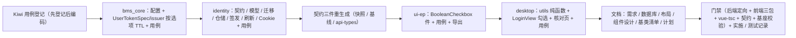

# 05 详细设计 · 记住我（登录保留时长选项）

> 认证与安全 · 05 登录前端 · 子任务 05（需求 05-5，补充需求）· 详细设计

[文档首页](../../../../../../文档首页.md) › [05 登录前端](../../05_登录前端.md) › [05 记住我](../05_登录前端_05_记住我.md) › 详细设计　|　[需求 05-5](../../../../需求/05_需求_登录前端.md#r05-5)

## 1. 设计目标与范围 <a id="goal"></a>

把登录页「记住我」从**误导性装饰**落成**真实保留时长选项**：后端登录契约增可选 `remember_me`、明确 refresh 保留时长策略（会话级 / 14 天）并在会话侧对齐，前端登录页恢复勾选项并随登录请求提交；不落 access、不变更 access 有效期（仍 30 分钟、仅存内存）。

- **登录契约扩展（需求 05-5 第 1 条）**：`LoginRequest` 增可选 `remember_me`（布尔，缺省 `false`，只增不删）；未携带按**会话级**处理（见 §8.1 第 1 项：与「缺省 `false`」一致，回写需求原文的「未携带时行为与落地前一致」）。
- **保留时长策略（第 2 条）**：`remember_me=false` → refresh **会话级**（Cookie 不带持久 `Max-Age`，浏览器会话结束即失效）且令牌 / 会话侧有效期取**有界会话 TTL**（`[security].session_refresh_expire_hours`，默认 24 小时）；`remember_me=true` → **14 天滚动轮换**（现行口径）。
- **会话侧对齐（第 3 条）**：登录签发与会话轮换均按选项写入 `sys_session.expires_at` 与 Redis 会话标记 TTL（两选项均**滚动续期**，见 §8.1 第 10 项）；refresh 轮换保持会话 id 稳定；登出 / 踢出清理口径不变。
- **前端接入（第 4 条）**：登录页表单恢复「记住我」勾选项（缺省不勾选），**始终显式携带**布尔值随登录请求提交（§8.1 第 8 项）。
- **契约与门禁（第 5 条）**：新字段进入 identity 公开契约快照、oasdiff 基线与 `@bms/api-types` 生成类型（零漂移由既有门禁保证；字段为**可选新增**，属兼容变更）。
- **安全口径（第 6 条）**：勾选仅延长 refresh 有效期；Cookie 的 `HttpOnly` / `Secure` / `SameSite=Lax` / `Path=/api/v1/auth` 收敛口径**全部不变**，仅 `Max-Age` 按选项有无；禁用 / 不勾选不落任何明文口令。
- **用例与核对（第 7 条）**：后端用例覆盖会话级与 14 天两分支（含轮换续期）；前端组件用例 + 库件用例 + 核对页覆盖勾选项与提交；`vue-tsc`、ESLint、Vitest 门禁。

**不在本任务**：SSO / 扫码登录跟随选项（沿用 14 天，§8.1 第 6 项）；access 有效期与存储方式变更；多标签页会话同步（阶段十五）；宿主国际化文案（国际化阶段）；找回密码 / 改密页面（阶段十五）。

**安全影响（SDL）**：新增字段仅承载布尔选项，无口令 / 令牌进入请求体；会话级仅取消 Cookie 持久 `Max-Age`，不放宽任何 Cookie 安全属性；会话级以 24 小时有界 TTL 收紧令牌安全上限。

## 2. 交付物清单 <a id="deliver"></a>

```text
backend/
├── libs/bms_core/src/bms_core/core/config.py                       # 改：[security] 增 session_refresh_expire_hours
├── libs/bms_core/src/bms_core/oauth/user_token.py                  # 改：UserTokenSpec 增 remember_me
├── libs/bms_core/src/bms_core/oauth/user_jwt.py                    # 改：签发者按 remember_me 选 TTL（新增 session_refresh_ttl）
├── services/identity/src/bms_identity/schemas/auth.py              # 改：LoginRequest 增 remember_me
├── services/identity/src/bms_identity/models/session.py            # 改：SysSession 增 remember_me（可空）
├── services/identity/src/bms_identity/repositories/session.py      # 改：create_session(remember_me) + rotate（哈希 + expires_at）
├── services/identity/src/bms_identity/services/session_issuer.py   # 改：issue(remember_me) + 透传落库
├── services/identity/src/bms_identity/services/auth.py             # 改：login 传选项；refresh 读列 + 滚动续期
├── services/identity/src/bms_identity/api/cookies.py               # 改：set_refresh_cookie 支持会话 Cookie（max_age 可空）
├── services/identity/src/bms_identity/api/auth.py                  # 改：登录下发按选项取 Cookie 过期
├── alembic/versions/identity/tenant/0005_sys_session_remember_me.py # 新：会话表增列迁移
├── deploy/contracts/identity.json                                  # 改：公开契约快照重生成
└── deploy/contracts/baseline/identity.json                         # 改：oasdiff 基线更新（可选新增，兼容）

backend 测试（受变更影响定向）
├── libs/bms_core/tests/...                                         # 改：配置默认值 / 签发者按选项 TTL 用例
└── services/identity/tests/auth/{test_login,test_refresh}.py       # 改：会话级 / 14 天两分支与轮换续期用例

frontend/
├── packages/api-types/src/identity.ts                             # 改：生成类型重生成（含 remember_me）
├── packages/ui-ep/src/components/input/BooleanCheckbox.vue        # 新：单布尔复选框件
├── packages/ui-ep/src/index.ts                                    # 改：导出 BooleanCheckbox
├── packages/ui-ep/tests/input-boolean-checkbox.spec.ts            # 新：受控 / 禁用 / 变更事件用例
├── apps/desktop/src/views/LoginView.vue                           # 改：记住我勾选（缺省不勾选）+ 提交
├── apps/desktop/src/utils/login.ts                                # 改：buildLoginRequest（含 remember_me）
├── apps/desktop/src/dev/LoginCheck.vue                            # 改：核对页项（勾选项与提交）
├── apps/desktop/tests/login-view.spec.ts                          # 改：勾选 / 提交 / 安全口径
└── apps/desktop/tests/login-check.spec.ts                         # 改：自检项

bms文档/
├── 设计/数据库设计/数据表设计/sys_session.md                        # 改：字段 + 变更记录
├── 设计/数据库设计/01_数据库设计_总览.md                            # 改：登记状态（迁移 0005）
├── 设计/原型设计/03_通用骨架/02_登录页.html                        # 改：表单区记住我口径 + 检查清单
├── 设计/组件设计/05_基础控件类/09_组件设计_单布尔复选/…             # 新：组件设计节点 md + 可交互原型 html
├── 设计/组件设计/01_组件设计_总览.md                               # 改：组件路线图登记（基础控件类 09）
├── 前端基类清单.md                                                # 改：宿主横切底座（登录页表单件补 BooleanCheckbox）
├── 项目/06_认证与安全/需求/05_需求_登录前端.md                     # 改：需求 05-5 口径回写（冲突消解 + 会话级取值）
├── 项目/06_认证与安全/计划/01_计划_认证与安全.md                    # 改：进度唯一落点
└── 本任务 设计 / 实施 / 测试                                       # 新
```

> 目录树为罗列型内容，按《[文档生成规范](../../../../../../规范/文档生成规范.md)》用目录清单（非 mermaid）。

## 3. 设计与边界 <a id="design"></a>

### 3.1 现状实测与缺口 <a id="gap"></a>

| # | 实测项 | 结论 |
| --- | --- | --- |
| 1 | `schemas/auth.py::LoginRequest` | 仅 `account` / `password` / `tenant` / `captcha`，**无** `remember_me` |
| 2 | `oauth/user_jwt.py::JwtUserTokenIssuer` | refresh TTL 由 `[security].refresh_token_expire_days` 固定，**无按次覆盖位** |
| 3 | `services/auth.py::LoginService.login` | 签发不区分保留时长；refresh 轮换只更新哈希（**不更新 `expires_at`**） |
| 4 | `api/cookies.py::set_refresh_cookie` | `max_age` 必填（恒持久 Cookie），**无会话 Cookie 位** |
| 5 | `models/session.py::SysSession` | 无「是否记住我」列，轮换无从判定原选项 |
| 6 | `services/session.py::SessionService` | 登出 / 踢出清理口径与选项无关（不变）；`_remaining_ttl` 依据 `expires_at` |
| 7 | `views/LoginView.vue` | 无「记住我」开关（05_01 按当时契约未渲染）；`utils/login.ts` 未建提交体函数 |
| 8 | `ui-ep` 输入件族 | 有 `CheckboxInput`（数组多选）/ `SwitchInput`（开关）；**无单布尔复选框件** |
| 9 | 契约三件 | `deploy/contracts/identity.json`（快照）+ `deploy/contracts/baseline/identity.json`（oasdiff 基线）+ `@bms/api-types`；新增可选字段为**兼容变更** |

### 3.2 保留时长策略（核心取值） <a id="policy"></a>

| 选项 | Cookie | refresh JWT `exp` | `sys_session.expires_at` | Redis 标记 TTL |
| --- | --- | --- | --- | --- |
| `remember_me=true` | 持久（`Max-Age=14 天`） | 14 天 | now + 14 天（滚动） | 14 天（滚动） |
| `remember_me=false` | **会话 Cookie**（无 `Max-Age` / `Expires`） | `session_refresh_expire_hours`（默认 24 小时） | now + 24 小时（滚动） | 24 小时（滚动） |

- **取值来源**：`[security].session_refresh_expire_hours`（默认 `24`，`ge=1`；环境变量 `BMS_SECURITY__SESSION_REFRESH_EXPIRE_HOURS`），与既有 `access_token_expire_minutes` / `refresh_token_expire_days` 同段同风格。
- **滚动续期（§8.1 第 10 项）**：refresh 轮换按原选项重置 `expires_at = now + 选项 TTL` 与 Redis TTL（现有实现不更新 `expires_at`，本次一并对齐，使两者恒相等）。
- **会话 id 稳定**：轮换仍沿用同一 `session_id`（不改）。
- **SSO / 扫码**：不经 `LoginRequest`，`SessionIssuer.issue` 的 `remember_me` 缺省 `true` → 沿用 14 天持久（行为不变）。

### 3.3 后端改造点 <a id="backend"></a>

**（1）契约与配置**

- `LoginRequest.remember_me: bool = Field(default=False, description=...)`（可选、只增）。
- `SecuritySettings.session_refresh_expire_hours: int = Field(default=24, ge=1)`。

**（2）令牌签发按选项选 TTL**

```text
UserTokenSpec（bms_core/oauth/user_token.py）
└── remember_me: bool = True                 # 缺省 True = 现有 14 天行为，既有调用方零改动

JwtUserTokenIssuer（bms_core/oauth/user_jwt.py）
├── 构造增 session_refresh_ttl: int | None = None   # 缺省 None → 回落 refresh_ttl（后端无感）
└── issue_pair：有效 refresh TTL = remember_me ? refresh_ttl : (session_refresh_ttl ?? refresh_ttl)
     └── access 仍固定 access_ttl（30 分钟，不变）
```

**（3）会话签发与轮换**

```text
SessionIssuer.issue(..., remember_me: bool = True)
├── issue_pair(UserTokenSpec(..., remember_me=remember_me))     # pair.refresh_expires_in 即选项 TTL
├── _persist(..., remember_me=remember_me)                       # 落 sys_session.remember_me + Redis TTL
└── IssuedSession.remember_me（新增，供 API 层判定 Cookie 是否持久）

LoginService.login
└── issue(..., remember_me=req.remember_me)  → LoginOutcome.remember_me

LoginService.refresh
├── remembered = record.remember_me is not False     # NULL（历史行）/ true → 14 天
├── issue_pair(..., remember_me=remembered)          # 同会话 id
├── repo.rotate(session_id, hash, expires_at=now + pair.refresh_expires_in)   # 哈希 + expires_at
└── store.save(..., ttl=pair.refresh_expires_in)     # Redis TTL 同步
```

**（4）Cookie 下发**

```text
api/cookies.py::set_refresh_cookie(response, request, token, max_age: int | None)
├── max_age 为 int   → 持久 Cookie（现有行为）
└── max_age 为 None  → 会话 Cookie（不传 max_age/expires）
     └── HttpOnly / Secure / SameSite=Lax / Path 一律不变

api/auth.py::login / refresh：max_age = outcome.remember_me ? outcome.refresh_expires_in : None
api/sso.py::_success_response：保持传 issued.refresh_expires_in（14 天，不变）
```

**（5）数据模型与迁移**

- `SysSession.remember_me: Mapped[bool | None]`（`Boolean`，**可空**）：`true`=记住我 / `false`=会话级 / `NULL`=历史行（按记住我=14 天处理）。可空口径避免 `server_default` 的方言差异，且存量行语义自然（历史登录均为 14 天）。
- 迁移 `identity:tenant 0005_sys_session_remember_me`（`down_revision=0004_sys_outbox`）：`op.add_column` 可空 Boolean；`downgrade` 删列。
- `SessionRepository.create_session(..., remember_me: bool | None = None)`；新增 `rotate(session_id, *, refresh_token_hash, expires_at)`（替代 refresh 路径的 `update_refresh_hash`，`update_refresh_hash` 保留供他处 / 兼容）。

### 3.4 前端改造点 <a id="frontend"></a>

**（1）新库件 `BooleanCheckbox.vue`（`@bms/ui-ep`）**

- 落点 `components/input/BooleanCheckbox.vue`（与 `SwitchInput` / `CheckboxInput` 同层），经 `useBaseInput<boolean>` 承接受控 / 禁用 / 三态。
- Props：`modelValue?: boolean`、`label?: string`、`disabled?: boolean`、`indeterminate?: boolean`；Emits：`update:modelValue` / `change`；根类 `bms-boolean-checkbox`（`data-*` 透传根元素）。
- 三态：`undefined` 表未设置；勾选 / 取消勾选归一为 `true` / `false`。`index.ts` 具名导出。

**（2）登录页接入**

```text
LoginView.vue
├── rememberMe = ref(false)                      # 缺省不勾选
├── 表单区：租户 → 账号 → 密码 → [记住我 BooleanCheckbox] → 验证码 → 错误 → 提交
└── 提交：buildLoginRequest({ account, password, tenant, captcha?, rememberMe })

utils/login.ts
└── buildLoginRequest(values): LoginRequest      # account / password / remember_me（恒显式布尔）/ tenant? / captcha?
```

- 勾选项**不参与本地前置校验**（默认不勾选即可提交）；明文口径不变（不落存储 / 不回填）。

### 3.5 失败分支与边界 <a id="failures"></a>

| 场景 | 处理 |
| --- | --- |
| 未携带 `remember_me`（旧调用方 / 直接调 API） | 按缺省 `false` = 会话级处理（§8.1 第 1 项） |
| `remember_me=true` | 14 天持久 Cookie + 14 天令牌 / 会话 / Redis |
| `session_refresh_expire_hours` 配错（≤0） | 配置校验拒绝启动（`ge=1`） |
| 历史会话行 `remember_me=NULL` | 轮换按「记住我」处理（14 天），不误降级 |
| 会话级登录后浏览器不关、持续使用 | refresh 滚动续期（24 小时滑动），令牌不过期；浏览器关闭即因会话 Cookie 失效 |
| 会话级登录后浏览器关闭再打开 | 会话 Cookie 缺失 → 无法 refresh → 走未登录（守卫跳登录） |
| refresh 轮换 | 会话 id 稳定；`expires_at` / Redis TTL / Cookie 三者按选项一致 |
| 登出 / 踢出 / 多端超限 | 清理口径**不变**（黑名单 + 撤销 + 删标记） |
| SSO / 扫码登录 | 不涉本字段，恒 14 天持久（行为不变） |
| access 过期静默刷新 | 与保留时长无关（access 仍 30 分钟、仅内存） |

## 4. 兼容性与消费方影响 <a id="compat"></a>

- **契约**：`LoginRequest` 仅**新增可选**字段，属兼容变更（oasdiff breaking=0）；快照 / 基线 / 生成类型三处重生成。
- **bms_core 令牌**：`UserTokenSpec.remember_me` 缺省 `True`、`JwtUserTokenIssuer.session_refresh_ttl` 缺省 `None`，既有调用与既有用例**行为逐字节不变**。
- **identity 服务**：SSO 路径不传 `remember_me` → 缺省 True → 14 天不变；会话 / 踢出 / 多端上限行为不变。
- **前端**：`BooleanCheckbox` 为纯新增库件（不改既有件）；`LoginView` 新增勾选项与提交字段；`CheckboxInput` / `SwitchInput` 不受影响。
- **05_01 消费面**：05_01 设计「本页不渲染记住我」由本任务落地（已在 05_01 设计 §7 补注）；其设计已把提交体构造收敛在 `utils/login.ts`，本任务用 `buildLoginRequest` 单点接入。

## 5. 测试设计与验收映射 <a id="test"></a>

用例**先登记 Kiwi TCMS 再编码**（新登记 1 条策展用例，分类「平台骨架」/ P2 / `CONFIRMED` / 标签「自动化」；编号以平台回读为准并回填本记录与代码标注）。

| # | 用例 / 文件 | 类型 | 断言要点 |
| --- | --- | --- | --- |
| 1 | `bms_core` 配置用例 | 单元 | `[security].session_refresh_expire_hours` 缺省 24；非法值拒绝 |
| 2 | `identity/tests/oauth/test_user_token.py` | 单元 | `remember_me=true` → refresh `exp - iat = 14 天`、`refresh_expires_in=14 天`；`false` + `session_refresh_ttl` → 会话级 TTL；缺省 `remember_me` 行为不变 |
| 3 | `identity/tests/auth/test_login.py` | 接口 | `remember_me=true`：响应 200、`Set-Cookie` 含 `Max-Age=1209600`、`sys_session.expires_at ≈ now + 14 天`、Redis TTL = 14 天；`remember_me=false` / 缺省：`Set-Cookie` **无 Max-Age**（会话 Cookie）、`expires_at ≈ now + 24 小时`、Redis TTL = 24 小时 |
| 4 | `identity/tests/auth/test_refresh.py` | 接口 | `remember_me=true` 轮换后仍持久 Cookie + `expires_at` 滚动至 now + 14 天；会话级轮换后仍是会话 Cookie + `expires_at` 滚动至 now + 24 小时；会话 id 稳定；历史 `NULL` 行轮换按 14 天 |
| 5 | `packages/ui-ep/tests/input-boolean-checkbox.spec.ts` | 单元（挂载） | 受控取值 / 变更事件 / 缺省未设置 / 禁用 / label 渲染 / 根类名 |
| 6 | `apps/desktop/tests/login-utils.spec.ts` | 单元 | `buildLoginRequest`：恒含 `remember_me`（缺省 false）；带 tenant / captcha 分支；不含口令外多余字段 |
| 7 | `apps/desktop/tests/login-view.spec.ts` | 单元（挂载） | 勾选项缺省不勾选；提交载荷 `remember_me` 随勾选取 false / true；无「记住我」的历史断言改为「勾选项存在 + 缺省不勾选」；表单件复用计数含 `BooleanCheckbox` |
| 8 | `apps/desktop/tests/login-check.spec.ts` | 单元（挂载） | 核对页自检全部通过（含勾选项项） |
| 9 | 契约门禁 | 门禁 | `api-types:gen:check` 零漂移；`contract_snapshot check` 一致；oasdiff 无破坏性变更（字段新增） |
| 10 | 三包既有全部用例 | 回归 | `@bms/core` / `@bms/ui-ep` / `@bms/desktop` 定向用例全绿；`vue-tsc` / ESLint |

**验收映射**：需求 05-5「勾选与不勾选两种登录在刷新后表现为不同的 refresh 有效期（会话级与 14 天两分支）」→ 用例 2 / 3 / 4；「契约四道门禁全绿且生成类型含 `remember_me`」→ 用例 9 + 门禁命令；「登录页勾选项随请求提交且文案与口径一致」→ 用例 5 / 6 / 7 / 8；「`vue-tsc`、ESLint、Vitest 全通过」→ 用例 10 + §9 门禁。

**执行范围**：只跑受变更影响的定向用例（`bms_core` 配置 / 令牌；`identity` 认证用例；`ui-ep` 新件用例 + 既有件回归；`desktop` 全部用例），不跑全量后端 `pytest` 与前端全量工作区（口径见《[AI开发规范](../../../../../../规范/AI开发规范.md)》）。

## 6. 登记落点 <a id="registry"></a>

| 内容 | 落点 |
| --- | --- |
| 保留时长策略与配置口径 | 本设计（§3.2 / §3.3）+《[架构设计 · 认证与会话](../../../../../../设计/架构设计/14_架构设计_子系统_认证与会话.md)》「双 token 模型」节（会话级 TTL 口径随收口回写） |
| 会话表字段与迁移 | 《[数据库设计 · sys_session](../../../../../../设计/数据库设计/数据表设计/sys_session.md)》（字段 + 变更记录）+《[数据库设计总览](../../../../../../设计/数据库设计/01_数据库设计_总览.md)》登记状态 |
| 登录页记住我口径 | 《[原型设计 · 登录页](../../../../../../设计/原型设计/03_通用骨架/02_登录页.html)》「表单区」节 + 检查清单 |
| 单布尔复选框件语义 | 《[组件设计 · 单布尔复选](../../../../../../设计/组件设计/05_基础控件类/09_组件设计_单布尔复选/09_组件设计_单布尔复选.md)》（本任务新建）+《[组件设计总览](../../../../../../设计/组件设计/01_组件设计_总览.md)》路线图 |
| 实现侧命名与落点 | 《[前端基类清单](../../../../../../前端基类清单.md)》「宿主横切底座」节（登录页表单件补 `BooleanCheckbox`） |
| 「记住我」需求口径（缺省语义 / 会话级取值） | 需求 [05-5](../../../../需求/05_需求_登录前端.md#r05-5) 正文回写 |
| 阶段计划：`05_05` 条目与进度（状态 / 完成日期 / 偏差与遗留） | 阶段计划表（进度唯一落点） |
| Kiwi TCMS / 测试资产仓 | 登记本任务用例并回读编号 |
| 实施 / 测试记录 | 本目录 `实施/`、`测试/` |

## 7. 边界与开放项 <a id="boundary"></a>

- **会话级 TTL 语义**：取「有界 24 小时 + 滑动续期 + 会话 Cookie」——浏览器关闭即失效为主语义，24 小时为有界安全上限；不引入绝对强制下线（如超时无操作退出），归后续安全强化。
- **SSO / 扫码跟随选项**：本轮沿用 14 天（无勾选载体）；如后续需要，另立任务（需求侧扩展 + 前端载体）。
- **多标签页同步**：会话级 / 持久切换的跨标签一致性归阶段十五。
- **历史行判定**：`remember_me=NULL` 一律按记住我处理；不做数据回填（历史登录均为 14 天，语义等价）。
- **`sys_session` 会话管理页展示**：`remember_me` 暂不进会话列表响应（避免改 `SessionItem` 契约）；如需展示归阶段十五会话管理页。
- **宿主国际化**：勾选项文案取常量（宿主未引入 i18n，归国际化阶段）。
- **方言落点**：新增可空 Boolean 列的 DDL 由既有布尔映射承接（`Boolean` → 各库等价形式）；本任务不引入方言差异结论，迁移随既有三库链执行。

## 8. 对齐记录 <a id="align"></a>

### 8.1 本轮拍板（2026-10-03，逐项确认） <a id="align-new"></a>

| # | 事项 | 结论 |
| --- | --- | --- |
| 1 | 缺省语义（需求内部冲突） | **缺省 `false` = 会话级**；未携带按会话级处理，与「缺省 `false`」字面一致；回写需求第 1 条「未携带时行为与落地前一致」为「接口兼容（字段可选不破坏调用），保留时长默认由 14 天改为会话级」 |
| 2 | 会话级令牌 / 会话侧口径 | **有界会话 TTL + 会话 Cookie**（Cookie 无持久 `Max-Age`；令牌 `exp` / `expires_at` / Redis TTL 取会话 TTL） |
| 3 | 会话级默认时长 | **24 小时** |
| 4 | 会话级配置落点 | `[security].session_refresh_expire_hours`（与既有 token 配置同段同风格） |
| 5 | 跨轮换策略承载 | **`sys_session` 增列**（`remember_me`，可空；历史行 NULL=记住我）；refresh 读列重设 Cookie 与 TTL |
| 6 | SSO / 扫码跟随 | **沿用现状 14 天**（本需求仅扩展本地登录契约） |
| 7 | 前端勾选件 | **新增组件库「单布尔复选框件」**（非直接用 Element Plus `ElCheckbox`） |
| 8 | 提交体携带口径 | **始终显式携带布尔**（`utils/login.ts::buildLoginRequest` 归一） |
| 9 | Kiwi 用例条数 | **1 条**策展用例（本任务整体，分类「平台骨架」/ P2 / `CONFIRMED` / 自动化） |
| 10 | refresh 轮换有效期 | **两选项均滚动续期**：refresh 时 `expires_at = now + 选项 TTL`，Redis TTL 同步重置（现状不更新 `expires_at`，本次一并对齐） |
| 11 | 组件设计登记 | **新增独立基础控件节点**「09 单布尔复选」（含可交互原型 html + 总览登记） |
| 12 | 组件命名 | **`BooleanCheckbox`**（`bms-boolean-checkbox`） |

### 8.2 复用既有口径 <a id="align-reuse"></a>

| # | 事项 | 结论 |
| --- | --- | --- |
| 1 | 契约类型消费 | `@bms/api-types` 的 `identity` 命名空间（`05_01` / `06_01`），**不手写重复类型** |
| 2 | 令牌签发 / 验签 | `BaseUserTokenIssuer`（`01_02`）只做**兼容式**扩展（缺省保持现状） |
| 3 | 会话签发构作 | `SessionIssuer`（`01_03` 落地、`02_01` 复用）单点扩展，SSO 行为不变 |
| 4 | 会话清理 | `SessionService` 统一撤销原语（`01_04`），本任务不改清理口径 |
| 5 | 输入件基座 | `useBaseInput`（输入组件基类投影，`09_02`），新件沿同一受控口径 |
| 6 | 登录页表单件复用 | 业务侧禁用裸原生件（`guard-library-components.spec.ts`），新勾选件走组件库 |
| 7 | 命名与文档 | 遵《[命名规范](../../../../../../规范/命名规范.md)》《[前端开发规范](../../../../../../规范/前端开发规范.md)》；文档遵《[文档生成规范](../../../../../../规范/文档生成规范.md)》 |

## 9. 实施步骤与关键命令 <a id="steps"></a>



1. 读《[KiwiTCMS部署使用说明](../../../../../../资料/开发服务器/linux/KiwiTCMS部署使用说明.md)》「用例约定」节，登记本任务用例并**回读编号**。
2. `bms_core`：`config.py` 增配置；`user_token.py` / `user_jwt.py` 按选项选 TTL；配置与令牌用例。
3. `identity`：契约 / 模型 / 迁移 / 仓储 / `SessionIssuer` / `LoginService` / `cookies` / `api/auth`；登录与刷新用例。
4. 契约三件：`python3 -m ops.contract_snapshot export` → `python3 -m ops.contract_gate baseline-update --service identity` → `pnpm run api-types:gen`。
5. `ui-ep`：`BooleanCheckbox.vue` + 导出 + 用例。
6. `desktop`：`utils/login.ts::buildLoginRequest` + `LoginView.vue` 勾选项 + `LoginCheck.vue` 核对页 + 用例。
7. 文档：需求 05-5 回写、`sys_session` 表文件与总览、布局设计登录页、组件设计新节点与总览、前端基类清单、阶段计划、05_01 设计补注。
8. 门禁与回归（§5 用例 10 + 下列命令）→ 实施 / 测试记录 → 提交（代码与文档分开）。

关键命令：

```bash
# 后端（bms 根；只跑受变更影响的定向用例）
cd backend && uv run pytest services/identity/tests/auth services/identity/tests/oauth/test_user_token.py -q
uv run pytest libs/bms_core/tests/core/test_config.py -q
cd .. && python3 scripts/tools/preflight/check-preflight.py --fast

# 契约三件（backend 目录）
cd backend && uv run python -m ops.contract_snapshot export
uv run python -m ops.contract_gate baseline-update --service identity
cd .. && pnpm run api-types:gen:check

# 前端（bms 根）
pnpm --filter @bms/ui-ep run test && pnpm run ui-ep:typecheck && pnpm run ui-ep:lint
pnpm --filter @bms/desktop run test && pnpm --filter @bms/desktop run lint
pnpm --filter @bms/desktop exec vue-tsc -b

# 文档基座（bms 根）
python3 scripts/tools/base-check/check-links.py
python3 scripts/tools/check-docs/check-status.py --stage 06_认证与安全 --strict
```

## 10. 参考文档 <a id="ref"></a>

- [需求 05-5](../../../../需求/05_需求_登录前端.md#r05-5)、[需求 01-3](../../../../需求/01_需求_认证与会话.md#r01-3)
- [05_01 登录页真实实现](../../05_登录前端_01_登录页真实实现/05_登录前端_01_登录页真实实现.md) 及其[详细设计](../../05_登录前端_01_登录页真实实现/设计/01_详细设计_01_登录页真实实现.md)
- [05_02 token 与 401 静默刷新接线](../../05_登录前端_02_token与401静默刷新接线/05_登录前端_02_token与401静默刷新接线.md)
- 阶段一 [01_03 本地登录 / 刷新 / 登出链路](../../../01_认证与会话/01_认证与会话_03_本地登录刷新登出链路/01_认证与会话_03_本地登录刷新登出链路.md)、[01_04 会话管理与强制踢出](../../../01_认证与会话/01_认证与会话_04_会话管理与强制踢出/01_认证与会话_04_会话管理与强制踢出.md)
- 阶段四 [06_04 验证码字段](../../../../../04_前端组件库/任务/06_字段类/06_字段类_04_验证码字段/06_字段类_04_验证码字段.md)（件族复用口径参照）
- 《[架构设计 · 认证与会话](../../../../../../设计/架构设计/14_架构设计_子系统_认证与会话.md)》「双 token 模型」节、《[概要设计 · 会话管理](../../../../../../设计/概要设计/14_概要设计_会话管理.md)》
- 《[原型设计 · 登录页](../../../../../../设计/原型设计/03_通用骨架/02_登录页.html)》、《[组件设计 · 复选](../../../../../../设计/组件设计/05_基础控件类/07_组件设计_复选/07_组件设计_复选.md)》
- 《[前端基类清单](../../../../../../前端基类清单.md)》「宿主横切底座」节、《[安全开发规范](../../../../../../规范/安全开发规范.md)》「前端密码口径」节
- 《[数据库开发规范](../../../../../../规范/数据库开发规范.md)》、《[KiwiTCMS部署使用说明](../../../../../../资料/开发服务器/linux/KiwiTCMS部署使用说明.md)》

> 本文档依《[文档生成规范](../../../../../../规范/文档生成规范.md)》编写 · 关键决策逐项确认（2026-10-03）
