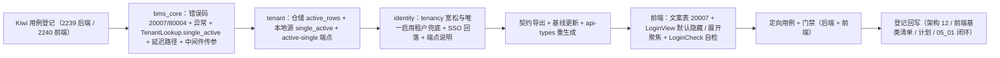

# 01 实施 · 登录页租户标识与「需选择租户」语义

> 认证与安全 · 05 登录前端 · 子任务 06（需求 05-6，补充需求）· 实施记录

[文档首页](../../../../../../文档首页.md) › [05 登录前端](../../05_登录前端.md) › [06 登录页多租户选择](../05_登录前端_06_登录页多租户选择.md) › 实施记录　|　[详细设计](../设计/01_详细设计_06_登录页多租户选择.md)　[测试记录 →](../测试/01_测试_06_登录页多租户选择.md)

## 1. 实施信息 

| 项 | 值 |
| --- | --- |
| 任务 | [06 登录页租户标识与「需选择租户」语义](../05_登录前端_06_登录页多租户选择.md) |
| 对应需求 | [05-6](../../../../需求/05_需求_登录前端.md#r05-6) |
| 详细设计 | [01 详细设计 · 登录页多租户选择](../设计/01_详细设计_06_登录页多租户选择.md) |
| 实施日期 | 2026-10-04 |
| 实施人 | minjian |
| 实施环境 | 开发机（Linux）· `backend/`（uv 工作区）+ pnpm 工作区（`frontend/packages/{core,api-types}` + `frontend/apps/desktop`） |
| 提交 | 未提交（按纪律，待用户明确指令） |
| 结论 | 已完成 |

## 2. 实施概览 

结果小结：登录页租户标识由「常显可选输入框」改为**默认隐藏**，后端补齐「未提供租户时按唯一启用租户解析」语义（恰 1 个采用、≥ 2 个返回 `20007`、0 个沿用既有失败），并打通生产中间件对免登录公开面的拦截。跨端 + 契约 + 文档全链交付。

## 3. 实施过程 

### 3.1 用例登记（先登记后编码） 

按《[KiwiTCMS部署使用说明](../../../../../../资料/开发服务器/linux/KiwiTCMS部署使用说明.md)》「用例约定」节，经容器内 Django shell 登记两条策展用例（分类「平台骨架」/ P2 / `CONFIRMED` / 标签「自动化」）：

| 编号 | 面向 | 主题 |
| --- | --- | --- |
| 2239 | 后端 | 唯一启用租户解析 / `20007` 不消费验证码 / 中间件延迟路径 / SSO 回落 / 契约零漂移 |
| 2240 | 前端 | 默认隐藏 / 本机记忆静默携带 / `20007` 触发展开与聚焦 / 验证码状态保留 / SSO 重拉 |

### 3.2 `bms_core`：错误码 / 异常 / 契约 / 解析链 / 中间件 

| 文件 | 改动 |
| --- | --- |
| `core/error_codes.py` | 认证段新增 `TENANT_REQUIRED = 20007`；租户段新增 `TENANT_SCOPE_AMBIGUOUS = 80004` |
| `core/exceptions.py` | 新增 `NeedTenantError(AuthError)`（`20007` / HTTP 200）、`MultipleActiveTenantsError(OpenTenantError)`（`80004` / 409） |
| `db/tenant.py` | `TenantLookup` 增 `single_active()` 契约；新增 `DEFAULT_DEFERRED_PATHS` / `is_deferred_path`；`resolve_request_tenant` 增 `deferred_paths` 参数与延迟分支 |
| `core/config.py` | `TenantSettings` 增 `deferred_paths`（缺省 login / forgot / reset / captcha / sso） |
| `api/middleware.py` | `TenantMiddleware` 传入 `deferred_paths` |
| `db/tenant_remote.py` | `RemoteTenantSource.single_active` + `_fetch_single_active` + `_payload_code`（业务码 80001 → None / 80004 → 多租户 / 其余非 2xx → 契约不可达） |

### 3.3 tenant 服务：仓储 / 本地源 / 只读端点 

| 文件 | 改动 |
| --- | --- |
| `repositories/tenant_registry.py` | 新增 `active_rows(limit=2)`（`status=active` 且未软删、主键升序、`LIMIT 2`）；返回 `ConcurrentStableList` |
| `sources/tenant_source.py` | `LocalTenantSource.single_active`（直查平台库：0 → None；1 → 上下文；≥ 2 → `MultipleActiveTenantsError`） |
| `api/tenant_registry.py` | 新增 `GET /active-single`（恰 1 → 快照；0 → 80001/404；≥ 2 → 80004/409） |

### 3.4 identity 服务：解析 / SSO / 端点说明 

| 文件 | 改动 |
| --- | --- |
| `api/tenancy.py` | `resolve_request_tenant`：body 未知租户**宽松视为未提供**；无来源时经 `single_active` 兜底（≥ 2 → `NeedTenantError`）；0 个沿用 `TenantNotFoundError` |
| `api/sso.py` | `_resolve_sso_tenant` 增唯一启用租户兜底；`providers` 捕获无租户 / 多租户返回空清单；新增 `_resolve_sso_tenant_required`（authorize 面多租户转 `20051`） |
| `api/auth.py` / `api/password_reset.py` | 登录 / 找回 / 重置端点 docstring 补 `NeedTenantError`（进 OpenAPI 端点说明） |
| 测试替身 | `tests_support/tenant_source.py`、`identity/tests/conftest.py`、`auth/helpers.py`（新增 `FakeSingleActiveTenantSource` / `FakeEmptyActiveTenantSource`）、`oidc/test_e2e.py`、`auth/test_introspect.py` 同步实现 `single_active` |

### 3.5 契约与生成类型 

`uv run python -m ops.contract_snapshot export` → `deploy/contracts/{identity,tenant}.json`；`uv run python -m ops.contract_gate baseline-update --service identity --service tenant` → 基线；`pnpm run api-types:gen` → `frontend/packages/api-types/src/{identity,tenant}.ts`。契约版本不升（无路由 / schema 结构变更，仅错误码登记与新增内部路由）。

### 3.6 前端：文案表 / 登录页 / 核对页 

| 文件 | 改动 |
| --- | --- |
| `packages/core/src/domain/auth-error.ts` | `AUTH_ERROR_TEXTS` 增 `20007`（文案「请填写租户标识（当前部署存在多个租户）」） |
| `apps/desktop/src/views/LoginView.vue` | `tenantVisible`（默认 false）+ `tenantField`；租户字段 `v-if` 默认隐藏；`handleNeedTenant()`（展开 + `nextTick` 聚焦 + 提示，**不刷新验证码、不计失败**）；`handleLoginFailure` 对 `20007` 分流；`watch(tenant)` 展开后重拉 SSO；模板 placeholder 改「请输入租户标识（编码）」 |
| `apps/desktop/src/dev/LoginCheck.vue` | 自检项按「默认隐藏」调整（表单要素 / 组件库件计数 4 → 3）+ 新增「租户标识默认隐藏」「`20007` 文案」「`20007` 触发展开」三项 |

## 4. 验证 

| 命令（`bms/backend` 下） | 结果 |
| --- | --- |
| `uv run pytest libs/bms_core/tests services/tenant/tests services/identity/tests -q` | **1495 passed / 39 skipped / 0 failed** |
| `uv run ruff check .` / `uv run ruff format --check .` | 全通过 |
| `uv run pyright` | 0 errors / 0 warnings |
| `uv run python -m ops.contract_snapshot check` | 9 服务零漂移 |
| `uv run python -m ops.check_contracts` / `ops.event_contracts check` | 通过 |

| 命令（`bms` 根） | 结果 |
| --- | --- |
| `pnpm run core:test` / `core:typecheck` / `core:lint` | 1274 passed / 通过 / 通过 |
| `pnpm --filter @bms/desktop run test` | 233 passed |
| `pnpm --filter @bms/desktop run lint` | 通过（**先删除未纳入 eslint ignore 的生成物 `@mf-types/`**，属 05_04 已登记环境遗留） |
| `pnpm --filter @bms/desktop exec vue-tsc -b` | 通过 |
| `pnpm run api-types:gen:check` | 零漂移 |
| `check-status.py --stage 06_认证与安全 --strict` / `check-links.py` / `check-docs-scope.py` | 431 项 0 违规 / 断链 0 / 违规 0 |
| `check-preflight.py --fast` | 全部通过 |

## 5. 覆盖率 

仅统计本次**新增 / 变更模块**（受影响定向留证，分母为受影响模块，与全量口径不等同）：

| 模块 | 覆盖率 |
| --- | --- |
| `bms_identity/api/tenancy.py` | 100% |
| `bms_tenant/sources/tenant_source.py`（`single_active` 段） | 100% |
| `bms_tenant/repositories/tenant_registry.py`（`active_rows` 段） | 100% |
| `bms_core/db/tenant_remote.py`（`single_active` / `_fetch_single_active` / `_payload_code` 段） | 100% |
| `bms_identity/api/sso.py`（`_resolve_sso_tenant_required` 段） | 100% |

受影响模块整体：829 语句 / 92%（未覆盖项均为本次未变更的存量路径：`by_id` 取数、`_fetch` 非法响应、`_cache_get` 异常等）。全量门槛交 CI 兜底（`--cov-fail-under=70`）。

## 6. 偏差与遗留 

| # | 事项 | 归口 |
| --- | --- | --- |
| 1 | **冻结口径未覆盖的中间件拦截**：生产 `allow_demo_fallback=false` 下登录端点先被租户中间件 404、`20007` 无从返回 → 经拍板新增 `[tenant].deferred_paths`（免登录公开面延迟解析）；**开发 / 测试延续演示回落**（仅生产延迟），避免既有无来源本地登录用例回归 | 已闭环（本批） |
| 2 | 「唯一启用租户」取数经拍板**扩展 `TenantLookup` 契约**（`single_active`）而非另立注册表；内部只读端点 `active-single` | 已闭环（本批） |
| 3 | 内部「多启用租户」信号经拍板以**租户段 `80004`** 表达（对外仍 `20007`、`data=null`、不带清单） | 已闭环（本批） |
| 4 | 请求体未知租户经拍板改**宽松（视为未提供）**，既有 `test_login_body_tenant_override` / `test_resolve_login_tenant_branches` 用例同步改写 | 已闭环（本批） |
| 5 | SSO 入口复用同一唯一启用租户回落（多租户返回空清单、不报错）；`fetchSsoProviders` 前端租户已知后重拉 | 已闭环（本批） |
| 6 | 任务文档 §2.8「恒显示」废弃稿遗留 | 已回写为「默认隐藏」 |
| 7 | 验证码场景策略在租户未解析时的租户级读取细化 | 后续评估（计划 §7 第 47 项） |
| 8 | 新增免登录公开面须同步登记 `deferred_paths`（口径提醒） | 计划 §7 第 48 项 |

> 依《[文档生成规范](../../../../../../规范/文档生成规范.md)》编写
