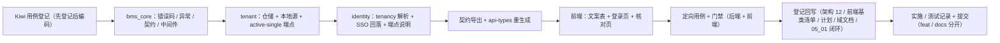

# 01 详细设计 · 登录页租户标识与「需选择租户」语义

> 认证与安全 · 05 登录前端 · 子任务 06（需求 05-6，补充需求）· 详细设计

[文档首页](../../../../../../文档首页.md) › [05 登录前端](../../05_登录前端.md) › [06 登录页多租户选择](../05_登录前端_06_登录页多租户选择.md) › 详细设计　|　[需求 05-6](../../../../需求/05_需求_登录前端.md#r05-6)

## 1. 设计目标与范围 <a id="goal"></a>

把登录页租户标识从「常显可选输入框」改为**默认隐藏、按需展开**，并补齐「未提供租户时后端如何解析」的口径，消除用户拿到技术错误（`80001` / 404）而非可操作引导的缺口：

- **租户标识默认隐藏（需求 05-6 第 1 条）**：登录页默认**不渲染**租户标识输入框；提交时按「本机已记住的租户编码（有则静默带上、不显示该项）→ 域名 / 请求头 → 唯一启用租户」解析；**不做前端预判**（不按部署租户数、不按账号显隐），**不新增免登录部署信息接口**。
- **未提供租户时的解析语义（第 2 条）**：恰好 1 个启用租户 → 采用该租户继续登录；≥ 2 个启用租户 → 认证段返回 **`20007`（需要选择租户）**；0 个启用租户 → 沿用既有失败语义（不新增面）。
- **`20007` 不带租户列表（第 3 条）**：`data` 为空，仅作「请填写租户标识」提示，不暴露租户目录。
- **错误码登记（第 4 条）**：`20007` 进 `bms_core/core/error_codes.py`、公开契约与核心前端文案表 `AUTH_ERROR_TEXTS`。
- **验证码口径（第 5 条）**：`20007` 在**解析租户阶段**返回（早于验证码校验与凭据校验）——不消费挑战、不计失败；前端保留验证码块状态与输入，仅提示补充后重提。
- **前端接入（第 6 条）**：收到 `20007` → 展开租户标识输入框并聚焦，表单级提示「请填写租户标识（当前部署存在多个租户）」；单租户 / 子域名部署下该项永不出现。
- **契约与门禁（第 7 条）**：`20007` 进 identity 公开契约快照、契约快照基线与 `@bms/api-types` 生成类型（零漂移由既有门禁保证）。

**本任务附带打通（经 2026-10-04 逐项确认）**：

- **租户源契约扩展**：`TenantLookup` 增「唯一启用租户」解析方法（`single_active`），本地 / 远端租户源各自实现；
- **租户段新错误码 `80004`**：内部租户注册契约以专用错误码表达「启用租户不唯一」；
- **租户注册只读契约新增端点**：承载「唯一启用租户」查询；
- **免登录链路中间件延迟解析**：`[tenant].deferred_paths` 声明免登录公开面，中间件对这些路径「有来源则解析、无来源置空继续」，否则生产（`allow_demo_fallback=false`）下无租户请求会被中间件直接 404、登录处理器根本不执行，`20007` 无从返回；
- **SSO 入口租户回落**：SSO 入口清单 / 授权端点复用同一「唯一启用租户」解析，无租户且唯一启用租户时正常列清单，多启用租户时返回空清单（不报错）。

**不在本任务**：登录前按账号反查租户 / 账号存在性（《[安全开发规范](../../../../../../规范/安全开发规范.md)》§3 明确禁止项；`11_01` 交付的用户↔租户关系表**只服务登录后**的切换 / 加入）；找回 / 重置前端页面（阶段十五）；验证码场景策略在租户未解析时的租户级读取细化（见 §9 开放项）；`20007` 之外的认证错误码前端文案（沿用既有表）。

**安全影响（SDL）**：`20007` 响应**不带租户清单**（不暴露租户目录）；请求体未知租户**不差异化提示**（沿用「不揭示租户存在性」口径，避免租户编码枚举面）；`20007` 早于验证码与凭据校验返回，**不消费挑战、不计失败**（不构成探测通道）；登录前链路**不查询任何业务数据**（唯一启用租户取数为平台注册数据的**最小必要、非敏感**读取，已在设计中登记理由）。

## 2. 交付物清单 <a id="deliver"></a>

```text
backend/libs/bms_core/src/bms_core/
├── core/error_codes.py                         # 改：新增 TENANT_SCOPE_AMBIGUOUS = 80004
├── core/exceptions.py                          # 改：新增 MultipleActiveTenantsError（80004/409）
├── core/config.py                              # 改：TenantSettings 增 deferred_paths
├── db/tenant.py                                # 改：TenantLookup.single_active 契约 + DEFAULT_DEFERRED_PATHS
│                                               #     + is_deferred_path + resolve_request_tenant 延迟分支
├── db/tenant_remote.py                         # 改：RemoteTenantSource.single_active（契约往返 + 缓存）
└── api/middleware.py                           # 改：TenantMiddleware 传 deferred_paths（延迟解析）

backend/services/tenant/src/bms_tenant/
├── repositories/tenant_registry.py             # 改：single_active 查询（status=active、未软删、LIMIT 2）
├── sources/tenant_source.py                    # 改：LocalTenantSource.single_active
└── api/tenant_registry.py                      # 改：新增 GET /api/v1/tenant-registry/active-single

backend/services/identity/src/bms_identity/
├── api/tenancy.py                              # 改：宽松 body 解析 + 唯一启用租户兜底 + 20007
├── api/auth.py                                 # 改：login docstring 补 NeedTenantError（契约说明）
├── api/password_reset.py                       # 改：forgot / reset docstring 同步（共用解析）
└── api/sso.py                                  # 改：_resolve_sso_tenant 唯一启用租户回落 + providers 空清单

backend/
├── config.toml                                 # 改：[tenant].deferred_paths 缺省清单
├── deploy（仓库根）/contracts/identity.json       # 改：登录端点说明含 20007（导出重生成）
├── deploy（仓库根）/contracts/baseline/identity.json  # 改：基线随快照重生成
├── deploy（仓库根）/contracts/tenant.json          # 改：新增 active-single 路由（导出重生成）
├── deploy（仓库根）/contracts/baseline/tenant.json    # 改：基线随快照重生成
└── tests_support/tenant_source.py              # 改：FakeTenantSource 增 single_active

backend/services/identity/tests/
├── conftest.py                                 # 改：_SeedTenantSource 增 single_active
└── auth/helpers.py                             # 改：FakeTenantSource 增 single_active

frontend/packages/core/
├── src/domain/auth-error.ts                    # 改：AUTH_ERROR_TEXTS 增 20007
└── tests/auth-error.spec.ts                    # 改：20007 文案命中用例

frontend/apps/desktop/
├── src/views/LoginView.vue                      # 改：租户标识默认隐藏 / 20007 触发展开 / SSO 重拉
├── src/dev/LoginCheck.vue                       # 改：自检项按「默认隐藏」调整
├── tests/login-view.spec.ts                     # 改：默认隐藏 / 20007 / 验证码联动 / SSO 重拉
└── tests/login-check.spec.ts                    # 改：核对页自检项同步

frontend/packages/api-types/src/                 # 重生成（identity / tenant；零漂移门禁保证）

bms文档/
├── 设计/架构设计/12_架构设计_子系统_多租户路由.md    # 改：解析链补「唯一启用租户」兜底层
├── 前端基类清单.md                               # 改：宿主横切底座节（租户标识默认隐藏行为登记）
├── 项目/06_认证与安全/需求/05_需求_登录前端.md        # 改：需求 05-6 承接关系注（可选）
├── 项目/06_认证与安全/任务/05_登录前端/…             # 改：05_06 任务文档 §2.8 + 父任务清单 + 05_01 遗留闭环
└── 项目/06_认证与安全/计划/01_计划_认证与安全.md       # 改：进度唯一落点（状态 / 完成日期 / 结论 / 偏差）
```

> 目录树为罗列型内容，按《[文档生成规范](../../../../../../规范/文档生成规范.md)》用目录清单（非 mermaid）。

## 3. 现状实测与缺口 <a id="gap"></a>

| # | 实测项 | 结论 |
| --- | --- | --- |
| 1 | 认证段错误码 | 现为 `20001`~`20006` + `201xx` 验证码 + `20011`~`20016` 会话 + `20051`~`20066` SSO / IdP → **`20007` 为空位可用** |
| 2 | `bms_identity/api/tenancy.py::resolve_request_tenant(body_tenant, context_tenant, source)` | **无任何来源时直接抛 `TenantNotFoundError`（404 / `80001`）**；登录 / 找回 / 重置共用 |
| 3 | `TenantLookup`（`bms_core/db/tenant.py`） | 只有 `by_code` / `by_domain` / `by_id`，**无枚举 / 计数 / 唯一启用租户解析** |
| 4 | 租户注册仓储与契约（tenant 服务） | 只有按 `code` / `domain` / `id` 单条查询，**无全量 / 唯一启用租户查询** |
| 5 | `TenantMiddleware`（`bms_core/api/middleware.py`） | 对**所有非豁免路径**（含 `/api/v1/auth/login`）先解析租户；生产 `allow_demo_fallback=false` 时无来源**就地 404**，**登录处理器不会执行** → `20007` 无从返回（本任务最大缺口） |
| 6 | `api/sso.py::_resolve_sso_tenant` | 无租户来源时同样抛 `TenantNotFoundError`（404）；前端 `fetchSsoProviders(tenant)` 无租户即失败 → 默认隐藏后 SSO 入口在单租户同域首访下也会消失 |
| 7 | 前端 `LoginView.vue` | 租户标识**常显**（`data-test="login-tenant"`），`tenantInput` 缺省回填 `getTenantCode()`，提交体带 `tenant`；SSO 入口挂载即按 `tenant.value` 拉清单 |
| 8 | 前端 `api/tenant.ts` | 只持久化**单个**租户编码（`localStorage` 键 `bms.tenant`）；`signIn` 统一写回 |
| 9 | 前端请求层（`api/http.ts` + `api/response.ts`） | 业务码仅在 **2xx** 经 `unwrap` 抛出 `ApiError(code)`；非 2xx 分支持续丢失业务码 → `20007` **须以 HTTP 200 承载** |
| 10 | 文案表 `core/domain/auth-error.ts::AUTH_ERROR_TEXTS` | 认证段无 `20007`；`isAuthErrorCode` / `resolveAuthErrorText` 依表自动覆盖 |
| 11 | 契约快照机制 | `deploy/contracts/*.json` 由 `ops.contract_snapshot` 内存构建导出；错误码仅现于端点说明（docstring），新路由会改变对应服务快照 |
| 12 | 任务文档 §2.8 | 用例节仍写「恒显示」（废弃稿遗留），与同文档 §2.1 / §3「默认隐藏」冲突——经确认**回写为默认隐藏** |

## 4. 设计与边界 <a id="design"></a>

### 4.1 租户源契约扩展（`TenantLookup.single_active`） <a id="contract"></a>

在 `bms_core/db/tenant.py::TenantLookup` 增一个**窄语义**方法（不枚举、不计数，一次调用定语义）：

```text
TenantLookup（Protocol）
├── by_code(code)    -> TenantContext           # 既有
├── by_domain(domain)-> TenantContext           # 既有
├── by_id(tenant_id)-> TenantContext            # 既有
└── single_active()  -> TenantContext | None    # 新：恰 1 个启用租户 → 其上下文；0 个 → None
                                                #     ≥ 2 个 → 抛 MultipleActiveTenantsError
```

- **语义单一**：0 个返回 `None`（由调用方映射为既有失败语义），≥ 2 个抛专用异常（由调用方映射为 `20007`），恰 1 个直接返回上下文——**不暴露租户清单**、**不做列表枚举**，长期演化面最窄。
- **判定口径**：启用租户 = `status == "active"` 且 `deleted_at IS NULL`（与既有 `by_code` / `by_domain` 完全一致，**不判 `expire_at`**）。
- **缓存与失效**：复用既有租户域缓存与全局版本键——仅在「恰 1 个」时缓存快照（键 `default:active`），开通 / 停用 / 改名由版本键惰性失效；0 个 / ≥ 2 个不写负缓存。

### 4.2 租户段新错误码与异常（`80004` / `MultipleActiveTenantsError`） <a id="errcode"></a>

经确认，「≥ 2 个启用租户」这一**内部契约信号**以**租户段专用错误码**表达（而非复用通用冲突码）：

```text
bms_core/core/error_codes.py
└── TENANT_SCOPE_AMBIGUOUS = 80004        # 开放 / 租户 / SSO 段（8xxxx）内新增

bms_core/core/exceptions.py
└── MultipleActiveTenantsError(OpenTenantError)
    ├── code        = 80004
    ├── http_status = 409                  # 内部契约传输语义（供远端源识别）
    └── data        = None                 # 不携带租户清单
```

- **分工**：`80004` 是**内部**租户注册契约信号；面向登录用户的「需要选择租户」是**认证段 `20007`**——两层解耦，租户段不向用户面暴露。
- **HTTP 语义**：内部端点 `active-single` 以 `409` + `80004` 表达「作用域不唯一」；远端源据状态 / 业务码映射为本异常，identity 捕获后抛 `20007`。

### 4.3 租户注册只读契约新增端点 <a id="endpoint"></a>

在 tenant 服务现有 `tenant-registry` 路由下新增**专用只读端点**（不改变既有端点「三选一」校验语义）：

```text
GET /api/v1/tenant-registry/active-single
├── 恰 1 个启用租户 → 200 + 统一响应 data = 注册快照（现有 _snapshot 形态，含 code / name / domain / tenant_id / db_basis）
├── 0 个启用租户   → 404 + code = 80001（TenantNotFoundError，沿用既有失败语义）
└── ≥ 2 个启用租户 → 409 + code = 80004（MultipleActiveTenantsError）
```

- **鉴权**：与既有 `tenant-registry` 只读端点同口径（内部契约，真实鉴权随 `07_03`）。
- **取数**：`status == "active"` 且未软删，`LIMIT 2` 判个数（不取全量）；`db_basis` 经对照表取数（缺行回落 `code` 并记 WARNING，沿用既有容错）。

### 4.4 本地 / 远端租户源实现 <a id="sources"></a>

```text
LocalTenantSource.single_active()（tenant 服务）
├── 查本服务平台库：status=active 且未软删、LIMIT 2（附对照表 db_basis 左联）
├── 0 行  → None
├── 1 行  → 快照 → TenantContext（写 default:active 缓存）
└── 2 行  → raise MultipleActiveTenantsError

RemoteTenantSource.single_active()（identity 等其余服务）
├── 读 default:active 缓存（版本比对）
└── 未命中 → GET /api/v1/tenant-registry/active-single（经 service_client）
    ├── 200 → 快照 → TenantContext（回填缓存）
    ├── code 80001（404）→ None                 # 0 个启用租户
    ├── code 80004（409）→ raise MultipleActiveTenantsError
    └── 其余非 2xx / 响应非法 → ServiceUnavailableError（沿用既有降级口径）
```

- **远端映射以业务码为准**（解析统一响应体 `code`），避免把「端点不存在」等泛 404 误判为「0 个启用租户」。
- 契约不可达语义沿用既有：生产 fail-fast（`ServiceUnavailableError`），测试 / 开发兜底口径不变。

### 4.5 免登录链路租户解析（宽松 + 唯一启用租户兜底 + `20007`） <a id="resolve"></a>

`bms_identity/api/tenancy.py::resolve_request_tenant` 改为：

```text
resolve_request_tenant(body_tenant, context_tenant, source)
├── body_tenant 非空：
│   ├── by_code(body_tenant) 命中 → 返回
│   └── TenantNotFoundError  → 忽略 body，继续（宽松；不揭示租户存在性）
│       注：TenantSuspendedError / ServiceUnavailableError 照常上抛（租户停用 / 契约故障不掩盖）
├── context_tenant 非空（域名 / 请求头 / 令牌租户位）→ 返回
├── source.single_active()
│   ├── 恰 1 个 → 返回该租户上下文
│   ├── 0 个   → None
│   └── ≥ 2 个 → raise MultipleActiveTenantsError
└── 兜底：raise TenantNotFoundError（沿用既有 404 / 80001 失败语义）
```

- **顺序权威**：「本机记忆（body，仅静默携带）→ 域名 / 请求头（中间件上下文）→ 唯一启用租户」。架构 12 §2 解析链补第 4 级「唯一启用租户（仅登录 / 找回等免登录兜底）」并注明 body 优先（§8 登记回写）。
- **`20007` 抛出点**：登录端点捕获 `MultipleActiveTenantsError` 后抛 `NeedTenantError`（认证段 `20007`）；**抛出点在解析租户阶段**，早于 `service.login()` 内的验证码校验与凭据校验 → **不消费挑战、不计失败**。
- **共用范围**：登录（`/auth/login`）与找回 / 重置（`/auth/forgot-password`、`/auth/reset-password`）共用该解析；找回链路一并按唯一启用租户兜底。
- **宽松分支的收益**：陈旧的本机记忆值不会把用户卡死在 404（输入框默认隐藏、用户难以自解）；同时请求侧不区分「未知租户」，统一收敛到「未提供」路径，**减少租户编码枚举面**。

### 4.6 中间件延迟解析（`[tenant].deferred_paths`） <a id="middleware"></a>

生产 `allow_demo_fallback=false` 场景下，中间件会先于端点拒绝无租户请求——必须为**免登录公开面**提供「延迟解析」：

```text
bms_core/db/tenant.py
├── DEFAULT_DEFERRED_PATHS                 # 缺省延迟路径（前缀语义）
│   ├── /api/v1/auth/login
│   ├── /api/v1/auth/forgot-password
│   ├── /api/v1/auth/reset-password
│   ├── /api/v1/captcha                    # 登录页挂载即取场景策略
│   └── /api/v1/auth/sso                   # SSO 入口清单 / 授权端点
└── is_deferred_path(path, deferred_paths) # 精确匹配或前缀（path == p 或 path.startswith(p + "/")）

resolve_request_tenant(..., deferred_paths=())
└── 来源命中即解析；无来源且命中延迟路径 → 返回 None（不做演示回落、不硬拒）
    无来源且非延迟路径 → 沿用 allow_demo_fallback 口径（dev 回落演示 / 生产拒绝）

TenantMiddleware
└── 按 settings.tenant.deferred_paths 传入；延迟路径无来源时 state["tenant"]=None，端点层再解析
```

- **围栏不降级**：仅列出的免登录路径延迟；受保护路径仍按 `allow_demo_fallback` 硬拒，边缘信任与身份头口径不变。
- **上下文不丢失**：延迟路径**有**来源（子域名 / 请求头 / 令牌位）仍正常解析并注入上下文；仅「无来源」放行至端点层。
- **配置落点**：`TenantSettings.deferred_paths`（`bms_core/core/config.py`）+ `backend/config.toml` `[tenant]` 缺省清单；生产沿用缺省（无需 prod 覆盖）。
- **验证码策略的租户级读取**：无租户时按平台 / 演示缺省读取（登记开放项，见 §9），本任务不细化。

### 4.7 SSO 入口租户回落 <a id="sso"></a>

```text
bms_identity/api/sso.py::_resolve_sso_tenant(tenant, context, source)
├── tenant 与 context 不一致 → SsoProviderNotFoundError（20051，既有）
├── tenant 非空 → by_code(tenant)
├── context 非空 → context
└── 否则 → source.single_active()
    ├── 恰 1 个 → 用之
    ├── 0 个   → raise TenantNotFoundError（既有）
    └── ≥ 2 个 → raise MultipleActiveTenantsError

providers（GET /auth/sso/providers）
└── 捕获 TenantNotFoundError / MultipleActiveTenantsError → 返回空清单（不报错，前端整块不渲染）

authorize / authorize-url
└── MultipleActiveTenantsError → 转 SsoProviderNotFoundError（20051）；TenantNotFoundError 维持既有
```

- **收益**：单租户 / 子域名部署下，未携带租户的首访用户也能看到 SSO 入口（不再因中间件 / 端点 404 而消失）。
- **多启用租户同域**：无从判定租户 → 返回空清单（不报错）；前端在租户已知后重拉（见 §4.8）。

### 4.8 前端：默认隐藏 / `20007` 触发展开 / 验证码联动 / SSO 重拉 <a id="frontend"></a>

```text
LoginView.vue
├── 状态
│   ├── tenantInput      # 缺省回填 getTenantCode()（本机记忆）；无值即空
│   ├── tenantVisible    # 新：默认 false（租户标识不渲染）；收到 20007 置 true
│   └── tenant           # computed（normalizeLoginTenant）；隐藏时仍静默随请求提交
├── 模板
│   └── 租户标识 label  v-if="tenantVisible"（data-test="login-tenant"；挂 ref 供聚焦）
├── onSubmit
│   ├── 成功：session.signIn(...) 统一写回记忆（失败不写）
│   └── 失败：handleLoginFailure(error)
└── handleLoginFailure(error)
    ├── code === 20007 → handleNeedTenant()
    │   ├── formError = resolveAuthErrorText(20007)   # 「请填写租户标识（当前部署存在多个租户）」
    │   ├── tenantVisible = true
    │   ├── await nextTick() → 聚焦租户输入框（querySelector('[data-test="login-tenant"]').focus()）
    │   └── **不** failCount++、**不**刷新验证码（保留验证码块状态与输入）
    └── 其余 code → 既有处置（文案映射 + 验证码块出现 / 刷新）
```

- **默认隐藏不变式**：单租户 / 子域名部署下 `tenantVisible` 恒 `false`，输入框**永不出现**；本机记忆值经 `tenantInput` 初值**静默携带**（不显示该项）。
- **记忆值写回 / 清除（经确认沿用现状）**：登录成功由 `signIn` 以响应租户统一覆盖 `localStorage`；失败（含 `20007`）不写；用户清空输入框提交并成功后清除。
- **聚焦实现**：`TextInput` 的 `data-test` 透传到原生 `<input>`（`05_01` 已核），故以条件区块 `ref` + `querySelector('[data-test="login-tenant"]')` 聚焦，**不改动共享组件**。
- **SSO 重拉**：`watch(tenant)`，当 `tenantVisible` 为真且值变化时重拉 `fetchSsoProviders(tenant)`（后端回落 + 已填值双路径）；挂载期仍按本机记忆值拉一次。清单为空 / 失败整块不渲染，不阻断本地登录。
- **安全口径**：不改密码框不回填 / 不落存储口径；租户编码仍为**非敏感**展示标识（`localStorage` 承载）。

### 4.9 错误码文案与契约生成 <a id="texts"></a>

```text
core/domain/auth-error.ts::AUTH_ERROR_TEXTS
└── 20007: '请填写租户标识（当前部署存在多个租户）'   # isAuthErrorCode / resolveAuthErrorText 自动覆盖

identity 登录 / 找回 / 重置端点 docstring
└── 补 Raises: NeedTenantError（20007）——进 OpenAPI 端点说明

契约生成（子门禁）
├── ops.contract_snapshot export → deploy/contracts/identity.json + tenant.json 及基线
└── pnpm run api-types:gen      → packages/api-types/src/{identity,tenant}.ts（零漂移门禁保证）
```

- **契约版本（经确认）**：**不升**（identity 保持 `0.1.0`）——无路由 / schema 结构变更，仅错误码登记与端点说明；tenant 契约同为内部端点新增，沿用 `11_01` 不升版本先例。

### 4.10 失败分支与边界 <a id="failures"></a>

| 场景 | 处理 |
| --- | --- |
| 无 body、无上下文、恰 1 个启用租户 | 采用该租户继续登录（成功路径） |
| 无 body、无上下文、≥ 2 个启用租户 | `NeedTenantError`（`20007` / HTTP 200）；前端展开 + 聚焦 + 提示 |
| 无 body、无上下文、0 个启用租户 | `TenantNotFoundError`（`80001` / 404，既有失败语义） |
| body 未知租户（含陈旧记忆值） | **宽松**：视为未提供，继续上下文 / 唯一启用租户解析 |
| body 指向已停用租户 | `TenantSuspendedError`（`80002` / 403）上抛，不掩盖 |
| 上下文（域名 / 请求头）指向未知租户 | 中间件 / 端点按既有口径 404 |
| 租户注册契约不可达 | `ServiceUnavailableError`（`10007` / 503）fail-closed；测试 / 开发兜底口径不变 |
| 多启用租户 + 前端重提且填了**有效**租户 | body 命中 → 正常登录；SSO 清单可重拉 |
| 多启用租户 + 前端重提仍无法唯一解析 | 再次 `20007`（前端保持展开态，用户继续修正） |
| SSO 清单：无租户且 ≥ 2 个启用租户 | 返回空清单（不报错），前端整块不渲染 |
| SSO 清单：无租户且恰 1 个启用租户 | 正常返回该租户 IdP 清单 |
| `20007` 时验证码块状态 | **保留**（不刷新挑战、不清输入、不计失败），仅提示补充租户 |

## 5. 兼容性与消费方影响 <a id="compat"></a>

- **租户源契约扩展**：`TenantLookup` 新增 `single_active` 方法——所有实现（本地 / 远端 / 测试替身 `FakeTenantSource` / `_SeedTenantSource`）同步实现；既有 `by_code` / `by_domain` / `by_id` 语义**逐字节不变**。
- **中间件延迟路径**：仅对缺省列出的免登录路径生效，其余路径（受保护 / 豁免）行为不变；`allow_demo_fallback` 语义在非延迟路径上不变。
- **identity 解析语义变更**：`body` 未知租户由「404」改「宽松视为未提供」——既有直接调用分支的用例同步改写（`test_login_body_tenant_override` / `test_resolve_login_tenant_branches`）。
- **SSO 端点行为扩展**：无租户不再一律 404，新增「唯一启用租户回落 + 多租户空清单」；既有 `必带租户` / `不一致即 20051` 口径不变。
- **前端**：`LoginView.vue` 租户标识默认不渲染——既有「常显 / 必填元素」用例同步改写；`data-test="login-tenant"` 在展开后才存在。
- **`20007` 消费方**：核心文案表新增；移动端登录页（阶段十七）同口径复用。
- **`05_01` 消费面**：其详细设计 §7「租户标识多租户选择」遗留闭环回指本任务；§8.3 判定机制表述同步为「默认隐藏 / 20007 触发展开」。
- **契约**：identity 端点说明更新、tenant 新增内部路由——快照 / 基线 / 生成类型重生成；版本不升。

## 6. 安全口径 <a id="security"></a>

| 口径 | 落实 |
| --- | --- |
| 不暴露租户目录 | `20007` / `80004` 响应 `data` 均为空；`single_active` 不返回列表；内部端点仅返回单条或错误 |
| 不揭示租户存在性 | body 未知租户按「未提供」处理（不区分「不存在」与「未提供」），减少租户编码枚举面 |
| 登录前不查业务数据 | 唯一启用租户取数仅读平台注册数据（`sys_tenant`，非业务数据、非账号反查），属免认证链路**最小必要非敏感读取**，在本设计登记理由 |
| 禁止账号反查 | 不引入任何按账号查询租户 / 账号存在性的接口；`11_01` 关系表不出现在免认证面 |
| 验证码不被利用 | `20007` 早于挑战消费与凭据校验，**不消费、不计失败**，不构成探测通道 |
| 口令口径不变 | 密码不回填、不落存储、明文切换仅内存态（`05_01` 已锁定，本任务不触碰） |

## 7. 测试设计与验收映射 <a id="test"></a>

用例**先登记 Kiwi TCMS 再编码**（经确认：**后端 / 前端各登记 1 条**策展用例，分类「平台骨架」/ P2 / `CONFIRMED` / 标签「自动化」；编号以平台回读为准并回填代码与本记录）。

| # | 用例（组） | 落点 | 断言要点 |
| --- | --- | --- | --- |
| 1 | 租户源 `single_active`（本地） | `services/tenant/tests/...` | 0 个 → `None`；恰 1 个 → 上下文（含雪花主键）；≥ 2 个 → `MultipleActiveTenantsError`（含软删 / 停用过滤） |
| 2 | 租户源 `single_active`（远端） | `libs/bms_core/tests/db/...` | 契约 200 往返 → 上下文；`code 80001` → `None`；`code 80004` → `MultipleActiveTenantsError`；契约不可达 → `ServiceUnavailableError`；缓存版本失效 |
| 3 | 契约端点 `active-single` | `services/tenant/tests/...` | 恰 1 → 快照；0 → `80001` / 404；≥ 2 → `80004` / 409；`db_basis` 缺对照行回落并 WARNING |
| 4 | identity 解析分支 | `services/identity/tests/auth/test_login.py::test_resolve_login_tenant_branches`（改写） | body 命中 → 该租户；body 未知 → 宽松继续（命中上下文）；无来源 + 恰 1 → 该租户；无来源 + ≥ 2 → `MultipleActiveTenantsError`；无来源 + 0 → `TenantNotFoundError` |
| 5 | 登录端点：单启用租户留空直登 | `test_login.py`（新） | 无 body / 无租户头、单启用租户 → 200 + `LoginResult`；`allow_demo_fallback=false` 下中间件放行 |
| 6 | 登录端点：多启用租户返回 `20007` | `test_login.py`（新） | 无 body / 无租户头、≥ 2 启用租户 → HTTP 200 + `code=20007` + `data=null`；前端据码分流 |
| 7 | `20007` 不消费验证码 / 不计失败 | `test_login.py`（新） | `FakeCaptcha.seen` 为空、org `login-state` 未被失败调用、会话未落库 |
| 8 | 凭据错误仍 `20002`；停用租户仍 `80002` | `test_login.py`（新 / 改写） | 提供有效租户后错误凭据 → `20002`；body 指向停用租户 → `80002`（宽松不掩盖异常） |
| 9 | SSO 入口回落 | `services/identity/tests/sso/test_providers.py`（新） | 无租户 + 恰 1 启用租户 → 清单；无租户 + ≥ 2 启用租户 → 空清单（不报错）；`_resolve_sso_tenant` 分支 |
| 10 | 中间件延迟路径 | `libs/bms_core/tests/api/test_tenant_middleware.py`（新） | 延迟路径无来源 → 放行（`state["tenant"]=None`）；非延迟路径无来源 + `allow_demo_fallback=false` → 拒；延迟路径有来源 → 正常注入 |
| 11 | 契约与生成件 | `ops.contract_snapshot check` / `api-types --check` | 快照 / 基线与生成类型零漂移；`20007` 现于 identity 登录端点说明；tenant 含 `active-single` |
| 12 | 前端：默认隐藏 | `apps/desktop/tests/login-view.spec.ts` | 初始不渲染 `[data-test="login-tenant"]`；本机记忆值仍随请求体 `tenant` 提交 |
| 13 | 前端：`20007` 触发展开 | 同上 | 收到 `20007` → 输入框出现 + 聚焦 + 表单级提示取 `AUTH_ERROR_TEXTS[20007]` |
| 14 | 前端：与验证码块联动 | 同上 | `20007` **不**刷新验证码、**不**增失败计数；验证码块状态与输入保留；重提带租户成功后回跳 |
| 15 | 前端：SSO 重拉 | 同上 | 展开且租户值变化时重拉 `fetchSsoProviders`；清单为空整块不渲染 |
| 16 | 前端文案表 | `packages/core/tests/auth-error.spec.ts` | `20007` 命中专用文案；`isAuthErrorCode(20007)` 为真 |
| 17 | 宿主核对页 | `apps/desktop/tests/login-check.spec.ts` | 自检项按「默认隐藏 / 20007」更新后全通过 |
| 18 | 既有用例回归 | 后端 / 前端定向 | 受影响服务与包既有用例全绿（含改写项） |

**验收映射**：需求 05-6「单租户 / 子域名部署不出现该项、留空直登」→ 用例 5 / 12；「多租户同域留空返回 `20007` 且不消费验证码、前端展开后提交成功」→ 用例 6 / 7 / 13 / 14；「本机记忆静默带上且不显示」→ 用例 12；「登录前无按账号查询」→ §6 + 用例 7；「`20007` 响应体不含租户清单」→ 用例 6 / 11；「契约四道门禁全绿且生成类型含 `20007`」→ 用例 11；「`vue-tsc` / ESLint / Vitest / 后端 pytest 全通过」→ 用例 18 + 门禁命令（§10）。

**执行范围**：只跑受变更影响的定向用例（`bms_core` 租户源 / 中间件 + tenant + identity 认证 / SSO；前端 `@bms/core` 文案表 + `@bms/desktop` 登录页 / 核对页），不跑全量后端与前端全量（口径见《[AI开发规范](../../../../../../规范/AI开发规范.md)》）；新增 / 变更模块覆盖率 100%。

## 8. 登记落点 <a id="registry"></a>

| 内容 | 落点 |
| --- | --- |
| 「唯一启用租户」解析层（免登录兜底） | 《[架构设计 · 多租户路由](../../../../../../设计/架构设计/12_架构设计_子系统_多租户路由.md)》§2 解析链第 4 级 + 本设计（§4.5） |
| 租户段错误码 `80004` / 认证段 `20007` | `bms_core/core/error_codes.py` + 本设计（§4.2 / §4.9） |
| 免登录链路延迟解析路径 | `bms_core/core/config.py` + `backend/config.toml` `[tenant].deferred_paths` + 本设计（§4.6） |
| tenant 内部只读契约新增端点 | `deploy/contracts/tenant.json` + 本设计（§4.3） |
| 登录页租户标识默认隐藏 / `20007` 触发展开 | 《[前端基类清单](../../../../../../前端基类清单.md)》「宿主横切底座」节 + 本设计（§4.8） |
| 认证错误码文案表（核心） | `core/domain/auth-error.ts` + 本设计（§4.9） |
| 界面呈现基准 | 《[原型设计 · 登录页](../../../../../../设计/原型设计/03_通用骨架/02_登录页.html)》（已按定稿口径重做） |
| 阶段计划：`05_06` 条目与进度 | 阶段计划表（进度唯一落点，见 §11 门禁回写） |
| 消费方遗留闭环 | `05_01` 详细设计 §7 / §8.3（本任务承接） |
| Kiwi TCMS / 测试资产仓 | 登记本任务后端 / 前端各一条用例并回读编号 |
| 实施 / 测试记录 | 本目录 `实施/`、`测试/` |

## 9. 边界与开放项 <a id="boundary"></a>

- **验证码场景策略在租户未解析时的租户级读取**：中间件延迟后，无租户时按平台 / 演示缺省读取；登录页在租户已知后是否重拉策略（按目标租户读取更精确的政策）→ **登记后续评估**，本任务不细化。
- **`expire_at` 到期租户不计入「启用」**：沿用既有解析链口径（不判有效期），如需到期即拒另立（与全线口径一致）。
- **`20007` 前端文案与交互的国际化**：宿主未引入 i18n（沿用 `05_01` 口径），接入语言能力后本表转缺省语言包。
- **多标签页租户记忆同步**：沿用「单标签」口径（`05_02` 登记），归阶段十五。
- **注册页租户标识显示口径**：注册原型与本登录口径已统一为「默认隐藏 / 无法解析才展开」，功能落地另行立项（见 `05_06` 立项记忆），不在本任务。
- **`deferred_paths` 的长期治理**：新增免登录公开面（如后续找回 / 注册通道）须同步登记延迟路径，避免再次出现中间件误拒；登记为口径提醒。

## 10. 实施步骤与关键命令 <a id="steps"></a>



1. 读《[KiwiTCMS部署使用说明](../../../../../../资料/开发服务器/linux/KiwiTCMS部署使用说明.md)》「用例约定」节，登记后端 / 前端用例并**回读编号**。
2. `bms_core`：错误码 `80004` + 异常 + `TenantLookup.single_active` 契约 + `resolve_request_tenant` 延迟分支 + 中间件传参 + `TenantSettings.deferred_paths` + `config.toml`。
3. tenant：仓储 `single_active` 查询 + 本地源实现 + `active-single` 端点。
4. identity：`tenancy.py` 宽松 + 兜底 + `NeedTenantError`；`sso.py` 回落；`auth.py` / `password_reset.py` 端点说明。
5. 契约与类型：`ops.contract_snapshot export` → `api-types:gen`。
6. 前端：`auth-error.ts` 文案 + `LoginView.vue`（默认隐藏 / `20007` / SSO 重拉）+ `LoginCheck.vue`。
7. 测试替身同步（`tests_support` / identity conftest / auth helpers）+ 定向用例。
8. 门禁（§下命令）+ 登记回写 + 实施 / 测试记录 + 代码与文档分开提交（`feat` / `docs`）。

关键命令：

```bash
# 后端（bms/backend）
uv run pytest libs/bms_core/tests services/tenant/tests services/identity/tests -q
uv run ruff check . && uv run ruff format --check . && uv run pyright
uv run python -m ops.contract_snapshot check
# 前端（bms 根）
pnpm --filter @bms/desktop run test
pnpm --filter @bms/desktop run lint
pnpm --filter @bms/desktop exec vue-tsc -b
pnpm run core:test && pnpm run core:typecheck && pnpm run core:lint
pnpm run api-types:gen:check
# 文档基座（bms 根）
python3 scripts/tools/check-docs/check-status.py --stage 06_认证与安全 --strict
python3 scripts/tools/base-check/check-links.py
python3 scripts/tools/base-check/check-docs-scope.py
python3 scripts/tools/preflight/check-preflight.py --fast
```

## 11. 门禁结论与回写清单 <a id="rewrite"></a>

本条为阶段六收口后补遗**最后一项**；完成后阶段「剩余」应回到 0：

- **计划表**：`05_06` 由 §3 剩余表移除、登记入 §2 已完成（状态 / 完成日期 / 任务文件 / 偏差与遗留）；头部计数由「剩余 1 项」改为「剩余 0 项」；统计行按「已完成等于阶段合计、剩余归零」回写；域 05 由**部分完成**改**完成**；阶段计划的域五补遗图示节点同步移除。
- **门禁结论**：计划 §5 增「**补遗门禁结论 —— `05_06`**」段，逐条对照需求 05-6 完成标准（单 / 子域名不出现该项、多租户 `20007` 不消费验证码、记忆值静默携带、无账号反查、响应不含目录、契约四道门禁 + 生成类型含 `20007`、前端与后端门禁全绿）。
- **域文档**：`任务/05_登录前端/05_登录前端.md` 清单 / 说明同步。
- **消费方闭环**：`05_01` 详细设计 §7 遗留改「已闭环（`05_06`）」，§8.3 判定机制表述同步。
- **任务文档**：`05_06` §2.8 用例节「恒显示」→「默认隐藏 / `20007` 触发展开」。

## 12. 参考文档 <a id="ref"></a>

- [需求 05-6](../../../../需求/05_需求_登录前端.md#r05-6)（含三轮修正定稿注）、[需求 05-1](../../../../需求/05_需求_登录前端.md#r05-1) 第 1 条、[需求 01-3](../../../../需求/01_需求_认证与会话.md#r01-3)、[需求 11-1](../../../../需求/11_需求_租户自助与用户租户关系.md#r11-1)
- [05_06 任务文档](../05_登录前端_06_登录页多租户选择.md)、[05_01 登录页真实实现](../../05_登录前端_01_登录页真实实现/05_登录前端_01_登录页真实实现.md) 及其[详细设计](../../05_登录前端_01_登录页真实实现/设计/01_详细设计_01_登录页真实实现.md)
- 《[架构设计 · 多租户路由](../../../../../../设计/架构设计/12_架构设计_子系统_多租户路由.md)》、《[架构设计 · 认证与会话](../../../../../../设计/架构设计/14_架构设计_子系统_认证与会话.md)》、《[安全开发规范](../../../../../../规范/安全开发规范.md)》§3
- 《[原型设计 · 登录页](../../../../../../设计/原型设计/03_通用骨架/02_登录页.html)》、《[前端基类清单](../../../../../../前端基类清单.md)》「宿主横切底座」节、《[KiwiTCMS部署使用说明](../../../../../../资料/开发服务器/linux/KiwiTCMS部署使用说明.md)》「用例约定」节
- [11_01 用户↔租户关系与租户自助真实化](../../../11_租户自助与用户租户关系/11_租户自助与用户租户关系_01_用户租户关系与租户自助真实化/11_租户自助与用户租户关系_01_用户租户关系与租户自助真实化.md)（登录后租户切换，与登录定位租户解耦）

## 13. 决策确认（逐项） <a id="decisions"></a>

| # | 事项 | 结论 |
| --- | --- | --- |
| 1 | 「启用租户」取数方案 | **扩展 `TenantLookup` 契约**：新增唯一启用租户解析方法，本地 / 远端各自实现，复用既有缓存与版本键；租户注册契约加只读端点 |
| 2 | 契约方法形态与命名 | `single_active() -> TenantContext \| None`（0 → None；恰 1 → 上下文；≥ 2 → 抛专用异常） |
| 3 | 「启用」判定口径 | `status == "active"` 且未软删（与既有解析链一致，不判 `expire_at`） |
| 4 | 注册契约端点形态 | **新增专用只读端点** `GET /api/v1/tenant-registry/active-single`（不改既有端点校验语义） |
| 5 | 内部「多租户」信号 | **新增租户段专用错误码 `80004`（`TENANT_SCOPE_AMBIGUOUS`）** |
| 6 | 多租户异常落点 | `bms_core` 新增 `MultipleActiveTenantsError(OpenTenantError)`（码 `80004` / HTTP 409） |
| 7 | `20007` 常量命名 | `TENANT_REQUIRED = 20007` |
| 8 | `20007` 异常类 | `NeedTenantError(AuthError)` |
| 9 | `20007` HTTP 状态 | **200（业务失败）**——前端请求层只在 2xx 解包业务码 |
| 10 | `20007` 响应体 | `data = null`（不带租户清单） |
| 11 | body 租户无效分支 | **宽松**：视为未提供，继续域名 / 请求头 / 唯一启用租户解析 |
| 12 | 免登录路径与中间件 | **延迟路径涵盖免登录公开面**：`[tenant].deferred_paths`（login / forgot / reset / captcha / sso） |
| 13 | SSO 入口降级 | **后端同套唯一启用租户回落**；多启用租户同域返回空清单；前端租户已知后重拉 |
| 14 | 记忆值写回 / 清除 | 沿用 `signIn` 统一写回；失败不写；清空输入并成功后清除 |
| 15 | 契约版本口径 | **不升**（identity 保持 `0.1.0`；tenant 内部端点沿用不升先例） |
| 16 | 任务文档 §2.8 不一致 | 回写为「默认隐藏 / `20007` 触发展开」 |
| 17 | 架构 12 解析链 | 补第 4 级「唯一启用租户（免登录兜底）」并注明 body 优先 |
| 18 | Kiwi 用例登记粒度 | 后端 / 前端**各 1 条** |
| 19 | `05_01` 遗留闭环 | 回写 §7 / §8.3 指向本任务已交付 |

## 14. 对齐记录 <a id="align"></a>

| # | 事项 | 结论 |
| --- | --- | --- |
| 1 | 复用既有口径 | 服务段寻址 / 契约类型 / 会话 `signIn` / 回跳 `resolveSafeRedirect` / 守卫均既有，本任务只做解析与展示口径改造 |
| 2 | 决策来源 | 2026-10-04 逐项 `question` 确认（§13，含 `80004` 与中间件延迟路径两项非冻结口径新增） |
| 3 | 冻结口径遵循 | 默认隐藏 / 唯一启用租户 / `20007` 不带列表 / 不消费验证码 / 禁止账号反查 / `20007` 四类登记，逐条照做 |
| 4 | 待回写差异 | 实施期如发现偏差，按《[AI开发规范](../../../../../../规范/AI开发规范.md)》「变更纪律」先回写本设计再推进 |

> 本文档依《[文档生成规范](../../../../../../规范/文档生成规范.md)》编写 · 关键决策逐项确认（2026-10-04）
