# 01 实施 · 认证契约快照与前端类型生成（含服务契约路由覆盖护栏）

> 认证与安全 · 06 契约与模块请求能力 · 子任务 01（需求 06-1、06-3）· 实施记录

[文档首页](../../../../../../文档首页.md) › [01 认证契约快照与前端类型生成](../06_契约与模块请求能力_01_认证契约快照与前端类型生成.md) › 实施记录　|　[← 任务](../06_契约与模块请求能力_01_认证契约快照与前端类型生成.md)　[测试记录 →](../测试/01_测试_01_认证契约快照与前端类型生成.md)

## 1. 实施信息 

| 项 | 值 |
| --- | --- |
| 任务 | [01 认证契约快照与前端类型生成](../06_契约与模块请求能力_01_认证契约快照与前端类型生成.md) |
| 对应需求 | [06-1](../../../../需求/06_需求_契约与模块请求能力.md#r06-1)、[06-3](../../../../需求/06_需求_契约与模块请求能力.md#r06-3)（路由覆盖护栏，补充立项） |
| 详细设计 | [01 详细设计](../设计/01_详细设计_01_认证契约快照与前端类型生成.md) |
| 实施日期 | 2026-10-02 |
| 实施人 | minjian |
| 实施环境 | 本地开发机（Python 3.14.4 / uv；Node 24 / pnpm 11；依赖外置 `DEPS_DIR`；本地 oasdiff 二进制 v1.32.1） |
| 提交 | 详细设计 `9ab06202`；实施 / 文档 / 记录随本次提交 |
| 结论 | 完成（需求 06-1 全部核验项通过 + 需求 06-3 护栏落地；无阻塞遗留） |

```mermaid
flowchart LR
    A["需求回写：新增需求 06-3（域 06 / 总览 / 总清单，36 → 37）"] --> B["详细设计定稿（15 项决策确认）"]
    B --> C["service_contract.py：白名单常量 + service_route_sets + route_coverage_gaps + hidden_route_violations"]
    C --> D["ops/contract_snapshot.py：抽 build_app（build_openapi 改调用之）"]
    D --> E["ops/check_contracts.py 新增（断言 A + B，提取为空判失败）"]
    E --> F["用例：test_service_contract.py 扩充 + tests/ops/test_check_contracts.py（Kiwi 2227）"]
    F --> G["门禁接入：CI swagger-snapshot + check-preflight 契约段"]
    G --> H["identity 契约基线更新为当前认证契约（3559 插入）"]
    H --> I["消费方标注：域五 4 任务 + 父任务；规范 §7.4 + 基类清单登记"]
    I --> J["验证：定向 202 passed / 覆盖率 / preflight --fast 全绿"]
```

## 2. 实施概览 

## 3. 实施过程 

1. **需求侧回写（先动需求与任务，再动代码）**：需求域 06 新增 [需求 06-3 服务契约路由覆盖护栏](../../../../需求/06_需求_契约与模块请求能力.md#r06-3)（背景 / 内容 / 完成标准 / 参考），域头「3 条」；需求总览同步文档表、范围内计数（36 → **37**）、总清单（新增 `06-3` 行）、需求域地图（域 06 由 2 → 3）、合计（36 → **37**）、已定口径新增第 22 条；任务 06_01 任务信息（对应需求加 06-3）、任务内容新增第 6 条、完成标准补护栏；父任务 06 域说明与子任务表、风险登记；阶段计划相关行（需求计数 / 域 06 工作量 / 执行序 / 剩余表）随收尾回写。
2. **详细设计定稿**：`设计/01_详细设计_01_认证契约快照与前端类型生成.md`（Design：契约覆盖核对清单 / 护栏口径与签名 / 基线更新 / 消费方标注 / 失败分支 / 测试映射 / 登记落点 / 边界 / 15 项拍板对齐）；文档校验 `check-links` / `check-docs-scope` / `check-status` 全绿后提交 `9ab06202`。
3. **契约覆盖核对（需求 06-1）**：`ops.contract_snapshot check` 通过（9 服务快照零漂移）；identity 公开契约 36 条路径（32 条 `/api/v1/*` 认证相关 + `/`、`/.well-known/jwks.json`、`/healthz`、`/readyz`），`components.schemas` 56 个、含 401/403/404/422 → `ApiResponse` 错误响应；契约版本 `info.version` ＝ 服务包 `CONTRACT_VERSION` ＝ `sys_module.contract_version` ＝ `0.1.0`（**保持不动**）；`pnpm run api-types:gen:check` 零漂移（9 份服务类型一致）。
4. **护栏纯判定（`bms_core/services/service_contract.py`）**：新增 `INVISIBLE_ROUTE_WHITELIST`（`/docs` / `/redoc` / `/openapi.json` / `/docs/oauth2-redirect` / `/metrics`）、`service_route_sets(app)`（**鸭子类型**递归遍历路由树：优先 `effective_candidates()` 下钻，其次 `routes` 属性下钻，叶节点按 `path` + `include_in_schema` 归入「计入契约 / 被排除」两集合）、`route_coverage_gaps(implemented, paths)`（断言 A）、`hidden_route_violations(hidden, *, whitelist=None)`（断言 B）；`__all__` 同步。
5. **应用构建入口复用（`ops/contract_snapshot.py`）**：抽出 `build_app(service_key)`（内存构建，不启 lifespan / 不连库），`build_openapi` 改为调用之——**行为逐字节不变**，供护栏与快照共用同一构建入口。
6. **护栏命令（`ops/check_contracts.py` 新增）**：`build_parser` / `_contract_paths`（鸭子类型读 `paths`，兼容内置 dict 与基座集合类）/ `check_service`（构建失败、提取为空、断言 A、断言 B 四类明细）/ `check_all` / `main`（`--service` 指定单服务，缺省全部启用服务；通过 0 / 失败 1）；CLI 体例与 `ops/check_modules.py` 一致。
7. **用例（Kiwi 2227，先登记后编码）**：
   - `libs/bms_core/tests/services/test_service_contract.py` 扩充 5 例（路由提取含嵌套惰性容器与路由器下钻、空路由可检出、断言 A 差异、断言 B 白名单与越界、自定义白名单）；
   - `libs/bms_core/tests/ops/test_check_contracts.py` 新增 6 例（覆盖通过 / 漏登 / 隐藏越界 / 提取为空 / 构建失败 / `check_all` 聚合与 `main` 退出码，桩应用 monkeypatch `build_app`）。
8. **门禁接入**：`.gitlab-ci.yml` 的 `swagger-snapshot` job 在 `contract_snapshot check` 后增 `uv run python -m ops.check_contracts`；`scripts/tools/preflight/check-preflight.py` 契约段同口径增一步（CI 与本地同口径）。
9. **identity 契约基线更新**：`uv run python -m ops.contract_gate baseline-update --service identity`，把当前认证契约写入 `deploy/contracts/baseline/identity.json`（+3559 / −178 行）；本地以 oasdiff 二进制（v1.32.1）复现 9 服务 `baseline ↔ 当前契约`，breaking = **0**。
10. **消费方标注与登记回写**：域五 `05_01` / `05_02` / `05_03` / `05_04` 四任务与域五父任务补「前置契约（已交付 · 06_01）· 契约类型」标注；《[后端开发规范](../../../../../../规范/后端开发规范.md)》新增 §7.4「契约与门禁（强制）」；《[后端基类清单](../../../../../../后端基类清单.md)》§9 增「契约路由覆盖护栏」行并补登 `build_app` 复用。
11. **验证**：定向 `pytest`（`libs/bms_core/tests/services` + `tests/ops`）= **202 passed**；`ruff check` / `ruff format --check` 全绿；`check-bare-collections` 无新增违规；`check-backend-base` / `check-base` / `check-links` / `check-docs-scope` / `check-status` 全绿；`preflight --fast` **全部通过**。

## 4. 问题与处置 

| # | 问题 / 现象 | 原因 | 处置与落点 |
| --- | --- | --- | --- |
| 1 | 按 `app.routes` 取实现路由只得 1 条（`api=1`），与契约 35~36 条不匹配 | FastAPI **0.141** 引入惰性路由：`include_router` 结果为 `_IncludedRouter`，真实路由在 `effective_candidates()` 返回的 `_EffectiveRouteContext` 中 | 改为**鸭子类型**递归：优先 `effective_candidates()`、其次 `routes` 属性下钻，叶节点按 `path` + `include_in_schema` 归集；生产代码不硬依赖框架私有类名 |
| 2 | `check-status` 报硬规则不合规「H5 对应需求不存在：26-10」 | 任务文档「对应需求」行内的日期 `2026-10-02` 被编号正则（`\d+-\d+`）误捕 | 该行去掉日期（改「（路由覆盖护栏，补充立项）」）；复校 0 硬 0 软 |
| 3 | `check-bare-collections` 对 `Mapping` / `dict` 注解会判违规（08_02 已取消全部豁免） | 护栏只白名单插入序基座集合类 | 新代码一律用 `ConcurrentStableSet` / `ConcurrentStableList`；`paths` 读取改**鸭子类型**（`get` / `keys`）以避免 `isinstance(x, dict)` 与抽象注解 |
| 4 | 用例首跑失败：`check_service` 对「全部路由都被隐藏」的服务误报「未提取到任何实现路由」 | 空判定只看 `visible`，未看 `invisible` | 判定改「`visible` 与 `invisible` **同空**才算提取失败」；断言 B 得以覆盖隐藏越界场景 |
| 5 | 桩应用 `openapi()` 返回基座集合类时 `_contract_paths` 取不到 `paths` | 原实现 `isinstance(openapi, dict)` 只认内置 dict | `_contract_paths` 改鸭子类型（`hasattr(get)` + `callable(keys)`），兼容内置 dict 与基座集合类；真实服务与桩均可 |
| 6 | `ruff` 报 E501（用例桩构造行超长）与 I001（import 排序） | 行超 120 / `ops` 属 first-party 应排在 `bms_core` 前 | 重排该行；import 顺序按 ruff isort 调整 |
| 7 | 设计原定新增用例文件 `test_service_contract_coverage.py`、命令签名 `check_service(root, service_key)` | 与被测模块内聚性、护栏不读文件系统的实际最优不符 | **先回写设计**（§2 交付物第 4 项、§5 用例表、§3.2 命令签名）再实施：用例并入 `test_service_contract.py`；命令去掉 `root` 参数 |

## 5. 验证结果 

| 项 | 命令 | 结果 |
| --- | --- | --- |
| 路由覆盖护栏（真跑 9 服务） | `uv run python -m ops.check_contracts` | **通过**：9 服务实现路由全部进入契约、不可见路由均在白名单 |
| 契约快照零漂移 | `uv run python -m ops.contract_snapshot check` | 通过：9 个启用服务快照与公开契约一致 |
| 契约破坏性变更（本地复现） | 本地 oasdiff v1.32.1 `breaking` × 9 服务 | 9 服务 breaking = **0** |
| 前端类型零漂移 | `pnpm run api-types:gen:check` | 通过：9 份服务契约类型一致 |
| 定向用例 | `uv run pytest -q libs/bms_core/tests/services libs/bms_core/tests/ops` | **202 passed** |
| 静态检查 | `uv run ruff check` / `ruff format --check`（改动文件） | 全绿 |
| 集合声明护栏 | `check-bare-collections.py` | 通过（基线 0 处存量、无新增违规） |
| 后端基座合规 | `check-backend-base.py` | 通过（继承链 / 清单登记 / 数据类语义 / 错误码段位 / 迁移链） |
| 基座完整性 | `check-base.py` | 通过（清单 ↔ 磁盘 189 / 189、跨文档引用 0） |
| 文档链接 / 口径 / 状态 | `check-links.py` / `check-docs-scope.py` / `check-status.py` | 0 断链 0 失效锚点 / 违规 0 处 / 0 硬 0 软 |
| 本地预检 | `python3 scripts/tools/preflight/check-preflight.py --fast` | **全部通过**（含新增 `check_contracts` 步骤） |

## 6. 覆盖率 

| 模块 | 语句 | 未覆盖 | 覆盖率 |
| --- | --- | --- | --- |
| `bms_core/services/service_contract.py` | 75 | 0 | **100%** |
| `ops/check_contracts.py` | 55 | 1 | 98%（唯一未覆盖行＝`if __name__ == "__main__"` 启动块，由命令**真跑**覆盖，不计入 pytest 统计） |

## 7. 偏差与遗留 

**偏差（均已回写设计）**：

1. 用例文件落点：设计原定新增 `libs/bms_core/tests/services/test_service_contract_coverage.py`，实际并入既有 `test_service_contract.py`（同被测模块内聚、减少文件碎片）。
2. 命令签名：设计原定 `check_service(root, service_key)` / `check_all(root)`，实际去掉 `root`（护栏不读文件系统，构建入口自持定位）。

**遗留（归口登记）**：

| # | 事项 | 归口 |
| --- | --- | --- |
| 1 | 框架惰性路由内部结构（FastAPI `_IncludedRouter` / `_EffectiveRouteContext`）随框架大版本可能变化 | 提取为鸭子类型且**提取为空即判失败**（宁可报错不可漏检）；框架升级时复核（阶段计划 §7） |
| 2 | 契约版本自动回写（CI 取 OpenAPI 版本写入服务目录） | 契约门禁需求开放项（阶段二 `09_03` 边界） |
| 3 | CI 侧新护栏与门禁的远程实证 | 推送后手动触发一次流水线（不盯守） |

> 实施记录依《[文档生成规范](../../../../../../规范/文档生成规范.md)》编写
