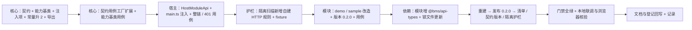

# 01 实施记录 · 模块请求能力 `api` 与契约版本升 2

> 认证与安全 · 06 契约与模块请求能力 · 子任务 02（需求 06-2）· 实施记录

[文档首页](../../../../../../文档首页.md) › [06 契约与模块请求能力](../../06_契约与模块请求能力.md) › [02 模块请求能力 api 与契约版本升 2](../06_契约与模块请求能力_02_模块请求能力api与契约版本升2.md) › 实施记录　|　[详细设计](../设计/01_详细设计_02_模块请求能力api与契约版本升2.md)　[测试记录 →](../测试/01_测试_02_模块请求能力api与契约版本升2.md)

## 1. 实施范围与依据

按[详细设计](../设计/01_详细设计_02_模块请求能力api与契约版本升2.md)实施：核心请求能力契约与能力基类、注入上下文新增 `api`（契约版本升 2）、宿主实现与装配注入、隔离护栏新增自建 HTTP 规则、demo / sample 双模块改造与版本升 0.2.0 重发布、契约用例工厂扩展、文档与登记回写。

本轮 11 项待拍板事项与实施中新出的 1 项（模块类型消费方式）均逐项确认后执行，结论见设计 §8.1 与本文档 §7。

## 2. 实施过程



1. **核心契约与能力基类**：新增 `contracts/module-api.ts`（`ModuleApi` / `ModuleApiRequest`）与 `capabilities/module-api.ts`（`BaseModuleApi`，父 `BasePlaceholderState`）；`module/types.ts` 的 `ModuleHostContext` 增 `api?: ModuleApi`；`module/contract.ts` 与 `frontend/module-contract.json` 同步升 `2`；`src/index.ts` 具名导出；`capabilities/manifest.ts` 登记能力键 `module-api`（依赖 `placeholder-state`）；`module-context.ts` 头部注释补请求能力项。
2. **契约用例工厂**：`testing/module.ts` 新增请求能力契约断言（冻结注入探针 `api` 不得抛错、探针五法齐备）并导出探针构造器；新增 `tests/module-api.spec.ts`（服务键 + 路径寻址 / 写方法自动幂等键 / 抽象幂等键实现点 / 未注入占位 / 非法服务键）。
3. **宿主实现与注入**：新增 `apps/desktop/src/api/module-api.ts`（`HostModuleApi` 覆写幂等键口径 + `createModuleApi()`）；`main.ts` 的 `installModules(...)` 增 `api` 注入项；新增 `tests/module-api.spec.ts`（整链 + 401 静默刷新透明 + 刷新失败 + 业务失败 + 非法服务键）。
4. **隔离护栏**：`scripts/check-module-isolation.mjs` 的 `PATTERNS` 增 `bareHttp`（裸 `fetch(` / `new XMLHttpRequest(` / `axios.` / `'axios'`），接入源码面与产物面；`guard-module-isolation.spec.ts` 增 fixture 用例（违规被拦 + 合法 `api` 调用与 `prefetch` 不误判 + 产物面同判据）。
5. **双模块改造**：两模块 `runtime.ts` 记录注入的请求能力并新增 `loadHostUserSummary()`（经 `api` 调 identity `GET /auth/me`）；`DemoHome.vue` / `SampleList.vue` 增「宿主请求能力」区块（`onMounted` 发起，未接入 / 成功 / 失败三态）；sample 增 5 条中英文案键；两模块用例增请求能力断言。
6. **依赖与版本**：两模块 `package.json` 增 `@bms/api-types: workspace:*`（按生成类型 `UserSummary` 消费）并升版本 `0.2.0`；还原依赖 → `pnpm install`（锁文件 +6 行）→ 宿主清单 `public/modules.json` 两条目版本与入口同步 `0.2.0`。
7. **重建与发布**：两模块 `pnpm build`（产物元数据 `contractVersion: 2` / `version: 0.2.0`）→ `release-module.mjs publish`（归档 `releases/<名>/0.2.0/`，发布记录留痕，action = `publish`）→ `check-module-manifest.mjs`。
8. **回写**：架构 35（请求能力节改「已交付 · 契约版本 2」+ 检查清单两条）、《前端基类清单》（`BaseModuleApi` 行 / `BaseModuleContext` 条目 / 宿主横切底座行 / 模块发布治理行）、阶段计划表、本记录与测试记录。

## 3. 交付物与落点

```text
bms/frontend/
├── packages/core/
│   ├── src/contracts/module-api.ts            # 新增：ModuleApi / ModuleApiRequest
│   ├── src/capabilities/module-api.ts         # 新增：BaseModuleApi
│   ├── src/capabilities/manifest.ts           # 修改：能力键 module-api 登记
│   ├── src/capabilities/module-context.ts     # 修改：注释补请求能力项
│   ├── src/module/types.ts                    # 修改：ModuleHostContext 增 api
│   ├── src/module/contract.ts                 # 修改：MODULE_CONTRACT_VERSION = 2
│   ├── src/index.ts                           # 修改：具名导出
│   ├── testing/module.ts                      # 修改：契约工厂增请求能力断言
│   └── tests/module-api.spec.ts               # 新增：能力基类与契约面用例
├── module-contract.json                       # 修改：contractVersion = 2
├── scripts/check-module-isolation.mjs         # 修改：自建 HTTP 规则（源码面 + 产物面）
├── app 侧（apps/desktop）
│   ├── src/api/module-api.ts                  # 新增：HostModuleApi + createModuleApi
│   ├── src/main.ts                            # 修改：装配注入 api
│   ├── public/modules.json                    # 修改：demo / sample → 0.2.0
│   ├── tests/module-api.spec.ts               # 新增：整链 + 401 透明
│   └── tests/guard-module-isolation.spec.ts   # 修改：自建 HTTP fixture
└── modules/{demo,sample}/
    ├── package.json                           # 修改：依赖 + 版本 0.2.0
    ├── src/runtime.ts                          # 新增 / 扩展：请求能力持有与 /auth/me 取数
    ├── src/views/{DemoHome,SampleList}.vue     # 修改：宿主请求能力区块（三态）
    ├── src/index.ts（demo）                    # 修改：经 runtime 派生问候
    ├── src/i18n/messages.ts（sample）          # 修改：5 条文案键（中英）
    └── tests/module-context.spec.ts            # 修改：请求能力断言
```

## 4. 关键实现口径

- **`ModuleApi` 契约面**：只暴露「服务键 + 资源子路径」；`get` / `post` / `put` / `del` + 通用 `request` 逃生口；**无任何凭据类参数**（token / `withCredentials` / 租户头均不出现在契约里）。
- **`BaseModuleApi`**：能力键 `module-api`；五法编排经核心 `request()` + `serviceUrl()`（**不重复建设**适配器与解包）；`post` / `put` 自动生成幂等键；`createIdempotencyKey` 为**唯一抽象成员**（宿主实现点，服务端口径可变）；未注入适配器时经核心抛 `BaseError(NOT_IMPLEMENTED)`（占位零请求）。
- **宿主实现**：`HostModuleApi extends BaseModuleApi` 仅覆写幂等键口径（`newKey('<服务>:<路径>')`），其余继承——请求执行、401 单例刷新与重放零改动。
- **护栏判据**：`/\bfetch\s*\(|\bnew\s+XMLHttpRequest\s*\(|\baxios\s*[.(]|['"]axios['"]/`；`\b` 与大小写敏感保证 `prefetch(` / `useFetch(` 不误判；豁免沿用既有机制（独立预览壳 / 令牌定义源），**不新增 HTTP 专用豁免**；扫描面不含宿主 `src/api/**`（宿主用原生 `fetch` 取模块清单属合规）。
- **契约版本升 2**：双源同步（core 常量 + `module-contract.json`），加载器 / 发布前强校验 / 清单护栏 / 回滚四处**代码零改动**（读同一来源）。
- **模块降级口径**：`context.api` 缺失 → `loadHostUserSummary()` 返回 `undefined` → 页面渲染降级文案；请求失败（含会话失效）→ 错误上抛由页面捕获降级；**模块代码零 401 逻辑**。

## 5. 验证命令与结果

| # | 命令 | 结果 |
| --- | --- | --- |
| 1 | `pnpm --filter @bms/core run test` | **1269 passed / 104 文件**（含新增 `module-api.spec.ts`、契约工厂新断言） |
| 2 | `pnpm --filter @bms/desktop run test` | **225 passed / 36 文件**（含新增 `module-api.spec.ts` 7 例、隔离护栏 fixture） |
| 3 | `pnpm --filter @bms/module-demo run test` | **15 passed / 3 文件** |
| 4 | `pnpm --filter @bms/module-sample run test` | **25 passed / 5 文件** |
| 5 | 核心 `typecheck` + `lint` | 全绿 |
| 6 | 宿主 `vue-tsc -b` + `eslint --max-warnings 0` | 全绿 |
| 7 | 两模块 `vue-tsc -b` + `eslint --max-warnings 0` | 全绿 |
| 8 | `node scripts/check-module-isolation.mjs`（源码面） | 通过：21 个文件零违规 |
| 9 | `node scripts/check-module-isolation.mjs --product`（产物面） | 通过：CSS 6 / 模块自有 JS 7 块零违规（**新规则零误报**） |
| 10 | `node scripts/check-shared-whitelist.mjs` | 通过（新增 `@bms/api-types` 属平台包前缀，白名单豁免） |
| 11 | 两模块 `pnpm build` → `release-module.mjs publish` | `publish`：`demo@0.2.0` / `sample@0.2.0` 归档并留痕 |
| 12 | `node scripts/check-module-manifest.mjs` | 通过（清单可解析 / 版本发现 / **契约版本 2** / sourcemap / 契约用例齐备）；体积 demo 11.7 KB、sample 13.6 KB（入口 gzip） |
| 13 | 基座文档校验（`check-links` / `check-docs-scope` / `check-status --strict`） | 断链 0 / 违规 0 / 硬软均为 0 |
| 14 | `check-preflight.py --fast` | 全绿 |
| 15 | 本地联调实测（真实网关 + 发布存储 + 宿主 dev） | 见测试记录 §4 |

## 6. 问题与处置

| # | 问题 | 处置 |
| --- | --- | --- |
| 1 | `guard-manifest.spec.ts` 断言「每个能力基类均在《前端基类清单》登记为已交付」，新增基类后一次性 4 项失败 | 按护栏要求补 `CAPABILITY_MANIFEST` 登记（`module-api` → 依赖 `placeholder-state`）与《前端基类清单》§2.1 行（编号 97），护栏随即全绿——**登记与实现同步**是本仓库的既有强制口径 |
| 2 | 探针实现（`get` 等泛型方法）用非泛型 `() => Promise<never>` 赋值 | 保留返回类型注解并直接以 `ModuleApi` 标注局部变量（不做多余类型断言，满足 lint 的 `no-unnecessary-type-assertion` 口径）；用例侧探针改用 `class implements ModuleApi` 写法 |
| 3 | 模块需按生成类型消费 `/auth/me` 返回类型 | 实施中新出待决项经确认：两模块增 `@bms/api-types` workspace 依赖（平台包豁免共享白名单），按 `UserSummary` 消费，锁文件随 `pnpm install` 更新 |
| 4 | 关闭守卫联调时宿主停在骨架屏 | 复核实为**先存缺陷**（`VITE_AUTH_GUARD=off` 下无人触发 `ensureReady()` → `session.ready` 恒假），非本任务引入；不改动，登记计划 §7 第 29 项归 05_03 后续修复 |
| 5 | 未登录直达模块页被路由守卫重定向（`/demo` → `/login?redirect=/demo`） | 属既有守卫正确行为；真实登录态实测受限于本地未记录 BMS 应用账号，登记计划 §7 第 34 项归 07_01 补测 |

## 7. 偏差与遗留

- **偏差**：实施日期早于计划窗口（提前实施，同域内既有先例）；除此无范围外改动。
- **遗留（已登记计划 §7）**：第 29 项（`VITE_AUTH_GUARD=off` 骨架屏先存缺陷 → 05_03）、第 30 项（模块注入上下文既有 5 项基类化 → 独立重构）、第 31 项（`api` 服务白名单）、第 32 项（模块请求观测 / 审计）、第 33 项（`sampleService` 占位去留）、第 34 项（真实后端登录态浏览器实测 → 07_01）。
- **范围外未动**：`sampleService` 内存占位数据服务、移动端宿主（当前 `frontend/apps/mobile` 不存在）、后端服务与契约（本任务零后端改动）。

## 8. 覆盖率

新增 / 改动面的语句覆盖由各包 `vitest` 用例承接：`contracts/module-api.ts` 为纯类型声明（无运行期语句）；`capabilities/module-api.ts` 五法编排与 `request` 全路径由 `packages/core/tests/module-api.spec.ts` 覆盖（含未注入占位与非法服务键两条失败分支）；`api/module-api.ts` 的幂等键实现点与整链由宿主用例覆盖；模块侧 `runtime.ts` 的取数与降级分支由两模块用例覆盖。前端门禁不设路径级覆盖率阈值（后端门槛见 04_04），以用例全绿与门禁全绿为准。

> 本文档依《[文档生成规范](../../../../../../规范/文档生成规范.md)》编写
