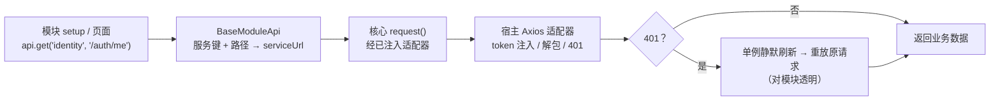

# 01 详细设计 · 模块请求能力 `api` 与契约版本升 2

> 认证与安全 · 06 契约与模块请求能力 · 子任务 02（需求 06-2）· 详细设计

[文档首页](../../../../../../文档首页.md) › [06 契约与模块请求能力](../../06_契约与模块请求能力.md) › [02 模块请求能力 api 与契约版本升 2](../06_契约与模块请求能力_02_模块请求能力api与契约版本升2.md) › 详细设计　|　[需求 06-2](../../../../需求/06_需求_契约与模块请求能力.md#r06-2)

## 1. 设计目标与范围 <a id="goal"></a>

把《[架构设计 · 前端模块契约](../../../../../../设计/架构设计/35_架构设计_前端模块契约.md)》「宿主注入上下文」表中已声明的 `api`（请求能力）**从语义落为实现**：模块经宿主注入的请求能力按「服务键 + 路径」发请求，凭据注入、统一响应解包、401 静默刷新与重放**全部由宿主处理**；模块**禁自建 HTTP 客户端**并由机器护栏拦截；注入上下文项变更触发**模块契约版本升 2**（协调升级：契约变更 → 模块适配 → 重新构建发布）。

- **范围内**：`api` 能力契约与能力基类落核心、宿主实现与注入、隔离护栏新增 HTTP 规则、契约版本升 2（双源同步）、demo / sample 双模块经 `api` 消费真实端点（含 401 透明）与版本升 0.2.0 重发布、契约用例工厂覆盖新能力、文档与登记回写。
- **范围外（登记为开放项）**：既有 5 个注入项（`router` / `store` / `i18n` / `user` / `tenant`）改造为基类（独立重构，见 §7）；`api` 的服务白名单（治理增强，见 §7）；移动端宿主适配（阶段十七，见 §7）；`api` 的请求观测 / 审计（后续阶段）。
- **安全影响（SDL）**：请求能力把「模块如何访问后端」收敛为**宿主唯一入口**——凭据不下发模块、服务前缀不由模块拼接、401 会话链路对模块透明。护栏（源码面 + 产物面）把「模块私建 HTTP 通道绕过宿主治理」的风险前移到构建期；契约版本升 2 使**旧契约版本的模块被明确拒绝加载**，避免「平台与模块对注入上下文理解不一致」造成的静默行为偏差。

### 1.1 现状实测与缺口 <a id="gap"></a>

实测在开工前以当前工作区完成（命令见 §9）：

| # | 实测项 | 结论 |
| --- | --- | --- |
| 1 | 注入上下文现状 | `ModuleHostContext`（`frontend/packages/core/src/module/types.ts`）仅 `router` / `store` / `i18n` / `user` / `tenant` 五项，**无 `api`** |
| 2 | 核心既有请求契约 | 已具备框架无关请求契约：`contracts/request.ts`（`request()` / `RequestAdapter` / `RequestConfig`）、`contracts/service-endpoint.ts`（`ServiceKey` / `serviceUrl`），**可直接复用，不重复建设** |
| 3 | 宿主请求层现状 | `apps/desktop/src/api/request.ts` 已有 `get` / `post` / `put` / `del` + `apiUrl`；`api/http.ts` 已有 token 注入、统一解包、401 单例静默刷新与重放（含 `Idempotency-Key` 原样重放） |
| 4 | 契约版本现状 | `MODULE_CONTRACT_VERSION = 1`（`core/src/module/contract.ts`）与 `frontend/module-contract.json`（`contractVersion: 1`）**双源一致**（护栏用例 `guard-module-contract.spec.ts` 断言） |
| 5 | 版本校验点 | 加载器 `module/loader.ts`（模块自报 ≠ 平台常量即拒绝加载）、发布前强校验 `scripts/release-module.mjs`、清单护栏 `scripts/check-module-manifest.mjs`（产物元数据 ≠ 平台常量即失败）、回滚校验（同上） |
| 6 | 隔离扫描现状 | `scripts/check-module-isolation.mjs` 规则表 `PATTERNS` 覆盖全局污染五类 / 运行时约束 / 样式约束，**无任何自建 HTTP 规则** |
| 7 | 产物面误报风险实测 | demo / sample 自有产物块（`module-*.js` 暴露块与 `DemoHome` / `DemoToolbox` / `Sample*` 页面块）中 `fetch(` / `axios` / `XMLHttpRequest` **命中 0**（第三方与平台块不在扫描面）→ 产物面加规则预计零误报 |
| 8 | 契约用例工厂现状 | `packages/core/testing/module.ts::describeModuleContract` 已断言「注入上下文只读快照、缺失项自行降级」，**未覆盖请求能力** |
| 9 | 模块现状 | demo 仅读 `context.user` 派生问候文案；sample 经 `runtime.ts` 消费 `context.user`；两模块**均无任何 HTTP 调用**，`sampleService` 为纯内存占位 |

| # | 缺口 | 事实 | 后果 |
| --- | --- | --- | --- |
| 1 | 模块无宿主请求通道 | `ModuleHostContext` 无 `api` | 模块要访问后端只能自建 axios / 裸 `fetch` → 绕过宿主凭据与会话治理（需求 06-2 第 1 条） |
| 2 | 护栏不拦自建 HTTP | `PATTERNS` 无 HTTP 判据 | 「模块不得自建 HTTP」只有文档口径、无机器护栏（需求 06-2 第 2 条） |
| 3 | 注入上下文项变更未升契约版本 | 常量仍为 1 | 按《架构设计 · 前端模块契约》§5，注入上下文项增改属**不向后兼容**契约变更，必须升版本并协调模块适配 |
| 4 | 契约用例工厂未覆盖请求能力 | 工厂仅覆盖 5 项旧口径 | 「全部注册实现跑同一套断言」在 `api` 上落空 |

## 2. 交付物清单 <a id="deliver"></a>

```text
bms/frontend/
├── packages/core/
│   ├── src/contracts/module-api.ts                  # 新增：ModuleApi / ModuleApiRequest 契约
│   ├── src/capabilities/module-api.ts               # 新增：BaseModuleApi 能力基类
│   ├── src/module/types.ts                          # 修改：ModuleHostContext 增 api 注入项
│   ├── src/module/contract.ts                       # 修改：MODULE_CONTRACT_VERSION = 2
│   ├── src/index.ts                                 # 修改：具名导出（基类 + 契约类型）
│   ├── testing/module.ts                            # 修改：契约用例工厂增请求能力断言
│   └── tests/module-api.spec.ts                     # 新增：能力基类与契约面用例
├── module-contract.json                             # 修改：contractVersion = 2（单一来源）
├── scripts/check-module-isolation.mjs               # 修改：新增自建 HTTP 规则（源码面 + 产物面）
├── apps/desktop/
│   ├── src/api/module-api.ts                        # 新增：HostModuleApi（宿主实现）+ createModuleApi
│   ├── src/main.ts                                  # 修改：装配注入 api
│   ├── src/api/http.ts                              # 修改：导出 host 幂等键口径（若需）
│   ├── public/modules.json                          # 修改：demo / sample 版本 → 0.2.0
│   └── tests/
│       ├── module-api.spec.ts                       # 新增：宿主实现 + 整链 + 401 透明用例
│       └── guard-module-isolation.spec.ts           # 修改：新增 HTTP fixture 拦截用例
└── modules/
    ├── demo/{package.json, src/runtime.ts, src/index.ts, src/views/DemoHome.vue, tests/*}
    └── sample/{package.json, src/runtime.ts, src/views/SampleList.vue, src/i18n/messages.ts, tests/*}
```

| # | 交付物 | 落点 | 类型 |
| --- | --- | --- | --- |
| 1 | 请求能力契约（`ModuleApi` / `ModuleApiRequest`） | `frontend/packages/core/src/contracts/module-api.ts` | 新增 |
| 2 | 请求能力基类（`BaseModuleApi`） | `frontend/packages/core/src/capabilities/module-api.ts` | 新增 |
| 3 | 注入上下文新增 `api` 项 | `frontend/packages/core/src/module/types.ts` | 修改 |
| 4 | 模块契约版本升 2（双源） | `frontend/packages/core/src/module/contract.ts`、`frontend/module-contract.json` | 修改 |
| 5 | 核心入口具名导出 | `frontend/packages/core/src/index.ts` | 修改 |
| 6 | 契约用例工厂覆盖请求能力 | `frontend/packages/core/testing/module.ts` | 修改 |
| 7 | 自建 HTTP 护栏规则（源码面 + 产物面） | `frontend/scripts/check-module-isolation.mjs` | 修改 |
| 8 | 护栏 fixture 用例 | `frontend/apps/desktop/tests/guard-module-isolation.spec.ts` | 修改 |
| 9 | 宿主实现与装配注入 | `frontend/apps/desktop/src/api/module-api.ts`、`src/main.ts` | 新增 + 修改 |
| 10 | 模块清单版本更新（版本发现） | `frontend/apps/desktop/public/modules.json` | 修改 |
| 11 | demo 模块经 `api` 消费（含版本升 0.2.0） | `frontend/modules/demo/**` | 修改 |
| 12 | sample 模块经 `api` 消费（含版本升 0.2.0） | `frontend/modules/sample/**` | 修改 |
| 13 | 模块依赖声明（生成类型消费） | `frontend/modules/{demo,sample}/package.json` | 修改 |
| 14 | 核心 / 宿主 / 模块用例 | `packages/core/tests/`、`apps/desktop/tests/`、`modules/*/tests/` | 新增 + 修改 |
| 15 | 文档回写（架构 / 清单 / 规范 / 任务 / 需求 / 计划） | `bms文档/**` | 修改 |
| 16 | 实施 / 测试记录 | 本目录 `实施/`、`测试/` | 新增 |

## 3. 设计与边界 <a id="design"></a>

### 3.1 请求能力契约面 <a id="contract"></a>

```ts
// frontend/packages/core/src/contracts/module-api.ts（框架无关；拟）

/** 模块请求入参（**按服务键 + 路径**；不出现服务前缀）。 */
export interface ModuleApiRequest {
  /** HTTP 方法。 */
  method: HttpMethod
  /** 服务键（9 个已启用服务之一；非法键抛错）。 */
  service: ServiceKey
  /** 资源子路径（缺省服务前缀本身）。 */
  path?: string
  /** 查询参数。 */
  params?: Record<string, unknown>
  /** 请求体。 */
  data?: unknown
  /** 附加请求头（不得覆盖鉴权头——宿主拦截器后置注入）。 */
  headers?: Record<string, string>
  /** 幂等键（写方法；缺省由基类生成，见 §3.2）。 */
  idempotencyKey?: string
}

/** 模块请求能力（宿主注入；模块不接触凭据与服务前缀）。 */
export interface ModuleApi {
  get<T = unknown>(service: ServiceKey, path?: string, params?: Record<string, unknown>): Promise<T>
  post<T = unknown>(service: ServiceKey, path?: string, data?: unknown): Promise<T>
  put<T = unknown>(service: ServiceKey, path?: string, data?: unknown): Promise<T>
  del<T = unknown>(service: ServiceKey, path?: string, params?: Record<string, unknown>): Promise<T>
  request<T = unknown>(config: ModuleApiRequest): Promise<T>
}
```

**契约面口径**：

| 项 | 口径 | 理由 |
| --- | --- | --- |
| 寻址 | 只暴露**服务键 + 资源子路径**，前缀 `/api/{service}/v1` 由宿主经 `serviceUrl` 组装 | 模块**不感知服务寻址**（《架构设计 · 前端模块契约》「请求能力」节）；服务键非法即 `BaseError(CAPABILITY_VIOLATION)` |
| 方法族 | `get` / `post` / `put` / `del` + 通用 `request` 逃生口 | 日常四法够用；`PATCH` / 自定义头 / 流式等特殊场景经 `request` 表达，**不必再升契约版本** |
| 凭据 | **不出现 token / withCredentials / 租户头**参数 | 凭据由宿主请求层按端点口径统一注入（模块不得接触） |
| 幂等 | `post` / `put` 自动生成幂等键；`request` 缺省不自动生成（由调用方显式给） | 与宿主请求层写方法口径一致；逃生口保持「调用方显式」语义 |
| 返回值 | 直接返回**业务数据**（宿主已完成统一响应解包与业务错误抛出） | 模块拿到即业务数据，不必重复解包 |

**与既有契约的关系**：`ModuleApi` 是**新契约类型**（不替代 `RequestAdapter` / `RequestConfig`——后二者是核心与宿主之间的**底层**契约，`ModuleApi` 是模块与宿主之间的**上层**契约）；`ModuleHostContext.api` 的类型取 `ModuleApi`（**契约类型**，不取类，避免模块契约依赖能力实现层）。

### 3.2 能力基类 `BaseModuleApi` <a id="base"></a>

```ts
// frontend/packages/core/src/capabilities/module-api.ts（拟）

/** 请求能力基类（抽象）：服务键 + 路径寻址；凭据 / 错误 / 401 由宿主请求层统一处理。 */
export abstract class BaseModuleApi extends BasePlaceholderState implements ModuleApi {
  /** 能力键。 */
  readonly identifier: string = 'module-api'

  async get<T>(service: ServiceKey, path = '', params?): Promise<T> { return this.request<T>({ method: 'GET', service, path, params }) }
  async post<T>(service: ServiceKey, path = '', data?): Promise<T> { return this.request<T>({ method: 'POST', service, path, data, idempotencyKey: this.createIdempotencyKey(service, path) }) }
  async put<T>(service: ServiceKey, path = '', data?): Promise<T> { /* 同 post，method: 'PUT' */ }
  async del<T>(service: ServiceKey, path = '', params?): Promise<T> { return this.request<T>({ method: 'DELETE', service, path, params }) }

  async request<T>(config: ModuleApiRequest): Promise<T> {
    return request<T>({
      method: config.method,
      url: serviceUrl(config.service, config.path ?? ''),
      params: config.params, data: config.data, headers: config.headers, idempotencyKey: config.idempotencyKey,
    })
  }

  /** 幂等键口径（**宿主实现**：服务端要求可变）。 */
  abstract createIdempotencyKey(service: ServiceKey, path: string): string
}
```

| 项 | 口径 | 理由 |
| --- | --- | --- |
| 链层 | `BaseObject → BaseFrameworkObject → BaseCapability → BasePluggable → BaseComponent → BasePlaceholderState → BaseModuleApi`（**组件侧 · 能力域基类**） | 与 `BaseUploadEngine` / `BaseSsoQr` 同形态（**注入式通路**：宿主实现注入、未注入即占位） |
| 抽象性 | 声明**唯一抽象成员** `createIdempotencyKey`（幂等键口径属宿主侧、随服务端要求可变） | 与《前端基类清单》`BaseApi` 行「自动幂等键（宿主可覆写为服务端要求的口径）」同一口径；同时**保证宿主必须提供实现入口**（契约入口唯一） |
| 复用 | `get` / `post` / `put` / `del` / `request` 均为**具体实现**，组合核心既有 `request()` + `serviceUrl()` | 请求编排是框架无关逻辑，落核心即可；**不重复建设**适配器与响应解包 |
| 占位 | 继承 `BasePlaceholderState`：核心未注入请求适配器时，`request()` 抛 `BaseError(NOT_IMPLEMENTED)`（**零请求**） | 与 `BaseUploadEngine`「未注入即占位零请求」同口径；宿主可经 `ready` 标注通路就绪 |
| 为何不是空壳 | 承载能力键、五法编排实现、幂等键抽象点、占位语义与生命周期 | 满足「基类须承载公共语义（禁空壳）」 |

**为何 `api` 入链、既有 5 项不入链（本次）**：界线为「**宿主实例透传**留注入项；**平台自建能力契约**入继承链」——`router` / `store` 是宿主框架实例的只读透传（包一层基类即空壳），`i18n` / `user` / `tenant` 已分别有 `BaseLocale` / `BaseAccess` / `BaseTenant` 承载各自语义（再入链即出现第二套上下文体系）；`api` 则是**平台定义、宿主实现、跨端复用**的能力契约。既有 5 项的基类化属独立重构，登记为开放项（§7）。

### 3.3 宿主实现与装配注入 <a id="host"></a>

```ts
// frontend/apps/desktop/src/api/module-api.ts（拟）

/** 宿主实现的模块请求能力（幂等键沿用宿主请求层口径）。 */
export class HostModuleApi extends BaseModuleApi {
  createIdempotencyKey(service: ServiceKey, path: string): string {
    return newKey(`${service}:${path}`)
  }
}

/** 构造模块请求能力（宿主入口装配一次，注入全部模块）。 */
export function createModuleApi(): ModuleApi {
  return new HostModuleApi()
}
```

- **装配**：`apps/desktop/src/main.ts` 的 `installModules(...)` 增 `api: createModuleApi()`；与既有 `router` / `store` / `i18n` / `user` 同一次注入、同一份实例（**全模块共享**）。
- **调用链**（逻辑图）：



- **模块侧不接触项**（契约与实现双约束）：token、`withCredentials`、租户头、服务前缀、响应解包、401 处理。
- **失败语义**（模块可见）：
  - 服务键非法 / 适配器未注入 → `BaseError(CAPABILITY_VIOLATION` / `NOT_IMPLEMENTED)`；
  - 业务失败 → 宿主 `ApiError`（`code` 为业务码，如 `10001`；**HTTP 状态多为 200**）；
  - 会话失效（刷新失败 / 重放后仍 401）→ `SessionExpiredError`（业务码段 `2xxxx` 对应会话失效）；
  - 模块对以上一律**自行降级**（不假定成功、不吞错掩盖）。

### 3.4 隔离护栏扩展：禁自建 HTTP <a id="guard"></a>

在 `frontend/scripts/check-module-isolation.mjs` 的 `PATTERNS` 增一条规则并接入**两面**：

```js
/** R3 自建 HTTP 客户端 / 裸请求（一律经宿主注入的请求能力 `api`）。 */
bareHttp: /\bfetch\s*\(|\bnew\s+XMLHttpRequest\s*\(|\baxios\s*[.(]|['"]axios['"]/,
```

| 面 | 接入点 | 说明 |
| --- | --- | --- |
| 源码面 | `scanSourceFiles` 的「非样式文件」分支 | 与全局污染五类同处判定；输出文案「自建 HTTP 客户端 / 裸请求（R3）」 |
| 产物面 | `scanProductFiles` 的 JS 块分支 | 仅扫模块**自有块**（暴露块 + 页面块）；第三方 / 平台块不在扫描面（既有分包口径已隔离 EP） |

- **豁免**：沿用既有豁免机制（`SOURCE_EXEMPT_FILES`：独立预览壳 `standalone.ts`、令牌定义源 `tokens.scss`）——独立预览壳不属模块契约部分。**不新增** HTTP 专用豁免清单。
- **规则边界（不误报）**：
  - `\bfetch\s*\(` 的 `\b` 保证 `prefetch(` / `useFetch(` 不命中；大小写敏感使 `reFetch(` 不命中；
  - `axios` 判据覆盖 `axios.get(` / `new axios` / `import ... from 'axios'`；
  - 模块侧**合法写法** `api.get(...)` / `context.api` 不含上述特征（实测见 §1.1 第 7 项）。
- **宿主侧不受影响**：扫描面只含 `frontend/modules/*/src/**` 与 `frontend/apps/desktop/src/modules/**`；宿主 `src/api/**`、`src/module/manifest.ts`（清单获取用原生 `fetch`）**不在扫描面**。
- **护栏配套**：`apps/desktop/tests/guard-module-isolation.spec.ts` 增 fixture 配对用例（违规样例被拦 + 合法写法不误判），源码面与产物面各一组。

### 3.5 契约版本升 2 与产物重建发布 <a id="version"></a>

**变更性质**：`ModuleHostContext` 新增注入项 = 《架构设计 · 前端模块契约》§5 明列的「注入上下文项增改」→ **不向后兼容**，必须升契约版本。

**同步点（双源 + 四处校验，全部必须一致）**：

| # | 落点 | 动作 |
| --- | --- | --- |
| 1 | `frontend/packages/core/src/module/contract.ts` | `MODULE_CONTRACT_VERSION = 2` |
| 2 | `frontend/module-contract.json` | `contractVersion: 2`（与 1 由护栏用例 `guard-module-contract.spec.ts` 断言一致） |
| 3 | 模块定义 | 模块自报值取 `MODULE_CONTRACT_VERSION`（构建期常量注入），**源码零手写** |
| 4 | 产物元数据 | `dist/module.meta.json` 的 `contractVersion` 由构建插件按单一来源写入 |
| 5 | 加载器 / 发布 / 清单护栏 / 回滚 | 校验「模块自报 = 平台常量」「产物元数据 = 平台常量」，**代码零改动**（读同一来源） |

**产物重建与发布**：契约版本变更后**旧产物被拒绝加载**（加载器与清单护栏均校验），故必须**重建 + 重新发布** demo / sample：

1. 模块版本升 `0.2.0`（`package.json`，版本单一来源）
2. 宿主清单 `public/modules.json` 两条目版本 → `0.2.0`（**版本发现**：清单 = 产物元数据 = 源码）
3. 构建（`pnpm build`）→ 契约版本 2 写入产物元数据
4. 发布（`node frontend/scripts/release-module.mjs publish --module <名>`）→ 归档 `releases/<名>/0.2.0/` → 清单入口指向版本目录 → **发布记录留痕**（含契约版本）
5. 校验 `node frontend/scripts/check-module-manifest.mjs`（清单可解析 / 版本发现 / 契约版本 / sourcemap / 契约用例齐备）

**版本不可变纪律**：0.2.0 为**新版本目录**，不复用 0.1.0 归档（`publish --force` 仅限本地开发重发口径，本次不用）。

### 3.6 demo / sample 双模块改造 <a id="modules"></a>

**统一口径**：`setup(context)` 经 `runtime.ts` 记录注入项（含 `api`）；页面 `onMounted` 经 `api` 拉取**真实端点**并渲染；**未注入 `api`（独立预览 / 未接线）时降级占位**（不抛错、不假定存在）。

| 模块 | 落点 | 行为 |
| --- | --- | --- |
| demo | `src/runtime.ts`（新增：`applyHostContext` 记录 `api` 与权限码；`hostUser()` 经 `api` 调 currentUser）、`src/index.ts`（setup 经 runtime 派生问候）、`src/views/DemoHome.vue`（新增「宿主请求能力」区块，`onMounted` 拉取并渲染三态：未接入 / 已接入（显示用户名）/ 失败降级） | 演示「模块经宿主请求能力取真实数据」 |
| sample | `src/runtime.ts`（扩：记录 `api`；`hostUser()` 同上；**保持既有 `SampleRuntimeState` 形状不变**，`api` 单独持有以免破坏既有断言）、`src/views/SampleList.vue`（列表页顶部新增宿主请求能力区块，同三态）、`src/i18n/messages.ts`（增 3 条文案键，中英各一） | 真实形态样例的请求链路回归 |

- **类型消费**：两模块**声明 `@bms/api-types` 依赖**（`workspace:*`，平台基座包前缀 → 共享白名单护栏豁免）并以生成类型消费 `identity` 命名空间（`UserSummary`），**不手写重复类型定义**（需求 06-1 口径）。类型引用仅 `import type`，构建期擦除、**不增加产物体积**。
- **锁文件**：依赖声明变更须更新 `pnpm-lock.yaml`（流程：还原依赖 → `pnpm install` → `pnpm install --frozen-lockfile` 校验 → 外置依赖复位）。
- **401 透明**：模块代码**无任何 401 / 刷新逻辑**——401 由宿主适配器单例静默刷新并重放，模块只感知「成功」或「会话失效」；刷新成功时模块拿到数据（透明），刷新失败时模块走失败降级。
- **残留占位服务**：`sampleService`（内存占位）**保持不动**（其去留归后端示例端点需求，见 §7）。

### 3.7 契约用例工厂扩展 <a id="factory"></a>

`packages/core/testing/module.ts::describeModuleContract` 增一条契约断言（各模块跑**同一套**）：

| 断言 | 内容 | 理由 |
| --- | --- | --- |
| 请求能力契约 | 以**契约探针**（工厂内构造的 `ModuleApi` 探针实现）冻结注入 `setup(Object.freeze({ api }))`：① 必须正常返回注册声明（**不得因新增注入项抛错**）；② 探针五法齐备（契约面完整） | 契约版本 2 的**公共契约要求**；「模块是否真实经 `api` 消费」由各模块自己的用例断言（工厂不替模块裁决业务行为） |

### 3.8 失败分支与边界 <a id="failures"></a>

| 场景 | 处理 |
| --- | --- |
| 模块自建 HTTP（源码面） | 护栏失败并列出「文件 + 规则」；构建 / CI 阻断 |
| 模块自建 HTTP（产物面） | 同上（仅扫模块自有块）；若第三方块误报，按「规则精确化」收敛并在记录中登记 |
| 模块自报契约版本 ≠ 平台常量 | 加载器拒绝加载（错误信息含模块名、自报值与平台值），宿主按失败兜底展示错误页 |
| 产物元数据契约版本 ≠ 平台常量 | 清单护栏与发布前强校验失败（提示「契约升级须重新构建发布」） |
| 模块依赖生成类型包 | 平台包前缀 → 共享白名单护栏豁免；锁文件须同步更新（`--frozen-lockfile` 校验） |
| 注入上下文缺 `api` | 模块**自行降级**（占位文案），不抛错、不假定存在 |
| 宿主未注入请求适配器 | 能力基类经核心 `request()` 抛 `BaseError(NOT_IMPLEMENTED)`（**零请求**） |
| 服务键非法 | `BaseError(CAPABILITY_VIOLATION)`（`serviceUrl` 既有语义，单一来源） |
| 业务失败 | 宿主抛 `ApiError`（`code` 为业务码，**HTTP 状态多为 200**，断言按错误码不按状态码） |
| 401 且刷新失败 | 宿主抛 `SessionExpiredError` → 模块降级；宿主侧会话失效处理（提示 + 清会话 + 跳登录）不属模块职责 |
| 旧契约版本模块产物 | 明确拒绝加载（契约版本门禁），不静默降级 |

## 4. 兼容性与消费方影响 <a id="compat"></a>

- **契约变更性质**：注入上下文项**新增**（`api` 可选）——虽为新增，但按《架构设计 · 前端模块契约》§5 明列「注入上下文项增改」属不兼容变更，**故升契约版本 2**（协调升级：平台通告 → 模块适配 → 重新构建发布）。
- **既有模块**：demo / sample 本次**同步适配并重发布**（0.2.0），不为旧版本产物留兼容通道（契约版本门禁即拒绝旧产物）——这是刻意的「显式拒绝」而非静默行为偏差。
- **既有 5 个注入项**：`ModuleHostContext` 的 `router` / `store` / `i18n` / `user` / `tenant` 字段语义**零变更**；`BaseModuleContext` 的 `snapshot` / `has` / `get` 语义零变更（仅清单描述补 `api`）。
- **宿主请求层**：`api/http.ts` 与 `api/request.ts` **不改造**（仅新增组合入口 `api/module-api.ts`）→ 401 静默刷新、凭据口径、重放纪律对既有消费方零影响（既有用例回归把关）。
- **移动端**：`frontend/apps/mobile` **当前不存在**；`BaseModuleApi` 落核心后，移动端宿主接入同一基类即可（阶段十七）。
- **后端**：**零改动**（不动端点、契约、迁移）。
- **护栏影响**：`check-module-isolation` 新增规则后，源码面与产物面既有零违规结论须复核（实测参见 §1.1 第 7 项）；`check-shared-whitelist` 因平台包前缀豁免无需改单一来源。

## 5. 测试设计与验收映射 <a id="test"></a>

用例**先登记 Kiwi TCMS 再编码**（新登记 1 条策展用例，覆盖下表断言；编号以平台回读为准并回填实施 / 测试记录）。

| # | 用例 / 文件 | 类型 | 断言要点 |
| --- | --- | --- | --- |
| 1 | `packages/core/tests/module-api.spec.ts` | 单元 | `BaseModuleApi` 能力键 / 五法编排（服务键 + 路径 → `serviceUrl`）/ 写方法自动幂等键 / 抽象幂等键口径被宿主覆写 / 未注入适配器抛 `NOT_IMPLEMENTED` |
| 2 | `packages/core/tests/module-contract.spec.ts` | 单元 | 契约用例工厂新增「请求能力」断言：冻结注入探针 `api` 不抛错、探针五法齐备；缺省上下文仍降级 |
| 3 | `packages/core/tests/module-loader.spec.ts`（既有） | 单元 | 契约版本不匹配拒绝加载（既有断言，版本升 2 后自动跟随）；加载器行为零变更 |
| 4 | `apps/desktop/tests/module-api.spec.ts` | 集成 | 宿主实现整链：模块 → `context.api` → 宿主请求层 → 适配器（注入假适配器断言 URL / 服务键 / 幂等键 / 返回值） |
| 5 | 同上 | 集成 | **401 对模块透明**：适配器首次 401 → 宿主单例刷新 → 重放成功 → 模块拿到数据；刷新失败 → 模块收到会话失效并按失败降级 |
| 6 | 同上 | 集成 | 非法服务键抛错；宿主 `HostModuleApi` 幂等键口径生效 |
| 7 | `apps/desktop/tests/guard-module-isolation.spec.ts` | 护栏 | fixture：源码面裸 `fetch` / `axios` / `XMLHttpRequest` 被拦，合法 `api.get` 不误判；产物面自有 JS 块同判据被拦 |
| 8 | `modules/{demo,sample}/tests/module-context.spec.ts` | 模块 | 注入 `api` 时经宿主请求能力拉取并渲染三态（未接入 / 成功 / 失败降级）；缺省上下文仍降级 |
| 9 | `modules/{demo,sample}/tests/module-contract.spec.ts` | 契约 | 经 `@bms/core/testing` 契约工厂跑同一套断言（含新请求能力断言）；隔离扫描事实零违规（含新 HTTP 规则） |
| 10 | `node frontend/scripts/check-module-manifest.mjs` | 门禁 | 清单 / 版本发现 / 产物元数据契约版本 = 2 / sourcemap / 契约用例齐备全绿 |
| 11 | 本地联调实测 | 实测 | 后端 identity + 发布存储（5002）+ 宿主 dev：登录态下模块经 `api` 取到当前用户概要并渲染；停用后端 / 会话失效时模块走失败降级 |

**验收映射**：需求 06-2「`api` 能力注入 + token 不注入模块」→ §3.1 / §3.3 + 用例 4；「模块禁自建 HTTP（护栏）」→ §3.4 + 用例 7；「契约版本升 2 与旧模块拒绝」→ §3.5 + 用例 3 / 10；「双模块回归（真实请求 + 401 分支）」→ §3.6 + 用例 8 / 11；「契约用例工厂覆盖新能力」→ §3.7 + 用例 2 / 9；「基类清单回写」→ §6。门禁：`pnpm run check`（核心 / 类型生成 / Vue 绑定 / 组件库）、宿主 `vitest` + `vue-tsc -b` + `eslint --max-warnings 0`、模块 `vitest` + `vue-tsc -b` + `lint` + `guard:isolation`、`check-module-manifest`、基座校验（`check-links` / `check-docs-scope` / `check-status`）与预检全绿。

**执行范围**：只跑**受变更影响**的定向用例（核心 `packages/core` 全量 + 宿主 `apps/desktop` 全量 + 两模块工程全量 + 隔离 / 清单护栏 + 文档校验），不跑与本任务无关的后端全量与前端其他包全量（口径见《[AI开发规范](../../../../../../规范/AI开发规范.md)》「测试产物复用不开口子」）。

## 6. 登记落点 <a id="registry"></a>

| 内容 | 落点 |
| --- | --- |
| 请求能力语义（已交付状态、检查清单勾选） | 《[架构设计 · 前端模块契约](../../../../../../设计/架构设计/35_架构设计_前端模块契约.md)》§3 与 §7 |
| `BaseModuleApi` 能力基类行 + `BaseModuleContext` 条目补 `api` + 宿主横切底座行 + 模块发布治理行 | 《[前端基类清单](../../../../../../前端基类清单.md)》§2.1 与 §9 |
| 「模块请求强制经注入 `api`、禁自建 HTTP」实现口径校正 | 《[前端开发规范](../../../../../../规范/前端开发规范.md)》§11 与「运行时模块隔离（强制）」节 |
| 需求 06-2 完成情况（计数与总清单） | 需求域 06、需求总览 |
| 进度（状态 / 完成日期） | 阶段计划表（**唯一落点**，含提前实施偏差登记） |
| 任务 / 父任务状态 | 任务 06_02、父任务 06（需求与任务文档不承载进度） |
| Kiwi TCMS 用例 | 平台登记并回读编号；测试资产仓台账同步 |
| 实施 / 测试记录 | 本目录 `实施/`、`测试/` |

## 7. 边界与开放项 <a id="boundary"></a>

| # | 开放项 | 归口 |
| --- | --- | --- |
| 1 | 既有 5 个注入项（`router` / `store` / `i18n` / `user` / `tenant`）基类化 | 独立重构（须先解决与 `BaseLocale` / `BaseAccess` / `BaseTenant` 的重叠与 `router` / `store` 空壳问题），登记计划后续待办 |
| 2 | `api` 服务白名单（按模块限定可访问服务） | 治理增强（属清单字段语义变更 → 契约再升级），登记计划后续待办 |
| 3 | 移动端宿主 `api` 适配 | 阶段十七（移动端 H5），计划已登记 |
| 4 | 模块请求观测 / 审计（按模块归因请求量、失败率） | 可观测阶段（`BaseModuleTelemetry` 扩展） |
| 5 | `sampleService` 内存占位服务去留 | 后端示例端点需求（本任务不动） |
| 6 | 产物面 HTTP 规则若遇第三方块误报 | 按「规则精确化」收敛并登记（当前扫描面不含第三方 / 平台块） |

## 8. 对齐记录 <a id="align"></a>

### 8.1 本轮拍板（2026-10-03，逐项确认） <a id="align-new"></a>

| # | 事项 | 结论 |
| --- | --- | --- |
| 1 | `api` 契约面 | 高层方法族（`get` / `post` / `put` / `del`，服务键 + 路径）＋ 通用 `request` 逃生口 |
| 2 | `api` 承载方式 | **入继承链为能力基类**（`BaseModuleApi`，核心 `capabilities/module-api.ts`）；既有 5 项保持注入项不动 |
| 3 | 宿主实现落点 | 新增 `apps/desktop/src/api/module-api.ts`（`HostModuleApi` + 构造器），`main.ts` 注入 |
| 4 | 服务白名单 | 本期不加（9 服务键全开放，非法键抛错）；登记为开放项 |
| 5 | 禁自建 HTTP 护栏 | 源码面 + 产物面双面新增规则 + fixture 拦截用例 |
| 6 | 模块消费落点 | 各模块 `runtime.ts` 存 `api`，页面 `onMounted` 发起并渲染；未注入时降级占位 |
| 7 | 请求目标 | identity `GET /api/v1/auth/me`（不动后端） |
| 8 | 模块版本 | demo / sample 升 `0.2.0`（清单 + 重建 + 发布 + 留痕） |
| 9 | Kiwi 用例 | 新登记 1 条策展用例（四组断言） |
| 10 | 验证方式 | 单元整链 + 本地联调实测 |
| 11 | 回写范围 | 架构 35 + 前端基类清单 + 前端开发规范 + 任务 / 需求 / 计划 / 实施 / 测试记录 |

### 8.2 复用既有口径 <a id="align-reuse"></a>

| # | 事项 | 结论 |
| --- | --- | --- |
| 1 | 请求契约与寻址 | 复用核心 `request()` / `RequestAdapter` / `serviceUrl`（阶段二已交付），**不重复建设** |
| 2 | 401 与凭据 | 复用宿主请求层既有口径（单例静默刷新 + 原样重放 + 仅认证端点凭据），**不改实现** |
| 3 | 隔离护栏 | 复用既有扫描框架与豁免机制（独立预览壳 / 令牌定义源），**不新增 HTTP 专用豁免** |
| 4 | 契约版本 | 复用「core 常量 ↔ `module-contract.json`」双源与既有四处校验点，**代码零改动** |
| 5 | 生成类型消费 | 复用 `@bms/api-types`（需求 06-1 零漂移口径），**不手写重复类型** |

```mermaid
flowchart LR
    A["Kiwi 用例登记（先登记后编码）"] --> B["核心：契约 + 能力基类 + 注入项 + 常量升 2 + 导出"]
    B --> C["核心：契约用例工厂扩展 + 用例"]
    C --> D["宿主：module-api 实现 + main.ts 注入 + 用例"]
    D --> E["护栏：隔离扫描新增 HTTP 规则 + fixture"]
    E --> F["模块：demo / sample 改造 + 版本 0.2.0 + 用例"]
    F --> G["重建 + 发布 + 清单 / 契约版本校验"]
    G --> H["门禁全绿 + 本地联调实测"]
    H --> I["文档回写（架构 / 清单 / 规范）与记录"]
    I --> J["提交（feat / docs 分开）+ 偏差遗留闭环"]
```

## 9. 实施步骤与关键命令 <a id="steps"></a>



1. 读《[KiwiTCMS部署使用说明](../../../../../../资料/开发服务器/linux/KiwiTCMS部署使用说明.md)》「用例约定」节，登记本任务用例并**回读编号**（先登记后编码）。
2. 核心：新增 `contracts/module-api.ts`、`capabilities/module-api.ts`；`module/types.ts` 增 `api` 注入项；`module/contract.ts` 与 `frontend/module-contract.json` 同步升 2；`index.ts` 具名导出。
3. 核心：`testing/module.ts` 契约工厂增请求能力断言；新增 `tests/module-api.spec.ts`。
4. 宿主：新增 `api/module-api.ts`（`HostModuleApi` + `createModuleApi`）；`main.ts` 注入；新增 `tests/module-api.spec.ts`（整链 + 401 透明）。
5. 护栏：`scripts/check-module-isolation.mjs` 增 HTTP 规则并接入两面；`tests/guard-module-isolation.spec.ts` 增 fixture。
6. 模块：demo / sample `runtime.ts` + 页面改造 + 文案键 + `@bms/api-types` 依赖 + 用例；`package.json` 版本升 `0.2.0`；宿主清单 `public/modules.json` 同步。
7. 锁文件与依赖（外置态）：还原依赖 → `pnpm install`（更新锁文件）→ `pnpm install --frozen-lockfile`（校验）→ 外置依赖复位。
8. 构建 + 发布 + 校验：`pnpm build`（两模块）→ `release-module.mjs publish --module demo|sample` → `check-module-manifest.mjs`。
9. 门禁：核心 / 宿主 / 两模块的 `vitest`、`vue-tsc -b`、`eslint`、`guard:isolation`、基座校验、预检；本地联调实测。
10. 文档回写（架构 35 / 前端基类清单 / 前端开发规范 / 任务 / 需求 / 计划）与实施 / 测试记录；代码与文档分开提交；偏差与遗留闭环另提。

关键命令：

```bash
# 前端（bms/frontend）
pnpm --filter @bms/core run test                       # 核心用例
pnpm --filter @bms/desktop run test                    # 宿主用例
pnpm --filter @bms/module-demo run test                # 演示模块用例
pnpm --filter @bms/module-sample run test              # 样例模块用例
pnpm --filter @bms/module-demo run build && pnpm --filter @bms/module-sample run build
node scripts/release-module.mjs publish --module demo
node scripts/release-module.mjs publish --module sample
node scripts/check-module-manifest.mjs
node scripts/check-module-isolation.mjs                # 源码面
node scripts/check-module-isolation.mjs --product      # 产物面（须先构建）
node scripts/check-shared-whitelist.mjs
# 仓库根（bms）
python3 scripts/tools/base-check/check-links.py
python3 scripts/tools/base-check/check-docs-scope.py
python3 scripts/tools/check-docs/check-status.py --stage 06_认证与安全
python3 scripts/tools/preflight/check-preflight.py --fast
```

本地联调口径：模块先构建再发布（发布脚本只校验产物不构建）→ 发布存储服务占 5002（**须带 CORS**）→ 宿主 dev → 后端 identity 起服；核对页与真实宿主页面均可验证。

## 10. 参考文档 <a id="ref"></a>

- [需求 06-2](../../../../需求/06_需求_契约与模块请求能力.md#r06-2)
- 《[架构设计 · 前端模块契约](../../../../../../设计/架构设计/35_架构设计_前端模块契约.md)》「宿主注入上下文」「一致性基础（运行时 / 契约版本）」「检查清单」节
- 《[架构设计 · 前端架构](../../../../../../设计/架构设计/08_架构设计_前端架构.md)》「前端插件化与运行时组合（微前端）」与「模块治理要求」表
- 《[微服务演进规划](../../../../../../规划/微服务演进规划.md)》（模块契约新增请求能力 `api`、契约版本升 2，随阶段六交付）
- 《[前端基类清单](../../../../../../前端基类清单.md)》§2.1（能力基类）与 §9（宿主横切底座 / 模块发布治理）
- 《[前端开发规范](../../../../../../规范/前端开发规范.md)》§11「请求封装」与「运行时模块隔离（强制）」节
- 阶段五 [`03_02` 模块清单与发布治理](../../../../../05_前端插件化/任务/03_隔离与治理/03_隔离与治理_02_模块清单与发布治理/03_隔离与治理_02_模块清单与发布治理.md)（**契约版本与校验机制已交付**）、[`03_01` 样式与运行时隔离](../../../../../05_前端插件化/任务/03_隔离与治理/03_隔离与治理_01_样式与运行时隔离/03_隔离与治理_01_样式与运行时隔离.md)（**隔离扫描已交付**）
- 本域 [`01` 认证契约快照与前端类型生成](../../06_契约与模块请求能力_01_认证契约快照与前端类型生成/06_契约与模块请求能力_01_认证契约快照与前端类型生成.md)（**生成类型已交付**，本任务按其消费）
- 《[AI开发规范](../../../../../../规范/AI开发规范.md)》「单任务交付一条龙」

> 本文档依《[文档生成规范](../../../../../../规范/文档生成规范.md)》编写 · 关键决策逐项确认（2026-10-03）
