# 阶段验收门禁核对与测试报告实施记录

> 认证与安全 · 07 阶段验收 · 01 阶段验收门禁核对与测试报告 · 实施记录

[文档首页](../../../../../../文档首页.md) › [01 阶段验收门禁核对与测试报告](../07_阶段验收_01_阶段验收门禁核对与测试报告.md) › 实施　|　[详细设计](../设计/01_详细设计_01_阶段验收门禁核对与测试报告.md) · [测试记录](../测试/01_测试_01_阶段验收门禁核对与测试报告.md)

## 1. 实施信息 

| 项 | 值 |
| --- | --- |
| 任务 | [01 阶段验收门禁核对与测试报告](../07_阶段验收_01_阶段验收门禁核对与测试报告.md) |
| 对应需求 | [07-1](../../../../需求/07_需求_阶段验收.md#r07-1) |
| 详细设计 | [01_详细设计_01_阶段验收门禁核对与测试报告](../设计/01_详细设计_01_阶段验收门禁核对与测试报告.md) |
| 实施日期 | 2026-10-03 |
| 实施人 | minjian |
| 实施环境 | 开发机（Ubuntu；Python 3.14 / uv；Node 22 / pnpm）；mjbk（GitLab CE、Kiwi TCMS 容器）——mjbk 侧**只做证据查询**（GitLab API / Kiwi 平台快照），不重跑重负载实测（决策项 6） |
| Kiwi 用例 | **2237**（平台骨架 / P2 / CONFIRMED / 自动化；登记输入 `test/scripts/kiwi/cases/2026-10-03_阶段六07-01_阶段验收门禁核对与测试报告.json`，回读 `exports/..._登记结果.json`） |
| 提交 | 设计 `d2e8b332`；实施 / 测试记录与回写见 §6 |
| 结论 | 完成（阶段六 10 行门禁**全部达标**，4 项带限定并注明归口；[阶段测试报告](../../../../01_测试报告_认证与安全.md)归档；三类文档就位（进度以阶段计划为准）；§7 台账 53 行逐条有去向） |

```mermaid
flowchart LR
    A["16 + 1 项待拍板逐项确认"] --> B["详细设计定稿并提交（d2e8b332）"]
    B --> C["Kiwi 登记取号（2237）"]
    C --> D["证据采集：本地门禁 + GitLab API + Kiwi 快照"]
    D --> E["门禁 10 行逐条判定与证据索引"]
    E --> F["阶段测试报告撰写归档"]
    F --> G["状态回写：计划 / 任务 / 域总览 / 阶段索引"]
    G --> H["收口断言用例 test_m6_closure.py"]
    H --> I["第二 AI 独立复核 + 异常项处置"]
    I --> J["本地门禁全绿 → 提交"]
```

## 2. 实施概览 

结果小结：阶段六 10 行门禁（本地登录链路 / SSO 链路 / JIT 建号 / 前端登录与按服务寻址 / 策略强制 / 会话踢出 / 账号锁定 / BMS 作 IdP / 数据脱敏 / 安全与覆盖率门槛）逐条给出结论与证据索引，**全部达标**（4 项带限定并注明归口）；阶段测试报告（六节 + 附录 A）归档；计划头部计数与工作量、§2 / §3、§4 进度、§5 结论与门禁对照、§7 台账与说明全部回写；阶段六 `README.md` 与《文档首页》阶段六索引同步（补域 08 / 09 / 10 与基线计数）；`check-status --stage 06_认证与安全 --strict` **硬 0 / 软 0**。

## 3. 实施过程 

1. **决策确认（16 + 1 项，先于动笔）**：门禁核对对象与行数、结论落点与形态、判定口径、浏览器实测补测项、收口日期、本地门禁范围、外部证据采集、自动缺陷单处置、§7 编号形态、§7 核对口径、编号缺口处置、文档索引同步、独立复核、总体规划回写、Kiwi 用例条数与落点、测试仓台账；核对中另发现《文档首页》阶段六索引陈旧，经补充确认后**一并刷新**（对齐记录见[设计 §10](../设计/01_详细设计_01_阶段验收门禁核对与测试报告.md#alignment)）。
2. **详细设计定稿并提交**：`d2e8b332 docs(认证与安全): 07_01 阶段验收门禁核对与测试报告详细设计（门禁 10 行核对口径 + 报告结构 + 收口回写）`。
3. **Kiwi 登记取号**：先按《KiwiTCMS部署使用说明》经容器 Django shell 批量登记（幂等、按 `summary` 去重），回读编号 **2237**；输入与回读结果落测试仓 `scripts/kiwi/{cases,exports}/`。
4. **证据采集（本地）**：收口断言用例（4 passed）、后端定向用例与安全专项套件、前端受变更范围、`ruff` / `format` / 文档与基座校验、`preflight --fast`；覆盖率与安全专项**引用 04_04 门禁输出与 `backend/coverage.json` 快照**（不重跑全量）。
5. **证据采集（外部）**：GitLab API（项目 2）取阶段六推送窗口 main 流水线 **#392 ~ #566（74 条）**与状态分布、**18 条失败条目的失败岗位**（含父流水线下钻至服务子流水线取 `service-release` / `service-test`）、`defect-auto` 缺陷单（opened 18 / closed 20）；Kiwi 平台 `export_cases.py` 导出策展用例 **296 条**并筛出阶段六编号 **2192 ~ 2237** 逐条核对归属。
6. **门禁 10 行逐条判定**：按设计 §4 的核对手法与证据来源逐行核对（结论与索引见 [§5.1](#verify)，回写落计划 §5）。
7. **阶段测试报告撰写归档**：`bms文档/项目/06_认证与安全/01_测试报告_认证与安全.md`（六节 + 附录 A：命令与原始输出、流水线区间与失败岗位、缺陷查询结果、Kiwi 快照对账）。
8. **状态回写**：计划头部计数（46 项 / 剩余 0）与工作量行（S1 可校验形态）、§2 追加 `07_01` 行并补完成区间、§3 剩余表清空、§4 精简为门禁进度（十域 + 达成节点）、§5 结论内联与门禁对照、§7 扩范围（第 12 / 34 项）并新增第 44 项与台账说明；任务文档补收口结论注（**不承载状态**）；域总览补报告索引；阶段六 `README.md` 与《文档首页》§5.19 ~ §5.21 同步。
9. **收口断言用例**：先登记 Kiwi（2237），再写 `backend/libs/bms_core/tests/crosscut/test_m6_closure.py`（4 个断言面），与 `test_m2_closure.py` / `test_m5_closure.py` 同口径。
10. **独立复核与验证**：第二 AI 独立复核（见 §4）→ 本地门禁复跑全绿（[§5.2](#verify)）→ 提交。

## 4. 问题与处置 

**实施期问题**：

| # | 问题 / 现象 | 原因 | 处置与落点 |
| --- | --- | --- | --- |
| 1 | 计划 §5 门禁表原为「核对方式与证据来源（基线）」列，无结论列，无法直接判读达标情况 | 基线表只写核对路径 | 按决策项 2 内联结论与证据索引并新增「门禁对照」表；本任务收口注记入计划 §5 |
| 2 | 「已完成项数」与「已完成表行数」在收口前不一致（头部 45 / 表 45，收口后须同步为 46 / 46） | 收口动作本身会改变两处 | 同步回写并由收口断言用例**结构自洽**校验（不写死 46），避免后续回写漂移 |
| 3 | 计划 §7 台账编号存在**同号重复**（`25` / `28` / `29` / `30` / `31` / `32` / `33` / `34` 各出现两次及以上），「§7 第 N 项」引用存在歧义 | 台账按不同批次追加、未统一编号 | 按决策项 9 **保持编号不动**（27 处引用依赖），在台账说明中逐号消歧并给闭环汇总 |
| 4 | 阶段六窗口 18 条 `defect-auto` 自动单全部保持开放 | `defect-capture` 只建单不关闭，关闭须人工 | 按决策项 8 只登记归口（计划 §7 新增第 44 项），不擅自处置 |
| 5 | 计划 §7 第 34 项原归口本任务补测（模块真实后端登录态浏览器实测） | 本地资源未记录 BMS 应用账号，且受第 29 项骨架屏缺陷阻隔 | 按决策项 4 改归口「具备应用账号的环境 / 阶段十七」，门禁第 4 行以「（限定：…）」注明 |
| 6 | 《文档首页》§5.19 ~ §5.21 阶段六索引仍为启动期口径（写「29 条需求」、缺域 08 / 09 / 10） | 补充需求域成立后未同步索引 | 经补充确认后一并刷新（40 条需求 / 46 项任务 / 报告索引），与阶段五 §5.16 ~ §5.18 维护口径一致 |
| 7 | 阶段六窗口 3 条失败流水线（#487 / #503 / #516）在流水线 job 列表内**无失败岗位** | 失败来自父流水线 → 服务子流水线（bridge） | 下钻 `bridges` 与子流水线 job 列表取失败岗位（`service-release` / `service-test`），报告 §1 与附录 A 如实记录 |

**第二 AI 独立复核（只读复核，逐条挑战证据链）**：

| # | 复核发现 | 性质 | 处置与落点 |
| --- | --- | --- | --- |
| a | **09_05 测试记录 §1 引用 Kiwi 2217，与 10_02 编号复用**：平台快照实证 2217 的 `summary` 为「10_02 租户标识内部化：令牌 claim / 请求态键改雪花 id」，09_05 并未在平台登记策展用例（其代码内 `@pytest.mark.kiwi_id(2217)` 同属误标） | 事实性核对 | 按决策项 11 修正 09_05 **测试记录 §1 与实施记录用例行**（改为「待补登记」并注明误引），代码标注与登记一并归口计划 §7 第 12 项；**不新建用例、不占用编号** |
| b | **09_04 术语统一未登记 Kiwi 用例**（其测试记录只有「用例落点」、无编号） | 覆盖完整性 | 登记计划 §7 第 12 项（范围扩展），随下次用例批次补齐 |
| c | 「本阶段新增 45 个策展编号」若按「上号 + 1」推算会错 | 事实性核对 | 以 Kiwi 平台 `export_cases.py` 快照逐号核对归属（2192 ~ 2236），并识别 **2200 / 2201 为 02_04 双编号、2222 ~ 2224 为 08_02 三编号**；本任务新增 **2237** |
| d | 报告「CI 全绿」类表述与 74 条中 18 条 failed 的事实冲突 | 证据表述风险 | 报告 §1 / 附录 A 改为「区间 + 状态分布 + 失败岗位逐条列示」，并说明「均为实施期迭代、同任务内转绿」 |
| e | 收口断言用例若写死 46 / 10 后续回写易误红 | 测试可维护性 | 头部项数改为结构自洽断言（头部计数 == 已完成表行数、剩余 0）；门禁行数 10 为门禁定义常量，保留显式断言 |
| f | 「阶段六行 4 条基线」与计划 10 行门禁的对应关系未闭合 | 结论完备性 | 计划 §5 增「门禁对照」表，显式给出 4 条基线 ↔ 10 行门禁覆盖映射与达成结论 |

**审核通过项**：门禁 10 行与《总体项目规划》阶段六行逐条对位无缺漏；计划 / 任务 / 域总览三处状态口径一致（任务与域总览不承载状态、唯一落点为计划表）；报告头部 meta 与需求总览 / 计划计数逐字一致（40 条 / 46 项）；覆盖率与安全专项引用的 04_04 快照与门禁脚本输出可复核；§7 台账 53 行逐条有去向、无「无归口」条目；未擅自关闭任何缺陷单。

## 5. 验证结果 

### 5.1 门禁 10 行核对（核对手法与实测结果）

| # | 验收点 | 核对命令 / 手法 | 实测结果 | 结论 |
| --- | --- | --- | --- | --- |
| 1 | 本地登录链路 E2E 通过（含验证码与限流） | 域一任务测试记录核对（登录 / 刷新 / 登出 + 依赖注入 + 前端 401 / 守卫）+ 真机冒烟结论引用 | 01_03 / 01_04 / 01_06 / 05_01 ~ 05_03 记录全绿；真机冒烟通过（2026-09-27） | 达标 |
| 2 | SSO 登录链路 E2E 通过（OIDC 真联调） | Keycloak integration 结论 + 真机部署态冒烟 + 四协议适配单测核对 | 02_01 记录含 Keycloak 端到端实测与真机冒烟；CAS / 企微 / 钉钉单测全绿 | 达标（限定：真实企业凭据 → §7 第 1 / 15 项） |
| 3 | JIT 建号落库正确 | 建号 + 唯一约束 + 并发锁用例核对 | 02_02 记录全绿；新增模块覆盖率 100% | 达标 |
| 4 | 前端登录与按服务寻址联通 | 前端登录页 / 401 / 守卫 / 扫码用例 + 契约零漂移与响应 schema 完整性护栏核对 | 05_01 ~ 05_04、06_01 / 06_03 记录全绿；契约路由覆盖与响应 schema 门禁在 CI 与预检生效 | 达标（限定：真实登录态浏览器实测 → §7 第 34 项） |
| 5 | 策略强制生效（验证码 / 密码 / 锁定） | 三形态验证码 + 场景策略 + 密码四规则 + 三型锁定用例核对 | 03_01 ~ 03_08 记录全绿 | 达标 |
| 6 | 会话强制踢出即时生效 | 撤销原语 + 踢出后 401 + refresh 失效 + 多端上限用例与真机冒烟核对 | 01_04 记录全绿；真机验证踢出即时 401 | 达标（限定：实时广播 → §7 第 2 项） |
| 7 | 账号锁定与手动解锁可用（MVP 验收点） | 三型锁定 + 手动解锁 + 留痕用例核对 | 03_07 记录全绿 | 达标（限定：管理页面 → §7 第 5 项） |
| 8 | BMS 作 IdP 通过（MVP 验收点） | 授权码流程 + Discovery / JWKS 合规用例核对 | 02_05 记录全绿 | 达标（限定：客户端管理页面与审计 → §7 第 9 项） |
| 9 | 数据脱敏生效（安全专项） | 脱敏规则 / 接入 / 专项用例与日志脱敏 PII 名单核对 | 04_01 / 04_02 / 04_04 记录全绿；七类专项套件通过 | 达标（限定：`data:plain` 真实权限 → §7 第 4 项） |
| 10 | 安全与覆盖率门槛 | 覆盖率门禁脚本实测输出与快照核对 | 认证（identity）99.3% / 认证（`bms_core` 横切）99.5%（阈值 80%）；全量 96.28%（阈值 70%）；`--self-test` 5 / 5 | 达标 |

### 5.2 本地门禁与自检

| 验证项 | 命令 | 结果 |
| --- | --- | --- |
| 收口断言用例 | `uv run pytest libs/bms_core/tests/crosscut/test_m6_closure.py -q` | 4 passed（Kiwi 2237） |
| 静态检查 | `uv run ruff check .` / `uv run ruff format --check .` | 新文件 All checks passed / 1 file already formatted |
| 覆盖率与安全专项（引用 04_04 快照） | `check-coverage-threshold.py` + `backend/coverage.json` | 认证两组 ≥80% 通过；`--self-test` 5 / 5 |
| 文档状态一致性 | `python3 scripts/tools/check-docs/check-status.py --stage 06_认证与安全 --strict` | 硬 0 / 软 0 |
| 基座自检 | `check-base.py` / `check-links.py` / `check-backend-base.py` / `check-bare-collections.py` / `check-docs-scope.py` | 全通过（无断链、无跨层、清单与磁盘一致、继承链与迁移链对齐、文档落点不越界） |
| 本地预检 | `scripts/tools/preflight/check-preflight.py --fast` | 全部通过 |
| 外部证据 | GitLab API（项目 2）/ Kiwi 平台导出 | 流水线 #392 ~ #566（74 条）；`defect-auto` opened 18 / closed 20；策展用例 296 条、阶段六 2192 ~ 2237 |
| 真实流水线 | 推送后按需手动触发 | 见 §6（收口推送流水线号） |

## 6. 偏差与遗留 

- **设计偏差（2 处）**：① 设计 §7 原写门禁断言含「门禁对照」表——实施时将该表落为**基线 ↔ 门禁覆盖映射**（4 行），与 10 行门禁表的「结论内联」分工明确；② 设计 §3 交付物第 11 项（修正 09_05 记录）实施为**测试记录与实施记录两行同步修正**（原设计只写测试记录一处；实施记录同号误引亦须一致）。
- **补充确认（1 项，执行中新增）**：《文档首页》§5.19 ~ §5.21 阶段六索引陈旧，经补充 question 确认后一并刷新（决策项 12 的同一动作）。
- **范围外（口径，非偏差）**：全量后端与全量前端不现场重跑（决策项 6），覆盖率与安全专项引用 04_04 收口快照与门禁脚本输出。
- **新增遗留（3 项，已登记计划 §7）**：第 44 项（阶段六窗口 18 条开放自动缺陷单）、第 12 项**范围扩展**（09_04 未登记用例 + 09_05 记录误引 2217 与代码标注）、第 34 项**改归口**（模块登录态浏览器实测）。
- **提交清单**（各仓库独立提交）：bms 仓——`docs(07_01)`（报告 / 计划 / 任务 / 域总览 / 阶段 README / 文档首页 / 09_05 记录修正）、`test(07_01)`（收口断言用例）；测试资产仓——Kiwi 用例登记输入与回读结果。

> 本文档依《[文档生成规范](../../../../../../规范/文档生成规范.md)》编写
