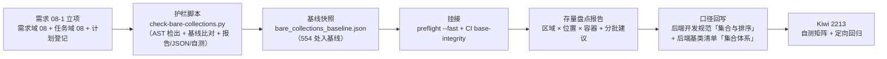

# 01 实施 · 护栏与基线盘点

> 认证与安全 · 08 裸无序集合治理 · 子任务 01（需求 08-1，补充需求）· 实施记录

[文档首页](../../../../../../文档首页.md) › [01 护栏与基线盘点](../08_裸无序集合治理_01_护栏与基线盘点.md) › 实施记录　|　[← 任务](../08_裸无序集合治理_01_护栏与基线盘点.md)　[盘点报告 →](02_存量盘点报告_01_护栏与基线盘点.md)

## 1. 实施信息 

| 项 | 值 |
| --- | --- |
| 任务 | [01 护栏与基线盘点](../08_裸无序集合治理_01_护栏与基线盘点.md) |
| 对应需求 | [08-1](../../../../需求/08_需求_裸无序集合治理.md#r08-1) |
| 详细设计 | [01 详细设计](../设计/01_详细设计_01_护栏与基线盘点.md) |
| 实施日期 | 2026-09-28（早于计划窗口 2026-10-08 ~ 10-09，见 §6 偏差 1） |
| 实施人 | minjian |
| 实施环境 | 本地开发机（Python 3.14.4；护栏脚本仅用标准库 `ast` / `json`，无第三方依赖） |
| 提交 | 代码 `70e4dc80`（护栏脚本 / 基线快照 / preflight / CI）；文档与登记回写随本次提交 |
| 结论 | 完成（无阻塞遗留；1 项范围外待办已登记） |

## 2. 实施概览 

## 3. 实施过程 

1. **立项（补充需求流程）**：新增需求域 [08_需求_裸无序集合治理](../../../../需求/08_需求_裸无序集合治理.md)（需求 08-1）与任务域 [08_裸无序集合治理](../../08_裸无序集合治理.md)（子任务 08_01）；同步需求总览（§1 文档表 / §2 范围内计数与表 / §3 总清单 / §4 域地图，合计 30 → **31** 条；新增已定口径第 16 条）与[计划](../../../../计划/01_计划_认证与安全.md)（§1 计数与工时 360 → **376h**、执行序、§3 剩余排期、§4 甘特、§6 风险、§7 后续待办）；[04_02](../../../04_数据脱敏与安全加固/04_数据脱敏与安全加固_02_脱敏接入与明文权限口径/04_数据脱敏与安全加固_02_脱敏接入与明文权限口径.md) 登记为本域**下游**（其依赖补 `08_01`）。
2. **护栏脚本**（`scripts/tools/base-check/check-bare-collections.py`，新增）：AST 解析后端 Python（`backend/libs/bms_core/src`、`backend/services/*/src`、`backend/ops`、`scripts/tools`，排除 tests 与 `test_*.py`），检出**类字段注解**与**函数签名注解**（参数 / 返回）中的裸 `dict` / `list` / `set` / `frozenset` 及 typing 别名；命中容器**不查** `Sequence` / `Mapping` / `Iterable`（只读 / 有序抽象），**不查**函数体内局部注解；支持 `--json`（机器可读）、`--report`（仅统计、恒退出 0）、`--update-baseline`（递减重写）、`--self-test`（18 项断言矩阵）；退出码 `0` 通过 / `1` 新增违规或基线非法或扫描异常。
3. **基线快照**（`deploy/boundaries/bare_collections_baseline.json`，新增）：以「文件 + 规范化行内容指纹 + 容器 + 位置 + 计数」登记**554 处**存量；判定口径＝**新增即失败**、基线残留仅提示递减；生成后**立即复校零漂移**（新增 0 / 残留 0）。
4. **挂接**：`scripts/tools/preflight/check-preflight.py` 基座与边界段新增「check-bare-collections」与「check-bare-collections --self-test」两段；`.gitlab-ci.yml` 的 `base-integrity`（`lint` stage，无条件门禁）追加两条命令。
5. **存量盘点报告**：产出[盘点报告](02_存量盘点报告_01_护栏与基线盘点.md)（总量 554 / 位置分布 / 容器分布 / 区域分布 / 高频文件 TOP 20 / 四批整改建议 / 基线与递减口径）。
6. **口径回写**：《[后端开发规范](../../../../../../规范/后端开发规范.md)》「集合与排序」升级为强制口径（对外契约 / 值对象 / 模块类集合字段与签名一律用基座集合类或只读抽象 + 基座静态护栏）；《[后端基类清单](../../../../../../后端基类清单.md)》「集合体系」节新增「裸无序集合护栏与基线」小段（脚本 / 基线 / 挂接 / 存量整改落点）。
7. **测试**：先登记 Kiwi **2213** 再落自测矩阵（脚本 `--self-test`），并跑定向回归（既有 4 个基座脚本 + 度量 + 阶段状态校验）。

## 4. 问题与处置 

| # | 问题 / 现象 | 原因 | 处置与落点 |
| --- | --- | --- | --- |
| 1 | 自测「报告模式 JSON 结构合法」断言失败 | 断言基数取的是早期 `hits` 长度，而报告时 fixture 已多一个文件 | 断言改为先取当前 `collect(root)` 长度再比对（实现细节，无设计偏差） |
| 2 | `--update-baseline` 输出误导（打印「基线内 0 处豁免」） | 更新路径复用了默认检查的输出文案，而 `counts["baseline_entries"]` 在该路径未填充 | 更新后直接打印「基线已更新：N 条」并返回，不再复用检查输出 |
| 3 | 实测命中 554 处，与设计 §1.1 测绘表（904 含只读抽象）口径不同 | 设计表为**测绘期**口径（含 `Mapping` / `Sequence` / `Iterable`），本任务口径已排除只读 / 有序抽象 | 设计 §1.1 已注明「按本任务口径最终命中数以实施期生成为准，预估 556 左右」；实测 554 在预估内，**无偏差** |
| 4 | `base-integrity` 属无条件门禁，改动它会使每次流水线跑新护栏 | 有意为之（护栏须常跑） | 护栏为纯 AST 扫描（秒级）、存量已入基线，不影响既有流水线时长与通过率 |

## 5. 验证结果 

| 项 | 命令 | 结果 |
| --- | --- | --- |
| 护栏自测矩阵 | `python3 scripts/tools/base-check/check-bare-collections.py --self-test` | 18 项断言全通过（exit 0） |
| 存量报告 | `python3 scripts/tools/base-check/check-bare-collections.py . --report --json` | 命中 **554** 处（类字段 136 含 `BaseObject` 8 / 签名参数 119 / 签名返回 299） |
| 基线生成与复校 | `--update-baseline` → 直跑检查 | 基线 554 条；复跑「新增 0 / 残留 0」，exit 0 |
| 本地预检（挂接生效） | `python3 scripts/tools/preflight/check-preflight.py --fast` | **全部通过**（含新增两段基座护栏；`check-status --root` 310 项 0 硬 0 软） |
| 阶段状态一致性 | `python3 scripts/tools/check-docs/check-status.py --stage 06_认证与安全` | 通过（0 硬 0 软） |
| 文档链接 | `python3 scripts/tools/base-check/check-links.py` | 全库断链 0、失效锚点 0 |
| CI 配置 | `.gitlab-ci.yml` `base-integrity` 追加两条命令 | 已挂接（**本次配置改动不在同条流水线自验**，待下次命中路径；本地 preflight 已覆盖同脚本） |

> 本任务**无运行时代码改动**，故不跑后端 `pytest` / `pyright` 全量；定向回归按《[测试规范](../../../../../../规范/测试规范.md)》「只跑受变更影响的部分」口径执行（脚本 + 预检 + 文档校验）。

## 6. 偏差与遗留 

- **偏差 1（进度）**：实施日期 **2026-09-28** 早于计划窗口 **2026-10-08 ~ 10-09**——因 04_02 被要求延后、专项先行落地，计划已将本任务移入「已完成」表并回写实际完成日期（窗口差额不影响后续排期）。
- **偏差 2（口径细化）**：护栏实测 554 处，与设计 §1.1 测绘表口径差异已在 §4 问题 3 说明，属测绘口径与最终口径不同，**设计结论无需变更**。
- **遗留**：
  1. **存量整改**（554 处，四批建议）→ 分批另立任务（[计划 §7 第 25 项](../../../../计划/01_计划_认证与安全.md#followup)）。
  2. `scripts/tools` 是否纳入长期强制口径 → 批次 4 评估（内部构建工具 vs 交付物边界）。
  3. `scripts/tools/` 不在 CI `ruff` / `pyright` 覆盖范围（脚本质量现由 `--self-test` 保障）→ 如需纳入 lint，另立任务。

> 本文档依《[文档生成规范](../../../../../../规范/文档生成规范.md)》编写
