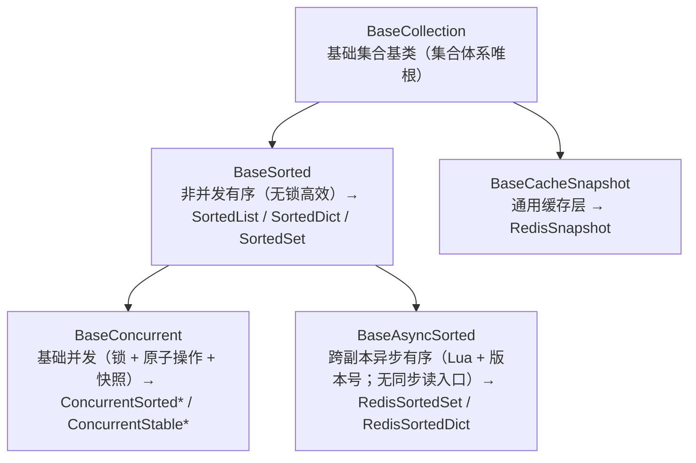

# 08_02 续行交接单（存量整改 · 批次 1）

> 认证与安全 · 08 裸无序集合治理 · 子任务 02 · **新会话续行用**（2026-09-30 交接）

> **用法**：新会话一句「读 `08_02_续行交接.md` 继续」即可开工。本单是**执行指引**，不是设计 / 计划文档——口径以《[后端基类清单](../../../../../后端基类清单.md)》《[后端开发规范](../../../../../规范/后端开发规范.md)》与 [08_02 详细设计](设计/01_详细设计_02_bms_core存量整改.md)（**§9 为最新口径**，§3 / §8 旧口径已作废）为准；产出落本任务 `设计/`、`实施/`、`测试/`。

## 1. 一句话任务

把 `backend/libs/bms_core`（随后 `services` / `scripts/tools` / `ops`）中残留的**裸容器 / 只读可变抽象 / 升序形态**集合声明（**类字段 / 签名参数 / 签名返回 / 函数体局部变量**）**全部改落插入序集合类 `ConcurrentStable*`**，并把护栏基线**逐批递减至 0**。

## 2. 开工前必读（按序，`bms/` 为仓根）

1. `AGENTS.md`（工作区规范：逐项确认、提交 / 推送纪律、文档红线）；
2. `bms文档/项目/06_认证与安全/需求/08_需求_裸无序集合治理.md`（3 条需求与已定口径）；
3. `bms文档/项目/06_认证与安全/任务/08_裸无序集合治理/08_裸无序集合治理.md`（父任务：唯一链总纲、五子任务、风险）；
4. 本目录 `08_裸无序集合治理_02_bms_core存量整改.md`（任务内容 / 完成标准）；
5. 本目录 `设计/01_详细设计_02_bms_core存量整改.md`（**§9 唯一链收口** / §3 整改口径 / §8 对齐记录）；
6. 本目录 `实施/01_实施_02_bms_core存量整改.md`（**§7 唯一链** / **§8 子批 1** / **§9 子批 2 起手** / **§10~§15 各子批记录**）。

## 3. 口径速查（已拍板，**勿再逐项询问**）



- **业务与契约唯一落点**：`ConcurrentStableList` / `ConcurrentStableSet` / `ConcurrentStableDict`（插入序）；`Sorted*` / `ConcurrentSorted*` 为体系内部基础实现，**不得**直接声明 / 继承；排序走排序契约。
- **护栏白名单 = 插入序形态；无例外**：类字段 / 签名参数 / 签名返回 / **函数体局部变量** / **测试目录（`*/tests`）** / `ClassVar` 常量 / 配置字段全查；**只**「迭代与调用协议（`Iterable` / `Iterator` / `Callable`）」不查。
- **框架边界豁免（2026-09-30 拍板）**：**框架自有容器**（Starlette / FastAPI 的 ASGI `scope` / `scope["state"]`、查询入参绑定、路由构造参数与端点返回注解，pydantic-settings 配置源 `__call__` 契约等）经**行级标记** `# bare-collections:allow`（声明行行尾或紧邻上一行，附理由）跳过；**不得**用于业务侧声明。
- **不属约束对象**：集合体系实现文件（`core/collections.py` / `core/concurrent.py` / `core/sorted_collections.py` / `core/redis_collections.py`）——护栏只约束业务侧集合声明（对外数据契约 / 值对象 / 模块类）。
- **「无依赖面」铁律（2026-09-30 拍板）**：集合体系拆为 `core/collections.py`（根与公共段）+ `core/concurrent.py`（基础并发层与 `ConcurrentStable*`）＝**只依赖标准库**，升序形态与第三方 `sortedcontainers` 单列 `core/sorted_collections.py`。原因是 CI `base-integrity` 的精简镜像（`python:3.14-slim`，不装依赖）会跑 `check-service-boundaries.py`（→ `bms_core.boundary` → `services` 注册表）与 `ops/gateway_config.py check`（→ `services.gateway_catalog`）——**凡被这两条链导入并调用的基座模块，不得引入第三方依赖**（后续批次落 `boundary/` / `services/` 时按此约束自查）。
- **三类外部 IO 边界按「全整改 + 边界适配」**（不新增豁免）：
  - **ORM JSON 列** → `Mapped[ConcurrentStable*]` + 新增列类型 `bms_core/models/base.py::StableJson`（bind 经 `normalize_collections` 规整、result 经 `to_stable_value` 递归转集合类）；
  - **第三方调用点**（httpx `headers` / `json`、redis、`json.dumps`）→ 调用处显式 `dict(...)` / `list(...)`；
  - **配置字段** → `Annotated[ConcurrentStable*, CONTRACT_COLLECTION] = Field(default_factory=CONTRACT_STABLE_*)`（`core/config.py` 已改，可照抄）。
  - **框架响应出口（2026-09-30 补，§25）**：集合类返回值**不可直入未标注 `CONTRACT_COLLECTION` 的 Pydantic / FastAPI 响应封装**（`ApiResponse.ok(集合类)` 运行期报 `Unable to serialize unknown type`）→ 出口处显式 `list(...)` / `dict(...)`；契约字段仍走 `CONTRACT_COLLECTION`，无需转换。
- **写用法（关键）**：集合类**不提供** `append` / `extend` / `__setitem__` / `pop` / `clear` / `copy`。可用原子方法：
  - `ConcurrentStableList`：`add`（追加）/ `update`（批量）/ `remove` / `discard` / `clear`；
  - `ConcurrentStableDict`：`set` / `update` / `update_atomic` / `delete` / `put_if_absent` / `replace_if_equal` / `get_and_remove`；
  - `ConcurrentStableSet`：`add` / `update` / `discard` / `remove` / `clear`。
  - 读面齐备：索引 / 切片 / `keys` / `items` / `values` / 集合运算 / `in` / `len` / 与内置容器**内容相等**（`dict(x)` / `list(x)` / `set(x)` 可直接转换，用于第三方边界）。
- **形态一致**（验收基准）：声明落集合类的同时，**运行期也必须是集合类**——函数体返回值要包 `ConcurrentStableList(...)` 等，构造点为集合实例；原「运行期零变更」作废。

## 4. 当前水位（2026-09-30 实测；基线 **697**；**`libs` 源侧已归零**）

**已完成子批（均「新增 0 / 残留 0」、ruff 全绿、preflight --fast 全绿；非推送状态）**：

| 子批 | 范围 | 基线 | 备注 |
| --- | --- | --- | --- |
| 类字段 | `bms_core` 类字段 60 处 | 1711 → 1647 | 值对象 / 契约字段 / 配置 / ORM JSON 列 |
| 子批 2 起手 | `schemas/sorting.py` 7 处 + 调用方 | 1647 → 1638 | 签名批次试点 |
| `repositories/` 基座 | 基座 45 处 + 调用方适配 | 1622 → 1553 | 实施 §10 |
| `dict/` 能力域 | `dict/` 70 + `query/` 4 | 1553 → 1476 | 实施 §11 |
| `idp/` 能力域 | `idp/` 61 + identity / oauth 调用方 | 1476 → 1415 | 实施 §12 |
| `oauth/` 能力域 | `oauth/` 31 + identity JWKS / Discovery 出口 | 1415 → 1384 | 实施 §13 |
| `events/` 能力域 | `events/` 20 + 快照往返基座 2 | 1384 → 1360 | 实施 §14 |
| `captcha/` + `config/` 能力域 | `captcha/` 16 + `config/` 16 + 选项链基座 7 + `masking` 入口 1 | 1360 → 1306 | 实施 §15 |
| `services/` 注册表与目录类 | `module_registry` 22 + `table_registry` 27 + `service_contract` 4（+ 调用方适配 + **集合体系基座拆分**） | 1306 → 1246 | 实施 §16（`gateway_catalog` 36 留下一轮） |
| `services/` 模块收尾 | `services/gateway_catalog.py` 36（+ 用例 1 处局部量） | 1246 → 1209 | 实施 §17（`services/` 模块归零） |
| `dashboard/` + `catalog/` 能力域 | `dashboard` 9 + `catalog` 8（+ 测试适配 6） | 1209 → 1186 | 实施 §18 |
| `session/` 能力域 | `session` 13（+ 调用方适配） | 1186 → 1173 | 实施 §19 |
| `db/` 模块 | `db` 43（+ 调用方适配） | 1173 → 1130 | 实施 §20 |
| `api/` 模块 | `api` 32（+ 调用方适配 + **框架边界豁免口径**） | 1130 → 1098 | 实施 §21 |
| `core/` 模块 | `core` 27（+ 调用方适配） | 1098 → 1071 | 实施 §22 |
| `boundary/` 能力域 | `boundary` 18（+ 调用方适配 / 精简镜像无依赖面实证） | 1071 → 1052 | 实施 §23 |
| `fieldtype/` + `i18n/` + `tracing/` 能力域 | 三域 18（7+4+7，+ 调用方 / 测试替身适配 4） | 1052 → 1030 | 实施 §24 |
| `archive/` + `audit/` + `chat/` 能力域 | 三域 18（6+6+6，+ `services/ai` 出口边界与测试替身适配 5） | 1030 → 1009 | 实施 §25 |
| `edge/` + `org/` + `globalsearch/` + `llm/` 能力域 | 四域 20（6+6+4+4，+ 出口边界与测试替身适配 8） | 1009 → 983 | 实施 §26 |
| `masking/` + `outbound/` + `password/` + `print/` + `icon/` + `metrics/` + `servicecall/` | 七域 25（4+4+4+4+3+3+3，调用方零改动） | 983 → 958 | 实施 §27 |
| `libs` 源侧收尾（一）· 应用工厂 + 八小域 | 14 + 调用方 / 测试适配 11（9 服务 `main.py` + 2 测试） | 958 → 933 | 实施 §28 |
| `libs` 源侧收尾（二）· `outbox` + `schemas` + `security` | 29（10+10+9）+ 测试适配 8 | 933 → 901 | 实施 §29（**`libs` 源侧归零**） |
| `libs` `tests` 收尾（一）· `db` + `core` + `ops` | 137（59+41+37）+ 未入基线 3 | 901 → 764 | 实施 §31 |
| `libs` `tests` 收尾（二）· `api` + `captcha` + `crosscut` + `idp` + `servicecall` | 67（9+9+17+18+14） | 764 → 697 | 实施 §32 |

| 范围 | 类字段 | 签名参数 | 签名返回 | 局部变量 | 合计 |
| --- | --- | --- | --- | --- | --- |
| `libs`（`bms_core`，全为 `tests`） | 0 | 15 | 30 | 22 | **67** |
| `services` | 24 | 56 | 116 | 108 | **304** |
| `scripts/tools` | 3 | 74 | 66 | 80 | **223** |
| `ops` | — | 45 | 31 | 27 | **103** |
| **全局** | 27 | 190 | 243 | 237 | **697** |

- 起点基线 **1711** → 逐子批递减至 **697**（明细见上表）；**`libs` 源侧（`bms_core` 源代码）已归零**，`libs` 余量全在 `tests`。
- `libs` 全部为 `tests`（**67**）：按目录 TOP `outbox` 6 / `repositories` 5 / `saga` 5 / `tracing` 5 / `alembic` 4 / `integration` 4 / `dict` 3 / `masking` 3 / `replay` 3，其余为 `boundary` / `edge` / `idempotency` / `lock` / `permission` / `schemas` 等零散目录群。
- `libs` 单文件剩余（TOP，按文件名归并）：`test_outbox_dispatcher.py` 5 / `test_saga.py` 4 / `test_cross_service_trace.py` 4 / `test_http_dict.py` 3 / `test_replay.py` 3 / `test_db_repository.py` 3。
- 批次 2 `services`（304）/ 批次 3 `scripts/tools`（223）+ `ops`（103）待推进。

## 5. 每轮工作流（固定 8 步，**一轮一批文件**）

1. **选文件**：用 §10 片段列出目标模块命中；优先**低耦合叶子模块**，把系统级单元（`repositories/` 基座）单独成轮。
2. **改实现体**：注解改 `ConcurrentStable*`；返回处包集合类；写用法改原子方法；局部变量注解一并改（局部批次口径前置）。
3. **改调用方**：入参按集合类构造；第三方边界显式 `dict(...)` / `list(...)`；测试同步（`["x"]` → `ConcurrentStableList(["x"])`、`{"k"}` → `ConcurrentStableSet({"k"})`）。
4. **定向用例**：跑该模块 `tests/` 或受影响用例（**不跑全量**）。
5. **门禁**：`ruff check` + `ruff format`（见 §6）。
6. **护栏**：`check-bare-collections.py` 复跑「新增 0 / 残留 0」→ `--update-baseline` 递减。
7. **提交**：代码 `feat(基座)` 与文档 `docs(认证与安全)` **分开**；只暂存本次相关文件；**必带** `deploy/boundaries/bare_collections_baseline.json`（易漏，别用 `git add backend` 一把梭）。
8. **回写**：在 `实施/01_实施_02_bms_core存量整改.md` 追加「子批 N」小节（动作 / 验证 / 偏差）。

## 6. 验证命令（在 `bms/backend`）

```bash
.venv/bin/python -m ruff check . && .venv/bin/python -m ruff format --check .
.venv/bin/python -m pytest libs/bms_core/tests -q -p no:randomly      # 走定向子集亦可
cd .. \
  && python3 scripts/tools/base-check/check-bare-collections.py .                    # 新增 0 / 残留 0
  && python3 scripts/tools/base-check/check-bare-collections.py . --update-baseline  # 递减基线
  && python3 scripts/tools/preflight/check-preflight.py --fast                        # 必须全绿
```

## 7. 下一轮起点与建议顺序

1. **`libs` `tests` 收尾**（**67 处**，全为 `bms_core/tests`；`outbox` 6 / `repositories` 5 / `saga` 5 / `tracing` 5 / `alembic` 4 / `integration` 4 / `dict` 3 / `masking` 3 / `replay` 3 …）——断言维持内容相等、替身签名随契约落集合类即可，**`libs` 源侧已归零**。（`db` / `core` / `ops` 三目录已于 §31 收口，`api` / `captcha` / `crosscut` / `idp` / `servicecall` 五目录已于 §32 收口；`libs` 各能力域 / 模块与 `services/` / `dashboard/` / `catalog/` / `session/` / `db/` / `api/` / `core/` 已于 §17~§29 归零。）
2. **批次 2 `services`**（304，含各服务 `src` 与 `tests`）→ **批次 3 `scripts/tools`**（223，含**长期口径评估**，结论回写规范与清单）+ `ops`（103）。

> 每轮仍按 §5 固定 8 步：选文件 → 改实现体（含局部变量）→ 改调用方 → 定向用例 → ruff → 护栏复跑 + 递减基线 → 提交（代码 / 文档分开）→ 回写实施记录「子批 N」。

## 8. 坑与注意事项

- **本地 `pyright` 不可用**：依赖外置（`DEPS_DIR`）导致全量 unknown，**不作判据**（CI `uv run pyright` 兜底）；改动后靠 `ruff` + 用例 + 人工核对类型。
- **文档禁写进度口径字样**：`check-docs-scope`（`scripts/tools/base-check/check-docs-scope.py`，见其中字样常量）只允许进度类字样出现在《总体项目规划》与各阶段计划文档——任务 / 需求 / 设计 / 实施 / 测试文档里一律改用「进度 / 剩余 / 后续推进」等中性表述；**连引用提交标题里的该字样也会被拦**（本单已踩过一次）。
- **提交与推送分开**：用户说「提交」只 commit；说「推送」才 `git push -o ci.skip origin main`（默认直推 main，不加 MR）。
- **别漏基线文件**：`deploy/boundaries/bare_collections_baseline.json` 属本次改动，提交必须带上。
- **`--update-baseline` 只在复跑「新增 0」后执行**（先确认没有新增命中，再递减）；**不得手工增删基线条目**。
- **测试亦在整改范围**：`*/tests` 会被扫描；测试里声明集合字段 / 参数也要落集合类，断言用**内容相等**（`== [..]` / `== {..}` 均成立）。
- **FastAPI 端点返回注解保持内置 + 行级标记**：测试 / 业务里的 FastAPI 端点返回注解落集合类会在**路由注册期**直接抛 `FastAPIError: Invalid args for response field`（非序列化期问题）——一律保留内置 `dict[...]`，加 `# bare-collections:allow（FastAPI 端点返回注解）`（超 120 列者标记单独成行、紧邻 `) -> dict[...]:` 之上）；其**函数体不改**。其余框架边界（Starlette `scope` / `state`、FastAPI 查询入参 / `responses`、pydantic-settings 配置源）同 §3。
- **`frozenset` 落 `ConcurrentStableSet`**（非 `List`）：按设计 §3.1 集合语义映射；落 `List` 会使 `{...} <= names` 之类断言因缺 `__ge__` 抛 `TypeError`。

## 9. 已知遗留与边界（勿重复踩）

- **跨副本异步形态**（`RedisSortedSet` / `RedisSortedDict`）：继承 `BaseAsyncSorted`，**无同步读入口**（`to_list` / `__iter__` / `_json_data` 恒抛 `NotImplementedError`）——不要试图补同步读。
- **`RedisSnapshot`**：已挂 `BaseCacheSnapshot`（通用缓存层），非有序集合，不经有序公共段。
- **ORM JSON 列**已用 `StableJson`；若新增 JSON 列请复用（勿再写裸 `JSON`）。
- **配置字段**已用 `CONTRACT_COLLECTION`；新增配置集合项照此写法。
- **`scripts/tools` 长期口径**（是否纳入长期强制扫描）随批次 3 评估，结论需回写《后端开发规范》《后端基类清单》。
- **既有 red 已修（2026-09-30，实施 §30）**：`services/platform/tests/dict/test_dict_real.py::test_http_endpoints`（`query-providers` / 属性 / 高级查询的 `model_dump()` 框架出口）已改 `model_dump(mode="json")`，`services` 全量现 **0 failed**；后续批次**勿再登记该 red**。**框架响应出口**遇契约集合字段一律 `model_dump(mode="json")`（或出口显式 `list(...)` / `dict(...)`）。
- **测试连接泄漏告警（已知项，2026-09-30 用户拍板不再追）**：`pytest` 的 `PytestUnhandledThreadExceptionWarning`（`aiosqlite` 线程报 `Event loop is closed`）仍有残留——**测试卫生问题、不影响门禁**（默认退出码 0）。已修 3 处真实泄漏（`tests/listing/test_query_scheme_store.py`、`tests/config/test_config_real.py`、`services/platform/tests/dict/test_dict_real.py`，做法：测试内构造的 `EngineRegistry` 登记后由异步 autouse 夹具 `aclose()`）。**新写测试若自建引擎 / 注册表，务必在用例内释放**（同步夹具无法 `await`，用「登记 + 异步 autouse 夹具释放」）。
- **未推送提交**：开工前先 `git -C bms log --oneline origin/main..HEAD`。截至 2026-09-30 上轮收尾，本地领先远端 **44 笔**（早期能力域各子批 + 各轮子批与配套修复的代码 / 文档提交，及断链修正；含 `libs` `tests` 收尾一 · `db` / `core` / `ops` 的 §31 代码 / 文档两笔）。**本轮（`libs` `tests` 收尾二 · `api` / `captcha` / `crosscut` / `idp` / `servicecall`，实施 §32）的代码与文档改动尚在本地、待用户指令提交**（代码 / 文档分开各 1 笔，提交后本地将领先 **46 笔**）。用户口径为**暂不推送**，新会话**勿擅自推送**，需要时再问。
- **「集合类不是内置容器超集」的坑（后续批次注意）**：① `ConcurrentStableDict.update(...)` **只吃键值对**（传映射会按键解包 → `.items()`）；② 集合类**不提供 `__setitem__` / `append` / `extend`**（写走 `set` / `add` / `update`）——`monkeypatch.setitem(集合类常量, …)` 改 `setattr` + 副本，聚合改 `update`；③ 断言用**内容相等**（`== [..]` / `== {..}` 均成立）；④ 索引赋值 `records[i] = …` / `del records[i]` 不可用，改「按插入序重建」+ `remove(...)`。
- **`core/objects/*` 对 `core.concurrent` 只能 `TYPE_CHECKING` / 使用处延迟导入**（`core.concurrent → core.holder → core.objects` 反向依赖，运行期顶层导入成环）。
- **集合体系模块拆分（2026-09-30）**：`Sorted*` / `ConcurrentSorted*` 与第三方 `sortedcontainers` 单列 `core/sorted_collections.py`；`core/collections.py` / `core/concurrent.py` 为**无依赖面**（`MAX_INDEX` 单一来源，改 index 上界只改这一处）。新增集合类（`ConcurrentStable*`）**不要**放进需依赖的模块。

## 10. 快捷查询片段

```bash
cd bms && python3 - <<'PY'
import importlib.util
from pathlib import Path
from collections import Counter
spec = importlib.util.spec_from_file_location("cbc", "scripts/tools/base-check/check-bare-collections.py")
m = importlib.util.module_from_spec(spec); spec.loader.exec_module(m)
hits = m.collect(Path(".").resolve())
KEY = "backend/libs/bms_core/src/bms_core/repositories/"   # ← 换成目标模块
target = sorted([h for h in hits if h.file.startswith(KEY)], key=lambda h: (h.file, h.position))
print("命中:", len(target), dict(Counter(h.position for h in target)))
for h in target:
    print(f"{h.file.split('/')[-1]:>26}  {h.position:<17} [{h.container}]  {h.line[:100]}")
PY
```

> 单测目录整体位置（`bms/backend`）：`libs/bms_core/tests`、`services/<服务>/tests`；`scripts/tools` 与 `ops` 无 pytest 用例，靠 `--self-test` 与对应 `ops` 脚本自检。
