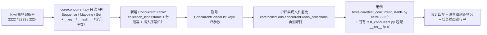

# 01 实施 · `bms_core` 存量整改（批次 1 · 基座原型先行）

> 认证与安全 · 08 裸无序集合治理 · 子任务 02（需求 08-2，补充需求）· 实施记录

[文档首页](../../../../../../文档首页.md) › [02 `bms_core` 存量整改](../08_裸无序集合治理_02_bms_core存量整改.md) › 实施记录　|　[← 任务](../08_裸无序集合治理_02_bms_core存量整改.md)　[测试记录 →](../测试/01_测试_02_bms_core存量整改.md)

## 1. 实施信息 

| 项 | 值 |
| --- | --- |
| 任务 | [02 `bms_core` 存量整改](../08_裸无序集合治理_02_bms_core存量整改.md) |
| 对应需求 | [08-2](../../../../需求/08_需求_裸无序集合治理.md#r08-2) |
| 详细设计 | [01 详细设计](../设计/01_详细设计_02_bms_core存量整改.md) |
| 实施日期 | 2026-09-29（**基座原型先行**；早于计划窗口 2026-10-23 ~ 11-20） |
| 实施人 | minjian |
| 实施环境 | 本地开发机（Python 3.14；uv 工作区；`uv run` 跑 `ruff` / `pyright` / `pytest`） |
| 提交 | 未提交（本轮改动未提交，待用户指令） |
| 结论 | **基座原型先行完成**（仅 `core/concurrent.py` 只读 API + `ConcurrentStable*` 分段写，加护栏实现文件豁免）；契约元数据 / 序列化链、护栏白名单收紧与 616 处存量整改续行 |

## 2. 实施概览 

## 3. 实施过程 

1. **Kiwi 先登记取号（设计口径：先登记、后写自动化）**：经内网 Kiwi TCMS（容器 `bms-kiwi`，Django shell 脚本化登记，分类「平台骨架」/ 优先级 `P2` / 状态 `CONFIRMED` / 标签「自动化」）登记 3 条用例并回读核对，取号 **2222**（插入序形态与并发）/ **2223**（契约零漂移与序列化形态）/ **2224**（存量归零与护栏收紧）。
2. **并发集合只读 API**（`backend/libs/bms_core/src/bms_core/core/concurrent.py`）：
   - `ConcurrentSortedList` 补 `Sequence` 只读面（`__getitem__` 索引 / 切片、`index` / `count` / `__reversed__`），并显式实现 `__eq__`（与 `list` / `tuple` / 同类集合内容相等）与重声明 `__hash__`（`= BaseObject.__hash__`，避免 `__eq__` 覆盖连带置空）；切片返回同类实例。
   - `ConcurrentSortedSet` 补 `Set` 只读面（集合运算 `&` / `|` / `-` / `^` 返回同类且保插入序）与 `__eq__` / `__hash__`。
   - `ConcurrentSortedDict` 补 `Mapping` 只读面（`__getitem__`、`keys` / `items` / `values` / `get` / `__eq__` / `__hash__`）；**`__iter__` 由「键值对」改为「键」**（Mapping 协议，`dict(x)` 仍可用，键值对遍历走 `to_list()` / `items()`）。
3. **删除 `ConcurrentSortedList.key=` 坏参数**（2026-09-29 拍板）：`sortedcontainers` 不支持 `key`（实测 `TypeError: inherit SortedKeyList for key argument`）且零使用零测试，升序形态已退为基座内部实现，直接删除以免误用。
4. **新增插入序形态 `ConcurrentStableList` / `ConcurrentStableSet` / `ConcurrentStableDict`**（`BaseConcurrentSorted` 子类，`collection_kind="stable"`，**默认 `SHARDED`**）：
   - **分段写 + 插入序号归并**：每次写从实例全局单调计数器取号（独立轻量锁，仅整数自增），段内按序号有序；读 / 遍历 / 快照按整数序号用 `heapq.merge` 归并还原全局插入序（归并在锁外）。
   - `list` 按**轮转**分派段（与序号解耦）、`set` / `dict` 按**元素 / 键哈希**分派段（同元素固定落同段，定位 O(1)）；段锁内取号保证段内序号递增（`heapq.merge` 前提）。
   - 元素无需可比较（`dict` / Pydantic 模型 / ORM 模型可入）；`set` 去重（保留首次插入位置）、`dict` 更新已存在键保持原插入位置。
   - 只读面、原子方法集合、非 `SHARDED` 策略（`RW` / `RLCK` / `SNAPSHOT`）与升序形态对齐。
5. **护栏实现文件豁免**（`scripts/tools/base-check/check-bare-collections.py`）：新增 `EXEMPT_FILES`（`core/collections.py` / `core/concurrent.py` / `core/redis_collections.py`）按文件路径白名单豁免，`collect` 跳过豁免文件；`--self-test` 矩阵新增「实现文件豁免」断言（**19 项**）；docstring 口径与用例覆盖说明同步。
6. **用例与回归**：新增 `backend/libs/bms_core/tests/core/test_concurrent_stable.py`（Kiwi 2222，18 项断言：继承链与形态、不可比较元素插入序、`SHARDED` 并发写读回插入序（列表 / 映射）、只读面与内置容器相等、集合运算、写入仅显式方法、分片数校验、升序类只读面）；既有 `tests/core/test_concurrent.py` 适配 `__iter__` 语义（键遍历 + `items()` / `keys()` / `values()` / `[k]` / 相等）。
7. **文档回写**：详细设计回填 Kiwi 编号（§2 / §5 / §7）、插入序默认 `SHARDED`（§3.4）、`key=` 删除（§1.1 / §3.3）与对齐记录（§8 第 18~21 项）；《后端基类清单》§10 登记 `ConcurrentStable*` 完整继承链并回写状态；任务状态「未开始」→「进行中」。

## 4. 问题与处置 

| # | 问题 / 现象 | 原因 | 处置与落点 |
| --- | --- | --- | --- |
| 1 | 分段写可能破坏「段内按序号有序」 | 若先取号再进段锁，同段两次追加可能乱序（先取的号后落段） | 改为**段锁内取号**；`list` 段分派用与序号解耦的**轮转计数**，保段内序号递增（`heapq.merge` 前提） |
| 2 | 集合对称差集 `^` 结果多出交集元素 | 初版第二段用 `not in result` 判重（`result` 已含第一段结果） | 改为 `not in self`（语义：`other` 独有）；升序 / 插入序两处同改 |
| 3 | `AbstractSet` 从 `collections.abc` 导入失败（pyright） | `collections.abc` 无 `AbstractSet`（应为 `typing` 别名，等价 `collections.abc.Set`） | 集合运算参数改用 `Set[Any]`（已导入） |
| 4 | `__eq__` 覆盖连带把 `__hash__` 置 `None`，且 `BaseObject.__eq__` 经 MRO 盖住 ABC 的 `__eq__` | Python 语义 | 每个集合类**显式实现 `__eq__`** 并 `__hash__ = BaseObject.__hash__`（设计 §3.3 已预判） |
| 5 | `ConcurrentSortedDict.__iter__` 改键遍历后既有断言失败 | 语义变更（设计 §7 已登记） | 适配 `tests/core/test_concurrent.py`（键遍历 + `items()` 等），并回填设计 |
| 6 | `to_dict` / `get` 覆写与 `Mapping` / 基类签名不兼容（pyright strict） | 返回型收窄 / 默认参差异 | 沿用既有 `# pyright: ignore[reportIncompatibleMethodOverride]` 标注（与 `ConcurrentSortedDict.to_dict` 同口径） |
| 7 | 实现文件豁免后基线出现 **18 处「可递减」** 条目 | 豁免文件原基线条目不再命中 | **不手工增删**基线条目；随护栏白名单收紧步骤 `--update-baseline` 一次性吸收（548 → 940）时自然清除 |

## 5. 验证结果 

| 项 | 命令 | 结果 |
| --- | --- | --- |
| 定向用例 | `uv run pytest libs/bms_core/tests/core/test_concurrent.py libs/bms_core/tests/core/test_concurrent_stable.py` | **42 passed**（含 Kiwi 2222 的 18 项，含多线程并发写） |
| 并发稳定性 | 新用例重复执行 15 轮 | 全通过（无顺序抖动 / 无丢失） |
| 静态检查 | `uv run ruff check` / `ruff format --check`（改动文件） | 通过 |
| 类型检查 | `uv run pyright`（backend 全量 `libs` + `services`） | **0 errors, 0 warnings** |
| 护栏自测 | `python3 scripts/tools/base-check/check-bare-collections.py --self-test` | 19 项断言全通过（含实现文件豁免） |
| 护栏复跑 | `python3 scripts/tools/base-check/check-bare-collections.py .` | 通过（无新增；基线 18 处可递减提示） |
| 本地预检 | `python3 scripts/tools/preflight/check-preflight.py --fast` | **全部通过**（静态 / 基座与边界 / 网关 / 契约 / 前端类型 / check-status 310 项 0 硬 0 软） |
| 阶段状态 | `python3 scripts/tools/check-docs/check-status.py --root . --stage 06_认证与安全` | 502 项 0 硬 0 软 |
| 文档链接 | `python3 scripts/tools/base-check/check-links.py` | 0 断链 / 0 失效锚点 |

## 6. 偏差与遗留 

- **偏差 1（进度）**：实施日期 **2026-09-29** 早于计划窗口 **2026-10-23 ~ 11-20**——按 2026-09-29 拍板「基座原型先行」提前落地风险最高的并发分段写，后续会话在窗口内续行（不影响排期与工时口径）。
- **偏差 2（口径细化）**：插入序默认锁策略由设计原文「默认 `RW`、高并发显式传 `SHARDED`」改为**默认 `SHARDED`**（2026-09-29 拍板并回写设计 §3.4 / §8），使各处落点无需传参即得高并发写。
- **偏差 3（护栏范围）**：本轮仅加「实现文件豁免」（最小改动，2026-09-29 拍板），**白名单收紧**（裸容器 / 抽象 / 升序形态一律违规）留待基座能力收口步骤；届时基线 `--update-baseline` 吸收至 **940**。
- **遗留**：
  1. **契约元数据 `CONTRACT_COLLECTION` + 空集合工厂常量**（`schemas/base.py`）与**序列化链识别集合类**（`serialization.py` / `core/base.py`）续行（用例 2223）。
  2. **护栏白名单收紧 + 基线吸收（548 → 940）**续行，并补 `--self-test` 白名单新规矩阵（用例 2224）。
  3. **616 处存量整改**（批内先类字段、后签名）与调用方适配续行。
  4. 基线 18 处「可递减」条目随步骤 2 的自然吸收清除。

> 本文档依《[文档生成规范](../../../../../../规范/文档生成规范.md)》编写
