# 01 实施 · `bms_core` 存量整改（批次 1 · 基座原型先行）

> 认证与安全 · 08 裸无序集合治理 · 子任务 02（需求 08-2，补充需求）· 实施记录

[文档首页](../../../../../../文档首页.md) › [02 `bms_core` 存量整改](../08_裸无序集合治理_02_bms_core存量整改.md) › 实施记录　|　[← 任务](../08_裸无序集合治理_02_bms_core存量整改.md)　[测试记录 →](../测试/01_测试_02_bms_core存量整改.md)

## 1. 实施信息 

| 项 | 值 |
| --- | --- |
| 任务 | [02 `bms_core` 存量整改](../08_裸无序集合治理_02_bms_core存量整改.md) |
| 对应需求 | [08-2](../../../../需求/08_需求_裸无序集合治理.md#r08-2) |
| 详细设计 | [01 详细设计](../设计/01_详细设计_02_bms_core存量整改.md) |
| 实施日期 | 2026-09-29（**基座原型先行**；早于计划窗口 2026-10-23 ~ 11-20） |
| 实施人 | minjian |
| 实施环境 | 本地开发机（Python 3.14；uv 工作区；`uv run` 跑 `ruff` / `pyright` / `pytest`） |
| 提交 | 未提交（本轮改动未提交，待用户指令） |
| 结论 | **基座能力与护栏收紧完成**（`core/concurrent.py` 只读 API + `ConcurrentStable*` 分段写；`schemas/base.py` 契约元数据；`core/serialization.py` / `core/base.py` 序列化链；护栏白名单收紧 + 实现文件豁免 + 基线如实吸收 **548 → 918**）；594 处存量整改与调用方适配续行 |

```mermaid
flowchart LR
    A["Kiwi 先登记取号<br/>2222 / 2223 / 2224"] --> B["core/concurrent.py 只读 API<br/>Sequence / Mapping / Set + __eq__/__hash__（含升序类）"]
    B --> C["新增 ConcurrentStable*<br/>collection_kind=stable + 分段写 + 插入序号归并"]
    C --> D["删除 ConcurrentSortedList.key= 坏参数"]
    D --> E["schemas/base.py 契约元数据<br/>CONTRACT_COLLECTION + 空集合工厂常量"]
    E --> F["序列化链识别集合类<br/>stringify_ids / _convert 同型重组；stable_json_dumps 前置规整"]
    F --> G["护栏白名单收紧 + 实现文件豁免<br/>裸容器 / 抽象 / 升序形态一律违规；自测矩阵 24 项"]
    G --> H["基线如实吸收 548 → 918<br/>复跑「新增 0 / 残留 0」"]
    H --> I["用例 + 文档回写<br/>tests/core·schemas·护栏；数字全域修正；清单/任务状态"]
```

## 2. 实施概览 

## 3. 实施过程 

1. **Kiwi 先登记取号（设计口径：先登记、后写自动化）**：经内网 Kiwi TCMS（容器 `bms-kiwi`，Django shell 脚本化登记，分类「平台骨架」/ 优先级 `P2` / 状态 `CONFIRMED` / 标签「自动化」）登记 3 条用例并回读核对，取号 **2222**（插入序形态与并发）/ **2223**（契约零漂移与序列化形态）/ **2224**（存量归零与护栏收紧）。
2. **并发集合只读 API**（`backend/libs/bms_core/src/bms_core/core/concurrent.py`）：
   - `ConcurrentSortedList` 补 `Sequence` 只读面（`__getitem__` 索引 / 切片、`index` / `count` / `__reversed__`），并显式实现 `__eq__`（与 `list` / `tuple` / 同类集合内容相等）与重声明 `__hash__`（`= BaseObject.__hash__`，避免 `__eq__` 覆盖连带置空）；切片返回同类实例。
   - `ConcurrentSortedSet` 补 `Set` 只读面（集合运算 `&` / `|` / `-` / `^` 返回同类且保插入序）与 `__eq__` / `__hash__`。
   - `ConcurrentSortedDict` 补 `Mapping` 只读面（`__getitem__`、`keys` / `items` / `values` / `get` / `__eq__` / `__hash__`）；**`__iter__` 由「键值对」改为「键」**（Mapping 协议，`dict(x)` 仍可用，键值对遍历走 `to_list()` / `items()`）。
3. **删除 `ConcurrentSortedList.key=` 坏参数**（2026-09-29 拍板）：`sortedcontainers` 不支持 `key`（实测 `TypeError: inherit SortedKeyList for key argument`）且零使用零测试，升序形态已退为基座内部实现，直接删除以免误用。
4. **新增插入序形态 `ConcurrentStableList` / `ConcurrentStableSet` / `ConcurrentStableDict`**（`BaseConcurrentSorted` 子类，`collection_kind="stable"`，**默认 `SHARDED`**）：
   - **分段写 + 插入序号归并**：每次写从实例全局单调计数器取号（独立轻量锁，仅整数自增），段内按序号有序；读 / 遍历 / 快照按整数序号用 `heapq.merge` 归并还原全局插入序（归并在锁外）。
   - `list` 按**轮转**分派段（与序号解耦）、`set` / `dict` 按**元素 / 键哈希**分派段（同元素固定落同段，定位 O(1)）；段锁内取号保证段内序号递增（`heapq.merge` 前提）。
   - 元素无需可比较（`dict` / Pydantic 模型 / ORM 模型可入）；`set` 去重（保留首次插入位置）、`dict` 更新已存在键保持原插入位置。
   - 只读面、原子方法集合、非 `SHARDED` 策略（`RW` / `RLCK` / `SNAPSHOT`）与升序形态对齐。
5. **护栏实现文件豁免**（`scripts/tools/base-check/check-bare-collections.py`）：新增 `EXEMPT_FILES`（`core/collections.py` / `core/concurrent.py` / `core/redis_collections.py`）按文件路径白名单豁免，`collect` 跳过豁免文件；`--self-test` 矩阵新增「实现文件豁免」断言（**19 项**）；docstring 口径与用例覆盖说明同步。
6. **Pydantic 契约元数据 `CONTRACT_COLLECTION`**（`schemas/base.py`）：`_ContractCollection`（落 `BaseFrameworkObject`——自定义类须有基类）按 `get_origin` 分派同类内置容器 schema（映射 → `dict_schema`，其余 → `list_schema`；**集合类以 `list` 校验保插入序**，去重交集合类）；`__get_pydantic_json_schema__` 为集合类补 `uniqueItems`（与 `frozenset[X]` 一致）；序列化器按 `info.mode` 区分（Python 同类重组 / JSON 内置容器）；`Optional` 联合形态经 `union_schema` 逐成员处理。新增空集合工厂常量 `CONTRACT_STABLE_LIST` / `CONTRACT_STABLE_DICT` / `CONTRACT_STABLE_SET`。
7. **序列化链识别集合类**（只依赖 `collections.abc`，不反向 import `core.collections` / `core.concurrent`）：`core/serialization.py` 新增 `rebuild_mapping` / `rebuild_sequence`（同型重组，构造不可用时回退内置）与 `normalize_collections`（前置规整为内置容器）；`stringify_ids` 递归映射 / 序列 / 集合（`str` / `bytes` 不参与，内置 `set` / `frozenset` 保持原样），`stable_json_dumps` 前置规整；`core/base.py` 的 `_convert` 同步按只读面识别并同型重组。
8. **用例与回归**：新增 `tests/core/test_concurrent_stable.py`（Kiwi 2222）与 `tests/schemas/test_contract_collections.py`（Kiwi 2223）；既有 `tests/core/test_concurrent.py` 适配 `__iter__` 语义。
9. **护栏白名单收紧**（`check-bare-collections.py`）：判违规形态收敛为**固定违规集**（裸容器 + typing 别名 + 只读 / 可变抽象 `Sequence` / `Mapping` / `AbstractSet` / `Collection` / `Mutable*` + 升序形态 `Sorted*` / `ConcurrentSorted*`），**插入序形态为白名单**（`ConcurrentStable*`），迭代 / 调用协议（`Iterable` / `Iterator` / `Generator` / `Callable` 等）不查；实现文件豁免保留；docstring 口径改写；`--self-test` 矩阵由 19 项扩到 **24 项**（新增抽象落点 / 升序形态 / 白名单命中不报 / 迭代协议不报）。
10. **基线如实吸收**：`--update-baseline` 吸收口径收紧后的现状——**548 → 918 条**（852 个聚合条目；`libs` 594 / `services` 104 / `ops` 75 / `scripts/tools` 145），复跑「**新增 0 / 残留 0**」；与初稿 940 的差异（未扣实现文件豁免 20 处与 `ClassVar` 常量 2 处，共 22 处）按用户拍板修正全域数字。
11. **文档回写**：详细设计回填 Kiwi 编号（§2 / §5 / §7）、插入序默认 `SHARDED`（§3.4）、`key=` 删除（§1.1 / §3.3）、契约元数据实现细化（§3.5）与**数字修正**（§1.1 新增说明：940 → 918、616 → 594）、《后端基类清单》§10 登记 `ConcurrentStable*` 完整继承链并回写状态；任务状态「未开始」→「进行中」；**数字全域修正**（设计 / 任务 02~03 / 父任务 / 需求 08-2 / 需求总览 / 计划 / 清单 / 盘点报告）。

## 4. 问题与处置 

| # | 问题 / 现象 | 原因 | 处置与落点 |
| --- | --- | --- | --- |
| 1 | 分段写可能破坏「段内按序号有序」 | 若先取号再进段锁，同段两次追加可能乱序（先取的号后落段） | 改为**段锁内取号**；`list` 段分派用与序号解耦的**轮转计数**，保段内序号递增（`heapq.merge` 前提） |
| 2 | 集合对称差集 `^` 结果多出交集元素 | 初版第二段用 `not in result` 判重（`result` 已含第一段结果） | 改为 `not in self`（语义：`other` 独有）；升序 / 插入序两处同改 |
| 3 | `AbstractSet` 从 `collections.abc` 导入失败（pyright） | `collections.abc` 无 `AbstractSet`（应为 `typing` 别名，等价 `collections.abc.Set`） | 集合运算参数改用 `Set[Any]`（已导入） |
| 4 | `__eq__` 覆盖连带把 `__hash__` 置 `None`，且 `BaseObject.__eq__` 经 MRO 盖住 ABC 的 `__eq__` | Python 语义 | 每个集合类**显式实现 `__eq__`** 并 `__hash__ = BaseObject.__hash__`（设计 §3.3 已预判） |
| 5 | `ConcurrentSortedDict.__iter__` 改键遍历后既有断言失败 | 语义变更（设计 §7 已登记） | 适配 `tests/core/test_concurrent.py`（键遍历 + `items()` 等），并回填设计 |
| 6 | `to_dict` / `get` 覆写与 `Mapping` / 基类签名不兼容（pyright strict） | 返回型收窄 / 默认参差异 | 沿用既有 `# pyright: ignore[reportIncompatibleMethodOverride]` 标注（与 `ConcurrentSortedDict.to_dict` 同口径） |
| 7 | 实现文件豁免后基线出现 **18 处「可递减」** 条目 | 豁免文件原基线条目不再命中 | 已随护栏白名单收紧步骤 `--update-baseline` 一次性吸收（548 → **918**）而清除 |
| 8 | 契约集合 `model_dump_json()` 报 `_serialize_ids` 收到 `dict`（集合序列化器 `return_schema` 触发对返回值的二次模型序列化） | `wrap_serializer_function_ser_schema(return_schema=...)` 使 Pydantic 对返回的 list 再次按元素模型序列化 | **移除 `return_schema`**（JSON Schema 序列化模式对 `BaseSchema` 本就为 `{}`，由既有 wrap model serializer 决定；契约走校验模式） |
| 9 | 集合类契约字段 JSON 串顺序非插入序 | 校验 / 序列化经 `frozenset_schema`，元素序丢失 | 校验改 `list_schema`（保插入序，去重交集合类）；`uniqueItems` 由 `__get_pydantic_json_schema__` 补齐（与 `frozenset[X]` 逐字节一致） |
| 10 | 「所有自定义类必须继承基类」用例拦截无基类的 `_ContractCollection` | 规范要求一切自定义类必继承基类 | 落 `BaseFrameworkObject`（非数据对象）（设计 §3.5 已回写） |
| 11 | `stringify_ids` / `_convert` / 元数据实现触发 pyright strict「partially unknown」 | `object` 经 `isinstance` 收窄为 `Mapping[Unknown, Unknown]`；`type(x)(...)` 动态构造 | 显式 `cast` 收窄（`Mapping[object, object]` / `Sequence[object]` / `Set[object]` / `Callable[...]`），运行时行为不变 |
| 12 | 护栏收紧后实测 918 处，与设计初稿 940 不符 | 初稿测绘未扣除**实现文件豁免**（§3.7，20 处）与 **`ClassVar` 常量豁免**（2 处）；且 918 − 594 = 324 恰与批次 1 递减目标一致 | 按用户拍板**如实吸收 918** 并**全域修正数字**（940→918、616→594、裸 305→285、抽象 311→309、位置 245/241→248/218；设计 §1.1 加「数字修正」说明） |
| 13 | `_ContractCollection` 触发「所有自定义类必须继承基类」用例与 pyright 未知类型 | 无基类 / `isinstance` 收窄为 `Unknown` / 动态构造 | 落 `BaseFrameworkObject`；显式 `cast`（`CollectionType` / `Callable[[Any], Any]`） |

## 5. 验证结果 

| 项 | 命令 | 结果 |
| --- | --- | --- |
| 定向用例 | `uv run pytest libs/bms_core/tests`（`bms_core` 全量） | **1099 passed / 37 skipped**（含 Kiwi 2222 的 18 项并发与只读面、Kiwi 2223 的 9 项契约与序列化链） |
| 并发稳定性 | 新并发用例重复执行 15 轮 | 全通过（无顺序抖动 / 无丢失） |
| 静态检查 | `uv run ruff check` / `ruff format --check`（改动文件） | 通过 |
| 类型检查 | `uv run pyright`（backend 全量 `libs` + `services`） | **0 errors, 0 warnings** |
| 护栏自测 | `python3 scripts/tools/base-check/check-bare-collections.py --self-test` | **24 项断言全通过**（白名单 / 抽象落点 / 升序形态 / 实现文件豁免 / 迭代协议 / 基线语义） |
| 护栏报告 | `python3 scripts/tools/base-check/check-bare-collections.py . --report --json` | 命中 **918** 处（类字段 153 / 参数 390 / 返回 375；`libs` 594 / `services` 104 / `ops` 75 / `scripts/tools` 145） |
| 基线吸收与复跑 | `--update-baseline` → 直跑检查 | 基线 **918** 条（852 聚合条目）；复跑「新增 0 / 残留 0」 |
| 本地预检 | `python3 scripts/tools/preflight/check-preflight.py --fast` | **全部通过**（静态 / 基座与边界 / 网关 / 契约零漂移 / 前端类型 / check-status 310 项 0 硬 0 软） |
| 阶段状态 | `python3 scripts/tools/check-docs/check-status.py --root . --stage 06_认证与安全` | 502 项 0 硬 0 软 |
| 文档链接 | `python3 scripts/tools/base-check/check-links.py` | 0 断链 / 0 失效锚点 |

## 6. 偏差与遗留 

- **偏差 1（进度）**：实施日期 **2026-09-29** 早于计划窗口 **2026-10-23 ~ 11-20**——按 2026-09-29 拍板「基座原型先行、再铺开其余改造」提前落地风险最高的并发分段写与契约元数据，后续会话在窗口内续行（不影响进度与工作量口径）。
- **偏差 2（口径细化）**：插入序默认锁策略由设计原文「默认 `RW`、高并发显式传 `SHARDED`」改为**默认 `SHARDED`**（2026-09-29 拍板并回写设计 §3.4 / §8），使各处落点无需传参即得高并发写。
- **偏差 3（护栏范围）**：先加「实现文件豁免」（最小改动，2026-09-29 拍板），随后**完成白名单收紧**（裸容器 / 抽象 / 升序形态一律违规）并 `--update-baseline` 吸收至 **918** —— 两项已闭环。
- **偏差 4（实现细化）**：契约集合的校验 / JSON Schema 实现以「`list` 校验保插入序 + `uniqueItems` 元数据补丁」替代设计初稿的「`frozenset` 校验」（见 §4 问题 9；已回写设计 §3.5）。
- **偏差 5（数字修正）**：护栏实测 918（libs 594）而非初稿 940（616）——初稿未扣除实现文件豁免 20 处与 `ClassVar` 常量豁免 2 处；按用户拍板如实吸收并**全域修正数字**（设计 / 任务 02~03 / 父任务 / 需求 08-2 / 需求总览 / 计划 / 清单 / 盘点报告）；批次递减目标 324 / 220 / 0 **不变**。
- **遗留**：
  1. **594 处存量整改**（批内先类字段、后签名）与调用方适配续行（含契约字段落 `Annotated[..., CONTRACT_COLLECTION]` 与 `default_factory` 换工厂常量）。
  2. 用例 2224 的完整自动化（`tests/boundary/test_bare_collections_guard.py`：断言 `by_area.libs == 0` 与基线递减至 324）待遗留项 1 完成后落。

> 本文档依《[文档生成规范](../../../../../../规范/文档生成规范.md)》编写

## 7. 实施过程补充 · 集合体系唯一链收口（2026-09-30） 

**动作**（对应设计 §9）：

1. **集合体系收口为唯一链**（所有集合类一律（间接）继承 `BaseCollection`）：
   - `core/collections.py`：`BaseConcurrentSorted`（旧语义根）→ **`BaseCollection`**（集合体系唯根，`collection_kind="collection"`）；`BaseSyncSorted` → **`BaseSorted`**（非并发有序基类，承载同步读公共段，`collection_kind="sorted"`）；`SortedList` / `SortedDict` / `SortedSet` 父类改挂 `BaseSorted`。
   - `core/concurrent.py`：`BaseLockedSorted` → **`BaseConcurrent`**（基础并发层，`collection_kind="sorted_concurrent"`，继承 `BaseSorted`）；`ConcurrentSorted*` / `ConcurrentStable*` 父类随之更新。
   - `core/redis_collections.py`：`BaseAsyncSorted(BaseSorted)`（跨副本异步有序）**显式覆写同步读公共段为不支持**（`to_list` / `__iter__` / `_json_data` 恒抛 `NotImplementedError`）；新增 **`BaseCacheSnapshot(BaseCollection)`**（通用缓存层，抽象 `async get()` / `async invalidate()`）；**`RedisSnapshot` 由 `BaseFrameworkObject` 改挂 `BaseCacheSnapshot`**。
   - `core/objects/roots.py`：体系根注释「集合 `BaseSorted`」→「集合 `BaseCollection`」。
   - `schemas/base.py`：契约元数据改认集合体系唯根（`CollectionType = type[BaseCollection[Any]]`，`issubclass(...)` / `isinstance(...)` 均改 `BaseCollection`）。
2. **护栏口径收紧 + 取消全部豁免**（`scripts/tools/base-check/check-bare-collections.py`）：扫描目标扩至 `backend/libs/bms_core/tests` 与 `backend/services/*/tests`；新增**函数体带注解局部变量**检测（新增位置 `local`）；删除 `ClassVar` 与 `BaseSettings` 豁免；`EXEMPT_FILES` → `SYSTEM_IMPLEMENTATION_FILES`（语义改为「集合体系实现文件**不属约束对象**」，护栏只约束业务侧集合声明）；`--self-test` 矩阵同步（「ClassVar 报 / 配置字段报 / 局部变量报 / 测试目录纳入 / 实现文件不报」）。`check-backend-base.py` 体系根白名单随清单 §10 改 `BaseCollection`（无脚本改动）。
3. **基线重算**：`python3 scripts/tools/base-check/check-bare-collections.py . --update-baseline` → **1711 条**（918 → 1711；`libs` 1036 / `services` 348 / `scripts/tools` 224 / `ops` 103）。
4. **测试适配**：`test_collections_chain.py` 重写为唯一链（唯一根 / 分支关系 / 跨副本无同步读入口 / 形态标记 / 同步侧行为 / 清单登记，Kiwi 2221）；`test_collections.py`（`BaseSorted` 名不变）、`test_concurrent.py`、`test_concurrent_stable.py`、`test_object_bases_roots.py`（`OBJECT_BASES` 增 `BaseCollection` / `BaseConcurrent` / `BaseCacheSnapshot`；`RedisSnapshot` 台账改 `BaseCacheSnapshot`）、`test_value_object_roots.py`（`_SYSTEM_ROOTS` 改 `BaseCollection`）同步。

**验证**：`pytest` 集合 / 根治理 6 份用例 **80 passed**；`check-backend-base.py` 六项全绿（继承链 744 条相邻关系 / 直继承 7 个体系根 / 数据类语义 565 个类）；`check-bare-collections.py` 复跑「新增 0 / 残留 0」；`preflight --fast` 全绿（含契约快照与前端 `api-types` 零漂移）。

**偏差**：设计 §3 / §8 中「`BaseSorted` 为体系根」「两条角色链」「实现文件豁免」「基线 918 → 324 / 220 / 0」为 **2026-09-29 旧口径**，已由设计 §9 与本节取代（**基线口径改为 1711 起递减**）；批次数量按 2026-09-30 实测为 `bms_core` 1036 / `services` 348 / `scripts/tools` 224 + `ops` 103。

## 8. 实施过程补充 · 存量整改子批 1（类字段，2026-09-30） 

**范围**：`bms_core`（`src` + `tests`）**类字段命中 60 处**（含 `tests`），全部改落插入序集合类；附带 `services` 侧调用方适配（`sortable_fields` 子类赋值 7 处 + 平台侧测试 2 处）。

**动作**：

1. **值对象 / 契约字段（Mapping / dict / list）**：`audit/hashchain.py`、`dict/seed.py`、`events/base.py`、`events/contracts.py`、`idp/base.py`、`idp/registry.py`、`masking/default.py`、`oauth/oidc_provider.py`、`oauth/verify.py`、`outbound/http.py`、`outbox/base.py`、`query/base.py`、`search/base.py`、`servicecall/base.py`、`tracing/base.py`、`transfer/importer.py`、`ws/base.py`、`db/migration.py` → `ConcurrentStableDict` / `ConcurrentStableList` / `ConcurrentStableSet`（`Mapping` / `Sequence` / `Collection` 抽象一并落集合类）。
2. **`ClassVar` 常量（原豁免）**：`BaseRepository.sortable_fields` / `BaseSchema.masked_fields` / `Masker.masked_fields`（属性返回）→ `ConcurrentStableSet`；`org/base.py` 与 `services` 各仓储子类赋值、测试断言同步（`ConcurrentStableSet` 与内置容器**内容相等**，断言不改）。
3. **ORM JSON 列（9 处）**：`dict/models.py`（`attr_json` / `operators` / `options`）、`listing/models.py`（`conditions` / `params` / `layout`）、`models/outbox.py`（`payload` ×2）→ `Mapped[ConcurrentStable*]`，列类型由裸 `JSON` 改为新增的 `StableJson`。
4. **新增基座类型 `StableJson`（`models/base.py`）**：`TypeDecorator[JSON]`——`process_bind_param` 经 `normalize_collections` 规整为内置容器落库（免 `json.dumps` 遇非内置容器报错）；`process_result_value` 经 `to_stable_value` **递归**转插入序集合类（声明与运行期形态一致）。
5. **配置字段（原豁免，21 处）**：`core/config.py` 各分区字段 → `Annotated[ConcurrentStable*, CONTRACT_COLLECTION]` + `Field(default_factory=CONTRACT_STABLE_*)`（非空默认值包 `lambda: ConcurrentStableList([...])`）；`attribute_map` 嵌套落 `ConcurrentStableDict[str, ConcurrentStableList[str]]`。pydantic-settings（TOML / 环境变量）解析经契约元数据校验后转集合类；消费方按只读面使用。
6. **测试适配**：`test_contract_collections.py` 的「内置容器对照模型」改为 `TypeAdapter(list[X] / dict[K, V] / frozenset[X])` 生成参照 schema（不再声明内置容器字段），比对去 `$defs` / `title` / `default`。

**验证**：`pytest libs/bms_core/tests`（除既有失败 `crosscut/test_m2_closure.py` / `test_m5_closure.py`，见偏差）**1081 passed / 37 skipped**；`services/platform/tests/repositories` 同步通过；`ruff check` / `ruff format --check` 全绿；`check-bare-collections.py` 复跑「新增 0 / 残留 0」，**基线 1711 → 1647**（`libs` 类字段归零）。

**偏差（新发现，非本任务引入）**：`libs/bms_core/tests/crosscut/test_m2_closure.py` 与 `test_m5_closure.py` 断言任务文档含 `| 状态 | 已完成 |` 行，该行已被 2026-09-30 的「阶段计划单落点收敛」提交移除——**在干净树同样失败**，属既有 red；**已按用户拍板改为「任务 / 域总览不得承载状态与完成日期 + 由阶段计划表核对已完成与完成日期」**（`fix(基座测试)` 单独提交，两用例恢复绿）。

## 9. 实施过程补充 · 存量整改子批 2 起手（签名，2026-09-30） 

**范围**：`bms_core` 签名命中 **658 处**（参数 314 + 返回 344，分布 219 份文件）、局部变量 **314 处**（子批 3）。签名批次**不能只改注解**——须同时改**实现体**（返回同型集合类）与**调用方**（入参落集合类），以满足「形态一致」验收基准。

**起手试点（1 份实现文件 + 3 份调用方 / 测试）**：`schemas/sorting.py`（7 处）

- `SortSpec.parse`（`order: ConcurrentStableList[str] | None` → `ConcurrentStableList[SortSpec]`）、`SortSpec.allowed`（`ConcurrentStableList[SortSpec]` + `ConcurrentStableSet[str]` → `ConcurrentStableList[SortSpec]`）、`BaseSortQuery.specs`（`ConcurrentStableSet[str] | None` → `ConcurrentStableList[SortSpec]`）。
- 实现体同型产出：`names` / `directions` / `specs` / `seen` 局部量一并落集合类（子批 3 口径前置），列表写法由 `append` 改**原子方法 `add`**、白名单过滤结果包 `ConcurrentStableList(...)`。
- 调用方与测试同步：`test_sorting.py`、`test_pagination.py`、`services/platform/tests/repositories/test_base_repository.py`（`["asc"]` → `ConcurrentStableList([...])`、`{"id"}` → `ConcurrentStableSet({...})`）。

**验证**：`pytest libs/bms_core/tests` **1099 passed / 37 skipped**；`ruff check` / `ruff format --check` 全绿；`check-bare-collections.py`「新增 0 / 残留 0」，**基线 1647 → 1638**。

**尺度评估（供后续推进参考）**：试点 1 份文件（7 处命中 / 触达 4 份文件）为单轮可验证单元；`bms_core` 签名 658 处 + 局部 314 处分布在 219 份文件，**须按文件多轮推进**（每轮：改实现体 → 调用方适配 → 定向用例 → 护栏复跑 → 提交）。后续仍按「分子批推进、每子批一提交」执行。

## 10. 实施过程补充 · 存量整改子批 2 主体 · `repositories/` 基座（签名单轮，2026-09-30） 

**范围**：`bms_core` `repositories/` 基座 **45 处**（`base_db_repository.py` 13 / `ordering.py` 16 / `base_repository.py` 8 / `base_memory_repository.py` 5 / `base_scoped_repository.py` 3），并把**系统级波及**的调用方一并适配——`BaseRepository` / `BaseMemoryRepository` / `BaseDbRepository` / `BaseScopedRepository` / 排序公共段（`order_criteria` / `keyset_condition` / `sort_items` / `is_after_cursor` / `assert_sortable_fields_indexed`）的**类字段 / 签名参数 / 签名返回 / 函数体局部变量**全部落插入序集合类。这是交接单 §7 第 1 项指定的「系统级单元单独成轮」。

**动作**：

1. **仓储契约与实现（形态一致）**：`list` / `list_page` / `list_cursor` → `ConcurrentStableList[ModelT]`（实现体 `ConcurrentStableList(result.scalars().all())`、切片天然返回同类）；`_apply_sort` / `_resolve_sort` / `effective_sort` / `build_cursor` 入参 / 返回落 `ConcurrentStableList[SortSpec]`；`_scope_conditions` / `_scope_where` 落 `ConcurrentStableList[...]`；`_write_values` / `_apply_tenant_scope` 落 `ConcurrentStableDict[str, object]`（写入由 `payload[field] = ...` 改**原子方法 `set`**）。
2. **内存基线与模块级常量（局部批次前置）**：`BaseMemoryRepository._items` → `ConcurrentStableDict[int, ModelT]`（写 / 删改 `set` / `delete`，`_build` / `_apply` 入参同步）；`_WRITE_BLOCKED_FIELDS` → `ConcurrentStableSet[str]`；`_OPERATOR_BUILDERS` / `_COMPARATORS` → `ConcurrentStableDict[...]`。
3. **排序公共段**：`order_criteria` / `keyset_condition` / `sort_items` / `is_after_cursor` 入参落集合类，`sort_items` 返回 `ConcurrentStableList(...)`（内部仍用内置列表做稳定排序，仅出口同型重组）；`assert_sortable_fields_indexed` 白名单参数落 `ConcurrentStableSet[str]`、局部 `indexed` 同步；列表局部量 `criteria` / `clauses` / `prefix` 由 `append` 改 `add`（`_direction_of` / `_COMPARATORS` 同步）。调用点按集合类构造：`keyset_condition(sort, ConcurrentStableList(payload.specs), ConcurrentStableList(payload.values), ...)`、`is_after_cursor(..., ConcurrentStableList(payload.values), ...)`。
4. **服务侧调用方适配（波及面）**：`services/base_service.py` 的 `list` 返回改 `ConcurrentStableList[ModelT]`（`page` / `cursor_page` 直接复用仓储已产出的集合类，去掉二次包裹）；`services/platform` 的 `DemoRepository._build` / `_apply` 与 `DemoService.list_demos` 随基类同步。经排查，其余服务侧仓库子类仅**内部**调用 `_apply_sort` / `_resolve_sort` / `_scope_where`，消费方式为 `*` 解包与 `.where(*...)`，无需改动；无任何服务侧子类覆写 `list` / `list_page` / `list_cursor`。

**调用方与测试同步**（`直接实参类型` 同步落集合类，避免 pyright 报不兼容）：`libs` 侧 `test_ordering.py`（整体重写）、`test_db_repository.py`（`tenant_payload` 与排序实参）、`test_scoped_repository.py` / `tests/db/test_data_access.py` / `tests/db/test_tenant_routing.py`（内存基线 `_build` / `_apply` 覆写）、`tests/integration/test_three_db_integration.py`（`order_criteria` 实参）；`services/platform` 侧 `tests/repositories/test_base_repository.py`、`tests/services/test_base_service.py`、`tests/services/test_base_transactional_service.py`（同上）。测试断言维持**内容相等**（`== [..]` / `== {..}` 均成立），未改语义。

**验证**：

| 项 | 命令 | 结果 |
| --- | --- | --- |
| 定向用例（基座） | `pytest libs/bms_core/tests/repositories libs/bms_core/tests/db` | **142 passed** |
| 全量 `libs` + 平台 | `pytest libs/bms_core/tests services/platform/tests` | **1450 passed / 38 skipped / 1 failed**（失败项见下「偏差」） |
| 其余服务 | `pytest services/{identity,org,tenant,search,notification,file,ai,report}/tests` | **426 passed / 2 skipped** |
| 静态检查 | `ruff check .` / `ruff format --check .`（backend 全量） | 全绿（956 文件已格式化） |
| 护栏 | `check-bare-collections.py .` | **「新增 0 / 残留 0」**；`repositories/` **45 → 0** |
| 基线递减 | `--update-baseline` | **1622 → 1553**（`libs` 947 → 892 / `services` 348 → 334 / `ops` 103 / `scripts/tools` 224） |
| 本地预检 | `check-preflight.py --fast` | **全部通过**（含契约零漂移 / 网关 / 事件契约 / 前端 `api-types`） |

**偏差（既有 red，非本轮引入）**：`services/platform/tests/dict/test_dict_real.py::test_http_endpoints` 在**干净树同样失败**——`GET /dicts/query-providers` 经 `payload.model_dump()`（Python 模式）产出 `ConcurrentStableDict` 后由 `ApiResponse` 走 JSON 序列化，报 `Unable to serialize unknown type: ConcurrentStableDict`；属早前契约字段落集合类时遗留的序列化出口适配缺口（落点 `services/platform/src/bms_platform/api/dict.py::_provider_record`，宜改 `model_dump(mode="json")`），**不在本轮「repositories/ 基座」范围**，另议处置。

**遗留**：`bms_core` 剩余 **891 处**（`libs` 892，含 `tests` 约 292 / `services` 89 / `dict` …），按交接单 §7 顺序续推（能力域 → 注册表目录 → 其余 `libs` → `tests` 收尾）。

## 11. 实施过程补充 · 存量整改子批 2 主体 · `dict/` 能力域（签名单轮，2026-09-30） 

**范围**：`bms_core` `dict/` 能力域 **70 处**（`sql.py` 23 / `http.py` 14 / `query.py` 14 / `cache.py` 7 / `base.py` 6 / `providers.py` 3 / `seed.py` 2 / `null.py` 1），外加其直接基座 **`query/` 4 处**（`BaseQueryProvider.query` / `BaseQueryProviderRegistry.query` 参数 + `query/null.py` 两处覆写；`dict/providers.py` 与 `dict/query.py` 的调用点依赖）。按交接单 §7 第 2 项「能力域」首项推进。

**动作**：

1. **dict 三契约与缓存（形态一致）**：`BaseDictTranslator.translate` → `ConcurrentStableDict[str, str]`；`DictCacheRegion.avalue_subset` / `aset_value_subset` 落 `ConcurrentStableList[str]` / `ConcurrentStableDict[str, str]`；`MemoryDictCacheRegion` 的 `_versions` / `_locks` 落 `ConcurrentStableDict`（写 / 删改 `set` / `delete`），`RedisDictCacheRegion` 的重覆写同型。
2. **真实取数 / 翻译（`sql.py`）**：`by_type` / `batch` / `translate` 的实现体局部量（`results` / `pending` / `pages` / `conditions` / `result` / `items`）与辅助函数签名（`_load_type_page` / `_load_batch_pages` / `_query_page` / `_query_batch` / `_query_labels` / `_item_conditions` / `_snapshot_payload` / `_load_labels`）全落集合类；`items.append` → `add`、`conditions.append` → `add`、`results[name] = …` → `set`。
3. **外部 IO 边界显式转换（新增边界适配，不新增豁免）**：
   - **JSON 请求体**（`http.py`）：`json_body=dict(body)`（httpx 侧 `json.dumps` 只吃内置容器）；
   - **缓存载荷**（`sql.py`）：`_snapshot_payload` 声明 `ConcurrentStableDict`、嵌套条目保持内置容器（JSON 友好），写入处 `self._cache.aset_type(..., dict(_snapshot_payload(result)))`；
   - **Redis 子集写**（`cache.py`）：`await self._redis.aset(key, dict(merged))`（`RedisCacheRegion` 序列化用 `json.dumps(default=str)`，集合类会被 `str()` 破坏）；
   - **SQL `IN` 绑定**（`query.py`）：`expression.in_(list(values))`。
4. **HTTP 出站出口（`http.py`）**：`_headers` / `_call` / `_to_type_result` / `_to_item` / `_chunks` 签名落集合类；JSON 响应（内置容器）入参处显式 `ConcurrentStableDict(...)` 构造；`items` 由 `setdefault` 改原子 `put_if_absent`；`_chunks` 分批元素落 `ConcurrentStableList[str]`。
5. **高级查询（`query.py`）**：模块常量 `DICT_FIXED_FIELD_TYPES` / `DICT_OPERATORS_BY_TYPE` / `_ALL_OPERATORS` 与 `load_attrs` / `advanced_query` 局部量、条件引擎四处签名（`_build_conditions` / `_build_group` / `_build_item` / `_field_expression`）全落集合类；`params` 由内置字典改 `ConcurrentStableDict`（`setdefault` → `put_if_absent`、`params["page"]` → `set`）；`_as_list` → `ConcurrentStableList[object]`。
6. **提供者与种子**：`BuiltinDictQueryProvider.query` 入参落 `ConcurrentStableDict[str, object]`（`result_rows` 落 `ConcurrentStableList[ConcurrentStableDict]`）；`query/base.py` / `query/null.py` 基座与占位签名同步；`seed.py` 两处辅助参数落 `ConcurrentStableList` 并在调用点构造集合类，`SeedItem` / `SeedType` 的 `i18n` **构造点**补 `ConcurrentStableDict(...)`（形态一致）。

**调用方与测试同步**：`services/platform/tests/dict/test_dict.py`（`_InMemoryDictTranslator.translate` 覆写）、`test_dict_real.py`（`avalue_subset` / `aset_value_subset` 实参）、`contracts/support.py`（`DictQueryProvider.query` 覆写）、`contracts/test_domain_registry_contracts.py`（`registry.query` 实参）、`libs/bms_core/tests/query/test_query.py`（假提供者覆写与 `registry.query` 实参）。断言维持内容相等（`== {..}` 成立），未改语义。

**验证**：

| 项 | 命令 | 结果 |
| --- | --- | --- |
| 定向用例 | `pytest libs/bms_core/tests/query libs/bms_core/tests/dict services/platform/tests/{dict,contracts,repositories}` | **155 passed**（另 1 既有 red，见偏差） |
| 全量 `libs` + 平台 | `pytest libs/bms_core/tests services/platform/tests` | **1450 passed / 38 skipped / 1 failed**（同上一既有 red，无新增） |
| 其余服务 | `pytest services/{identity,org,tenant,search,notification,file,ai,report}/tests` | **426 passed / 2 skipped** |
| 静态检查 | `ruff check .` / `ruff format --check .`（backend 全量） | 全绿 |
| 护栏 | `check-bare-collections.py .` | **「新增 0 / 残留 0」**；`dict/` **70 → 0**、`query/` **4 → 0** |
| 基线递减 | `--update-baseline` | **1553 → 1476**（`libs` 892 → 817 / `services` 334 → 332 / `ops` 103 / `scripts/tools` 224） |
| 本地预检 | `check-preflight.py --fast` | **全部通过**（含契约 / 事件契约 / 网关 / 前端 `api-types` 零漂移） |

**偏差（既有 red，非本轮引入）**：`services/platform/tests/dict/test_dict_real.py::test_http_endpoints`（`GET /dicts/query-providers`：`_provider_record` 的 `payload.model_dump()` 产出 `ConcurrentStableDict` 后由 `ApiResponse` 走 JSON 序列化报 `Unable to serialize unknown type`）在干净树同样失败，属早前契约字段落集合类遗留的序列化出口缺口；本轮**未扩大**，按用户拍板登记遗留、另轮单独修（落点 `services/platform/src/bms_platform/api/dict.py::_provider_record`，宜改 `model_dump(mode="json")`）。

**遗留**：`bms_core` 剩余 **817 处**（`libs`：`tests` 约 292 / `idp` 61 / `db` 43 / `core` 36 / `api` 32 / `oauth` 31 …），按交接单 §7 顺序续推（能力域其余 → 注册表目录 → 其余 `libs` → `tests` 收尾）。

## 12. 实施过程补充 · 存量整改子批 2 主体 · `idp/` 能力域（签名单轮，2026-09-30） 

**范围**：`bms_core` `idp/` 能力域 **61 处**（`schema.py` 16 / `cas.py` 12 / `oidc.py` 8 / `registry.py` 4 / `state/redis.py` 4 / `dingtalk.py`·`jwks.py`·`state/memory.py`·`wecom.py` 各 3 / `state/base.py`·`state/null.py` 各 2 / `ssrf.py` 1；`idp/base.py` 无命中），按交接单 §7 第 2 项「能力域」次项推进。

**动作**：

1. **IdP 契约与状态存储**：`BaseIdpStateStore.save` / `consume` 入参与返回落 `ConcurrentStableDict[str, object]`（内存 / Redis / Null 三实现同型；Redis `_dump` / `_load` 同步）；`JwksCache._cache` 与 `IdentityProviderRegistry._cache` 落 `ConcurrentStableDict`（写 / 清改 `set` / `get_and_remove` —— `ConcurrentStableDict` 无 `clear` / `pop`，清空改逐键原子取走）。
2. **协议实现（CAS / OIDC / 企微 / 钉钉）**：`normalize_attribute_map` / `_merge_attribute_map` / `_parse_attributes` / `_build_identity` / `_first`、`OidcIdentityProvider._metadata` / `_request_json` / `_require_str` / `_metadata_cache`、`WecomIdentityProvider._get`、`DingtalkIdentityProvider._request_json` 全落集合类；`query` / `data` / `json_body` / `headers` 局部量与调用实参构造集合类；`_optional_scopes` 返回 `ConcurrentStableList`、`OidcIdentityProvider.scopes` 与 `verify_jwt.algorithms` 改 `ConcurrentStableList | None`（None 回落默认，避免可变默认参）。
3. **行配置 schema（`schema.py`）**：`_SHARED_KEYS` / `_PROTOCOL_SPECS` / `_REQUIRED_KEYS` 落 `ConcurrentStableDict`（嵌套协议字典同型）、`validate_provider_config` / `mask_provider_config` / `has_secret` 入参与返回、`_require_str_list` / `_require_str_map` 落集合类。
4. **SSRF 白名单**：`_ALLOWED_SCHEMES` → `ConcurrentStableSet[str]`。
5. **外部 IO 边界显式转换（不新增豁免）**：httpx `data` / `headers` / `params` / `json` 调用处 `dict(...)`；joserfc `KeySet.import_key_set(dict(data))`。

**调用方适配（系统级波及）**：

- **`oauth/` 验签调用点**：`oauth/jwt.py` / `user_jwt.py` / `oidc_jwt.py` 三处 `verify_jwt(..., algorithms=self._algorithms)` 改 `ConcurrentStableList(self._algorithms)`（不改三个类自身声明，留其本域批次）。
- **identity 服务的 IdP 与流程状态链路**（消费 `idp/schema` 与 `idp/state` 的服务侧）：
  - `services/identity/.../services/identity_providers.py`：`_validate` 入参 `ConcurrentStableDict(config)`、返回 `dict(...)`；`item()` 的脱敏 / `has_secret` 入参构造与边界转换；
  - `services/identity/.../services/sso.py`：`_flow_from_payload` 判定由 `dict` 改 `Mapping`（`consume` 现返回集合类）、`save` 载荷 `ConcurrentStableDict(...)`；
  - `services/identity/.../services/oidc_provider.py` / `password_reset.py`：`save` 载荷边界构造集合类。
- **测试同步**：`libs/bms_core/tests/idp/test_state_store.py`（12 处 `save` 载荷）、`test_schema.py`（校验 / 脱敏 / `has_secret` 调用实参）。

**验证**：

| 项 | 命令 | 结果 |
| --- | --- | --- |
| 定向用例 | `pytest libs/bms_core/tests/{idp,oauth,security} services/identity/tests/{idp,oauth,sso}` | **175 → 266 passed / 1 skipped**（identity sso 全绿） |
| 全量后端 | `pytest`（`libs` + 9 服务） | **1876 passed / 40 skipped / 1 failed**（既有 red，见偏差） |
| 静态检查 | `ruff check .` / `ruff format --check .`（backend 全量） | 全绿 |
| 护栏 | `check-bare-collections.py .` | **「新增 0 / 残留 0」**；`idp/` **61 → 0** |
| 基线递减 | `--update-baseline` | **1476 → 1415**（`libs` 817 → 756 / `services` 332 / `ops` 103 / `scripts/tools` 224） |
| 本地预检 | `check-preflight.py --fast` | **全部通过** |

**偏差（既有 red，非本轮引入）**：`services/platform/tests/dict/test_dict_real.py::test_http_endpoints`（`query-providers` 的 `model_dump` 序列化出口）仍为既有 red，本轮未扩大；另轮单独修。

**过程处置（运行期回归，已闭环）**：① `MemoryIdpStateStore.clear` / `IdentityProviderRegistry.clear` 原用 `.clear()`，`ConcurrentStableDict` 不提供 → 改逐键 `get_and_remove`；② identity SSO 回调 `_flow_from_payload` 原 `isinstance(payload, dict)`，`consume` 返回集合类后判定失败（回调 400）→ 改 `isinstance(payload, Mapping)`（redis / memory 两实现与回调链路用例复绿）。

**遗留**：`bms_core` 剩余 **756 处**（`libs`：`tests` 约 292 / `db` 43 / `core` 36 / `api` 32 / `oauth` 31 / `events` 20 / `boundary` 18 …），按交接单 §7 顺序续推（能力域其余 → 注册表目录 → 其余 `libs` → `tests` 收尾）。

## 13. 实施过程补充 · 存量整改子批 2 主体 · `oauth/` 能力域（签名单轮，2026-09-30） 

**范围**：`bms_core` `oauth/` 能力域 **31 处**（`user_jwt.py` 7 / `oidc_jwt.py` 6 / `jwt.py` 5 / `keys.py` 4 / `oidc_provider.py` 4 / `null.py` 3 / `token.py` 1 / `user_token.py` 1），按交接单 §7 第 2 项「能力域」续项推进（上一轮已先行适配三处 `verify_jwt` 调用点，本轮域内收口）。

**动作**：

1. **JWKS 文档链（`keys.py`）**：`TokenKey.public_jwk` / `build_jwks` / `merge_jwks` 落 `ConcurrentStableDict[str, object]`（`merged` 局部量同型，写改 `set`）；**顶层返回集合类、嵌套 `keys` 条目保持内置容器**（JSON 友好，避开「集合类直入 JSON 序列化」的坑）。
2. **三类签发器（`jwt.py` / `user_jwt.py` / `oidc_jwt.py`）**：`_signing` / `_signing_algorithms` 缓存与 `claims` 局部量落 `ConcurrentStableDict`（写改 `set`）；`jwks()` 返回落 `ConcurrentStableDict`；`algorithms` 参数改 `ConcurrentStableList[str] | None`（None 回落默认，避免可变默认参）。
3. **Provider 契约与文档（`oidc_provider.py` / `token.py` / `user_token.py` / `null.py`）**：`Base*Issuer.jwks` 抽象、`BaseOidcProvider.jwks` 抽象、`Null*` 三处空 JWKS 落 `ConcurrentStableDict`；`build_discovery_document` 的 `scopes` / `algorithms` 参数落集合类（None 回落）与返回落 `ConcurrentStableDict`（嵌套 supported 字段为内置列表）。
4. **外部 IO 边界显式转换（不新增豁免）**：joserfc `jwt.encode(header, dict(claims), key)`（三处签发路径），避免集合类直入 `json.dumps`。
5. **调用方适配**：identity 服务 `services/oidc_provider.py` 的 `discovery()` 与 `api/wellknown.py` 的 JWKS 端点出口按边界 `dict(...)` 转换（保持各端点 `-> dict[str, object]` 声明不变）。

**验证**：

| 项 | 命令 | 结果 |
| --- | --- | --- |
| 定向用例 | `pytest libs/bms_core/tests/{oauth,security,idp} services/identity/tests/{oauth,idp,sso}` | **214 passed / 1 skipped** |
| 全量后端 | `pytest`（`libs` + 9 服务） | **1876 passed / 40 skipped / 1 failed**（既有 red，见偏差） |
| 静态检查 | `ruff check .` / `ruff format --check .`（backend 全量） | 全绿 |
| 护栏 | `check-bare-collections.py .` | **「新增 0 / 残留 0」**；`oauth/` **31 → 0** |
| 基线递减 | `--update-baseline` | **1415 → 1384**（`libs` 756 → 725 / `services` 332 / `ops` 103 / `scripts/tools` 224） |
| 本地预检 | `check-preflight.py --fast` | **全部通过** |

**偏差（既有 red，非本轮引入）**：`services/platform/tests/dict/test_dict_real.py::test_http_endpoints`（`query-providers` 的 `model_dump` 序列化出口）仍为既有 red，本轮未扩大；另轮单独修。

**遗留**：`bms_core` 剩余 **725 处**（`libs`：`tests` 约 292 / `db` 43 / `core` 36 / `api` 32 / `events` 20 / `boundary` 18 / `captcha` 16 / `config` 16 …），按交接单 §7 顺序续推（能力域其余 → 注册表目录 → 其余 `libs` → `tests` 收尾）。

## 14. 实施过程补充 · 存量整改子批 2 主体 · `events/` 能力域（签名单轮，2026-09-30） 

**范围**：`bms_core` `events/` 能力域 **20 处**（`contracts.py` 17 / `platform_events.py` 3），外加其**快照往返基座 `core/objects/event_contracts.py` 2 处**（抽象成对方法 `to_snapshot` / `from_snapshot` 是三类契约对象的父契约——参数收窄会触发覆写签名不兼容，故同批收口）；按交接单 §7 第 1 项「能力域剩余」首项推进。

**动作**：

1. **快照往返基座与三类契约对象（形态一致）**：`BaseSnapshotRoundTripContract.to_snapshot()` → `ConcurrentStableDict[str, object]`、`from_snapshot(entry)` 入参同型；`EventFieldSpec` / `EventContract` / `EventSubscription` 三处实现同步——**顶层返回集合类、嵌套 `fields` 亦为集合类**。
   - `core/objects/event_contracts.py` 对 `core.concurrent` 的引用走 **`TYPE_CHECKING`**（`core.concurrent → core.holder → core.objects` 为反向依赖，运行期导入成环；注解惰性求值，语义不变）。
2. **注册表与校验**：`EventContractRegistry._contracts` / `_subscriptions` 落 `ConcurrentStableDict`（写改原子 `set`）；`validate_event_contract` / `validate_event_registry` 的 `domains` 落 `ConcurrentStableSet[str]`、局部 `errors` 落 `ConcurrentStableList`；`check_event_compatibility` 的 `violations` 与 `check_snapshot_compatibility` 的 `errors` 同型；`check_subscription_coverage` 的 `subscriptions` 与 `check_snapshot_compatibility` 的 `previous` 落 `ConcurrentStableList`；聚合处 `errors.extend(...)` → **`errors.update(...)`**（集合类无 `extend`）。
3. **JSON 快照出口（边界适配，不新增豁免）**：`event_snapshot_payload` 返回 `ConcurrentStableDict`（嵌套清单落 `ConcurrentStableList`）；`render_event_snapshot` 由 `json.dumps(payload, …)` 改 **`json.dumps(normalize_collections(payload), …)`**——快照文本与既有 `deploy/events/contracts.json` **逐字节一致**；`parse_event_snapshot` 解析 JSON 后**逐条构造** `ConcurrentStableDict` 再交 `from_snapshot`（形态一致）。
4. **`platform_events.py`**：三条模块级载荷常量落 `ConcurrentStableDict`；**23 条契约的 `fields=` 构造点**统一包 `ConcurrentStableDict(...)`（原 `dict(_PAYLOAD)` 改 `ConcurrentStableDict(_PAYLOAD)` 取副本，避免共享可变实例）。
5. **调用方适配**：`application.py::_validate_event_contracts` 与 `ops/event_contracts.py::_registry_errors` 的 `domains=known_event_domains()` 包 `ConcurrentStableSet(...)`；`ops/event_contracts.py` 两处 `check_snapshot_compatibility(previous[0], …)` 包 `ConcurrentStableList(...)`。

**调用方与测试同步**：`tests/events/test_event_contracts.py`（`DOMAINS` / `_USER_FIELDS` / `_contract` 助手 / `bad_fields` 与全部 `fields=` 实参 / `check_subscription_coverage` 与 `check_snapshot_compatibility` 实参）、`tests/events/test_platform_events.py`（域集合与快照兼容实参）、`tests/saga/test_saga.py`（4 处空 `fields`）、`tests/outbox/test_outbox_store.py`（1 处）。断言维持内容相等（`== []` / `== {}` / `== {..}`），未改语义。

**验证**：

| 项 | 命令 | 结果 |
| --- | --- | --- |
| 定向 + 全量 `libs` | `pytest libs/bms_core/tests` | **1099 passed / 37 skipped** |
| 静态检查 | `ruff check` / `ruff format --check`（改动文件） | 全绿 |
| 护栏 | `check-bare-collections.py .` | **「新增 0 / 残留 0」**；`events/` **20 → 0** |
| 基线递减 | `--update-baseline` | **1384 → 1360**（`libs` 725 → 701） |
| 快照零漂移 | `python -m ops.event_contracts check --root ..` | 通过（契约 23 条，`deploy/events/contracts.json` 零漂移） |
| 本地预检 | `check-preflight.py --fast` | **全部通过** |

**过程处置（已闭环）**：① 首版在 `core/objects/event_contracts.py` 顶层导入 `core.concurrent` 触发循环导入（`core.concurrent → core.holder → core.objects`）→ 改 `TYPE_CHECKING` 引用；② `render_event_snapshot` 直接 `json.dumps` 集合类会失败 → 前置 `normalize_collections` 规整（输出与旧实现逐字节一致）。

**遗留**：`bms_core` 剩余 **701 处**（`libs`：`tests` 约 291 / `services` 89 / `db` 43 / `core` 36 / `api` 32 / `boundary` 18 / `captcha` 16 / `config` 16 …），按交接单 §7 续推。

## 15. 实施过程补充 · 存量整改子批 2 主体 · `captcha/` 与 `config/` 能力域（签名单轮，2026-09-30） 

**范围**：`bms_core` `captcha/` 能力域 **16 处**（`default.py` 15 / `base.py` 1）与 `config/` 能力域 **16 处**（`sql.py` 8 / `http.py` 3 / `base.py` 2 / `null.py` 2 / `cache.py` 1），外加两者共同依赖的**选项链基座 `core/objects/options.py` 7 处**与**被迫同步的 `masking/default.py::MaskerOptions.from_options` 1 处**（抽象 `BaseOptionsContract.from_options` 收窄会触发覆写不兼容）；按交接单 §7 第 1 项「能力域剩余」续项推进。

**动作**：

1. **选项链基座（`core/objects/options.py`）**：`from_options` 抽象入口与四个取值助手（`_int_option` / `_str_option` / `_single_char_option` / `_mapping_option`）的 `options` 落 `ConcurrentStableDict[str, object]`；`_mapping_option` 返回落 `ConcurrentStableDict[str, str]`（局部 `parsed` 同型、写改原子 `set`）。对 `core.concurrent` 走 **`TYPE_CHECKING` + 使用处延迟导入**（`_mapping_option` 需运行期构造，函数内导入；与 `PluginError` 既有定式一致）。
2. **验证码能力域**：`CAPTCHA_SCENE_CHANNELS` 落 `ConcurrentStableDict[str, tuple[CaptchaKind, …]]`；`DefaultCaptcha` 的 `record` 三处局部量与 `_dump` / `_load` / `_take` / `_matches` / `_matches_code` / `_matches_slider` / `_register_failure` 全落集合类（`updated["fails"] = …` → `updated.set(...)`）；`_channel_enabled` / `_resolve_channels` 的 `values` 落 `ConcurrentStableDict[str, str]`（与 `get_many` 返回型对齐）；三个 `from_options` 与调用方对齐。
3. **系统参数能力域**：`BaseConfigSource.get_many` 契约（含 `http` / `null` / `sql` 三实现）改 `keys: ConcurrentStableList[str]` → `ConcurrentStableDict[str, str]`；`get()` 默认实现按集合类构造入参；`HttpConfigSource` 的 `headers` 落 `ConcurrentStableDict`（`json_body` 保持**内置容器**——httpx `json=` 边界，沿用 `dict` 子批既有口径）、四处降级返回空集合类；`SqlConfigSource` 的 `result` / `missing` 落集合类（写改 `set` / `add`）；`MemoryConfigCacheRegion._versions` 落 `ConcurrentStableDict`（写改 `set`）。
4. **调用方适配**：`password/default.py` 四处与 `captcha/default.py::policy` 的 `get_many` 实参包 `ConcurrentStableList`；`services/platform/.../api/internal_config.py` 无需改（`ConfigResolveRequest.keys` 已是集合类）。

**调用方与测试同步**：`libs` 侧 `tests/config/test_config_edges.py`、`tests/config/test_config_real.py`、`tests/captcha/test_captcha_policy.py`、`tests/password/test_password_policy.py`（三者含取数替身 `_MappingSource` 的 `__init__` / `get_many` 签名）；`services` 侧 `org/tests/account_lock/test_scan.py`、`platform/tests/config/test_internal_config.py` 的取数替身同步。

**验证**：

| 项 | 命令 | 结果 |
| --- | --- | --- |
| 全量 `libs` | `pytest libs/bms_core/tests` | **1099 passed / 37 skipped** |
| 服务侧 | `pytest services/platform/tests services/org/tests` | **390 passed / 1 skipped / 1 failed**（既有 red，见偏差） |
| 静态检查 | `ruff check` / `ruff format --check`（改动文件） | 全绿 |
| 护栏 | `check-bare-collections.py .` | **「新增 0 / 残留 0」**；`captcha/` **16 → 0**、`config/` **16 → 0** |
| 基线递减 | `--update-baseline` | **1360 → 1306**（`libs` 701 → 652 / `services` 332 → 327） |
| 本地预检 | `check-preflight.py --fast` | **全部通过** |

**过程处置（已闭环，两个「集合类不是内置容器超集」的坑）**：① `SqlConfigSource.get_many` 回填原为 `result.update(loaded)`——集合类 `update` **只吃键值对**，直接传映射会按键解包，改 `result.update(loaded.items())`；② `tests/captcha/test_captcha_policy.py` 原用 `monkeypatch.setitem(CAPTCHA_SCENE_CHANNELS, …)` 注入场景——集合类**不提供 `__setitem__`**，改 `monkeypatch.setattr` + 副本 `ConcurrentStableDict(...)`。

**偏差（既有 red，非本轮引入）**：`services/platform/tests/dict/test_dict_real.py::test_http_endpoints`（`_provider_record` 的 `model_dump()` 序列化出口，`Unable to serialize unknown type: ConcurrentStableDict`）在干净树同样失败，本轮未扩大；另轮单独修。

**另一处既有 red（非本轮引入，已另行修正）**：`check-links.py` 实测 **18 处断链**（0 失效锚点）——14 处为 `项目/01_项目骨架/` 下多层任务文档指向 `后端基类清单.md` / `规范/后端开发规范.md` 的相对层级少 3 层，4 处为 `08_05 集合体系收链` 三份文档 + 盘点报告指向 08_02 详细设计 `#unique-chain` 的链接（`../08_02…` 少一层，应为兄弟任务目录 `../../08_02…`）；均在**干净树同样失败**（本任务未改这些文档的链接），属文档层既有问题。经用户拍板**以独立 docs 提交单独修正**，未混入本任务改动；修正后 `check-links.py` 实测 **断链 0 / 失效锚点 0**。

**遗留**：`bms_core` 剩余 **652 处**（`libs`：`tests` 约 291 / `services` 89 / `db` 43 / `core` 36 / `api` 32 / `boundary` 18 / `session` 13 / `schemas` 10 …）；本轮范围内的 `masking/` 余 4 处（`base.py` 两个局部、`default.py` 模块常量与 `DefaultMasker.__init__` 的 `rules` 参数）与 `core/objects/tally.py` 1 处，随各自域批次推进。

## 16. 实施过程补充 · 存量整改子批 3 · 注册表与目录类（`services/` 模块，2026-09-30） 

**范围**：`bms_core` `services/` 模块 **89 处**中本轮落 **53 处**——`module_registry.py` 22 / `table_registry.py` 27 / `service_contract.py` 4；`gateway_catalog.py`（36 处，含 YAML 出口）留待下一轮（见「遗留」）。按交接单 §7 第 1 项「`services/` 注册表与目录类」推进。

**动作**：

1. **`module_registry.py`**：`known_event_domains()` → `ConcurrentStableSet[str]`；`_duplicates` / `list_modules` / `validate` / `_validate_record` / `_validate_duplicates` / `validate_catalog` / `_diff_catalog` / `_check_running_service` 全落 `ConcurrentStableList`（`append` → `add`、`extend` → `update`）；`ModuleRegistry.__init__(modules: ConcurrentStableList[ModuleRecord] | None = None)`（缺省取 `SERVICE_CATALOG` 副本）；`_diff_catalog` 的清单 / 库两张对照表落 `ConcurrentStableDict`。
2. **`table_registry.py`**：`known_service_keys` / `owned_tables_for` / `infrastructure_tables` / `chain_tables` / `table_names` / `registered_services` 落 `ConcurrentStableSet`（`chain_tables` 的 `owned | infra` 走集合运算）；`service_table_prefixes()` → `ConcurrentStableDict[str, ConcurrentStableSet[str]]`（桶复用 `get` + `set`）；`TableOwnershipRegistry`（含 `list_tables` / `validate` / `_validate_record` / `_validate_prefix`）与 `validate_table_ownership` / `_diff_ownership` 落集合类（对照表落 `ConcurrentStableDict`）。
3. **`service_contract.py`**：`render_contract_json(openapi: ConcurrentStableDict[str, object])`（渲染前经 `normalize_collections` 规整，**公开契约快照逐字节不变**）、`validate_contract` 返回落 `ConcurrentStableList`（形态判定改 `isinstance(..., Mapping)`，兼容内置容器与集合类两种嵌套）。
4. **调用方适配（关键：保住「无依赖导入链」，见下节）**：`boundary/directory.py`（`known_tables` / `known_services` / `owned_tables_for` 三处按自身既有 `frozenset` 声明转换）、`db/keys.py::_known_service_keys`（同口径）、`application.py`（`validate_catalog` / `validate_table_ownership` 入参包集合类、`known_event_domains()` 直用）、`ops/check_modules.py` 与 `ops/check_tables.py`（`ModuleRegistry().validate()` 结果改 `add` / `update`，并按各自 `list[str]` 声明转换）、`ops/contract_snapshot.py` 与 `ops/contract_gate.py`（`openapi` 包 `ConcurrentStableDict`）、`ops/event_contracts.py`（`domains` 直用）。
   - **延迟批次口径延续**：`ops` / `db` / `boundary` 等后续批次文件的**既有注解与运行期形态保留**（其护栏命中仍在基线，随各自批次清理），本轮只做「入参按集合类构造、返出按对侧声明转换」的最小适配。

### 16.1 基座拆分：集合体系「无依赖面」（实施中拍板，2026-09-30） 

**冲突**（详见 §15「既有 red 已修正」同源）：CI `base-integrity` job 用 `python:3.14-slim`（**不装依赖**）跑 `check-service-boundaries.py(+--self-test)` 与 `python backend/ops/gateway_config.py check`；两者经 `bms_core.boundary` / `bms_core.services.gateway_catalog` **导入并调用** `services/` 注册表。注册表落 `ConcurrentStable*` 后，导入链变为 `services.module_registry → core.concurrent → core.collections → sortedcontainers`（第三方）——本地预检实测 3 项红，CI 同 job 必红；`ops/gateway_config.py` 文档明写「仅依赖标准库 + bms_core 的 stdlib 导入链」。延迟导入救不了（`known_tables()` / `known_services()` 等**会被实际调用**，调用期同样需要第三方类）。

**拍板**：用户选定「**基座侧解耦**」（选项二），而非「CI 装依赖」或「设无依赖面豁免」。

**动作**：

- **新增** `core/sorted_collections.py`：承载 `SortedList` / `SortedDict` / `SortedSet` 与 `ConcurrentSortedList` / `ConcurrentSortedSet` / `ConcurrentSortedDict`（**第三方依赖止步于此**）。
- **`core/collections.py`**：只留体系根 `BaseCollection` + 有序公共段 `BaseSorted` + 公共常量 `MAX_INDEX`（原 `core/concurrent.py` 的私有 `_MAX_INDEX` 上移为**单一来源**，两模块共用）；顶层**不再**导入 `sortedcontainers`。
- **`core/concurrent.py`**：只留 `BaseConcurrent` + `ConcurrentStable*`；`ConcurrentStableList.__eq__` 去掉对 `ConcurrentSortedList` 的直接引用（跨形态比较由对侧 `__eq__` **反射**完成，行为不变）。
- **护栏**：`check-bare-collections.py` 的 `SYSTEM_IMPLEMENTATION_FILES` 与自测矩阵补第 4 个实现文件（`.py` 白名单 + `--self-test` 设「实现文件不属约束对象」样例）。
- **回写**：《后端基类清单》§3 / §4 表落点、「集合体系」节补「模块拆分与无依赖面」段、护栏段实现文件清单；设计 §3.2 落点表补第 12 行、§3.7 实现文件豁免补拆分说明；续行交接单 §3 补「无依赖面铁律」。

**验证**：

| 项 | 命令 | 结果 |
| --- | --- | --- |
| **无依赖链实证** | 系统 `python3`（无第三方依赖）导入 `bms_core.services.module_registry` / `table_registry` / `bms_core.boundary.assess` / `directory` 并调用 `table_names()` / `known_tables()` / `known_services()` | **通过**（导入 + 调用均成功） |
| 全量 `libs` | `pytest libs/bms_core/tests` | **1099 passed / 37 skipped** |
| 服务侧 | `pytest services/platform/tests services/org/tests` | **390 passed / 1 skipped / 1 failed**（既有 red） |
| 静态检查 | `ruff check` / `ruff format --check` | 全绿 |
| 护栏 | `check-bare-collections.py .`（+ `--self-test`） | 「新增 0 / 残留 0」；`bms_core/services` **89 → 36**（仅 `gateway_catalog`）；基线 **1306 → 1246**（`libs` 652 → 592） |
| 基座 / 边界护栏 | `check-base.py` / `check-backend-base.py`(+`--self-test`) / `check-service-boundaries.py`(+`--self-test`) | 全绿（此前因 `sortedcontainers` 缺失而红的 2 项恢复） |
| 本地预检 | `check-preflight.py --fast` | **全部通过** |

**遗留**：`gateway_catalog.py`（36 处）下一轮——其 `render_*` 返回落集合类后，`ops/gateway_config.py` 的 YAML 出口须在 `dump_yaml` 前 `normalize_collections` 规整，且因 `ConcurrentStable*` 已在**无依赖面**内，精简镜像下仍可运行；`bms_core` 剩余 **592 处**（`libs`：`tests` 282 / `db` 43 / `core` 27 / `api` 32 / `boundary` 18 / `session` 13 / `outbox` 10 / `schemas` 10 …）。

## 17. 实施过程补充 · 存量整改子批 3 · `services/` 模块收尾（`gateway_catalog`，2026-09-30） 

**范围**：`bms_core` `services/gateway_catalog.py` **36 处**（函数体局部变量 14 / 签名参数 3 / 签名返回 19），把网关声明式配置生成器全量落插入序集合类；并同步两份用例（`tests/services/test_gateway_catalog.py` / `tests/ops/test_gateway_config.py`）。按交接单 §7 第 1 项推进——本文件是 `libs` 的 `services/` 模块最后一份（`module_registry` / `table_registry` / `service_contract` 已于 §16 收口）。

**动作**：

1. **模块钩子常量**：`ROUTE_PLUGINS` / `ROUTE_HEADERS_SET` / `GRAY_TRAFFIC` 落 `ConcurrentStableDict[str, ConcurrentStableDict[...]]`（空默认为集合类实例）。
2. **产出与校验（形态一致）**：`rate_limit_plugin` / `forward_auth_plugin` / `_gray_plugins` 返回落 `ConcurrentStableDict`；`render_upstreams` / `render_routes` / `render_login_routes` / `render_global_rules` / `render_plugin_metadata` 返回落 `ConcurrentStableList[ConcurrentStableDict[str, object]]`（原 `list[dict[...]]`）；`render_apisix_config` 返回落 `ConcurrentStableDict[str, object]`；`_enabled_service_keys` 落 `ConcurrentStableList[str]`；`validate_service_discovery` 入参落 `ConcurrentStableDict[str, object]`、返回与局部 `violations` 落 `ConcurrentStableList[str]`。
3. **写用法改原子方法**：`routes.append(...)` → `routes.add(...)`；`headers_set.update(...)` / `plugins.update(...)` 的映射实参改 `.items()`（集合类 `update` **只吃键值对**，直接传映射会按键解包）；`violations.append` → `add`。
4. **YAML 发出器按只读面识别**：`_dump` / `_dump_mapping` / `_dump_sequence` 三处签名与局部 `lines` 落集合类；分支判定由 `isinstance(..., dict/list)` 改 `isinstance(..., Mapping/Sequence)`（排除 `str` / `bytes` 以保标量语义），嵌套值仍可为内置容器。**输出与旧实现逐字节一致**（`deploy/gateway/apisix.yaml` 零漂移）。
5. **`validate_service_discovery` 形态判定改只读面**：`isinstance(upstreams/routes, list)` → `Sequence`、各处 `isinstance(..., dict)` → `Mapping`——生成件（集合类）与调用方传入的内置容器两种嵌套均可校验。
6. **调用方与测试同步**：`ops/gateway_config.py` 实参已是 `render_apisix_config()` 产物（集合类），零改动；用例三处 `monkeypatch.setitem(集合类常量, …)`（集合类**不提供 `__setitem__`**）改 `monkeypatch.setattr` + 副本 `ConcurrentStableDict(...)`，`validate_service_discovery` 的畸形 / 内置容器实参包 `ConcurrentStableDict(...)`。断言维持内容相等（`== [..]` / `== {..}`），未改语义。

**验证**：

| 项 | 命令 | 结果 |
| --- | --- | --- |
| 定向用例 | `pytest libs/bms_core/tests/services/test_gateway_catalog.py libs/bms_core/tests/ops/test_gateway_config.py` | **29 passed** |
| 全量 `libs` | `pytest libs/bms_core/tests` | **1099 passed / 37 skipped** |
| 网关零漂移 | `python -m ops.gateway_config check --root ..` | 通过（`deploy/gateway/apisix.yaml` 逐字节一致、服务发现无硬编码 IP） |
| **无依赖面实证** | 系统 `python3`（不装第三方依赖）导入 `gateway_catalog` 并 `render_apisix_yaml` / `validate_service_discovery` | 通过（CI 精简镜像下仍可运行） |
| 静态检查 | `ruff check` / `ruff format --check`（改动文件） | 全绿 |
| 护栏 | `check-bare-collections.py .` | **「新增 0 / 残留 0」**；`bms_core/services` **36 → 0**（模块收尾） |
| 基线递减 | `--update-baseline` | **1246 → 1209**（`libs` 592 → 555；含用例 1 处局部量一并清理，故递减 37） |
| 本地预检 | `check-preflight.py --fast` | **全部通过**（网关 / 契约快照 / 事件契约 / 前端 `api-types` 零漂移） |

**偏差（实现细化，非新坑）**：交接单 §7 建议「YAML 出口在 `dump_yaml` 前置 `normalize_collections` 规整」；本轮改为**在 `_dump` 内按 `Mapping` / `Sequence` 只读面识别**——集合类与内置容器同路处理，无需引入 `normalize_collections` 依赖，输出仍逐字节一致（`_dump*` 的入参声明已落集合类，若先规整为内置容器反而与签名不符）。

**过程处置（已闭环）**：① `plugins.update(_gray_plugins(...))` / `headers_set.update(ROUTE_HEADERS_SET.get(...))` 传映射 → 集合类 `update` 按键解包报错，改 `.items()`；② 用例 `monkeypatch.setitem` 注入集合类常量行不通（无 `__setitem__`）→ 改 `setattr` + 副本；③ `_dump*` 若只认内置 `dict` / `list` 会把集合类当不支持类型抛 `TypeError` → 分支改 `Mapping` / `Sequence`。

**遗留**：`libs` 的 `services/` 模块归零；`bms_core` 剩余 **555 处**（`libs`：`tests` 281 / `db` 43 / `api` 32 / `core` 27 / `boundary` 18 / `session` 13 / `outbox` 10 / `schemas` 10 / `dashboard` 9 / `security` 9 …），按交接单 §7 第 2 项续推（其余 `libs` 与 `tests` 收尾）。

## 18. 实施过程补充 · 存量整改子批 3 · `dashboard/` 与 `catalog/` 能力域（签名单轮，2026-09-30） 

**范围**：`bms_core` `dashboard/` 能力域 **9 处**（`base.py` 6 / `null.py` 3）与 `catalog/` 能力域 **8 处**（`base.py` 6 / `loader.py` 2），外加实现方 / 调用方测试适配（`libs` 侧 `tests/dashboard/test_dashboard.py`、`services/platform` 侧 `tests/contracts/support.py` / `test_domain_registry_contracts.py`）。按交接单 §7 第 1 项「其余 `libs` 低耦合叶子模块」首轮推进。

**动作**：

1. **首页工作台卡片（`dashboard/`）**：`BaseDashboardCardProvider` / `BaseDashboardCardRegistry` 的 `metadata` / `fetch` 返回与 `fetch` 入参由 `Mapping[str, object]` 落 `ConcurrentStableDict[str, object]`（抽象契约与聚合模板同步）；`NullDashboardCardRegistry` 两处空返回 `{}` → `ConcurrentStableDict()`。
2. **服务目录快照客户端（`catalog/base.py`）**：`fetch_catalog_snapshot` 返回落 `ConcurrentStableList[ModuleRecord]`（生成式构造）；`_payload_rows` 返回 `Sequence[Mapping[...]]` → `ConcurrentStableList[ConcurrentStableDict[str, object]]`（`rows.append` → `add`、每行 `ConcurrentStableDict(...)` 构造）；`_to_record` 入参落 `ConcurrentStableDict[str, object]`。
3. **目录读取器注册点（`catalog/loader.py`）**：`_CATALOG_READERS` 落 `ConcurrentStableDict[str, CatalogReader]`（登记由 `_CATALOG_READERS[service] = reader` 改原子 `.set(...)`）；`load_catalog_snapshot` 返回落 `ConcurrentStableList[ModuleRecord]`，本地权威分支 `ConcurrentStableList(await reader(...))`（`CatalogReader` 契约为 `list`，`services` 侧读取器声明留批次 2，本轮只在出口同型重组）。
4. **调用方零改动**：`application.py::_validate_service_catalog`（既有 `ConcurrentStableList(records)` 同型重组 + `if not records` 走只读面）、`health/checks.py`（仅 `await`）与平台 `api/modules.py`（自有响应）均无需适配。

**调用方与测试同步**：`tests/dashboard/test_dashboard.py`（`_FakeCard.metadata` / `fetch` 落集合类、`fetch` 实参包 `ConcurrentStableDict(...)`）、`services/platform/tests/contracts/support.py`（`TodoCardProvider` 同上）、`services/platform/tests/contracts/test_domain_registry_contracts.py`（`fetch("missing", {})` 包 `ConcurrentStableDict()`）。断言维持内容相等（`== {..}`），未改语义。

**验证**：

| 项 | 命令 | 结果 |
| --- | --- | --- |
| 定向用例（libs） | `pytest libs/bms_core/tests/dashboard libs/bms_core/tests/health libs/bms_core/tests/core/test_service_catalog_startup.py` | **22 passed** |
| 定向用例（平台契约） | `pytest services/platform/tests/contracts` | **103 passed** |
| 全量 `libs` | `pytest libs/bms_core/tests` | **1099 passed / 37 skipped** |
| 平台全量 | `pytest services/platform/tests` | **349 passed / 1 skipped / 1 failed**（既有 red，见偏差） |
| 静态检查 | `ruff check .` / `ruff format --check .`（backend 全量） | 全绿（957 文件） |
| 护栏 | `check-bare-collections.py .` | **「新增 0 / 残留 0」**；`dashboard/` **9 → 0**、`catalog/` **8 → 0** |
| 基线递减 | `--update-baseline` | **1209 → 1186**（`libs` 555 → 535 / `services` 327 → 324） |
| 本地预检 | `check-preflight.py --fast` | **全部通过** |

**偏差（既有 red，非本轮引入）**：`services/platform/tests/dict/test_dict_real.py::test_http_endpoints`（`query-providers` 的 `model_dump` 序列化出口）仍为既有 red，本轮未扩大；另轮单独修。

**遗留**：`bms_core` 剩余 **535 处**（`libs`：`tests` 278 / `db` 43 / `api` 32 / `core` 27 / `boundary` 18 / `session` 13 / `outbox` 10 / `schemas` 10 / `security` 9 / `fieldtype` 7 / `tracing` 7 …），按交接单 §7 第 1 项续推（其余 `libs` 与 `tests` 收尾）。

## 19. 实施过程补充 · 存量整改子批 3 · `session/` 能力域（签名单轮，2026-09-30） 

**范围**：`bms_core` `session/` 能力域 **13 处**（`base.py` 2 / `memory.py` 4 / `null.py` 2 / `redis.py` 5），外加 `save` 载荷构造的调用方适配（`libs` 测试 2 份、identity 服务 src 2 处 + 测试 3 份）。按交接单 §7 第 1 项「其余 `libs` 低耦合叶子模块」续项推进。

**动作**：

1. **会话存取契约（`base.py`）**：`BaseSessionStore.save` 入参、`load` 返回由 `Mapping[str, object]` 落 `ConcurrentStableDict[str, object]`。
2. **内存实现（`memory.py`）**：`_items` / `_blacklist` 落 `ConcurrentStableDict`；写改原子方法（`self._items[k] = ...` → `.set(...)`）；`pop(k, None)` 集合类不提供 → 改 `get_and_remove(k)`；`dict(payload)` → `ConcurrentStableDict(payload)`；`clear()` 改逐键 `get_and_remove`。
3. **Null 实现（`null.py`）**：`save` / `load` 签名落集合类；占位返回 `{"session_id": session_id}` → `ConcurrentStableDict(...)`。
4. **Redis 实现（`redis.py`）**：`_dump` / `_load` / `save` / `load` / `_tenant_of` 签名落 `ConcurrentStableDict`；`_load` 解析 JSON 后构造 `ConcurrentStableDict`（形态一致）；`_dump` 第三方边界 `dict(value)` 保持不变。
5. **调用方载荷构造（边界口径）**：identity 服务注入会话标记的两处 `save(...)` 载荷（`session_issuer.py` / `auth.py`）与测试写入点包 `ConcurrentStableDict(...)`。

**调用方与测试同步**：`libs` 侧 `tests/session/test_session_store.py`、`tests/api/test_require_auth.py`；identity 侧 `tests/auth/{session_helpers.py,test_refresh.py}`、`tests/idp/test_idp.py`。**边界处置（关键）**：`tests/idp/test_idp.py` 探针路由原直接回传 `load` 结果（内置 dict）交 FastAPI JSON 序列化——`load` 返回集合类后触发 `Unable to serialize unknown type: ConcurrentStableDict`，按第三方 / JSON 边界口径改 `dict(session)` 显式转换（与 `dict` 子批同口径）。断言维持内容相等（`== {..}`），未改语义。

**验证**：

| 项 | 命令 | 结果 |
| --- | --- | --- |
| 定向用例（libs + identity） | `pytest libs/bms_core/tests/{session,api} services/identity/tests/{auth,idp}` | **146 passed / 1 skipped** |
| 全量 `libs` | `pytest libs/bms_core/tests` | **1099 passed / 37 skipped** |
| identity + ai 全量 | `pytest services/identity/tests services/ai/tests` | **282 passed / 1 skipped** |
| 静态检查 | `ruff check .` / `ruff format --check .`（backend 全量） | 全绿（957 文件） |
| 护栏 | `check-bare-collections.py .` | **「新增 0 / 残留 0」**；`session/` **13 → 0** |
| 基线递减 | `--update-baseline` | **1186 → 1173**（`libs` 535 → 522） |
| 本地预检 | `check-preflight.py --fast` | **全部通过** |

**过程处置（已闭环）**：`tests/idp/test_idp.py` 探针路由直传集合类触发 FastAPI 序列化失败 → 按第三方 JSON 边界口径改 `dict(session)`（`None` 分支保留）。

**遗留**：`bms_core` 剩余 **522 处**（`libs`：`tests` 278 / `db` 43 / `api` 32 / `core` 27 / `boundary` 18 / `outbox` 10 / `schemas` 10 / `security` 9 / `fieldtype` 7 / `tracing` 7 …），按交接单 §7 第 1 项续推（其余 `libs` 与 `tests` 收尾）。

## 20. 实施过程补充 · 存量整改子批 3 · `db/` 模块（签名单轮，2026-09-30） 

**范围**：`bms_core` `db/` 模块 **43 处**（`registry.py` 12 / `engine.py` 6 / `inventory.py` 5 / `bootstrap.py` 4 / `admin.py` 3 / `migration.py` 3 / `tenant_registry.py` 3 / `keys.py` 2 / `health.py` 1 / `sync.py` 1 / `tenant_source.py` 1 / `tenant_remote.py` 1），外加调用方 / 测试适配（`libs` 测试 2 份、tenant 服务本地源 1 份）。按交接单 §7 第 1 项「其余 `libs`」续项推进。

**动作**（按文件）：

1. **引擎工厂（`engine.py`）**：内部缓存 `_engines` / `_sync_engines` / `_round_robin` 落 `ConcurrentStableDict`（`[]=` → `set`、`pop(k, None)` → `get_and_remove`、`clear()` → 逐键取走）；`replicas` → `ConcurrentStableList[str]`、`_engine_kwargs` → `ConcurrentStableDict[str, object]`（局部 `kwargs` 同型、`kwargs["connect_args"]` → `.set`；`**kwargs` 展开 Mapping 语义不变）。
2. **引擎注册表（`registry.py`）**：`_engines` / `_last_used` / `_locks` 落 `ConcurrentStableDict`、`_sync_keys` 落 `ConcurrentStableSet`；`active_keys` / `_tenant_keys` → `ConcurrentStableList[str]`；`db_counts` → `ConcurrentStableDict[str, int]`；`pool_budget_rows` 入参落 `ConcurrentStableList[str] | None`、返回 `ConcurrentStableList[PoolBudgetRow]`（局部 `rows` 同型、`append` → `add`）；`pool_budget_warnings` / `tenant_pool_budget_warnings` → `ConcurrentStableList[str]`。
3. **库数量统计（`inventory.py`）**：`db_count_rows` / `db_counts_by_kind` / `db_counts_from_keys` 入参落 `ConcurrentStableList[str]`；`db_counts_by_kind` 返回 `ConcurrentStableDict[str, int]`（局部 `counts` 同型、`counts[k] = ...` → `set`）。
4. **开发库自动建表（`bootstrap.py`）**：`handled` 落 `ConcurrentStableList`（`append` → `add`）、`seen_urls` 落 `ConcurrentStableSet`；`db_keys_for` / `ensure_development_schema` 返回落集合类。
5. **库级建删（`admin.py`）**：`fetch_rows` / `_fetch` / `_fetch_sync` 返回 `Sequence[object]` → `ConcurrentStableList[object]`（`list(...)` → `ConcurrentStableList(...)`）。
6. **迁移链（`migration.py`）**：`_SCOPE_SUFFIX` 落 `ConcurrentStableDict`；`chain_names` / `service_chains` 返回落 `ConcurrentStableList`。
7. **数据源键（`keys.py`）**：`DB_KEY_KINDS` 落 `ConcurrentStableSet`；`_known_service_keys() -> ConcurrentStableSet[str]`。
8. **同步方言（`sync.py`）**：`SYNC_ONLY_DIALECTS` 落 `ConcurrentStableSet`。
9. **主库健康（`health.py`）**：`_degraded` 落 `ConcurrentStableSet`。
10. **租户源装配（`tenant_source.py`）**：`_LOOKUP_FACTORIES` 落 `ConcurrentStableDict`（`[]=` → `set`）。
11. **租户快照（`tenant_registry.py`）**：`to_payload() -> ConcurrentStableDict[str, Any]`（`payload["version"]` → `.set`）、`from_payload(payload: ConcurrentStableDict[str, object])`。
12. **远程租户源（`tenant_remote.py`）**：`_payload_data() -> ConcurrentStableDict[str, object]`；`_cache_get` 载荷构造集合类；**缓存写边界** `cache.set(..., dict(snapshot.to_payload(...)))`——Redis 缓存 Region 的 `_dump` 为 `json.dumps(default=str)`，集合类直入会按 `str()` 破坏载荷，故显式 `dict(...)` 转换（与 `dict` 子批同口径）。

**调用方与测试同步**：`libs` 侧 `tests/db/test_db_inventory.py`（`db_count_rows` / `db_counts_by_kind` / `db_counts_from_keys` 实参包 `ConcurrentStableList`）、`tests/db/test_pool_config.py`（`pool_budget_rows(services=...)` 同上）；tenant 服务 `sources/tenant_source.py`（`from_payload` 入参构造集合类、`to_payload` 出口 `dict(...)`）。断言维持内容相等（`== [..]` / `== {..}`），未改语义。

**验证**：

| 项 | 命令 | 结果 |
| --- | --- | --- |
| 定向用例（libs db + alembic + core） | `pytest libs/bms_core/tests/{db,alembic,core}` | **346 passed** |
| 全量 `libs` | `pytest libs/bms_core/tests` | **1099 passed / 37 skipped** |
| 全量 `services` | `pytest services` | **787 passed / 3 skipped / 1 failed**（既有 red，见偏差） |
| 静态检查 | `ruff check .` / `ruff format --check .`（backend 全量） | 全绿（957 文件） |
| 护栏 | `check-bare-collections.py .` | **「新增 0 / 残留 0」**；`db/` **43 → 0** |
| 基线递减 | `--update-baseline` | **1173 → 1130**（`libs` 522 → 479） |
| 本地预检 | `check-preflight.py --fast` | **全部通过**（含契约 / 事件契约 / 网关 / 前端 `api-types` 零漂移） |

**偏差（既有 red，非本轮引入）**：`services/platform/tests/dict/test_dict_real.py::test_http_endpoints`（`query-providers` 的 `model_dump` 序列化出口）仍为既有 red，本轮未扩大；另轮单独修。

**过程处置（集合类非内置容器超集的坑复现）**：`ConcurrentStableDict` 无 `pop(k, None)` / `clear` → 一律改 `get_and_remove` / 逐键取走；`[]=` → `set`。缓存写出口（Redis `json.dumps(default=str)`）须 `dict(...)`，否则集合类被 `str()` 化。

**遗留**：`db/` 模块归零；`bms_core` 剩余 **479 处**（`libs`：`tests` 278 / `api` 32 / `core` 27 / `boundary` 18 / `outbox` 10 / `schemas` 10 / `security` 9 / `fieldtype` 7 / `tracing` 7 …），按交接单 §7 第 1 项续推（其余 `libs` 与 `tests` 收尾）。

## 21. 实施过程补充 · 存量整改子批 3 · `api/` 模块（签名单轮 + 框架边界豁免口径，2026-09-30） 

**范围**：`bms_core` `api/` 模块 **32 处**（`base.py` 15 / `middleware.py` 9 / `errors.py` 6 / `health.py` 2），并引入**框架边界豁免**口径（用户 2026-09-30 拍板）。按交接单 §7 第 1 项「其余 `libs`」续项推进。

**动作**：

1. **纯内部命中整改（照常落插入序集合类）**：
   - `base.py`：`RouterRegistry._routers` 落 `ConcurrentStableDict`（`[]=` → `set`）；`mount_service_routers` 入参 `Sequence[BaseRouter]` → `ConcurrentStableList[BaseRouter]`；`_device_matches` 入参 `Mapping[str, object]` → `ConcurrentStableDict[str, object]`（会话标记 `load` 产物）。
   - `middleware.py`：访问日志 `fields` 落 `ConcurrentStableDict`（`[]=` → `set`）；`_raw_headers` / `_identity_headers` 返回落 `ConcurrentStableDict[str, str]`（`[]=` → `set`）；`_rewrite_headers` 的 `drops` → `ConcurrentStableSet[str]`、`sets` → `ConcurrentStableDict[str, str]`；`_log_request` 的 `state` 读取落集合类。
   - `errors.py`：`_request_id` / `_render` / `build_error_response` 的 `scope` 参数改用 Starlette 框架类型 **`Scope`**（准确且免标记）；两处 `state` 读取与一处 `fields` 落集合类（`[]=` → `set`）。
   - `health.py`：`_service_fields` 返回落 `ConcurrentStableDict[str, str]`。
2. **框架边界豁免（新增口径）**：FastAPI / Starlette **框架自有容器**经**行级标记** `# bare-collections:allow`（声明行行尾或紧邻上一行，附理由）豁免——`base.py` 的 `DEFAULT_RESPONSES` / `merged`（FastAPI responses 契约）、`BaseRouter.__init__` 的 `tags` / `dependencies` / `responses`、三处 `order: Annotated[list[str] | None, Query(...)]` 查询入参、两处 `request.scope.setdefault("state", {})`；`middleware.py` 两处 `scope.setdefault("state", {})`；`health.py` 的 `healthz() -> dict[str, object]` 端点返回注解。**理由**：这些容器由框架强制为内置类型（Starlette `Request.state` 的 `State.__setattr__` 走 `__setitem__`、FastAPI 查询参数绑定 / `responses` 消费 / 按端点返回注解序列化），落集合类会破坏运行期或公开契约。
3. **护栏与文档**：`check-bare-collections.py` 新增 `ALLOW_MARKER = "# bare-collections:allow"` 与豁免逻辑（声明行或紧邻上一行命中即跳过），`--self-test` 增「框架边界标记行跳过」断言（**25 项**）；《[后端开发规范](../../../../../../规范/后端开发规范.md)》「集合与排序」与《[后端基类清单](../../../../../../后端基类清单.md)》「集合体系」节 / 护栏脚本行登记该口径（**不得**用于业务侧声明）。
4. **调用方适配**：9 个服务的 `api/router.py` 与 `libs` 测试 `test_application_factory.py` 的 `mount_service_routers((...))` → `ConcurrentStableList([...])`（并补 import）。

**验证**：

| 项 | 命令 | 结果 |
| --- | --- | --- |
| 全量 `libs` | `pytest libs/bms_core/tests` | **1099 passed / 37 skipped** |
| 全量 `services` | `pytest services` | **787 passed / 3 skipped / 1 failed**（既有 red，见偏差） |
| 静态检查 | `ruff check .` / `ruff format --check .`（backend 全量） | 全绿（957 文件） |
| 护栏 | `check-bare-collections.py .`（+ `--self-test`） | **「新增 0 / 残留 0」**；`api/` **32 → 0**；自测 **25 项**全通过 |
| 基线递减 | `--update-baseline` | **1130 → 1098**（`libs` 479 → 447） |
| 本地预检 | `check-preflight.py --fast` | **全部通过**（含契约 / 事件契约 / 网关 / 前端 `api-types` 零漂移） |

**偏差（既有 red，非本轮引入）**：`services/platform/tests/dict/test_dict_real.py::test_http_endpoints`（`query-providers` 的 `model_dump` 序列化出口）仍为既有 red，本轮未扩大；另轮单独修。

**过程处置（已闭环）**：① 框架边界容器无法落集合类（Starlette `State.__setattr__` / FastAPI 绑定与序列化）→ 引入行级标记豁免并登记规范与清单；② 标记使长声明行超 120 列 → 豁免逻辑兼容「紧邻上一行」注释形态；③ `mount_service_routers` 入参收窄 → 9 服务路由聚合 + 1 测试调用点包 `ConcurrentStableList`。

**遗留**：`api/` 模块归零（框架边界经标记豁免）；`bms_core` 剩余 **447 处**（`libs`：`tests` 278 / `core` 27 / `boundary` 18 / `outbox` 10 / `schemas` 10 / `security` 9 / `fieldtype` 7 / `tracing` 7 …），按交接单 §7 第 1 项续推（其余 `libs` 与 `tests` 收尾）。

## 22. 实施过程补充 · 存量整改子批 3 · `core/` 模块（签名单轮，2026-09-30） 

**范围**：`bms_core` `core/` 模块 **27 处**（`plugin.py` 12 / `assembly.py` 3 / `logging.py` 3 / `base.py` 2 / `config.py` 2 / `factory.py` 1 / `provider.py` 1 / `resources.py` 1 / `objects/tally.py` 1 / `serialization.py` 1）。按交接单 §7 第 1 项「其余 `libs`」续项推进。

**动作**：

1. **插件机制（`plugin.py`）**：`PluginRegistry` 的 `_candidates` / `_explicit` 落 `ConcurrentStableList`、`_instances` / `_plugins` 落 `ConcurrentStableDict`；`build` / `snapshot` / `build_plugin_registry` / `plugin_registry_snapshot` 返回落 `ConcurrentStableDict[str, ConcurrentStableDict[str, PluginImpl]]`（原 `MappingProxyType` 只读视图改为集合类）；`_add_entry` 的 `registry` / `errors` 参数与局部同型（`setdefault` → `get` + `set`、`append` → `add`）。build 重建时逐键 `get_and_remove` 清实例缓存。
2. **装配（`assembly.py`）**：`_PREPARED_REGISTRIES` 落 `ConcurrentStableList`（`append` → `add`）；`assemble_plugins` 返回与局部 `providers` 落 `ConcurrentStableDict[str, str]`（`[]=` → `set`）。
3. **日志（`logging.py`）**：`StdoutLogger._fields` 落 `ConcurrentStableDict`；`_emit` 入参落 `ConcurrentStableDict`（6 个级别方法构造点包集合类）；`_build_processors` 返回落 `ConcurrentStableList[Processor]`。
4. **根基类（`base.py`）**：`BaseObject.to_dict` / `_public_fields` 返回落 `ConcurrentStableDict[str, object]`；`__str__` 改 `dict(self.to_dict())` 保持展示形态；**运行期成环**（`core.concurrent → core.base`）→ 对 `core.concurrent` 走 **`TYPE_CHECKING` + 使用处延迟导入**，返回注解用**字符串前向引用**（`# noqa: UP037`）。
5. **配置（`config.py`）**：`_summarize` 的 `lines` 落 `ConcurrentStableList[str]`；**框架边界** pydantic-settings 配置源 `_EnvSelectorSource.__call__` 返回保持内置 `dict`（`deep_update` 依赖 `dict.copy`）→ 行级标记 `# bare-collections:allow`。
6. **其余**：`factory.py::_FACTORY_IMPLS`、`provider.py::BaseProviderRegistry._providers` 落 `ConcurrentStableDict`（`[]=` → `set`）；`resources.py::ResourceManager._resources` 落 `ConcurrentStableList`（逆序回收改「取末位 → `remove`」）；`objects/tally.py::BaseTallyContract.counts` 落 `ConcurrentStableDict`（`core/objects/*` 对 `core.concurrent` 走 `TYPE_CHECKING` + 延迟导入）；`serialization.py::stringify_ids` 的映射分支改**生成器**（新增 `_stringify_entry` 助手）消除带注解局部列表，**保持该模块「不反向 import 集合体系」**的既有约束。

**验证**：

| 项 | 命令 | 结果 |
| --- | --- | --- |
| 全量 `libs` | `pytest libs/bms_core/tests` | **1099 passed / 37 skipped** |
| 全量 `services` | `pytest services` | **787 passed / 3 skipped / 1 failed**（既有 red，见偏差） |
| 静态检查 | `ruff check .` / `ruff format --check .`（backend 全量） | 全绿（957 文件） |
| 护栏 | `check-bare-collections.py .`（+ `--self-test`） | **「新增 0 / 残留 0」**；`core/` **27 → 0**；自测 25 项全通过 |
| 基线递减 | `--update-baseline` | **1098 → 1071**（`libs` 447 → 420） |
| 本地预检 | `check-preflight.py --fast` | **全部通过**（含契约 / 事件契约 / 网关 / 前端 `api-types` 零漂移） |

**偏差（既有 red，非本轮引入）**：`services/platform/tests/dict/test_dict_real.py::test_http_endpoints`（`query-providers` 的 `model_dump` 序列化出口）仍为既有 red，本轮未扩大；另轮单独修。

**过程处置（暴露并修复）**：① `BaseObject.to_dict` 返回集合类后 `str()` 展示形态变化 → `__str__` 改 `dict(self.to_dict())` 复原；② `core/base.py` 顶层 import `core.concurrent` 触发**运行期导入成环**（`core.concurrent → core.base`）→ 改 `TYPE_CHECKING` + 使用处延迟导入 + 字符串前向引用；③ pydantic-settings 配置源 `__call__` 返回集合类触发 `deep_update` 的 `dict.copy` `AttributeError`（首次全量 `libs` 实测 **186 失败**）→ 按**框架边界豁免**保留内置 dict。**框架边界豁免类别随之扩展**：除 Starlette / FastAPI 外增列 **pydantic-settings 配置源契约**（规范 / 清单 / 交接单已同步）。

**遗留**：`core/` 模块归零（`config` 一处框架边界经标记豁免）；`bms_core` 剩余 **420 处**（`libs`：`tests` 278 / `boundary` 18 / `outbox` 10 / `schemas` 10 / `security` 9 / `fieldtype` 7 / `tracing` 7 …），按交接单 §7 第 1 项续推。

## 23. 实施过程补充 · 存量整改子批 3 · `boundary/` 能力域（签名单轮，2026-09-30） 

**范围**：`bms_core` `boundary/` 能力域 **18 处**（`directory.py` 6 / `exceptions.py` 5 / `sql.py` 5 / `assess.py` 1 / `table.py` 1），外加调用方适配（`scripts/tools/base-check/check-service-boundaries.py` 1 处签名注解）。按交接单 §7 第 1 项「其余 `libs`」续项推进。

**动作**：

1. **归属查询（`directory.py`）**：`table_owners_map()` → `ConcurrentStableDict[str, str]`；`owned_tables_for` / `known_tables` / `known_prefixes` / `known_services` → `ConcurrentStableSet[str]`（由 §16 的「返出按 `frozenset` 转换」改为**直落集合类**——集合体系拆分后 `core.concurrent` 已属「无依赖面」，无需再回转为内置 `frozenset`）。
2. **SQL 提取（`sql.py`）**：模块常量 `_READ_KEYWORDS` / `_WRITE_KEYWORDS` / `_DDL_KEYWORDS` / `_IGNORED_TABLES` 落 `ConcurrentStableSet[str]`；`extract_tables` 局部 `found` 落 `ConcurrentStableList[str]`（`append` → `add`，`tuple(found)` 出口不变）。
3. **例外登记（`exceptions.py`）**：`_parse_exception` 局部 `values` 落 `ConcurrentStableDict[str, str]`（`values[field] = ...` → `.set(...)`）；`validate_exceptions` 的 `known_tables` / `known_prefixes` / `known_services` 参数落 `ConcurrentStableSet[str]`、局部 `problems` 与返回落 `ConcurrentStableList[str]`（`append` → `add`）。
4. **越界判定（`assess.py`）**：`assess_statement` 局部 `violations` 落 `ConcurrentStableList[OwnershipViolation]`（`append` → `add`，`tuple(violations)` 出口不变）。
5. **守卫计数（`table.py`）**：`TableOwnershipGuard._pending_tasks` 落 `ConcurrentStableSet[asyncio.Task[None]]`（`add` / 回调 `discard` 不变）。
6. **`__init__` 文档**：`boundary/__init__.py` 与 `sql.py` / `exceptions.py` 头部「仅标准库」口径更新为「仅标准库与集合体系『无依赖面』」。
7. **调用方适配**：`scripts/tools/base-check/check-service-boundaries.py::_load_exceptions` 返回注解与错误分支随 `validate_exceptions` 落 `ConcurrentStableList[str]`（导入 `core.concurrent`，与既有 `bms_core` 导入同路）；其余调用方（`core/assembly.py` 直传 `known_*()` 产物、`directory.table_owners_map` 无调用点）零改动。

**调用方与测试同步**：`libs` 侧 `tests/boundary/test_boundary.py` 两处 `validate_exceptions(known_tables=/known_prefixes=/known_services=frozenset(...))` 改 `ConcurrentStableSet(...)`（并补 import）。断言维持内容相等（`== [..]` / `== {..}` / `in`），未改语义。

**验证**：

| 项 | 命令 | 结果 |
| --- | --- | --- |
| 定向用例 | `pytest libs/bms_core/tests/boundary` | **17 passed** |
| 全量 `libs` | `pytest libs/bms_core/tests` | **1099 passed / 37 skipped** |
| **无依赖面实证** | 系统 `python3`（无第三方依赖）导入 `bms_core.boundary.{directory,sql,exceptions,assess}` 并调用 `known_tables()` / `known_services()` / `known_prefixes()` / `table_owners_map()` / `assess_statement` | **通过**（导入 + 调用 + 形态断言成功；`sortedcontainers` 未入 `sys.modules`） |
| 边界护栏 | `check-service-boundaries.py`（+`--self-test`） | 全绿（含精简镜像不依赖第三方） |
| 静态检查 | `ruff check .` / `ruff format --check .`（backend 全量） | 全绿（957 文件） |
| 护栏 | `check-bare-collections.py .` | **「新增 0 / 残留 0」**；`boundary/` **18 → 0**；`scripts/tools` **224 → 223**（`_load_exceptions` 注解） |
| 基线递减 | `--update-baseline` | **1071 → 1052**（`libs` 420 → 402） |
| 本地预检 | `check-preflight.py --fast` | **全部通过**（含契约 / 事件契约 / 网关 / 前端 `api-types` 零漂移） |

**过程处置（已闭环）**：① `boundary/` 属 CI 精简镜像（`python:3.14-slim`）经 `check-service-boundaries.py` 导入的**无依赖面**，改动后首次用系统 `python3` 实证「导入 + 调用 + 形态」全部通过，`sortedcontainers` 未入 `sys.modules`（承接 §16.1 拆分，确认集合体系无依赖面即 `core.collections` / `core.concurrent`）；② 常量落 `ConcurrentStableSet` 后 `in` 判定 / `sorted(...)` 用法不变，`_IGNORED_TABLES` 与 `found`（集合类）成员判断语义不变。

**遗留**：`boundary/` 模块归零；`bms_core` 剩余 **402 处**（`libs`：`tests` 278 / `outbox` 10 / `schemas` 10 / `security` 9 / `fieldtype` 7 / `tracing` 7 …），按交接单 §7 第 1 项续推。

## 24. 实施过程补充 · 存量整改子批 3 · `fieldtype/` + `i18n/` + `tracing/` 能力域（签名单轮，2026-09-30） 

**范围**：`bms_core` 三个**低耦合叶子能力域**共 **18 处**（`fieldtype/` 7 / `i18n/` 4 / `tracing/` 7），外加调用方 / 测试替身适配（`libs` 测试 2 处、`services/platform` 契约测试替身 2 处）。按交接单 §5 第 1 步「优先低耦合叶子模块」推进。

**动作**：

1. **字段类型（`fieldtype/`）**：`BaseFieldType.validate` 的 `options` 与 `render_metadata` 返回、`BaseFieldTypeRegistry.validate` 的 `options`、`SimpleFieldType` 同名两处落 `ConcurrentStableDict[str, object]`（`render_metadata` 的局部 `metadata` 同型，构造点包集合类）；`NullFieldTypeRegistry.validate` 的 `options` 同步。
2. **国际化（`i18n/`）**：`BaseTranslator.translate` 的 `params` 落 `ConcurrentStableDict[str, object]`、`load_messages` 返回落 `ConcurrentStableDict[str, str]`；`NullTranslator` 同名两处同步（空包 `{}` → `ConcurrentStableDict()`）。
3. **链路（`tracing/`）**：`BaseTracer.start_span` / `span` 的 `attributes` 落 `ConcurrentStableDict[str, object]`（`SpanContext.attributes` 字段此前已落集合类）；`NullTracer.start_span` 同步；`OtelTracer.start_span` 的 `attributes` 与 `_local_span` 入参同步，`OtelTracer._active` 落 `ConcurrentStableDict[str, tuple[Any, object]]`（`[]=` → `set`、`pop` → `get_and_remove`）；`tracing/setup.py::_build_sampler` 局部 `mapping` 落 `ConcurrentStableDict[str, Any]`。
4. **第三方边界（OTel SDK）**：`OtelTracer.start_span` 调 SDK `start_span(attributes=...)` 处**显式 `dict(attributes)`**（承接 §3「第三方调用点显式转内置容器」口径），避免把集合类实例交给 SDK 内部处理；`_local_span` 仍按集合类携带（非第三方）。
5. **文档口径**：`tracing/base.py` 头部键值类型说明由 `Mapping[str, object]` 更新为 `ConcurrentStableDict[str, object]`。

**调用方与测试同步**：`libs` 侧 `tests/i18n/test_i18n.py`（`params={"x": 1}` 包集合类）、`tests/tracing/test_tracing.py`（`attributes={"route": …}` 包集合类，`assert outer.attributes == {…}` 走内容相等）、`tests/fieldtype/fieldtype/test_fieldtype.py`（`_FakeFieldType` 覆写两处落集合类）；`services/platform/tests/contracts/support.py`（`TextFieldType` 覆写 `validate` / `render_metadata` 落集合类——直接实现变更后的抽象契约，保持形态一致）。断言维持内容相等（`== {..}`），未改语义。

**验证**：

| 项 | 命令 | 结果 |
| --- | --- | --- |
| 定向用例 | `pytest libs/bms_core/tests/{fieldtype,i18n,tracing}` | **23 passed** |
| 服务侧契约 | `pytest services/platform/tests/contracts` | **103 passed** |
| 全量 `libs` | `pytest libs/bms_core/tests` | **1099 passed / 37 skipped** |
| 全量 `services` | `pytest services` | **787 passed / 3 skipped / 1 failed**（既有 red，见偏差） |
| 静态检查 | `ruff check .` / `ruff format --check .`（backend 全量） | 全绿（957 文件） |
| 护栏 | `check-bare-collections.py .` | **「新增 0 / 残留 0」**；`fieldtype/` **7 → 0**、`i18n/` **4 → 0**、`tracing/` **7 → 0** |
| 基线递减 | `--update-baseline` | **1052 → 1030**（`libs` 402 → 382 / `services` 324 → 322） |
| 本地预检 | `check-preflight.py --fast` | **全部通过**（含契约 / 事件契约 / 网关 / 前端 `api-types` 零漂移） |

**偏差（既有 red，非本轮引入）**：`services/platform/tests/dict/test_dict_real.py::test_http_endpoints`（`query-providers` 的 `model_dump` 序列化出口）仍为既有 red，本轮未扩大；另轮单独修。

**过程处置（集合类非内置容器超集的坑复现）**：`OtelTracer._active` 落 `ConcurrentStableDict` 后，`self._active[span_id] = …` 与 `self._active.pop(span_id, None)` 不可用（无 `__setitem__` / `pop`）→ 改 `set(...)` / `get_and_remove(...)`；首次定向用例即暴露（`test_otel_tracer` 3 项红），修复后全绿。OTel SDK 为第三方边界，`attributes` 在调用处转内置 `dict`。

**遗留**：`fieldtype/` / `i18n/` / `tracing/` 归零；`bms_core` 剩余 **382 处**（`libs`：`tests` 276 / `outbox` 10 / `schemas` 10 / `security` 9 / `archive` 6 / `audit` 6 / `chat` 6 / `edge` 6 / `org` 6 …），按交接单 §7 第 1 项续推。

## 25. 实施过程补充 · 存量整改子批 3 · `archive/` + `audit/` + `chat/` 能力域（签名单轮，2026-09-30） 

**范围**：`bms_core` 三个**低耦合叶子能力域**共 **18 处**（`archive/` 6 / `audit/` 6 / `chat/` 6），外加调用方 / 测试替身适配（`services/ai` 路由出口 2 处 + 其测试替身 3 处）。按交接单 §5 第 1 步「优先低耦合叶子模块」推进。

**动作**：

1. **归档（`archive/`）**：`BaseArchivePolicy.matches` 的 `record` 落 `ConcurrentStableDict[str, object]`、`archive` 的 `records` 落 `ConcurrentStableList[ConcurrentStableDict[str, object]]`；`NullArchivePolicy` 同名两处同步。
2. **审计（`audit/`）**：`AuditCapturer.capture` 的 `changes` 落 `ConcurrentStableList[FieldChange]`；`BaseHashChain.compute` 的 `record` 落 `ConcurrentStableDict[str, object]`、`verify` 的 `entries` 落 `ConcurrentStableList[HashChainEntry]`；`NullAuditCapturer.capture` / `NullHashChain.compute` / `verify` 同步。
3. **对话（`chat/`）**：`BaseChatStream.stream` 的 `messages` 落 `ConcurrentStableList[ChatMessage]`；`BaseChatSessionStore.list_sessions` / `list_messages` 返回落 `ConcurrentStableList[...]`；`NullChatStream` / `NullChatSessionStore` 同名三处同步（空返回 `()` → `ConcurrentStableList()`，docstring「空元组」改「空列表」）。
4. **服务侧出口边界（`services/ai/src/bms_ai/api/chat.py`，必需）**：会话 / 消息列表经 `ApiResponse.ok(...)` 返回——`ConcurrentStableList` 直入 `ApiResponse` 时 FastAPI / Pydantic 序列化报 `Unable to serialize unknown type: ConcurrentStableList`（框架边界**运行期**失败），故两处出口显式 `list(...)`；`stream(messages=...)` 实参同步构造集合类。

**调用方与测试同步**：`services/ai/tests/chat/test_chat.py` 的 `_InMemoryChatStream.stream` 与 `_InMemoryChatSessionStore.list_sessions` / `list_messages` 三处覆写随抽象契约落集合类（`sorted(...)` / `list(...)` 出口包集合类）。`libs` 侧 `archive` / `audit` / `chat` 既有用例零改动（`libs/bms_core/tests` 无覆写该三契约的替身）。断言维持内容相等，未改语义。

**验证**：

| 项 | 命令 | 结果 |
| --- | --- | --- |
| 定向用例 | `pytest libs/bms_core/tests/{archive,audit} services/ai/tests/chat` | **21 passed** |
| 全量 `libs` | `pytest libs/bms_core/tests` | **1099 passed / 37 skipped** |
| 全量 `services` | `pytest services` | **787 passed / 3 skipped / 1 failed**（既有 red，见偏差） |
| 静态检查 | `ruff check .` / `ruff format --check .`（backend 全量） | 全绿（957 文件） |
| 护栏 | `check-bare-collections.py .` | **「新增 0 / 残留 0」**；`archive/` **6 → 0**、`audit/` **6 → 0**、`chat/` **6 → 0** |
| 基线递减 | `--update-baseline` | **1030 → 1009**（`libs` 382 → 364 / `services` 322 → 319） |
| 本地预检 | `check-preflight.py --fast` | **全部通过**（含契约 / 事件契约 / 网关 / 前端 `api-types` 零漂移） |

**偏差（既有 red，非本轮引入）**：`services/platform/tests/dict/test_dict_real.py::test_http_endpoints`（`query-providers` 的 `model_dump` 序列化出口）仍为既有 red，本轮未扩大；另轮单独修。

**过程处置（新增一条边界口径）**：集合类**返回值直入 Pydantic / FastAPI 响应封装**（`ApiResponse.ok(集合类)`）会触发运行期序列化失败（`Unable to serialize unknown type: ConcurrentStableList`，首次定向用例即暴露 `test_placeholder_routes`）。处置：**未标注 `CONTRACT_COLLECTION` 的响应出口**在调用处显式 `list(...)`（承接 §3「第三方 / 框架边界调用处显式转内置容器」口径；契约字段仍走 `CONTRACT_COLLECTION` 无需转换）。

**遗留**：`archive/` / `audit/` / `chat/` 归零；`bms_core` 剩余 **364 处**（`libs`：`tests` 276 / `outbox` 10 / `schemas` 10 / `security` 9 / `edge` 6 / `org` 6 …），按交接单 §7 第 1 项续推。

## 26. 实施过程补充 · 存量整改子批 3 · `edge/` + `org/` + `globalsearch/` + `llm/` 能力域（签名单轮，2026-09-30） 

**范围**：`bms_core` 四个**低耦合叶子能力域**共 **20 处**（`edge/` 6 / `org/` 6 / `globalsearch/` 4 / `llm/` 4），外加调用方 / 测试替身适配（`libs` 测试 1 处、`services/search` 与 `services/org` 路由出口 2 处、`services` 测试替身 5 处）。按交接单 §5 第 1 步「优先低耦合叶子模块」推进。

**动作**：

1. **边缘信任（`edge/`）**：`BaseEdgeTrust.evaluate` 的 `headers`、`EdgeIdentity.from_headers` 的 `headers`、`MarkerEdgeTrust` / `NullEdgeTrust` / `ServiceJwtEdgeTrust.evaluate` 与 `_bearer_token` 全部落 `ConcurrentStableDict[str, str]`（中间件传入的 `_raw_headers(scope)` 已为集合类，勿需转换）。
2. **组织主数据（`org/`）**：`BaseOrgDataSource.dept_tree` 返回、`BaseOrgNameResolver.resolve_names` 的 `ids` 与返回落 `ConcurrentStableList`（`NullOrgDataSource.dept_tree` 的 `(root,)` → `ConcurrentStableList([root])`、`NullOrgNameResolver.resolve_names` 的 `tuple(...)` → `ConcurrentStableList(...)`）。
3. **全文检索（`globalsearch/`）**：`BaseGlobalSearch.domains` 返回、`search` 的 `types` 参数落 `ConcurrentStableList[str]`；`NullGlobalSearch` 同名两处同步（空返回 `()` → `ConcurrentStableList()`）。
4. **LLM 适配（`llm/`）**：`BaseLlmProvider.chat` 的 `messages`、`embedding` 的 `texts` 落 `ConcurrentStableList`；`NullLlmProvider` 同名两处同步。
5. **服务侧出口/入参边界（必需）**：`services/search/src/bms_search/api/search.py` 的 FastAPI 查询参数 `types: list[str] | None`（框架绑定，声明保留基线）在调用契约前显式 `ConcurrentStableList(types)`；`services/org/src/bms_org/api/org.py` 的 `parse_id_in(id_in)` 产物显式 `ConcurrentStableList(...)` 传入 `resolve_names`。

**调用方与测试同步**：`libs` 侧 `tests/edge/test_edge.py` / `test_service_jwt.py`（`evaluate` / `from_headers` 实参包 `ConcurrentStableDict`、参数化 `headers` 注解同步）；`services/search/tests/globalsearch/test_global_search.py` 的 `_InMemoryGlobalSearch` 覆写（`domains` / `search`）、空实现断言 `domains() == []`、`search(types=ConcurrentStableList(["user"]))`；`services/org/tests/org/test_org.py` 的 `_InMemoryOrgDataSource.dept_tree` / `_InMemoryOrgNameResolver.resolve_names` 覆写与 `resolve_names("post", ConcurrentStableList([1, 2]))`；`services/ai/tests/llm/test_llm.py` 的 `chat` / `embedding` 实参包集合类。断言维持内容相等，未改语义。

**验证**：

| 项 | 命令 | 结果 |
| --- | --- | --- |
| 定向用例 | `pytest libs/bms_core/tests/edge services/{search,org,ai}/tests/...` | **47 passed** |
| 全量 `libs` | `pytest libs/bms_core/tests` | **1099 passed / 37 skipped** |
| 全量 `services` | `pytest services` | **787 passed / 3 skipped / 1 failed**（既有 red，见偏差） |
| 静态检查 | `ruff check .` / `ruff format --check .`（backend 全量） | 全绿（957 文件） |
| 护栏 | `check-bare-collections.py .` | **「新增 0 / 残留 0」**；`edge/` **6 → 0**、`org/` **6 → 0**、`globalsearch/` **4 → 0**、`llm/` **4 → 0** |
| 基线递减 | `--update-baseline` | **1009 → 983**（`libs` 364 → 343 / `services` 319 → 314） |
| 本地预检 | `check-preflight.py --fast` | **全部通过**（含契约 / 事件契约 / 网关 / 前端 `api-types` 零漂移） |

**偏差（既有 red，非本轮引入）**：`services/platform/tests/dict/test_dict_real.py::test_http_endpoints`（`query-providers` 的 `model_dump` 序列化出口）仍为既有 red，本轮未扩大；另轮单独修。

**过程处置**：① `org` 路由出口本已 `tuple(await …)`（框架序列化边界），`Cursor`/`ApiResponse` 侧零改动；② `edge` 中间件传入的 `_raw_headers(scope)` 在 §21 已落集合类，本轮 `evaluate` 收窄后**调用方零适配**（契约与中间件形态自然对齐）。

**遗留**：`edge/` / `org/` / `globalsearch/` / `llm/` 归零；`bms_core` 剩余 **343 处**（`libs`：`tests` 275 / `outbox` 10 / `schemas` 10 / `security` 9 / `masking` 4 / `outbound` 4 / `password` 4 …），按交接单 §7 第 1 项续推。

## 27. 实施过程补充 · 存量整改子批 3 · `masking/` + `outbound/` + `password/` + `print/` + `icon/` + `metrics/` + `servicecall/` 七能力域（签名单轮，2026-09-30） 

**范围**：`bms_core` 七个**低耦合叶子能力域**共 **25 处**（`masking/` 4 / `outbound/` 4 / `password/` 4 / `print/` 4 / `icon/` 3 / `metrics/` 3 / `servicecall/` 3）。按交接单 §5 第 1 步「优先低耦合叶子模块」推进——本轮命中全为 `bms_core` 内部（含模块常量、实例字段、局部量与签名），**调用方零改动**（服务侧实参形态天然兼容）。

**动作**：

1. **数据脱敏（`masking/`）**：`BaseMasker._rules` / `_strategies` 落 `ConcurrentStableDict`（`[]=` → `set`）；`BUILTIN_MASK_SPECS` 落 `ConcurrentStableDict[str, MaskSpec]`；`DefaultMasker.__init__` 的 `rules` 落 `ConcurrentStableDict[str, str] | None`（缺省 `ConcurrentStableDict()`）。
2. **出站集成（`outbound/`）**：`BaseHttpClient.request` 的 `headers`、`BaseWebhookSender.send` 的 `payload` 落 `ConcurrentStableDict`；`NullHttpClient.request` / `NullWebhookSender.send` 同步（空头 `{}` → `ConcurrentStableDict()`）。
3. **密码策略（`password/`）**：`BasePasswordPolicy.reused` 的 `history` 落 `ConcurrentStableList[str]`（`NullPasswordPolicy` / `DefaultPasswordPolicy` 同步）；`DefaultPasswordPolicy.validate` 局部 `violations` 落 `ConcurrentStableList[str]`（`append` → `add`，`tuple(violations)` 出口不变）。
4. **打印导出（`print/`）**：`BasePrintTemplateProvider.list` 返回、`BasePrintExporter.batch_print` 的 `keys` 落 `ConcurrentStableList`；`NullPrintTemplateProvider` / `NullPrintExporter` 同步（空清单 `[]` → `ConcurrentStableList()`）。
5. **图标注册（`icon/`）**：`BaseIconRegistry.list` 返回、`NullIconRegistry.list` 返回与 `_placeholder` 的 `tags` 落 `ConcurrentStableList`（调用点 `list(draft.tags)` → `ConcurrentStableList(...)`）。
6. **指标（`metrics/`）**：`METRIC_DOCS` 落 `ConcurrentStableDict[str, str]`；`PrometheusMetrics._metrics` 落 `ConcurrentStableDict`（`[]=` → `set`，迭代取键解包不变）；`_record` 局部 `merged` 落 `ConcurrentStableDict[str, str]`——**集合类 `update` 只吃键值对**，`merged.update(labels)` 改 `merged.update(labels.items())`；`metric.labels(**merged)` 以 Mapping 解包（第三方边界）。
7. **服务间调用（`servicecall/`）**：`HttpServiceClient._outbound_headers` 返回与 `_send` 的 `headers` 落 `ConcurrentStableDict[str, str]`（`headers["Authorization"] = …` → `.set(…)`）；`_send` 局部 `kwargs` 落 `ConcurrentStableDict[str, object]`（`kwargs["…"] = …` → `.set(…)`；`client.request(..., **kwargs)` 以 Mapping 解包）；出站请求头本已 `dict(headers)`、响应头本已 `dict(response.headers)`（第三方 httpx 边界）。

**验证**：

| 项 | 命令 | 结果 |
| --- | --- | --- |
| 全量 `libs` | `pytest libs/bms_core/tests` | **1099 passed / 37 skipped** |
| 全量 `services` | `pytest services` | **787 passed / 3 skipped / 1 failed**（既有 red，见偏差） |
| 静态检查 | `ruff check .` / `ruff format --check .`（backend 全量） | 全绿（957 文件） |
| 护栏 | `check-bare-collections.py .` | **「新增 0 / 残留 0」**；七域 **25 → 0** |
| 基线递减 | `--update-baseline` | **983 → 958**（`libs` 343 → 318） |
| 本地预检 | `check-preflight.py --fast` | **全部通过**（含契约 / 事件契约 / 网关 / 前端 `api-types` 零漂移） |

**偏差（既有 red，非本轮引入）**：`services/platform/tests/dict/test_dict_real.py::test_http_endpoints`（`query-providers` 的 `model_dump` 序列化出口）仍为既有 red，本轮未扩大；另轮单独修。

**过程处置（集合类非内置容器超集的坑复现）**：`metrics` 的 `merged.update(labels)` 传映射 → 集合类 `update` 按键解包，改 `.items()`；`masking` / `metrics` / `servicecall` 的 `[]=` 写点统一改 `set(...)`。

**遗留**：七域归零；`bms_core` 剩余 **318 处**（`libs`：`tests` 275 / `outbox` 10 / `schemas` 10 / `security` 9 / `notification` 2 / `saga` 2 / `scope` 2 / `workflow` 2 …；`libs` 源侧仅余 **43** 处），按交接单 §7 第 1 项续推。

## 28. 实施过程补充 · 存量整改子批 3 · `libs` 源侧收尾（一）· 应用工厂 + 八小域（签名单轮，2026-09-30） 

**范围**：`bms_core` 源侧 **14 处**（`application.py` 1 / `health/base.py` 1 / `idempotency/redis.py` 1 / `lock/memory.py` 1 / `notification/{base,null}.py` 2 / `ratelimit/memory.py` 1 / `saga/base.py` 2 / `scope/{base,null}.py` 2 / `storage/null.py` 1 / `workflow/{base,null}.py` 2），外加调用方适配（**9 个服务的 `main.py::service_routers`** + `libs` 应用工厂测试 1 + `notification` 服务测试替身 1 + `saga` / `scope` 测试 2 + `lock` 测试 1）。按交接单 §7 第 1 项「`libs` 其余」推进。

**动作**：

1. **应用工厂（`application.py`）**：`BaseServiceApplicationFactory.service_routers` 返回落 `ConcurrentStableList[APIRouter]`（缺省 `ConcurrentStableList()`）——**签名波及 9 个服务 `main.py` 覆写**（`def service_routers(self) -> ConcurrentStableList[APIRouter]`、`return ConcurrentStableList([api_router])` / 多路由 `ConcurrentStableList([api_router, wellknown_router])`）与 `libs` 测试覆写（`mount_service_routers(...)` 出口包集合类）。
2. **健康检查（`health/base.py`）**：聚合局部 `results` 落 `ConcurrentStableDict[int, HealthCheckResult]`（`results[index] = …` → `.set(index, …)`）。
3. **幂等（`idempotency/redis.py`）**：`_PROCESSING_MARKER` 落 `ConcurrentStableDict[str, object]`——**json 边界** `_dump(dict(_PROCESSING_MARKER))`（`json.dumps(default=str)` 会把集合类 `str()` 化而破坏占位语义）；命中判定 `value == dict(_PROCESSING_MARKER)`（值为 JSON 反序列化的内置 dict）。
4. **内存锁（`lock/memory.py`）**：`_locks` 落 `ConcurrentStableDict`（`del` → `delete`、`[]=` → `set`、`clear()` 无对应方法 → **逐键 `get_and_remove`**）。
5. **通知中心（`notification/`）**：`mark_read(ids)` 落 `ConcurrentStableList[int]`（base + null；服务侧实参为契约字段 `NotificationReadRequest.ids` 已是集合类，源侧零改动）。
6. **内存限流（`ratelimit/memory.py`）**：`_windows` 落 `ConcurrentStableDict`（`[]=` → `set`、`pop(key, None)` → `get_and_remove(key)`、`clear()` → 逐键 `get_and_remove`）。
7. **Saga（`saga/base.py`）**：`build_saga_event` 的 `payload` 落 `ConcurrentStableDict[str, object]`（`dict(payload)` 出口不变）；`validate_saga_definition` 局部 `errors` 落 `ConcurrentStableList[str]`（`append` → `add`，`tuple(errors)` 出口不变）。
8. **数据范围（`scope/`）**：`allow_write(values)` 落 `ConcurrentStableDict[str, object]`（base + null）。
9. **对象存储占位（`storage/null.py`）**：`_sessions` 落 `ConcurrentStableDict`（`[]=` → `set`、`del` → `delete`）。
10. **工作流（`workflow/`）**：`complete_task(variables)` 落 `ConcurrentStableDict[str, object] | None`（base + null；调用方零改动）。

**调用方与测试同步**：`libs` 侧 `tests/core/test_application_factory.py`、`tests/saga/test_saga.py`（`build_saga_event` 载荷包集合类）、`tests/lock/test_lock_memory.py`（`_locks[key] = …` → `.set(...)`）；`services` 侧 9 个 `main.py`、`tests/notification/.../test_notification.py`（`_FakeCenter.mark_read` 覆写 + 实参包集合类）、`services/platform/tests/crosscut/test_cross_phase_bases.py`（`allow_write` 实参包集合类）。断言维持内容相等，未改语义。

**验证**：

| 项 | 命令 | 结果 |
| --- | --- | --- |
| 全量 `libs` | `pytest libs/bms_core/tests` | **1099 passed / 37 skipped** |
| 全量 `services` | `pytest services` | **787 passed / 3 skipped / 1 failed**（既有 red，见偏差） |
| 静态检查 | `ruff check .` / `ruff format --check .`（backend 全量） | 全绿（957 文件） |
| 护栏 | `check-bare-collections.py .` | **「新增 0 / 残留 0」**；`libs` 源侧 **43 → 29** |
| 基线递减 | `--update-baseline` | **958 → 933**（`libs` 318 → 303 / `services` 314 → 304） |
| 本地预检 | `check-preflight.py --fast` | **全部通过**（含契约 / 事件契约 / 网关 / 前端 `api-types` 零漂移） |

**偏差（既有 red，非本轮引入）**：`services/platform/tests/dict/test_dict_real.py::test_http_endpoints`（`query-providers` 的 `model_dump` 序列化出口）仍为既有 red，本轮未扩大；另轮单独修。

**过程处置（集合类功能缺口复现）**：`ConcurrentStableDict` **未提供 `clear` / `pop`** → 内存锁 / 内存限流的 `clear()` 改「逐键 `get_and_remove`」、`pop(key, None)` 改 `get_and_remove(key)`；`json.dumps(default=str)` 边界显式 `dict(...)`，否则集合类被 `str()` 化。

**遗留**：`libs` 源侧仅余 **29 处**（`outbox` 10 / `schemas` 10 / `security` 9）；`bms_core` 剩余 **303 处**（`libs`：`tests` 275 / `outbox` 10 / `schemas` 10 / `security` 9；`services` 304 / `scripts/tools` 223 / `ops` 103），按交接单 §7 第 1 项续推。

## 29. 实施过程补充 · 存量整改子批 3 · `libs` 源侧收尾（二）· `outbox/` + `schemas/` + `security/`（源侧归零，2026-09-30） 

**范围**：`bms_core` 源侧最后 **29 处**（`outbox/` 10 / `schemas/` 10 / `security/` 9），外加调用方 / 测试适配（`libs` 测试 `outbox` / `schemas/cursor` / `schemas/filters` / `security/jwt` / `archive` / `repositories` 六份 + `services/platform` 仓库测试 1 份）。按交接单 §7 第 1 项推进——**本轮后 `libs` 源侧归零**。

**动作**：

1. **发件箱（`outbox/`）**：`BaseOutboxStore.claim_pending` 返回落 `ConcurrentStableList[OutboxRecord]`、`list_dead_letters` 返回落 `tuple[ConcurrentStableList[DeadLetterRecord], int]`（`NullOutboxStore` / `SqlOutboxStore` 同步，空返回 `[]` → `ConcurrentStableList()` / `([], 0)` → `(ConcurrentStableList(), 0)`）；`SqlOutboxStore` 局部 `seen` 落 `ConcurrentStableSet[str]`、`claimed` / `conditions` 落 `ConcurrentStableList`（`append` → `add`；`select(...).where(*conditions)` 以序列解包）。
2. **游标（`schemas/cursor.py`）**：`matches` / `spec_fingerprint` / `encode_cursor` / `decode_cursor_for` 的 `sort`（与 `values`）落 `ConcurrentStableList`（`specs` / `values` 载荷仍为元组——有序不可变，`json.dumps` 出口不变）。
3. **筛选（`schemas/filters.py`）**：`FilterSpec.serialize` / `serialize_filters` / `BaseFilterQuery.to_query_params` 返回落 `ConcurrentStableDict[str, object]`（局部 `params` 同型；`params.update(spec.serialize())` → `.items()`，`params["keyword"] = …` → `.set(...)`；`filters` 入参落 `ConcurrentStableList`）。
4. **安全原语（`security/`）**：`BaseTokenCodec.encode(claims)` / `decode()` 落 `ConcurrentStableDict[str, object]`（`NullTokenCodec` 同步）；`JwtTokenCodec` 的 `algorithms` 落 `ConcurrentStableList[str]`、`_signing` / `_signing_algorithms` 落 `ConcurrentStableDict`；`decode` 的 joserfc 出口 `ConcurrentStableDict(decoded.claims)`（`encode` 仍 `dict(claims)` 交 joserfc——第三方边界）。
5. **§25 补漏**：`tests/archive/test_archive.py` 的 `policy.matches({"id": 1})` 实参补包 `ConcurrentStableDict(...)`（§25 仅改契约签名，运行期兼容的内置字典实参未同步，本轮补齐）。

**验证**：

| 项 | 命令 | 结果 |
| --- | --- | --- |
| 全量 `libs` | `pytest libs/bms_core/tests` | **1099 passed / 37 skipped** |
| 全量 `services` | `pytest services` | **787 passed / 3 skipped / 1 failed**（既有 red，见偏差） |
| 静态检查 | `ruff check .` / `ruff format --check .`（backend 全量） | 全绿（957 文件） |
| 护栏 | `check-bare-collections.py .` | **「新增 0 / 残留 0」**；`outbox/` **10 → 0**、`schemas/` **10 → 0**、`security/` **9 → 0**、**`libs` 源侧 29 → 0** |
| 基线递减 | `--update-baseline` | **933 → 901**（`libs` 303 → 271） |
| 本地预检 | `check-preflight.py --fast` | **全部通过**（含契约 / 事件契约 / 网关 / 前端 `api-types` 零漂移） |

**偏差（既有 red，非本轮引入）**：`services/platform/tests/dict/test_dict_real.py::test_http_endpoints`（`query-providers` 的 `model_dump` 序列化出口）仍为既有 red，本轮未扩大；另轮单独修。

**遗留**：**`libs` 源侧归零**（`bms_core` 侧仅余 `tests`）；全局剩余 **901 处**（`libs` `tests` 271 / `services` 304 / `scripts/tools` 223 / `ops` 103）。`libs` `tests` 收尾与 `services`（批次 2）/ `scripts/tools`（批次 3，含长期口径评估）/ `ops` 续推。

## 30. 既有 red 修复 · 平台字典路由 `model_dump` 出口（2026-09-30） 

**背景**：自 §15 起，各子批偏差栏连续登记的既有 red `services/platform/tests/dict/test_dict_real.py::test_http_endpoints`（`query-providers` 的 `model_dump` 序列化出口）在本轮单独修复。

**根因**：契约字段经 `CONTRACT_COLLECTION` 后，`model_dump()`（Python 模式）按 §3.5 口径**输出集合类实例**；平台字典路由把 `model_dump()` 结果直接塞进 `ApiResponse.data` 返回，FastAPI / Pydantic 序列化时报 `Unable to serialize unknown type: <class 'ConcurrentStableDict'>`（框架响应出口未适配）。

**修复**（`services/platform/src/bms_platform/api/dict.py`，3 处）：

- 查询提供者清单 `_provider_record`：`payload.model_dump()` → `payload.model_dump(mode="json")`（`DictQueryProviderInfo.param_schema` 为契约集合字段）；
- 属性 schema `get_dict_attrs`：`attr.model_dump()` → `attr.model_dump(mode="json")`（`DictAttrInfo.options` 为契约集合元组）；
- 高级查询 `advanced_query_dict`：`result.model_dump()` → `result.model_dump(mode="json")`（`DictAdvQueryResult.rows` 为契约集合元组）。

口径依据：**未标注 `CONTRACT_COLLECTION` 的框架响应出口**在调用处显式转内置容器——`model_dump(mode="json")` 即 §3.5 口径 3 的「JSON 模式输出内置容器」，序列化后 JSON 逐字节不变（`api-types` / 契约快照零漂移）。

**扫描**：`services/*/src` + `libs/bms_core/src` 全文复核，除 `libs/bms_core/src/bms_core/core/base.py` 的内部 `model_dump()`（包入 `ConcurrentStableDict`，非框架出口）外，**无其他未转 JSON 模式的响应出口**。

**验证**：

| 项 | 命令 | 结果 |
| --- | --- | --- |
| 定向用例 | `pytest services/platform/tests/dict` | **18 passed**（原 1 failed） |
| 全量 `services` | `pytest services` | **788 passed / 3 skipped / 0 failed**（原 787 passed / 1 failed） |
| 全量 `libs` | `pytest libs/bms_core/tests` | **1099 passed / 37 skipped** |
| 静态检查 | `ruff check .` / `ruff format --check .` | 全绿（957 文件） |
| 本地预检 | `check-preflight.py --fast` | **全部通过**（`api-types` 零漂移，响应形态不变） |

**说明（非失败）**：`pytest` 输出仍有 `PytestUnhandledThreadExceptionWarning`（`aiosqlite` 连接工作线程在事件循环关闭后被 GC 清理，`test_outbox` 等用例 teardown 报 `Event loop is closed`）——属**测试夹具 / 异步引擎 GC 时机**的告警，非用例失败，与本次集合整改无关；另轮按需清理（不影响门禁）。

**测试连接泄漏清理（2026-09-30，随本修复）**：顺手修掉 3 处**真实测试连接泄漏**（测试内构造的 `EngineRegistry` / 引擎从不释放，GC 时事件循环已关闭 → SAWarning + 线程异常）：

- `libs/bms_core/tests/listing/test_query_scheme_store.py`：`scheme_store` 的 `EngineRegistry` 从不关闭 → 增 `_OPEN_ENGINES` 登记 + 异步 autouse 夹具用例结束统一 `aclose()`（**保持 sync 夹具**：夹具内 `_run_migrations` 走 Alembic `asyncio.run`，不能放进运行中的事件循环）；
- `libs/bms_core/tests/config/test_config_real.py`：`_engines()` / `_broken_engines()` 从不关闭 → 同款登记 + autouse 释放；
- `services/platform/tests/dict/test_dict_real.py`：`dict_client` 的临时 `EngineRegistry` 与 `_engines()` 从不关闭 → `dict_client` teardown 显式 `await engines.aclose()`，`_engines()` 同款登记 + autouse 释放。

**遗留告警经用户拍板（2026-09-30）登记为已知项、不再追**：`pytest` 的 `PytestUnhandledThreadExceptionWarning`（`Event loop is closed`）仍有残留（`services` 侧某测试持有的连接在事件循环关闭后被 GC），属测试卫生问题、**不影响门禁**（默认 `pytest` 退出码 0）；已定位的 3 处泄漏已修，其余不再深挖。详见交接单 §9。

## 31. 实施过程补充 · 存量整改子批 4 · `libs` `tests` 收尾（一）· `db/` + `core/` + `ops/`（签名单轮，2026-09-30） 

**范围**：`bms_core` **`tests`** 三目录共 **137 处 / 36 文件**（`db/` 59 / `core/` 41 / `ops/` 37），外加 §30「测试连接泄漏清理」引入而**未入基线**的 3 处 `_OPEN_ENGINES: list[EngineRegistry]`（`tests/config/test_config_real.py` 与 `tests/listing/test_query_scheme_store.py` 各 1、`services/platform/tests/dict/test_dict_real.py` 1）一并落插入序集合类。按交接单 §7 第 1 项「`libs` `tests` 收尾」首项推进。

**动作**（按位置归并）：

1. **测试替身 / 辅助函数签名与局部量**：`_Source` / `_StubClient` / `_Recorder` / `_LogCapture` 等替身的 `tenants` / `responses` / `calls` / `messages` 等字段与参数、各辅助函数返回（`Sequence` / `list` / `dict` / `frozenset`）全落 `ConcurrentStableList` / `ConcurrentStableDict` / `ConcurrentStableSet`；写用法 `append` → `add`、`extend` → `update`、`x[k] = v` → `set`。
2. **框架端点返回注解（保留内置 + 行级标记）**：`db/` 侧 24 处 FastAPI 端点返回注解保持内置 `dict[...]`，加行级标记 `# bare-collections:allow（FastAPI 端点返回注解）`（超 120 列者标记单独成行）。最小复现证实：端点返回注解落集合类会在**路由注册期**直接抛 `FastAPIError: Invalid args for response field`（非序列化期问题），故不落集合类。
3. **第三方 / 外部 IO 边界（调用处显式转换）**：httpx `headers=dict(headers) if headers else {}`；`json.dumps({"data": dict(payload)})`；`yaml.safe_load(...)` 产物入口包 `ConcurrentStableDict`；sqlalchemy `create_all(tables=list(_TABLES))`；`response.json()` 返回包 `ConcurrentStableDict`。
4. **未入基线的 3 处 `_OPEN_ENGINES`**：`list[EngineRegistry]` → `ConcurrentStableList[EngineRegistry]`；`while _OPEN_ENGINES: await _OPEN_ENGINES.pop().aclose()`（集合类无 `pop`）改「复制遍历 `aclose` + `clear()`」。
5. **集合类无索引赋值 / 删除**：`tests/core/test_service_catalog_startup.py` 的 `records[i] = ...` / `del records[i]` 改「按插入序 `enumerate` 重建」。

**验证**：

| 项 | 命令 | 结果 |
| --- | --- | --- |
| 全量 `libs` | `pytest libs/bms_core/tests` | **1099 passed / 37 skipped** |
| 平台 `dict` | `pytest services/platform/tests/dict` | **18 passed** |
| 静态检查 | `ruff check .` / `ruff format --check .`（backend 全量） | 全绿（957 文件） |
| 护栏 | `check-bare-collections.py .` | **「新增 0 / 残留 0」**；`libs` `tests` `db/` **59 → 0**、`core/` **41 → 0**、`ops/` **37 → 0** |
| 基线递减 | `--update-baseline` | **901 → 764**（`libs` 271 → 134 / `services` 304 / `scripts/tools` 223 / `ops` 103） |
| 本地预检 | `check-preflight.py --fast` | **全部通过**（含契约 / 事件契约 / 网关 / 前端 `api-types` 零漂移） |

**过程处置（已闭环）**：① `frozenset` 落 `ConcurrentStableSet`（按设计 §3.1 集合语义映射；`tests/core/test_tenant_id_naming.py::_fields` 的返回值被 `{...} <= names` 断言，落 `List` 会因缺 `__ge__` 抛 `TypeError`）；② 集合类无 `pop` / `clear`（dict）与索引赋值 → 分别改复制遍历 / 逐键取走 / 按插入序重建；③ 端点返回注解落集合类在**路由注册期**即失败，保留内置 + 行级标记。

**偏差（水位口径修正）**：§30 引入的 3 处 `_OPEN_ENGINES` 未落集合类、也未递减基线，致本轮开工前护栏实测 **3 项新增**（实际命中 904 而非基线 901）。经用户拍板本轮一并整改，清零后 `--update-baseline` 使基线由 **901 → 764**；三目录 137 处与未入基线 3 处合计清零 **140 处**。

**遗留**：全局剩余 **764 处**（`libs` `tests` 134 / `services` 304 / `scripts/tools` 223 / `ops` 103）。`libs` `tests` 其余目录（`idp` 18 / `crosscut` 17 / `servicecall` 14 / `api` 9 / `captcha` 9 / `outbox` 6 / `repositories` 5 / `saga` 5 / `tracing` 5 / `alembic` 4 / `integration` 4 …）续推，随后进 `services`（批次 2）/ `scripts/tools`（批次 3）+ `ops`。

## 32. 实施过程补充 · 存量整改子批 4 · `libs` `tests` 收尾（二）· `api/` + `captcha/` + `crosscut/` + `idp/` + `servicecall/`（签名单轮，2026-09-30） 

**范围**：`bms_core` **`tests`** 五目录共 **67 处 / 17 文件**（`idp/` 18 / `crosscut/` 17 / `servicecall/` 14 / `api/` 9 / `captcha/` 9），纯测试机械适配。按交接单 §7 第 1 项「`libs` `tests` 收尾」第二批推进。

**动作**（按位置归并）：

1. **测试替身 / 辅助函数签名与局部量落集合类**：`_record` / `_keys` / `_payload` / `_table_rows` / `_validate` / `_discover` / `_spec`（含 `_cas_spec` / `_wecom_spec` / `_dingtalk_spec`）/ `_request` 等辅助函数，与 `_RecordingNotifier.messages` / `RecordingCircuit.successes·failures` / `StubRateLimiter.checked` / `StubTokenIssuer.specs` / `_DingtalkMock.token_forms·token_headers` / `_FakeTenantSource._tenants` / `_MIGRATED` / `_PACKAGE_ROOTS` / `_SHARED_LAYER_RULES` / `_SERVICE_LAYER_RULES` / `bad_options` / `seen` / `calls` / `urls` / `merged` 等声明全落 `ConcurrentStableList` / `ConcurrentStableDict` / `ConcurrentStableSet`；写用法 `append` → `add`、`x[k] = v` → `set`、`update(映射)` → `update(...items())`。
2. **第三方 / 外部 IO 边界（调用处显式转换）**：`json.loads(...)` 产物入口包 `ConcurrentStableDict(...)`（`_record` / `_payload`）；进 Starlette `scope` 的 `dict(state) if state else {}` / `dict(headers) if headers else {}`；`ConcurrentStableDict` 构造点统一走映射入参。
3. **断言维持内容相等**：`== [..]` / `== {..}` 对集合类成立（`__eq__` 支持内置容器内容相等），断言无改写。
4. **`frozenset` 落 `ConcurrentStableSet`**：`_SHARED_LAYER_RULES` / `_SERVICE_LAYER_RULES` 的值与 `_scan` 内 `layer_rules.get(source, ConcurrentStableSet[str]())` 默认值按集合语义落地。

**验证**：

| 项 | 命令 | 结果 |
| --- | --- | --- |
| 全量 `libs` | `pytest libs/bms_core/tests` | **1099 passed / 37 skipped** |
| 定向用例 | `pytest libs/bms_core/tests/{api,captcha,crosscut,idp,servicecall}` | 通过（改动前后一致；跨目录合并运行时 `test_dependency_provider_resolves` 受插件注册表全局态影响的既有现象单文件运行不复现） |
| 静态检查 | `ruff check .` / `ruff format --check .`（backend 全量） | 全绿（957 文件） |
| 护栏 | `check-bare-collections.py .` | **「新增 0 / 残留 0」**；五目录 67 处全清 |
| 基线递减 | `--update-baseline` | **764 → 697**（`libs` 134 → 67 / `services` 304 / `scripts/tools` 223 / `ops` 103） |
| 本地预检 | `check-preflight.py --fast` | **全部通过** |

**过程处置（已闭环）**：① `ConcurrentStableDict.update` 只吃键值对 → 传映射处改 `.items()`（`seen` / `merged` / `base`）；② 集合类无下标赋值 / 无 `append` → 分别改 `set` / `add`；③ `_keys` / `_table_rows` 返回值包集合类；④ FastAPI 端点返回注解保留内置 + 行级标记（多行端点标记落在 `) -> dict[...]:` 行尾——行级豁免窗口为声明行与其上一行，标记需与返回注解同处两行内）。

**遗留**：`libs` `tests` 余 **67 处**（`outbox` 6 / `repositories` 5 / `saga` 5 / `tracing` 5 / `alembic` 4 / `integration` 4 / 其余零散目录群）。随后进 `services`（批次 2，304 处）/ `scripts/tools`（批次 3，223 处）+ `ops`（103 处）。

## 33. 实施过程补充 · 存量整改子批 4 · `libs` `tests` 收尾（三）· 余下 43 文件（签名单轮，2026-10-01） 

**范围**：`bms_core` `tests` 余下 **67 处 / 43 文件**（`outbox` 6 / `repositories` 5 / `saga` 5 / `tracing` 5 / `alembic` 4 / `integration` 4 / `dict` 3 / `masking` 3 / `replay` 3，其余为 `boundary` / `edge` / `health` / `idempotency` / `lock` / `permission` / `schemas` / `session` 等零散目录群），纯测试机械适配；本轮收口后 **`libs`（源侧 + `tests`）归零**。按交接单 §7 第 1 项收口。

**动作**（按位置归并）：

1. **测试替身 / 辅助函数签名与局部量落集合类**：`RecordingLock.calls` / `RecordingPublisher.events`·`fail_types` / `RecordingMetrics.counters`·`gauges` / `RecordingGuard.claimed` / `MemoryGuard._claimed` / `_FakeConnection.statements` / `_FakeClient.requests`·`_payloads` / `_FakeServiceClient.requests` / `_Stub.store` / `_factory` 的 `options` / `FixedScope` 条件与 `allow_write` 入参，与 `_diff` / `_tables` / `_item_payload` / `_record_of` / `_table_names` / `_load` / `_keys` / `_masker` / `_action` / `_scalar` / `_settings` / `_encode` / `_write_exceptions` / `_envelope` 等辅助函数签名、`calls` / `cases` / `collected` / `captured` / `payload` / `statements` / `requests` / `SAGA_TABLES` / `OUTBOX_TABLES` 与 parametrize 数据等局部量，全落 `ConcurrentStableList` / `ConcurrentStableDict` / `ConcurrentStableSet`；写用法 `append` → `add`、`extend` → `update`、`x[k] = v` → `set`、`update(映射)` → `update(...items())`；断言一律维持内容相等（`== [..]` / `== {..}`），语义未改。
2. **框架边界（保留内置 + 行级标记）**：本轮 **22 处** FastAPI 端点返回注解保持内置 `dict[...]`，加行级标记 `# bare-collections:allow（FastAPI 端点返回注解）`（`archive` / `audit` / `circuit` / `dashboard` / `edge` / `fallback` / `fieldtype` / `i18n` / `idempotency` / `lock` / `masking` / `metrics` / `outbound` / `permission` 2 处 / `query` / `ratelimit` / `replay` / `tracing` 2 处 / `transfer` / `workflow`）；单行签名者随既有 `# pyright: ignore` 同处行尾（超 120 列不另起行）。
3. **第三方 / 外部 IO 边界（调用处显式转换）**：`_FakeClient` 负载含集合类 → `json.dumps` 改 `stable_json_dumps`（基座集合类前置规整）；sqlalchemy `create_all(tables=list(SAGA_TABLES / OUTBOX_TABLES))`、`session.execute(text(...), dict(params) if params else {})`；配置 / Starlette 替身 `options=dict(options) if options else {}`；`json.dumps(dict(payload))` 与 `[dict(entry) for entry in entries]`（`_write_exceptions` 的 `json.dumps` 出口）。
4. **基座识别口径补齐（本轮暴露并修复）**：`base_scoped_repository._scope_conditions` 的 predicate 判定原为 `isinstance(predicate, list)`——属**运行期识别**而非声明，护栏不查，故 `repositories/` 基座子批未暴露；本轮 `FixedScope` 条件入参落集合类后两条用例失败（过滤被整体跳过），已补为 `isinstance(predicate, (list, ConcurrentStableList))` 并同步 `cast`，使基座对「条件列表」的识别与唯一落点对齐。
5. **签名默认值与格式**：`ConcurrentStableSet()` 作形参默认值触发 ruff `B008` → 改 `ConcurrentStableSet[str] | None = None` + 函数体内 `or ConcurrentStableSet()`；三条超长行由 `ruff format` 收口。

**验证**：

| 项 | 命令 | 结果 |
| --- | --- | --- |
| 定向用例（受影响 32 目录） | `pytest libs/bms_core/tests/{alembic,archive,audit,boundary,circuit,config,dashboard,dict,edge,fallback,fieldtype,health,i18n,idempotency,integration,lock,masking,metrics,oauth,outbound,outbox,permission,query,ratelimit,replay,repositories,saga,schemas,session,tracing,transfer,workflow}` | **376 passed / 37 skipped** |
| 平台侧定向 | `pytest services/platform/tests/{repositories,services}` | **31 passed** |
| 静态检查 | `ruff check .` / `ruff format --check .`（backend 全量） | 全绿（957 文件） |
| 护栏 | `check-bare-collections.py .` | **「新增 0 / 残留 0」**；`libs` `tests` **67 → 0** |
| 基线递减 | `--update-baseline` | **697 → 630**（条目 658 → 593、计数合计 630；`libs` **0** / `services` 304 / `scripts/tools` 223 / `ops` 103；新增条目 0） |
| 本地预检 | `check-preflight.py --fast` | **全部通过** |

**遗留**：全局剩余 **630 处**（`services` 304〔`identity` 195 / `platform` 68 / `org` 9 / `ai` 7 / `file`·`report` 各 6 / `tenant` 5 / `notification`·`search` 各 4〕、`scripts/tools` 223、`ops` 103）。`libs`（源侧 + `tests`）**已归零**；后续为批次 2 `services` → 批次 3 `scripts/tools` + `ops`。
