# 01 实施 · `bms_core` 存量整改（批次 1 · 基座原型先行）

> 认证与安全 · 08 裸无序集合治理 · 子任务 02（需求 08-2，补充需求）· 实施记录

[文档首页](../../../../../../文档首页.md) › [02 `bms_core` 存量整改](../08_裸无序集合治理_02_bms_core存量整改.md) › 实施记录　|　[← 任务](../08_裸无序集合治理_02_bms_core存量整改.md)　[测试记录 →](../测试/01_测试_02_bms_core存量整改.md)

## 1. 实施信息 

| 项 | 值 |
| --- | --- |
| 任务 | [02 `bms_core` 存量整改](../08_裸无序集合治理_02_bms_core存量整改.md) |
| 对应需求 | [08-2](../../../../需求/08_需求_裸无序集合治理.md#r08-2) |
| 详细设计 | [01 详细设计](../设计/01_详细设计_02_bms_core存量整改.md) |
| 实施日期 | 2026-09-29（**基座原型先行**；早于计划窗口 2026-10-23 ~ 11-20） |
| 实施人 | minjian |
| 实施环境 | 本地开发机（Python 3.14；uv 工作区；`uv run` 跑 `ruff` / `pyright` / `pytest`） |
| 提交 | 未提交（本轮改动未提交，待用户指令） |
| 结论 | **基座能力与护栏收紧完成**（`core/concurrent.py` 只读 API + `ConcurrentStable*` 分段写；`schemas/base.py` 契约元数据；`core/serialization.py` / `core/base.py` 序列化链；护栏白名单收紧 + 实现文件豁免 + 基线如实吸收 **548 → 918**）；594 处存量整改与调用方适配续行 |

```mermaid
flowchart LR
    A["Kiwi 先登记取号<br/>2222 / 2223 / 2224"] --> B["core/concurrent.py 只读 API<br/>Sequence / Mapping / Set + __eq__/__hash__（含升序类）"]
    B --> C["新增 ConcurrentStable*<br/>collection_kind=stable + 分段写 + 插入序号归并"]
    C --> D["删除 ConcurrentSortedList.key= 坏参数"]
    D --> E["schemas/base.py 契约元数据<br/>CONTRACT_COLLECTION + 空集合工厂常量"]
    E --> F["序列化链识别集合类<br/>stringify_ids / _convert 同型重组；stable_json_dumps 前置规整"]
    F --> G["护栏白名单收紧 + 实现文件豁免<br/>裸容器 / 抽象 / 升序形态一律违规；自测矩阵 24 项"]
    G --> H["基线如实吸收 548 → 918<br/>复跑「新增 0 / 残留 0」"]
    H --> I["用例 + 文档回写<br/>tests/core·schemas·护栏；数字全域修正；清单/任务状态"]
```

## 2. 实施概览 

## 3. 实施过程 

1. **Kiwi 先登记取号（设计口径：先登记、后写自动化）**：经内网 Kiwi TCMS（容器 `bms-kiwi`，Django shell 脚本化登记，分类「平台骨架」/ 优先级 `P2` / 状态 `CONFIRMED` / 标签「自动化」）登记 3 条用例并回读核对，取号 **2222**（插入序形态与并发）/ **2223**（契约零漂移与序列化形态）/ **2224**（存量归零与护栏收紧）。
2. **并发集合只读 API**（`backend/libs/bms_core/src/bms_core/core/concurrent.py`）：
   - `ConcurrentSortedList` 补 `Sequence` 只读面（`__getitem__` 索引 / 切片、`index` / `count` / `__reversed__`），并显式实现 `__eq__`（与 `list` / `tuple` / 同类集合内容相等）与重声明 `__hash__`（`= BaseObject.__hash__`，避免 `__eq__` 覆盖连带置空）；切片返回同类实例。
   - `ConcurrentSortedSet` 补 `Set` 只读面（集合运算 `&` / `|` / `-` / `^` 返回同类且保插入序）与 `__eq__` / `__hash__`。
   - `ConcurrentSortedDict` 补 `Mapping` 只读面（`__getitem__`、`keys` / `items` / `values` / `get` / `__eq__` / `__hash__`）；**`__iter__` 由「键值对」改为「键」**（Mapping 协议，`dict(x)` 仍可用，键值对遍历走 `to_list()` / `items()`）。
3. **删除 `ConcurrentSortedList.key=` 坏参数**（2026-09-29 拍板）：`sortedcontainers` 不支持 `key`（实测 `TypeError: inherit SortedKeyList for key argument`）且零使用零测试，升序形态已退为基座内部实现，直接删除以免误用。
4. **新增插入序形态 `ConcurrentStableList` / `ConcurrentStableSet` / `ConcurrentStableDict`**（`BaseConcurrentSorted` 子类，`collection_kind="stable"`，**默认 `SHARDED`**）：
   - **分段写 + 插入序号归并**：每次写从实例全局单调计数器取号（独立轻量锁，仅整数自增），段内按序号有序；读 / 遍历 / 快照按整数序号用 `heapq.merge` 归并还原全局插入序（归并在锁外）。
   - `list` 按**轮转**分派段（与序号解耦）、`set` / `dict` 按**元素 / 键哈希**分派段（同元素固定落同段，定位 O(1)）；段锁内取号保证段内序号递增（`heapq.merge` 前提）。
   - 元素无需可比较（`dict` / Pydantic 模型 / ORM 模型可入）；`set` 去重（保留首次插入位置）、`dict` 更新已存在键保持原插入位置。
   - 只读面、原子方法集合、非 `SHARDED` 策略（`RW` / `RLCK` / `SNAPSHOT`）与升序形态对齐。
5. **护栏实现文件豁免**（`scripts/tools/base-check/check-bare-collections.py`）：新增 `EXEMPT_FILES`（`core/collections.py` / `core/concurrent.py` / `core/redis_collections.py`）按文件路径白名单豁免，`collect` 跳过豁免文件；`--self-test` 矩阵新增「实现文件豁免」断言（**19 项**）；docstring 口径与用例覆盖说明同步。
6. **Pydantic 契约元数据 `CONTRACT_COLLECTION`**（`schemas/base.py`）：`_ContractCollection`（落 `BaseFrameworkObject`——自定义类须有基类）按 `get_origin` 分派同类内置容器 schema（映射 → `dict_schema`，其余 → `list_schema`；**集合类以 `list` 校验保插入序**，去重交集合类）；`__get_pydantic_json_schema__` 为集合类补 `uniqueItems`（与 `frozenset[X]` 一致）；序列化器按 `info.mode` 区分（Python 同类重组 / JSON 内置容器）；`Optional` 联合形态经 `union_schema` 逐成员处理。新增空集合工厂常量 `CONTRACT_STABLE_LIST` / `CONTRACT_STABLE_DICT` / `CONTRACT_STABLE_SET`。
7. **序列化链识别集合类**（只依赖 `collections.abc`，不反向 import `core.collections` / `core.concurrent`）：`core/serialization.py` 新增 `rebuild_mapping` / `rebuild_sequence`（同型重组，构造不可用时回退内置）与 `normalize_collections`（前置规整为内置容器）；`stringify_ids` 递归映射 / 序列 / 集合（`str` / `bytes` 不参与，内置 `set` / `frozenset` 保持原样），`stable_json_dumps` 前置规整；`core/base.py` 的 `_convert` 同步按只读面识别并同型重组。
8. **用例与回归**：新增 `tests/core/test_concurrent_stable.py`（Kiwi 2222）与 `tests/schemas/test_contract_collections.py`（Kiwi 2223）；既有 `tests/core/test_concurrent.py` 适配 `__iter__` 语义。
9. **护栏白名单收紧**（`check-bare-collections.py`）：判违规形态收敛为**固定违规集**（裸容器 + typing 别名 + 只读 / 可变抽象 `Sequence` / `Mapping` / `AbstractSet` / `Collection` / `Mutable*` + 升序形态 `Sorted*` / `ConcurrentSorted*`），**插入序形态为白名单**（`ConcurrentStable*`），迭代 / 调用协议（`Iterable` / `Iterator` / `Generator` / `Callable` 等）不查；实现文件豁免保留；docstring 口径改写；`--self-test` 矩阵由 19 项扩到 **24 项**（新增抽象落点 / 升序形态 / 白名单命中不报 / 迭代协议不报）。
10. **基线如实吸收**：`--update-baseline` 吸收口径收紧后的现状——**548 → 918 条**（852 个聚合条目；`libs` 594 / `services` 104 / `ops` 75 / `scripts/tools` 145），复跑「**新增 0 / 残留 0**」；与初稿 940 的差异（未扣实现文件豁免 20 处与 `ClassVar` 常量 2 处，共 22 处）按用户拍板修正全域数字。
11. **文档回写**：详细设计回填 Kiwi 编号（§2 / §5 / §7）、插入序默认 `SHARDED`（§3.4）、`key=` 删除（§1.1 / §3.3）、契约元数据实现细化（§3.5）与**数字修正**（§1.1 新增说明：940 → 918、616 → 594）、《后端基类清单》§10 登记 `ConcurrentStable*` 完整继承链并回写状态；任务状态「未开始」→「进行中」；**数字全域修正**（设计 / 任务 02~03 / 父任务 / 需求 08-2 / 需求总览 / 计划 / 清单 / 盘点报告）。

## 4. 问题与处置 

| # | 问题 / 现象 | 原因 | 处置与落点 |
| --- | --- | --- | --- |
| 1 | 分段写可能破坏「段内按序号有序」 | 若先取号再进段锁，同段两次追加可能乱序（先取的号后落段） | 改为**段锁内取号**；`list` 段分派用与序号解耦的**轮转计数**，保段内序号递增（`heapq.merge` 前提） |
| 2 | 集合对称差集 `^` 结果多出交集元素 | 初版第二段用 `not in result` 判重（`result` 已含第一段结果） | 改为 `not in self`（语义：`other` 独有）；升序 / 插入序两处同改 |
| 3 | `AbstractSet` 从 `collections.abc` 导入失败（pyright） | `collections.abc` 无 `AbstractSet`（应为 `typing` 别名，等价 `collections.abc.Set`） | 集合运算参数改用 `Set[Any]`（已导入） |
| 4 | `__eq__` 覆盖连带把 `__hash__` 置 `None`，且 `BaseObject.__eq__` 经 MRO 盖住 ABC 的 `__eq__` | Python 语义 | 每个集合类**显式实现 `__eq__`** 并 `__hash__ = BaseObject.__hash__`（设计 §3.3 已预判） |
| 5 | `ConcurrentSortedDict.__iter__` 改键遍历后既有断言失败 | 语义变更（设计 §7 已登记） | 适配 `tests/core/test_concurrent.py`（键遍历 + `items()` 等），并回填设计 |
| 6 | `to_dict` / `get` 覆写与 `Mapping` / 基类签名不兼容（pyright strict） | 返回型收窄 / 默认参差异 | 沿用既有 `# pyright: ignore[reportIncompatibleMethodOverride]` 标注（与 `ConcurrentSortedDict.to_dict` 同口径） |
| 7 | 实现文件豁免后基线出现 **18 处「可递减」** 条目 | 豁免文件原基线条目不再命中 | 已随护栏白名单收紧步骤 `--update-baseline` 一次性吸收（548 → **918**）而清除 |
| 8 | 契约集合 `model_dump_json()` 报 `_serialize_ids` 收到 `dict`（集合序列化器 `return_schema` 触发对返回值的二次模型序列化） | `wrap_serializer_function_ser_schema(return_schema=...)` 使 Pydantic 对返回的 list 再次按元素模型序列化 | **移除 `return_schema`**（JSON Schema 序列化模式对 `BaseSchema` 本就为 `{}`，由既有 wrap model serializer 决定；契约走校验模式） |
| 9 | 集合类契约字段 JSON 串顺序非插入序 | 校验 / 序列化经 `frozenset_schema`，元素序丢失 | 校验改 `list_schema`（保插入序，去重交集合类）；`uniqueItems` 由 `__get_pydantic_json_schema__` 补齐（与 `frozenset[X]` 逐字节一致） |
| 10 | 「所有自定义类必须继承基类」用例拦截无基类的 `_ContractCollection` | 规范要求一切自定义类必继承基类 | 落 `BaseFrameworkObject`（非数据对象）（设计 §3.5 已回写） |
| 11 | `stringify_ids` / `_convert` / 元数据实现触发 pyright strict「partially unknown」 | `object` 经 `isinstance` 收窄为 `Mapping[Unknown, Unknown]`；`type(x)(...)` 动态构造 | 显式 `cast` 收窄（`Mapping[object, object]` / `Sequence[object]` / `Set[object]` / `Callable[...]`），运行时行为不变 |
| 12 | 护栏收紧后实测 918 处，与设计初稿 940 不符 | 初稿测绘未扣除**实现文件豁免**（§3.7，20 处）与 **`ClassVar` 常量豁免**（2 处）；且 918 − 594 = 324 恰与批次 1 递减目标一致 | 按用户拍板**如实吸收 918** 并**全域修正数字**（940→918、616→594、裸 305→285、抽象 311→309、位置 245/241→248/218；设计 §1.1 加「数字修正」说明） |
| 13 | `_ContractCollection` 触发「所有自定义类必须继承基类」用例与 pyright 未知类型 | 无基类 / `isinstance` 收窄为 `Unknown` / 动态构造 | 落 `BaseFrameworkObject`；显式 `cast`（`CollectionType` / `Callable[[Any], Any]`） |

## 5. 验证结果 

| 项 | 命令 | 结果 |
| --- | --- | --- |
| 定向用例 | `uv run pytest libs/bms_core/tests`（`bms_core` 全量） | **1099 passed / 37 skipped**（含 Kiwi 2222 的 18 项并发与只读面、Kiwi 2223 的 9 项契约与序列化链） |
| 并发稳定性 | 新并发用例重复执行 15 轮 | 全通过（无顺序抖动 / 无丢失） |
| 静态检查 | `uv run ruff check` / `ruff format --check`（改动文件） | 通过 |
| 类型检查 | `uv run pyright`（backend 全量 `libs` + `services`） | **0 errors, 0 warnings** |
| 护栏自测 | `python3 scripts/tools/base-check/check-bare-collections.py --self-test` | **24 项断言全通过**（白名单 / 抽象落点 / 升序形态 / 实现文件豁免 / 迭代协议 / 基线语义） |
| 护栏报告 | `python3 scripts/tools/base-check/check-bare-collections.py . --report --json` | 命中 **918** 处（类字段 153 / 参数 390 / 返回 375；`libs` 594 / `services` 104 / `ops` 75 / `scripts/tools` 145） |
| 基线吸收与复跑 | `--update-baseline` → 直跑检查 | 基线 **918** 条（852 聚合条目）；复跑「新增 0 / 残留 0」 |
| 本地预检 | `python3 scripts/tools/preflight/check-preflight.py --fast` | **全部通过**（静态 / 基座与边界 / 网关 / 契约零漂移 / 前端类型 / check-status 310 项 0 硬 0 软） |
| 阶段状态 | `python3 scripts/tools/check-docs/check-status.py --root . --stage 06_认证与安全` | 502 项 0 硬 0 软 |
| 文档链接 | `python3 scripts/tools/base-check/check-links.py` | 0 断链 / 0 失效锚点 |

## 6. 偏差与遗留 

- **偏差 1（进度）**：实施日期 **2026-09-29** 早于计划窗口 **2026-10-23 ~ 11-20**——按 2026-09-29 拍板「基座原型先行、再铺开其余改造」提前落地风险最高的并发分段写与契约元数据，后续会话在窗口内续行（不影响进度与工作量口径）。
- **偏差 2（口径细化）**：插入序默认锁策略由设计原文「默认 `RW`、高并发显式传 `SHARDED`」改为**默认 `SHARDED`**（2026-09-29 拍板并回写设计 §3.4 / §8），使各处落点无需传参即得高并发写。
- **偏差 3（护栏范围）**：先加「实现文件豁免」（最小改动，2026-09-29 拍板），随后**完成白名单收紧**（裸容器 / 抽象 / 升序形态一律违规）并 `--update-baseline` 吸收至 **918** —— 两项已闭环。
- **偏差 4（实现细化）**：契约集合的校验 / JSON Schema 实现以「`list` 校验保插入序 + `uniqueItems` 元数据补丁」替代设计初稿的「`frozenset` 校验」（见 §4 问题 9；已回写设计 §3.5）。
- **偏差 5（数字修正）**：护栏实测 918（libs 594）而非初稿 940（616）——初稿未扣除实现文件豁免 20 处与 `ClassVar` 常量豁免 2 处；按用户拍板如实吸收并**全域修正数字**（设计 / 任务 02~03 / 父任务 / 需求 08-2 / 需求总览 / 计划 / 清单 / 盘点报告）；批次递减目标 324 / 220 / 0 **不变**。
- **遗留**：
  1. **594 处存量整改**（批内先类字段、后签名）与调用方适配续行（含契约字段落 `Annotated[..., CONTRACT_COLLECTION]` 与 `default_factory` 换工厂常量）。
  2. 用例 2224 的完整自动化（`tests/boundary/test_bare_collections_guard.py`：断言 `by_area.libs == 0` 与基线递减至 324）待遗留项 1 完成后落。

> 本文档依《[文档生成规范](../../../../../../规范/文档生成规范.md)》编写

## 7. 实施过程补充 · 集合体系唯一链收口（2026-09-30） 

**动作**（对应设计 §9）：

1. **集合体系收口为唯一链**（所有集合类一律（间接）继承 `BaseCollection`）：
   - `core/collections.py`：`BaseConcurrentSorted`（旧语义根）→ **`BaseCollection`**（集合体系唯根，`collection_kind="collection"`）；`BaseSyncSorted` → **`BaseSorted`**（非并发有序基类，承载同步读公共段，`collection_kind="sorted"`）；`SortedList` / `SortedDict` / `SortedSet` 父类改挂 `BaseSorted`。
   - `core/concurrent.py`：`BaseLockedSorted` → **`BaseConcurrent`**（基础并发层，`collection_kind="sorted_concurrent"`，继承 `BaseSorted`）；`ConcurrentSorted*` / `ConcurrentStable*` 父类随之更新。
   - `core/redis_collections.py`：`BaseAsyncSorted(BaseSorted)`（跨副本异步有序）**显式覆写同步读公共段为不支持**（`to_list` / `__iter__` / `_json_data` 恒抛 `NotImplementedError`）；新增 **`BaseCacheSnapshot(BaseCollection)`**（通用缓存层，抽象 `async get()` / `async invalidate()`）；**`RedisSnapshot` 由 `BaseFrameworkObject` 改挂 `BaseCacheSnapshot`**。
   - `core/objects/roots.py`：体系根注释「集合 `BaseSorted`」→「集合 `BaseCollection`」。
   - `schemas/base.py`：契约元数据改认集合体系唯根（`CollectionType = type[BaseCollection[Any]]`，`issubclass(...)` / `isinstance(...)` 均改 `BaseCollection`）。
2. **护栏口径收紧 + 取消全部豁免**（`scripts/tools/base-check/check-bare-collections.py`）：扫描目标扩至 `backend/libs/bms_core/tests` 与 `backend/services/*/tests`；新增**函数体带注解局部变量**检测（新增位置 `local`）；删除 `ClassVar` 与 `BaseSettings` 豁免；`EXEMPT_FILES` → `SYSTEM_IMPLEMENTATION_FILES`（语义改为「集合体系实现文件**不属约束对象**」，护栏只约束业务侧集合声明）；`--self-test` 矩阵同步（「ClassVar 报 / 配置字段报 / 局部变量报 / 测试目录纳入 / 实现文件不报」）。`check-backend-base.py` 体系根白名单随清单 §10 改 `BaseCollection`（无脚本改动）。
3. **基线重算**：`python3 scripts/tools/base-check/check-bare-collections.py . --update-baseline` → **1711 条**（918 → 1711；`libs` 1036 / `services` 348 / `scripts/tools` 224 / `ops` 103）。
4. **测试适配**：`test_collections_chain.py` 重写为唯一链（唯一根 / 分支关系 / 跨副本无同步读入口 / 形态标记 / 同步侧行为 / 清单登记，Kiwi 2221）；`test_collections.py`（`BaseSorted` 名不变）、`test_concurrent.py`、`test_concurrent_stable.py`、`test_object_bases_roots.py`（`OBJECT_BASES` 增 `BaseCollection` / `BaseConcurrent` / `BaseCacheSnapshot`；`RedisSnapshot` 台账改 `BaseCacheSnapshot`）、`test_value_object_roots.py`（`_SYSTEM_ROOTS` 改 `BaseCollection`）同步。

**验证**：`pytest` 集合 / 根治理 6 份用例 **80 passed**；`check-backend-base.py` 六项全绿（继承链 744 条相邻关系 / 直继承 7 个体系根 / 数据类语义 565 个类）；`check-bare-collections.py` 复跑「新增 0 / 残留 0」；`preflight --fast` 全绿（含契约快照与前端 `api-types` 零漂移）。

**偏差**：设计 §3 / §8 中「`BaseSorted` 为体系根」「两条角色链」「实现文件豁免」「基线 918 → 324 / 220 / 0」为 **2026-09-29 旧口径**，已由设计 §9 与本节取代（**基线口径改为 1711 起递减**）；批次数量按 2026-09-30 实测为 `bms_core` 1036 / `services` 348 / `scripts/tools` 224 + `ops` 103。

## 8. 实施过程补充 · 存量整改子批 1（类字段，2026-09-30） 

**范围**：`bms_core`（`src` + `tests`）**类字段命中 60 处**（含 `tests`），全部改落插入序集合类；附带 `services` 侧调用方适配（`sortable_fields` 子类赋值 7 处 + 平台侧测试 2 处）。

**动作**：

1. **值对象 / 契约字段（Mapping / dict / list）**：`audit/hashchain.py`、`dict/seed.py`、`events/base.py`、`events/contracts.py`、`idp/base.py`、`idp/registry.py`、`masking/default.py`、`oauth/oidc_provider.py`、`oauth/verify.py`、`outbound/http.py`、`outbox/base.py`、`query/base.py`、`search/base.py`、`servicecall/base.py`、`tracing/base.py`、`transfer/importer.py`、`ws/base.py`、`db/migration.py` → `ConcurrentStableDict` / `ConcurrentStableList` / `ConcurrentStableSet`（`Mapping` / `Sequence` / `Collection` 抽象一并落集合类）。
2. **`ClassVar` 常量（原豁免）**：`BaseRepository.sortable_fields` / `BaseSchema.masked_fields` / `Masker.masked_fields`（属性返回）→ `ConcurrentStableSet`；`org/base.py` 与 `services` 各仓储子类赋值、测试断言同步（`ConcurrentStableSet` 与内置容器**内容相等**，断言不改）。
3. **ORM JSON 列（9 处）**：`dict/models.py`（`attr_json` / `operators` / `options`）、`listing/models.py`（`conditions` / `params` / `layout`）、`models/outbox.py`（`payload` ×2）→ `Mapped[ConcurrentStable*]`，列类型由裸 `JSON` 改为新增的 `StableJson`。
4. **新增基座类型 `StableJson`（`models/base.py`）**：`TypeDecorator[JSON]`——`process_bind_param` 经 `normalize_collections` 规整为内置容器落库（免 `json.dumps` 遇非内置容器报错）；`process_result_value` 经 `to_stable_value` **递归**转插入序集合类（声明与运行期形态一致）。
5. **配置字段（原豁免，21 处）**：`core/config.py` 各分区字段 → `Annotated[ConcurrentStable*, CONTRACT_COLLECTION]` + `Field(default_factory=CONTRACT_STABLE_*)`（非空默认值包 `lambda: ConcurrentStableList([...])`）；`attribute_map` 嵌套落 `ConcurrentStableDict[str, ConcurrentStableList[str]]`。pydantic-settings（TOML / 环境变量）解析经契约元数据校验后转集合类；消费方按只读面使用。
6. **测试适配**：`test_contract_collections.py` 的「内置容器对照模型」改为 `TypeAdapter(list[X] / dict[K, V] / frozenset[X])` 生成参照 schema（不再声明内置容器字段），比对去 `$defs` / `title` / `default`。

**验证**：`pytest libs/bms_core/tests`（除既有失败 `crosscut/test_m2_closure.py` / `test_m5_closure.py`，见偏差）**1081 passed / 37 skipped**；`services/platform/tests/repositories` 同步通过；`ruff check` / `ruff format --check` 全绿；`check-bare-collections.py` 复跑「新增 0 / 残留 0」，**基线 1711 → 1647**（`libs` 类字段归零）。

**偏差（新发现，非本任务引入）**：`libs/bms_core/tests/crosscut/test_m2_closure.py` 与 `test_m5_closure.py` 断言任务文档含 `| 状态 | 已完成 |` 行，该行已被 2026-09-30 的「阶段计划单落点收敛」提交移除——**在干净树同样失败**，属既有 red；**已按用户拍板改为「任务 / 域总览不得承载状态与完成日期 + 由阶段计划表核对已完成与完成日期」**（`fix(基座测试)` 单独提交，两用例恢复绿）。

## 9. 实施过程补充 · 存量整改子批 2 起手（签名，2026-09-30） 

**范围**：`bms_core` 签名命中 **658 处**（参数 314 + 返回 344，分布 219 份文件）、局部变量 **314 处**（子批 3）。签名批次**不能只改注解**——须同时改**实现体**（返回同型集合类）与**调用方**（入参落集合类），以满足「形态一致」验收基准。

**起手试点（1 份实现文件 + 3 份调用方 / 测试）**：`schemas/sorting.py`（7 处）

- `SortSpec.parse`（`order: ConcurrentStableList[str] | None` → `ConcurrentStableList[SortSpec]`）、`SortSpec.allowed`（`ConcurrentStableList[SortSpec]` + `ConcurrentStableSet[str]` → `ConcurrentStableList[SortSpec]`）、`BaseSortQuery.specs`（`ConcurrentStableSet[str] | None` → `ConcurrentStableList[SortSpec]`）。
- 实现体同型产出：`names` / `directions` / `specs` / `seen` 局部量一并落集合类（子批 3 口径前置），列表写法由 `append` 改**原子方法 `add`**、白名单过滤结果包 `ConcurrentStableList(...)`。
- 调用方与测试同步：`test_sorting.py`、`test_pagination.py`、`services/platform/tests/repositories/test_base_repository.py`（`["asc"]` → `ConcurrentStableList([...])`、`{"id"}` → `ConcurrentStableSet({...})`）。

**验证**：`pytest libs/bms_core/tests` **1099 passed / 37 skipped**；`ruff check` / `ruff format --check` 全绿；`check-bare-collections.py`「新增 0 / 残留 0」，**基线 1647 → 1638**。

**尺度评估（供后续推进参考）**：试点 1 份文件（7 处命中 / 触达 4 份文件）为单轮可验证单元；`bms_core` 签名 658 处 + 局部 314 处分布在 219 份文件，**须按文件多轮推进**（每轮：改实现体 → 调用方适配 → 定向用例 → 护栏复跑 → 提交）。后续仍按「分子批推进、每子批一提交」执行。

## 10. 实施过程补充 · 存量整改子批 2 主体 · `repositories/` 基座（签名单轮，2026-09-30） 

**范围**：`bms_core` `repositories/` 基座 **45 处**（`base_db_repository.py` 13 / `ordering.py` 16 / `base_repository.py` 8 / `base_memory_repository.py` 5 / `base_scoped_repository.py` 3），并把**系统级波及**的调用方一并适配——`BaseRepository` / `BaseMemoryRepository` / `BaseDbRepository` / `BaseScopedRepository` / 排序公共段（`order_criteria` / `keyset_condition` / `sort_items` / `is_after_cursor` / `assert_sortable_fields_indexed`）的**类字段 / 签名参数 / 签名返回 / 函数体局部变量**全部落插入序集合类。这是交接单 §7 第 1 项指定的「系统级单元单独成轮」。

**动作**：

1. **仓储契约与实现（形态一致）**：`list` / `list_page` / `list_cursor` → `ConcurrentStableList[ModelT]`（实现体 `ConcurrentStableList(result.scalars().all())`、切片天然返回同类）；`_apply_sort` / `_resolve_sort` / `effective_sort` / `build_cursor` 入参 / 返回落 `ConcurrentStableList[SortSpec]`；`_scope_conditions` / `_scope_where` 落 `ConcurrentStableList[...]`；`_write_values` / `_apply_tenant_scope` 落 `ConcurrentStableDict[str, object]`（写入由 `payload[field] = ...` 改**原子方法 `set`**）。
2. **内存基线与模块级常量（局部批次前置）**：`BaseMemoryRepository._items` → `ConcurrentStableDict[int, ModelT]`（写 / 删改 `set` / `delete`，`_build` / `_apply` 入参同步）；`_WRITE_BLOCKED_FIELDS` → `ConcurrentStableSet[str]`；`_OPERATOR_BUILDERS` / `_COMPARATORS` → `ConcurrentStableDict[...]`。
3. **排序公共段**：`order_criteria` / `keyset_condition` / `sort_items` / `is_after_cursor` 入参落集合类，`sort_items` 返回 `ConcurrentStableList(...)`（内部仍用内置列表做稳定排序，仅出口同型重组）；`assert_sortable_fields_indexed` 白名单参数落 `ConcurrentStableSet[str]`、局部 `indexed` 同步；列表局部量 `criteria` / `clauses` / `prefix` 由 `append` 改 `add`（`_direction_of` / `_COMPARATORS` 同步）。调用点按集合类构造：`keyset_condition(sort, ConcurrentStableList(payload.specs), ConcurrentStableList(payload.values), ...)`、`is_after_cursor(..., ConcurrentStableList(payload.values), ...)`。
4. **服务侧调用方适配（波及面）**：`services/base_service.py` 的 `list` 返回改 `ConcurrentStableList[ModelT]`（`page` / `cursor_page` 直接复用仓储已产出的集合类，去掉二次包裹）；`services/platform` 的 `DemoRepository._build` / `_apply` 与 `DemoService.list_demos` 随基类同步。经排查，其余服务侧仓库子类仅**内部**调用 `_apply_sort` / `_resolve_sort` / `_scope_where`，消费方式为 `*` 解包与 `.where(*...)`，无需改动；无任何服务侧子类覆写 `list` / `list_page` / `list_cursor`。

**调用方与测试同步**（`直接实参类型` 同步落集合类，避免 pyright 报不兼容）：`libs` 侧 `test_ordering.py`（整体重写）、`test_db_repository.py`（`tenant_payload` 与排序实参）、`test_scoped_repository.py` / `tests/db/test_data_access.py` / `tests/db/test_tenant_routing.py`（内存基线 `_build` / `_apply` 覆写）、`tests/integration/test_three_db_integration.py`（`order_criteria` 实参）；`services/platform` 侧 `tests/repositories/test_base_repository.py`、`tests/services/test_base_service.py`、`tests/services/test_base_transactional_service.py`（同上）。测试断言维持**内容相等**（`== [..]` / `== {..}` 均成立），未改语义。

**验证**：

| 项 | 命令 | 结果 |
| --- | --- | --- |
| 定向用例（基座） | `pytest libs/bms_core/tests/repositories libs/bms_core/tests/db` | **142 passed** |
| 全量 `libs` + 平台 | `pytest libs/bms_core/tests services/platform/tests` | **1450 passed / 38 skipped / 1 failed**（失败项见下「偏差」） |
| 其余服务 | `pytest services/{identity,org,tenant,search,notification,file,ai,report}/tests` | **426 passed / 2 skipped** |
| 静态检查 | `ruff check .` / `ruff format --check .`（backend 全量） | 全绿（956 文件已格式化） |
| 护栏 | `check-bare-collections.py .` | **「新增 0 / 残留 0」**；`repositories/` **45 → 0** |
| 基线递减 | `--update-baseline` | **1622 → 1553**（`libs` 947 → 892 / `services` 348 → 334 / `ops` 103 / `scripts/tools` 224） |
| 本地预检 | `check-preflight.py --fast` | **全部通过**（含契约零漂移 / 网关 / 事件契约 / 前端 `api-types`） |

**偏差（既有 red，非本轮引入）**：`services/platform/tests/dict/test_dict_real.py::test_http_endpoints` 在**干净树同样失败**——`GET /dicts/query-providers` 经 `payload.model_dump()`（Python 模式）产出 `ConcurrentStableDict` 后由 `ApiResponse` 走 JSON 序列化，报 `Unable to serialize unknown type: ConcurrentStableDict`；属早前契约字段落集合类时遗留的序列化出口适配缺口（落点 `services/platform/src/bms_platform/api/dict.py::_provider_record`，宜改 `model_dump(mode="json")`），**不在本轮「repositories/ 基座」范围**，另议处置。

**遗留**：`bms_core` 剩余 **891 处**（`libs` 892，含 `tests` 约 292 / `services` 89 / `dict` …），按交接单 §7 顺序续推（能力域 → 注册表目录 → 其余 `libs` → `tests` 收尾）。

## 11. 实施过程补充 · 存量整改子批 2 主体 · `dict/` 能力域（签名单轮，2026-09-30） 

**范围**：`bms_core` `dict/` 能力域 **70 处**（`sql.py` 23 / `http.py` 14 / `query.py` 14 / `cache.py` 7 / `base.py` 6 / `providers.py` 3 / `seed.py` 2 / `null.py` 1），外加其直接基座 **`query/` 4 处**（`BaseQueryProvider.query` / `BaseQueryProviderRegistry.query` 参数 + `query/null.py` 两处覆写；`dict/providers.py` 与 `dict/query.py` 的调用点依赖）。按交接单 §7 第 2 项「能力域」首项推进。

**动作**：

1. **dict 三契约与缓存（形态一致）**：`BaseDictTranslator.translate` → `ConcurrentStableDict[str, str]`；`DictCacheRegion.avalue_subset` / `aset_value_subset` 落 `ConcurrentStableList[str]` / `ConcurrentStableDict[str, str]`；`MemoryDictCacheRegion` 的 `_versions` / `_locks` 落 `ConcurrentStableDict`（写 / 删改 `set` / `delete`），`RedisDictCacheRegion` 的重覆写同型。
2. **真实取数 / 翻译（`sql.py`）**：`by_type` / `batch` / `translate` 的实现体局部量（`results` / `pending` / `pages` / `conditions` / `result` / `items`）与辅助函数签名（`_load_type_page` / `_load_batch_pages` / `_query_page` / `_query_batch` / `_query_labels` / `_item_conditions` / `_snapshot_payload` / `_load_labels`）全落集合类；`items.append` → `add`、`conditions.append` → `add`、`results[name] = …` → `set`。
3. **外部 IO 边界显式转换（新增边界适配，不新增豁免）**：
   - **JSON 请求体**（`http.py`）：`json_body=dict(body)`（httpx 侧 `json.dumps` 只吃内置容器）；
   - **缓存载荷**（`sql.py`）：`_snapshot_payload` 声明 `ConcurrentStableDict`、嵌套条目保持内置容器（JSON 友好），写入处 `self._cache.aset_type(..., dict(_snapshot_payload(result)))`；
   - **Redis 子集写**（`cache.py`）：`await self._redis.aset(key, dict(merged))`（`RedisCacheRegion` 序列化用 `json.dumps(default=str)`，集合类会被 `str()` 破坏）；
   - **SQL `IN` 绑定**（`query.py`）：`expression.in_(list(values))`。
4. **HTTP 出站出口（`http.py`）**：`_headers` / `_call` / `_to_type_result` / `_to_item` / `_chunks` 签名落集合类；JSON 响应（内置容器）入参处显式 `ConcurrentStableDict(...)` 构造；`items` 由 `setdefault` 改原子 `put_if_absent`；`_chunks` 分批元素落 `ConcurrentStableList[str]`。
5. **高级查询（`query.py`）**：模块常量 `DICT_FIXED_FIELD_TYPES` / `DICT_OPERATORS_BY_TYPE` / `_ALL_OPERATORS` 与 `load_attrs` / `advanced_query` 局部量、条件引擎四处签名（`_build_conditions` / `_build_group` / `_build_item` / `_field_expression`）全落集合类；`params` 由内置字典改 `ConcurrentStableDict`（`setdefault` → `put_if_absent`、`params["page"]` → `set`）；`_as_list` → `ConcurrentStableList[object]`。
6. **提供者与种子**：`BuiltinDictQueryProvider.query` 入参落 `ConcurrentStableDict[str, object]`（`result_rows` 落 `ConcurrentStableList[ConcurrentStableDict]`）；`query/base.py` / `query/null.py` 基座与占位签名同步；`seed.py` 两处辅助参数落 `ConcurrentStableList` 并在调用点构造集合类，`SeedItem` / `SeedType` 的 `i18n` **构造点**补 `ConcurrentStableDict(...)`（形态一致）。

**调用方与测试同步**：`services/platform/tests/dict/test_dict.py`（`_InMemoryDictTranslator.translate` 覆写）、`test_dict_real.py`（`avalue_subset` / `aset_value_subset` 实参）、`contracts/support.py`（`DictQueryProvider.query` 覆写）、`contracts/test_domain_registry_contracts.py`（`registry.query` 实参）、`libs/bms_core/tests/query/test_query.py`（假提供者覆写与 `registry.query` 实参）。断言维持内容相等（`== {..}` 成立），未改语义。

**验证**：

| 项 | 命令 | 结果 |
| --- | --- | --- |
| 定向用例 | `pytest libs/bms_core/tests/query libs/bms_core/tests/dict services/platform/tests/{dict,contracts,repositories}` | **155 passed**（另 1 既有 red，见偏差） |
| 全量 `libs` + 平台 | `pytest libs/bms_core/tests services/platform/tests` | **1450 passed / 38 skipped / 1 failed**（同上一既有 red，无新增） |
| 其余服务 | `pytest services/{identity,org,tenant,search,notification,file,ai,report}/tests` | **426 passed / 2 skipped** |
| 静态检查 | `ruff check .` / `ruff format --check .`（backend 全量） | 全绿 |
| 护栏 | `check-bare-collections.py .` | **「新增 0 / 残留 0」**；`dict/` **70 → 0**、`query/` **4 → 0** |
| 基线递减 | `--update-baseline` | **1553 → 1476**（`libs` 892 → 817 / `services` 334 → 332 / `ops` 103 / `scripts/tools` 224） |
| 本地预检 | `check-preflight.py --fast` | **全部通过**（含契约 / 事件契约 / 网关 / 前端 `api-types` 零漂移） |

**偏差（既有 red，非本轮引入）**：`services/platform/tests/dict/test_dict_real.py::test_http_endpoints`（`GET /dicts/query-providers`：`_provider_record` 的 `payload.model_dump()` 产出 `ConcurrentStableDict` 后由 `ApiResponse` 走 JSON 序列化报 `Unable to serialize unknown type`）在干净树同样失败，属早前契约字段落集合类遗留的序列化出口缺口；本轮**未扩大**，按用户拍板登记遗留、另轮单独修（落点 `services/platform/src/bms_platform/api/dict.py::_provider_record`，宜改 `model_dump(mode="json")`）。

**遗留**：`bms_core` 剩余 **817 处**（`libs`：`tests` 约 292 / `idp` 61 / `db` 43 / `core` 36 / `api` 32 / `oauth` 31 …），按交接单 §7 顺序续推（能力域其余 → 注册表目录 → 其余 `libs` → `tests` 收尾）。
