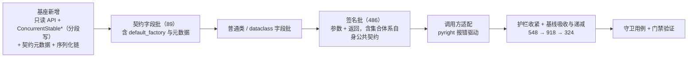

# 01 详细设计 · `bms_core` 存量整改（批次 1）

> 认证与安全 · 08 裸无序集合治理 · 子任务 02（需求 08-2，补充需求）· 详细设计

[文档首页](../../../../../../文档首页.md) › [02 `bms_core` 存量整改](../08_裸无序集合治理_02_bms_core存量整改.md) › 详细设计　|　[← 任务](../08_裸无序集合治理_02_bms_core存量整改.md)　[父任务 →](../../08_裸无序集合治理.md)

## 1. 设计目标与范围 <a id="goal"></a>

把「**对外数据契约、值对象与模块类的集合字段与函数签名一律使用继承并发有序基类（`BaseConcurrentSorted`）的集合类**」落到 `backend/libs/bms_core/src` 的**存量代码**与**基座缺失能力**上，并明确**业务面只落插入序形态**：`backend/libs/bms_core/src` 命中 **594 处**（裸无序集合 285 + 只读 / 可变抽象落点 309，2026-09-29 实测）**一律改落 `ConcurrentStableList` / `ConcurrentStableSet` / `ConcurrentStableDict`**；升序形态（`ConcurrentSorted*`）退为**基座内部实现**（业务与契约不得声明 / 继承，与 `Sorted*` 同口径）。为此新增基座能力：并发集合只读 API、**插入序形态（含分段写 + 插入序号归并的高并发写）**、Pydantic 契约元数据；并收紧护栏（集合类白名单）与递减基线（全局 548 → 918 → 逐批归零）。

- **为什么业务只落插入序（2026-09-29 拍板）**：升序集合的写路径必须**比较 + 维护有序结构**，并发天生上不去；插入序形态只需「追加 + 记录插入序号」，可做**分段写 + 序号归并**，是唯一能做到高并发写的形态。排序需求一律走既有**排序契约**（请求侧统一排序参数 + 仓储可排序字段白名单），**不用集合结构排序**。
- **口径修正（相对前版设计，整体推翻）**：前版以「只读抽象（`Sequence` / `Mapping` / `AbstractSet` / `Mutable*`）+ 运行期零变更」为落点——只读抽象在运行期仍是裸 `list` / `dict` / `frozenset`，**无序问题并未解决**，且该口径把 309 处既有抽象落点漏在护栏之外。新口径**只看声明与运行期是否为继承 `BaseConcurrentSorted` 的集合类**，验收基准为「**形态一致 + 逐处登记**」。
- **本任务范围**：① 基座能力新增（并发集合**只读 API**、**插入序形态** `ConcurrentStable*`（含分段写）、**Pydantic 契约元数据** `CONTRACT_COLLECTION`、序列化链识别集合类）；② 594 处声明整改（**参数位、类字段、返回值全落**）；③ 调用方适配（含 `bms_core` 内部调用链，`services` 侧报错登记为 `08_03` 前置）；④ 基线吸收口径收紧后的现状并递减；⑤ **护栏收紧**（白名单只留插入序形态 + 实现文件豁免）；⑥ 规范 / 清单 / 需求 / 任务 / 计划回写；⑦ 守卫回归用例（Kiwi 先登记，3 条）。
- **不在本任务**：`services`（批次 2，`08_03`）、`backend/ops` 与 `scripts/tools`（批次 3，`08_04`）；前端 TS 侧集合契约；跨副本异步链（`BaseAsyncSorted` / `RedisSorted*`）形态。
- **安全影响（SDL）**：本任务不直接处理敏感数据；价值在于把「顺序不可控 → 分页 / 游标 / 导出结果不稳定、脱敏接入面不清」的存量实现收敛为**确定性顺序契约**，与 [04_02 脱敏接入](../../../04_数据脱敏与安全加固/04_数据脱敏与安全加固_02_脱敏接入与明文权限口径/04_数据脱敏与安全加固_02_脱敏接入与明文权限口径.md) 的接入面口径对齐。

### 1.1 存量实测与分布 <a id="baseline"></a>

**测量方式**：`python3 scripts/tools/base-check/check-bare-collections.py . --report --json`（测量即护栏同一实现，**实现文件豁免 §3.7 生效**，2026-09-29）。

| 维度 | `bms_core`（`backend/libs`） | 全局 |
| --- | --- | --- |
| 裸无序集合（已入基线） | **285** | 528 |
| **只读 / 可变抽象落点（新口径下新增违规）** | **309**（参数 216 / 返回 74 / 类字段 19） | 390 |
| **本批合计** | **594** | **918** |

> **数字修正（2026-09-29 实施，用户拍板）**：本设计初稿写「全局 **940**（裸 548 + 抽象 392）/ `bms_core` **616**（裸 305 + 抽象 311）」，系**未扣除两类豁免**——集合体系**实现文件豁免**（§3.7：`core/collections.py` / `core/concurrent.py` / `core/redis_collections.py`）与 **`ClassVar` 类级常量豁免**（`BaseRepository.sortable_fields` / `BaseSchema.masked_fields`）——的测绘值；按豁免口径实测为 **918（裸 528 + 抽象 390）/ `bms_core` 594（裸 285 + 抽象 309）**。批次 1 递减目标 **324** 不变——`918 − 594 = 324`，且 `324 = services 104 + ops 75 + scripts/tools 145`，与初稿完全一致（豁免项不可整改，理应不计入台账）。

裸容器部分按位置 × 容器（`bms_core`）：

| 位置 \ 容器 | `list` | `dict` | `frozenset` | `set` | 小计 |
| --- | --- | --- | --- | --- | --- |
| 类字段 | 65 | 43 | 1 | 0 | 109 |
| 签名参数 | 12 | 13 | 6 | 1 | 32 |
| 签名返回 | 76 | 54 | 14 | 0 | 144 |
| **小计** | **153** | **110** | **21** | **1** | **285** |

**本批整改面（裸容器 + 抽象，`bms_core`）**：

| 位置 | 裸容器 | 抽象落点 | 合计 | 整改落点 |
| --- | --- | --- | --- | --- |
| 类字段 | 109 | 19 | **128** | `ConcurrentStable*`（Pydantic 字段包 `CONTRACT_COLLECTION`） |
| 签名参数 | 32 | 216 | **248** | `ConcurrentStable*` |
| 签名返回 | 144 | 74 | **218** | `ConcurrentStable*` |
| **合计** | **285** | **309** | **594** | — |

抽象落点按名字：`Mapping` 191 / `Sequence` 114 / `Collection` 4（`AbstractSet` / `Mutable*` 在 `bms_core` 实测 0 处，规则仍写入护栏）。

按顶层包分布（裸容器命中数）：`services` 49、`schemas` 40、`core` 27、`dict` 26、`repositories` 19、`db` 16、`api` 9、`boundary` 9、`print` 9、`idp` 8、`listing` 8、`outbox` 8、`codecheck` 7、`events` 7、`globalsearch` 7、`icon` 6、`security` 6、`chat` 4、`oauth` 4，其余单包 ≤ 2。

高频文件 TOP 10（裸容器）：`services/gateway_catalog.py` 21、`core/config.py` 20、`services/table_registry.py` 16、`dict/sql.py` 10、`services/module_registry.py` 10、`repositories/base_db_repository.py` 8、`codecheck/base.py` 7、`dict/query.py` 7、`globalsearch/base.py` 7、`print/base.py` 7。

> **基线口径收紧登记**：白名单收紧后，既有 390 处抽象落点对护栏而言是「新增」——按既有机制**先 `--update-baseline` 如实纳入**（**548 → 918**；净额已扣除实现文件豁免 20 处与 `ClassVar` 常量 2 处，台账不手工增删），再按批次递减（`08_02` → 324、`08_03` → 220、`08_04` → 0）。

> **前置实测（基座现状，2026-09-29）**：① 并发集合**不可替代内置容器**——`ConcurrentSortedList` 无 `[i]` / 切片 / `+` / `== [..]`；`ConcurrentSortedDict` 无 `[k]` / `keys()` / `items()` / `values()` / `**` 解包（`== {...}` 恒 `False`）；`ConcurrentSortedSet` 无集合运算 / `== {..}`；② 元素不可比较（`dict` / Pydantic 模型 / ORM 模型）时升序形态插入即 `TypeError`；③ `ConcurrentSortedList` 的 `key=` 参数**当前不可用**（`sortedcontainers` 要求继承 `SortedKeyList`，实测 `TypeError: inherit SortedKeyList for key argument`，且无用例覆盖；**本批已删除**）——自定义排序不能靠 `key=`，进一步支持「业务只落插入序、排序走排序契约」；④ `ConcurrentSortedList` 的 `SHARDED` 策略被**降级为 `RW`**（写并发不成）；⑤ Pydantic 直接声明集合类报 `PydanticInvalidForJsonSchema`；⑥ `Annotated[...]` + 元数据可生成与 `list[X]` **逐字节一致**的 array schema；⑦ `ConcurrentSorted*` 在 `bms_core` / `services` / `ops` 业务面**零使用**（仅 `core/concurrent.py` 内部 10 处 `Sorted*`），故「升序退为内部」不新增存量。

### 1.2 现状与缺口 <a id="gap"></a>

| # | 缺口 | 影响 |
| --- | --- | --- |
| 1 | 存量裸无序集合与只读 / 可变抽象仍在**对外数据契约**（`schemas/`、`repositories/`、`api/`）与**值对象 / 模块类字段与签名**上承担数据承载 | 顺序不确定与脱敏接入面持续存在；规范口径落不到既有代码 |
| 2 | 并发集合**只有升序形态**，且**没有只读 API** | 升序形态元素不可比较即报错、写并发天生上不去；直接落集合类会让业务读用法大面积报错 |
| 3 | 并发集合**没有分段写的高并发形态**（`SHARDED` 仅 set / dict 支持，list 被降级 `RW`） | 「插入序 + 高并发」无处落地 |
| 4 | `Pydantic` 对集合类**无内建支持**（实测 `PydanticInvalidForJsonSchema`） | 契约字段直接声明集合类拿不到 OpenAPI schema |
| 5 | `model_dump()` 输出集合类实例后，`stringify_ids` / `BaseObject._convert` / `stable_json_dumps` **不认识集合类** | 序列化链会输出 `ConcurrentStableList([...])` 字符串，JSON 载荷损坏 |
| 6 | 护栏只拦裸容器、**不拦只读 / 可变抽象，也不拦升序形态** | 新口径无从强制，仍可靠 `Sequence` / `Mapping` 或 `ConcurrentSorted*` 绕开 |

## 2. 交付物清单 <a id="deliver"></a>

| # | 交付物 | 落点 |
| --- | --- | --- |
| 1 | 并发集合**只读 API**（`Sequence` / `Mapping` / `Set` 只读面 + 与内置容器内容相等） | `backend/libs/bms_core/src/bms_core/core/concurrent.py`（修改） |
| 2 | **插入序形态** `ConcurrentStableList` / `ConcurrentStableSet` / `ConcurrentStableDict`（`BaseConcurrentSorted` 子类，`collection_kind="stable"`，**分段写 + 插入序号归并**） | 同上（新增） |
| 3 | **Pydantic 契约元数据** `CONTRACT_COLLECTION` + 插入序空集合工厂常量（`CONTRACT_STABLE_LIST` / `CONTRACT_STABLE_DICT` / `CONTRACT_STABLE_SET`） | `backend/libs/bms_core/src/bms_core/schemas/base.py`（新增） |
| 4 | 序列化链识别集合类（同型重组 / JSON 前置规整） | `core/serialization.py`（`stringify_ids`、`stable_json_dumps`）、`core/base.py`（`_convert`）（修改） |
| 5 | 存量声明整改（594 处，`bms_core` 归零，含集合体系自身公共契约） | `backend/libs/bms_core/src/**`（改注解与 import） |
| 6 | 调用方最小适配（含 `bms_core` 内部调用链） | 同上 |
| 7 | 基线吸收与递减（548 → 918 → 324） | `deploy/boundaries/bare_collections_baseline.json` |
| 8 | **护栏收紧**（白名单只留插入序形态 + 实现文件豁免 + 自测矩阵） | `scripts/tools/base-check/check-bare-collections.py`（修改） |
| 9 | `libs` 守卫回归用例（3 条，Kiwi 先登记；编号 **2222 / 2223 / 2224**） | `backend/libs/bms_core/tests/`（新增用例文件） |
| 10 | 规范口径回写（业务只落插入序 + 抽象 / 升序形态均不作落点） | `bms文档/规范/后端开发规范.md`「集合与排序」（修改） |
| 11 | 基类清单回写（新形态 / 只读 API / 契约元数据 / 体系根语义 / 护栏与基线） | `bms文档/后端基类清单.md`「体系根清单」表与「集合体系」节（修改） |
| 12 | 需求 / 任务 / 父任务 / 计划回写（口径 + 工时 + 排期） | `08_需求_裸无序集合治理.md`、`00_需求_认证与安全.md`、本任务文档、父任务、`01_计划_认证与安全.md`（修改） |
| 13 | 实施 / 测试记录（含 594 处逐条处置） | 本目录 `实施/`、`测试/`（新增） |
| 14 | 盘点报告批次表状态与口径更新 | `08_裸无序集合治理_01_护栏与基线盘点/实施/02_存量盘点报告_01_护栏与基线盘点.md`（修改） |

## 3. 整改口径与落点 <a id="rules"></a>

### 3.1 容器 → 落点映射 <a id="mapping"></a>

| 现声明 | 整改落点 |
| --- | --- |
| `list[T]` / `List[T]` / `Sequence[T]` / `MutableSequence[T]` / `Collection[T]` | `ConcurrentStableList[T]` |
| `set[T]` / `Set[T]` / `frozenset[T]` / `FrozenSet[T]` / `AbstractSet[T]` / `MutableSet[T]` | `ConcurrentStableSet[T]` |
| `dict[K, V]` / `Dict[K, V]` / `DefaultDict[K, V]` / `Mapping[K, V]` / `MutableMapping[K, V]` | `ConcurrentStableDict[K, V]` |
| 裸 `dict` / `list` / `set` / `frozenset`（无下标）与 `Iterable` / `Iterator` / `Generator` / `AsyncIterator` / `Callable` | **本批不涉及**（前四者实测 0 处；后者为迭代与调用协议，非集合落点） |

**落点规则（本批已定，无需逐处判定）**：

1. **业务与契约一律落插入序形态** `ConcurrentStableList` / `ConcurrentStableSet` / `ConcurrentStableDict`——元素无需可比较、保确定性插入序、可分段高并发写。
2. **升序形态退为基座内部实现**：`ConcurrentSorted*` 与 `SortedList` / `SortedDict` / `SortedSet` 同口径，**业务代码与对外数据契约不得直接声明、不得继承**；确需排序的出口走既有**排序契约**（请求侧统一排序参数 + 仓储可排序字段白名单），**不用集合结构排序**。
3. **只读 / 可变抽象（`Sequence` / `Mapping` / `AbstractSet` / `Collection` / `Mutable*`）不再作落点**——本轮连带把 309 处既有抽象落点一并收进。
4. **无合适形态时先新增继承 `BaseConcurrentSorted` 的集合类**并回写《[后端基类清单](../../../../../../后端基类清单.md)》与《[后端开发规范](../../../../../../规范/后端开发规范.md)》，**不得在集合链外自造**。

### 3.2 位置口径 <a id="position"></a>

| 位置 | 口径 | 说明 |
| --- | --- | --- |
| **类字段**（128，含 Pydantic 契约字段 / 配置字段 / dataclass 与普通类字段） | `ConcurrentStable*`；Pydantic 字段包 `Annotated[..., CONTRACT_COLLECTION]`（§3.5），`default_factory` 换成空集合工厂常量 | 普通类 / `dataclass` 字段不补规整——Python 对普通类注解不做运行期强制，值由构造方给定（构造方一并整改） |
| **签名参数**（248） | `ConcurrentStable*` | **参数位也落集合类**（2026-09-29 拍板）：让同一并发集合贯通调用链，不在入参处拷贝或重建；被就地改写的参数改走集合类显式方法（§3.3） |
| **签名返回**（218） | `ConcurrentStable*` | 实现按落点构造（`ConcurrentStableList(...)` 等），顺序为**插入序**（构造顺序即输出顺序，确定性由形态保证） |

**集合体系自身公共契约（`core/collections.py` + `core/concurrent.py`）一并整改**：`to_list() -> ConcurrentStableList[ItemT]`（快照，保内部顺序）、`to_dict() -> ConcurrentStableDict[K, V]`、`sorted_by() -> ConcurrentStableList[ItemT]`（自定义排序结果，禁二次重排）、`chunk() -> Iterator[ConcurrentStableList[ItemT]]`、`_view() -> ConcurrentStableList[...]`；`_json_data()` 仍输出**内置容器**（JSON 载荷）。**基座内部实现文件（`core/collections.py` / `core/concurrent.py` / `core/redis_collections.py`）允许在签名中使用 `Sorted*` / `ConcurrentSorted*`**（内部实现，护栏按文件豁免）。**不改 `collection_kind` 既有取值、不改继承链**（收链已由 `08_05` 完成）；`to_list()` 方法名保持不变（改名波及全仓调用方，不属存量整改范围）。

### 3.3 基座新增一：并发集合只读 API <a id="readonly-api"></a>

让集合类能承担现有读用法，把调用方适配面压到最小；**写入仍走显式原子方法**，不提供 `append` / `__setitem__` / `__delitem__`（与并发原子语义冲突，2026-09-29 拍板）。

| 类 | 只读面（映射 ABC 只读接口） | 说明 |
| --- | --- | --- |
| `ConcurrentStableList`（连带升序 `ConcurrentSortedList`） | `Sequence[T]`：`__getitem__`（索引 + 切片）、`index` / `count` / `__reversed__` / `__contains__` / `__len__` / `__iter__`、`__eq__` | 索引 / 切片在**读锁内取快照**后返回；切片返回同类实例 |
| `ConcurrentStableDict`（连带 `ConcurrentSortedDict`） | `Mapping[K, V]`：`__getitem__`、`keys` / `items` / `values` / `get` / `__contains__` / `__len__` / `__iter__`、`__eq__` | **`__iter__` 改为 yield 键**（Mapping 协议，`dict(x)` 仍可用）；键值对遍历走 `to_list()` / `items()` |
| `ConcurrentStableSet`（连带 `ConcurrentSortedSet`） | `Set[T]`：`__contains__` / `__len__` / `__iter__`、集合运算 `&` `\|` `-` `^`（返回同类）、比较、`__eq__` | 运算结果落同类并保插入序 |

- **相等语义（`__eq__`）**：与**同形内置容器 / 同类集合按内容相等**（序列类 ↔ `list` / `tuple`、映射类 ↔ `dict`、集合类 ↔ `set` / `frozenset`），保证既有断言与业务判定不因换型失效；**显式重声明 `__hash__`**（保持 `BaseObject` 行为，避免 `__eq__` 覆盖连带置空）。
- **锁内不做 IO、不在锁内调用外部回调**：读方法在同一读锁内取快照后返回，沿用既有并发约定。
- **原子方法集合不变**：`add` / `update` / `discard` / `remove` / `clear` / `set` / `delete` / `put_if_absent` / `update_atomic` / `remove_atomic` / `replace_if_equal` / `get_and_remove` / `get_locked` / `add_if_absent` 语义与签名不变。
- **`ConcurrentSortedList` 的 `key=` 参数删除（2026-09-29 拍板）**：该参数当前**不可用**（`sortedcontainers` 要求继承 `SortedKeyList`，实测 `TypeError: inherit SortedKeyList for key argument`）且**零使用零测试**；升序形态已退为基座内部实现，删除以免误用（保留只会误导后续调用方）。

### 3.4 基座新增二：插入序形态与分段高并发写 <a id="stable"></a>

**形态与语义**：

| 类 | 继承链 | 语义 | 内部数据（§分段） |
| --- | --- | --- | --- |
| `ConcurrentStableList[ItemT]` | `BaseConcurrentSorted → BaseSyncSorted → BaseSorted → BaseObject` | **插入序稳定输出**（不去重、不比较元素） | 段内 `list[tuple[int, ItemT]]`（按序号有序） |
| `ConcurrentStableSet[ItemT]` | 同上 | 插入序稳定输出 + **去重**（不比较元素） | 段内 `dict[ItemT, int]`（元素 → 序号，保插入序） |
| `ConcurrentStableDict[KeyT, ValueT]` | 同上 | 插入序稳定输出（不比较键） | 段内 `dict[KeyT, tuple[int, ValueT]]`（键 → (序号, 值)） |

`collection_kind = "stable"`。**体系根语义扩展（架构节点口径变更）**：`BaseSorted` 的「有序」定义为**升序（`Sorted*` / `ConcurrentSorted*`，基座内部实现）或插入序（`ConcurrentStable*`，业务唯一落点）两种形态**，以 `collection_kind` 区分；两形态同属集合体系、**禁止链外挂接**。回写《[后端基类清单](../../../../../../后端基类清单.md)》「集合体系」节与《[后端开发规范](../../../../../../规范/后端开发规范.md)》「集合与排序」。

**分段写 + 插入序号归并（高并发写，2026-09-29 拍板）**：

- **分段**：实例按 `shard_count`（默认沿用 16）建段，每段**各自一把写锁**；`list` 按**序号**分派段（轮转）、`set` / `dict` 按**元素 / 键的哈希**分派段（保证同一元素 / 键固定落在同段，去重与定位 O(1)）。
- **插入序号**：每次写从实例的**全局单调计数器**取号，写态存 `(序号, 载荷)` / `(元素 → 序号)`；序号分配用**独立轻量锁**（仅整数自增，临界区极短，不碰数据），数据读写只在段锁内——两者分离，写并发 ≈ 段数。
- **归并读**：读 / 遍历 / 快照按段取锁快照后，**按序号归并**（段内已按序号有序，归并用 `heapq.merge`，**按整数序号比较**而非元素比较），还原**全局插入序**；归并在锁外做，不阻塞写。
- **删改**：按元素 / 键定位段（`list` 按元素线性查找，`set` / `dict` 按哈希），只锁该段。
- **锁策略**：`SHARDED`（分段，**默认**——写并发 ≈ 段数）；另保留 `RW`（多读单写）/ `RLCK`（单锁）/ `SNAPSHOT`（写时复制）供既有调用口径显式选用（**默认分段写**为 2026-09-29 拍板，与「插入序＝可分段高并发写」的定位一致）。
- **一致性口径**：单次写为单段原子；跨段复合操作（如需）继续用 `get_locked` 语义，**不作跨段事务承诺**（与既有并发集合一致）。
- **开放项**：序号分配锁是唯一全局点（临界区仅整数自增）；如需彻底无锁序号，另立子项评估（本批不做）。

### 3.5 基座新增三：Pydantic 契约元数据 `CONTRACT_COLLECTION` <a id="pydantic"></a>

**问题**：`Pydantic` 无法为集合类生成 OpenAPI schema（实测 `PydanticInvalidForJsonSchema`），而契约字段必须落集合类。

**写法（强制）**：

```python
# schemas/base.py（新增，模块级共享构件）
class _ContractCollection(BaseFrameworkObject):
    """契约集合元数据：把基座集合类接入 Pydantic 校验、序列化与 JSON Schema。"""

    def __get_pydantic_core_schema__(self, source_type: object, handler: object) -> object: ...

    def __get_pydantic_json_schema__(self, schema: object, handler: object) -> object: ...

CONTRACT_COLLECTION = _ContractCollection()
"""Pydantic 契约集合元数据：`Annotated[集合类[X], CONTRACT_COLLECTION]` 声明契约字段。"""

CONTRACT_STABLE_LIST: Callable[[], ConcurrentStableList[Any]] = ConcurrentStableList
CONTRACT_STABLE_DICT: Callable[[], ConcurrentStableDict[Any, Any]] = ConcurrentStableDict
CONTRACT_STABLE_SET: Callable[[], ConcurrentStableSet[Any]] = ConcurrentStableSet
```

> 元数据类落 `BaseFrameworkObject`（非数据对象；《后端开发规范》要求一切自定义类必继承基类）。

```python
# 契约字段侧用法（内联，不得抽成 PEP 695 泛型别名）
items: Annotated[ConcurrentStableList[PrintExportResponse], CONTRACT_COLLECTION] = Field(
    default_factory=CONTRACT_STABLE_LIST, description="产物明细（逐份多份 / 合并单份）"
)
```

口径：

1. **元数据行为**：按 `typing.get_origin(source_type)` 分派到同类内置容器 schema（映射 → `dict_schema`，其余 → `list_schema`；**集合类以 `list` 校验以保插入序，去重交集合类**）→ 校验后转集合类实例 → 自定义序列化器（`info.mode` 区分）逐元素递归（`handler`）后按模式重组（Python 同类 / JSON 内置容器）。
2. **JSON Schema 逐字节一致**：`ConcurrentStableList[X]` → 与 `list[X]` 一致的 `array`；集合类 → 与 `frozenset[X]` 一致的 `array` + `uniqueItems`（由 `__get_pydantic_json_schema__` 补齐）；映射类 → 与 `dict[K, V]` 一致的 `object`。契约快照与前端 `api-types` **零漂移**为门禁。
3. **`model_dump()` 输出集合类实例**（2026-09-29 拍板）：Python 模式重组为同类集合实例（元素递归 dump）；**`model_dump_json()` 仍输出 `array` / `object`**（JSON 模式输出内置容器）。因此 **`stringify_ids` / `BaseObject._convert` 须识别集合类并同型重组**，`stable_json_dumps` 须**前置递归规整**（集合类 → 内置容器）；`str` / `bytes` 不参与识别。
4. **`default_factory`** 一律用上表工厂常量——既保证默认值与声明一致（不用 `validate_default`，避免全仓默认值校验口径变化），又规避 PEP 695 泛型类运行期**不可下标**与 pyright 报错。
5. **不得**使用 `type ReadOnlySeq[T] = Annotated[...]` 形式的命名泛型别名：Pydantic 会渲染为 `$defs` 命名引用，OpenAPI 契约与前端 `api-types` 随之漂移。
6. **`pydantic-settings`（`core/config.py`）**：env / TOML 解析出的 `list` / `dict` 经同一元数据校验转集合类；默认值同样走工厂常量。
7. **分层**：`core/` **不引入 Pydantic 依赖**（元数据落 `schemas/`）；落点 `schemas/base.py` 经依赖核查无循环导入。
8. **`Optional` / 联合形态同样适用**：`Annotated[ConcurrentStableList[T] | None, CONTRACT_COLLECTION]`。

### 3.6 调用方适配口径 <a id="caller"></a>

只读 API 补齐后，绝大多数读用法（索引 / 切片 / 遍历 / `len` / 成员判断 / `keys` / `items` / 集合运算 / 与内置容器相等）**无需改动**；参数位落集合类后，凡向函数传内置容器处需**构造集合类实例**。处置（**不改控制流与业务语义**）：

| 情形 | 处置 |
| --- | --- |
| 调用方传入内置容器（`list` / `dict` / `set`） | 构造集合类实例：`ConcurrentStableList(值)` / `ConcurrentStableDict(值)` / `ConcurrentStableSet(值)`（构造即插入序） |
| 需要独立可变的内置容器副本 | 显式拷贝：`list(x)` / `dict(x)` / `set(x)`，赋给新的局部变量 |
| 就地改写入参（`append` / `pop` / `[k] = v`） | 改走集合类显式方法（`add` / `update` / `discard` / `remove` / `set` / `delete`）；或在入口拷贝为内置容器处理后再回写 |
| 直接 `json.dumps(...)` 序列化含集合类的值 | 改 `stable_json_dumps` / `model_dump_json()`（已适配集合类） |
| 依赖 `list` / `dict` 专属方法（`sort` / `copy` / `popitem` / `setdefault` 等） | 按需拷贝为内置容器后再用 |
| 仅遍历 / 索引 / `len` / 成员判断 / 只需排序视图 | **不改**（排序视图走 `sorted_by()` 或排序契约） |

每处适配在实施记录逐条登记「文件 / 行 / 原声明 / 落点 / 适配方式」，供批次 2 / 3 复用同一口径。

### 3.7 护栏收紧 <a id="guard"></a>

- **新规则**：类字段注解与函数签名注解（参数 / 返回）中的**集合声明必须命中集合类白名单**——白名单**只含插入序形态**（`ConcurrentStableList` / `ConcurrentStableSet` / `ConcurrentStableDict` 及后续登记形态）；以下一律判违规：`dict` / `list` / `set` / `frozenset` 与 typing 别名（`Dict` / `List` / `Set` / `FrozenSet` / `DefaultDict`）、只读 / 可变抽象（`Sequence` / `Mapping` / `AbstractSet` / `Collection` / `MutableSequence` / `MutableMapping` / `MutableSet`）、**升序形态**（`ConcurrentSorted*` / `Sorted*`）。
- **实现文件豁免**：集合体系实现文件（`backend/libs/bms_core/src/bms_core/core/collections.py`、`core/concurrent.py`、`core/redis_collections.py`）允许 `Sorted*` / `ConcurrentSorted*`（内部实现），按**文件路径白名单**豁免。
- **不查**：迭代与调用协议（`Iterable` / `Iterator` / `Generator` / `AsyncIterator` / `Callable`）、函数体内局部变量注解、测试目录。
- 脚本既有能力（`--report` / `--json` / `--update-baseline` / `--self-test`）与扫描范围不变；`--self-test` 矩阵补「白名单命中不报 / 抽象落点报 / 升序形态报 / 实现文件豁免 / 迭代协议不报」用例。
- 基线：先 `--update-baseline` 如实吸收口径收紧后的现状（548 → 918），批次完成后递减（`bms_core` → 324），复跑断言「新增 0 / 残留 0」；**不得手工增删条目**。

### 3.8 执行序与提交 <a id="order"></a>



- **先基座、后存量**：基座新增（§3.3~§3.5）先行落地并过用例，存量整改才有可用落点；**存量批内先类字段、后签名**（承接「契约影响面优先」）。
- 每批结束跑一次 `pyright`（秒级到十几秒）与 `check-bare-collections.py --report`（观察命中数递减），**不逐批跑全量用例**。
- 提交粒度（已确认）：**代码一次 `feat`**（基座新增、存量声明、调用方适配、护栏、基线快照、守卫用例）+ **文档一次 `docs`**（详细设计先行单独提交；规范 / 清单 / 需求 / 任务 / 计划与实施 / 测试记录随文档提交）。

### 3.9 失败分支与错误语义 <a id="failures"></a>

| 场景 | 行为 / 处置 |
| --- | --- |
| 分段写后读顺序与插入序不一致 | 属实现缺陷：检查序号分配单调性与归并键（必须按**整数序号**比较，不得按元素比较）；用例覆盖「并发写后读回插入序」 |
| 序号分配锁成为瓶颈 | 该锁只做整数自增（不碰数据）；确需更高写并发时先量测再评估无锁序号（登记开放项） |
| 声明收窄后 `pyright` 报错 | 按 §3.6 适配；确需可变语义者改走显式方法或拷贝 |
| `model_dump()` 消费方拿到集合类实例出错 | 属预期形态（§3.5 口径 3）；消费方按只读 API 使用或改 `model_dump_json()` |
| 契约快照 / 前端类型漂移 | `preflight --fast` 的 `contract_snapshot check` 与前端 `api-types --check` 直接拦截；先查元数据的 schema 是否与内置容器逐字节一致 |
| 护栏白名单与清单漂移 | 清单新增形态后须同步脚本白名单；`--self-test` + 清单核对把关 |
| 基线复跑出现「残留」 | 属正常递减提示（不失败）；跑 `--update-baseline` 完成递减后复校 |
| `services` 侧因参数位收窄报错 | 属 `08_03` 范围：本批按「不越界」处置，仅在 `bms_core` 内部适配，报错登记为 `08_03` 前置输入（量大到阻塞门禁时停下请用户拍板） |

## 4. 兼容性与影响 <a id="compat"></a>

- **运行期形态变化（预期）**：集合字段 / 参数 / 返回值的运行期类型由内置容器或抽象变为**插入序集合类**；顺序为**插入序**（确定性），**加锁属预期行为**。原「运行期零变更」提法作废；受影响用例按新形态重判并登记。
- **契约面零漂移**：Pydantic 字段的 JSON Schema 与 `list[X]` / `dict[K, V]` / `frozenset[X]` 逐字节一致（§3.5）；`model_dump_json()` 输出不变（`array` / `object`）；`model_dump()` 输出集合类实例（口径已定）。`contract_snapshot check` 与前端 `api-types --check` 作为门禁校验。
- **性能**：`SHARDED` 分段写下写并发 ≈ 段数（序号分配锁临界区为整数自增）；归并在锁外按整数序号合并，复杂度 `O(合并元素数)`；`RW` / `SNAPSHOT` 沿用既有开销。相比升序形态省掉比较与有序插入，写入更快。
- **分层**：契约元数据落 `schemas/`（Pydantic 依赖只在该层）；`core/` 不引入 Pydantic；序列化链识别集合类**只依赖 `collections.abc` ABC**（不反向 import `core.collections`，规避循环导入）。
- **下游**：`08_03`（`services`）直接复用 `CONTRACT_COLLECTION`、`ConcurrentStable*` 与本节口径（并把 `bms_core` 参数位收窄导致的调用适配纳入）；`08_04`（`ops` / `scripts/tools`）复用落点映射；`04_02`（脱敏接入）不依赖本任务完成，仅与口径对齐。
- **回退**：基座新增与存量整改同批；按 `git revert` 或按文件回退即可；基线快照随代码同提交，回退后重跑 `--update-baseline` 即恢复。

## 5. 测试设计与验收映射 <a id="test"></a>

用例**先登记 Kiwi TCMS 再编码**（本任务 **3 条**，编号 **2222 / 2223 / 2224**，2026-09-29 已登记取号；覆盖范围写入用例 `text`）。

| # | 用例 / 断言 | 落点 | 对应完成标准 |
| --- | --- | --- | --- |
| 1 | **插入序形态与并发**：`ConcurrentStable*` 继承链与插入序稳定输出（不可比较元素可入）；`SHARDED` 分段写后读回仍为插入序（多线程并发写用例）；只读 API（索引 / 切片 / `keys` / `items` / 集合运算 / 与内置容器相等）；写入仅走显式方法 | `tests/core/test_concurrent_stable.py`（`@pytest.mark.kiwi_id(2222)`） | 基座新增可用且高并发写正确 |
| 2 | **契约零漂移与序列化形态**：契约字段 OpenAPI schema 与 `list[X]` / `dict[K, V]` / `frozenset[X]` 逐字节一致；`model_dump()` 输出集合类实例、`model_dump_json()` 输出 `array` / `object`；`stringify_ids` / `stable_json_dumps` 输出内联容器（无 `ConcurrentStableList([...])` 字符串）；前端 `api-types` 零漂移 | `tests/schemas/test_contract_collections.py`（`@pytest.mark.kiwi_id(2223)`） | 契约不漂移、序列化链不损坏 |
| 3 | **存量归零与护栏收紧**：跑护栏脚本 `--report --json` 断言 `by_area.libs == 0`（含抽象落点）；基线递减至 324 且无 `libs` 条目；复跑「新增 0 / 残留 0」；`--self-test` 覆盖白名单新规则与实现文件豁免 | `tests/boundary/test_bare_collections_guard.py`（`@pytest.mark.kiwi_id(2224)`） | 594 处全部整改、基线递减、护栏强制 |
| 4 | 定向回归：`pytest backend/libs/bms_core/tests` 全量全绿；`ruff check` / `ruff format --check` / `pyright`（backend 全量）全绿 | 门禁 | 定向 pytest + ruff + pyright 全绿 |
| 5 | 基座校验与本地预检：`check-base` / `check-backend-base(+--self-test)` / `check-service-boundaries(+--self-test)` / `boundary_metrics` / `check-status --stage 06_认证与安全` / `preflight --fast` 全绿；`check-links.py` 无断链 | 门禁 | 基座校验与 preflight 全绿 |
| 6 | 清单与规范一致性：《[后端基类清单](../../../../../../后端基类清单.md)》「集合体系」节（形态表 / 继承链 / 护栏与基线）与《[后端开发规范](../../../../../../规范/后端开发规范.md)》「集合与排序」与代码、基线快照一致；业务面无 `Sorted*` / `ConcurrentSorted*` 新增声明 / 继承 | 文档核对 | 清单 / 规范 / 代码一致 |

**验收映射**：任务 §3「完成标准」逐条落用例 1~6。本任务含基座能力新增，**新增能力须有用例覆盖**（用例 1 / 2）；存量整改不另设覆盖率门槛，覆盖率随既有 `bms_core` 门禁（≥70%）执行。

## 6. 登记落点 <a id="registry"></a>

| 内容 | 落点 |
| --- | --- |
| 「集合落点＝继承 `BaseConcurrentSorted` 的插入序集合类；只读 / 可变抽象与升序形态均不作业务落点」 | 《[后端开发规范](../../../../../../规范/后端开发规范.md)》「集合与排序」条目 |
| 体系根语义扩展（有序＝升序**或**插入序，`collection_kind` 区分；升序为基座内部实现） | 《[后端基类清单](../../../../../../后端基类清单.md)》「集合体系」节（体系根语义 + 形态表 + 继承链 + 「体系根清单」表） |
| 新形态 `ConcurrentStable*`（含分段写 + 插入序号归并）、只读 API、`CONTRACT_COLLECTION` 与工厂常量 | 《[后端基类清单](../../../../../../后端基类清单.md)》「集合体系」节与「体系根清单」表 |
| 护栏新规则（白名单只留插入序形态 + 实现文件豁免 + 不查迭代协议） | 《[后端开发规范](../../../../../../规范/后端开发规范.md)》「集合与排序」；《[后端基类清单](../../../../../../后端基类清单.md)》「集合体系」节「护栏与基线」小段 |
| 批次进度与余量（`bms_core` 594 → 0；基线 918 → 324） | 《[后端基类清单](../../../../../../后端基类清单.md)》「集合体系」节「裸无序集合护栏与基线」小段 |
| 口径扩面（含抽象落点 / 业务只落插入序 / 参数位也落）、工时（156h）与排期顺延 | [需求 08-2](../../../../需求/08_需求_裸无序集合治理.md#r08-2)、[需求总览](../../../../需求/00_需求_认证与安全.md)、本任务文档、[父任务](../../08_裸无序集合治理.md)、[计划](../../../../计划/01_计划_认证与安全.md) |
| 盘点报告批次表状态与口径 | `08_裸无序集合治理_01_护栏与基线盘点/实施/02_存量盘点报告_01_护栏与基线盘点.md` §4 / §5 |
| 实施 / 测试记录（含 594 处逐条处置方式） | 本目录 `实施/`、`测试/` |

## 7. 边界与开放项 <a id="boundary"></a>

- **集合类不是内置容器的超集**：只读 API 覆盖读用法，写用法走显式原子方法；需要 `list` / `dict` / `set` 专属方法的场景按 §3.6 拷贝。若后续出现大面积写用法不适配，另立子项评估补齐可变面（**不在本批**）。
- **序号分配锁**：分段写的全局序号仍由一把轻量锁分配（仅整数自增）；彻底无锁序号另立子项评估。
- **跨段一致性**：分段形态只保证**单次写单段原子**与**读快照插入序**，不承诺跨段事务；跨段复合操作沿用 `get_locked` 口径。
- **`__iter__` 语义变更**：`ConcurrentStableDict` / `ConcurrentSortedDict` 的 `__iter__` 由「键值对」改为「键」（Mapping 协议）；调用方改 `.items()` / `to_list()`。实施时全仓核查并登记。
- **`to_list()` 名称与返回型**：返回 `ConcurrentStableList` 快照（保内部顺序），方法名不改（改名波及全仓，另立子项评估）。
- **升序形态的维护**：`ConcurrentSorted*` 退为内部实现后业务面零使用，其维护成本与去留另立子项评估（本批保留，避免破坏基座内部与既有用例）。
- **`services` 侧引用**：本批只改 `bms_core`；参数位收窄会波及 `services` 调用方（`pyright` include 覆盖），属 `08_03` 范围，登记为前置输入。
- **`scripts/tools` 不在 CI `ruff` / `pyright` 覆盖范围** → 护栏脚本自身仍以 `--self-test` 保障。
- **函数体内局部变量注解**不在护栏检测范围内（口径已定），本批不整改。
- **Kiwi 用例编号**：**2222 / 2223 / 2224**（2026-09-29 已登记取号；随基座原型先行，第 1 条用例 `tests/core/test_concurrent_stable.py` 已落地，测试记录见本目录 `测试/`）。

## 8. 对齐记录 <a id="align"></a>

| # | 事项 | 结论（2026-09-29 拍板 / 二次拍板） |
| --- | --- | --- |
| 1 | 落点范围 | **全覆盖**：`bms_core` **594 处**（裸容器 285 + 既有抽象落点 309，含 Pydantic 契约字段与配置字段） |
| 2 | 业务落点形态 | **一律插入序** `ConcurrentStableList` / `ConcurrentStableSet` / `ConcurrentStableDict`；升序形态退为**基座内部实现**（业务与契约不得声明 / 继承），排序需求走排序契约 |
| 3 | 插入序的并发能力 | **分段写 + 插入序号归并**（`SHARDED`，写并发 ≈ 段数；序号分配用独立轻量锁） |
| 4 | 参数位口径 | **参数位也落集合类**（贯通并发集合、避免入参处拷贝） |
| 5 | 新形态命名 | `ConcurrentStableList` / `ConcurrentStableSet` / `ConcurrentStableDict`（`collection_kind="stable"`） |
| 6 | Pydantic 契约支持 | `schemas/base.py` 的 `CONTRACT_COLLECTION` + 空集合工厂常量；**core 不引入 Pydantic** |
| 7 | 契约字段写法 | `Annotated[集合类[X], CONTRACT_COLLECTION]` **内联**（排除 PEP 695 命名别名） |
| 8 | 基座读 API | 补齐 `Sequence` / `Mapping` / `Set` 只读面（含与内置容器内容相等）；**写入仍走显式原子方法** |
| 9 | 立项落点 | 基座能力新增**并入 08_02**（不另立子任务） |
| 10 | 契约序列化 | `model_dump()` **输出集合类实例**；`model_dump_json()` 输出内置容器；序列化链一并适配 |
| 11 | 护栏 | 白名单**只留插入序形态**；抽象（含 `Collection`）与升序形态一并判违规；**集合体系实现文件豁免**；迭代协议不查 |
| 12 | 基线口径 | 收紧后先 `--update-baseline` 如实吸收（548 → 918），批次递减（→ 324 → 220 → 0） |
| 13 | 验收口径 | 「**形态一致 + 逐处登记**」；原「运行期零变更」作废（加锁 / 顺序为预期） |
| 14 | 体系根语义 | 扩展为「有序＝升序**或**插入序两形态」；业务面限定插入序 |
| 15 | 工时与排期 | 本任务 34h → **156h**；`08_03` 10h → **26h**、`08_04` 16h → **50h**（域 08 合计 92h → **264h**）；M6 顺延至 **2026-12-04** |
| 16 | 用例粒度 | **3 条**（插入序形态与并发 / 契约零漂移与序列化 / 存量归零与护栏） |
| 17 | 存量口径修正 | 整改面 594 处（类字段 128 / 参数 248 / 返回 218），任务与需求文档随实施回写 |
| 18 | 插入序默认锁策略 | `ConcurrentStable*` **默认 `SHARDED`**（分段写），`RW` / `RLCK` / `SNAPSHOT` 显式选用——落点无需传参即得高并发写（2026-09-29 拍板） |
| 19 | `ConcurrentSortedList.key=` 坏参数 | **本批删除**（`sortedcontainers` 不支持 `key`、零使用零测试，升序形态已退为内部实现）（2026-09-29 拍板） |
| 20 | Kiwi 用例登记 | **2222 / 2223 / 2224**（插入序形态与并发 / 契约零漂移与序列化 / 存量归零与护栏），2026-09-29 已登记取号 |
| 21 | 基座原型先行 | 先只落 `core/concurrent.py`（只读 API + `ConcurrentStable*` 分段写）并以多线程用例验证顺序与并发性，再铺开契约元数据 / 序列化链 / 护栏收紧 / 存量整改（2026-09-29 拍板） |

> 本设计定稿后按《[AI开发规范](../../../../../../规范/AI开发规范.md)》「单任务交付一条龙」自动续行：实施 → 测试（Kiwi 先登记）→ 验证 → 登记回写 → 记录 → 提交。
