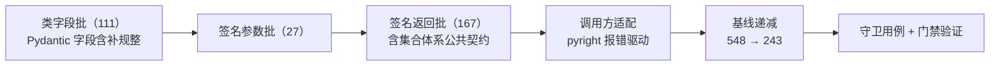

# 01 详细设计 · `bms_core` 存量整改（批次 1）

> 认证与安全 · 08 裸无序集合治理 · 子任务 02（需求 08-2，补充需求）· 详细设计

[文档首页](../../../../../../文档首页.md) › [02 `bms_core` 存量整改](../08_裸无序集合治理_02_bms_core存量整改.md) › 详细设计　|　[← 任务](../08_裸无序集合治理_02_bms_core存量整改.md)　[父任务 →](../../08_裸无序集合治理.md)

## 1. 设计目标与范围 <a id="goal"></a>

把《[后端开发规范](../../../../../../规范/后端开发规范.md)》「集合与排序」的强制禁令——**对外数据契约、值对象与模块类的集合字段与函数签名一律使用继承基座的集合类或只读抽象，禁止裸无序集合**——落到 `backend/libs/bms_core/src` 的**存量代码**：`bms_core` 命中 **305 处**（2026-09-29 实测）逐处改为**只读抽象**（`Sequence` / `Mapping` / `AbstractSet`），并同步递减基线快照（全局 548 → 243）。

- **本任务范围**：`backend/libs/bms_core/src` 全部命中处的声明整改（类字段 111 + 签名参数 27 + 签名返回 167）、调用方可变操作的最小适配、`Pydantic` 只读序列字段的补规整、基线快照递减、《[后端基类清单](../../../../../../后端基类清单.md)》「集合体系」节与《[后端开发规范](../../../../../../规范/后端开发规范.md)》「集合与排序」的口径回写、`libs` 守卫回归用例。
- **不在本任务**：`services`（批次 2，`08_03`）与 `backend/ops`、`scripts/tools`（批次 3，`08_04`）的存量；集合基座形态新增；集合体系继承链调整（`08_05` 已交付）；前端 TS 侧集合契约。
- **零运行期改动**：只收窄**声明**（类型注解），不改变任何运行期构造、赋值与返回的**值**；`Mapping` / `AbstractSet` 经实测与现状完全等价，`Sequence` 的等价性由**补规整**保证（见 §3.3）。
- **安全影响（SDL）**：本任务不直接处理敏感数据；价值在于把「顺序不可控 → 分页 / 游标 / 导出结果不稳定、脱敏接入面不清」的存量实现收敛到只读契约，与 [04_02 脱敏接入](../../../04_数据脱敏与安全加固/04_数据脱敏与安全加固_02_脱敏接入与明文权限口径/04_数据脱敏与安全加固_02_脱敏接入与明文权限口径.md) 的接入面口径对齐。

### 1.1 存量实测与分布 <a id="baseline"></a>

**测量方式**：`python3 scripts/tools/base-check/check-bare-collections.py . --report --json`（测量即护栏同一实现）。

| 维度 | `bms_core`（`backend/libs`） | 全局 |
| --- | --- | --- |
| 命中合计 | **305** | 548 |
| 类字段 | 111（Pydantic `Field` 89 / 普通类有默认值 12 / 普通类纯注解 8 / dataclass `field` 2） | 136 |
| 签名参数 | 27 | 119 |
| 签名返回 | 167 | 293 |
| 涉及文件 | 85 | — |
| 基线聚合条目 | 282 | 511 |

按容器 × 位置的精确分布（`bms_core`）：

| 位置 \ 容器 | `list` | `dict` | `frozenset` | `set` | 小计 |
| --- | --- | --- | --- | --- | --- |
| 类字段 | 65 | 43 | 3 | 0 | 111 |
| 签名参数 | 9 | 11 | 6 | 1 | 27 |
| 签名返回 | 94 | 59 | 14 | 0 | 167 |
| **小计** | **168** | **113** | **23** | **1** | **305** |

按顶层包分布（命中数）：`services` 45、`core` 41、`schemas` 39、`dict` 23、`repositories` 18、`db` 16、`boundary` 9、`print` 9、`idp` 8、`listing` 8、`api` 7、`outbox` 7、`codecheck` 6、`globalsearch` 6、`security` 6、`events` 5、`icon` 5、`chat` 4、`oauth` 4，其余单包 ≤ 2。

高频文件 TOP 10：`services/gateway_catalog.py` 20、`core/config.py` 19、`services/table_registry.py` 15、`services/module_registry.py` 8、`dict/query.py` 7、`dict/sql.py` 7、`print/base.py` 7、`schemas/print.py` 7、`codecheck/base.py` 6、`core/collections.py` 6。

> **口径修正登记**：任务文档 §2 记「类字段 111 / 签名参数 32 / 签名返回 162」，按护栏脚本 2026-09-29 实测（含嵌套容器逐层计数的口径）应为 **111 / 27 / 167**；合计 305 一致。本设计以实测为准，实施时回写任务文档。

### 1.2 现状与缺口 <a id="gap"></a>

| # | 缺口 | 影响 |
| --- | --- | --- |
| 1 | 存量裸无序集合仍在**对外数据契约**（`schemas/` 39 处、`repositories/` 18 处、`api/` 7 处）与**值对象 / 模块类字段**上承担序列化输出 | 顺序不确定与脱敏接入面持续存在；规范口径落不到既有代码 |
| 2 | `dict` / `list` 声明**不表达只读语义**，调用方是否可变全靠人眼 | 契约边界模糊，评审无据 |
| 3 | `Pydantic` 字段声明为 `list[X]` 时**入参会被规整**（`tuple` → `list`），改为 `Sequence[X]` 后规整丢失 | 「改声明不改行为」不是天然成立——须显式补规整（见 §3.3），否则是**行为变更** |
| 4 | `PEP 695` 泛型别名（`type ReadOnlySeq[T] = Annotated[...]`）会被 Pydantic 渲染为 `$defs` 命名引用 | OpenAPI 契约快照与前端 `api-types` 将漂移，且把实现细节写进公开契约——**必须排除**（实测见 §3.3） |

## 2. 交付物清单 <a id="deliver"></a>

| # | 交付物 | 落点 |
| --- | --- | --- |
| 1 | 只读序列规整器（`Pydantic` 字段级共享构件） | `backend/libs/bms_core/src/bms_core/schemas/base.py`（新增常量） |
| 2 | 存量声明整改（305 处，`bms_core` 归零） | `backend/libs/bms_core/src/**`（85 个文件，改注解与 import） |
| 3 | 调用方最小适配（按需拷贝 / 局部变量回标具体类型） | 同上（受 pyright 报错驱动的改动处） |
| 4 | 基线快照递减（548 → 243） | `deploy/boundaries/bare_collections_baseline.json`（`--update-baseline` 重写） |
| 5 | `libs` 守卫回归用例（命中归零 / 基线 243 / 新增 0 残留 0 / 只读抽象行为等价） | `backend/libs/bms_core/tests/`（新增用例文件） |
| 6 | 规范口径回写（`AbstractSet` 基准 + `Pydantic` 只读序列补规整） | `bms文档/规范/后端开发规范.md`「集合与排序」（修改） |
| 7 | 基座清单回写（护栏与基线小节登记批次进度与余量） | `bms文档/后端基类清单.md`「集合体系」节（修改） |
| 8 | 盘点报告批次表状态更新 | `08_裸无序集合治理_01_护栏与基线盘点/实施/02_存量盘点报告_01_护栏与基线盘点.md`（修改） |
| 9 | 实施 / 测试记录 | 本目录 `实施/`、`测试/`（新增） |
| 10 | 任务 / 父任务 / 计划状态回写 | 本任务文档、父任务清单、[计划](../../../../计划/01_计划_认证与安全.md)（修改） |

## 3. 整改口径与落点 <a id="rules"></a>

### 3.1 容器 → 落点映射 <a id="mapping"></a>

| 现声明 | 整改落点 | 依据 |
| --- | --- | --- |
| `dict[K, V]` / `Dict[K, V]` / `DefaultDict[K, V]` | `Mapping[K, V]` | 只读映射（`collections.abc`） |
| `list[T]` / `List[T]` | `Sequence[T]`；**Pydantic 契约字段**用 `Annotated[Sequence[T], SEQUENCE_NORMALIZER]` | 只读序列；补规整见 §3.3 |
| `set[T]` / `Set[T]` / `frozenset[T]` / `FrozenSet[T]` | `AbstractSet[T]` | 只读集合（`collections.abc`；语义贴「不可变集合视图」，实测与 `frozenset[T]` 逐项等价） |
| 裸 `dict` / `list` / `set` / `frozenset`（无下标） | — | **本批 0 处**（实测全部带下标），无需补类型参数 |

- 落点一律优先 **`collections.abc`** 的抽象（`Mapping` / `Sequence` / `AbstractSet`）；`typing` 下的同名别名**不新增**（`typing.Mapping` 等已废弃语义，`ruff` 的 `UP` 规则亦要求收敛到 `collections.abc`）。
- **稳定序要求**（分页 / 游标 / 导出）：本批一律以 `Sequence` 声明满足（运行期仍为 `list` 副本，天然保序）；**本轮不引入运行期 `ConcurrentSorted*` 返回**——并发集合的语义是「多线程共享的原子复合操作」，无共享需求处引入只会带来锁开销与无收益的调用方改造。`ConcurrentSorted*` 的落点留给确有并发共享需求的场景（口径见《[后端开发规范](../../../../../../规范/后端开发规范.md)》「集合与排序」）。
- **禁止落点**：`SortedList` / `SortedDict` / `SortedSet`（基座内部基础实现，业务与契约不得直接声明 / 继承，2026-09-29 定档）。

### 3.2 位置口径 <a id="position"></a>

| 位置 | 口径 | 例外处理 |
| --- | --- | --- |
| **类字段**（111） | 落只读抽象；Pydantic 模型字段额外包 `Annotated[..., SEQUENCE_NORMALIZER]`（仅 `Sequence` 需要） | 普通类 / `dataclass` 字段**不补规整**——Python 对普通类注解不做运行期强制，原声明 `list[T]` 同样不规整输入，故改声明后运行期值**本就未变** |
| **签名参数**（27） | 落只读抽象 | 参数被函数体**就地改写**（`append` / `update` / `[k]=v`）时落 `MutableSequence` / `MutableMapping` / `MutableSet`——抽象语义不变、不为声明引入拷贝 |
| **签名返回**（167） | 落只读抽象 | 实现仍是 `return list(...)` / `dict(...)` / `frozenset(...)` 副本，取值与顺序不变 |

**集合体系自身公共契约（12 处，`core/collections.py` + `core/concurrent.py`）一并收窄**：`to_list() -> Sequence[ItemT]`、`to_dict() -> Mapping[...]`、`sorted_by() -> Sequence[ItemT]`、`chunk() -> Iterator[Sequence[ItemT]]`、内部 `_view() -> Sequence[ItemT]`。运行期仍返回 `list` / `dict` 副本，同步侧行为零变更；调用方若对返回值就地改写，按 §3.5 适配。**不改 `collection_kind`、不改继承链、不改锁语义**（收链已由 `08_05` 完成）。

### 3.3 Pydantic 只读序列的「补规整」 <a id="pydantic"></a>

**问题**：Pydantic v2 对 `list[T]` 字段会**规整**输入（`tuple` → `list`）；声明改为 `Sequence[T]` 后该规整消失（`tuple` 原样保留），`model_dump()` 亦随之输出 `tuple`。这是**唯一**会破坏「行为零变更」的差异。

**实测结论（项目 venv，`pydantic` v2）**：

| 项 | `list[X]` | `Sequence[X]` | 是否等价 |
| --- | --- | --- | --- |
| JSON Schema | `{"type":"array","items":…}` | 同左（**逐字节一致**） | ✅ |
| JSON 输入 → 运行期 | `list` | `list` | ✅ |
| Python 传 `tuple` → 运行期 | `list` | **`tuple`** | ❌ |
| `model_dump()`（tuple 输入） | `list` | `tuple` | ❌ |
| `model_dump_json()` | JSON 数组 | JSON 数组 | ✅ |

| 项 | `Mapping[K,V]` vs `dict[K,V]` | `AbstractSet[X]` vs `frozenset[X]` |
| --- | --- | --- |
| 各类输入（`dict` / `OrderedDict` / 键类型校验与报错） | 输出恒为 `dict`，等价 | 各类输入（`list` / `tuple` / `set`）**输出恒为 `frozenset`**，等价 |

**因此**：只需为 `Sequence` 字段补规整；`Mapping` / `AbstractSet` **不补**（实测零差异，补了只是无效改动）。

**写法（强制）**：

```python
# bms_core/schemas/base.py（新增，模块级共享构件）
def _normalize_sequence(value: object) -> object:
    """把序列输入规整为 list，保持与 `list[T]` 声明一致的运行期表现。"""
    if isinstance(value, (list, tuple)):
        return list(value)
    return value

SEQUENCE_NORMALIZER = BeforeValidator(_normalize_sequence)
"""Pydantic 只读序列字段规整器：`Sequence` 字段须以 `Annotated[Sequence[T], SEQUENCE_NORMALIZER]` 声明。"""
```

```python
# 字段侧用法（内联，不得抽成 PEP 695 泛型别名）
items: Annotated[Sequence[ItemSchema], SEQUENCE_NORMALIZER] = Field(default_factory=list)
```

- **不得**使用 `type ReadOnlySeq[T] = Annotated[Sequence[T], SEQUENCE_NORMALIZER]` 形式：Pydantic 会把它渲染为 `$defs` 命名引用，OpenAPI 契约快照与前端 `api-types` 随之漂移（契约里出现实现细节），已在设计阶段实测确认。
- 落点 `schemas/base.py` 经依赖核查**无循环导入**——`core/config.py` 已引用 `bms_core.schemas.base`（`BaseSchema`），而该模块只依赖 `core.context` / `core.objects` / `core.serialization`，三者均不反向依赖 `core.config`。
- 规整器为**字段级**构件，不改 `BaseSchema` 的 `model_config` 与序列化链；`BaseSchema._serialize_ids` 与 `_apply_masking` 行为不变。
- `Optional` / 联合形态同样适用：`Annotated[Sequence[T] | None, SEQUENCE_NORMALIZER]`（实测 `None` 直通、`tuple` 规整为 `list`）。

### 3.4 基线递减 <a id="baseline"></a>

- 整改完成后执行 `python3 scripts/tools/base-check/check-bare-collections.py . --update-baseline` 重写 `deploy/boundaries/bare_collections_baseline.json`：全局 **548 → 243**，聚合条目 **511 → 约 229**，`bms_core` 条目归零。
- **不得手工删除基线条目**（基线即台账，逐批递减是进度凭据）；写后立即复跑 `python3 scripts/tools/base-check/check-bare-collections.py .` 断言「新增 0 / 残留 0」。
- 其余三区域（`services` 79 / `scripts` 134 / `ops` 30）条目**原样保留**，由 `08_03` / `08_04` 承担。

### 3.5 调用方适配口径 <a id="caller"></a>

声明收窄后，调用方若对返回值 / 字段做**可变操作**，`pyright` 严格模式会报错。处置口径（**不改控制流与业务语义**）：

| 情形 | 处置 |
| --- | --- |
| 需要独立可变副本 | 按需拷贝：`list(x)` / `dict(x)` / `set(x)`，拷贝结果赋给新的局部变量 |
| 局部变量仅用于承接后少量改写 | 局部变量**显式标注具体类型**（`items: list[str] = list(catalog.tags)`） |
| 仅遍历 / 索引 / 成员判断 / `len` | **不改**（`Sequence` / `Mapping` / `AbstractSet` 已覆盖） |
| 需要就地改写入参 | 见 §3.2：参数落 `MutableSequence` / `MutableMapping` / `MutableSet`（**不求**调用方拷贝） |

每处适配在实施记录逐条登记「文件 / 行 / 原声明 / 处置方式」，便于回溯与批次 2 / 3 复用同一口径。

### 3.6 执行序与提交 <a id="order"></a>



- **批内先类字段、后签名**（承接「契约影响面优先」）：类字段决定运行期值形态，先行收敛后再动签名返回，调用方报错更集中、更易归因。
- 每批结束跑一次 `pyright`（秒级到十几秒）与 `check-bare-collections.py --report`（观察命中数递减），**不逐批跑全量用例**。
- 提交粒度（已确认）：**代码一次 `feat`**（含 `schemas/base.py` 规整器、85 个文件的声明、调用方适配、基线快照、守卫用例）+ **文档一次 `docs`**（详细设计先行单独提交、实施 / 测试记录与登记回写随文档提交）。

### 3.7 失败分支与错误语义 <a id="failures"></a>

| 场景 | 行为 / 处置 |
| --- | --- |
| 声明收窄后 `pyright` 报「不可变」错 | 按 §3.5 适配调用方；若适配会改变语义，则该处退回只读抽象**之外**的可行形态并登记遗留（不得默默放过） |
| 声明收窄后 `pyright` 报「不可赋值」错（`list` 变量接 `Sequence`） | 说明该变量确实需要可变语义 → 局部回标具体类型；全局容器按「必须可变」重判 |
| `Sequence` 字段漏补规整 | 守卫用例断言「`Sequence` 字段传 `tuple` → 运行期为 `list`」；`--report` 与 pyright 均不报此错，**只能靠用例兜住**，故用例必须覆盖 |
| 契约快照 / 前端类型漂移 | `preflight --fast` 的 `contract_snapshot check` 与前端 `api-types --check` 直接拦截；本设计已排除 PEP 695 别名写法，预期零漂移；若仍漂移，先查是否误用了命名别名 |
| `ruff` 报未使用 import / import 排序 | `uv run ruff check --fix` 与 `ruff format` 收敛；`UP` 规则会提示 `typing` 别名收敛为 `collections.abc` |
| 基线复跑出现「残留」 | 属正常递减提示（不失败）；跑 `--update-baseline` 完成递减后复校 |

## 4. 兼容性与影响 <a id="compat"></a>

- **运行期零变更**：只改注解与 import；`Mapping` / `AbstractSet` 实测与现状等价；`Sequence` 由补规整保证（§3.3）；集合体系公共契约的运行期返回值仍是 `list` / `dict` 副本。
- **契约面零漂移**：`Pydantic` 字段的 JSON Schema 与 `list[X]` / `dict[X]` / `frozenset[X]` 逐字节一致（补规整用**内联 `Annotated`**，不产生 `$defs`）；`contract_snapshot check` 与前端 `api-types --check` 作为门禁校验。
- **性能**：补规整器仅在**字段校验期**做一次 `isinstance` 判断，非热路径；无锁、无拷贝（输入已是 `list` 时直通）。
- **分层**：规整器落 `schemas/`（Pydantic 依赖只在该层）；`core/` 不引入 Pydantic 依赖；无循环导入（§3.3）。
- **下游**：`08_03`（`services`）直接复用 `SEQUENCE_NORMALIZER` 与本节口径；`08_04`（`ops` / `scripts/tools`）复用容器映射；`04_02`（脱敏接入）不依赖本任务完成，仅与口径对齐。
- **回退**：改动为纯声明收窄，按批 `git revert` 或按文件回退即可；基线快照随代码同提交，回退后重跑 `--update-baseline` 即恢复。

## 5. 测试设计与验收映射 <a id="test"></a>

用例**先登记 Kiwi TCMS 再编码**（一任务一条用例，覆盖范围写入用例 `text`；编号随登记回填本设计与测试记录）。

| # | 用例 / 断言 | 落点 | 对应完成标准 |
| --- | --- | --- | --- |
| 1 | `bms_core` 命中归零：跑护栏脚本 `--report --json`，断言 `by_area.libs == 0` | 新增 `libs` 守卫回归用例（`@pytest.mark.kiwi_id`） | 305 处全部整改 |
| 2 | 基线递减至 243：读取 `deploy/boundaries/bare_collections_baseline.json`，断言 `sum(entries[].count) == 243` 且无 `libs` 条目 | 同上 | 基线快照递减至 243 |
| 3 | 护栏复跑「新增 0 / 残留 0」：直跑护栏脚本，断言退出码 0 且无残留提示 | 同上 | 复跑新增 0 残留 0 |
| 4 | **只读抽象行为等价**：Pydantic `Sequence` 字段传 `tuple` → 运行期为 `list`、`model_dump()` 输出 `list`；`Mapping` / `AbstractSet` 字段输出类型与现状一致 | 同上 | 行为零变更 |
| 5 | 全仓集合声明形态：源码中不出现 `SortedList` / `SortedDict` / `SortedSet` 的直接声明 / 继承（新增守卫断言） | 同上 | `Sorted*` 不作为整改落点、不得新增声明 / 继承 |
| 6 | 定向回归：`pytest backend/libs/bms_core/tests` 全量全绿；`ruff check` / `ruff format --check` / `pyright`（backend 全量）全绿 | 门禁 | 定向 pytest + ruff + pyright 全绿 |
| 7 | 基座校验与本地预检：`check-base` / `check-backend-base(+--self-test)` / `check-service-boundaries(+--self-test)` / `boundary_metrics` / `check-status --stage 06_认证与安全` / `preflight --fast` 全绿；`check-links.py` 无断链 | 门禁 | 基座校验与 preflight 全绿 |
| 8 | 清单一致性：《[后端基类清单](../../../../../../后端基类清单.md)》「集合体系」节登记的批次进度与余量与基线快照一致 | 文档核对 | 清单与代码一致 |

**验收映射**：任务 §3「完成标准」逐条落用例 1~8；本任务**无新增运行期能力**（仅声明收窄 + 一个字段级规整器），故不设新增覆盖率门槛，覆盖率随既有 `bms_core` 门禁（≥70%）执行。

## 6. 登记落点 <a id="registry"></a>

| 内容 | 落点 |
| --- | --- |
| 「`set` / `frozenset` 的只读抽象基准＝`AbstractSet`」 | 《[后端开发规范](../../../../../../规范/后端开发规范.md)》「集合与排序」条目 |
| 「Pydantic 契约字段用只读抽象时须补规整、且不得用命名泛型别名（避免 `$defs` 契约漂移）」+ 规整器落点 | 《[后端开发规范](../../../../../../规范/后端开发规范.md)》「集合与排序」条目；《[后端基类清单](../../../../../../后端基类清单.md)》「集合体系」节 |
| 批次进度与余量（`bms_core` 305 → 0；基线 548 → 243） | 《[后端基类清单](../../../../../../后端基类清单.md)》「集合体系」节「裸无序集合护栏与基线」小段 |
| 盘点报告批次表状态 | `08_裸无序集合治理_01_护栏与基线盘点/实施/02_存量盘点报告_01_护栏与基线盘点.md` §4 |
| 任务 / 父任务 / 计划状态与工时 | 本任务文档、[父任务](../../08_裸无序集合治理.md)子任务清单、[计划](../../../../计划/01_计划_认证与安全.md) |
| 实施 / 测试记录（含 305 处逐条处置方式） | 本目录 `实施/`、`测试/` |

## 7. 边界与开放项 <a id="boundary"></a>

- **`ConcurrentSorted*` 本轮零使用**：稳定序要求由 `Sequence` 声明满足（§3.1）；如后续某出口确需并发共享语义，另立子项评估（不在本批）。
- **`services` 侧引用**：本批只改 `bms_core`；若 `bms_core` 声明收窄导致 `services` 代码报错（`pyright` include 覆盖 `services`），该报错属 `08_03` 范围——本批按「不越界」处置：仅在 `bms_core` 内部适配，`services` 侧报错**登记为 `08_03` 前置输入**并如实记录（如报错量大到阻塞门禁，随时停下请用户拍板）。
- **`scripts/tools` 不在 CI `ruff` / `pyright` 覆盖范围** → 本批不涉及。
- **函数体内局部变量注解**不在护栏检测范围内（口径已定），本批不整改。
- **`Pydantic` `Sequence` 字段的运行期仍为 `list`**：注解声明只读、运行期可变，属「声明收窄」的固有语义（与 `Mapping` / `AbstractSet` 一致），非缺陷。
- **Kiwi 用例编号**：登记后回填。

## 8. 对齐记录 <a id="align"></a>

| # | 事项 | 结论（2026-09-29 拍板） |
| --- | --- | --- |
| 1 | 类字段（111）落点 | 统一落只读抽象；**Pydantic 字段补规整**（消除 `tuple` 规整丢失） |
| 2 | `set` / `frozenset` 只读抽象基准 | `AbstractSet`（回写《后端开发规范》《后端基类清单》） |
| 3 | 签名返回（167）落点 | 一律只读抽象，**本轮不引入运行期 `ConcurrentSorted*`** |
| 4 | 调用方适配范围 | 允许最小适配（按需拷贝 / 局部变量回标具体类型），不改控制流与业务语义 |
| 5 | 签名参数（27）落点 | 只读抽象；被就地改写者落 `MutableSequence` / `MutableMapping` / `MutableSet` |
| 6 | 集合体系自身公共契约 | 一并收窄为只读抽象（运行期返回值不变） |
| 7 | 提交粒度 | 代码一次 `feat` + 文档一次 `docs`（详细设计先行单独提交） |
| 8 | 本地验证范围 | `pytest backend/libs/bms_core/tests` 全量 + `ruff` / `pyright` backend 全量 |
| 9 | Kiwi 用例粒度 | 1 条覆盖全批（覆盖范围写 `text`） |
| 10 | 自动化落点 | 新增 `libs` 守卫回归用例（含命中归零 / 基线 243 / 新增 0 残留 0 / 只读抽象行为等价） |
| 11 | 行为零变更验证 | `pyright` strict + `libs` 全量 `pytest` + 护栏复跑为证（不加改前后快照比对） |
| 12 | 规整范围与写法 | **全部** Pydantic `Sequence` 字段；**内联 `Annotated` + 共享校验器**（排除 PEP 695 泛型别名）；落点 `schemas/base.py` |
| 13 | 工时与窗口 | 34h 不变；窗口维持计划排期（2026-10-23 ~ 2026-10-27），完工回写实际完成日期 |
| 14 | 存量口径修正 | 位置拆分为 111 / 27 / 167（实测），任务文档随实施回写 |

> 本设计定稿后按《[AI开发规范](../../../../../../规范/AI开发规范.md)》「单任务交付一条龙」自动续行：实施 → 测试（Kiwi 先登记）→ 验证 → 登记回写 → 记录 → 提交。
