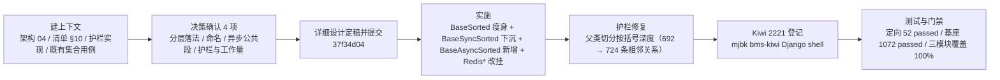

# 01 实施 · 集合体系收链（跨副本形态回链）

> **口径已被 08_02 取代（2026-09-30）**：本任务实施期落地的「体系根 + 同步 / 异步两条平行角色链」结构，已随 08 域最终定稿收敛为**唯一继承链**（`BaseCollection` 唯根 → `BaseSorted` / `BaseConcurrent` / `BaseAsyncSorted` / `BaseCacheSnapshot`；`RedisSnapshot` 改挂 `BaseCacheSnapshot`）。以《[后端基类清单](../../../../../../后端基类清单.md)》「集合体系」节与 [08_02 详细设计 §9](../../08_裸无序集合治理_02_bms_core存量整改/设计/01_详细设计_02_bms_core存量整改.md#unique-chain) 为准，本文档保留为当时实施留痕。

> 认证与安全 · 08 裸无序集合治理 · 子任务 05（需求 08-3，补充需求）· 实施记录

[文档首页](../../../../../../文档首页.md) › [05 集合体系收链](../08_裸无序集合治理_05_集合体系收链.md) › 实施记录　|　[← 任务](../08_裸无序集合治理_05_集合体系收链.md)　[详细设计 →](../设计/01_详细设计_05_集合体系收链.md)

## 1. 实施信息 

| 项 | 值 |
| --- | --- |
| 任务 | [05 集合体系收链](../08_裸无序集合治理_05_集合体系收链.md) |
| 对应需求 | [08-3](../../../../需求/08_需求_裸无序集合治理.md#r08-3) |
| 详细设计 | [01 详细设计](../设计/01_详细设计_05_集合体系收链.md) |
| 实施日期 | 2026-09-29（早于计划窗口 2026-11-01 ~ 11-02，见 §6 偏差 1） |
| 实施人 | minjian |
| 实施环境 | 本地开发机（Python 3.14.4；`uv run` 后端工具链） |
| 提交 | 代码 `062d7f76`（集合体系收链 + 护栏解析修复 + Kiwi 2221 用例）；文档登记回写随本次提交 |
| 结论 | 完成（无阻塞遗留；设计 §8 开放项 3 条已登记） |

## 2. 实施概览 

结果小结：集合体系由「三层形态并列（第三层链外）」改为「**体系根 + 同步 / 异步两条平行角色链**」——`RedisSortedSet` / `RedisSortedDict` 回归集合链，`RedisSnapshot` 保持框架对象侧；**同步侧零逻辑改动、零桥接**。

## 3. 实施过程 

1. **建上下文**：读《[架构设计 · 后端基础类体系](../../../../../../设计/架构设计/04_架构设计_后端基础类体系.md)》《[后端基类清单](../../../../../../后端基类清单.md)》§1 / §2 / §4 / §10、`scripts/tools/base-check/check-backend-base.py`（护栏实现）与既有集合用例；**实测**两个跨副本类的接口形态——方法全为 `async`、**无** `to_list` / `_json_data` / `to_dict`、`version_key` 为 `@property`。
2. **决策确认（4 项，逐项 question）**：分层落法＝体系根 + 两条平行角色链；命名＝`BaseSyncSorted` / `BaseAsyncSorted`；异步公共段＝仅同名同义三项；护栏与工作量＝不新增检查项、保持。
3. **详细设计**：落 `设计/01_详细设计_05_集合体系收链.md` 并**定稿即提交**（`37f34d04`）。
4. **实施**：
   - `core/collections.py`：`BaseSorted` 瘦身为**集合体系根**（只承载「有序语义 + 稳定序约定」与 `collection_kind = "sorted"`）；新增 `BaseSyncSorted`（原 3 抽象 + 5 助手 + `__str__` / `__repr__` **整体下移、语义不变**，`collection_kind = "sorted_sync"`）；`SortedList` / `SortedDict` / `SortedSet` 父类改挂 `BaseSyncSorted`。
   - `core/concurrent.py`：`BaseConcurrentSorted` 父类改挂 `BaseSyncSorted`（import 同步）。
   - `core/redis_collections.py`：新增 `BaseAsyncSorted`（`async size()` / `async version()` / `@property` + `@abstractmethod` 的 `version_key`；`collection_kind = "sorted_async"`）；`RedisSortedSet` / `RedisSortedDict` 父类改挂之；`RedisSnapshot` **不动**（保持 `BaseFrameworkObject`）。
   - 实测分层 13 项断言全 OK；同步侧 `to_json()` / `to_dict()` / `chunk()` 行为与改动前一致。
5. **护栏修复（必要）**：在《清单》§10 显式登记新链后，护栏仍报 5 项「应为 X 子类，实际父类 `…[KeyT`」——定位为 `check-backend-base.py` 以 `str.split(",")` 切分父类表达式，含逗号泛型基类被切坏而**静默跳过对账**（旧登记用 `Sorted*` / `ConcurrentSorted*` 占位符掩盖了该缺陷）。改为按括号深度切分（`split_bases`）+ 统一归一化（`normalize_parent`）。
6. **Kiwi 用例登记**：按《[KiwiTCMS部署使用说明](../../../../../../资料/开发服务器/linux/KiwiTCMS部署使用说明.md)》「用例登记（脚本化批量）」经 mjbk 容器内 Django shell 登记，取得用例号 **2221**（分类「平台骨架」/ P2 / CONFIRMED / 标签「自动化」）。
7. **测试**：新增 `tests/core/test_collections_chain.py`（6 用例，`@pytest.mark.kiwi_id(2221)`）；台账 `tests/core/test_object_bases_roots.py` 两项父基类改 `BaseAsyncSorted`、`OBJECT_BASES` 扩入 `BaseAsyncSorted`、`_class_bases` 去泛型参数。
8. **门禁**：定向用例 / 基座全量 / 覆盖率 / `ruff` / `format` / `pyright` / 护栏与自检 / 裸集合护栏 / `check-base` / `check-links` / `check-status` / `preflight --fast` 全绿（见 §5）。

## 4. 问题与处置 

| # | 问题 / 现象 | 原因 | 处置与落点 |
| --- | --- | --- | --- |
| 1 | pyright 报 2 处「`version_key` 在类型 property 不兼容的类 `BaseAsyncSorted` 中替代同名的方法」 | 两个跨副本类的 `version_key` 是 `@property`，层内声明成了普通方法 | 层内改为 `@property` + `@abstractmethod`；**设计 §3 / §4 回写**（异步公共段＝`async size()` / `async version()` / 同步属性 `version_key`） |
| 2 | 护栏报「`BaseConcurrentSorted` 应为 `BaseSorted` 子类」 | 《清单》§10 旧链未随代码更新 | 改写 §10 集合链登记（同步 / 异步两链显式登记，含新层） |
| 3 | 改写后仍报 5 项「应为 `X` 子类，实际父类：`…[KeyT`」 | `check-backend-base.py` 以 `str.split(",")` 切分父类，泛型参数内的逗号把基类切坏（如 `BaseConcurrentSorted[ItemT, SortedList[ItemT]]` → `BaseConcurrentSorted[ItemT`）；**旧登记用 `Sorted*` / `ConcurrentSorted*` 占位符，从未真正对账过这些类** | 新增 `split_bases`（按 `[` `]` 深度切分）+ `normalize_parent`（先去泛型再取末段）；相邻关系 692 → **724** 条、数据类语义受检类形态 498 → **565** 个；**设计 §6 第 7 项与 §10 回写**（属护栏既有缺陷的必要修复，非新增检查项） |
| 4 | 裸集合护栏报新增 1 处（`signature_return / list`） | 新函数 `split_bases` 返回注解写成裸 `list[str]` | 改 `Sequence[str]`；复跑护栏通过 |
| 5 | 新增测试用例 pyright 报 12 处「类型部分未知」 | 未参数化泛型类（`BaseAsyncSorted` / `RedisSortedSet[Unknown]`）的成员访问触发 `reportUnknownArgumentType` | 改用 `vars(...)` 取类命名空间（`dict[str, Any]`）断言抽象性与协程性；`pyright` 归 0 err |

## 5. 验证结果 

| 项 | 命令 | 结果 |
| --- | --- | --- |
| 定向用例 | `uv run pytest -q`（`test_collections_chain` / `test_object_bases_roots` / `test_collections` / `test_concurrent` / `test_redis_collections`） | **52 passed** |
| 基座全量 | `uv run pytest -q libs/bms_core/tests` | **1072 passed / 37 skipped** |
| 覆盖率（三改模块） | `--cov=bms_core.core.collections --cov=bms_core.core.concurrent --cov=bms_core.core.redis_collections` | **100%**（584 stmts / 0 miss） |
| 继承链护栏 | `python3 scripts/tools/base-check/check-backend-base.py .` | 通过（6 项；继承链 **724** 条相邻关系） |
| 护栏自检 | 同脚本 `--self-test` | 10 / 10 通过 |
| 裸集合护栏 | `python3 scripts/tools/base-check/check-bare-collections.py .` | 通过（基线 548 处无新增） |
| 基座校验 | `python3 scripts/tools/base-check/check-base.py .` | 通过 |
| 静态 | `uv run ruff check` / `ruff format --check` / `uv run pyright` | 全通过 / 全通过 / **0 err** |
| 文档一致性 | `check-status.py --stage 06_认证与安全 --strict` / `check-links.py` / `check-preflight.py --fast` | 全通过 |

**取证口径**：本任务无运行时行为变更（同步侧零逻辑改动、跨副本侧仅改父类），故定向回归取「集合体系三模块 + 基座全量」而非后端全量（《[测试规范](../../../../../../规范/测试规范.md)》「只跑受变更影响的部分」）；另实测**库外无任何模块引用集合体系**（`services/*/src`、`ops` 均无引用），故无服务侧定向范围。

## 6. 偏差与遗留 

- **偏差 1（进度）**：实施日期 **2026-09-29** 早于计划窗口 **2026-11-01 ~ 11-02**（提前实施）；计划将本任务移入「已完成」表并回写实际完成日期，窗口差额不影响后续进度（与 `08_01` 同口径）。
- **偏差 2（设计回写）**：`version_key` 为**属性**而非方法（问题 1）；详细设计 §3 / §4 已回写。
- **偏差 3（范围外必要修复）**：`check-backend-base.py` 的父类切分缺陷（问题 3）随本任务一并修复——它是「§10 登记即被对账」这一设计前提的必要条件，且使集合体系新增链登记**真正生效**；详细设计 §6 第 7 项、§10 已回写。
- **遗留**（详细设计 §8 开放项）：
  1. `collection_kind` 标记的用途边界——本次仅作形态判定位；若无消费方，可在后续任务评估退场。
  2. 更深异步公共段（`items()` / `top()` / `range_*` 等）——两成员命名与语义不同，本次不纳入；出现第三个同类异步集合时再按「出现公共段即提取为层」加层。
  3. `RedisSnapshot` 若将来成为有序集合形态（提供快照内有序读），再评估进链。

> 本文档依《[文档生成规范](../../../../../../规范/文档生成规范.md)》编写
