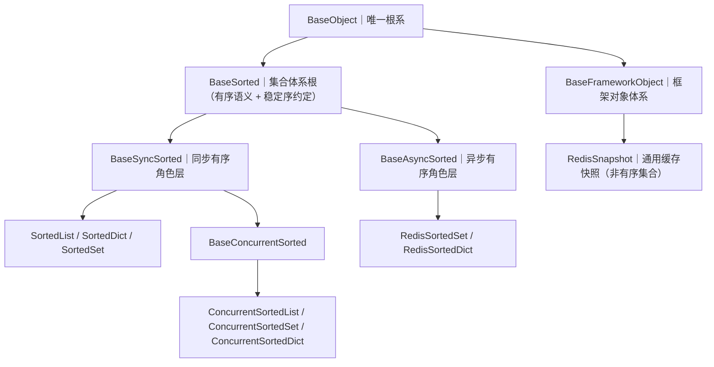

# 01 详细设计：集合体系收链（跨副本形态回链）

> 认证与安全 · 08 裸无序集合治理 · 子任务 05（需求 08-3，补充需求）· 详细设计

[文档首页](../../../../../../文档首页.md) › [08 裸无序集合治理](../../08_裸无序集合治理.md) › [05 集合体系收链](../08_裸无序集合治理_05_集合体系收链.md) › 详细设计

## 1. 目标与范围 

把**跨副本形态收回集合继承链**，使《[后端基类清单](../../../../../../后端基类清单.md)》「集合体系」节的「三层逐层演进」名副其实：`RedisSortedSet` / `RedisSortedDict` 现挂 `BaseFrameworkObject`（**集合链外**，09_05 归位所致），改为挂集合体系。

- **范围内**：集合体系公共段中立化（体系根只留语义约定；同步段下沉为同步角色层；新增异步角色层）+ 两个跨副本类改挂 + 清单 / 规范 / 架构回写。
- **范围外（不动）**：同步侧实现与行为（`Sorted*` / `ConcurrentSorted*` **零逻辑改动**）；`RedisSnapshot` 归属（**保持** `BaseFrameworkObject`，它是通用缓存快照、非有序集合）；护栏脚本主体与基线快照（新层登记后由「继承链对账 + 体系根白名单」自动覆盖）；`scripts/tools` 长期口径（归 `08_04`）。

## 2. 决策确认结果（2026-09-29） 

| 项 | 结论 |
| --- | --- |
| 分层落法 | **体系根 + 两条平行角色链**（`BaseSorted` 留体系根、只承载语义约定；同步段与实现下沉） |
| 命名 | 同步层 `BaseSyncSorted`、异步层 `BaseAsyncSorted` |
| 异步公共段 | 只收**同名同义**三项：`async size()` / `async version()` / 同步属性 `version_key`；读写方法（`add` / `incr` / `score` / `range_*` / `top` 与 `set` / `get` / `delete` / `items`）命名与语义不同，**不入公共段** |
| 护栏与工作量 | 不新增检查项（§10 登记后自动覆盖） |

**为何是两条角色链而非单链（取证结论，2026-09-29 实测）**：同步链与异步链之间**没有可实现的共同契约**——`BaseSorted` 现有 3 个抽象（`to_list` / `__iter__` / `_json_data`）与 5 个助手（`to_dict` / `to_json` / `sorted_by` / `chunk` / `merge`）**全部要求同步读**（`chunk` 迭代 `self`、`merge` 用 `to_list`、`__str__` 用 `to_list`），而 `RedisSortedSet` / `RedisSortedDict` **没有任何** `to_list` / `_json_data` / `to_dict`，方法全为 `async`；Python 无法 `async` 重载。若强行单链，只会让体系根变薄或让异步成员继承一份它实现不了的同步契约——后者正是《[后端基类清单](../../../../../../后端基类清单.md)》§10「不按用途给异质成员强套统一接口」（09_03）所禁止的。

## 3. 分层设计 

| 层 | 落点 | 公共段 | 成员 |
| --- | --- | --- | --- |
| `BaseSorted`（体系根） | `core/collections.py` | 语义约定＝「插入即有序 + 对外输出稳定序」；标记位 `collection_kind: ClassVar[str] = "sorted"`（与框架对象根 `object_kind` 同类的标记型公共段） | 无（抽象层） |
| `BaseSyncSorted`（同步角色层） | `core/collections.py` | 3 抽象（`to_list` / `__iter__` / `_json_data`）+ 5 助手（`to_dict` / `to_json` / `sorted_by` / `chunk` / `merge`）+ `__str__` / `__repr__`（**现 `BaseSorted` 内容整体下移，一行不改**）；`collection_kind = "sorted_sync"` | `SortedList` / `SortedDict` / `SortedSet`、`BaseConcurrentSorted`（→ `ConcurrentSorted*`） |
| `BaseAsyncSorted`（异步角色层） | `core/redis_collections.py` | 3 抽象（`async size()` / `async version()` / 同步属性 `version_key`）；`collection_kind = "sorted_async"` | `RedisSortedSet` / `RedisSortedDict` |

**体系根不空壳的论证**：`BaseSorted` 只承载**语义约定**，与其同构的先例是 `BaseValueObject`（只承载「不可变」约定，由 `@dataclass(frozen=True)` 实现约定 + 护栏强制，自身无字段无方法）——即「体系根承载本体系公共**语义**，落实手段可以是约定 + 护栏而非可执行方法」。《[架构设计 · 后端基础类体系](../../../../../../设计/架构设计/04_架构设计_后端基础类体系.md)》「体系根与四段」的「体系根必须承载本体系公共语义（禁止空壳层）」据此成立。

## 4. 各层契约与失败分支 

| 项 | 边界与失败分支 |
| --- | --- |
| `BaseSorted` | 无方法；`collection_kind` 供形态判定（日志 / 序列化 / 后续护栏），子层覆写 |
| `BaseSyncSorted.to_list()` / `__iter__()` / `_json_data()` | 保持抽象；同步成员必须实现（`Sorted*` 现状实现，`BaseConcurrentSorted` 子类现状实现） |
| `BaseSyncSorted.to_dict()` | 序列类调用抛 `TypeError`（现状口径保留：提示改用 `to_list()`）；映射类（`SortedDict`）覆写为按键映射 |
| `BaseSyncSorted.chunk()` | `size < 1` 抛 `ValueError`（现状保留） |
| `BaseAsyncSorted.size()` / `version()` | 抽象 `async`；跨副本成员必须实现（现有实现即满足） |
| `BaseAsyncSorted.version_key` | 抽象**同步属性**（`@property` + `@abstractmethod`；键名拼接不涉 IO，故不入异步段）；`RedisSortedSet` 与 `RedisSortedDict` 现有实现即满足 |
| **无同步读入口（关键边界）** | 异步层**不提供**同步读方法，也不做任何 sync→async 桥接（禁 `asyncio.run` / 线程池桥接 / 事件循环重入）；调用方必须 `await`——因此不存在「同步方法里等异步」的路径，同步热路径性能不受任何影响 |
| `Redis*` 既有方法 | 除与公共段同名的三处（`size` / `version` / `version_key`）由抽象声明收口外，其余方法（`add` / `incr` / `remove` / `score` / `range_by_rank` / `top` / `range_by_score` / `set` / `set_if_absent` / `delete` / `replace_if_equal` / `get_and_remove` / `update_atomic` / `get_locked` / `get` / `contains` / `items`）**原样留在各自类**，不移入公共段 |
| `RedisSnapshot` | 保持 `BaseFrameworkObject`；其公共段（`async get()` / `async invalidate()`）与有序集合无同名同义项，进链不成立 |

## 5. 代码改动点 

| # | 文件 | 改动 |
| --- | --- | --- |
| 1 | `backend/libs/bms_core/src/bms_core/core/collections.py` | ① `BaseSorted` 瘦身为体系根（保留 `collection_kind` 标记与语义 docstring，去掉 3 抽象 + 5 助手 + `__str__` / `__repr__`）；② 新增 `BaseSyncSorted[ItemT](BaseSorted[ItemT], ABC)` 承接上述内容（**内容整体下移、语义不变**）；③ 新增 `BaseAsyncSorted` 的**反向依赖说明**（类定义本身落 `redis_collections.py`，见下）；④ `SortedList` / `SortedDict` / `SortedSet` 父类 → `BaseSyncSorted[ItemT]` |
| 2 | `backend/libs/bms_core/src/bms_core/core/concurrent.py` | `BaseConcurrentSorted[ItemT, DataT]` 父类 `BaseSorted[ItemT]` → `BaseSyncSorted[ItemT]`（import 同步） |
| 3 | `backend/libs/bms_core/src/bms_core/core/redis_collections.py` | ① 新增 `BaseAsyncSorted[ItemT](BaseSorted[ItemT], ABC)`（异步公共段 3 项抽象）；② `RedisSortedSet` / `RedisSortedDict` 父类 → `BaseAsyncSorted[...]`（删除 `BaseFrameworkObject` import，若不再使用）；③ `RedisSnapshot` **不动** |

**分层落点理由**：`BaseAsyncSorted` 与 `BaseSyncSorted` 分属两模块，避免 `collections.py` ↔ `redis_collections.py` 双向依赖（`collections.py` 不感知 Redis）；两层同为 `BaseSorted` 直接子类，互不依赖。

**行为零变更**：`BaseSyncSorted` 内容整体下移不产生行为差异；`Redis*` 仅改父类与（可能的）import；`RedisSnapshot` 不动。`issubclass(SortedList, BaseSorted)` 等既有关系**仍为真**（传递继承）。

## 6. 登记与文档回写落点 

| # | 落点 | 回写内容 |
| --- | --- | --- |
| 1 | 《[后端基类清单](../../../../../../后端基类清单.md)》§2 分层总览 | 集合三行（有序 / 进程内并发 / 跨副本）的基类列补 `BaseSyncSorted` / `BaseAsyncSorted`；跨副本行父类由 `BaseObject` 修正为 `BaseAsyncSorted` |
| 2 | 同清单 §4「集合体系」 | 形态表补两条角色链；说明「同步 / 异步两条角色链同挂体系根 `BaseSorted`」与 `RedisSnapshot` 归属（框架对象侧、非有序集合） |
| 3 | 同清单 §10 | 「体系根清单」**不变**（`BaseSorted` 仍是集合体系根）；继承链改写为：`SortedList / SortedDict / SortedSet → BaseSyncSorted → BaseSorted → BaseObject`、`ConcurrentSorted* → BaseConcurrentSorted → BaseSyncSorted → BaseSorted → BaseObject`、`RedisSortedSet / RedisSortedDict → BaseAsyncSorted → BaseSorted → BaseObject`；框架对象归位条目中 `RedisSnapshot` 保留、两个 `Redis*` 移出该条 |
| 4 | 《[后端开发规范](../../../../../../规范/后端开发规范.md)》「后端基座体系（强制）」节「集合与排序」 | 补「集合体系分同步链（进程内 / 并发）与异步链（跨副本）两条角色链，同挂体系根 `BaseSorted`；跨副本形态必须挂异步链，禁止链外挂接；禁止 sync→async 桥接」 |
| 5 | 《[架构设计 · 后端基础类体系](../../../../../../设计/架构设计/04_架构设计_后端基础类体系.md)》§3 图与 §5 | 图内 `COL → CONC → REDIS` 改为「体系根分两支」；§5 语义补两条角色链 |
| 6 | 任务 / 域总览 / 计划 | 状态与完成日期回写（任务信息表 + 域总览子任务清单 + 计划剩余进度行） |
| 7 | `scripts/tools/base-check/check-backend-base.py` | **必要修复（实施期发现）**：该类「继承链对账」原以 `str.split(",")` 切分父类表达式，含逗号泛型基类（`BaseConcurrentSorted[ItemT, SortedList[ItemT]]`、`BaseSyncSorted[tuple[KeyT, ValueT]]`）被切坏 → 该类**静默跳过对账**（原注册用 `Sorted*` / `ConcurrentSorted*` 占位符，掩盖了该缺陷）。改为按括号深度切分（`split_bases`）+ 统一归一化（`normalize_parent`），使「§10 登记即被对账」的前提成立：相邻关系由 692 → **724** 条、数据类语义受检类形态由 498 → **565** 个 |

## 7. 测试设计与验收映射 

**Kiwi 用例（先登记取号、后写自动化）**：

| 用例 | 断言 | 验收映射 |
| --- | --- | --- |
| 集合体系分层 | `issubclass(BaseSyncSorted, BaseSorted)`、`issubclass(BaseAsyncSorted, BaseSorted)`；`Sorted*` 与 `ConcurrentSorted*` 在同步链（`issubclass(..., BaseSyncSorted)`）；`RedisSortedSet` / `RedisSortedDict` 在异步链；`RedisSnapshot` 仍 `issubclass(..., BaseFrameworkObject)` 且**不在**集合链上 | 需求 08-3 完成标准「三层为一条继承链、`RedisSnapshot` 在框架对象侧」 |
| 异步角色层公共段成立 | `BaseAsyncSorted.size` / `version` 为抽象 async 方法、`version_key` 为抽象同步方法；两个成员均实现且 `collection_kind == "sorted_async"` | 需求 08-3 内容 1 / 2 |
| 清单与代码零漂移 | 复用 `scripts/tools/base-check/check-backend-base.py`「继承链对账」（§10 ↔ 代码）为机器断言，用例内断言台账父基类名 | 完成标准「§1 / §4 / §10 与代码零漂移」 |
| 行为零变更 | 既有集合 / 并发集合 / Redis 集合用例（Kiwi 15 等）**全绿**；同步侧 `to_list` / `to_dict` / `to_json` / `chunk` / `merge` / `sorted_by` 断言不变 | 完成标准「行为零变更」 |

**用例落点**：在既有台账用例 `tests/core/test_object_bases_roots.py`（Kiwi 2217）中，把 Redis 两项的期望父基类由 `BaseFrameworkObject` 改为 `BaseAsyncSorted`（并把该名加入 `OBJECT_BASES`）；分层与公共段断言新增到 `tests/core/test_collections.py` / `tests/core/test_concurrent.py` / `tests/core/test_redis_collections.py`（沿用各自现有 Kiwi 标注位）。

**门禁**：定向 `uv run pytest -q`（集合 / 并发 / Redis 集合 / 体系根台账 + 依赖集合的模块）、`ruff check`、`ruff format --check`、`pyright`、`check-backend-base.py`、`check-base.py`、`check-links.py`、`check-status.py --stage 06_认证与安全 --strict`、`check-preflight.py --fast`。

## 8. 边界与开放项 

1. **`scripts/tools` 是否纳入集合口径**：与集合体系无关，仍归 `08_04` 批次 3 评估。
2. **`collection_kind` 标记的用途边界**：本次仅作形态判定位（与 `object_kind` 同构）；若后续无人消费，可在后续任务评估是否退场（不引入护栏项，避免过度约束）。
3. **异步层是否补 `async items()` 等更深公共段**：`RedisSortedDict.items()` 与 `RedisSortedSet` 的 `top()` / `range_*` 语义不同名 → 本次不纳入；若后续出现第三个同类异步集合且与二者要求同构，再按 09_03「出现公共段即提取为层」加层。
4. **`RedisSnapshot` 若将来成为有序集合形态**（如提供快照内有序读），再评估进链。

## 9. 实施顺序与提交口径 

`BaseSyncSorted 下沉与 3 个 Sorted* 改父类`（提交 1：`feat`）→ `BaseConcurrentSorted 改父类` → `BaseAsyncSorted 新增与 2 个 Redis* 改父类` → `Kiwi 用例登记 + 自动化断言` → `门禁全绿` → `清单 / 规范 / 架构回写`（提交 2：`docs`）→ `任务与计划状态回写 + 实施与测试记录`。代码与文档分开提交，只暂存本任务相关文件。

## 10. 对齐记录 

- 2026-09-29 需求立项（08-3）与本设计要求**逐项确认**（分层落法 / 命名 / 异步公共段 / 护栏与工作量），结论见第 2 节。
- 设计期内未发生与《[后端开发规范](../../../../../../规范/后端开发规范.md)》《[后端基类清单](../../../../../../后端基类清单.md)》的口径冲突；「体系根是否空壳」经与 `BaseValueObject` 先例比对后判定成立（第 3 节）。
- 与 09 域关系：本任务只做**集合体系**的分层收链；框架对象体系（`BaseFrameworkObject`）语义与白名单不变，`RedisSnapshot` 归属不变。
- **实施期回写 1（公共段形态）**：`version_key` 在两个跨副本类中是 **`@property`** 而非方法 → 异步角色层改为「`@property` + `@abstractmethod`」声明（§3 / §4 已回写），否则 pyright 报不兼容覆写。
- **实施期回写 2（护栏解析缺陷）**：§6 新增第 7 项——「§10 登记即被对账」的前提原**不成立**（父类切分按裸逗号，含逗号泛型基类被静默跳过）；已修复切分逻辑，本任务的新链登记因此**真正生效**（相邻关系 692 → 724）。此为护栏**既有缺陷的必要修复**，非新增检查项（与第 2 节「不新增检查项」结论一致）。

> 本文档依《[文档生成规范](../../../../../../规范/文档生成规范.md)》编写
