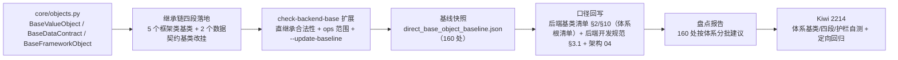

# 01 实施 · 后端类体系根治理

> 认证与安全 · 09 类体系根治理 · 子任务 01（需求 09-1，补充需求）· 实施记录

[文档首页](../../../../../../文档首页.md) › [01 后端类体系根治理](../09_类体系根治理_01_后端类体系根治理.md) › 实施记录　|　[← 任务](../09_类体系根治理_01_后端类体系根治理.md)　[盘点报告 →](02_存量归位盘点报告_01_后端类体系根治理.md)

## 1. 实施信息 

| 项 | 值 |
| --- | --- |
| 任务 | [01 后端类体系根治理](../09_类体系根治理_01_后端类体系根治理.md) |
| 对应需求 | [09-1](../../../../需求/09_需求_类体系根治理.md#r09-1) |
| 详细设计 | [01 详细设计](../设计/01_详细设计_01_后端类体系根治理.md) |
| 实施日期 | 2026-09-28（早于计划窗口 2026-10-08 ~ 10-09，见 §6 偏差 1） |
| 实施人 | minjian |
| 实施环境 | 本地开发机（Python 3.14.4 / uv） |
| 提交 | 代码与文档随本次提交（见 §5） |
| 结论 | 完成（无阻塞遗留；160 处存量归位按盘点报告分批另立任务） |

## 2. 实施概览 

## 3. 实施过程 

1. **体系基类**（`core/objects.py` 新增）：`BaseValueObject`（`@dataclass(frozen=True)`）/ `BaseDataContract`（`@dataclass`）/ `BaseFrameworkObject`（`object_kind` + 可选 `aclose` 钩子位，默认空操作）；三者均直继承 `BaseObject`（体系根）。**实施前先实测**：`@dataclass` 基类与 `pydantic.BaseModel` / `sqlalchemy.DeclarativeBase` 混入无冲突（设计 §3.1 已记录结论）。
2. **继承链四段落地**：`BasePlaceholder` / `BaseCapability` / `BaseAsyncResource`（`core/capability.py`）、`BaseLogger`（`core/logging.py`）、`BaseRouter`（`api/base.py`）改挂 `BaseFrameworkObject`；`BaseSchema`（`schemas/base.py`）、`BaseModel`（`models/base.py`）改挂 `BaseDataContract`；`BaseSorted` / `BaseRepository` / `BaseService` / `UnitOfWork` 保持体系根不变。导入经 ruff `--fix` 校正 isort 顺序。
3. **护栏扩展**（`check-backend-base.py`）：新增第 3 项检查「直继承合法性」（`parse_root_bases` 解析清单 §10「体系根清单」→ 白名单；缺失即报错不放行；`load_direct_baseline` + `scan_direct_base_object` + `check_direct_inheritance`）；`SOURCE_DIRS` 增 `backend/ops`；新增 `--update-baseline`（含 `_class_kind` 拟归位体系判定）；`--self-test` 扩至 7 例（新增「非体系根直继承未入基线拦截」「体系根清单缺失拦截」，原样例清单 fixture 统一补体系根小节）。
4. **清单 / 规范 / 架构回写**：《后端基类清单》§2 新增「体系基类」3 行并改中间层父基类列；§10 新增「体系根清单（7 个）」「四段继承链」「体系基类落点与承接」「护栏与基线」「直继承登记补齐（`RateLimitDecision` 与 `ops/` 4 个）」并全量改写历史链 `→ BaseFrameworkObject` / `→ BaseDataContract`；《后端开发规范》§3.1「必须继承」拆分并新增「**严禁上帝基类（强制）**」条目；架构 04 §3 补「体系根与四段」段。
5. **基线快照**：`check-backend-base.py . --update-baseline` 生成 `deploy/boundaries/direct_base_object_baseline.json`（**160 条**：值对象 110 / 框架对象 47 / 数据契约 3）；生成后复跑零漂移。
6. **盘点报告**：产出[存量归位盘点报告](02_存量归位盘点报告_01_后端类体系根治理.md)（区域 × 体系 × 形态 + 四批归位建议 + 基线递减口径）。
7. **测试**：先登记 Kiwi **2214** 再落用例（`libs/bms_core/tests/core/test_objects.py`，5 例）+ 护栏自测矩阵（7 例）+ 定向回归。

## 4. 问题与处置 

| # | 问题 / 现象 | 原因 | 处置 |
| --- | --- | --- | --- |
| 1 | 清单历史链批量改写出错（`BaseCapability → BaseObject` 未全改） | 清单链为「每个类名独立反引号」形态（`` `A` → `B` ``），首次替换用无反引号文本只命中 1 处 | 改按带反引号形态 `replace_all`，47 处一次改正 |
| 2 | 四段链写法导致「`BaseFrameworkObject` 应为 `BaseCapability` 子类」误报 | 护栏链方向为**子 → 父**，我按「父 → 子」书写 | 改为 `BasePluggable → BaseCapability → BaseFrameworkObject → 根系（BaseObject）`（根系段以括号包裹、由解析器忽略） |
| 3 | `preflight --fast` 报 `check-bare-collections` 失败 | 本任务在 `scripts/tools` 新写的函数签名注解（`-> set[...]` / `list[...]`）触发 08_01 裸集合护栏（护栏按设计工作） | **改写为只读抽象** `Sequence[...]`（未加基线、未放宽护栏） |
| 4 | `from collections.abc import AbstractSet` ImportError | `collections.abc` 无 `AbstractSet`（应为 `Set`，但 `Set` 会命中裸集合护栏） | 统一改用 `Sequence`（内部 set 去重后 `sorted` 输出，兼合稳定序） |
| 5 | 新增体系基类行后 `check-base` / `check-links` 需复校 | 清单与架构文档改动 | 均复跑全绿（见 §5） |

## 5. 验证结果 

| 项 | 命令 | 结果 |
| --- | --- | --- |
| 导入与继承链 | `uv run python -c "...issubclass..."` | 四段成立且仍在 `BaseObject` 之下 |
| 新增用例 | `uv run pytest -q libs/bms_core/tests/core/test_objects.py` | 5 passed |
| 定向回归 | `uv run pytest -q libs/bms_core/tests/{core,schemas,crosscut,api,services}` | 197 passed（另 `tests/permission` + `services/platform/tests/crosscut` 41 passed） |
| 静态检查 | `uv run ruff check libs/bms_core` / `ruff format --check` | 全绿（509 文件） |
| 类型检查 | `uv run pyright` | 0 errors / 0 warnings |
| 覆盖率 | `--cov=bms_core.core.objects` | 15 语句 / 0 未覆盖 = **100%** |
| 直继承护栏 | `check-backend-base.py . ` | 通过（167 类：体系根 + 基线放行） |
| 护栏自测 | `check-backend-base.py --self-test` | 7 例全通过 |
| 裸集合护栏（回归） | `check-bare-collections.py .` | 通过（基线 554 处豁免，无新增） |
| 基座文档校验 | `check-base.py .` / `check-links.py` | 全绿（断链 0） |
| 本地预检 | `preflight --fast` | 全部通过 |

## 6. 偏差与遗留 

- **偏差 1（进度）**：实施日期 **2026-09-28** 早于计划窗口（2026-10-08 ~ 10-09），计划已回写实际完成日期。
- **偏差 2（口径细化，已回写设计）**：护栏链方向为「子 → 父」（设计 §3.3 表述按此校正）；白名单解析用「清单 §10 小节内 `- \`X\`：` 行」格式（实现细节，已在清单落格式）。
- **遗留**：
  1. **160 处存量归位**（值对象 110 / 框架对象 47 / 数据契约 3）→ 按[盘点报告](02_存量归位盘点报告_01_后端类体系根治理.md)分批另立任务（[计划 §7 第 26 项](../../../../计划/01_计划_认证与安全.md#followup)）。
  2. **前端框架层对称** → [09_02](../../09_类体系根治理_02_前端框架层对称/09_类体系根治理_02_前端框架层对称.md)。
  3. 归位体系判定为启发式（`target_system`），逐类复核时可能调整（仅影响台账分类）。

> 本文档依《[文档生成规范](../../../../../../规范/文档生成规范.md)》编写
