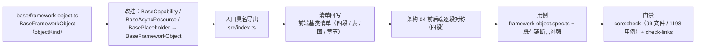

# 02 实施 · 前端框架层对称

> 认证与安全 · 09 类体系根治理 · 子任务 02（需求 09-1，补充需求）· 实施记录

[文档首页](../../../../../../文档首页.md) › [02 前端框架层对称](../09_类体系根治理_02_前端框架层对称.md) › 实施记录　|　[← 任务](../09_类体系根治理_02_前端框架层对称.md)

## 1. 实施信息 

| 项 | 值 |
| --- | --- |
| 任务 | [02 前端框架层对称](../09_类体系根治理_02_前端框架层对称.md) |
| 对应需求 | [09-1](../../../../需求/09_需求_类体系根治理.md#r09-1) |
| 详细设计 | [01 详细设计](../设计/01_详细设计_02_前端框架层对称.md) |
| 实施日期 | 2026-09-28（早于计划窗口 2026-10-12，见 §6 偏差 1） |
| 实施人 | minjian |
| 实施环境 | 本地开发机（pnpm workspace / vitest 5 / TS） |
| 提交 | 代码与文档随本次提交（见 §5） |
| 结论 | 完成（域 09 两子任务全部收口；2 项遗留已登记） |

## 2. 实施概览 

## 3. 实施过程 

1. **框架对象层基类**（`frontend/packages/core/src/base/framework-object.ts` 新增）：`BaseFrameworkObject extends BaseObject`，承载框架对象统一标识 `objectKind`（缺省 `framework`，子层可覆写）；非渲染 / 非数据对象语义；生命周期沿用总基类 `dispose()` / `onDispose()`（**不新增 `aclose`**，前端无异步资源释放口径——与后端的差异已在设计 §7 登记）。
2. **框架类底座改挂**：`BaseCapability`（`mechanisms/capability.ts`）、`BaseAsyncResource`（`mechanisms/resource.ts`）、`BasePlaceholder`（`mechanisms/placeholder.ts`）由 `extends BaseObject` 改为 `extends BaseFrameworkObject`；`BasePluggable` / `BaseComponent` / 各插件基类 / 注册表 / 工厂随链自动进入框架对象层（**行为零变更**）。
3. **入口导出**：`src/index.ts` 增 `export { BaseFrameworkObject } from './base/framework-object'`（守卫用例要求源码基类均由入口具名导出）。
4. **清单回写**（《前端基类清单》）：§1.1 体系口径与「固定三段」→「固定**四段**」；§2 继承链总览树；§2.2 全景图（新增 `FWO` 节点，`OBJ → FWO → CAP → PLG`，资源 / 占位改为 `FWO →`）；§2.1 全量登记表（新增 `BaseFrameworkObject` 行，`BaseCapability` 父基类与类别、`BasePluggable` 类别、`BaseAsyncResource` / `BasePlaceholder` 父基类）；§3 标题与强制句改四段并**新增 §3.2 框架对象层**（原 §3.2 / §3.3 顺延为 §3.3 / §3.4）；§5 组件侧顺序句；§8 固定主干与资源 / 占位 / 契约小结；§9 目录描述。
5. **架构回写**：《[架构设计 · 后端基础类体系](../../../../../../设计/架构设计/04_架构设计_后端基础类体系.md)》补「**前后端逐段对称（四段）**」段（前端同一四段 + 组件侧层序 + 前端清单为唯一权威）。
6. **测试**：先登记 Kiwi **2215** 再落用例——新增 `tests/framework-object.spec.ts`（5 例）；`tests/pluggable.spec.ts` / `tests/component.spec.ts` 既有继承链断言**补强**（加 `BaseFrameworkObject` 层，原断言不变）。

## 4. 问题与处置 

| # | 问题 / 现象 | 原因 | 处置 |
| --- | --- | --- | --- |
| 1 | 新增基类会触发清单守卫用例（六道校验）红 | `guard-base-registry.spec.ts` 校验「清单 ↔ 源码零差集 / `extends` 一致 / 入口具名导出」 | 按守卫要求**同步三处**（清单登记 + 改挂 + 入口导出），一次通过（护栏按设计发挥作用） |
| 2 | 清单表编号策略 | 表内编号为登记序号（1~94），插入层级行会触发全量重排 | 新行**追加表末**（编号 95），层级由「类别」列（固定主干 ①~④）承载；守卫不校验编号连续性 ✓；未产生无谓 diff |
| 3 | `BaseError` 不能改挂 | 经 `withBaseObject(Error)` mixin 实现多重继承，无法改父类 | 保持现状（守卫 `PARENT_EXEMPT` 已含 `BaseError`），在设计 §7 登记 |
| 4 | 前端数据 / 契约类仍直挂 `BaseObject` | 前端无「数据契约体系根」（与后端 7 体系根不同源） | **不在本任务范围**（用户口径为「组件链加框架对象层」），登记遗留 §6 |

## 5. 验证结果 

| 项 | 命令 | 结果 |
| --- | --- | --- |
| 新增用例 | `npx vitest run tests/framework-object.spec.ts` | 5 passed |
| 覆盖率 | 同上 + `--coverage.include=src/base/framework-object.ts` | **100%**（Stmts / Branch / Funcs / Lines） |
| 前端总门禁 | `pnpm run core:check`（tsc --noEmit + eslint --max-warnings 0 + vitest） | **99 文件 / 1198 用例全通过** |
| 清单守卫 | `guard-base-registry.spec.ts`（六道校验） | 通过（清单 / 源码 / 导出三向一致） |
| 文档校验 | `check-links.py` / `check-status.py --stage 06_认证与安全` | 全绿（断链 0；状态一致） |

## 6. 偏差与遗留 

- **偏差 1（进度）**：实施日期 **2026-09-28** 早于计划窗口（2026-10-12），计划已回写实际完成日期。
- **偏差 2（清单编号）**：新行追加表末（§4 问题 2），层级由「类别」列承载——设计 §3.3 已按此口径记录。
- **遗留**：
  1. **前端数据契约体系层**（`BaseApi` / `BaseDataObject` / `BaseEntity` / `BasePageQuery` 仍直挂 `BaseObject`）→ 如需与后端 `BaseDataContract` 对称，另立任务。
  2. **前端「禁止直挂根系」护栏**（对应后端「直继承合法性」检查）→ 当前仅清单守卫，无体系根白名单硬校验，另立任务。

> 本文档依《[文档生成规范](../../../../../../规范/文档生成规范.md)》编写
