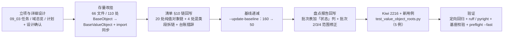

# 01 实施 · 值对象存量归位（批次 1）

> 认证与安全 · 09 类体系根治理 · 子任务 03（需求 09-1，补充需求）· 实施记录

[文档首页](../../../../../../文档首页.md) › [03 值对象存量归位（批次 1）](../09_类体系根治理_03_值对象存量归位.md) › 实施记录　|　[← 任务](../09_类体系根治理_03_值对象存量归位.md)　[测试记录 →](../测试/01_测试_03_值对象存量归位.md)

## 1. 实施信息 

| 项 | 值 |
| --- | --- |
| 任务 | [03 值对象存量归位（批次 1）](../09_类体系根治理_03_值对象存量归位.md) |
| 对应需求 | [09-1](../../../../需求/09_需求_类体系根治理.md#r09-1) |
| 详细设计 | [01 详细设计](../设计/01_详细设计_03_值对象存量归位.md) |
| 实施日期 | 2026-09-28（计划窗口同日，无偏移） |
| 实施人 | minjian |
| 实施环境 | 本地开发机（Python 3.14.4 / uv / ruff 0.6+ / pyright 1.1.411） |
| 提交 | 代码 `feat(基座): 值对象存量归位批次 1（110 处改挂 BaseValueObject；Kiwi 2216）`；文档 `docs(认证与安全): 09_03 值对象存量归位登记回写与实施测试记录` |
| 结论 | 完成（基线 160 → 50；余 50 处按体系分批另立任务） |

## 2. 实施概览 

## 3. 实施过程 

1. **立项与设计**（已提交）：09 域下新建子任务 03（`09_类体系根治理_03_值对象存量归位`），任务文档 + 域总览 + 计划（§1 计数与工时、§3 剩余排期、§4 甘特、§7 第 26 项）三处登记；详细设计定稿（8 项决策确认）。
2. **存量改挂**（一次脚本化改挂，脚本不入库）：按基线快照取 `target_system = value_object` 的 **110 处 / 66 文件**，逐文件把 `class X(BaseObject)` 改为 `class X(BaseValueObject)` 并同步 import——**纯值对象文件 54 个**换 import 为 `from bms_core.core.objects import BaseValueObject`，**混合文件 12 个**（同文件另有框架对象直继承类）保留两条 import；随后 `uv run ruff check --fix .` 校正 isort 顺序（55 处）。
3. **清单 §10 链回写**：`→ BaseObject` → `→ BaseValueObject`——纯值对象段 **20 处**自动改写（判定口径＝括号内容等长遮蔽后，段内反引号类名全在批内）；**4 处混类段拆链**（发件箱 / 事件契约与编排 / 字典 / 系统参数——同段内混有框架对象）；`RateLimitDecision` 与 `ops/` 4 个结果类从「直继承登记补齐」句拆出并改挂；同步更新 §2 分层总览状态列、§10 体系基类承接表、「归位台账与分批」、「存量链路口径」（处数 164 → 50）。
4. **基线递减**：`python3 scripts/tools/base-check/check-backend-base.py . --update-baseline` 重写 `deploy/boundaries/direct_base_object_baseline.json`——**160 → 50 条**（`framework_object` 47 + `data_contract` 3；区域 `libs` 33 + `services` 17），复跑零漂移。
5. **盘点报告回写**：09_01《存量归位盘点报告》§3 分批表加「状态」列（批次 1 已完成、批次 4 随批次 1 清零），修正批次 2（47 → 33 = 数据契约 3 + 框架类 30）与批次 3（29 → 17），并补「当前余量 50 条」分布。
6. **测试**：先登记 Kiwi **2216**（用例先登记、后写码），落 `libs/bms_core/tests/core/test_value_object_roots.py`（5 例：台账冻结 / 归位完整性 AST / 体系根边界 / 直继承合法性全域扫描 / 基线递减口径），护栏自测矩阵 7 例复跑通过。

## 4. 问题与处置 

| # | 问题 / 现象 | 原因 | 处置 |
| --- | --- | --- | --- |
| 1 | 盘点报告批次 1 写「`bms_core` 值对象 110 处」，实测 `bms_core` 为 94 处 | 报告把**全域**值对象数（110 = `bms_core` 94 + `services` 12 + `ops` 4）写进「`bms_core` …」行 | 决策确认后按**全域 110 处**执行，并回写批次表范围与数量（本记录 §6 偏差 1） |
| 2 | 清单链改写脚本首版替换位置错乱 | 用相同的 `→ \`BaseObject\`` token 做 `rindex` 反查，导致「替换末尾 17 处」而非「目标 17 处」 | 改为按**绝对下标自后向前**替换；`git checkout` 回滚后重跑（断言命中数 20） |
| 3 | 3 处纯值对象链（`PoolBudgetRow` / `DbCount` / `MigrationChain`）漏检 | 括号注记内含 `；`、`，`，段内定位被引号内分隔符带偏 | 检测前按与护栏同口径「括号内容**等长遮蔽**为空格」，下标不变且段内干净 |
| 4 | 4 处链段混有框架对象（`ProcessedEventStore` / `EventContractRegistry` / `DictQueryService`+`DictService` / `ConfigService`） | 同行登记多体系类，一个 `→ BaseObject` 覆盖不了两类 | **拆链**：批内类改 `→ BaseValueObject`、批外类保留 `→ BaseObject`（共 4 段，另拆分「直继承登记补齐」句） |
| 5 | 拆链后护栏报「清单登记 `Saga` / `ops` 起始链，但代码未找到该类」 | 链解析会提取段内**含小写字母的 ASCII 词**（中文标签被过滤，`Saga` / `ops` 不会）→ 被当成类名广播成链 | 链段内标签改**纯中文**（「编排值对象」「运维脚本结果类」），英文路径只留括号注记 |
| 6 | 新用例 pyright strict 报 `reportUnknownVariableType`（2 处）+ ruff SIM300 | 局部 `roots = []` / `offenders = []` 推断为 `list[Unknown]`；`_SYSTEM_ROOTS <= found` 被判 Yoda 条件 | 显式标注 `roots: list[str]` / `offenders: list[str]`；改 `found >= _SYSTEM_ROOTS` |
| 7 | 盘点报告新增链接断链 | 报告位于 `实施/`，相对层级比任务文档再深一层，首次少退一级 | `check-links.py` 捕获并修正为 `../../09_类体系根治理_03_…` |

## 5. 验证结果 

| 项 | 命令 / 口径 | 结果 |
| --- | --- | --- |
| 归位规模 | 基线快照 `value_object` 条目 × 文件 | 110 处 / 66 文件（纯值对象文件 54 + 混合文件 12）全部改挂 |
| 残留直继承 | `grep "class .*(BaseObject)"` + 护栏扫描 | 57 类（体系根 7 + 基线 50），无本批类残留 |
| 静态检查 | 后端 `uv run ruff check .` / `ruff format --check .` | All checks passed / 914 files already formatted |
| 类型检查 | 后端 `uv run pyright` | 0 errors / 0 warnings |
| 新增用例 | `uv run pytest -q --cov=bms_core.core.objects libs/bms_core/tests/core/test_value_object_roots.py` | 5 passed / 覆盖率 100% |
| 定向回归 | `uv run pytest -q libs/bms_core/tests services/identity/tests` | **1294 passed / 38 skipped**（64s） |
| 基类护栏 | `python3 scripts/tools/base-check/check-backend-base.py .` | 通过（继承链 654 条 / 直继承 57 类 / 错误码 76 / 迁移链 22） |
| 护栏自测 | `check-backend-base.py --self-test` | 7 例全通过 |
| 基线递减 | `--update-baseline` 后复跑 | 160 → **50** 条，零漂移 |
| 裸集合护栏 | `check-bare-collections.py .` | 通过（基线 554 处豁免、无新增） |
| 基座文档 | `check-base.py .` / `check-links.py .` | 均通过（断链 0 / 失效锚点 0） |
| 本地预检 | `check-preflight.py --fast` | 全部通过（含契约快照、事件契约、api-types 零漂移） |

## 6. 偏差与遗留 

- **偏差 1（台账口径，已回写）**：盘点报告批次 1 的「110」原表述为「`bms_core` 值对象」，实测 `bms_core` 为 94 处；经决策确认按**全域值对象 110 处**（`bms_core` 94 + `services` 12 + `ops` 4）执行，并回写报告 §3 批次表（加「状态」列、修正批次 2 / 3 / 4 范围数量）与 §10「存量链路口径」处数。
- **偏差 2（实施方式，已记录）**：存量改挂以**一次性脚本**完成（脚本置于临时目录、未入库、用后删除），属机械批量改写而非逐处手改；改写结果以护栏 + 台账用例逐项断言兜底。
- **遗留**：
  1. **余 50 处直继承**（数据契约 3 + 框架对象 47）→ 09 后续批次（框架类需逐类判定「非数据对象」语义）；登记[计划 §7 第 26 项](../../../../计划/01_计划_认证与安全.md#followup)。
  2. **08 裸集合批次 1（7 处类字段裸集合）** 未并入本批次 → 仍归 08 域分批任务（本记录 §4 说明）。
  3. `BaseValueObject` 仍无字段；如需为值对象体系增加公共字段（语义变更）→ 另立评估。

## 7. 批次 ①（体系根口径治理与角色链分层） 

本任务 2026-09-28 经拍板扩口：由「值对象存量归位」扩为「归位 + 体系根口径治理 + 角色链分层」，**工时 8h → 32h、状态回 `部分完成`**，按层分批实施（批次 ①~⑥）。

| 项 | 内容 |
| --- | --- |
| 口径判据 | `BaseValueObject` 体系语义定为「**不可变数据类体系根**」；其下角色链按**公共段**成层、**链各自独立 / 长短不一 / 不设固定层数**（引架构 05 原文口径）；**禁止**按「用途 + 统一接口」给异质成员强套契约。回写《架构设计 · 后端基础类体系》「数据类体系语义与角色链」段 +《后端开发规范》§3.1 新增强制条 +《后端基类清单》§2 / §10 |
| 落点台账 | 110 类逐一判定：**层成员 69 / 单类链 40 / 迁出 1**；角色链 **29 层**（链长 2–4 段）。详见 `设计/02_详细设计_角色链分层_03_值对象存量归位.md` |
| 迁移 | `ChatStreamHandle` → `BaseFrameworkObject`（普通类 + 显式 `__init__` + `object_kind = "chat_stream_handle"` + `aclose` 钩子）；消费点 `chat/null.py` 构造与 `services/ai` 测试 `isinstance`，无相等 / 哈希 / 序列化依赖，零影响 |
| 护栏 | `check-backend-base.py` 第 4 项「数据类体系语义」（值对象体系须 `@dataclass(frozen=True)`；框架对象体系不得为 dataclass）+ `--self-test` 增 3 例（未 frozen 拦截 / 框架 dataclass 拦截 / 合规放行），自测 **10 例**全通过 |
| 台账用例 | `test_value_object_roots.py` 台账 110 → **109**（`ChatStreamHandle` 迁出）+ 新增迁出断言（框架对象体系 / 非 dataclass / `object_kind`） |

**问题与处置**：① 机械聚类（按全局共享字段）把 78 个类连成一坨、无法成链 → 改为**先取公共段、再按族聚链、逐级细分**，并逐类校准（判定链 / 字段规格链 / 流程链 / 登记记录链 / 种子数据链在二轮补入，24 → 29 层）；② 新写的护栏签名注解 `-> dict[str, list[...]]` 触发 08 裸集合护栏 2 处 → 改只读抽象 `Mapping` / `Sequence` / `Collection`（**未放宽护栏**）。

**验证**：定向回归 `libs/bms_core/tests` + `services/identity/tests` = **1295 passed / 38 skipped**；`ruff check` / `ruff format --check` / `pyright`（0 errors）全绿；`check-backend-base.py .`（6 项）与 `--self-test`（10 例）通过；`check-bare-collections.py .` 通过（554 基线无新增）；`check-links.py` 通过。

**遗留（批次 ②~⑥）**：29 层角色链逐层落地（选项链 → 令牌链 → 身份 / 认证 / 租户链 → 数据链：运维 / 计数 / 事件 / 检索 / LLM / 出站 / 所有权 / 验证码）与层接口实现；涉及消费方的字段名统一（`trusted`→`allowed`、`tenant_code`→`code`、`sub`→`subject`）随对应批次评估；《后端基类清单》§10 角色链登记随各批回写。

> 本文档依《[文档生成规范](../../../../../../规范/文档生成规范.md)》编写
