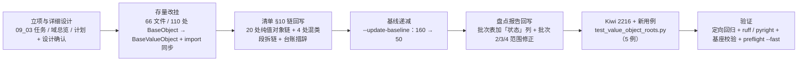

# 01 实施 · 值对象存量归位（批次 1）

> 认证与安全 · 09 类体系根治理 · 子任务 03（需求 09-1，补充需求）· 实施记录

[文档首页](../../../../../../文档首页.md) › [03 值对象存量归位（批次 1）](../09_类体系根治理_03_值对象存量归位.md) › 实施记录　|　[← 任务](../09_类体系根治理_03_值对象存量归位.md)　[测试记录 →](../测试/01_测试_03_值对象存量归位.md)

## 1. 实施信息 

| 项 | 值 |
| --- | --- |
| 任务 | [03 值对象存量归位（批次 1）](../09_类体系根治理_03_值对象存量归位.md) |
| 对应需求 | [09-1](../../../../需求/09_需求_类体系根治理.md#r09-1) |
| 详细设计 | [01 详细设计](../设计/01_详细设计_03_值对象存量归位.md) |
| 实施日期 | 2026-09-28（计划窗口同日，无偏移） |
| 实施人 | minjian |
| 实施环境 | 本地开发机（Python 3.14.4 / uv / ruff 0.6+ / pyright 1.1.411） |
| 提交 | 代码 `feat(基座): 值对象存量归位批次 1（110 处改挂 BaseValueObject；Kiwi 2216）`；文档 `docs(认证与安全): 09_03 值对象存量归位登记回写与实施测试记录` |
| 结论 | 完成（基线 160 → 50；余 50 处按体系分批另立任务） |

## 2. 实施概览 

## 3. 实施过程 

1. **立项与设计**（已提交）：09 域下新建子任务 03（`09_类体系根治理_03_值对象存量归位`），任务文档 + 域总览 + 计划（§1 计数与工时、§3 剩余排期、§4 甘特、§7 第 26 项）三处登记；详细设计定稿（8 项决策确认）。
2. **存量改挂**（一次脚本化改挂，脚本不入库）：按基线快照取 `target_system = value_object` 的 **110 处 / 66 文件**，逐文件把 `class X(BaseObject)` 改为 `class X(BaseValueObject)` 并同步 import——**纯值对象文件 54 个**换 import 为 `from bms_core.core.objects import BaseValueObject`，**混合文件 12 个**（同文件另有框架对象直继承类）保留两条 import；随后 `uv run ruff check --fix .` 校正 isort 顺序（55 处）。
3. **清单 §10 链回写**：`→ BaseObject` → `→ BaseValueObject`——纯值对象段 **20 处**自动改写（判定口径＝括号内容等长遮蔽后，段内反引号类名全在批内）；**4 处混类段拆链**（发件箱 / 事件契约与编排 / 字典 / 系统参数——同段内混有框架对象）；`RateLimitDecision` 与 `ops/` 4 个结果类从「直继承登记补齐」句拆出并改挂；同步更新 §2 分层总览状态列、§10 体系基类承接表、「归位台账与分批」、「存量链路口径」（处数 164 → 50）。
4. **基线递减**：`python3 scripts/tools/base-check/check-backend-base.py . --update-baseline` 重写 `deploy/boundaries/direct_base_object_baseline.json`——**160 → 50 条**（`framework_object` 47 + `data_contract` 3；区域 `libs` 33 + `services` 17），复跑零漂移。
5. **盘点报告回写**：09_01《存量归位盘点报告》§3 分批表加「状态」列（批次 1 已完成、批次 4 随批次 1 清零），修正批次 2（47 → 33 = 数据契约 3 + 框架类 30）与批次 3（29 → 17），并补「当前余量 50 条」分布。
6. **测试**：先登记 Kiwi **2216**（用例先登记、后写码），落 `libs/bms_core/tests/core/test_value_object_roots.py`（5 例：台账冻结 / 归位完整性 AST / 体系根边界 / 直继承合法性全域扫描 / 基线递减口径），护栏自测矩阵 7 例复跑通过。

## 4. 问题与处置 

| # | 问题 / 现象 | 原因 | 处置 |
| --- | --- | --- | --- |
| 1 | 盘点报告批次 1 写「`bms_core` 值对象 110 处」，实测 `bms_core` 为 94 处 | 报告把**全域**值对象数（110 = `bms_core` 94 + `services` 12 + `ops` 4）写进「`bms_core` …」行 | 决策确认后按**全域 110 处**执行，并回写批次表范围与数量（本记录 §6 偏差 1） |
| 2 | 清单链改写脚本首版替换位置错乱 | 用相同的 `→ \`BaseObject\`` token 做 `rindex` 反查，导致「替换末尾 17 处」而非「目标 17 处」 | 改为按**绝对下标自后向前**替换；`git checkout` 回滚后重跑（断言命中数 20） |
| 3 | 3 处纯值对象链（`PoolBudgetRow` / `DbCount` / `MigrationChain`）漏检 | 括号注记内含 `；`、`，`，段内定位被引号内分隔符带偏 | 检测前按与护栏同口径「括号内容**等长遮蔽**为空格」，下标不变且段内干净 |
| 4 | 4 处链段混有框架对象（`ProcessedEventStore` / `EventContractRegistry` / `DictQueryService`+`DictService` / `ConfigService`） | 同行登记多体系类，一个 `→ BaseObject` 覆盖不了两类 | **拆链**：批内类改 `→ BaseValueObject`、批外类保留 `→ BaseObject`（共 4 段，另拆分「直继承登记补齐」句） |
| 5 | 拆链后护栏报「清单登记 `Saga` / `ops` 起始链，但代码未找到该类」 | 链解析会提取段内**含小写字母的 ASCII 词**（中文标签被过滤，`Saga` / `ops` 不会）→ 被当成类名广播成链 | 链段内标签改**纯中文**（「编排值对象」「运维脚本结果类」），英文路径只留括号注记 |
| 6 | 新用例 pyright strict 报 `reportUnknownVariableType`（2 处）+ ruff SIM300 | 局部 `roots = []` / `offenders = []` 推断为 `list[Unknown]`；`_SYSTEM_ROOTS <= found` 被判 Yoda 条件 | 显式标注 `roots: list[str]` / `offenders: list[str]`；改 `found >= _SYSTEM_ROOTS` |
| 7 | 盘点报告新增链接断链 | 报告位于 `实施/`，相对层级比任务文档再深一层，首次少退一级 | `check-links.py` 捕获并修正为 `../../09_类体系根治理_03_…` |

## 5. 验证结果 

| 项 | 命令 / 口径 | 结果 |
| --- | --- | --- |
| 归位规模 | 基线快照 `value_object` 条目 × 文件 | 110 处 / 66 文件（纯值对象文件 54 + 混合文件 12）全部改挂 |
| 残留直继承 | `grep "class .*(BaseObject)"` + 护栏扫描 | 57 类（体系根 7 + 基线 50），无本批类残留 |
| 静态检查 | 后端 `uv run ruff check .` / `ruff format --check .` | All checks passed / 914 files already formatted |
| 类型检查 | 后端 `uv run pyright` | 0 errors / 0 warnings |
| 新增用例 | `uv run pytest -q --cov=bms_core.core.objects libs/bms_core/tests/core/test_value_object_roots.py` | 5 passed / 覆盖率 100% |
| 定向回归 | `uv run pytest -q libs/bms_core/tests services/identity/tests` | **1294 passed / 38 skipped**（64s） |
| 基类护栏 | `python3 scripts/tools/base-check/check-backend-base.py .` | 通过（继承链 654 条 / 直继承 57 类 / 错误码 76 / 迁移链 22） |
| 护栏自测 | `check-backend-base.py --self-test` | 7 例全通过 |
| 基线递减 | `--update-baseline` 后复跑 | 160 → **50** 条，零漂移 |
| 裸集合护栏 | `check-bare-collections.py .` | 通过（基线 554 处豁免、无新增） |
| 基座文档 | `check-base.py .` / `check-links.py .` | 均通过（断链 0 / 失效锚点 0） |
| 本地预检 | `check-preflight.py --fast` | 全部通过（含契约快照、事件契约、api-types 零漂移） |

## 6. 偏差与遗留 

- **偏差 1（台账口径，已回写）**：盘点报告批次 1 的「110」原表述为「`bms_core` 值对象」，实测 `bms_core` 为 94 处；经决策确认按**全域值对象 110 处**（`bms_core` 94 + `services` 12 + `ops` 4）执行，并回写报告 §3 批次表（加「状态」列、修正批次 2 / 3 / 4 范围数量）与 §10「存量链路口径」处数。
- **偏差 2（实施方式，已记录）**：存量改挂以**一次性脚本**完成（脚本置于临时目录、未入库、用后删除），属机械批量改写而非逐处手改；改写结果以护栏 + 台账用例逐项断言兜底。
- **遗留**：
  1. **余 50 处直继承**（数据契约 3 + 框架对象 47）→ 09 后续批次（框架类需逐类判定「非数据对象」语义）；登记[计划 §7 第 26 项](../../../../计划/01_计划_认证与安全.md#followup)。
  2. **08 裸集合批次 1（7 处类字段裸集合）** 未并入本批次 → 仍归 08 域分批任务（本记录 §4 说明）。
  3. `BaseValueObject` 仍无字段；如需为值对象体系增加公共字段（语义变更）→ 另立评估。

## 7. 批次 ①（体系根口径治理与角色链分层） 

本任务 2026-09-28 经拍板扩口：由「值对象存量归位」扩为「归位 + 体系根口径治理 + 角色链分层」，**工时 8h → 32h、状态回 `部分完成`**，按层分批实施（批次 ①~⑥）。

| 项 | 内容 |
| --- | --- |
| 口径判据 | `BaseValueObject` 体系语义定为「**不可变数据类体系根**」；其下角色链按**公共段**成层、**链各自独立 / 长短不一 / 不设固定层数**（引架构 05 原文口径）；**禁止**按「用途 + 统一接口」给异质成员强套契约。回写《架构设计 · 后端基础类体系》「数据类体系语义与角色链」段 +《后端开发规范》§3.1 新增强制条 +《后端基类清单》§2 / §10 |
| 落点台账 | 110 类逐一判定：**层成员 69 / 单类链 40 / 迁出 1**；角色链 **29 层**（链长 2–4 段）。详见 `设计/02_详细设计_角色链分层_03_值对象存量归位.md` |
| 迁移 | `ChatStreamHandle` → `BaseFrameworkObject`（普通类 + 显式 `__init__` + `object_kind = "chat_stream_handle"` + `aclose` 钩子）；消费点 `chat/null.py` 构造与 `services/ai` 测试 `isinstance`，无相等 / 哈希 / 序列化依赖，零影响 |
| 护栏 | `check-backend-base.py` 第 4 项「数据类体系语义」（值对象体系须 `@dataclass(frozen=True)`；框架对象体系不得为 dataclass）+ `--self-test` 增 3 例（未 frozen 拦截 / 框架 dataclass 拦截 / 合规放行），自测 **10 例**全通过 |
| 台账用例 | `test_value_object_roots.py` 台账 110 → **109**（`ChatStreamHandle` 迁出）+ 新增迁出断言（框架对象体系 / 非 dataclass / `object_kind`） |

**问题与处置**：① 机械聚类（按全局共享字段）把 78 个类连成一坨、无法成链 → 改为**先取公共段、再按族聚链、逐级细分**，并逐类校准（判定链 / 字段规格链 / 流程链 / 登记记录链 / 种子数据链在二轮补入，24 → 29 层）；② 新写的护栏签名注解 `-> dict[str, list[...]]` 触发 08 裸集合护栏 2 处 → 改只读抽象 `Mapping` / `Sequence` / `Collection`（**未放宽护栏**）。

**验证**：定向回归 `libs/bms_core/tests` + `services/identity/tests` = **1295 passed / 38 skipped**；`ruff check` / `ruff format --check` / `pyright`（0 errors）全绿；`check-backend-base.py .`（6 项）与 `--self-test`（10 例）通过；`check-bare-collections.py .` 通过（554 基线无新增）；`check-links.py` 通过。

**遗留（批次 ②~⑥）**：29 层角色链逐层落地（选项链 → 令牌链 → 身份 / 认证 / 租户链 → 数据链：运维 / 计数 / 事件 / 检索 / LLM / 出站 / 所有权 / 验证码）与层接口实现；涉及消费方的字段名统一（`trusted`→`allowed`、`tenant_code`→`code`、`sub`→`subject`）随对应批次评估；《后端基类清单》§10 角色链登记随各批回写。

## 8. 批次 ②（选项链落地） 

| 项 | 内容 |
| --- | --- |
| 落点改造 | `core/objects.py` → **包** `core/objects/`：`roots.py`（三个体系根，原内容原样搬迁）、`options.py`（选项链层）、`__init__.py`（统一再导出，`from bms_core.core.objects import …` 路径不变）。链层从 `bms_core.core.objects.roots` 导入体系根——**实测**：链模块若从包根导入会在包初始化未完成时报 `ImportError: cannot import name 'BaseValueObject' from partially initialized module`（循环导入），故固定从 `roots` 导入 |
| 选项链层 | `BaseOptionsContract`（`@dataclass(frozen=True)` + `ABC`，继承 `BaseValueObject`）：公共段 `from_options(options)`（抽象入口）+ 取值助手 `_int_option` / `_str_option` / `_single_char_option` / `_mapping_option`（取键 / 缺省 / 类型与范围校验 / 非法拒启 `PluginError`） |
| 成员改挂 | `CaptchaImageOptions` / `CaptchaSliderOptions` / `CaptchaSmsOptions` / `MaskerOptions` → `BaseOptionsContract`；`captcha/default.py` 的模块级 `_int_option`（28 行）**删除**（18 处调用改 `cls._int_option`），`MaskerOptions.from_options` 的 16 行自写校验改为层助手 |
| 台账与护栏 | 清单 §10 新增「值对象体系角色链」小节（链 / 层 / 公共段 / 成员 / 落点）+ 3 条历史链改写为 `→ BaseOptionsContract`；`roots.py` 落点文本同步（清单 §2/§10、需求 09）；护栏 6 项与自测 10 例复跑通过（值对象体系须 frozen dataclass 对层同样生效） |
| 台账用例 | `test_value_object_roots.py`：台账断言由「单一父类＝`BaseValueObject`」放宽为「单一父类 ∈ `VALUE_OBJECT_BASES`（体系根 + 已落地层）」+ 新增两条（层口径自洽、选项链层契约） |

**问题与处置**：① 包内循环导入（见上，处置：链模块从 `roots` 导入）；② **错误消息文本泛化**：原 `验证码出图选项非法/越界`、`脱敏掩码字符非法…` 统一为 `{类名} 选项非法/越界`（异常类型仍为 `PluginError`，码位不变；全库检索确认**无用例断言消息文本**，仅断言异常类型与解析结果）——属**行为差异（消息文本）**，已回写设计 §4 层接口；③ 观察到的**既有**子集顺序耦合：`libs/bms_core/tests/{captcha,masking} + core/test_service_catalog_startup.py` 同跑会因全局插件注册表已构建而失败——**已用 `git stash` 在改动前的版本复现（同样 11 failed）**，非本次改动引入，全量回归不受影响。

**验证**：受影响定向（captcha / masking / core 全量）通过；全量定向回归 `libs/bms_core/tests` + `services/identity/tests` = **1297 passed / 38 skipped**；`ruff check` / `ruff format --check` / `pyright`（0 errors）全绿；`check-backend-base.py .`（6 项）与 `--self-test`（10 例）通过；`check-bare-collections.py .` 通过（554 基线无新增）；`check-base.py` / `check-links.py` 通过。

**遗留（批次 ③~⑥）**：令牌链（6 层 / 22 类）→ 身份 / 认证 / 租户链 → 数据链 → 回归与记录；《后端基类清单》§10 角色链登记随各批增补。

## 9. 批次 ③（令牌链落地） 

| 项 | 内容 |
| --- | --- |
| 层与成员 | `core/objects/tokens.py` 落 **6 层**：`BaseTokenContract`（`token_type`）/ `BaseRefreshableTokenContract`（承 `BaseTokenContract`；`access_token` + `refresh_token`）/ `BaseTokenSpecContract`（`ttl`）/ `BaseOidcTokenSpecContract`（承 `BaseTokenSpecContract`；`client_id` + `issuer`）/ `BaseTokenClaimsContract`（`subject` + `expires_at` + `issued_at` + `payload`）/ `BaseSecretMaterialContract`（不变式）；**13 个基座侧成员 + `TokenResult` / `IssuedSession` 2 个服务侧成员**改挂 |
| 公共段校准（实施中发现的**设计偏差**，已回写设计 §2 注） | ① `VerifiedToken` 虽含 `token_type` 但语义属声明读取分支 → 只挂 `BaseTokenClaimsContract`（单继承不可同挂两支）；② `UserTokenSpec` **无 `ttl`**（本链唯一）→ 与其余声明类公共段不成立 → 降**单类链**（层成员 69 → 68、单类链 40 → 41）；③ `OidcAccessClaims` **无 `issuer`** → `issuer` 从 `BaseTokenClaimsContract` 公共段剔除 |
| 公共段机器校验 | 各层以 `COMMON_FIELDS`（`ClassVar`）声明本层承接的公共段；层上**不声明字段**（避免改变 dataclass 字段顺序与 `__init__` 位置参数序）；用例按 MRO 汇总校验「公共段在**全部**成员上是 dataclass 字段」 |
| 敏感材料层（安全改进） | `ClientCredentials`（`SECRET_FIELDS=("client_secret",)`）/ `TokenKey`（`("private_key",)`）改 `@dataclass(frozen=True, repr=False)` + 层统一 `__repr__` 遮蔽——密钥 / 口令不再进日志与报错信息；**行为差异：仅 `repr` 文本**（无用例断言 `repr`，`frozen` 与值语义不变） |
| 清单回写 | §10「值对象体系角色链」小节增 **6 行**令牌链（层 / 公共段 / 成员 / 落点）+ 链上层次关系 6 条；历史链改写 3 条（`IssuedSession` / `IdentityClaims` / 服务 JWT 契约两处）并**拆链**（`ServiceTokenSpec` / `UserTokenSpec` / `UserTokenPair` / `VerifiedToken` 各归其位）；**踩坑**：表格行内写 `→` 会被链解析器当链（路径 `core/objects/tokens.py` 被按 `/` 拆成 4 条越界链）→ 行内改用「（细分层，承 `X`）」表述，箭头只留在「链上层次关系」条目 |

**验证**：令牌相关定向 `libs/bms_core/tests/{oauth,idp,security,edge}` = **107 passed**；台账/层用例 11 例通过；全量定向回归 `libs/bms_core/tests` + `services/identity/tests` = **1300 passed / 38 skipped**；`ruff check` / `ruff format --check` / `pyright`（0 errors）全绿；`check-backend-base.py .`（6 项，含新层继承链对账 655 条）通过；`check-bare-collections.py .`（554 无新增）/ `check-base.py` / `check-links.py` 通过。

**遗留（批次 ④~⑥）**：身份 / 认证 / 租户链（8 类，含字段名统一评估）→ 数据链（37 类）→ 回归与记录。

## 10. 批次 ④（身份 / 认证 / 租户链落地） 

| 项 | 内容 |
| --- | --- |
| 层与成员 | `core/objects/identity.py`：`BaseRequestIdentityContract`（`subject` + `user_id` + `scopes` + `service_identity` + `session_id`）→ `AuthContext` / `EdgeIdentity`；`BaseIdentityProfileContract`（`subject` + `username` + `name` + `email`）→ `IdentityUser` / `ExternalIdentity`；`core/objects/auth_results.py`：`BaseLoginResultContract`（`result` + `refresh_token` + `refresh_expires_in`）→ `LoginOutcome` / `RefreshOutcome`、`BaseAuthorizeUrlResultContract`（不变式 + `URL_FIELD` + `url` 统一读取）→ `AuthorizeResult` / `SsoAuthorizeResult`；`core/objects/tenant.py`：`BaseTenantViewContract`（`name` + `domain` + `status` + `tenant_id`；`CODE_FIELD`）→ `TenantContext` / `TenantSnapshot`——**5 层 / 10 成员** |
| 字段名统一（批次 ④ 评估 + **二次复核更正**，2026-09-28 拍板） | ① `TenantContext.tenant_code`：实测自研非测试 **87 处**（属性读 45 / 构造与关键字 10 / 注释与类型 30 / 字符串键 2）、含测试约 **159 处**、跨 **5 个目录**（bms_core 52 / identity 25 / ops 6 / alembic 2 / tenant 2），且 `tenant_code` 同为**平台事件负载键**（`events/platform_events.py` `_TENANT_PAYLOAD`）→ 本批次保持原名 + 层 `CODE_FIELD` 映射，**全域改名转需求 09-2 / 任务 09_04** 独立受理；② `UserInfoResult.sub`：**复核更正为统一**——读点 1 处 + 构造 1 处，属性改 `subject` 与协议面无关（输出键 `sub` 属 `UserInfoResponse` schema，不动）→ **批次 ⑤ 执行**；③ 授权跳转地址 `redirect_url` / `authorize_url` 不统一 → `URL_FIELD` + `url` 属性统一读取（成员仅声明 `URL_FIELD`） |
| 层公共段类型口径 | 层只约束**字段存在与语义**，类型 / 可空性由成员声明：`BaseLoginResultContract.result`（`LoginResult` vs `RefreshResult`）、`BaseIdentityProfileContract.name` / `email`（可空性不统一）——已写入层文档串 |
| 实现取舍（记偏差） | `BaseTenantViewContract` **不提供**统一读取属性：`code` 会与 `TenantSnapshot.code`（dataclass 字段）同名冲突触发 pyright `reportIncompatibleMethodOverride`，而本仓库自研代码**不使用** `pyright: ignore`（全库 0 处）→ 只做 `CODE_FIELD` 映射声明，并在层文档串写明原因；`BaseAuthorizeUrlResultContract.url` 无同名冲突故保留统一读取 |
| 清单回写 | §10 角色链小节增 **5 行**（身份 ×2 / 认证结果 ×2 / 租户 ×1）+ 链上层次关系 5 条 + 「字段名不统一（评估不重命名）」说明条目；历史链改写 3 条（`SsoAuthorizeResult` / `ExternalIdentity` / `EdgeIdentity`）并**拆链**（`SsoLoginResult` / `JitResult` / `EdgeTrustDecision` 留体系根） |

**验证**：台账 / 层用例 **12 例**通过（含 `CODE_FIELD` 指向真实字段的映射校验）；定向回归 `libs/bms_core/tests/{api,edge,db,idp}` + `services/identity/tests` = **478 passed / 1 skipped**；`ruff check` / `ruff format --check` / `pyright`（0 errors）全绿；护栏 6 项（继承链 661 条）+ 自测 10 例 + 裸集合 554 无新增 + `check-base` / `check-links` 通过。

**遗留（批次 ⑤~⑥）**：判定 / 数据链（37 类，含 `EdgeTrustDecision.trusted` → `allowed` 评估）→ 回归与记录；**术语统一转出**：租户编码全域改名（`tenant_code` → `code`，含事件负载键兼容窗口、DB 列名不动、测试批量更新、契约文档同步）→ 需求 09-2 / 任务 [09_04](../../09_类体系根治理_04_术语统一/09_类体系根治理_04_术语统一.md)（新增立项，2026-09-28 拍板），`UserInfoResult.sub` → `subject` 随批次 ⑤ 执行。

## 11. 批次 ⑤a（判定 / 字段规格 / 流程 / 登记记录 / 种子数据链落地） 

| 项 | 内容 |
| --- | --- |
| 层与成员 | `core/objects/decisions.py` `BaseDecisionContract`（`allowed`；`reason` 可选）→ `RateLimitDecision` / `ReplayDecision` / `EdgeTrustDecision`；`specs.py` `BaseFieldSpecContract`（`required`）→ `ColumnSpec` / `EventFieldSpec`；`processes.py` `BaseProcessContract`（`definition_key`）→ `ProcessDefinition` / `ProcessInstance`；`registry_records.py` `BaseRegistryRecordContract`（**公共段为成对构造钩子** `from_row()`，抽象类方法；无公共字段）→ `ModuleRecord` / `TableRecord`；`seeds.py` `BaseI18nSeedContract`（`i18n`）→ `SeedItem` / `SeedType`——**5 层 / 11 成员** |
| **17 层逐一取证（先取证后动手）** | 用 AST 脚本对剩余 17 层逐层核对「设计公共段是否在**全部**成员上成立」：**12 层成立**、5 处偏差已回写设计 §2 注 4~6（`MigrationSummary` 无 `describe`；`BaseTallyContract` 的 `total` 在 4 成员上全不成立 → 改不变式 `COUNT_FIELDS` + `counts`；`SearchResult` 无 `index` → 单类链；`TableRef` 无 `service`/前缀 → 单类链；`RateLimitDecision` 无 `reason` → 公共段只留 `allowed`）；层成员 68 → **66**、单类链 41 → **43** |
| 字段名统一①（判定族） | `EdgeTrustDecision.trusted` → `allowed`：改名前实测 **源码 8 处 / 含测试 19 处**（`edge/{null,marker,service_jwt}.py` 构造 6 处 + `api/middleware.py` 属性读 1 处 + 测试 11 处）；`api/middleware.py` 局部变量 `trusted` 与请求态键 `edge_trusted` **不受影响**（非对象字段）；`EdgeTrustDecision` 字段文档串同步更新为「是否放行」 |
| 字段名统一②（身份侧） | `UserInfoResult.sub` → `subject`：构造 1 处（`oidc_provider.py`，值取 `claims.subject`）+ 读取 1 处（`api/oidc.py` 输出 `sub=result.subject`）；**协议键 `sub` 保留在 `UserInfoResponse` schema**（协议面不受影响）；统一后仍为单类链（缺 `username` / `email`，不弱化身画像层公共段 → 设计 §2 注 6） |
| 清单回写 | §10 角色链小节增 **5 行** + 链上层次关系 5 条 + 字段名统一说明条目；历史链改写 4 条（`RateLimitDecision` / `EventFieldSpec` / `SeedItem`+`SeedType` 拆链 / `EdgeTrustDecision`）并保留 `SeedAttr` / `EventContract` / `EventSubscription` 于体系根 |
| **踩坑（同一坑犯两次，已固化）** | 清单链行内**不得**出现「ASCII 标识符 + `→`」组合：① 把 `（`trusted` 已统一为 `allowed`）` 写进链段括号内 → 解析出伪链 `trusted → allowed`；② 在说明条目里写 ``EdgeTrustDecision.trusted` → `allowed`` → 同样解析出伪链。护栏报「清单登记 `trusted` 起始链，但代码未找到该类」即为该症状；修法＝链行内标签只用纯中文，字段改名说明改用「统一命名为」表述 |

**验证**：台账 / 层用例 **14 例**通过（新增判定链 `allowed` 统一断言 + 登记记录链抽象钩子断言）；定向回归 `libs/bms_core/tests/{edge,core,ratelimit,replay,workflow,transfer,dict,events,services}` + `services/identity/tests` = **545 passed / 1 skipped**；全量定向 `libs/bms_core/tests` + `services/identity/tests` = **1303 passed / 38 skipped**；`ruff check` / `ruff format --check` / `pyright`（0 errors）全绿；护栏 6 项（继承链 666 条）+ 自测 10 例 + 裸集合 554 无新增 + `check-base` / `check-links` 通过。

**遗留（批次 ⑤b）**：数据链 12 层 / 28 成员（运维报告 / 健康 / 计数汇总 / 字段规则 / 验证码 / 事件 ×2 / 检索 / LLM / 出站 ×2 / 所有权）按设计 §2 注 5 的校准结论落地；批次 ⑥ 收口（回归与记录）。

## 12. 批次 ⑤b1（运维报告 / 健康 / 计数汇总 / 字段规则 / 验证码 / 检索链落地） 

| 项 | 内容 |
| --- | --- |
| 层与成员 | `reports.py` `BaseOpsReportContract`（**成对输出方法** `describe()`，抽象入口）→ `DatabaseTarget` / `DbCount` / `PoolBudgetRow`；`health.py` `BaseHealthResultContract`（`ok`）→ `HealthCheckResult` / `HealthCheckReport`；`tally.py` `BaseTallyContract`（**不变式** `COUNT_FIELDS` + `counts`）→ `DispatchResult` / `OwnershipStats`；`field_rules.py` `BaseFieldRuleContract`（`field`）→ `MaskRule` / `ScopeCondition`；`captchas.py` `BaseCaptchaContract`（`captcha_id` + `kind` + `scene`）→ `CaptchaChallenge` / `CaptchaCredential`；`search.py` `BaseSearchContract`（`index`）→ `SearchQuery` / `SearchDocument`——**6 层 / 13 成员** |
| **取证揪出的第 6 处设计错误** | 实施前读成员真实字段发现：`ImportResult`（`rows` / `errors`）与 `MigrationSummary`（`succeeded` / `skipped` / `failed`）是**明细元组**（`tuple[...]`）而非整数计数 → 与 `BaseTallyContract` 的「整数计数位」语义不同（若强行纳入，`counts` 会返回元组而不是计数）→ **移出该层转单类链**（层成员 4 → 2），并回写设计 §2 注 7；层成员 66 → **64**、单类链 43 → **45** |
| 抽象钩子层层落地 | `BaseOpsReportContract.describe()`（运维命令统一渲染入口）与 `BaseOptionsContract.from_options()` / `BaseRegistryRecordContract.from_row()` 同构：**层声明抽象入口、成员实现**；三个成员签名一致（`-> str`）故可抽象化（改造点：层加 `ABC` 基） |
| 不变式层落地 | `BaseTallyContract` 不声明字段，只承接「有哪些整数计数位」：成员以 `COUNT_FIELDS` 声明（`DispatchResult` 4 位 / `OwnershipStats` 3 位），层提供 `counts` 只读映射（`Mapping[str, int]`，避免裸 `dict` 触发集合护栏）；**不提供 `total`**（各成员总数语义不同，设计已实证） |
| 清单回写 | §10 角色链小节增 **6 行** + 链上层次关系 6 条；历史链改写 5 条并拆链（验证码 / 发件箱 / 迁移与排序 / 数据所有权 / 数据拓扑）；**二次踩坑**：改写时把 `keyset 游标载荷` 写进链段（小写 ASCII 词）→ 护栏报「清单登记 `keyset` 起始链，但代码未找到该类」→ 再次印证「链段标签只用纯中文」 |

**验证**：台账 / 层用例 **16 例**通过（新增运维报告链抽象钩子断言 + 计数汇总 `COUNT_FIELDS` / `counts` 断言）；全量定向 `libs/bms_core/tests` + `services/identity/tests` = **1305 passed / 38 skipped**；`ruff check` / `ruff format --check` / `pyright`（0 errors）全绿；护栏 6 项（继承链 671 条）+ 自测 10 例 + 裸集合 554 无新增 + `check-base` / `check-links` 通过。

**遗留（批次 ⑤b2）**：事件快照往返 / 事件记录 / LLM / 出站 HTTP / 出站投递 / 所有权链（6 层 / 13 成员）→ 批次 ⑥ 收口。

## 13. 批次 ⑤b2（事件契约 / 事件记录 / LLM / 出站 HTTP / 出站投递 / 所有权链落地） 

| 项 | 内容 |
| --- | --- |
| 层与成员 | `event_contracts.py` `BaseSnapshotRoundTripContract`（**成对方法** `to_snapshot()` / `from_snapshot()`，抽象）→ `EventContract` / `EventSubscription`；`event_records.py` `BaseEventRecordContract`（`event_id` + `event_type` + `tenant_id` + `payload` + `status`）→ `OutboxRecord` / `DeadLetterRecord`；`llm.py` `BaseLlmResultContract`（`model` + `provider_key`）→ `ChatResult` / `EmbeddingResult` / `OcrResult`；`outbound.py` `BaseHttpResponseContract`（`status_code` + `headers` + `content`）→ `HttpResponse` / `ServiceResponse`；`delivery.py` `BaseDeliveryResultContract`（`delivered`）→ `SendResult` / `WebhookResult`；`ownership.py` `BaseOwnershipContract`（`service` + `PREFIX_FIELD` 映射）→ `OwnershipViolation` / `OwnershipException`——**6 层 / 13 成员** |
| 快照往返层（成对钩子） | 事件契约与订阅的 `to_snapshot` / `from_snapshot` 签名一致（`-> Mapping` / `entry: Mapping -> Self`）故抽象化；`EventFieldSpec` 虽也实现该对方法，但已挂**字段规格链**（单继承不可同挂两支）→ 保持字段规格层成员（对照令牌链 `VerifiedToken` 的同类处置） |
| 前缀位映射（第三处「只声明映射」） | `OwnershipViolation.prefix` / `OwnershipException.target_prefix` 历史不同名 → 层以 `PREFIX_FIELD` 声明承载字段、**不提供读取属性**（`prefix` 会与 `OwnershipViolation.prefix` 字段同名冲突，同租户层 `code` 口径）；用例断言映射指向真实字段 |
| 清单回写 | §10 角色链小节增 **6 行** + 链上层次关系 6 条；历史链改写 4 条并拆链（发件箱 / 事件契约 / 服务间调用 / 数据所有权），`TableRef`、`ServiceRequest`、`ServiceCallPolicy`、`SegmentedSaga` 等保持体系根 |
| 回归面注意 | 改造 13 个成员的 import 时，同文件另有 `BaseValueObject` 使用者的（`llm/base.py` 的 `ChatMessage`、`notify/base.py` 的 `NotificationMessage`、`outbound/webhook.py` 等）须**保留双 import**——`ruff` / `pyright` 会以「未定义 `BaseValueObject`」暴露漏改（本次即靠它兜住 2 处） |

**验证**：台账 / 层用例 **18 例**通过（新增快照往返成对钩子断言 + 所有权前缀映射断言）；全量定向 `libs/bms_core/tests` + `services/identity/tests` = **1307 passed / 38 skipped**；`ruff check` / `ruff format --check` / `pyright`（0 errors）全绿；护栏 6 项（继承链 677 条）+ 自测 10 例 + 裸集合 554 无新增 + `check-base` / `check-links` 通过。

**批次 ⑤ 小结**：**29 层全部落地**（层成员 64 / 单类链 45 / 迁出 1 = 110）；本批次共校准设计 6 处（`VerifiedToken` 双挂 / `UserTokenSpec` 无 `ttl` / `OidcAccessClaims` 无 `issuer` / `MigrationSummary` 无 `describe` / `Tally` 的 `total` 与明细元组 / `SearchResult`、`TableRef`、`RateLimitDecision` 公共段不成立），全部回写设计 §2 注与 §3 计数。

**遗留（批次 ⑥）**：收口回归（全量 `pytest` + 门禁 + `preflight`）、把 6 处校准经验固化到《后端基类清单》§10 说明与《AI 开发规范》。

## 14. 批次 ⑥（收口：全量回归与记录） 

| 项 | 内容 |
| --- | --- |
| 全量回归 | `backend` 工作区全量 `uv run pytest -q` = **1818 passed / 40 skipped**（91s，覆盖 `bms_core` + `bms_platform` + `bms_org` + `identity` + `file` + 其余服务）；`ruff check` / `ruff format --check` / `pyright`（0 errors）全绿 |
| 门禁 | `check-backend-base.py`（6 项，继承链 677 条 ↔ 清单 §10）/ `check-bare-collections.py`（554 无新增）/ `check-base.py` / `check-links.py` / `check-status.py --stage 06_认证与安全 --strict`（397 项 0 不合规）/ `check-preflight.py --fast` 全通过 |
| 基线即台账 | 基线快照 **50 条**（framework_object 47 + data_contract 3，**值对象 0 残留**）——与盘点报告 §3 余量一致；本批次未新增直继承、未手工删条目（无需 `--update-baseline`） |
| **收口发现的存量缺陷（已修）** | `BaseObject._public_fields` 的 dataclass 分支用 `dataclasses.is_dataclass(self)` 判定：ORM 模型（`BaseModel(Base, BaseDataContract)`）**继承** `@dataclass` 体系根后该判定为真，但字段在实例字典而非 dataclass 字段 → `to_dict()` 返回 `{}`（`services/platform` 两例失败：`test_demo_model_inherits_base_object` / `test_fields_and_snowflake_id`）。**根因属 09_01 数据契约归口**（`BaseDataContract` 为 `@dataclass`），本批次修：dataclass 分支加「本类自身声明」判定（`"__dataclass_fields__" in vars(type(self))`），ORM / 非声明子类回退实例字典兜底 → 全量回归转绿 |
| 状态回写 | 09_03 → **已完成 / 2026-09-28**；09 域父任务表与阶段计划同步（09_03 由「剩余任务排期」移入「已完成任务」，甘特删节点；阶段计数 已完成 24 项 / 344h，剩余 11 项 / 96h） |

**收口结论**：110 处值对象全部归位并完成 **29 层角色链**分层（层成员 64 / 单类链 45 / 迁出 1）；《后端基类清单》§10 与代码一致（护栏 677 条相邻关系全对齐）；本任务交付完成。

> 本文档依《[文档生成规范](../../../../../../规范/文档生成规范.md)》编写
