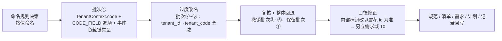

# 01 实施 · 术语统一（命名规则 + 租户视图对象自身编码）

> 认证与安全 · 09 类体系根治理 · 子任务 04（需求 09-2，补充需求）· 实施记录

[文档首页](../../../../../../文档首页.md) › [04 术语统一](../09_类体系根治理_04_术语统一.md) › 实施记录　|　[← 任务](../09_类体系根治理_04_术语统一.md)　[测试记录 →](../测试/01_测试_04_术语统一.md)

## 1. 实施信息 

| 项 | 值 |
| --- | --- |
| 任务 | [04 术语统一](../09_类体系根治理_04_术语统一.md) |
| 对应需求 | [09-2](../../../../需求/09_需求_类体系根治理.md#r09-2) |
| 详细设计 | [01 详细设计](../设计/01_详细设计_04_术语统一.md) |
| 实施日期 | 2026-09-28 |
| 实施人 | minjian |
| 提交 | 代码 `feat(基座): 租户视图对象编码统一为 code + CODE_FIELD 退场 + 事件负载键常量`；文档 `docs(规范+清单): 编码字段命名规则入规范 + 租户链 §10 回写`（及回退提交） |
| 结论 | 完成（命名规则 + `TenantContext.code` + `CODE_FIELD` 退场 + 契约键显式映射；内部标识改造转需求域 10） |

## 2. 实施概览 

## 3. 实施过程 

1. **命名规则（按值命名）**：确立「实体自身编码 → `code`；租户主键（雪花 id） → `tenant_id`；租户业务编码（可变 / 可复用） → `tenant_code`；真 ID → `<实体>_id`」，写入《[后端开发规范](../../../../../../规范/后端开发规范.md)》命名节。
2. **批次①（保留）**：`TenantContext.tenant_code` → `code`（租户视图对象**自身**编码）；`BaseTenantViewContract` 公共段纳入 `code`、`CODE_FIELD` 映射退场；`platform_events` 增 `TENANT_CODE_PAYLOAD_KEY = "tenant_code"` 常量（事件负载键单一来源，保持不变）；消费方与受影响测试同步。
3. **过度改名与回退（关键教训）**：曾把「内部链路里装 `code`、却名为 `tenant_id`」的字段一律改 `tenant_code`（批次 ②~⑥：值对象 / JWT claim / 事件信封 / 请求态键 / API 协议 / DB 列与迁移）。复核发现这些字段是**内部租户标识**，其正确归属是雪花 id（**需求域 10** 处理），改名属治标，且牵连 JWT / 事件契约 / DB 迁移 / 前端类型等破坏面 → **整体回退**（`git revert` 批次 ②~⑥ + 删除 5 个改名迁移 + 契约 / 事件快照 / 前端类型 / 裸集合基线回退），仅保留批次①。
4. **架构改造另立**：新增[需求域 10 租户标识内部化](../../../../需求/10_需求_租户标识内部化.md)（内部以雪花 `tenant_id` 为准，`code` 只在边界），并在需求总览 / 计划登记。

## 4. 问题与处置 

| # | 问题 / 现象 | 处置 |
| --- | --- | --- |
| 1 | 把「装 code 的 `tenant_id`」一律改 `tenant_code`（含 JWT / 事件 / 请求态 / API / DB） | 复核判为**过度改名**：这些是内部租户标识，应改**值**（改传雪花 id）而非改**名** → 整体回退，另立需求域 10 |
| 2 | 事件信封字段改名后与租户事件负载键 `tenant_code` 撞「信封保留键」 | 随批量回退一并撤销（负载键与信封名恢复原状，不再冲突） |
| 3 | 曾误定「code 必须不可变 / 不复用」为前提 | 前提不成立（人为编码必然可改、软删后可复用）→ 改为「内部以雪花 id 为准」的架构方向（需求域 10） |

## 5. 验证结果 

| 项 | 命令 / 口径 | 结果 |
| --- | --- | --- |
| 批次①代码 | `TenantContext.code` / 层公共段含 `code` / 无 `CODE_FIELD` | 落地 |
| 契约键 | `TENANT_CODE_PAYLOAD_KEY == "tenant_code"` | 保持 |
| 静态检查 | `ruff check` / `ruff format --check` | 通过 |
| 类型检查 | `uv run pyright` | 0 error |
| 全量回归 | `uv run pytest -q`（backend 工作区） | **1824 passed / 40 skipped** |
| 基座护栏 | `check-backend-base` / `check-base` / `check-links` | 通过 |
| 本地预检 | `check-preflight.py --fast` | 通过 |

## 6. 偏差与遗留 

- **偏差（已回写）**：本任务一度扩为「全域 `tenant_id` → `tenant_code`」（含 JWT / 事件 / API / DB），经复核属**过度改名**并整体回退；保留命名规则与批次①。
- **遗留**：
  1. **内部租户标识改以雪花 id 为准** → [需求域 10](../../../../需求/10_需求_租户标识内部化.md)（含库键 / 库名、令牌 claim、事件与发件箱、请求态键、缓存与限流键、DB 列迁移与兼容窗口）。
  2. 事件负载键 `tenant_code` 与「内部标识命名」的最终口径随需求域 10 统一评估。

> 本文档依《[文档生成规范](../../../../../../规范/文档生成规范.md)》编写
