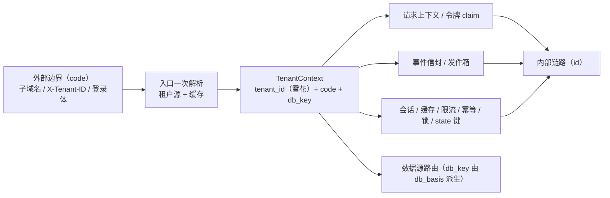

# 01 详细设计 · 租户标识内部化（库键 / 库名落点、兼容窗口、迁移策略）

> 认证与安全 · 10 租户标识内部化 · 子任务 01（需求 10-1，补充需求）· 详细设计

[文档首页](../../../../../../文档首页.md) › [01 详细设计与口径定稿](../10_租户标识内部化_01_详细设计与口径定稿.md) › 详细设计　|　[← 任务](../10_租户标识内部化_01_详细设计与口径定稿.md)　[父任务 →](../../10_租户标识内部化.md)　[需求域 10 →](../../../../需求/10_需求_租户标识内部化.md)

## 1. 设计目标与口径依据 

**把内部租户标识由人为编码 `code` 改为雪花主键 `tenant_id`（`sys_tenant.id`），对外仍以 `code` 表达，边界做一次可缓存的 `code → id` 解析**；消除「改 code = 全链断链」「code 复用 = 串号」隐患，并把租户维度列由 `VARCHAR` 收敛为 `BIGINT`。本任务为**全域前置**：库键 / 库名落点、兼容窗口、迁移策略、命名对齐与失败分支在此定稿并逐项确认后，`10_02`~`10_05` 方可实施。

**依据**：[需求 10-1](../../../../需求/10_需求_租户标识内部化.md#r10-1)、《[架构设计 · 多租户路由](../../../../../../设计/架构设计/12_架构设计_子系统_多租户路由.md)》「租户解析链」「三库命名与建库标准」节、《[架构设计 · 认证与会话](../../../../../../设计/架构设计/14_架构设计_子系统_认证与会话.md)》「双 token 模型」节、《[架构设计 · 事件总线](../../../../../../设计/架构设计/16_架构设计_子系统_事件总线.md)》、《[架构设计 · 服务间通信与分布式一致性](../../../../../../设计/架构设计/37_架构设计_子系统_服务间通信与一致性.md)》、《[后端开发规范](../../../../../../规范/后端开发规范.md)》命名节（按值命名）、[09_04 术语统一详细设计](../../../09_类体系根治理/09_类体系根治理_04_术语统一/设计/01_详细设计_04_术语统一.md)。

**不重复建设**：租户解析链（子域名 → 请求头 → 令牌）、`TenantContext`（已同时携带 `code` 与 `tenant_id`）、`TenantSnapshot`、租户源与缓存（`TenantSource` / `TenantSnapshot`）已交付；本域只**换内部标识**，不重写解析与取数语义。

### 1.1 已定口径（2026-09-28 拍板） 

| # | 事项 | 结论 |
| --- | --- | --- |
| 1 | 库键 / 库名落点 | **保持 code 派生**（`tenant_{code}` / `bms_{service}_{code}`），库键**不作为内部身份载体**；新增对照表 `sys_tenant_database`（`tenant_id` ↔ `db_basis`）保证 code 变更后库键仍可串接 |
| 2 | 对照表结构 | 新增表 `sys_tenant_database`（平台库 `bms_tenant`，归属 tenant 服务）：`tenant_id`（BIGINT，唯一）+ `db_basis`（VARCHAR，创建时编码，稳定不可变）+ 公共字段；一租户一行、服务维度共享同一基 |
| 3 | 库键解析时机 | 解析链库键按对照表 `db_basis` **稳定解析**；`build_tenant_db_key` 仅开通 / 建库时用；**code 变更不重命名库** |
| 4 | 令牌 claim 范围与命名 | 全覆盖统一名 `tenant_id`：用户 access / refresh、OIDC access token、服务 JWT（原 claim `tenant` → `tenant_id`） |
| 5 | claim 值形态 | 雪花 id 以**十进制字符串**存入 claim（规避 64 位精度丢失） |
| 6 | 旧令牌兼容 | **现阶段不设兼容窗口**（新建库 / 新建数据阶段）；不做 code 回退读 |
| 7 | DB 列迁移 | `sys_outbox` / `sys_event_dead_letter` / `sys_user_identity` 租户列 **单次改类型 + 回填**（`VARCHAR(64)` → `BIGINT`） |
| 8 | 会话键 | 租户位改 id，**接受一次强制重登**（无兼容代码）；缓存 / 限流键 TTL 短自然过期 |
| 9 | 事件负载键 | 信封 `tenant_id`=id；平台事件**负载键 `tenant_code` 改 `tenant_id`（值 id）**；`db_key` 负载保留 |
| 10 | 网关注入头 | `X-Tenant-Id` 保持 **code**（外部 / 边界标识，服务入口统一一次解析） |
| 11 | `tenant_id` 缺失 | **必填，缺则拒绝**；演示 / 开发租户以配置固定 id |
| 12 | 迁移执行窗口 | **停机窗口一次性**（DB 迁移 + 代码同批上线） |
| 13 | SSO 映射键 | `sys_user_identity.idp_key` 前缀改 `{tenant_id}`（雪花 id 字符串） |

## 2. 改造基线（现状 → 目标） 

现状：内部链路（令牌 claim / 请求态 / 事件信封 / 发件箱列 / 请求态键 / 缓存与限流键）**实际承载的都是 code**，仅字段名多叫 `tenant_id`（名实不符）；`TenantSnapshot.tenant_id` / `TenantContext.tenant_id` 已含雪花 id，但仅被同库行级过滤消费，非解析链输入键。

目标：**边界（子域名 / `X-Tenant-ID` / 登录体）用 code → 入口一次解析出 `TenantContext`（含雪花 `tenant_id`）→ 内部链路一律以 `tenant_id` 为准**。

## 3. 库键 / 库名落点与对照表 

### 3.1 落点结论 

- **库键 / 库名保持 code 派生**：相对键 `tenant_{code}`、全限定键 `tenant_{service}_{code}`、库名 `bms_{service}_{code}` 形态不变（运维可读、开发库文件名不变）。
- **库键不是内部身份载体**：库键是「运维命名空间」，租户身份一律以雪花 `tenant_id` 为准；库键的 code 段是**创建时冻结的库名基 `db_basis`**，不随租户编码变更而变。
- 由此避免「code 复用 = 串号」在物理层重现：库名基稳定，租户改名 / 复用编码不影响既有库的归属判定（归属经对照表以 `tenant_id` 锚定）。

### 3.2 对照表 `sys_tenant_database` 

| 项 | 口径 |
| --- | --- |
| 归属库 | 平台服务库 `bms_tenant`（归属服务 `tenant`，与 `sys_tenant` 同库） |
| 语义 | 租户主键 ↔ 库名基对照；一租户一行，各服务共享同一基 |
| 关键字段 | `tenant_id`（BIGINT，唯一，逻辑外键 → `sys_tenant.id`）、`db_basis`（VARCHAR(64)，创建时租户编码，稳定不可变）+ `BaseModel` 公共字段 |
| 唯一约束 | `(tenant_id, deleted_at)` 复合唯一（软删除后可重挂） |
| 读写归属 | 写方 = tenant 服务（租户开通 / 建库时写入）；读方 = 租户源（随快照下发 `db_basis`） |
| 字段级结构 | 归《数据库设计》数据表文件 `sys_tenant_database.md`（10_04 落表文件并在总览登记，**不在此复制字段清单**） |

> `sys_tenant.db_key` 废弃列不复活；对照职责由 `sys_tenant_database` 承担（`db_key` 物理删列另立，见 §9）。

### 3.3 库键解析口径 

- `TenantSnapshot` 增字段 `db_basis`（跨服务契约响应同步补该字段）；`to_tenant_context(snapshot)` 改以 `snapshot.db_basis` 派生 `db_key`（`build_tenant_db_key(db_basis)`），`code` 仍为当前编码。
- `build_tenant_db_key(code, *, service=None)` 的 `code` 入参语义收紧为「**库名基 `db_basis`**」（仅开通 / 建库 / 运维建库时调用）；解析链运行期不再由当前 code 现算库键。
- 运维脚本（`ops/provision_tenant.py` / `ops/migrate_tenants.py` / `ops/init_tenant.py` / `ops/seed_tenant.py`）租户维度取数由 `select(SysTenant.code)` 改为「经对照表取 `db_basis`」；新租户开通流程：**先写 `sys_tenant` + `sys_tenant_database`，再建库 / 迁移**。
- **code 变更**：仅改 `sys_tenant.code`（与缓存失效），**不改 `db_basis`、不重命名库**；库名与当前 code 可不一致，由对照表解释。
- **失败分支**：
  - 对照表缺行（存量 / 未 seed）→ 回落到当前 `code` 作 `db_basis` 并记 WARNING（仅过渡容错，不阻断）；建库 / 种子流程须保证新租户必有对照行。
  - `db_basis` 为空 → `build_tenant_db_key` 抛 `ConfigError`（沿用现语义）。
  - 库名形态非法 → `_checked_database_name` 抛 `ConfigError`（沿用）。
- **开发环境**：`[tenant].dev_tenants`（`demo` / `acme`）保持编码，seed 时 `db_basis=code`，SQLite 文件名不变；自动建表仍按 `dev_tenants` 建库。

## 4. 边界解析与请求上下文 

### 4.1 解析链 

| 来源 | 形态 | 解析 | 优先级 |
| --- | --- | --- | --- |
| 子域名 | code（域名命中注册表 `domain`） | `by_domain` | 1 |
| `X-Tenant-ID` | code | `by_code` | 2 |
| 令牌租户位 | **雪花 id（字符串）** | `by_id`（新增） | 3 |

- **新增租户源契约 `TenantLookup.by_id(tenant_id)`**：本地源按 `SysTenant.id` 查、远程契约加 `?tenant_id=` 出口；缓存键 kind 增 `id`（`bms:global:tenant:id:{id}`）。`by_code` / `by_domain` 保留为「外部来源 → 上下文」入口。
- **请求态键**：`state["tenant"]` 仍存 `TenantContext`（含 `code` + `tenant_id` + `db_key`）；`state["tenant_id"]` 语义修正为「**令牌租户位雪花 id**」，且**中间件阶段不再读取**（令牌未验签）——令牌兜底统一在 `require_auth`（`_wire_tenant`，验签后）以令牌 `tenant_id` 经 `by_id` 解析并写请求态与上下文，修复既有「`state["tenant_id"]` 无生产写入」缺口。
- **上下文变量**：`current_tenant` 保持承载**租户编码**（日志 / 展示）；新增 `current_tenant_id` 承载**雪花 id**（内部键统一来源，如缓存 / 限流 / 幂等 / 锁 / state / 会话键），由租户中间件同时设置。
- **跨租户拒绝**：显式来源（子域名 / `X-Tenant-ID`）与令牌 `tenant_id` 不一致时拒（比较解析后的 `TenantContext.tenant_id` 与令牌 id，比较键统一为 id）。
- **`tenant_id` 必填**：`TenantContext.tenant_id` 去可空；源不可达兜底（`RemoteTenantSource` 契约不可达）**不再构造无 id 上下文**，按失败拒绝（`TenantNotFoundError` / 503 维持现语义）；`DEMO_TENANT` 以配置固定 id（`[tenant].demo_tenant_id`，开发 / 测试用）。

### 4.2 失败分支 

| 场景 | 处理 |
| --- | --- |
| 令牌位形态非法（非纯数字） | 视为未命中 / 拒绝（不做 code 回退） |
| 令牌 id 未知 / 租户不存在 | `TenantNotFoundError`（404 / 80001） |
| 租户停用 | `TenantSuspendedError`（403 / 80002） |
| 显式来源 code 解析结果与令牌 id 不一致 | 跨租户拒绝（`AuthError`） |
| 豁免路径（探针 / 文档 / JWKS / introspect） | 不解析（维持现语义） |
| 源不可达且允许兜底 | 无 id 不兜底，拒绝 |

## 5. 令牌 claim 设计 

- **统一字段名 `tenant_id`，值 = 雪花 id 的十进制字符串**（`str(sys_tenant.id)`）。
- 覆盖：用户 access / refresh（`UserTokenSpec.tenant_id`）、OIDC Provider access token、服务 JWT（原 claim `tenant` → `tenant_id`，`ServiceTokenSpec.tenant` → `tenant_id`）；OIDC 的 ID Token 维持无租户位（现状）。
- **读取归一**：`oauth/verify.py` 的租户归一只认 `tenant_id`（不再回退 `tenant`）；解析为 id。
- **网关 / 边缘**：introspect 由令牌 `tenant_id`（id）**解析为 code 后注入 `X-Tenant-Id`**（保持外部头为 code）；服务入口按 code 走 `by_code`（与客户端来源同口径）。
- **旧令牌**：不设兼容窗口，不做 code 回退读；部署（停机窗口）后旧 access / refresh 自然失效，用户重登一次。
- **SSO 链路**：授权跳转时以子域名 / 头解析出 id 并写入流程状态（`idp_state_store`）；回调以 state 记录的 id 为权威；`sys_user_identity.idp_key` 前缀改 `{tenant_id}`（§6.3）。

## 6. 命名对齐清单（按值命名） 

> 规则：装雪花主键 → `tenant_id`（雪花 id）；装租户业务编码 → `tenant_code`；实体自身编码 → `code`；库键 code 段为**库名基**（运维命名）。见《[后端开发规范](../../../../../../规范/后端开发规范.md)》命名节。

### 6.1 请求上下文 / 令牌 / 请求态 

| 载体 | 字段 / 键 | 改造前（值） | 改造后（值） | 落点 |
| --- | --- | --- | --- | --- |
| 请求上下文 | `TenantContext.tenant_id` | 雪花 id（可空、旁路） | 雪花 id（**必填**） | 10_02 |
| 租户快照 | `TenantSnapshot.db_basis` | — | 库名基（新增） | 10_02 |
| 租户上下文 | `TenantContext.db_key` | 由当前 code 派生 | 由 `db_basis` 派生 | 10_02 |
| 请求态 | `state["tenant"]` | `TenantContext` | 同（内容含 id） | 10_02 |
| 请求态 | `state["tenant_id"]` | 读，无生产写入 | 令牌 id，认证后写入 | 10_02 |
| 上下文变量 | `current_tenant` | code | code（展示，保持） | 10_02 |
| 上下文变量 | `current_tenant_id` | — | 雪花 id（新增） | 10_02 |
| 用户 access / refresh | claim `tenant_id` | code（字符串） | **雪花 id 字符串** | 10_02 |
| OIDC access token | claim `tenant_id` | code | 雪花 id 字符串 | 10_02 |
| 服务 JWT | claim `tenant` | code | **`tenant_id`（雪花 id 字符串）** | 10_02 |
| 令牌声明值对象 | `UserTokenSpec.tenant_id` / `ServiceTokenSpec.tenant_id` | code | id | 10_02 |
| 登录态契约 | `AuthContext.tenant` | code | `tenant_id`（id）+ `tenant_code`（展示） | 10_02 |
| 网关注入头 | `X-Tenant-Id` | code | code（保持） | 10_02 |
| 库键对象 | `DbKey.tenant_code` | 库键 code 段 | 库名基（语义收紧，字段名保持） | 10_02 |

### 6.2 事件 / 发件箱 / 缓存与键 

| 载体 | 字段 / 键 | 改造前（值） | 改造后（值） | 落点 |
| --- | --- | --- | --- | --- |
| 事件信封 | `EventEnvelope.tenant_id` | code | 雪花 id 字符串 | 10_03 |
| 事件负载 | 平台事件键 `tenant_code` | code | **`tenant_id`（id）**（常量 `TENANT_CODE_PAYLOAD_KEY` → `TENANT_ID_PAYLOAD_KEY`） | 10_03 |
| 事件负载 | `db_key` | `tenant_{code}` | `tenant_{db_basis}` | 10_03 |
| 发件箱记录 | `OutboxRecord.tenant_id` / `DeadLetterRecord.tenant_id` | code | id | 10_03 |
| 缓存键 | `bms:{tenant}:{域}:{键}` | code | id（`current_tenant_id`） | 10_03 |
| 限流键 | `bms:{tenant}:rate:{维度}:{目标}` | code | id | 10_03 |
| 幂等键 | `bms:{tenant}:idem:{键}` | code | id | 10_03 |
| 分布式锁键 | `bms:{tenant}:lock:{资源}` | code | id | 10_03 |
| IdP 流程状态键 | `bms:{tenant}:{命名空间}:{状态}` | code | id | 10_02 |
| 会话键 | `bms:{tenant}:sess:{会话 id}` | code | id | 10_02 |
| 助手 | `current_code_of` | code | 新增 `current_tenant_id_of`（id）；`current_code_of` 保留供展示 | 10_03 |

### 6.3 数据库与映射表 

| 载体 | 字段 / 表 | 改造前 | 改造后 | 落点 |
| --- | --- | --- | --- | --- |
| 发件箱 | `sys_outbox.tenant_id` | `VARCHAR(64)`（code） | `BIGINT`（id） | 10_04 |
| 死信 | `sys_event_dead_letter.tenant_id` | `VARCHAR(64)`（code） | `BIGINT`（id） | 10_04 |
| 身份映射 | `sys_user_identity.tenant_id` | `VARCHAR(64)`（code） | `BIGINT`（id） | 10_04 |
| 身份映射 | `sys_user_identity.idp_key` | `{tenant_code}:{provider_key}` | `{tenant_id}:{provider_key}` | 10_04 |
| 租户库名对照 | 新表 `sys_tenant_database` | — | `tenant_id` + `db_basis` | 10_04 |
| 幂等账本 | `sys_event_consumed` | 无租户列 | **维持无租户列**（每库隔离；见 §9 开放项） | — |

**失败分支**：漏改（仍以 code 构造 id 位）由 `pyright` 严格模式与用例拦截；事件负载键被误留 `tenant_code` 由契约快照 / 用例拦截。

## 7. 迁移与兼容 

### 7.1 执行方式（停机窗口一次性） 

停机窗口内依次执行：**DB 迁移 → 代码上线 → 冒烟**。不设旧令牌 / 旧数据兼容窗口（新建库 / 新建数据阶段）。

### 7.2 DB 迁移（单次改类型 + 回填） 

- **列表**：`sys_outbox.tenant_id`、`sys_event_dead_letter.tenant_id`（平台链 + 租户链双链）、`sys_user_identity.tenant_id`（平台库）、`sys_user_identity.idp_key` 前缀重写、新表 `sys_tenant_database`（含存量租户回填 `db_basis=当前 code`）。
- **改类型**：`VARCHAR(64)` → `BIGINT`（三库方言兼容：MySQL / PostgreSQL / DM8 `BIGINT`；SQLite 开发库经 Alembic `batch_alter_table`）。
- **回填**：
  - `sys_user_identity`（平台库）：按 `sys_tenant`（`code → id`）映射回填；`idp_key` 前缀同步由 code 改 id。
  - `sys_outbox` / `sys_event_dead_letter` 租户链库：行租户 = 该库所属租户，回填该租户 id。
  - `sys_outbox` / `sys_event_dead_letter` 平台链库：按映射回填（不可解析的租户位保持 `NULL`）。
- **表结构变更顺序（强制）**：先改表文件（含变更记录）→ 改 ORM 模型 → 生成 Alembic 迁移 → 回写总览登记状态（两处一致），见《[AI开发规范](../../../../../../规范/AI开发规范.md)》「数据库与表设计的处理方式」节。

### 7.3 非 DB 兼容与失效 

| 项 | 处理 |
| --- | --- |
| 旧令牌 | 不兼容，停机上线后失效，用户重登一次 |
| 会话 Redis 键 | 租户位改 id，旧会话键失效 → 一次强制重登（无兼容代码） |
| 缓存 / 限流 / 幂等 / 锁键 | TTL 短，自然过期；无迁移 |
| 事件契约快照 | 负载键 `tenant_code` → `tenant_id`，重生成 `deploy/events/contracts.json`（`ops/event_contracts.py`）；消费方按「前置契约」标注 |
| 服务契约快照 | 令牌 / 请求态相关契约快照重生成（零漂移门禁） |

### 7.4 回退方案 

停机窗口内保留**全库备份**；回退 = 恢复备份 + 回滚到上一版本代码。因不设双写 / 双读，回退窗口即停机窗口本身。

## 8. 测试设计与验收映射 

用例**先登记 Kiwi TCMS 再编码**；本任务为设计任务，无自动化用例，口径核对见任务 `测试/` 记录；代码级用例随 `10_02`~`10_05` 登记与实施。断言要点：

| # | 用例（落 10_02~10_05） | 断言要点 | 对应完成标准 |
| --- | --- | --- | --- |
| 1 | 边界一次解析 | 子域名 / 头（code）与令牌（id）均解析出同一 `TenantContext`（`tenant_id` 一致） | 边界一次解析 |
| 2 | 令牌 claim | 用户 / 服务 / OIDC access token 的 `tenant_id` 为雪花 id 字符串 | 内部标识统一 |
| 3 | 事件与发件箱 | 信封 `tenant_id`=id、负载键 `tenant_id`=id、`db_key` 由 `db_basis` 派生 | 事件链路统一 |
| 4 | 键空间 | 会话 / 缓存 / 限流 / 幂等 / 锁键租户位为 id | 键统一 |
| 5 | 库键稳定 | code 变更后 `db_key` 不变（对照表 `db_basis` 稳定） | code 变更不断链 |
| 6 | DB 类型与回填 | 三列 `BIGINT`，存量回填为 id，`idp_key` 前缀为 id | 迁移就位 |
| 7 | 门禁 | 受影响定向 `pytest`、`ruff`、`pyright`、`check-backend-base`、`preflight --fast` 全绿 | 门禁全绿 |

## 9. 登记落点 

| 内容 | 落点 |
| --- | --- |
| 命名规则（按值命名）+ 库键为运维命名 / 对照表口径 | 《[后端开发规范](../../../../../../规范/后端开发规范.md)》命名节（回写补充） |
| 库键由 code 派生但非身份载体、对照表稳定解析 | 《[架构设计 · 多租户路由](../../../../../../设计/架构设计/12_架构设计_子系统_多租户路由.md)》「三库命名与建库标准」节（回写） |
| 事件负载键由 `tenant_code` 改 `tenant_id` | 《[架构设计 · 事件总线](../../../../../../设计/架构设计/16_架构设计_子系统_事件总线.md)》（回写）+ 事件契约快照 |
| 租户链 `TenantContext` / `TenantSnapshot`（`db_basis`） | 《[后端基类清单](../../../../../../后端基类清单.md)》§10（回写） |
| 新表 `sys_tenant_database` + 三表列变更 | 《[数据库设计总览](../../../../../../设计/数据库设计/01_数据库设计_总览.md)》「已设计数据表登记」+ 表文件（`sys_tenant_database.md` 新建；`sys_outbox.md` / `sys_event_dead_letter.md` / `sys_user_identity.md` 追加变更记录） |
| 方言实测（`BIGINT` 类型变更） | 《[数据库设计 · 方言特性](../../../../../../设计/数据库设计/方言特性/01_MySQL.md)》（MySQL / PostgreSQL / DM8） |
| 任务 / 域总览 / 计划状态 | 本任务文档、[域总览](../../10_租户标识内部化.md)、[认证与安全计划](../../../../计划/01_计划_认证与安全.md) |
| 实施 / 测试记录 | 本目录 `实施/`、`测试/` |

## 10. 与相邻任务职责边界 

| 任务 | 职责 |
| --- | --- |
| 10_01（本任务） | 口径定稿、库键 / 对照表 / 兼容 / 迁移策略、命名对齐与失败分支；**不改代码 / 不迁库** |
| 10_02 | 令牌 claim（用户 / 服务 / OIDC）改 `tenant_id`=id；边界 `code → id` 解析（`by_id`、请求态、上下文变量、`AuthContext`、会话键、SSO 流程 / IdP state、网关 introspect code 解析） |
| 10_03 | 事件信封 / 发件箱记录 / 平台事件负载键 / 缓存与限流 / 幂等 / 锁键租户位改 id |
| 10_04 | DB 列迁移（三表）+ 模型 + `sys_tenant_database` 表 + 数据库设计回写（表文件 / 总览 / 方言） |
| 10_05 | 收口回归与记录 |
| 09_04（已交付） | 命名规则 + `TenantContext.code` + `CODE_FIELD` 退场；**契约键 `tenant_code` 保持**——本任务口径 9 覆盖其「事件负载键保持」结论，10_03 须回写 09_04 相关用例断言 |
| 依赖方 | 跨服务事件消费方（产品仓库）按「前置契约」标注负载键变更 |

## 11. 边界与开放项 

- **`sys_event_consumed` 是否加租户列**：本期**不加**（每服务 / 每租户独立库已隔离）；若后续出现同库多租户场景再评估。
- **`ai_chat_log.tenant_id` 半成品**（`BigInteger` 但未写入）：归 AI 能力阶段，不在本域范围。
- **`sys_tenant.db_key` 废弃列物理删列**：另立运维 / 迁移任务，本域不处理。
- **网关 introspect `id → code` 解析开销**：经租户源缓存（TTL 60s）缓解；真实压测随 10_05 或安全专项评估。
- **跨服务事件契约破坏**：负载键 `tenant_code → tenant_id` 属破坏性变更，产品仓库消费方需按阶段计划「前置契约」协调；本仓库内 `deploy/events/contracts.json` 同步重生成。
- **对照表缺行过渡容错**：回落当前 code 并记 WARNING，建库 / 种子流程须补齐对照行（防长期并存）。
- **`TenantLookup.by_id` 与缓存 kind `id`**：新增出口需同步远程契约、缓存键规范与各服务装配。

## 12. 对齐记录 

| # | 事项 | 结论（2026-09-28 拍板） |
| --- | --- | --- |
| 1 | 库键 / 库名 | 保持 code 派生；新增对照表 `sys_tenant_database`；库键非身份载体 |
| 2 | 对照表落点 | 新增表 `sys_tenant_database`（平台库 `bms_tenant`）：`tenant_id` + `db_basis` |
| 3 | 库键解析 | 按对照表 `db_basis` 稳定解析；code 变更不重命名库 |
| 4 | 令牌 claim | 全覆盖统一 `tenant_id`=雪花 id 字符串（含服务 JWT `tenant` → `tenant_id`） |
| 5 | 旧令牌兼容 | 现阶段不设兼容窗口 |
| 6 | DB 列迁移 | 单次改类型 + 回填；停机窗口一次性 |
| 7 | 会话键 | 接受一次强制重登 |
| 8 | 事件负载键 | `tenant_code` → `tenant_id`（id）；`db_key` 保留 |
| 9 | 网关注入头 | `X-Tenant-Id` 保持 code |
| 10 | `tenant_id` 缺失 | 必填，缺则拒绝 |
| 11 | `idp_key` 前缀 | 改 `{tenant_id}` |

> 本设计定稿后按《[AI开发规范](../../../../../../规范/AI开发规范.md)》「单任务交付一条龙」自动续行。
> 依《[文档生成规范](../../../../../../规范/文档生成规范.md)》编写
