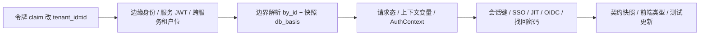

# 01 实施 · 令牌与请求态键（含边界 `code → id` 解析）

> 认证与安全 · 10 租户标识内部化 · 子任务 02（需求 10-1）· 实施记录

[文档首页](../../../../../../文档首页.md) › [02 令牌与请求态键](../10_租户标识内部化_02_令牌与请求态键.md) › 实施记录　|　[← 任务](../10_租户标识内部化_02_令牌与请求态键.md)　[详细设计 →](../设计/01_详细设计_02_令牌与请求态键.md)

## 1. 实施信息 

| 项 | 值 |
| --- | --- |
| 任务 | 02 令牌与请求态键（含边界 `code → id` 解析） |
| 对应需求 | [10-1](../../../../需求/10_需求_租户标识内部化.md#r10-1) |
| 详细设计 | [01_详细设计_02_令牌与请求态键](../设计/01_详细设计_02_令牌与请求态键.md)（域口径见 [10_01 详细设计](../../10_租户标识内部化_01_详细设计与口径定稿/设计/01_详细设计_01_详细设计与口径定稿.md)） |
| 实施日期 | 2026-09-28 |
| 实施人 | minjian |
| 实施环境 | 本地开发机（Python 3.14 / uv / SQLite 测试库） |
| 提交 | `feat(认证与安全): 10_02 令牌 claim 与请求态键改雪花 tenant_id（边界 code→id 解析）` |
| 结论 | 令牌 / 请求态 / 会话 / SSO / 网关 introspect 租户位统一为雪花 id；门禁全绿 |

## 2. 实施概览 

## 3. 实施过程 

1. **令牌与跨服务租户位**：`VerifiedToken.tenant`→`tenant_id`；`ServiceTokenSpec.tenant`→`tenant_id`（claim 名同步改 `tenant_id`）；`AccessTokenSpec` / `OidcAccessClaims` → `tenant_id`；`ServiceRequest.tenant`→`tenant_id`；用户令牌 `UserTokenSpec.tenant_id` 值语义改为雪花 id 字符串。
2. **边缘身份**：`EdgeIdentity` 新增 `tenant_id`（服务 JWT claim 填），`tenant_code` 保留（网关注入头 code）；`EdgeGuardMiddleware` 写请求态 `tenant_id`；`ServiceJwtEdgeTrust` 回落 claim `tenant_id`。
3. **边界解析**：`TenantLookup.by_id` 新增（本地源按 `SysTenant.id`、远程契约 `?tenant_id=`、缓存 kind `id`）；`TenantSnapshot.db_basis`（10_04 落对照表前回落当前 code），`to_tenant_context` 库键由 `db_basis` 派生；`resolve_request_tenant(token_tenant_id=…)` 令牌位按 id 解析（新增 `is_tenant_id`）。
4. **请求态与上下文**：`core/context.current_tenant_id`（id）；`TenantMiddleware` 设置；`AuthContext.tenant`→`tenant_id`+`tenant_code`；`_wire_tenant` 改 async（经租户源 `by_id` 解析、显式来源与令牌 id 不一致即拒）；`current_tenant_id_of` 助手。
5. **会话 / SSO / OIDC / 找回密码**：会话键租户位改 id；`IdpFlowState` 拆 `tenant_code`+`tenant_id`；SSO / JIT `idp_key` 前缀与 `sys_user_identity.tenant_id` 用 id（JIT 白名单、issuer 派生、`?tenant=` 回跳仍用 code）；OIDC 授权码状态键用 id、`AccessTokenSpec.tenant_id=id`；找回密码 org 调用用 id、重置链接 `tenant=` 保持 code；introspect 由令牌 id 经租户源解析 code 注入 `X-Tenant-Id`。
6. **契约与类型**：重生成后端契约快照 `deploy/contracts/{identity,tenant}.json` 与前端 `frontend/packages/api-types/src/{identity,tenant}.ts`；Kiwi 用例登记（id **2217**）并标注 `@pytest.mark.kiwi_id(2217)`。

## 4. 问题与处置 

| # | 问题 / 现象 | 处置 |
| --- | --- | --- |
| 1 | 服务 JWT claim 改 id 使跨服务租户位（`ServiceRequest.tenant`）连带变更，波及 org / config / dict 接收端解析 | 按确认口径「一并改」：字段改 `tenant_id`、值取 id；接收端经 `EdgeIdentity.tenant_id` + `by_id` 解析（10_01 口径 10） |
| 2 | 限流 / 缓存键租户位若一并改 id 会与 10_03 交叠 | 按确认口径「按 10_01 分层」：登录 / SSO 限流键本期维持 code，归 10_03 统一改 id |
| 3 | 平台 / report / search / tenant 等测试默认令牌仍为 code，`_wire_tenant` 按 id 解析失败 | 新增共享假租户源 `tests_support/tenant_source.py` + `tests_support/auth.py` 默认令牌位改雪花 id；各服务 conftest 经 `build_tenant_lookup` 装配假源 |
| 4 | `oidc_provider.discovery` 签名参数名改动触发裸无序集合护栏「新增」 | 基线快照 `deploy/boundaries/bare_collections_baseline.json` 对应条目按新签名更新（同一 `dict` 返回，无净增） |
| 5 | 契约面变化导致前端 `api-types` 漂移 | 重生成 `frontend/packages/api-types/src/{identity,tenant}.ts` |

## 5. 验证结果 

| 完成标准 | 验证方法 | 结果 |
| --- | --- | --- |
| 对外边界仍以 code、入口一次解析、失败拒绝 | `resolve_request_tenant` / `_wire_tenant` / `test_tenant.py` / `test_require_auth.py` | 通过 |
| 令牌 claim 与请求态键统一为雪花 id | 契约字段改名 + 用例（claim / AuthContext / 会话键 / 服务 JWT / OIDC） | 通过 |
| 命名与《后端开发规范》一致 | `tenant_id` / `tenant_code` 按值命名，服务 JWT / OIDC / EdgeIdentity 对齐 | 通过 |
| 定向 pytest / ruff / pyright / 基座校验 / `preflight --fast` | 见测试记录 | 通过 |

## 6. 偏差与遗留 

- **偏差**：
  - 任务原写「旧令牌在兼容窗口内可读」，与 10_01 口径 6（现阶段不设兼容窗口）冲突——任务文档已回写（去除兼容要求）。
  - 限流 / 缓存键租户位本期维持 code（按 10_01 分层归 10_03）。
  - `sys_user_identity.tenant_id` 列类型本期仍 `VARCHAR`（写雪花 id 字符串），列类型改 `BIGINT` 归 10_04。
- **遗留**：
  - 事件信封 / 发件箱 / 缓存与限流 / 幂等 / 锁键租户位改 id → **10_03**；
  - `sys_tenant_database` 对照表落表与 `db_basis` 真实取数、DB 列类型迁移 → **10_04**；
  - 收口回归 → **10_05**；
  - 09_04「事件负载键 `tenant_code` 保持」结论由本域口径 9 覆盖，回写归 10_03。
