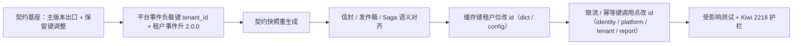

# 01 实施 · 事件与缓存键（事件信封 / 发件箱 / 缓存与限流键租户位）

> 认证与安全 · 10 租户标识内部化 · 子任务 03（需求 10-1）· 实施记录

[文档首页](../../../../../../文档首页.md) › [03 事件与缓存键](../10_租户标识内部化_03_事件与缓存键.md) › 实施记录　|　[← 任务](../10_租户标识内部化_03_事件与缓存键.md)　[详细设计 →](../设计/01_详细设计_03_事件与缓存键.md)

## 1. 实施信息 

| 项 | 值 |
| --- | --- |
| 任务 | 03 事件与缓存键（事件信封 / 发件箱 / 缓存与限流键租户位） |
| 对应需求 | [10-1](../../../../需求/10_需求_租户标识内部化.md#r10-1) |
| 详细设计 | [01_详细设计_03_事件与缓存键](../设计/01_详细设计_03_事件与缓存键.md)（域口径见 [10_01 详细设计](../../10_租户标识内部化_01_详细设计与口径定稿/设计/01_详细设计_01_详细设计与口径定稿.md)） |
| 实施日期 | 2026-09-29 |
| 实施人 | minjian |
| 实施环境 | 本地开发机（Python 3.14 / uv / SQLite 测试库） |
| 提交 | 详细设计 `20c0f020`；代码 `feat(认证与安全): 10_03 事件负载键与缓存限流幂等键租户位改雪花 tenant_id（契约主版本出口）` |
| 结论 | 事件负载键 / 缓存 / 限流 / 幂等键租户位统一为雪花 id；契约兼容规则补主版本出口；门禁全绿 |

## 2. 实施概览 

## 3. 实施过程 

1. **契约基座（`bms_core/events/contracts.py`）**：`check_event_compatibility` 引入 `major_upgraded`（`current.major > previous.major`）——主版本严格升级时删除 / 类型 / 必填性 / 新增必填等破坏性字段变更不再报违规；主版本内维持现行限制；弃用回退 / 版本回退等不豁免。`RESERVED_PAYLOAD_KEYS` 移除 `tenant_id`（信封与负载租户位同名同值）。
2. **平台事件（`bms_core/events/platform_events.py`）**：`TENANT_CODE_PAYLOAD_KEY` → `TENANT_ID_PAYLOAD_KEY = "tenant_id"`；三条租户事件（`tenant.created` / `tenant.suspended` / `tenant.activated`）契约升 `2.0.0`，负载 `tenant_id`（string 必填）+ `db_key` + `status`。
3. **契约快照**：`uv run python -m ops.event_contracts export` 重生成 `deploy/events/contracts.json`（主版本豁免校验通过；仅三条租户事件版本与负载键变化）。
4. **信封 / 发件箱 / Saga 语义对齐**：`EventEnvelope.tenant_id`、`OutboxRecord.tenant_id`、`DeadLetterRecord.tenant_id`、`build_saga_event(tenant_id=…)` 文档统一为「雪花 id 十进制字符串」（类型不变；值语义核对：生产构造点现仅 JIT 一处且已为 id——10_02 顺带）。
5. **服务层助手**：`bms_core/db/tenant.py` 新增 `current_tenant_id_str()`（完整租户上下文优先，回落请求上下文变量；无主键为空）——避免 dict / config 服务层反向依赖 `api/deps`。
6. **缓存键**：dict（`sql.py` 按类型 / 批量 / 翻译，`service.py` 失效）与 config（`sql.py` 取值，`service.py` 失效）的缓存键租户位由 `current_tenant_context().code` 改 `current_tenant_id_str()`；无 id（演示兜底）落 `global`。
7. **限流 / 幂等键租户位**：`platform/api/{codecheck,icon}.py`、`tenant/api/tenant.py`（switch）、`report/api/print.py` 的 `current_code_of` → `current_tenant_id_of`（`my_tenants` 展示参数保持 code）；`identity/services/{auth,sso,password_reset,identity_providers}.py` 限流键租户位改 id（参数按值命名 `tenant_id`；IdP 连通性测试 target 同步改 `f"{tenant_id}:{actor}"`，API 层补 `_require_tenant_id`）。

## 4. 问题与处置 

| # | 问题 / 现象 | 处置 |
| --- | --- | --- |
| 1 | 事件负载键 `tenant_code` → `tenant_id` 与契约基座现行规则冲突（「字段只增不删」无豁免；`tenant_id` 属信封保留键；新增必填被禁） | 按确认口径：三条租户事件升主版本 `2.0.0` + `check_event_compatibility` 补主版本严格升级出口 + `RESERVED_PAYLOAD_KEYS` 移除 `tenant_id`；快照重生成 |
| 2 | dict / config 无请求上下文（直调服务）时缓存键租户位由 `demo` 变 `None`（落 global），2 个真实取数用例失败 | 按口径「演示租户不参与内部 id 键」：用例改为显式设置带雪花主键的完整上下文（模拟请求内），断言缓存键 `bms:1001:…`（护栏） |
| 3 | `password_reset._enforce_ip_limit` 内部调用残留 `tenant=` 关键字（签名改 `tenant_id=`）致 6 个用例 TypeError | 实施中即时修正为 `tenant_id=` 并复跑通过 |
| 4 | icon 幂等断言行超长（ruff E501） | `ruff format` 重排 |
| 5 | 09_04「事件负载键 `tenant_code` 保持」结论与用例口径 | 本任务按 10_01 口径 9 覆盖：常量与断言全面更新为 `tenant_id`；09_04 测试记录作为历史留痕不改，覆盖关系在本任务测试记录注明 |

## 5. 验证结果 

| 完成标准 | 验证方法 | 结果 |
| --- | --- | --- |
| 事件负载键 / 契约版本统一为 `tenant_id`（雪花 id） | 契约用例（负载键 / 版本 / 保留键）+ 快照零漂移 | 通过 |
| 契约兼容规则主版本出口可用且主版本内护栏不退化 | `test_event_contracts.py::test_compatibility_rules`（主版本升级豁免 / 主版本内仍违规逐条） | 通过 |
| 事件信封 / 发件箱值语义为雪花 id | 语义对齐 + JIT 事件用例（既有）+ 发件箱用例 | 通过 |
| 缓存 / 限流 / 幂等键租户位为雪花 id | 定向键形态断言（dict / config / 登录 / SSO / 找回 / IdP / icon / switch / 报表） | 通过 |
| 受影响定向 pytest / ruff / pyright / 基座校验 / `preflight --fast` | 见测试记录 | 通过 |

## 6. 偏差与遗留 

- **偏差**：
  - 任务原「跨服务事件契约在兼容窗口内对齐」按 10_01 口径 6 / 7.1（不设兼容窗口，停机窗口一次性）执行——本任务只重生成快照并登记消费方协调，不做双版本兼容代码。
  - 契约兼容规则放宽为主版本出口（基座行为变更）——已回写《后端基类清单》事件契约条目与《后端开发规范》事件契约强制口径。
  - 「发件箱代码侧读写」实际值语义已为 id（10_02 顺带），本任务以语义对齐 + 护栏断言收口（与任务文档「代码侧读写」表述的预期落差已记录）。
- **遗留**：
  - 产品仓库消费方契约标注（订阅 `supported_majors` 含 2）→ **消费方实现时按其任务文档补「前置契约（已交付）」**（计划 §3.1 已登记）；
  - `sys_outbox` / `sys_event_dead_letter` 列类型迁移与模型（含 `sys_user_identity`）→ **10_04**；
  - 收口回归与覆盖率门槛 → **10_05**；
  - 无租户位的既有键（短信验证码 / 服务间调用限流、文件上传幂等、引擎创建全局锁）不扩租户位 → **维持现状**（如需再评估另立任务）。
