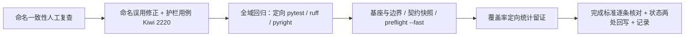

# 01 实施 · 收口回归与记录（全域回归 + 命名一致性护栏 + 完成标准核对）

> 认证与安全 · 10 租户标识内部化 · 子任务 05（需求 10-1）· 实施记录

[文档首页](../../../../../../文档首页.md) › [05 收口回归与记录](../10_租户标识内部化_05_收口回归与记录.md) › 实施记录　|　[← 任务](../10_租户标识内部化_05_收口回归与记录.md)　[详细设计 →](../设计/01_详细设计_05_收口回归与记录.md)

## 1. 实施信息 

| 项 | 值 |
| --- | --- |
| 任务 | 05 收口回归与记录（全域回归 + 命名一致性护栏 + 完成标准核对） |
| 对应需求 | [10-1](../../../../需求/10_需求_租户标识内部化.md#r10-1) |
| 详细设计 | [01_详细设计_05_收口回归与记录](../设计/01_详细设计_05_收口回归与记录.md)（域口径见 [10_01 详细设计](../../10_租户标识内部化_01_详细设计与口径定稿/设计/01_详细设计_01_详细设计与口径定稿.md)） |
| 实施日期 | 2026-09-29 |
| 实施人 | minjian |
| 实施环境 | 本地开发机（Python 3.14.4 / uv / ruff 0.16.6 / pyright 1.1.411 / SQLite 测试库） |
| 提交 | 详细设计 `a8fa63d8`；代码 / 护栏 `feat(认证与安全): 10_05 …` |
| 结论 | 受影响定向回归 1783 passed / 40 skipped；静态、类型、基座与边界、契约快照、`preflight --fast` 全绿；命名护栏落地（Kiwi 2220）；口径与完成标准逐条核对通过 |

## 2. 实施概览 

## 3. 实施过程 

1. **命名一致性复查（人工，全域）**：按《后端开发规范》命名节「按值命名」逐载体核对——请求上下文 / 令牌声明 / 事件信封与负载 / 发件箱与死信 / 身份映射表 / 请求态 / 缓存与限流 / 幂等 / 锁 / 会话 / IdP state / DB 列 / 库键对象（判据见设计 §5.1）。全域 `tenant_code` 出现点 43 个文件，逐类判定后**均属白名单**（外部边界头与子域名、登录体与 SSO 回跳参数、展示与日志、JIT 白名单比对、库键对象字段名 `DbKey.tenant_code`＝库名基、编码形态校验 `is_tenant_code`）。
2. **命名误用修正（3 处 docstring）**：字段名为 `tenant_id`（值为雪花 id）而注释仍写「租户编码」——`bms_core/oauth/user_token.py::UserTokenSpec.tenant_id`、`bms_core/oauth/user_jwt.py::_build_claims(tenant_id=…)`、`services/identity/tests/auth/helpers.py::FakeTokenVerifier.mint(tenant_id=…)`；仅改注释文本，**不改行为与取值**（异常分支替身以编码样字符串作任意值属有意为之，docstring 已注明）。
3. **命名护栏用例落地（Kiwi 2220）**：新增 `libs/bms_core/tests/core/test_tenant_id_naming.py`（6 个用例）——① 载体字段按值命名（`TenantContext` / `TenantSnapshot` 有 `code` + `tenant_id`（+ `db_basis`）且无 `tenant_code`；`AuthContext` / `EdgeIdentity` / `IdpFlowState` 双位；`ServiceTokenSpec` / `UserTokenSpec` / `VerifiedToken` / `EventEnvelope` / `OutboxRecord` / `DeadLetterRecord` 只有 `tenant_id`；`DbKey.tenant_code` 白名单）；② 事件负载键 `tenant_id` 且 `TENANT_CODE_PAYLOAD_KEY` 不得复活；③ `SysOutbox` / `SysEventDeadLetter` 的 `tenant_id` 为 `BigInteger`；④ 键空间 `bms:{id}:…`（无主键落 `global`）与 `current_tenant_id_of` / `current_code_of` 语义；⑤ `is_tenant_id` / `is_tenant_code` 形态互斥；⑥ 源码扫描已退场常量。
4. **全域回归**：定向 `pytest`（`bms_core` + identity / tenant / platform / org / report）→ `ruff check` / `ruff format --check` → `pyright` → 基座校验（`check-base` / `check-backend-base` 含迁移链 / `check-service-boundaries` / `check-bare-collections` / `check-links` / `check-status --stage 06_认证与安全 --strict`）→ 契约快照（`contract_snapshot` / `event_contracts` / `gateway_config`）→ `preflight --fast`，结果见测试记录 §4。
5. **存量格式化漂移修正（收口发现）**：`services/identity/tests/sso/test_jit.py` 在 HEAD 即未通过 `ruff format --check`（多行调用未按 formatter 收敛）；`ruff format` 重排后全量 953 文件通过。
6. **覆盖率定向统计**：受影响范围 `--cov`（含 `ops`）统计留证，见测试记录 §5。
7. **口径与完成标准核对**：按设计 §4 / §7 逐条核对并留证（见测试记录 §3）。
8. **状态两处回写 + 记录**：父任务子任务清单表、计划（已完成表 / 剩余表 / 进度 / 头计数）与任务文档三处一致；实施 / 测试记录落本目录。

## 4. 问题与处置 

| # | 问题 / 现象 | 处置 |
| --- | --- | --- |
| 1 | 任务文档 §2.2 写「旧令牌在兼容窗口内兼容读」，与 10_01 口径 6（现阶段不设兼容窗口）冲突 | 经拍板**回写任务文档**为「不设兼容窗口（停机窗口一次性失效、重登一次，不做 `code` 回退读）」；口径复核 `oauth/verify.py` 租户归一只认 `tenant_id`（无旧 claim / 无 code 回退读） |
| 2 | 设计 §5.2 断言组原拟覆盖令牌 claim 出参、租户事件契约三负载与四个模型列类型 | 实施收敛为**结构性断言 + 不重复既有用例**（令牌声明位由载体字段断言 + Kiwi 2217 承接；事件负载键与保留键由 Kiwi 2218 承接）；服务侧模型（`SysUserIdentity` / `SysTenantDatabase`）列类型**不**在 `bms_core` 用例中断言——避免基座测试反向依赖服务包（违反依赖方向），由 10_04 全链零漂移门禁与 `check-base` 表文件登记一致性承接；**设计已回写**（§5.2 注） |
| 3 | 存量为 `tenant_id` 字段但注释写「租户编码」的残留 3 处 | 一并修正 docstring（不动行为） |
| 4 | 历史迁移 `alembic/versions/identity/platform/0001_sys_user_identity.py` 的 `tenant_id` 列 DDL 注释仍为「租户编码（值传递）」 | **不修**（迁移不可回改；达梦不支持注释变更，10_04 已定「只改类型」）→ 归口计划 §3.1 遗留 32 |
| 5 | `ops/backfill_tenant_id_columns.py` 单测覆盖率 62%（未覆盖达梦同步分支与 `run()` CLI 编排） | 留证并说明：未覆盖部分为真库 / 运维路径，由 10_04 三库真库 drill 承接；**不扩测**（本次确认范围为统计留证），如需达单模块门槛另立测试资产任务 |
| 6 | `services/identity/tests/sso/test_jit.py` 存量未格式化（HEAD 即失败） | `ruff format` 重排（格式零变更语义） |

## 5. 验证结果 

| 完成标准 | 验证方法 | 结果 |
| --- | --- | --- |
| 内部链路租户标识统一为雪花 `tenant_id` | 命名护栏用例 + 10_02~10_04 既有用例 | 通过 |
| 对外仍以 `code` 表达、边界一次解析 | `test_tenant.py` / `test_require_auth.py` / introspect 解析路径复核 | 通过 |
| `code` 变更 / 复用不再断链 / 串号 | 对照表 `db_basis` 稳定解析用例（Kiwi 1019 / 2219）+ 内部键一律 id 的护栏断言 | 通过 |
| 迁移与兼容窗口就位 | `check-backend-base` 迁移链 + 契约快照零漂移；无兼容窗口（口径 6）复核 | 通过 |
| 命名与《后端开发规范》一致 | 全域人工复查 + 自动护栏（Kiwi 2220） | 通过 |
| 受影响门禁与基座校验全绿 | 见测试记录 §4 | 通过 |

## 6. 偏差与遗留 

- **偏差**：
  - 设计 §5.2 断言组按实施收敛（见 §4-2，设计已回写）；
  - 任务文档 §2.2 兼容窗口表述回写（见 §4-1）；
  - 实施内容超出「只读复核」的部分＝命名 docstring 修正 + 新增护栏用例 + 存量格式化修正（均为本次确认口径内的「本任务内一并修正」）。
- **遗留**：
  - `ops/backfill_tenant_id_columns.py` 单测覆盖率 62%（达梦同步分支 / CLI 编排 / 真库引擎路径未覆盖）→ **真库路径由 10_04 三库 drill 承接**；如需单模块门槛另立测试资产任务（已登记[计划 §3.1 遗留 33](../../../../计划/01_计划_认证与安全.md)）；
  - `sys_user_identity.tenant_id` 库内注释陈旧（历史迁移 DDL 注释）→ **归并[计划 §3.1 遗留 32](../../../../计划/01_计划_认证与安全.md)**（达梦注释变更支持，已在该条注明）；
  - 产品仓库跨服务事件消费方「前置契约（已交付）」标注 → **消费方实现时按其任务文档补**（计划 §3.1 遗留 31，本任务无新增）；
  - 10_01 §11 各类开放项（`sys_event_consumed` 租户列、`ai_chat_log` 半成品、`sys_tenant.db_key` 删列）维持原口径不变。

> 本记录随任务收尾回写；状态两处（任务 / 计划）一致。
